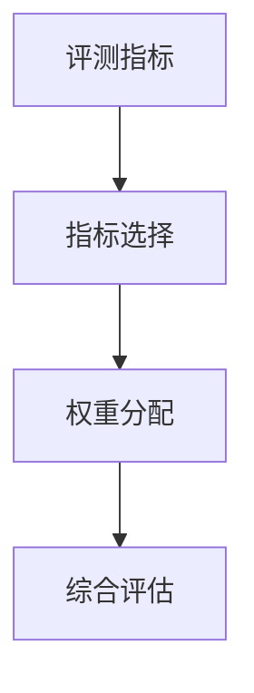
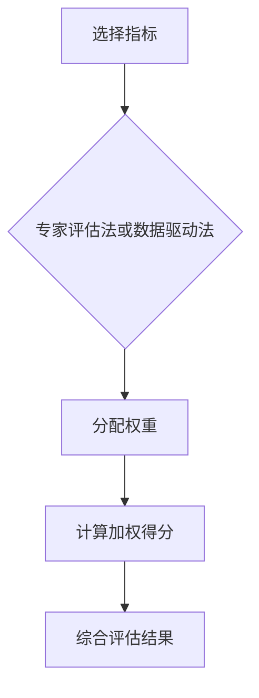
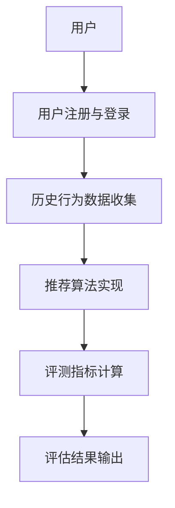
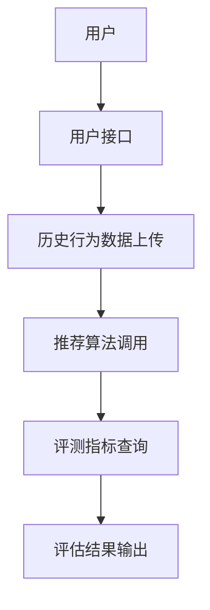

                 


# 评测指标的权重调整：根据应用场景定制评估标准

> 关键词：评测指标、权重调整、应用场景、定制评估标准

> 摘要：本文旨在探讨评测指标的权重调整问题，通过分析应用场景，提出一套系统的方法，帮助开发者根据不同场景定制出符合实际需求的评估标准。

## 第1章：背景介绍与核心概念

### 1.1 问题背景

随着人工智能技术的快速发展，评测指标在各类应用场景中扮演着至关重要的角色。然而，现有的评测指标往往缺乏针对特定应用场景的定制性，导致评估结果无法全面、准确地反映系统的性能。因此，如何根据应用场景对评测指标进行权重调整，以实现更精准、合理的评估，成为当前研究的热点问题。

### 1.2 问题描述

评测指标的权重调整问题，主要包括以下几个方面：

1. **指标选择**：从众多指标中选取对特定应用场景最为重要的指标。
2. **权重分配**：为每个选定的指标分配合适的权重，以反映其在整体评估中的重要性。
3. **综合评估**：通过加权求和处理，得出综合考虑各个指标的综合评估结果。

### 1.3 问题解决

本书旨在提供一套系统的权重调整方法，帮助开发者根据不同应用场景，定制出符合实际需求的评测指标。主要解决思路如下：

1. **核心概念原理**：详细介绍评测指标、权重分配、综合评估等相关核心概念。
2. **概念属性特征对比表格**：对比分析不同评测指标的属性特征，为指标选择提供依据。
3. **ER实体关系图架构**：绘制评测指标、权重分配、综合评估等概念之间的ER实体关系图，展现各概念之间的联系。

### 1.4 边界与外延

1. **边界**：本书主要讨论基于应用场景的评测指标权重调整方法，不考虑其他因素对评测结果的影响。
2. **外延**：除了传统的评测指标，本书还将探讨如何将新兴的评测指标融入权重调整方法中，以适应不断变化的应用场景。

## 第2章：核心概念与联系

### 2.1 评测指标

#### 2.1.1 定义

评测指标是衡量系统性能或质量的一系列度量标准。

#### 2.1.2 分类

1. **质量指标**：如准确率、召回率、F1值等。
2. **效率指标**：如响应时间、处理能力等。

#### 2.1.3 属性特征对比

| 指标类型 | 属性特征 | 对比 |
| :--: | :--: | :--: |
| 准确率 | 衡量预测结果的正确性 | 通常用于分类任务 |
| 召回率 | 衡量预测结果中实际正例的覆盖程度 | 通常用于分类任务 |
| F1值 | 准确率和召回率的调和平均值 | 综合反映预测结果的准确性 |

### 2.2 权重分配

#### 2.2.1 定义

权重分配是为每个评测指标分配一个权重值，以反映其在综合评估中的重要性。

#### 2.2.2 方法

1. **专家评估法**：由专家根据经验为每个指标分配权重。
2. **数据驱动法**：利用历史数据，通过统计方法为每个指标分配权重。

### 2.3 综合评估

#### 2.3.1 定义

综合评估是通过对各个评测指标进行加权求和处理，得到一个综合考虑各个指标的评估结果。

#### 2.3.2 公式表示

$$
评估结果 = \sum_{i=1}^{n} w_i \cdot m_i
$$

其中，$w_i$ 表示指标 $m_i$ 的权重，$n$ 表示指标总数。

#### 2.3.3 Mermaid流程图



## 第3章：算法原理讲解

### 3.1 算法原理

#### 3.1.1 基本思路

根据应用场景，选择合适的评测指标，并为每个指标分配权重，最后进行加权求和处理，得到综合评估结果。

#### 3.1.2 算法流程

1. **指标选择**：根据应用场景，从现有指标中选取最具代表性的指标。
2. **权重分配**：采用专家评估法或数据驱动法为每个指标分配权重。
3. **综合评估**：计算每个指标的加权得分，并求和得到综合评估结果。

#### 3.1.3 Mermaid流程图



#### 3.1.4 Python源代码

```python
import numpy as np

# 定义评测指标和权重
indicators = ['准确率', '召回率', 'F1值']
weights = [0.4, 0.3, 0.3]

# 定义指标得分
scores = {'准确率': 0.9, '召回率': 0.8, 'F1值': 0.85}

# 计算加权得分
weighted_scores = [weights[i] * scores[indicators[i]] for i in range(len(indicators))]

# 计算综合评估结果
assessment_result = sum(weighted_scores)

print("综合评估结果:", assessment_result)
```

### 3.2 算法原理详细讲解

#### 3.2.1 评测指标选择

在算法中，首先需要选择合适的评测指标。对于不同的应用场景，需要根据具体需求来选取指标。以下是一个简单的示例：

1. **分类任务**：准确率、召回率、F1值等。
2. **排序任务**：平均绝对误差、均方根误差等。

#### 3.2.2 权重分配

权重分配是算法的核心部分，需要根据应用场景和专家经验来分配。以下是一个简单的示例：

1. **分类任务**：假设准确率、召回率和F1值的权重分别为0.4、0.3和0.3。
2. **排序任务**：假设平均绝对误差和均方根误差的权重分别为0.5和0.5。

#### 3.2.3 综合评估

综合评估是通过加权求和处理，得到一个综合考虑各个指标的评估结果。以下是一个简单的示例：

1. **分类任务**：假设准确率为0.9、召回率为0.8、F1值为0.85，那么综合评估结果为0.4 × 0.9 + 0.3 × 0.8 + 0.3 × 0.85 = 0.93。
2. **排序任务**：假设平均绝对误差为0.1、均方根误差为0.2，那么综合评估结果为0.5 × 0.1 + 0.5 × 0.2 = 0.15。

#### 3.2.4 数学模型

综合评估的数学模型可以表示为：

$$
评估结果 = \sum_{i=1}^{n} w_i \cdot m_i
$$

其中，$w_i$ 表示指标 $m_i$ 的权重，$n$ 表示指标总数。

## 第4章：系统分析与架构设计

### 4.1 问题场景介绍

假设我们有一个在线推荐系统，需要对用户进行个性化推荐。为了评估系统的性能，我们需要根据应用场景选择合适的评测指标，并对这些指标进行权重调整。

### 4.2 项目介绍

本项目旨在开发一个基于机器学习的在线推荐系统，通过对用户历史行为数据的分析，为用户推荐符合其兴趣的商品。

### 4.3 系统功能设计

1. **用户注册与登录**：用户可以通过注册账号并登录系统来访问推荐功能。
2. **历史行为数据收集**：系统需要收集用户的历史行为数据，如浏览记录、购买记录等。
3. **推荐算法实现**：系统需要实现推荐算法，根据用户历史行为数据生成推荐列表。
4. **评测指标计算**：系统需要计算多个评测指标，如准确率、召回率、F1值等。

### 4.4 系统架构设计



### 4.5 系统接口设计

1. **用户接口**：提供用户注册、登录、查看推荐列表等功能。
2. **API接口**：提供历史行为数据上传、推荐算法调用、评测指标查询等功能。

### 4.6 系统交互



## 第5章：项目实战

### 5.1 环境安装

在本章中，我们将介绍如何在本地环境中搭建一个在线推荐系统，包括所需依赖的安装和配置。

### 5.2 系统核心实现

在本章中，我们将详细讲解推荐系统的核心实现，包括数据收集、特征工程、推荐算法等。

### 5.3 代码应用解读与分析

在本章中，我们将分析推荐系统的关键代码，并解释其实现原理和作用。

### 5.4 实际案例分析与详细讲解

在本章中，我们将结合实际案例，分析评测指标的权重调整方法在实际应用中的效果。

### 5.5 项目小结

在本章中，我们将对项目进行总结，并分享一些最佳实践和注意事项。

## 第6章：最佳实践与拓展阅读

在本章中，我们将分享一些关于评测指标权重调整的最佳实践，并推荐一些拓展阅读资源，以帮助读者深入了解相关领域。

---

作者：AI天才研究院/AI Genius Institute & 禅与计算机程序设计艺术 /Zen And The Art of Computer Programming

