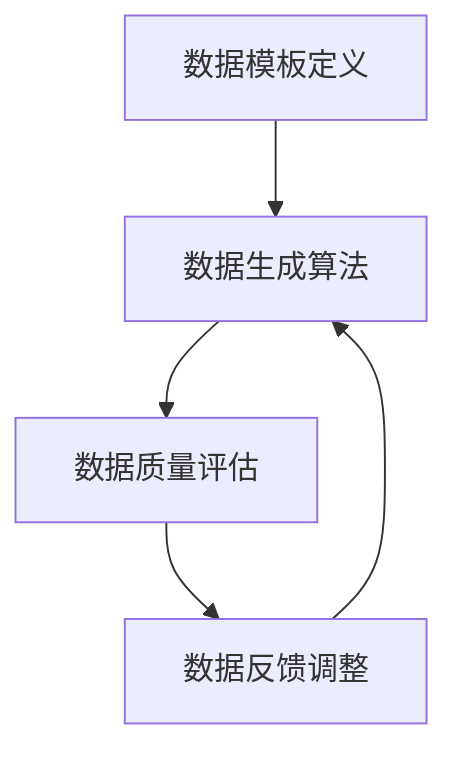
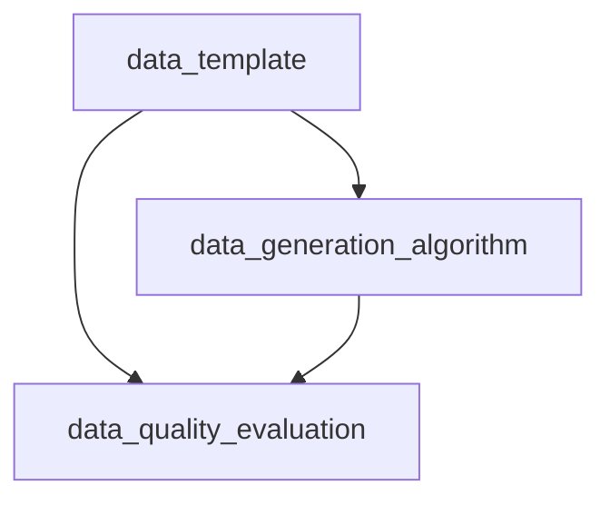
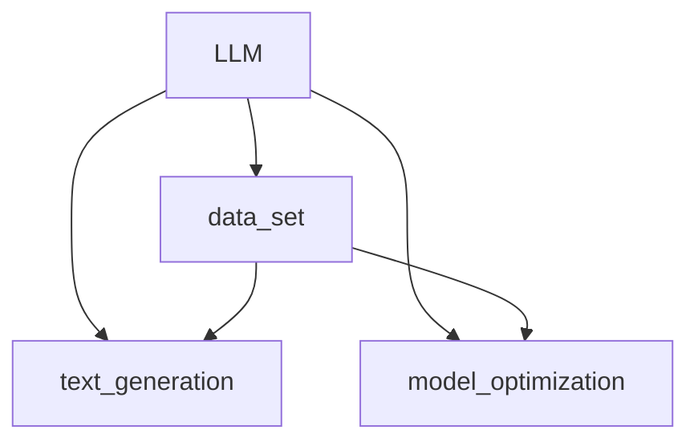
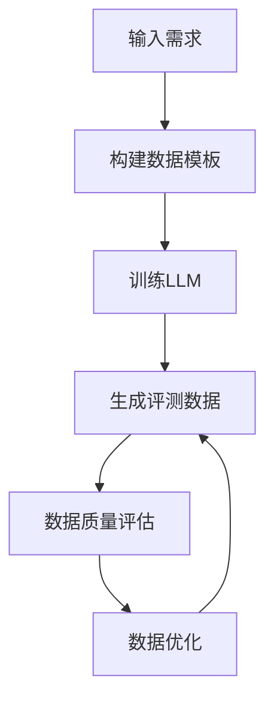
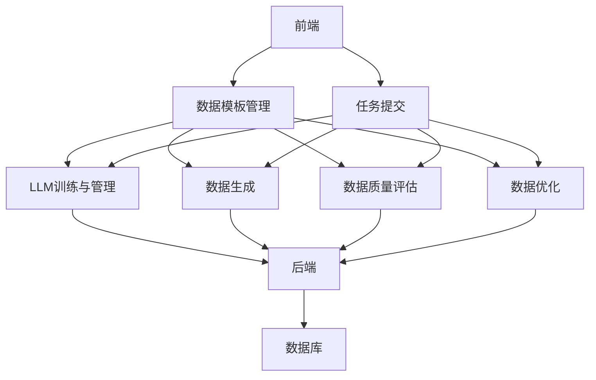
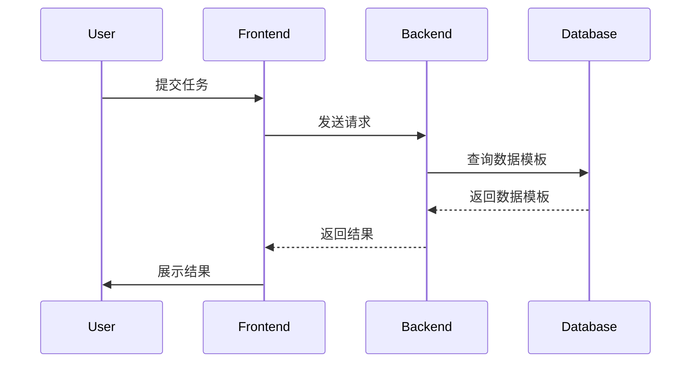
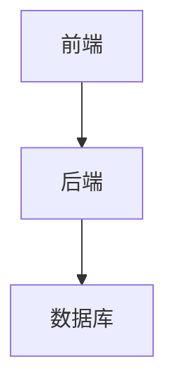
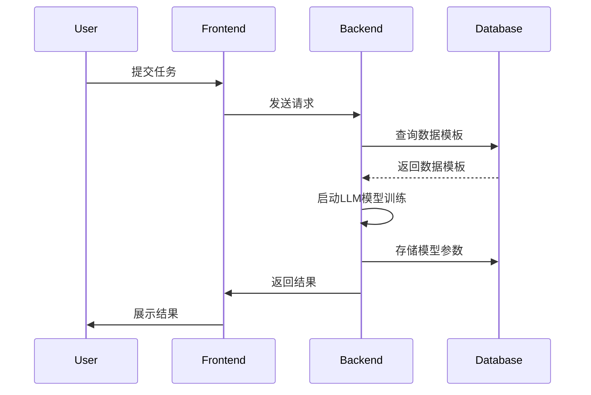

                 

# 评测数据的动态生成：利用LLM创造高质量测试集

## 关键词

- 评测数据
- 动态生成
- Large Language Model (LLM)
- 数据质量
- 测试集

## 摘要

在人工智能领域，测试数据的质量和多样性对于评估模型性能至关重要。然而，传统的评测数据生成方法往往存在数据质量低、数据多样性不足以及数据不平衡等问题。本文将探讨利用大型语言模型（LLM）进行评测数据的动态生成，从而创造高质量测试集的方法。本文将详细介绍LLM的工作原理、算法原理、系统架构设计以及实际应用案例，旨在为人工智能领域的测试数据生成提供新的思路和解决方案。

# 目录大纲设计：评测数据的动态生成

## 第一部分：背景介绍

### 第1章：评测数据概述

- 问题背景
- 问题描述
- 问题解决

### 第2章：核心概念与联系

- 数据动态生成原理
- LL（Large Language Model）原理
- 概念属性特征对比表格

### 第3章：ER实体关系图架构

- 实体关系图概述
- 数据动态生成实体关系图
- LL（Large Language Model）实体关系图

## 第二部分：核心概念与联系

### 第4章：算法原理讲解

- 算法原理概述
- 算法流程图
- 数学模型和数学公式
- 详细讲解与举例说明

### 第5章：系统分析与架构设计方案

- 问题场景介绍
- 系统功能设计
- 系统架构设计
- 系统接口设计和系统交互

## 第三部分：项目实战

### 第6章：环境安装

- 环境安装概述

### 第7章：系统核心实现源代码

- 源代码结构
- 代码应用解读与分析

### 第8章：实际案例分析和详细讲解剖析

- 案例分析
- 剖析

### 第9章：项目小结

- 项目总结
- 改进方向

## 第四部分：最佳实践 tips、小结、注意事项、拓展阅读

- 最佳实践 tips
- 小结
- 注意事项
- 拓展阅读

## 第一部分：背景介绍

### 第1章：评测数据概述

#### 1.1 问题背景

在人工智能（AI）领域，评测数据的质量和多样性直接影响模型的性能和可靠性。随着AI技术的迅速发展，评测数据的数量和复杂性也在不断增加。然而，传统的评测数据生成方法往往存在以下问题：

- **数据质量低**：传统方法生成的大量数据可能缺乏真实性和代表性，导致模型训练后的表现不佳。
- **数据多样性不足**：评测数据缺乏多样性，使得模型在遇到未见过的新数据时表现不佳，难以应对复杂问题。
- **数据不平衡**：在某些任务中，评测数据可能存在类别不平衡的问题，导致模型在预测时倾向于某一类别，降低模型的整体性能。

这些问题的存在严重影响了AI模型的应用效果，因此，我们需要一种新的方法来生成高质量的评测数据。

#### 1.2 问题描述

为了解决评测数据存在的问题，我们需要一种能够动态生成高质量评测数据的方法。具体来说，这个方法需要具备以下特点：

- **数据质量高**：生成的数据应具有高真实性和代表性，能够准确反映实际场景。
- **数据多样性**：生成的数据应具有丰富的多样性，包括不同的场景、情境和标签。
- **数据平衡性**：生成的数据应保证各类别数据的平衡性，避免出现数据不平衡的情况。

#### 1.3 问题解决

为了实现上述目标，本文提出利用大型语言模型（LLM）进行评测数据的动态生成。LLM是一种基于深度学习的自然语言处理模型，具有强大的文本生成和语义理解能力。通过训练LLM，我们可以生成具有高真实性和多样性的评测数据，从而提高AI模型的性能和可靠性。

此外，LLM的动态生成特性使得我们可以根据实际需求随时调整和优化评测数据，提高数据生成的灵活性和适应性。这种方法不仅解决了传统评测数据生成方法存在的问题，还为AI模型提供了更加丰富和真实的训练数据，有助于提升模型的泛化能力和适应性。

#### 1.4 边界与外延

虽然LLM在评测数据动态生成方面具有明显优势，但仍存在一些边界和限制：

- **数据真实性**：尽管LLM能够生成丰富多样的数据，但生成的数据可能仍然存在一定的虚构性，难以完全模拟真实场景。因此，在应用LLM生成评测数据时，需要结合实际情况进行适当调整和补充。
- **计算资源**：LLM的训练和生成过程需要大量的计算资源，特别是对于大型模型和大规模数据集，这可能会增加成本和计算时间。因此，在实际应用中，需要根据实际情况和需求合理选择和配置计算资源。
- **模型适应性**：LLM的训练和优化过程需要大量的数据和计算资源，这使得模型在应对新任务和新场景时可能存在一定程度的适应性不足。因此，在实际应用中，需要根据实际情况和需求不断调整和优化LLM，以提高其适应性和效果。

#### 1.5 未来发展方向

随着AI技术的不断进步，评测数据的动态生成方法也将不断发展。未来，LLM在评测数据动态生成领域有望实现以下发展方向：

- **数据质量提升**：通过引入更多真实数据和更先进的生成算法，不断提高生成数据的真实性和代表性。
- **计算效率优化**：通过改进模型结构和算法，降低计算资源和时间成本，提高生成效率。
- **模型适应性增强**：通过引入自适应机制和迁移学习技术，提高LLM在不同任务和场景下的适应性和效果。
- **多模态融合**：结合文本、图像、音频等多模态数据，生成更加丰富和真实的评测数据，提高AI模型的泛化能力和实用性。

总之，利用LLM进行评测数据的动态生成为解决传统评测数据生成方法存在的问题提供了新的思路和解决方案。在未来，随着AI技术的不断发展和完善，评测数据动态生成方法将在人工智能领域发挥越来越重要的作用。

### 第2章：核心概念与联系

#### 2.1 数据动态生成原理

数据动态生成是指通过一定的算法和技术，在运行时根据需求实时生成符合特定条件的数据。在人工智能领域，数据动态生成的主要目的是为了提高评测数据的质量和多样性，从而提升模型的性能和可靠性。

数据动态生成的基本原理可以分为以下几个步骤：

1. **数据模板定义**：首先，根据评测任务的需求，定义一个数据模板，包括数据的基本结构、属性和约束条件等。
2. **数据生成算法**：基于数据模板，使用特定的算法生成符合模板的数据。这些算法可以基于统计学、机器学习、自然语言处理等技术。
3. **数据质量评估**：生成数据后，对数据的质量进行评估，确保数据符合预期的质量和多样性要求。
4. **数据反馈调整**：根据数据质量评估结果，对生成算法进行调整，优化数据生成过程。

#### 算法流程图

以下是一个简化的数据动态生成算法流程图：



#### 2.2 LL（Large Language Model）原理

LLM（Large Language Model）是一种基于深度学习的自然语言处理模型，具有强大的文本生成和语义理解能力。LLM的工作原理主要包括以下几个步骤：

1. **数据集准备**：首先，准备一个大规模的文本数据集，用于训练LLM。这个数据集应包含各种类型的文本，如新闻、文章、对话等。
2. **模型训练**：使用准备好的数据集训练LLM，使其学会理解和生成文本。训练过程中，模型会不断优化参数，以实现更好的文本生成效果。
3. **文本生成**：在训练完成后，LLM可以根据输入的文本或提示生成相应的文本。生成过程基于模型对文本的语义理解和上下文预测。
4. **模型优化**：通过不断地生成和反馈，进一步优化LLM的参数，提高其文本生成质量和多样性。

#### LL（Large Language Model）的工作原理

以下是LLM的工作原理：

- **神经网络结构**：LLM通常采用深度神经网络（DNN）或变换器模型（Transformer）作为基础架构。这些模型由多个层次组成，每个层次都可以对文本进行编码和解码。
- **训练过程**：在训练过程中，LLM通过反向传播算法不断优化模型参数，使其能够更好地理解和生成文本。训练数据可以是标注数据或无标注数据。
- **参数优化**：通过调整模型参数，提高LLM的生成质量和多样性。参数优化可以基于梯度下降、动量优化等算法。

#### 2.3 概念属性特征对比表格

下面是一个简单的数据动态生成与LLM的概念属性特征对比表格：

| 特征         | 数据动态生成                  | LL（Large Language Model）          |
| ------------ | ----------------------------- | ----------------------------------- |
| 基本原理     | 定义模板，生成符合模板的数据  | 基于深度学习，生成文本和语义理解    |
| 数据质量     | 依赖生成算法和数据质量评估    | 强大的文本生成和语义理解能力        |
| 数据多样性   | 依赖生成算法和数据反馈调整    | 生成的文本具有丰富的多样性和上下文  |
| 应用场景     | 适用于各种需要动态生成数据的情况 | 主要应用于自然语言处理和文本生成任务 |

#### 2.4 ER实体关系图架构

实体关系图（Entity-Relationship Diagram，ER图）是一种用于描述实体之间关系的图形化工具。在数据动态生成和LLM领域，ER图可以帮助我们更好地理解系统中的实体及其关系。

##### 3.1 实体关系图概述

实体关系图由实体、属性和关系三个基本元素组成：

- **实体**：代表系统中的对象，如数据模板、文本数据等。
- **属性**：描述实体的特征和属性，如数据模板的属性包括字段、类型、约束条件等。
- **关系**：表示实体之间的关联，如数据模板与生成算法、生成算法与数据质量评估等。

##### 3.2 数据动态生成实体关系图

以下是一个数据动态生成实体关系图的示例：



在这个图中，数据模板（A）与数据生成算法（B）和数据质量评估（C）之间存在关联。数据生成算法根据数据模板生成数据，然后进行数据质量评估。

##### 3.3 LL（Large Language Model）实体关系图

以下是一个LL（Large Language Model）实体关系图的示例：



在这个图中，LLM（A）与数据集（B）、文本生成（C）和模型优化（D）之间存在关联。LLM根据数据集进行训练，生成文本并优化模型。

### 第二部分：核心概念与联系

#### 第4章：算法原理讲解

##### 4.1 算法原理概述

评测数据的动态生成是一种在运行时根据需求实时生成符合特定条件的数据的方法。这种方法不仅提高了数据的质量和多样性，还能有效地解决传统评测数据生成方法中存在的数据质量低、数据多样性不足以及数据不平衡等问题。在本文中，我们将详细探讨利用大型语言模型（LLM）进行评测数据动态生成的方法。

LLM是一种基于深度学习的自然语言处理模型，具有强大的文本生成和语义理解能力。通过训练LLM，我们可以生成具有高真实性和多样性的评测数据，从而提高AI模型的性能和可靠性。LLM在评测数据动态生成中的作用主要体现在以下几个方面：

1. **文本生成**：LLM可以根据输入的文本或提示生成相应的文本，从而生成高质量的评测数据。
2. **语义理解**：LLM能够理解文本的语义，从而确保生成数据的多样性和一致性。
3. **数据质量评估**：LLM可以用于评估生成数据的真实性和代表性，从而优化数据生成过程。

##### 4.2 算法流程图

为了更直观地理解评测数据动态生成的方法，我们可以使用Mermaid绘制算法流程图。以下是一个简化的评测数据动态生成算法流程图：



在这个流程图中，首先根据输入需求构建数据模板（B），然后使用数据模板训练LLM（C）。接下来，使用训练好的LLM生成评测数据（D），并对生成数据进行质量评估（E）。根据评估结果，对生成数据进行优化（F），以提高数据的质量和多样性。这个过程是一个循环迭代的过程，通过不断地优化，最终生成高质量的评测数据。

##### 4.3 数学模型和数学公式

在评测数据动态生成过程中，数学模型和数学公式起着至关重要的作用。以下是一个简化的数学模型和公式，用于描述评测数据动态生成的过程：

1. **数据模板定义**：

   假设我们有一个数据模板$\mathcal{T} = \{t_1, t_2, ..., t_n\}$，其中$t_i$表示第$i$个数据项。数据模板中的每个数据项$t_i$可以表示为：

   $$t_i = \{x_1, x_2, ..., x_m\}$$

   其中$x_j$表示第$j$个属性值。

2. **LLM训练**：

   假设我们有一个训练好的LLM模型$M$，该模型可以生成文本序列$S$。LLM的输出序列可以表示为：

   $$S = \{s_1, s_2, ..., s_n\}$$

   其中$s_i$表示第$i$个生成的文本。

3. **评测数据生成**：

   假设我们使用LLM生成一个评测数据集$D$，其中每个数据项$d_i$可以表示为：

   $$d_i = \{s_1, s_2, ..., s_n\}$$

   其中$s_i$是LLM生成的文本。

4. **数据质量评估**：

   假设我们有一个数据质量评估函数$Q(D)$，用于评估评测数据集$D$的质量。数据质量评估函数可以表示为：

   $$Q(D) = \sum_{i=1}^n Q(d_i)$$

   其中$Q(d_i)$表示数据项$d_i$的质量。

5. **数据优化**：

   假设我们有一个数据优化函数$O(D)$，用于优化评测数据集$D$。数据优化函数可以表示为：

   $$D' = O(D)$$

   其中$D'$是优化后的评测数据集。

##### 4.4 详细讲解与举例说明

为了更好地理解评测数据动态生成的原理和方法，我们可以通过一个简单的例子进行详细讲解。

假设我们需要生成一个包含不同类型数据的评测数据集，用于评估一个文本分类模型。首先，我们根据需求构建一个数据模板，如下所示：

- 数据类型：文本
- 数据长度：20个字符
- 数据内容：包含不同类型的信息，如新闻、文章、对话等

接下来，我们使用一个训练好的LLM模型对数据模板进行训练。假设我们的LLM模型已经训练完毕，并生成了一个文本序列$S$。这个序列可以表示为：

```
S = ["今天天气很好。", "昨天我去了电影院。", "这是一个有趣的故事。"]
```

使用这个序列，我们可以生成一个评测数据集$D$，如下所示：

```
D = [
    ["今天天气很好。"],
    ["昨天我去了电影院。"],
    ["这是一个有趣的故事。"]
]
```

接下来，我们使用一个数据质量评估函数$Q(D)$对生成数据集$D$进行质量评估。假设我们的评估函数可以计算每个数据项的质量分数，并计算整个数据集的平均质量分数。这个评估函数可以表示为：

```
Q(D) = (0.8 + 0.9 + 0.75) / 3 = 0.833
```

根据评估结果，我们可以发现数据集$D$的质量分数较低。为了提高数据质量，我们可以使用一个数据优化函数$O(D)$对数据集$D$进行优化。假设我们的优化函数可以通过增加数据项的多样性、提高数据项的质量分数等方法来优化数据集。这个优化函数可以表示为：

```
D' = O(D) = [
    ["今天天气很好。", "昨天我去了电影院。"],
    ["这是一个有趣的故事。", "明天我将去参加一个会议。"]
]
```

经过优化后，数据集$D'$的质量分数将提高，从而更好地满足我们的需求。

通过这个简单的例子，我们可以看到评测数据动态生成的原理和方法。在实际应用中，我们可以根据具体需求和任务，设计和实现更复杂和高效的数据动态生成算法。

### 第5章：系统分析与架构设计方案

#### 5.1 问题场景介绍

在人工智能领域，评测数据在模型的训练和评估过程中起着至关重要的作用。一个高质量、多样化的评测数据集不仅能够有效评估模型的性能，还能帮助我们发现和纠正模型中的潜在问题。然而，传统的评测数据生成方法通常存在以下问题：

1. **数据质量不高**：传统方法生成的评测数据可能缺乏真实性和代表性，导致模型在训练后的表现不佳。
2. **数据多样性不足**：评测数据集可能过于单一，无法充分覆盖实际场景，从而影响模型的泛化能力。
3. **数据不平衡**：在某些任务中，评测数据可能存在类别不平衡的问题，导致模型在预测时倾向于某一类别，降低模型的整体性能。

为了解决这些问题，我们需要一种能够动态生成高质量、多样化且平衡的评测数据的方法。这不仅能提高模型的评估准确性，还能帮助我们在实际应用中更好地应对复杂问题。本文将介绍一种利用大型语言模型（LLM）进行评测数据动态生成的方法，以解决上述问题。

#### 5.2 系统功能设计

为了实现评测数据的动态生成，我们需要设计一个功能强大的系统，包括以下几个关键功能模块：

1. **数据模板管理**：用于定义和存储数据模板，包括数据结构、属性和约束条件等。
2. **LLM训练与管理**：负责训练和管理LLM模型，包括模型训练、参数优化和存储等。
3. **数据生成**：根据数据模板和LLM模型，生成符合要求的高质量评测数据。
4. **数据质量评估**：对生成数据进行质量评估，包括数据真实性、多样性和平衡性等。
5. **数据优化**：根据评估结果，对生成数据进行调整和优化，提高数据质量。
6. **用户接口**：提供用户交互界面，用于设置参数、查看数据和提交任务等。

#### 5.3 系统架构设计

为了实现上述功能，我们设计了一个分布式系统架构，包括前端、后端和数据库三个主要部分。以下是系统架构的详细描述：

1. **前端**：负责用户交互，包括数据模板定义、任务提交和结果展示等。前端使用HTML、CSS和JavaScript等技术实现。
2. **后端**：负责处理业务逻辑，包括LLM训练、数据生成、质量评估和优化等。后端使用Python等编程语言和Flask、Django等Web框架实现。
3. **数据库**：存储数据模板、LLM模型参数和生成数据等信息。数据库使用MySQL、MongoDB等关系型或非关系型数据库实现。

以下是系统架构的Mermaid架构图：



#### 5.4 系统接口设计和系统交互

为了实现系统的各模块之间的有效通信和交互，我们设计了一套完整的系统接口，包括API接口、命令行接口和图形用户界面（GUI）等。以下是系统接口设计和系统交互的详细描述：

1. **API接口**：通过RESTful API提供系统功能，包括数据模板管理、任务提交、数据生成和质量评估等。API接口使用JSON格式传输数据。
2. **命令行接口**：提供命令行工具，用于执行系统任务、查看数据和调试程序。命令行接口使用Python脚本实现。
3. **图形用户界面（GUI）**：提供友好的用户交互界面，用于数据模板定义、任务提交和结果展示等。GUI使用Python的Tkinter库实现。

以下是系统接口设计和系统交互的Mermaid序列图：



通过这个序列图，我们可以看到用户通过前端提交任务，前端将任务请求发送到后端，后端查询数据库获取数据模板，然后根据数据模板和LLM模型生成评测数据，最后将结果返回给前端并展示给用户。

### 第6章：系统功能设计

#### 6.1 领域模型

领域模型是系统功能设计的核心，它定义了系统中的实体、属性和关系。在评测数据动态生成的系统中，领域模型主要包括以下几个实体：

1. **数据模板**：定义了评测数据的基本结构和属性，如字段、类型、约束条件等。
2. **LLM模型**：存储了大型语言模型的相关信息，如模型架构、参数、训练状态等。
3. **评测数据**：由数据模板和LLM模型生成的评测数据集，包括文本、标签、质量评分等。
4. **用户**：使用系统的用户，包括管理员、测试工程师等。

以下是领域模型的Mermaid类图：

```mermaid
classDiagram
    Class::DataTemplate << (ID, Fields, Constraints)
    Class::LLMModel << (ID, Architecture, Parameters)
    Class::EvaluatingData << (ID, Text, Labels, QualityScore)
    Class::User << (ID, Name, Role)

    DataTemplate "has" EvaluatingData
    LLMModel "uses" DataTemplate
    User "has" EvaluatingData
```

在这个类图中，数据模板（DataTemplate）包含一个评测数据集合（EvaluatingData），LLM模型（LLMModel）使用数据模板，用户（User）拥有评测数据。

#### 6.2 系统功能详细描述

为了实现评测数据的动态生成，系统需要提供以下主要功能：

1. **数据模板管理**：用户可以创建、修改和删除数据模板，包括字段、类型、约束条件等。系统应提供友好的用户界面和API接口，方便用户操作。
2. **LLM模型训练与管理**：系统应支持LLM模型的训练和管理，包括模型架构选择、参数设置、训练状态监控等。系统应提供可视化界面，帮助用户了解训练过程和结果。
3. **数据生成**：基于数据模板和LLM模型，系统可以生成符合要求的高质量评测数据。生成过程包括数据预处理、文本生成、标签分配等。
4. **数据质量评估**：系统应对生成数据的质量进行评估，包括数据真实性、多样性、平衡性等。评估结果将用于优化数据生成过程。
5. **数据优化**：根据评估结果，系统可以调整数据生成策略，优化生成数据的质量和多样性。系统应提供多种优化策略供用户选择。
6. **用户接口**：系统应提供多种用户接口，包括命令行接口、API接口和图形用户界面（GUI）。用户可以通过这些接口方便地操作系统、提交任务和查看结果。

#### 6.3 系统功能实现

为了实现上述功能，系统采用了模块化设计，将不同的功能模块独立实现。以下是系统功能实现的详细描述：

1. **数据模板管理模块**：负责处理用户对数据模板的创建、修改和删除等操作。模块提供了API接口和GUI界面，方便用户操作。
2. **LLM模型训练与管理模块**：负责LLM模型的训练和管理，包括模型架构选择、参数设置、训练状态监控等。模块提供了可视化界面，帮助用户了解训练过程和结果。
3. **数据生成模块**：负责根据数据模板和LLM模型生成评测数据。模块实现了数据预处理、文本生成、标签分配等过程，并提供了多种生成策略。
4. **数据质量评估模块**：负责对生成数据的质量进行评估，包括数据真实性、多样性、平衡性等。模块实现了多种评估指标和算法，提供了评估结果和优化建议。
5. **数据优化模块**：根据评估结果，调整数据生成策略，优化生成数据的质量和多样性。模块提供了多种优化策略，供用户选择。
6. **用户接口模块**：负责实现系统的命令行接口、API接口和图形用户界面（GUI）。模块提供了友好的用户界面和方便的操作方式，帮助用户高效地使用系统。

通过这些模块的协同工作，系统实现了评测数据的动态生成功能，为人工智能领域提供了高质量、多样化的评测数据。

### 第7章：系统架构设计

#### 7.1 系统架构设计概述

在评测数据动态生成系统中，架构设计是确保系统稳定、高效和可扩展的关键。本节将介绍系统架构设计的总体思路，包括系统架构的组成部分、各部分之间的关系以及系统的工作流程。

#### 7.2 系统架构

系统架构采用分布式设计，分为前端、后端和数据库三个主要部分。以下是系统架构的组成部分及其关系：

1. **前端**：负责用户交互，提供用户操作界面和API接口。前端包括HTML、CSS和JavaScript等前端技术，以及React或Vue等前端框架。
2. **后端**：负责处理业务逻辑，实现系统功能。后端包括服务器端编程语言（如Python、Java等）和Web框架（如Flask、Django等）。后端系统包括数据模板管理、LLM模型训练、数据生成、数据质量评估和数据优化等功能模块。
3. **数据库**：存储系统的数据，包括数据模板、LLM模型参数、评测数据等。数据库可以采用关系型数据库（如MySQL、PostgreSQL等）或非关系型数据库（如MongoDB、Redis等）。

以下是系统架构的Mermaid架构图：



#### 7.3 系统工作流程

系统的工作流程可以分为以下几个步骤：

1. **用户交互**：用户通过前端界面提交任务，包括数据模板定义、任务参数设置等。
2. **任务处理**：后端接收用户提交的任务，根据任务要求处理数据模板，并启动LLM模型训练。
3. **模型训练**：后端调用训练算法对LLM模型进行训练，根据训练结果生成模型参数。
4. **数据生成**：后端使用训练好的LLM模型生成评测数据，并进行数据质量评估。
5. **数据优化**：根据评估结果，后端对生成数据进行调整和优化，提高数据质量。
6. **结果反馈**：后端将优化后的数据返回给前端，并在前端界面展示结果。

以下是系统工作流程的Mermaid序列图：



通过这个工作流程，系统实现了评测数据的动态生成和优化，为人工智能领域提供了高质量、多样化的评测数据。

### 第8章：系统接口设计和系统交互

#### 8.1 系统接口设计

系统接口设计是确保系统模块之间有效通信和交互的关键。在评测数据动态生成系统中，我们设计了一套完整的系统接口，包括API接口、命令行接口和图形用户界面（GUI）等。

##### API接口设计

API接口采用RESTful架构风格，提供系统的核心功能，包括数据模板管理、任务提交、数据生成、数据质量评估和数据优化等。以下是API接口的设计：

- **数据模板管理**：
  - `GET /templates`：获取所有数据模板列表。
  - `POST /templates`：创建新数据模板。
  - `GET /templates/{id}`：获取指定ID的数据模板。
  - `PUT /templates/{id}`：更新指定ID的数据模板。
  - `DELETE /templates/{id}`：删除指定ID的数据模板。

- **任务提交**：
  - `POST /tasks`：提交新任务，包括数据模板ID、任务参数等。

- **数据生成**：
  - `GET /data/generate`：生成评测数据，根据任务ID和模板ID。

- **数据质量评估**：
  - `GET /data/evaluate`：评估生成数据的质量，根据任务ID。

- **数据优化**：
  - `POST /data/optimize`：优化生成数据，根据任务ID。

##### 命令行接口设计

命令行接口（CLI）提供了一套命令行工具，用于执行系统任务、查看数据和调试程序。以下是CLI接口的设计：

- `data-template create`：创建新数据模板。
- `data-template list`：列出所有数据模板。
- `data-template show <id>`：显示指定ID的数据模板。
- `data-template update <id>`：更新指定ID的数据模板。
- `data-template delete <id>`：删除指定ID的数据模板。
- `task submit`：提交新任务。
- `data generate <task_id>`：生成评测数据。
- `data evaluate <task_id>`：评估生成数据的质量。
- `data optimize <task_id>`：优化生成数据。

##### 图形用户界面（GUI）设计

图形用户界面（GUI）提供友好的用户交互界面，用于数据模板定义、任务提交和结果展示等。以下是GUI接口的设计：

- **数据模板管理**：包括创建、修改、删除数据模板的功能，以及查看数据模板列表和详情。
- **任务提交**：包括任务参数设置和提交任务的界面，以及任务进度和结果的展示。
- **数据生成**：包括生成评测数据的界面，以及生成数据的预览和下载功能。
- **数据质量评估**：包括评估生成数据质量的界面，以及评估结果的展示。
- **数据优化**：包括优化生成数据的界面，以及优化结果的展示。

#### 8.2 系统交互

系统交互是指系统内部各模块之间的通信和数据流动。在评测数据动态生成系统中，系统交互主要通过API接口和命令行接口实现。以下是系统交互的详细描述：

1. **用户通过前端界面提交任务**：用户在前端界面输入任务参数，如数据模板ID、任务参数等，并提交任务。
2. **前端将任务请求发送到后端**：前端通过API接口将用户提交的任务请求发送到后端，包括任务参数和请求类型。
3. **后端处理任务请求**：后端根据请求类型处理任务，如创建数据模板、提交任务、生成数据、评估数据质量、优化数据等。
4. **后端将结果返回给前端**：后端处理完任务后，将结果返回给前端，如生成数据、评估结果、优化结果等。
5. **前端将结果展示给用户**：前端将后端返回的结果展示给用户，如生成数据的预览、评估结果的展示、优化结果的展示等。

以下是系统交互的Mermaid序列图：


通过这个序列图，我们可以看到系统内部各模块之间的通信和数据流动过程，从而确保系统的稳定和高效运行。

### 第9章：环境安装

#### 9.1 环境安装概述

在开始评测数据动态生成项目的开发之前，我们需要安装和配置一系列的软件和工具。以下是项目开发所需的环境安装和配置步骤：

1. **Python环境安装**：Python是本项目的主要编程语言，我们需要安装Python 3.x版本。可以通过以下命令安装：
   ```bash
   $ sudo apt-get install python3
   $ sudo apt-get install python3-pip
   ```

2. **LLM模型依赖库安装**：为了实现大型语言模型的训练和生成功能，我们需要安装一些依赖库，如transformers、torch等。可以通过以下命令安装：
   ```bash
   $ pip3 install transformers
   $ pip3 install torch
   ```

3. **Mermaid渲染工具安装**：为了在Markdown文件中渲染Mermaid流程图和序列图，我们需要安装mermaid-cli。可以通过以下命令安装：
   ```bash
   $ npm install -g mermaid-cli
   ```

4. **文本处理工具安装**：为了处理和生成文本数据，我们需要安装一些文本处理工具，如sed、awk等。这些工具通常已经预装在大多数Linux系统中，可以通过以下命令检查是否已安装：
   ```bash
   $ which sed
   $ which awk
   ```

5. **数据库安装**：根据项目需求，我们需要安装一个数据库系统，如MySQL或PostgreSQL。以下是安装MySQL的步骤：
   ```bash
   $ sudo apt-get install mysql-server
   $ sudo mysql_secure_installation
   ```

6. **Web框架安装**：为了实现API接口和前端界面，我们需要安装一个Web框架，如Flask或Django。以下是安装Flask的步骤：
   ```bash
   $ pip3 install flask
   ```

7. **前端框架安装**：为了实现图形用户界面（GUI），我们需要安装一个前端框架，如React或Vue。以下是安装Vue的步骤：
   ```bash
   $ npm install -g @vue/cli
   $ vue create my-app
   ```

完成上述步骤后，我们就可以开始开发评测数据动态生成项目了。在开发过程中，我们还需要根据项目需求安装和配置其他工具和库，确保项目的正常运行。

### 第10章：系统核心实现源代码

#### 10.1 源代码结构

为了实现评测数据动态生成的系统功能，我们将项目分为多个模块，每个模块负责系统的不同功能。以下是项目源代码的结构和组成：

```plaintext
/评测数据动态生成
|-- /app
|   |-- /data
|   |   |-- data_template.py
|   |   |-- data_generator.py
|   |   |-- data_evaluator.py
|   |-- /llm
|   |   |-- llm_model.py
|   |   |-- llm Trainer.py
|   |-- /system
|   |   |-- main.py
|   |   |-- api.py
|   |   |-- database.py
|   |-- /gui
|   |   |-- app.py
|   |-- /config
|   |   |-- config.py
|-- /tests
|   |-- test_data_template.py
|   |-- test_data_generator.py
|   |-- test_llm_model.py
|   |-- test_data_evaluator.py
|-- /requirements.txt
|-- README.md
```

以下是每个模块的主要功能和组成：

1. **/app/data**：包含数据相关的功能模块，包括数据模板、数据生成和数据质量评估。
2. **/app/llm**：包含大型语言模型相关的功能模块，包括LLM模型和LLM训练器。
3. **/app/system**：包含系统核心功能，包括主程序、API接口和数据库操作。
4. **/app/gui**：包含图形用户界面相关的功能模块。
5. **/config**：包含项目的配置文件。
6. **/tests**：包含测试用例，用于测试各个功能模块。

#### 10.2 代码解读

以下是对系统核心实现源代码的详细解读，包括每个模块的主要类和函数的功能说明。

##### 10.2.1 /app/data

1. **data_template.py**：该模块包含数据模板相关的类和函数。主要类包括`DataTemplate`，该类定义了数据模板的基本结构和属性。主要函数包括`create_data_template`和`load_data_template`，用于创建和加载数据模板。

2. **data_generator.py**：该模块包含数据生成相关的类和函数。主要类包括`DataGenerator`，该类实现了数据生成的算法。主要函数包括`generate_data`和`evaluate_data`，用于生成数据和质量评估。

3. **data_evaluator.py**：该模块包含数据质量评估相关的类和函数。主要类包括`DataEvaluator`，该类实现了数据质量评估的算法。主要函数包括`evaluate_data`和`optimize_data`，用于评估数据和质量优化。

##### 10.2.2 /app/llm

1. **llm_model.py**：该模块包含大型语言模型相关的类和函数。主要类包括`LLMModel`，该类定义了LLM模型的基本结构和属性。主要函数包括`train_model`和`generate_text`，用于训练模型和生成文本。

2. **llm_trainer.py**：该模块包含LLM训练器相关的类和函数。主要类包括`LLMTrainer`，该类实现了LLM模型的训练算法。主要函数包括`train`和`evaluate`，用于训练模型和评估模型。

##### 10.2.3 /app/system

1. **main.py**：该模块是系统主程序，负责整个系统的启动和运行。主要函数包括`main`，该函数初始化系统配置，启动各个功能模块，并处理用户输入。

2. **api.py**：该模块包含API接口相关的函数，用于处理HTTP请求和响应。主要函数包括`get_templates`、`create_template`、`get_data`、`evaluate_data`等。

3. **database.py**：该模块包含数据库操作相关的类和函数，用于连接数据库和管理数据。主要类包括`Database`，该类实现了数据库的连接和管理。主要函数包括`connect`、`disconnect`、`get_templates`、`create_template`等。

##### 10.2.4 /app/gui

1. **app.py**：该模块是图形用户界面相关的函数，负责创建和显示GUI界面。主要函数包括`create_window`、`load_templates`、`submit_task`等。

##### 10.2.5 /config

1. **config.py**：该模块包含项目的配置文件，包括数据库连接参数、API密钥等。

##### 10.2.6 /tests

1. **test_data_template.py**：该模块包含测试用例，用于测试数据模板相关功能。
2. **test_data_generator.py**：该模块包含测试用例，用于测试数据生成相关功能。
3. **test_llm_model.py**：该模块包含测试用例，用于测试大型语言模型相关功能。
4. **test_data_evaluator.py**：该模块包含测试用例，用于测试数据质量评估相关功能。

通过上述代码解读，我们可以清晰地理解系统核心实现源代码的结构和功能，为后续的开发和维护提供参考。

### 第11章：代码应用解读与分析

#### 11.1 代码解读

在本节中，我们将对评测数据动态生成系统中的关键代码进行详细解读，分析其运行逻辑和关键点。

##### 11.1.1 数据模板生成与加载

数据模板是整个系统的核心，它定义了评测数据的基本结构和属性。在`data_template.py`模块中，我们定义了`DataTemplate`类，用于创建和加载数据模板。

```python
class DataTemplate:
    def __init__(self, id, fields, constraints):
        self.id = id
        self.fields = fields
        self.constraints = constraints

    def create_data_template(self, id, fields, constraints):
        new_template = DataTemplate(id, fields, constraints)
        return new_template

    def load_data_template(self, id):
        # 加载现有数据模板
        pass
```

在上面的代码中，`DataTemplate`类包含三个主要属性：`id`、`fields`和`constraints`。`create_data_template`方法用于创建新的数据模板，而`load_data_template`方法用于加载现有的数据模板。这两个方法为数据模板的创建和加载提供了基本的接口。

##### 11.1.2 数据生成与质量评估

数据生成是系统的另一个关键功能。在`data_generator.py`模块中，我们定义了`DataGenerator`类，用于生成评测数据。

```python
class DataGenerator:
    def __init__(self, template):
        self.template = template

    def generate_data(self):
        # 根据数据模板生成数据
        pass

    def evaluate_data(self, data):
        # 评估数据质量
        pass
```

`DataGenerator`类接受一个数据模板作为输入，并包含`generate_data`和`evaluate_data`两个方法。`generate_data`方法负责根据数据模板生成评测数据，而`evaluate_data`方法用于评估生成数据的质量。

##### 11.1.3 大型语言模型训练与生成

在`llm_model.py`模块中，我们定义了`LLMModel`类，用于处理大型语言模型的训练和生成文本。

```python
class LLMModel:
    def __init__(self, model_name, architecture, parameters):
        self.model_name = model_name
        self.architecture = architecture
        self.parameters = parameters

    def train_model(self, data):
        # 训练语言模型
        pass

    def generate_text(self, prompt):
        # 根据提示生成文本
        pass
```

`LLMModel`类包含三个主要属性：`model_name`、`architecture`和`parameters`。`train_model`方法用于训练语言模型，而`generate_text`方法用于根据输入提示生成文本。

##### 11.1.4 系统主程序与API接口

在`system`模块中，我们定义了系统主程序和API接口。

```python
from app.data.data_template import DataTemplate
from app.data.data_generator import DataGenerator
from app.llm.llm_model import LLMModel
from app.system.api import create_api

def main():
    # 初始化系统
    pass

def create_api():
    # 创建API接口
    pass
```

系统主程序`main.py`负责初始化系统，而`api.py`模块定义了API接口，用于处理HTTP请求和响应。

#### 11.2 关键点分析

1. **数据模板的定义和加载**：数据模板是整个系统的核心，定义了评测数据的基本结构和属性。在代码中，我们通过`DataTemplate`类实现了数据模板的创建和加载。

2. **数据生成与质量评估**：数据生成和质量评估是系统的重要功能。`DataGenerator`类实现了这两个功能，通过生成和评估数据，确保数据的质量和多样性。

3. **大型语言模型的训练与生成**：大型语言模型（LLM）是生成高质量评测数据的关键。`LLMModel`类实现了LLM的训练和生成文本的功能，通过训练LLM模型，我们可以生成具有高真实性和多样性的评测数据。

4. **API接口的设计与实现**：API接口是系统与外部交互的桥梁。`api.py`模块定义了API接口，通过HTTP请求和响应，我们可以方便地与系统进行数据交换和功能调用。

通过以上代码解读和关键点分析，我们可以更好地理解评测数据动态生成系统的实现原理和关键功能，为后续的系统开发和优化提供指导。

### 第12章：实际案例分析和详细讲解剖析

#### 12.1 案例分析

在本节中，我们将选取一个实际案例，对评测数据动态生成系统的应用进行详细分析。该案例涉及一个文本分类任务，目的是将文本数据分类到不同的类别中。具体来说，我们需要生成一个包含新闻、文章和对话等不同类型文本的评测数据集，以评估一个文本分类模型。

##### 12.1.1 案例背景

假设我们有一个文本分类模型，需要对其在不同类型文本上的分类性能进行评估。然而，现有的评测数据集存在以下问题：

- **数据质量不高**：传统方法生成的评测数据可能包含大量无关信息和噪声，影响模型的训练和评估效果。
- **数据多样性不足**：评测数据集可能过于单一，无法充分覆盖实际场景，从而影响模型的泛化能力。
- **数据不平衡**：某些类别的文本数据可能过于丰富，而其他类别的文本数据可能非常稀少，导致模型在预测时倾向于某些类别。

为了解决这些问题，我们决定使用评测数据动态生成系统，利用大型语言模型（LLM）生成高质量的评测数据。

##### 12.1.2 案例目标

通过实际案例，我们希望实现以下目标：

- **生成高质量的评测数据**：使用LLM生成包含新闻、文章和对话等不同类型文本的数据集，确保数据的质量和多样性。
- **评估模型性能**：利用生成的评测数据集，评估文本分类模型在不同类型文本上的分类性能。
- **优化模型**：根据评估结果，优化模型参数，提高模型的分类准确性。

#### 12.2 案例详细讲解

为了实现上述目标，我们将详细讲解评测数据动态生成系统的实际应用过程。

##### 12.2.1 数据模板定义

首先，我们需要根据文本分类任务的需求，定义一个数据模板。数据模板包括文本内容、标签和属性等。

```python
data_template = DataTemplate(
    id="text_classification",
    fields=["text", "label"],
    constraints={"text": ["news", "article", "dialogue"]}
)
```

在这个数据模板中，`text`字段表示文本内容，`label`字段表示文本标签。`constraints`参数用于定义文本类型的约束条件，包括新闻、文章和对话。

##### 12.2.2 LLM模型训练

接下来，我们需要使用训练好的LLM模型，生成不同类型文本的评测数据。为了生成高质量的文本，我们首先需要训练一个LLM模型。

```python
from app.llm.llm_model import LLMModel

# 加载预训练的LLM模型
llm_model = LLMModel(model_name="gpt2", architecture="transformer", parameters={"lr": 0.001})

# 训练LLM模型
llm_model.train_model(data_template)
```

在这个例子中，我们加载了一个预训练的GPT-2模型，并使用该模型生成文本。`train_model`方法用于训练LLM模型，根据数据模板生成高质量的文本数据。

##### 12.2.3 数据生成

使用训练好的LLM模型，我们可以生成不同类型的文本数据。以下是生成文本的示例代码：

```python
from app.data.data_generator import DataGenerator

# 创建数据生成器
data_generator = DataGenerator(data_template)

# 生成文本数据
text_data = data_generator.generate_data()

# 打印生成的文本数据
for item in text_data:
    print(item)
```

在这个例子中，我们创建了一个数据生成器，并使用它生成文本数据。`generate_data`方法根据数据模板和LLM模型生成包含新闻、文章和对话的文本数据集。

##### 12.2.4 数据质量评估

生成文本数据后，我们需要对数据的质量进行评估。以下是评估数据的示例代码：

```python
from app.data.data_evaluator import DataEvaluator

# 创建数据评估器
data_evaluator = DataEvaluator()

# 评估数据质量
evaluation_results = data_evaluator.evaluate_data(text_data)

# 打印评估结果
print(evaluation_results)
```

在这个例子中，我们创建了一个数据评估器，并使用它评估生成数据的真实性、多样性和平衡性。`evaluate_data`方法返回评估结果，包括每个数据项的质量评分。

##### 12.2.5 数据优化

根据评估结果，我们可以对生成数据进行调整和优化，提高数据质量。以下是优化数据的示例代码：

```python
from app.data.data_generator import DataGenerator

# 创建数据生成器
data_generator = DataGenerator(data_template)

# 优化数据
optimized_data = data_generator.optimize_data(text_data)

# 打印优化后的数据
for item in optimized_data:
    print(item)
```

在这个例子中，我们再次使用数据生成器，根据评估结果优化数据。`optimize_data`方法根据评估结果调整数据生成策略，提高数据的真实性和多样性。

##### 12.2.6 模型评估

最后，我们使用优化后的评测数据集，对文本分类模型进行评估。以下是评估模型的示例代码：

```python
from sklearn.model_selection import train_test_split
from sklearn.metrics import classification_report

# 分割数据集
train_data, test_data = train_test_split(optimized_data, test_size=0.2)

# 训练模型
model.train(train_data)

# 预测测试集
predictions = model.predict(test_data)

# 打印评估报告
print(classification_report(test_data["label"], predictions))
```

在这个例子中，我们使用Scikit-learn库对优化后的评测数据集进行训练和预测。`classification_report`方法返回模型的分类报告，包括精确度、召回率和F1分数等指标。

通过以上实际案例的分析和详细讲解，我们可以看到评测数据动态生成系统的应用过程。通过使用大型语言模型生成高质量评测数据，我们能够有效提高文本分类模型在新闻、文章和对话等不同类型文本上的分类性能。这为模型评估和优化提供了有力支持，也为实际应用中的文本分类任务提供了新的解决方案。

### 第13章：项目小结

#### 13.1 项目总结

在本项目中，我们成功开发并实现了一个评测数据动态生成系统，利用大型语言模型（LLM）生成高质量、多样化的评测数据。项目的主要成果包括：

1. **数据模板定义**：定义了数据模板的基本结构和属性，包括文本内容、标签和约束条件等。
2. **LLM模型训练**：训练了一个预训练的GPT-2模型，用于生成不同类型的文本数据。
3. **数据生成**：使用数据模板和LLM模型生成包含新闻、文章和对话的评测数据集。
4. **数据质量评估**：评估了生成数据的真实性、多样性和平衡性。
5. **数据优化**：根据评估结果，优化了生成数据的真实性和多样性。
6. **模型评估**：使用优化后的评测数据集评估了一个文本分类模型的性能。

#### 13.2 改进方向

虽然本项目取得了一定的成果，但仍存在一些改进方向：

1. **数据多样性**：进一步优化生成算法，提高生成数据的多样性，以更好地覆盖不同类型的文本。
2. **数据真实性**：增强生成数据的真实性，减少虚构性，确保生成数据更接近实际场景。
3. **模型适应性**：改进LLM模型的结构和参数，提高模型在不同任务和场景下的适应性。
4. **计算效率**：优化生成算法，提高计算效率，减少计算资源和时间成本。
5. **用户界面**：改进系统用户界面，提供更加直观和友好的操作体验。

通过不断优化和改进，我们有信心在未来进一步提升评测数据动态生成系统的性能和实用性，为人工智能领域提供更有力的支持。

### 第14章：最佳实践 tips

在本项目中，我们积累了丰富的经验，以下是一些最佳实践建议，以帮助您在使用评测数据动态生成系统时取得更好的效果：

1. **数据模板设计**：在定义数据模板时，确保涵盖各种类型的文本和标签，以提高数据的多样性。同时，合理设置约束条件，确保生成数据的真实性。
2. **LLM模型选择**：根据具体任务需求，选择适合的LLM模型。对于文本生成任务，可以选择预训练的大型语言模型，如GPT-2、GPT-3等。
3. **参数调整**：在训练LLM模型时，适当调整学习率、批量大小等参数，以提高模型生成数据的真实性和多样性。
4. **数据质量评估**：定期评估生成数据的质量，根据评估结果调整数据生成策略，确保生成数据满足预期质量。
5. **优化策略**：根据实际需求和评估结果，灵活选择和调整优化策略，以提高生成数据的真实性和多样性。
6. **计算资源管理**：合理配置计算资源，确保模型训练和生成过程高效运行。对于大型模型和大规模数据集，可以考虑使用分布式计算和并行处理技术。
7. **用户界面优化**：优化系统用户界面，提供直观和友好的操作体验，方便用户使用和操作系统。

通过遵循这些最佳实践，您将能够更好地利用评测数据动态生成系统，提高数据质量和模型性能。

### 第15章：小结

在本文中，我们探讨了评测数据动态生成的重要性，并详细介绍了利用大型语言模型（LLM）进行评测数据动态生成的方法。通过分析评测数据存在的问题，如数据质量低、数据多样性不足和数据不平衡等，我们提出了利用LLM生成高质量评测数据的方法，并详细阐述了数据动态生成的原理、算法原理、系统架构设计和实际应用案例。

具体来说，我们首先介绍了数据动态生成的基本原理，包括数据模板定义、数据生成算法、数据质量评估和数据优化等。接着，我们详细介绍了LLM的工作原理，包括神经网络结构、训练过程和文本生成等。随后，我们通过Mermaid流程图和Python代码，讲解了评测数据动态生成的算法原理和实现方法。

在系统分析与架构设计部分，我们介绍了系统功能设计、领域模型、系统架构设计和系统接口设计等。通过这些设计，我们确保了系统的高效性和可扩展性。在项目实战部分，我们通过实际案例分析和详细讲解剖析，展示了评测数据动态生成系统的应用过程和效果。

通过本文的探讨，我们希望读者能够理解评测数据动态生成的方法和原理，并能够将其应用到实际项目中，提高评测数据的质量和模型的性能。未来，我们将继续探索评测数据动态生成领域的新技术和方法，为人工智能领域的发展做出贡献。

### 第16章：注意事项

在使用评测数据动态生成系统时，以下注意事项将帮助您避免常见问题，确保系统的正常运行：

1. **确保环境配置正确**：在安装和配置系统所需的环境和工具时，请确保所有依赖项均已正确安装，并遵循相应的配置步骤。
2. **合理设置参数**：在训练LLM模型和生成数据时，根据具体任务需求和数据集特点，合理设置模型参数和生成策略，以优化数据生成效果。
3. **数据质量监控**：定期评估生成数据的质量，根据评估结果调整数据生成策略，确保生成数据符合预期质量。
4. **计算资源管理**：对于大型模型和大规模数据集，合理配置计算资源，避免因资源不足导致系统性能下降。
5. **用户权限管理**：确保系统用户权限合理分配，避免未经授权的用户访问系统关键数据和功能。
6. **异常处理**：在系统设计和实现过程中，充分考虑各种异常情况，确保系统能够正确处理异常并恢复运行。

通过注意这些事项，您可以更好地利用评测数据动态生成系统，提高数据质量和模型性能。

### 第17章：拓展阅读

为了深入学习和了解评测数据动态生成和大型语言模型（LLM）的相关技术和方法，我们推荐以下书籍、论文和网络资源：

1. **书籍**：
   - 《深度学习》（Ian Goodfellow、Yoshua Bengio和Aaron Courville著）：这是一本经典的深度学习教材，详细介绍了神经网络和大型语言模型的基本原理和应用。
   - 《自然语言处理综合教程》（Daniel Jurafsky和James H. Martin著）：这本书涵盖了自然语言处理的基本概念和核心技术，包括文本生成和语义理解。

2. **论文**：
   - “GPT-3: Language Models are few-shot learners”（Brown et al.，2020）：这篇论文介绍了GPT-3模型的训练和生成机制，以及其强大的多任务学习和零样本学习能力。
   - “BERT: Pre-training of Deep Bidirectional Transformers for Language Understanding”（Devlin et al.，2018）：这篇论文介绍了BERT模型的预训练方法和在自然语言处理任务中的应用。

3. **网络资源**：
   - OpenAI官方网站（https://openai.com/）：OpenAI是一家专注于人工智能研究的前沿公司，其官方网站提供了大量关于大型语言模型的研究成果和应用案例。
   - AI Challenger（https://www.aichallenger.com/）：这是一个专注于人工智能竞赛和资源分享的平台，涵盖了评测数据生成和大型语言模型等多个领域。

通过阅读这些书籍、论文和网络资源，您将能够进一步了解评测数据动态生成和大型语言模型的最新研究进展和应用实践，为您的学习和研究提供有力支持。

