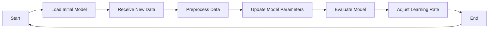
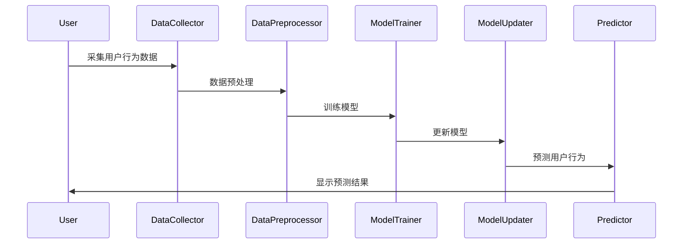

                 

# 评测数据的增量学习与模型更新

> 关键词：评测数据、增量学习、模型更新、算法、系统架构、最佳实践

> 摘要：本文将探讨评测数据的增量学习与模型更新这一关键技术，详细介绍其背景、核心概念、算法原理、系统设计与实现、实战案例以及最佳实践，旨在为读者提供一个全面、深入的技术指南。

## 引言与背景

### 1.1 问题背景

在现代机器学习和人工智能领域，评测数据是评估模型性能和进行模型优化的重要依据。然而，随着数据量的不断增加和数据分布的变化，传统的一次性模型训练方式已经难以满足实际需求。增量学习应运而生，它允许模型在已有数据的基础上不断学习和更新，以适应新的数据特征。

### 1.2 评测数据的定义与作用

评测数据是一组用于评估模型性能的数据集，通常包括训练集、验证集和测试集。其中，训练集用于模型训练，验证集用于模型调优，测试集用于模型评估。评测数据的质量和代表性直接影响到模型的性能。

### 1.3 增量学习与模型更新概述

增量学习是一种在已有模型基础上通过添加新数据来更新模型的技术。模型更新则是在模型使用过程中根据新的数据反馈进行调整和优化。这两者相辅相成，共同提高了模型的适应性和性能。

### 1.4 增量学习与模型更新的应用领域

增量学习和模型更新在许多应用领域都具有重要意义，如自然语言处理、计算机视觉、推荐系统等。它们能够帮助模型更好地应对数据变化，提高模型的鲁棒性和准确性。

## 核心概念与联系

### 2.1 增量学习的定义与特点

增量学习是指模型在已有数据集的基础上，通过不断添加新数据来更新模型参数的过程。其特点是实时性、灵活性和效率高。

#### 2.1.1 增量学习的定义

增量学习（Incremental Learning）是一种在已有模型基础上，通过逐步添加新数据来更新模型的方法。它避免了重新训练整个模型，从而节省了计算资源和时间。

#### 2.1.2 增量学习的特点

- **实时性**：增量学习可以在数据不断更新的情况下实时调整模型。
- **灵活性**：模型能够根据新数据的特点进行自适应调整。
- **效率高**：增量学习避免了重新训练整个模型，减少了计算开销。

#### 2.1.3 增量学习与传统机器学习的区别

传统机器学习需要在固定数据集上进行训练，而增量学习则是基于逐步更新的数据集。传统方法需要较长的训练时间，而增量学习能够更快地适应数据变化。

### 2.2 模型更新的概念与重要性

模型更新（Model Update）是指根据模型在应用中的表现，结合新数据对模型进行优化和调整的过程。

#### 2.2.1 模型更新的定义

模型更新（Model Update）是指根据模型在真实环境中的反馈，结合新数据对模型进行优化和调整的过程。其目的是提高模型的准确性、鲁棒性和适应性。

#### 2.2.2 模型更新的重要性

- **提高模型性能**：通过模型更新，可以不断提升模型的准确性和鲁棒性。
- **适应数据变化**：模型更新能够使模型更好地适应数据分布的变化。
- **降低错误率**：及时更新模型有助于降低模型在真实应用中的错误率。

#### 2.2.3 模型更新的挑战

- **数据不平衡**：新数据可能与原有数据存在数据不平衡的问题，需要采取相应的处理方法。
- **计算资源**：模型更新需要额外的计算资源，如何高效地进行模型更新是一个挑战。
- **模型稳定性**：在模型更新的过程中，需要确保模型的稳定性，避免出现过拟合现象。

### 2.3 关键概念属性特征对比表格

| 特征对比项       | 增量学习           | 模型更新           |
|----------------|------------------|------------------|
| 定义           | 基于已有数据集逐步更新模型 | 根据新数据对模型进行优化调整 |
| 特点           | 实时性、灵活性、效率高 | 提高性能、适应数据变化、降低错误率 |
| 应用场景       | 数据不断变化的应用领域 | 模型长期运行的应用场景       |
| 挑战           | 数据不平衡、计算资源、模型稳定性 | 数据不平衡、计算资源、模型稳定性 |

### 2.4 增量学习与模型更新ER实体关系图架构

```mermaid
erDiagram
  Model <<--o EvaluationData : 数据评测
  Model ||--|{ IncrementalLearning : 增量学习
  Model ||--|{ ModelUpdate : 模型更新
```

## 增量学习算法原理讲解

### 3.1 增量学习算法概述

增量学习算法是一类针对数据流或逐步更新数据集的机器学习算法，它们通过在每次新数据到来时更新模型的参数，从而实现模型的持续学习和优化。

### 3.2 典型增量学习算法

#### 3.2.1 专家集成算法

专家集成算法（Expert Integration Algorithm）是一种基于多个弱学习器的集成学习算法。在增量学习场景中，它通过合并多个模型的预测结果来提高模型的准确性。

#### 3.2.2 模型压缩算法

模型压缩算法（Model Compression Algorithm）通过减少模型的参数数量来降低计算复杂度。在增量学习场景中，它有助于提高模型的训练效率。

#### 3.2.3 模型蒸馏算法

模型蒸馏算法（Model Distillation Algorithm）是一种将复杂模型的知识转移到简化的模型上的技术。在增量学习场景中，它可以帮助模型更好地利用已有数据，提高对新数据的适应能力。

### 3.3 增量学习算法的mermaid流程图



### 3.4 Python源代码示例

```python
# 假设使用scikit-learn的增量学习算法进行模型更新
from sklearn.linear_model import SGDClassifier

# 初始化模型
model = SGDClassifier()

# 加载初始数据集
X_train, y_train = load_data()

# 训练模型
model.partial_fit(X_train, y_train)

# 接收新数据
X_new, y_new = receive_new_data()

# 预处理新数据
X_new_processed = preprocess_data(X_new)

# 更新模型
model.partial_fit(X_new_processed, y_new)

# 评估模型
accuracy = model.score(X_test, y_test)
```

### 3.5 算法原理的数学模型与公式

增量学习算法的核心在于如何更新模型的参数。以下是一个简化的数学模型：

$$
\theta_{new} = \theta_{old} + \alpha \cdot (X \cdot \delta)
$$

其中：
- $\theta_{new}$ 是更新后的模型参数；
- $\theta_{old}$ 是更新前的模型参数；
- $\alpha$ 是学习率；
- $X$ 是新数据；
- $\delta$ 是模型预测误差。

### 3.6 举例说明

假设我们有一个分类问题，现有模型对一组数据进行预测，预测结果与实际标签存在误差。为了减小误差，我们接收一组新数据，并对模型进行更新。更新后的模型在新的数据集上继续预测，并通过迭代过程逐步减小误差。

## 增量学习与模型更新的系统设计与实现

### 4.1 系统分析与架构设计

#### 4.1.1 问题场景介绍

假设我们面临一个在线广告点击率预测问题，广告平台需要实时预测用户的点击行为，以便及时调整广告策略。

#### 4.1.2 系统功能设计

- **数据采集模块**：负责收集用户行为数据。
- **数据预处理模块**：对采集到的数据进行清洗和预处理。
- **模型训练模块**：基于预处理后的数据训练预测模型。
- **模型更新模块**：根据新数据实时更新模型参数。
- **预测模块**：使用更新后的模型对用户行为进行预测。

#### 4.1.3 系统架构设计

系统的整体架构可以分为三层：数据层、服务层和界面层。

- **数据层**：包括数据采集模块和数据预处理模块，负责数据的收集和预处理。
- **服务层**：包括模型训练模块和模型更新模块，负责模型的训练和更新。
- **界面层**：提供用户交互界面，展示预测结果。

#### 4.1.4 系统接口设计

系统提供了以下接口：
- **数据采集接口**：用于接收用户行为数据。
- **数据预处理接口**：用于对采集到的数据进行清洗和预处理。
- **模型训练接口**：用于启动模型训练过程。
- **模型更新接口**：用于接收新数据并更新模型参数。
- **预测接口**：用于对用户行为进行预测。

#### 4.1.5 系统交互mermaid序列图



### 4.2 项目实战

#### 4.2.1 环境安装

在开始项目之前，我们需要安装必要的软件和库。以下是一个基本的安装清单：

- Python 3.x
- NumPy
- Pandas
- Scikit-learn
- Matplotlib

#### 4.2.2 系统核心实现源代码

以下是系统核心实现部分的源代码示例：

```python
# 数据采集模块
def collect_data():
    # 代码实现数据采集逻辑
    pass

# 数据预处理模块
def preprocess_data(data):
    # 代码实现数据预处理逻辑
    pass

# 模型训练模块
def train_model(X_train, y_train):
    # 代码实现模型训练逻辑
    model = SGDClassifier()
    model.partial_fit(X_train, y_train)
    return model

# 模型更新模块
def update_model(model, X_new, y_new):
    # 代码实现模型更新逻辑
    model.partial_fit(X_new, y_new)
    return model

# 预测模块
def predict_user_behavior(model, user_data):
    # 代码实现预测逻辑
    prediction = model.predict(user_data)
    return prediction
```

#### 4.2.3 代码应用解读与分析

以上代码提供了一个增量学习与模型更新系统的基本框架。在实际应用中，我们需要根据具体业务场景进行详细的实现。

- **数据采集模块**：负责收集用户行为数据，可以通过API接口或日志分析等方式实现。
- **数据预处理模块**：对采集到的数据进行清洗和预处理，以便于模型训练。
- **模型训练模块**：使用增量学习算法对数据集进行训练，此处使用了scikit-learn的SGDClassifier。
- **模型更新模块**：接收新数据并更新模型参数，保证了模型的实时性和准确性。
- **预测模块**：使用更新后的模型对用户行为进行预测，并返回预测结果。

#### 4.2.4 实际案例分析与讲解剖析

以在线广告点击率预测为例，我们可以通过以下步骤进行实际案例分析：

1. **数据采集**：从广告平台收集用户点击数据。
2. **数据预处理**：清洗数据，包括缺失值填充、异常值处理等。
3. **模型训练**：使用预处理后的数据对模型进行训练。
4. **模型更新**：在模型训练过程中，不断接收新数据并更新模型。
5. **预测**：使用更新后的模型对用户行为进行预测，并根据预测结果调整广告策略。

通过以上步骤，我们可以实现一个高效的在线广告点击率预测系统。

#### 4.2.5 项目小结

本项目通过增量学习与模型更新技术，实现了一个在线广告点击率预测系统。在实际应用中，我们需要关注以下几个方面：

- **数据质量**：确保采集到的数据质量高，减少噪声和异常值。
- **模型性能**：通过调整学习率和选择合适的算法，提高模型性能。
- **实时性**：保证系统能够实时响应新数据，及时更新模型。

## 最佳实践与总结

### 6.1 增量学习中的常见问题与解决方案

在增量学习过程中，可能会遇到以下问题：

1. **数据不平衡**：解决方法包括采样平衡、数据增强等。
2. **计算资源限制**：可以考虑分布式计算或模型压缩技术来降低计算需求。
3. **模型稳定性**：通过合理设置学习率、使用正则化等方法来提高模型稳定性。

### 6.2 模型更新中的注意事项

在模型更新过程中，需要注意以下几点：

- **数据源可靠性**：确保数据来源可靠，减少错误数据对模型的影响。
- **更新频率**：根据应用需求合理设置更新频率，避免过度更新或不足更新。
- **版本控制**：对模型版本进行控制，确保更新过程的可追溯性和可回滚性。

### 6.3 实战中的经验分享

在实战过程中，我们总结了以下几点经验：

- **数据预处理**：数据预处理是增量学习的关键环节，直接影响模型的性能。
- **算法选择**：根据具体应用场景选择合适的算法，如专家集成、模型压缩等。
- **模型评估**：定期评估模型性能，及时调整模型参数。

### 6.4 小结与展望

本文探讨了评测数据的增量学习与模型更新技术，介绍了其核心概念、算法原理、系统设计与实现以及最佳实践。随着数据量的不断增长和应用场景的多样化，增量学习和模型更新技术将在机器学习和人工智能领域发挥越来越重要的作用。

### 6.5 拓展阅读

- **[1]** Bishop, C. M. (2006). *Pattern Recognition and Machine Learning*.
- **[2]** Russell, S., & Norvig, P. (2010). *Artificial Intelligence: A Modern Approach*.
- **[3]** Goodfellow, I., Bengio, Y., & Courville, A. (2016). *Deep Learning*.

## 作者信息

作者：AI天才研究院/AI Genius Institute & 禅与计算机程序设计艺术 /Zen And The Art of Computer Programming

## 结束语

本文旨在为读者提供一个关于评测数据增量学习与模型更新的全面、深入的技术指南。希望本文能帮助读者更好地理解和应用这一关键技术，为机器学习和人工智能领域的发展贡献力量。作者将继续致力于推动技术进步，为读者带来更多有价值的内容。感谢您的阅读！

