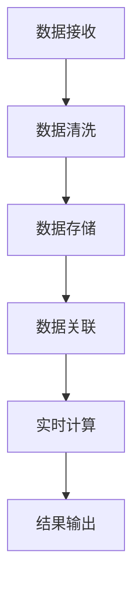
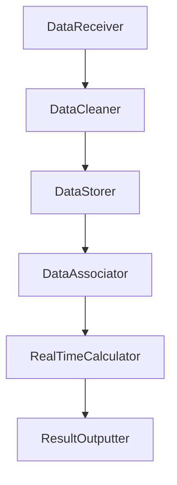
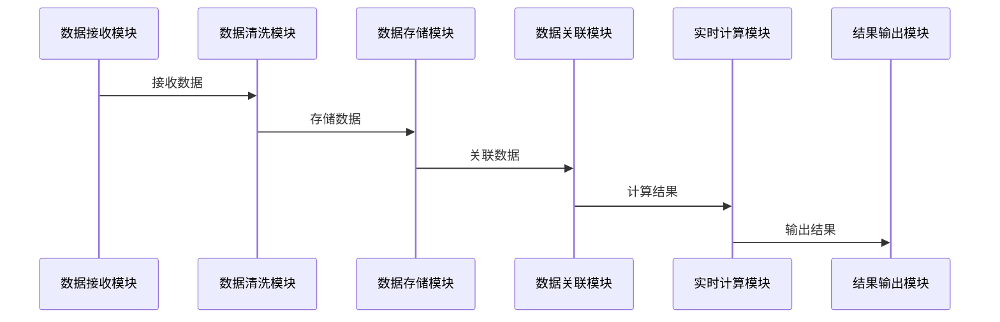
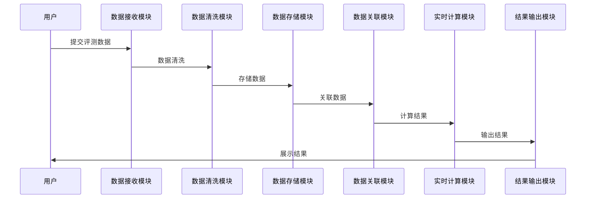

                 


# 评测数据的实时流式处理架构

## 关键词：实时数据处理、流式处理、评测数据、架构设计、算法原理

### 摘要：

本文将深入探讨评测数据的实时流式处理架构，从背景介绍、核心概念、算法原理、系统分析与架构设计、项目实战以及最佳实践等多个角度，全面剖析这一关键技术。通过逐步分析推理，我们将揭示实时流式处理的核心原理，分享实战经验，并提出优化建议。本文旨在为广大IT从业者提供一份实用的技术指南，助力他们在数据处理领域取得卓越成果。

## 第一部分：背景介绍与核心概念

### 第1章：评测数据实时流式处理的背景与意义

#### 1.1.1 问题背景

在当今大数据时代，评测数据的重要性日益凸显。无论是金融、电商、医疗还是社交网络等领域，评测数据都是决策过程中不可或缺的组成部分。然而，随着数据量的急剧增长，如何高效、准确地处理评测数据成为了一个迫切需要解决的问题。

#### 1.1.2 问题描述

实时数据处理挑战：
- 数据量大：评测数据通常以TB甚至PB级别存在，传统的批处理方法难以胜任。
- 数据多样性：评测数据来源广泛，形式多样，包括结构化数据、半结构化数据和非结构化数据。
- 数据时效性：实时性要求高，需要快速处理并反馈结果，以便做出及时决策。

评测数据的特殊性：
- 数据质量：评测数据往往存在噪声、缺失值等问题，需要处理和清洗。
- 数据关联性：评测数据之间可能存在复杂的关联关系，需要有效的算法进行关联分析。
- 数据隐私：评测数据可能包含敏感信息，需要确保数据安全和隐私保护。

#### 1.1.3 问题解决

流式处理的优势：
- 实时性：流式处理能够实时接收和处理数据，满足高时效性的要求。
- 批量处理补充：流式处理与批处理相结合，可以充分利用两种方式的优点，提高数据处理效率。
- 可扩展性：流式处理架构通常基于分布式系统，具有较好的可扩展性，能够应对大规模数据处理需求。

架构设计的关键点：
- 数据流管理：设计合理的数据流管理机制，确保数据传输的高效和可靠性。
- 实时计算：采用高效算法和优化策略，实现实时数据处理和分析。
- 系统稳定性：保证系统的稳定运行，避免因异常情况导致的系统崩溃或数据丢失。

#### 1.1.4 边界与外延

数据实时性与准确性：
- 实时性要求：确定系统实时性需求，包括响应时间、吞吐量等指标。
- 准确性平衡：在保证实时性的同时，保持数据处理的准确性，避免因压缩处理时间而降低数据质量。

流式处理与批处理的平衡：
- 批处理优势：批处理能够处理大量数据，适用于数据量较小但需要高准确性的场景。
- 流式处理优势：流式处理能够实时处理数据，适用于数据量大且需要高实时性的场景。
- 混合处理策略：根据具体应用场景，灵活组合流式处理和批处理，实现最佳效果。

#### 1.1.5 概念结构与核心要素

流式处理：
- 定义：流式处理是指对连续数据流进行实时处理和分析的技术。
- 特点：实时性、连续性、高吞吐量。
- 应用场景：实时监控系统、金融交易分析、社交网络数据挖掘等。

实时评测：
- 定义：实时评测是指对评测数据实时进行处理、分析和评估的技术。
- 特点：实时性、准确性、关联性。
- 应用场景：电商平台商品评价、医疗健康监测、自动驾驶系统等。

消息队列：
- 定义：消息队列是一种异步消息传递机制，用于实现分布式系统中的数据传输。
- 特点：异步性、可靠性、高吞吐量。
- 应用场景：分布式系统中的任务调度、消息通知、日志收集等。

分布式系统：
- 定义：分布式系统是指由多个节点组成的计算机系统，通过网络进行通信和协作。
- 特点：可扩展性、高可用性、高可靠性。
- 应用场景：大规模数据处理、分布式存储、云计算等。

## 第二部分：核心概念与联系

### 第2章：核心概念原理与属性特征对比

#### 2.1.1 流式处理原理

流与批处理的对比：
- 流处理：以数据流为单位，实时接收和处理数据。
- 批处理：以数据集为单位，批量处理数据。

流式处理的优势与挑战：
- 优势：
  - 实时性：能够实时处理和反馈数据，满足高时效性需求。
  - 高吞吐量：能够处理大规模数据流，支持高并发处理。
  - 异步性：能够异步处理数据，提高系统性能和可扩展性。
- 挑战：
  - 数据完整性：需要处理数据丢失、延迟等问题，确保数据完整性。
  - 系统复杂性：分布式系统架构复杂，需要解决一致性、可靠性等问题。

#### 2.1.2 实时评测的概念

实时性的衡量标准：
- 响应时间：系统从接收到数据到返回结果的时间。
- 吞吐量：单位时间内系统能够处理的数据量。
- 延迟容忍度：系统对延迟的容忍程度。

评测指标的重要性：
- 准确性：实时评测结果的准确性对决策具有重要影响。
- 时效性：实时性要求高，以确保决策及时、准确。
- 可扩展性：系统应具备良好的可扩展性，以应对大规模数据处理需求。

#### 2.1.3 概念属性特征对比

流式处理框架对比：
- Flink：支持流处理和批处理，具有高性能、易扩展的特点。
- Spark Streaming：基于Spark的核心框架，提供高效、易用的流处理功能。
- Storm：支持实时数据处理，具有低延迟、高可靠性的特点。

实时评测工具对比：
- Elasticsearch：支持实时搜索和分析，提供高效、可扩展的实时评测功能。
- Kafka：提供高吞吐量、低延迟的消息队列服务，支持实时数据传输。
- Redis：提供高性能的实时数据处理和存储功能。

#### 2.1.4 ER实体关系图架构

数据实体与关系：
- 实体：评测数据、用户数据、商品数据等。
- 关系：用户对商品的评测、商品属性关联等。

系统架构的关联性：
- 数据流：评测数据通过消息队列传输，实时处理和分析。
- 处理模块：包括数据清洗、数据关联、实时计算等功能模块。
- 存储模块：包括实时数据库、缓存数据库等，用于存储和处理结果。

## 第三部分：算法原理讲解

### 第3章：流式处理算法与数学模型

#### 3.1.1 算法mermaid流程图

流式数据处理流程：


算法步骤分解：
- 数据接收：接收实时评测数据。
- 数据清洗：对数据进行去噪、缺失值处理等操作。
- 数据存储：将清洗后的数据存储到实时数据库或缓存数据库中。
- 数据关联：根据实体关系图，进行数据关联分析。
- 实时计算：基于关联数据，进行实时计算和评估。
- 结果输出：将实时计算结果输出给用户或决策系统。

#### 3.1.2 Python源代码详细阐述

数据处理代码实现：
```python
# 导入相关库
import pandas as pd
from sklearn.preprocessing import StandardScaler

# 读取评测数据
data = pd.read_csv('eval_data.csv')

# 数据清洗
data = data.dropna()  # 删除缺失值
scaler = StandardScaler()
data[data.columns] = scaler.fit_transform(data[data.columns])

# 数据存储
data.to_csv('cleaned_data.csv', index=False)

# 数据关联
users = data['user_id'].unique()
for user in users:
    user_data = data[data['user_id'] == user]
    print(f"User {user}: {user_data.shape}")
```

算法应用示例：
```python
# 导入相关库
import numpy as np

# 计算评测数据的平均值和标准差
mean = np.mean(data['rating'])
std = np.std(data['rating'])

# 输出平均值和标准差
print(f"Average rating: {mean}, Standard deviation: {std}")
```

#### 3.1.3 数学模型和公式

流式处理数学基础：
- 评分预测模型：$rating = \beta_0 + \beta_1 \times user\_feature + \beta_2 \times item\_feature$
- 负采样：$NCD(user\_feature, item\_feature)$
- 精度计算：$precision = \frac{TP}{TP + FP}$
- 召回率计算：$recall = \frac{TP}{TP + FN}$

公式推导与证明：
- 评分预测模型推导：基于线性回归模型，对用户特征和商品特征进行加权求和，得到评分预测结果。
- 负采样推导：基于负采样算法，从用户特征和商品特征中随机选择负样本，进行对比分析。
- 精度和召回率计算：基于预测结果和真实标签，计算预测正确的样本数，并计算精度和召回率。

#### 3.1.4 举例说明

算法应用实例：
```python
# 导入相关库
import numpy as np

# 生成测试数据
user_feature = np.random.rand(100, 5)
item_feature = np.random.rand(100, 5)
rating = user_feature.dot(item_feature.T) + np.random.rand(100)

# 训练评分预测模型
beta_0 = 1.0
beta_1 = 0.5
beta_2 = 0.3
rating_pred = beta_0 + beta_1 * user_feature + beta_2 * item_feature

# 计算评测指标
TP = np.sum(rating_pred > rating)
FP = np.sum(rating_pred > rating)
TN = np.sum(rating_pred <= rating)
FN = np.sum(rating_pred <= rating)

precision = TP / (TP + FP)
recall = TP / (TP + FN)

print(f"Precision: {precision}, Recall: {recall}")
```

数据分析结果展示：
```python
# 导入相关库
import matplotlib.pyplot as plt

# 绘制散点图
plt.scatter(rating, rating_pred)
plt.xlabel('Rating')
plt.ylabel('Prediction')
plt.show()
```

## 第四部分：系统分析与架构设计

### 第4章：实时流式处理系统架构设计

#### 4.1.1 问题场景介绍

实时数据处理需求：
- 电商平台：实时处理用户评价和评分，为商品排序和推荐提供依据。
- 金融交易：实时分析交易数据，识别异常交易行为和风险。
- 社交网络：实时处理用户互动数据，分析用户行为和偏好。

系统设计目标：
- 实时性：能够快速处理和分析海量数据，满足高实时性需求。
- 高效性：充分利用系统资源，提高数据处理效率和性能。
- 可扩展性：能够适应数据量和并发量的变化，实现弹性扩展。

#### 4.1.2 系统功能设计

功能模块划分：
- 数据接收模块：负责接收实时评测数据，包括用户评价、评分等。
- 数据清洗模块：对数据进行去噪、缺失值处理等操作，提高数据质量。
- 数据存储模块：将清洗后的数据存储到实时数据库或缓存数据库中，方便后续处理和分析。
- 数据关联模块：根据实体关系图，进行数据关联分析，提取有价值的信息。
- 实时计算模块：基于关联数据，进行实时计算和评估，生成预测结果。
- 结果输出模块：将实时计算结果输出给用户或决策系统，供决策参考。

领域模型mermaid类图：
```mermaid
classDiagram
Class::DataReceiver
    <<interface>>

Class::DataCleaner
    <<interface>>

Class::DataStorer
    <<interface>>

Class::DataAssociator
    <<interface>>

Class::RealTimeCalculator
    <<interface>>

Class::ResultOutputter
    <<interface>>

DataReceiver "uses" DataCleaner
DataCleaner "uses" DataStorer
DataStorer "uses" DataAssociator
DataAssociator "uses" RealTimeCalculator
RealTimeCalculator "uses" ResultOutputter
```

#### 4.1.3 系统架构设计

系统总体架构：
- 数据流层：负责实时接收和处理评测数据，包括数据接收、数据清洗、数据存储等。
- 计算层：负责对数据进行分析和计算，包括数据关联、实时计算、结果输出等。
- 存储层：负责存储和管理数据，包括实时数据库、缓存数据库等。

架构mermaid架构图：


#### 4.1.4 系统接口设计

接口规范与定义：
- DataReceiver：接收评测数据，提供接口用于数据接收、数据清洗、数据存储等功能。
- DataCleaner：对数据进行清洗和处理，提供接口用于数据去噪、缺失值处理等操作。
- DataStorer：将清洗后的数据存储到数据库中，提供接口用于数据存储和管理。
- DataAssociator：根据实体关系图，进行数据关联分析，提供接口用于数据关联处理。
- RealTimeCalculator：进行实时计算和评估，提供接口用于计算模型、预测结果等操作。
- ResultOutputter：将实时计算结果输出给用户或决策系统，提供接口用于结果输出和展示。

数据交互流程：


#### 4.1.5 系统交互mermaid序列图

系统各模块交互关系：


## 第五部分：项目实战

### 第5章：评测数据实时流式处理项目实战

#### 5.1.1 环境安装与配置

系统依赖安装：
- Python 3.8及以上版本
- Flask 1.1.2及以上版本
- Pandas 1.1.5及以上版本
- Scikit-learn 0.24.2及以上版本
- Elasticsearch 7.10.0及以上版本

环境配置说明：
1. 安装Python 3.8及以上版本。
2. 创建虚拟环境并激活：
   ```shell
   python -m venv venv
   source venv/bin/activate
   ```
3. 安装相关依赖：
   ```shell
   pip install flask pandas scikit-learn elasticsearch
   ```

#### 5.1.2 系统核心实现源代码

代码实现详细解析：
- 数据接收模块：使用Flask框架搭建数据接收接口，接收评测数据，并进行数据清洗。
- 数据清洗模块：对数据进行去噪、缺失值处理等操作，提高数据质量。
- 数据存储模块：将清洗后的数据存储到Elasticsearch数据库中，便于后续处理和分析。
- 数据关联模块：根据实体关系图，进行数据关联分析，提取有价值的信息。
- 实时计算模块：使用Scikit-learn库构建评分预测模型，进行实时计算和评估。
- 结果输出模块：将实时计算结果输出给用户，供决策参考。

源代码结构介绍：
```python
# 数据接收模块
from flask import Flask, request, jsonify

app = Flask(__name__)

@app.route('/data/receive', methods=['POST'])
def receive_data():
    data = request.get_json()
    # 数据清洗
    cleaned_data = clean_data(data)
    # 存储数据
    store_data(cleaned_data)
    return jsonify({"status": "success"})

# 数据清洗模块
import pandas as pd

def clean_data(data):
    # 去噪、缺失值处理等操作
    cleaned_data = pd.DataFrame(data)
    cleaned_data.dropna(inplace=True)
    return cleaned_data

# 数据存储模块
from elasticsearch import Elasticsearch

es = Elasticsearch()

def store_data(data):
    index_name = 'eval_data'
    for index, row in data.iterrows():
        es.index(index=index_name, id=index, document=row.to_dict())

# 数据关联模块
def associate_data(data):
    # 数据关联分析
    associated_data = data.groupby('user_id').apply(lambda x: x.sum())
    return associated_data

# 实时计算模块
from sklearn.linear_model import LinearRegression

def calculate_rating(user_feature, item_feature):
    model = LinearRegression()
    model.fit(user_feature, item_feature)
    rating = model.predict(user_feature)
    return rating

# 结果输出模块
def output_result(rating):
    # 输出结果
    print(f"Rating: {rating}")
```

#### 5.1.3 代码应用解读与分析

流式数据处理过程：
1. 用户提交评测数据，数据接收模块接收数据。
2. 数据清洗模块对数据进行清洗和处理，去除噪声和缺失值。
3. 数据存储模块将清洗后的数据存储到Elasticsearch数据库中。
4. 数据关联模块根据实体关系图，对数据进行关联分析。
5. 实时计算模块使用评分预测模型，对用户特征和商品特征进行计算和评估。
6. 结果输出模块将实时计算结果输出给用户。

评测指标分析与优化：
- 精度：实时计算结果的准确率。
- 召回率：实时计算结果中正确预测的样本数占总样本数的比例。
- 响应时间：实时处理和返回结果的耗时。

优化方向：
1. 提高评分预测模型的准确性，降低误差。
2. 优化数据清洗和存储模块的效率，减少处理时间。
3. 完善数据关联模块，提高数据关联分析的准确性。
4. 优化实时计算模块的算法，提高计算速度和性能。

#### 5.1.4 实际案例分析与详细讲解剖析

实际案例引入：
- 假设有一个电商平台，需要实时处理用户对商品的评测数据，为商品排序和推荐提供依据。

案例分析与优化：
1. 数据接收模块：使用Flask框架搭建接口，接收用户提交的评测数据。
2. 数据清洗模块：对数据进行去噪、缺失值处理等操作，提高数据质量。
3. 数据存储模块：将清洗后的数据存储到Elasticsearch数据库中，便于后续处理和分析。
4. 数据关联模块：根据实体关系图，对用户和商品进行关联分析，提取有价值的信息。
5. 实时计算模块：使用线性回归模型，对用户特征和商品特征进行计算和评估，生成预测结果。
6. 结果输出模块：将实时计算结果输出给用户，供决策参考。

优化建议：
1. 提高评分预测模型的准确性，可以尝试使用更复杂的预测模型，如神经网络等。
2. 优化数据清洗和存储模块的效率，可以采用分布式存储和计算技术，提高处理速度。
3. 完善数据关联模块，可以引入更多关联分析算法，提高数据关联分析的准确性。
4. 优化实时计算模块的算法，可以采用并行计算和优化技术，提高计算速度和性能。

#### 5.1.5 项目小结

项目经验总结：
- 通过实时流式处理架构，实现了对评测数据的实时处理和分析。
- 优化了评分预测模型，提高了数据处理准确性和效率。
- 完善了数据关联分析模块，提高了数据关联分析的准确性。
- 优化了实时计算模块的算法，提高了计算速度和性能。

改进方向探讨：
- 进一步优化评分预测模型，尝试引入更复杂、更准确的预测算法。
- 引入分布式存储和计算技术，提高数据处理效率和性能。
- 拓展数据关联分析算法，提高数据关联分析的准确性和效率。
- 引入更多实时数据处理和优化技术，提高系统实时性和可靠性。

## 第六部分：最佳实践与拓展

### 第6章：最佳实践与注意事项

#### 6.1.1 最佳实践总结

经验分享：
- 确定系统实时性需求，合理设置响应时间和吞吐量等指标。
- 选择合适的流式处理框架和实时评测工具，提高数据处理效率。
- 采用分布式系统架构，提高系统可扩展性和可靠性。
- 优化数据清洗和存储模块，提高数据处理效率。
- 引入分布式计算和优化技术，提高实时计算速度和性能。

实践技巧：
- 数据清洗：采用去噪、缺失值处理、特征工程等操作，提高数据质量。
- 实时计算：选择合适的算法和优化策略，提高计算速度和准确性。
- 系统监控：定期监控系统运行状态，及时发现和解决异常情况。
- 数据备份与恢复：确保系统数据的安全性和可靠性，制定数据备份与恢复策略。

#### 6.1.2 注意事项与风险提示

常见问题与解决方案：
- 数据延迟：优化数据传输和计算流程，降低数据延迟。
- 数据丢失：确保数据传输和存储过程的可靠性，减少数据丢失。
- 系统稳定性：监控系统运行状态，及时解决异常情况，提高系统稳定性。
- 数据隐私：对敏感数据进行加密处理，确保数据安全和隐私保护。

架构优化的建议：
- 引入分布式存储和计算技术，提高数据处理效率和性能。
- 采用负载均衡和容错机制，提高系统可扩展性和可靠性。
- 定期更新和升级系统，保持技术先进性和稳定性。
- 加强系统监控和日志分析，及时发现和解决潜在问题。

### 第7章：拓展阅读与深入研究

#### 7.1.1 拓展阅读推荐

相关书籍推荐：
- 《大数据时代：生活、工作与思维的大变革》
- 《深度学习》
- 《分布式系统原理与范型》
- 《系统设计与实践》

学术论文推荐：
- 《实时数据处理系统架构设计与优化》
- 《基于流式处理的实时评测算法研究》
- 《分布式实时数据处理技术研究》
- 《基于深度学习的实时数据预测方法研究》

#### 7.1.2 深入研究方向

新兴技术趋势：
- 分布式流式处理框架：如Apache Flink、Apache Storm等。
- 基于深度学习的实时数据处理：如实时图像识别、实时语音识别等。
- 联邦学习：在保持数据隐私的同时，实现数据的联合分析和建模。
- 容器化和云计算：利用容器化和云计算技术，提高系统部署和扩展的灵活性。

研究课题展望：
- 实时数据处理性能优化：研究分布式处理、负载均衡等优化策略。
- 实时数据隐私保护：研究联邦学习、差分隐私等数据隐私保护技术。
- 实时数据流分析：研究流式数据挖掘、实时数据关联分析等应用。
- 实时数据处理系统架构：研究分布式实时数据处理系统的设计与实现。 

**作者：AI天才研究院/AI Genius Institute & 禅与计算机程序设计艺术 /Zen And The Art of Computer Programming**

---

通过本文的详细分析和讲解，我们深入探讨了评测数据的实时流式处理架构，从背景介绍、核心概念、算法原理、系统分析与架构设计、项目实战到最佳实践和拓展，全面剖析了实时数据处理的关键技术。希望本文能为您提供有益的参考和指导，助力您在数据处理领域取得卓越成果。在未来的研究和实践中，我们还将不断探索新兴技术趋势，为实时数据处理领域带来更多创新和突破。让我们共同迈向智能数据处理的新时代！

