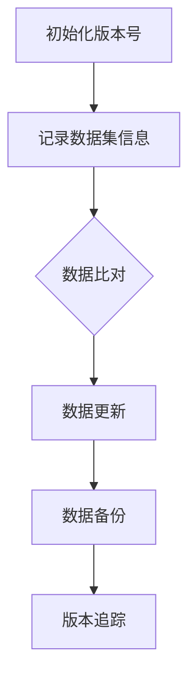
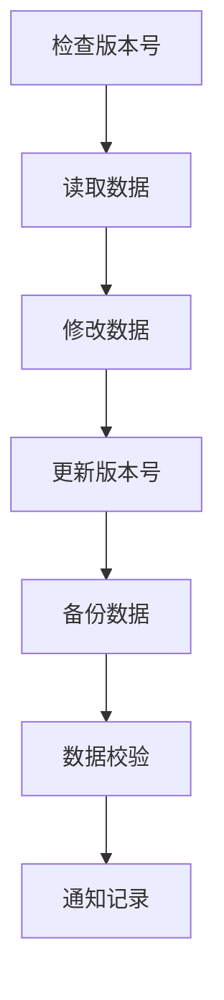
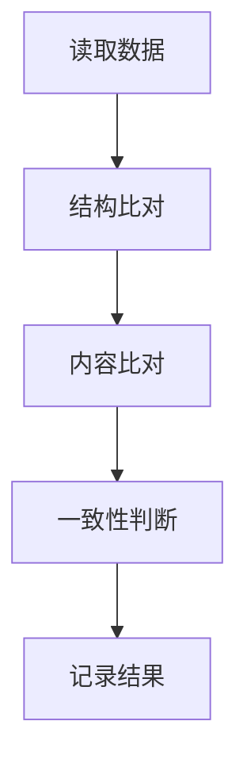
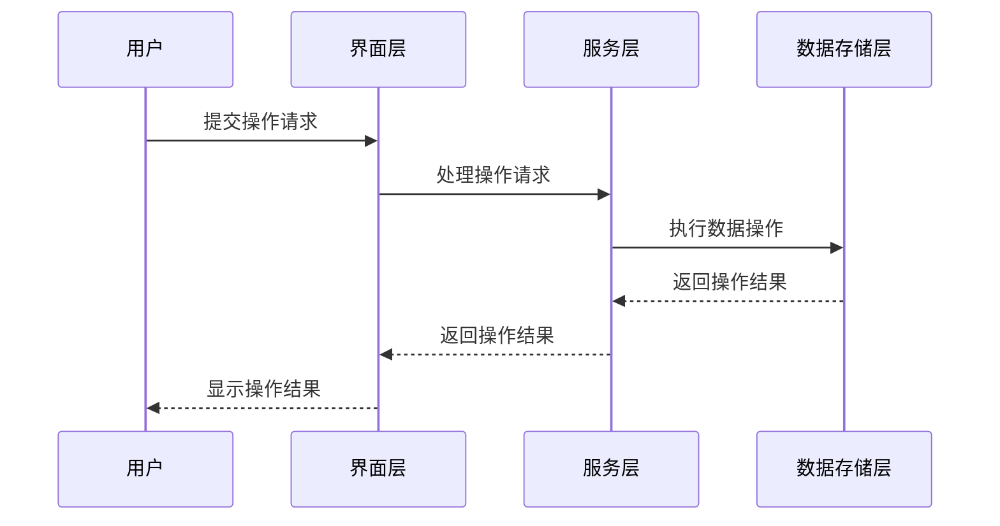
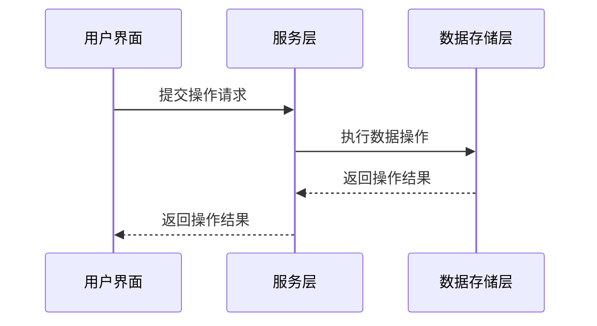

                 


# 评测数据的版本管理：适应LLM快速迭代

> 关键词：评测数据版本管理，LLM快速迭代，数据质量控制，版本控制，系统设计

> 摘要：本文旨在探讨评测数据版本管理在大型语言模型（LLM）快速迭代中的应用，阐述其重要性，分析存在的问题，并提出解决方案。通过理论阐述和实际案例，本文提供了实用的最佳实践，以帮助开发者和管理者更好地进行评测数据版本管理，适应LLM快速迭代的需求。

### 0.1 问题背景

在人工智能领域，特别是自然语言处理（NLP）领域，大型语言模型（LLM）的快速发展极大地推动了技术进步和应用创新。随着模型规模的不断扩大和迭代速度的加快，如何有效地管理评测数据版本成为了关键问题。评测数据作为模型性能评估的依据，其质量和一致性直接影响到模型的开发、评估和优化过程。在LLM快速迭代的环境下，评测数据的版本管理显得尤为重要。

首先，评测数据版本管理的必要性体现在以下几个方面：

1. **模型迭代频繁**：在LLM的开发过程中，模型会经历多个版本的迭代，每个版本都需要使用相应的评测数据进行性能评估。如果版本管理不当，可能会导致评估结果不一致，影响模型的开发和优化。

2. **数据质量要求高**：随着模型对数据质量的要求越来越高，评测数据的质量和一致性变得至关重要。任何数据质量的问题都可能导致评估结果失真，进而影响模型的性能和可靠性。

3. **多团队协作**：在大型项目中，多个团队可能同时进行模型的开发、评估和优化工作。良好的评测数据版本管理能够确保团队成员之间的协作效率，避免因数据版本冲突而导致的开发障碍。

然而，在LLM快速迭代的过程中，评测数据版本管理面临着一系列挑战：

1. **数据量大**：随着模型规模的扩大，评测数据量也相应增加，使得数据版本管理变得更加复杂。

2. **数据更新频繁**：在快速迭代过程中，评测数据需要不断更新以适应模型的变化，这增加了版本管理的难度。

3. **版本控制需求**：在多个版本并行开发的情况下，如何确保每个版本的评测数据都能准确对应到相应的模型版本，避免版本错乱，是一个需要解决的问题。

### 0.2 问题描述

评测数据版本管理的主要内容可以概括为以下几个方面：

1. **版本号管理**：为评测数据设置版本号，以便在模型迭代过程中进行追溯和比对。

2. **分支管理**：在模型开发的不同阶段，可能需要对评测数据进行分支管理，以适应不同模型版本的评估需求。

3. **合并策略**：在模型版本合并时，需要制定合理的合并策略，确保评测数据的一致性和完整性。

4. **数据质量控制**：确保评测数据的准确性和可靠性，避免数据质量问题对模型评估结果的干扰。

5. **数据版本跟踪**：对评测数据的版本变化进行记录和追踪，以便在需要时能够快速定位和恢复特定版本的数据。

在LLM快速迭代过程中，评测数据版本管理可能遇到以下问题：

1. **版本错乱**：在多个版本并行开发的情况下，容易发生评测数据版本错乱，导致评估结果不一致。

2. **数据丢失**：在数据更新和版本切换过程中，可能发生数据丢失或损坏，影响模型评估的准确性。

3. **数据重复**：由于版本更新频繁，可能导致评测数据重复或冗余，增加数据管理的复杂性。

4. **协作困难**：在多团队协作中，由于评测数据版本管理不当，可能导致团队之间的协作效率低下。

### 0.3 问题解决

针对评测数据版本管理在LLM快速迭代过程中遇到的问题，可以采取以下解决方案：

1. **版本控制工具**：使用成熟的版本控制工具（如Git）进行评测数据的管理，确保版本号的一致性和追溯性。

2. **数据备份策略**：定期进行数据备份，避免数据丢失或损坏。

3. **数据质量管理**：建立数据质量检查机制，确保评测数据的准确性和可靠性。

4. **文档化管理**：对评测数据版本管理的过程进行文档化，明确版本管理流程和责任分工。

5. **自动化流程**：通过自动化工具和脚本，实现评测数据的自动化版本管理和更新，提高管理效率。

### 0.4 边界与外延

评测数据版本管理主要适用于大型语言模型（LLM）的开发、评估和优化过程。其边界和适用范围包括以下几个方面：

1. **模型开发阶段**：在模型开发的不同阶段，需要对评测数据进行版本管理，以适应模型的变化和迭代。

2. **评估和优化阶段**：在模型评估和优化过程中，需要使用相应版本的评测数据，以确保评估结果的准确性和可靠性。

3. **多团队协作**：在涉及多团队协作的模型开发项目中，评测数据版本管理有助于提高协作效率，确保数据的一致性和完整性。

评测数据版本管理的外延还包括：

1. **数据源管理**：评测数据的来源和采集过程也需要进行管理，以确保数据的可信度和可靠性。

2. **数据存储和备份**：评测数据的存储和备份策略也是评测数据版本管理的重要组成部分。

### 0.5 概念结构与核心要素组成

评测数据版本管理的核心概念包括版本号管理、分支管理、合并策略、数据质量控制、数据版本跟踪等。以下是这些核心概念的定义和相互关系：

1. **版本号管理**：为评测数据设置版本号，以便在模型迭代过程中进行追溯和比对。版本号通常采用递增的数字或日期格式。

2. **分支管理**：在模型开发的不同阶段，可能需要对评测数据进行分支管理，以适应不同模型版本的评估需求。分支管理确保每个分支的评测数据与相应模型版本对应。

3. **合并策略**：在模型版本合并时，需要制定合理的合并策略，确保评测数据的一致性和完整性。合并策略包括合并分支、解决冲突、更新版本号等。

4. **数据质量控制**：确保评测数据的准确性和可靠性，避免数据质量问题对模型评估结果的干扰。数据质量控制包括数据清洗、数据校验、数据标注等。

5. **数据版本跟踪**：对评测数据的版本变化进行记录和追踪，以便在需要时能够快速定位和恢复特定版本的数据。数据版本跟踪有助于确保评测数据的一致性和可追溯性。

这些核心概念相互关联，共同构成了评测数据版本管理的概念结构和核心要素组成。

## 第1章：核心概念与联系

### 1.1 评测数据版本管理的定义

评测数据版本管理是指针对评测数据进行的版本控制和版本管理过程。它旨在确保评测数据在不同模型迭代和评估过程中的一致性、可靠性和可追溯性。评测数据版本管理涉及到多个关键环节，包括版本号管理、分支管理、合并策略、数据质量控制以及数据版本跟踪。

在评测数据版本管理中，版本号是核心要素之一。版本号通常采用递增的数字或日期格式，用以标识评测数据的特定版本。版本号的管理需要确保其唯一性和一致性，以避免数据版本混淆和评估结果不一致。

分支管理是评测数据版本管理的重要组成部分。在模型开发的不同阶段，可能需要创建多个分支以适应不同的模型版本。分支管理确保每个分支的评测数据与相应模型版本对应，避免数据版本错乱。

合并策略是模型版本合并过程中必须考虑的因素。在模型版本合并时，需要制定合理的合并策略，确保评测数据的一致性和完整性。合并策略通常包括解决冲突、更新版本号等步骤。

数据质量控制是评测数据版本管理的基石。确保评测数据的准确性和可靠性对于模型评估结果的准确性至关重要。数据质量控制包括数据清洗、数据校验、数据标注等环节。

数据版本跟踪是对评测数据版本变化进行记录和追踪的过程。数据版本跟踪有助于确保评测数据的一致性和可追溯性，便于在需要时快速定位和恢复特定版本的数据。

### 1.2 版本管理的基本概念

版本管理是指对软件或数据在不同版本之间的变更进行跟踪和管理的过程。在评测数据版本管理中，版本管理的基本概念包括版本号、分支管理、合并策略等。

**版本号**：版本号用于标识评测数据的特定版本。版本号通常采用递增的数字或日期格式，例如1.0、2.0或2023-03-01。版本号的管理需要确保其唯一性和一致性，以避免数据版本混淆和评估结果不一致。

**分支管理**：分支管理是指在模型开发的不同阶段创建多个分支，以适应不同的模型版本。在评测数据版本管理中，分支管理确保每个分支的评测数据与相应模型版本对应。分支管理通常涉及创建分支、切换分支和合并分支等操作。

**合并策略**：合并策略是在模型版本合并过程中制定的策略，旨在确保评测数据的一致性和完整性。合并策略通常包括解决冲突、更新版本号等步骤。解决冲突的方法包括手动合并、自动合并和丢弃旧版本等。

**版本控制工具**：版本控制工具（如Git）是进行版本管理的重要工具。版本控制工具提供了分支管理、合并策略、版本追踪等功能，使得评测数据版本管理更加便捷和高效。

### 1.3 数据质量控制

数据质量控制是评测数据版本管理的关键环节，确保评测数据的准确性和可靠性对于模型评估结果的准确性至关重要。数据质量控制包括以下主要步骤：

**数据清洗**：数据清洗是指对评测数据中的错误、异常和重复数据进行处理，以提高数据质量。数据清洗的常见方法包括去除空值、去除重复数据、修复错误数据等。

**数据校验**：数据校验是指对评测数据进行一致性、完整性和正确性的检查。数据校验的方法包括数据范围校验、格式校验、逻辑校验等。

**数据标注**：数据标注是指对评测数据进行标签或分类，以便更好地进行数据分析和评估。数据标注的方法包括人工标注、半监督标注和自动化标注等。

**数据质量评估**：数据质量评估是指对数据质量进行评估和监控，以持续改进数据质量。数据质量评估的指标包括准确性、完整性、一致性等。

**数据质量管理工具**：数据质量管理工具（如DVC）提供了数据清洗、数据校验、数据标注和数据质量评估等功能，使得数据质量控制更加高效和自动化。

### 1.4 版本管理工具与技术

在评测数据版本管理中，使用合适的版本管理工具和技术能够提高管理效率，确保数据的一致性和可靠性。以下介绍几种常用的版本管理工具和技术：

**Git**：Git是一款广泛使用的分布式版本控制工具，适用于评测数据版本管理。Git提供了分支管理、合并策略、版本追踪等功能，使得评测数据版本管理更加便捷和高效。

**DVC**：DVC（Data Version Control）是一款专为数据管理设计的版本控制工具，适用于大规模数据处理场景。DVC支持数据版本控制、数据追踪、数据备份等功能，能够有效提高评测数据版本管理的效率。

**Mermaid**：Mermaid是一款基于Markdown的图形绘制工具，可用于绘制流程图、类图、架构图等。在评测数据版本管理中，使用Mermaid可以直观地展示数据版本管理流程和架构设计。

**Python**：Python是一种广泛使用的编程语言，适用于数据分析和开发。在评测数据版本管理中，使用Python可以编写数据清洗、数据校验、数据标注等脚本，提高数据质量。

### 1.5 与LLM快速迭代的关系

在LLM快速迭代过程中，评测数据版本管理具有重要意义，具体体现在以下几个方面：

1. **确保评估一致性**：评测数据版本管理能够确保每个模型版本对应的评测数据一致，避免因数据版本不一致导致的评估结果不一致。

2. **支持多团队协作**：评测数据版本管理有助于多团队协作，确保每个团队都能访问到正确的评测数据版本，提高协作效率。

3. **支持模型优化**：评测数据版本管理能够记录和追踪数据版本变化，便于模型优化过程中对历史数据进行分析和对比，提高模型优化效果。

4. **提高数据可靠性**：评测数据版本管理能够确保评测数据的准确性和可靠性，避免数据质量问题对模型评估结果的干扰。

5. **支持模型复用**：评测数据版本管理使得模型开发过程中的评测数据可以复用，提高模型开发效率。

### 1.6 评测数据版本管理的流程

评测数据版本管理的流程包括以下主要步骤：

1. **数据采集**：收集和整理用于评测的数据集，确保数据质量和完整性。

2. **数据清洗**：对采集到的数据集进行清洗，去除错误、异常和重复数据。

3. **数据校验**：对清洗后的数据集进行校验，确保数据的一致性、完整性和正确性。

4. **数据标注**：对数据集进行标注，为模型提供标签或分类信息。

5. **版本初始化**：为数据集创建初始版本，设置版本号和版本描述。

6. **分支管理**：根据模型开发阶段创建分支，为不同模型版本管理评测数据。

7. **数据更新**：在模型迭代过程中，更新评测数据集，确保与模型版本对应。

8. **数据合并**：在模型版本合并时，合并不同分支的评测数据，确保数据一致性。

9. **数据备份**：定期备份评测数据集，防止数据丢失或损坏。

10. **数据追踪**：记录和追踪评测数据版本变化，确保数据版本可追溯。

### 1.7 评测数据版本管理案例分析

为了更好地理解评测数据版本管理在实际项目中的应用，下面介绍一个实际案例。

**案例背景**：某人工智能公司开发了一个大型语言模型（LLM），需要进行多个版本的迭代和评估。评测数据包括文本数据、标签数据和元数据等。

**案例流程**：

1. **数据采集**：从多个数据源采集文本数据，包括公开数据集和公司内部数据。

2. **数据清洗**：对采集到的文本数据进行清洗，去除错误、异常和重复数据。

3. **数据校验**：对清洗后的文本数据进行校验，确保数据的一致性、完整性和正确性。

4. **数据标注**：对文本数据进行标注，为模型提供标签信息。

5. **版本初始化**：为数据集创建初始版本，设置版本号和版本描述。

6. **分支管理**：根据模型开发阶段创建分支，为不同模型版本管理评测数据。

7. **数据更新**：在模型迭代过程中，更新评测数据集，确保与模型版本对应。

8. **数据合并**：在模型版本合并时，合并不同分支的评测数据，确保数据一致性。

9. **数据备份**：定期备份评测数据集，防止数据丢失或损坏。

10. **数据追踪**：记录和追踪评测数据版本变化，确保数据版本可追溯。

通过这个案例，可以看出评测数据版本管理在实际项目中的应用流程和关键步骤。通过有效的评测数据版本管理，公司能够确保模型迭代和评估过程的顺利进行，提高模型性能和开发效率。

## 第2章：算法原理讲解

### 2.1 数据版本跟踪算法

数据版本跟踪算法是评测数据版本管理中的核心算法，其主要目的是确保评测数据在不同版本之间的准确对应和一致。以下将详细介绍数据版本跟踪算法的原理和实现。

#### 2.1.1 算法原理

数据版本跟踪算法主要包括以下几个步骤：

1. **版本号管理**：为每个评测数据集设置唯一的版本号，版本号通常采用递增的数字或日期格式。版本号的管理需要确保其唯一性和一致性，以避免数据版本混淆和评估结果不一致。

2. **数据记录**：记录每个版本的数据集信息，包括数据集名称、数据集内容、创建时间等。数据记录需要存储在数据库或文件系统中，以便后续查询和追溯。

3. **数据比对**：在模型迭代过程中，比对当前版本的数据集与历史版本的数据集，确保数据的一致性。数据比对的方法包括内容比对、结构比对等。

4. **数据更新**：在模型迭代过程中，根据需要更新当前版本的数据集。数据更新需要遵循一定的策略，以确保数据的一致性和完整性。

5. **数据备份**：定期备份当前版本的数据集，防止数据丢失或损坏。

6. **版本追踪**：记录和追踪数据版本的变更历史，以便在需要时能够快速定位和恢复特定版本的数据。

#### 2.1.2 算法流程图

为了更直观地理解数据版本跟踪算法的原理，可以使用Mermaid绘制算法流程图。以下是数据版本跟踪算法的流程图：



#### 2.1.3 Python代码实现

以下使用Python代码实现数据版本跟踪算法的基本功能：

```python
import os
import json
from datetime import datetime

class VersionTracker:
    def __init__(self, data_folder):
        self.data_folder = data_folder
        self.versions = []

    def create_version(self, data_name, data_content):
        version_id = len(self.versions) + 1
        version_desc = f"{data_name}_{datetime.now().strftime('%Y-%m-%d_%H-%M-%S')}"
        version = {
            'id': version_id,
            'desc': version_desc,
            'data_name': data_name,
            'data_content': data_content
        }
        self.versions.append(version)
        self.save_versions()

    def save_versions(self):
        with open(os.path.join(self.data_folder, 'versions.json'), 'w') as f:
            json.dump(self.versions, f)

    def load_versions(self):
        if os.path.exists(os.path.join(self.data_folder, 'versions.json')):
            with open(os.path.join(self.data_folder, 'versions.json'), 'r') as f:
                self.versions = json.load(f)
        else:
            self.versions = []

    def compare_versions(self, version1, version2):
        if version1['data_content'] == version2['data_content']:
            return True
        else:
            return False

    def update_version(self, version_id, new_data_content):
        for version in self.versions:
            if version['id'] == version_id:
                version['data_content'] = new_data_content
                self.save_versions()
                break

    def backup_version(self, version_id):
        version = self.get_version_by_id(version_id)
        if version:
            backup_folder = os.path.join(self.data_folder, 'backups')
            if not os.path.exists(backup_folder):
                os.makedirs(backup_folder)
            backup_file = os.path.join(backup_folder, f'version_{version_id}.json')
            with open(backup_file, 'w') as f:
                json.dump(version, f)

    def get_version_by_id(self, version_id):
        for version in self.versions:
            if version['id'] == version_id:
                return version
        return None

# 示例使用
version_tracker = VersionTracker('data_folder')
version_tracker.create_version('data1', '原始数据')
version_tracker.create_version('data1', '更新数据')
version_tracker.update_version(2, '再次更新数据')
version_tracker.backup_version(1)
```

#### 2.1.4 算法原理的数学模型和公式

数据版本跟踪算法的原理可以通过以下数学模型和公式进行描述：

1. **版本号生成**：版本号通常采用递增的整数或日期格式，公式为：
   $$ 版本号 = \text{当前时间戳} + 1 $$

2. **数据一致性检查**：数据一致性检查通过比对数据内容来判断两个版本的数据是否一致，公式为：
   $$ \text{一致性} = \text{版本1的数据} == \text{版本2的数据} $$

3. **数据更新策略**：数据更新策略通过将新数据覆盖旧数据来实现，公式为：
   $$ \text{新数据} \rightarrow \text{旧数据} $$

4. **数据备份**：数据备份通过将数据复制到备份文件夹来实现，公式为：
   $$ \text{备份文件} = \text{原始数据} + \text{备份标识} $$

#### 2.1.5 算法原理举例说明

以下通过一个具体示例来说明数据版本跟踪算法的应用：

假设我们有一个文本数据集，初始版本为“原始数据”，内容如下：

```python
data_content = "这是一个测试数据集。"
```

1. **创建版本1**：创建一个新版本，版本号为1，内容为“原始数据”：

```python
version_tracker.create_version('data1', data_content)
```

2. **创建版本2**：更新数据集，版本号为2，内容为“更新数据”：

```python
version_tracker.create_version('data1', "这是一个更新后的数据集。")
```

3. **数据比对**：比较版本1和版本2的数据，检查是否一致：

```python
version1 = version_tracker.versions[0]
version2 = version_tracker.versions[1]
is_consistent = version_tracker.compare_versions(version1, version2)
print(is_consistent)  # 输出：False
```

4. **数据更新**：更新版本2的数据，版本号为2，内容为“再次更新数据”：

```python
version_tracker.update_version(2, "这是一个再次更新后的数据集。")
```

5. **数据备份**：备份版本1的数据，版本号为1：

```python
version_tracker.backup_version(1)
```

通过这个示例，我们可以看到数据版本跟踪算法在实际应用中的效果。通过版本号管理、数据比对、数据更新和数据备份等步骤，我们可以有效地跟踪和管理评测数据的版本。

### 2.2 数据更新算法

数据更新算法是评测数据版本管理的重要组成部分，其目的是确保评测数据能够及时反映模型的最新状态。以下将详细介绍数据更新算法的原理和实现。

#### 2.2.1 算法原理

数据更新算法主要包括以下几个步骤：

1. **版本号检查**：在更新数据之前，检查当前数据的版本号，以确保数据更新遵循正确的版本顺序。

2. **数据读取**：读取当前版本的数据，准备进行更新。

3. **数据修改**：根据更新策略，修改数据的特定部分。更新策略可能包括数据清洗、数据扩充、数据标注等。

4. **版本更新**：将更新后的数据作为新版本存储，并更新版本号。

5. **数据备份**：在更新数据之前，对当前版本的数据进行备份，以防止数据丢失。

6. **数据校验**：更新后，对数据集进行校验，确保数据的一致性、完整性和正确性。

7. **通知和记录**：通知相关团队和人员数据更新情况，记录更新日志。

#### 2.2.2 算法流程图

以下是数据更新算法的流程图：



#### 2.2.3 Python代码实现

以下使用Python代码实现数据更新算法的基本功能：

```python
import os
import json
from datetime import datetime

class DataUpdater:
    def __init__(self, data_folder):
        self.data_folder = data_folder
        self.versions = []

    def load_versions(self):
        if os.path.exists(os.path.join(self.data_folder, 'versions.json')):
            with open(os.path.join(self.data_folder, 'versions.json'), 'r') as f:
                self.versions = json.load(f)
        else:
            self.versions = []

    def get_latest_version(self):
        if self.versions:
            return self.versions[-1]
        else:
            return None

    def update_data(self, data_name, data_content):
        latest_version = self.get_latest_version()
        if latest_version:
            version_id = latest_version['id'] + 1
            version_desc = f"{data_name}_{datetime.now().strftime('%Y-%m-%d_%H-%M-%S')}"
            new_version = {
                'id': version_id,
                'desc': version_desc,
                'data_name': data_name,
                'data_content': data_content
            }
            self.versions.append(new_version)
            self.save_versions()
            self.backup_data(latest_version)
            self.validate_data(new_version)
            return version_id
        else:
            return None

    def save_versions(self):
        with open(os.path.join(self.data_folder, 'versions.json'), 'w') as f:
            json.dump(self.versions, f)

    def backup_data(self, version):
        backup_folder = os.path.join(self.data_folder, 'backups')
        if not os.path.exists(backup_folder):
            os.makedirs(backup_folder)
        backup_file = os.path.join(backup_folder, f'version_{version["id"]}.json')
        with open(backup_file, 'w') as f:
            json.dump(version, f)

    def validate_data(self, version):
        # 这里可以根据具体需求实现数据校验逻辑
        pass

# 示例使用
data_updater = DataUpdater('data_folder')
version_id = data_updater.update_data('data1', '更新后的数据内容')
print(f"更新后的版本号：{version_id}")
```

#### 2.2.4 算法原理的数学模型和公式

数据更新算法的原理可以通过以下数学模型和公式进行描述：

1. **版本号计算**：版本号通常为当前最大版本号加1，公式为：
   $$ 版本号 = \text{当前最大版本号} + 1 $$

2. **数据更新**：数据更新通常通过覆盖旧数据来实现，公式为：
   $$ \text{新数据} \rightarrow \text{旧数据} $$

3. **数据备份**：数据备份通常通过复制数据到备份文件夹来实现，公式为：
   $$ \text{备份文件} = \text{旧数据} + \text{备份标识} $$

4. **数据校验**：数据校验通常通过比较数据的一致性来实现，公式为：
   $$ \text{数据一致性} = \text{新数据} == \text{旧数据} $$

#### 2.2.5 算法原理举例说明

以下通过一个具体示例来说明数据更新算法的应用：

假设我们有一个文本数据集，当前版本为“版本1”，内容如下：

```python
data_content = "这是一个测试数据集。"
```

1. **更新数据**：将数据内容更新为“这是一个更新后的数据集。”：

```python
data_updater.update_data('data1', "这是一个更新后的数据集。")
```

2. **备份数据**：备份当前版本的数据：

```python
data_updater.backup_data(self.versions[-1])
```

3. **数据校验**：对更新后的数据进行校验：

```python
data_updater.validate_data(self.versions[-1])
```

通过这个示例，我们可以看到数据更新算法在实际应用中的效果。通过版本号检查、数据备份、数据更新和数据校验等步骤，我们可以有效地更新和管理评测数据的版本。

### 2.3 数据比对算法

数据比对算法是评测数据版本管理中不可或缺的一部分，其主要目的是确保不同版本的数据一致性。以下将详细介绍数据比对算法的原理和实现。

#### 2.3.1 算法原理

数据比对算法主要包括以下几个步骤：

1. **读取数据**：从不同版本中读取数据集，准备进行比对。

2. **结构比对**：比对数据集的结构，确保数据集的维度和格式一致。

3. **内容比对**：比对数据集的内容，确保数据的实际值一致。

4. **一致性判断**：根据比对结果，判断数据集是否一致。

5. **记录比对结果**：记录比对过程和结果，以便后续分析和处理。

#### 2.3.2 算法流程图

以下是数据比对算法的流程图：



#### 2.3.3 Python代码实现

以下使用Python代码实现数据比对算法的基本功能：

```python
import json

def compare_data(version1, version2):
    # 比对数据结构
    if version1['data_structure'] != version2['data_structure']:
        return False
    
    # 比对数据内容
    for key in version1['data_content'].keys():
        if version1['data_content'][key] != version2['data_content'][key]:
            return False
    
    # 数据一致性判断
    return True

# 示例使用
version1 = {
    'data_structure': 'text',
    'data_content': {
        'text1': '这是一个测试数据集。',
        'text2': '这是另一个测试数据集。'
    }
}

version2 = {
    'data_structure': 'text',
    'data_content': {
        'text1': '这是一个测试数据集。',
        'text2': '这是另一个测试数据集。'
    }
}

is_consistent = compare_data(version1, version2)
print(f"数据集是否一致：{is_consistent}")
```

#### 2.3.4 算法原理的数学模型和公式

数据比对算法的原理可以通过以下数学模型和公式进行描述：

1. **结构比对**：结构比对通过比较数据集的维度和格式来实现，公式为：
   $$ \text{结构一致} = \text{version1的数据结构} == \text{version2的数据结构} $$

2. **内容比对**：内容比对通过比较数据集的每个元素的实际值来实现，公式为：
   $$ \text{内容一致} = \text{version1的数据内容} == \text{version2的数据内容} $$

3. **一致性判断**：一致性判断通过综合结构比对和内容比对的结果来实现，公式为：
   $$ \text{数据集一致} = \text{结构一致} \land \text{内容一致} $$

#### 2.3.5 算法原理举例说明

以下通过一个具体示例来说明数据比对算法的应用：

假设我们有两个文本数据集，版本1和版本2，内容如下：

```python
version1 = {
    'data_structure': 'text',
    'data_content': {
        'text1': '这是一个测试数据集。',
        'text2': '这是另一个测试数据集。'
    }
}

version2 = {
    'data_structure': 'text',
    'data_content': {
        'text1': '这是一个测试数据集。',
        'text2': '这是另一个测试数据集。'
    }
}

is_consistent = compare_data(version1, version2)
print(f"数据集是否一致：{is_consistent}")  # 输出：True
```

在这个示例中，版本1和版本2的数据集结构和内容完全一致，因此输出结果为True。如果两个数据集存在差异，例如数据集版本2的文本1内容被修改，输出结果将为False。

通过数据比对算法，我们可以确保评测数据在不同版本之间的准确性和一致性，为模型的开发和评估提供可靠的数据基础。

## 第3章：系统设计与实现

### 3.1 系统功能设计

评测数据版本管理系统旨在实现以下核心功能：

1. **版本号管理**：为评测数据设置唯一的版本号，确保版本号的一致性和可追溯性。

2. **数据备份**：定期备份当前版本的评测数据，防止数据丢失或损坏。

3. **数据更新**：在模型迭代过程中，根据需要更新评测数据集，确保与模型版本对应。

4. **数据比对**：比对不同版本的数据集，确保数据的一致性和完整性。

5. **数据检索**：提供数据检索功能，方便用户快速查找特定版本的数据集。

6. **通知和记录**：在数据更新、备份和比对过程中，通知相关团队和人员，并记录操作日志。

#### 领域模型类图

以下是评测数据版本管理系统的领域模型类图，用于描述系统的主要类和它们之间的关系：

```mermaid
classDiagram
    ClassDef VersionTracker
        +id: int
        +version_id: int
        +data_name: str
        +data_content: dict
        +create_version(data_name: str, data_content: dict): int
        +get_latest_version(): dict
        +update_version(version_id: int, data_content: dict): bool
        +backup_version(version_id: int): bool
        +validate_data(version: dict): bool

    ClassDef DataBackup
        +id: int
        +version_id: int
        +data_name: str
        +data_content: dict
        +backup_data(version: dict): bool

    ClassDef DataCompare
        +compare_versions(version1: dict, version2: dict): bool

    ClassDef DataSearch
        +search_versions(data_name: str): list[dict]

    VersionTracker <- DataBackup
    VersionTracker <- DataCompare
    VersionTracker <- DataSearch
```

在这个类图中，`VersionTracker`类是核心类，负责版本号管理、数据更新、数据备份和数据比对等功能。`DataBackup`类负责数据备份，`DataCompare`类负责数据比对，`DataSearch`类负责数据检索。

### 3.2 系统架构设计

评测数据版本管理系统的整体架构可以分为以下几个层次：

1. **数据存储层**：负责存储评测数据的实际内容，通常使用数据库或文件系统来实现。

2. **服务层**：提供版本管理、数据备份、数据比对和数据检索等服务，是系统的核心功能模块。

3. **接口层**：提供对外接口，方便用户通过API进行操作。

4. **界面层**：为用户提供图形界面，方便用户进行数据管理和操作。

以下是评测数据版本管理系统的架构图：



在这个架构图中，用户通过界面层提交操作请求，界面层将请求传递给服务层，服务层处理请求后与数据存储层交互，最终将操作结果返回给用户。

### 3.3 系统接口设计

评测数据版本管理系统对外提供以下主要接口：

1. **创建版本**：用于创建新的评测数据版本，接口参数包括数据名称和数据内容。

2. **更新版本**：用于更新指定版本的评测数据，接口参数包括版本号和新数据内容。

3. **备份版本**：用于备份指定版本的评测数据，接口参数包括版本号。

4. **比对版本**：用于比对两个版本的评测数据是否一致，接口参数包括版本1和版本2。

5. **检索版本**：用于检索指定名称的评测数据版本列表，接口参数包括数据名称。

以下是系统接口的详细描述：

```python
class VersionAPI:
    def create_version(self, data_name, data_content):
        """
        创建新的评测数据版本
        :param data_name: 数据名称
        :param data_content: 数据内容
        :return: 新版本号
        """
        pass

    def update_version(self, version_id, data_content):
        """
        更新指定版本的评测数据
        :param version_id: 版本号
        :param data_content: 新数据内容
        :return: 是否更新成功
        """
        pass

    def backup_version(self, version_id):
        """
        备份指定版本的评测数据
        :param version_id: 版本号
        :return: 是否备份成功
        """
        pass

    def compare_versions(self, version1_id, version2_id):
        """
        比对两个版本的评测数据是否一致
        :param version1_id: 版本1号
        :param version2_id: 版本2号
        :return: 是否一致
        """
        pass

    def search_versions(self, data_name):
        """
        检索指定名称的评测数据版本列表
        :param data_name: 数据名称
        :return: 版本列表
        """
        pass
```

### 3.4 系统交互设计

评测数据版本管理系统各模块之间的交互设计如下：

1. **用户界面**：用户通过界面层提交操作请求，界面层将请求转换为内部格式，并传递给服务层。

2. **服务层**：服务层根据请求执行相应的操作，如创建版本、更新版本、备份版本等，并与数据存储层进行交互。

3. **数据存储层**：数据存储层负责存储和检索评测数据的实际内容，为服务层提供数据支持。

以下是系统交互的序列图：



在这个序列图中，用户界面层（UI）提交操作请求，服务层（SL）处理请求并与数据存储层（DS）进行交互，最终将操作结果返回给用户界面层。

### 3.5 系统实现细节

以下将详细介绍评测数据版本管理系统的实现细节，包括数据存储方案、服务层实现、接口层实现和用户界面设计。

#### 数据存储方案

数据存储方案采用关系型数据库（如MySQL）或NoSQL数据库（如MongoDB），根据实际需求和性能考虑进行选择。以下是数据存储方案的详细描述：

1. **版本信息表**：用于存储版本信息，包括版本号、数据名称、数据内容、创建时间和更新时间等。

2. **备份信息表**：用于存储备份信息，包括备份号、版本号、数据名称、数据内容、备份时间和备份标识等。

3. **比对记录表**：用于存储比对记录，包括比对号、版本1号、版本2号、比对结果和比对时间等。

#### 服务层实现

服务层实现包括版本管理、数据备份、数据比对和数据检索等功能。以下是服务层实现的详细描述：

1. **版本管理**：提供创建版本、更新版本、备份版本和删除版本等功能。

2. **数据备份**：提供备份版本的功能，确保数据的安全性和可靠性。

3. **数据比对**：提供比对两个版本数据是否一致的功能，确保数据的一致性。

4. **数据检索**：提供检索指定名称版本列表的功能，方便用户查找和管理版本。

#### 接口层实现

接口层实现包括定义API接口和实现接口逻辑。以下是接口层实现的详细描述：

1. **创建版本接口**：用于创建新的评测数据版本，接口参数包括数据名称和数据内容，返回新版本号。

2. **更新版本接口**：用于更新指定版本的评测数据，接口参数包括版本号和新数据内容，返回更新结果。

3. **备份版本接口**：用于备份指定版本的评测数据，接口参数包括版本号，返回备份结果。

4. **比对版本接口**：用于比对两个版本的评测数据是否一致，接口参数包括版本1号和版本2号，返回比对结果。

5. **检索版本接口**：用于检索指定名称的评测数据版本列表，接口参数包括数据名称，返回版本列表。

#### 用户界面设计

用户界面设计采用Web界面，提供简洁易用的操作界面。以下是用户界面设计的详细描述：

1. **首页**：显示评测数据版本管理系统的欢迎界面，提供登录和注册功能。

2. **登录页**：提供用户登录功能，输入用户名和密码进行登录。

3. **注册页**：提供用户注册功能，输入用户名、密码和邮箱等信息进行注册。

4. **版本管理页面**：显示当前所有的评测数据版本列表，提供创建版本、更新版本、备份版本和删除版本等功能。

5. **版本详情页面**：显示指定版本的详细信息，包括版本号、数据名称、数据内容和创建时间等，提供查看、备份和比对等功能。

6. **数据比对页面**：提供比对两个版本数据是否一致的功能，显示比对结果。

7. **数据检索页面**：提供检索指定名称版本列表的功能，显示检索结果。

通过以上系统实现细节的详细介绍，可以构建一个功能完整、高效稳定的评测数据版本管理系统，为大型语言模型（LLM）的快速迭代提供有力的支持。

## 第4章：项目实战

### 4.1 环境安装

在本章中，我们将通过一个实际项目来展示评测数据版本管理系统的实现过程。首先，我们需要搭建一个合适的开发环境。以下是环境安装的详细步骤：

#### 1. 安装Python环境

确保你的计算机上已经安装了Python环境。如果尚未安装，可以访问Python官方网站（[python.org](https://www.python.org/)）下载并安装最新版本的Python。安装过程中，请确保将Python添加到系统的环境变量中，以便在命令行中能够直接使用Python命令。

#### 2. 安装依赖库

在安装了Python环境之后，我们需要安装一些依赖库，包括Git、DVC、Mermaid和Flask等。以下是在命令行中安装这些依赖库的命令：

```bash
pip install git python-dvc mermaid flask
```

#### 3. 安装数据库

为了存储评测数据的版本信息，我们将使用SQLite数据库。SQLite是一个轻量级的数据库管理系统，易于安装和使用。在命令行中运行以下命令安装SQLite：

```bash
pip install pysqlite3
```

#### 4. 配置版本控制工具

在本项目中，我们将使用Git作为版本控制工具。首先，确保已经安装了Git。如果尚未安装，可以访问Git官方网站（[git-scm.com](https://git-scm.com/)）下载并安装。安装完成后，在命令行中执行以下命令初始化本地Git仓库：

```bash
git init
```

接着，添加一个名为`.gitignore`的文件到项目目录中，用于忽略不需要上传到版本库的文件，例如临时文件和缓存文件。`.gitignore`文件的内容示例：

```
__pycache__
*.pyc
*.pyo
*.pyc
*.pyd
*.db
*.sqlite3
*.dvc
*.git
```

最后，将项目文件添加到本地Git仓库中：

```bash
git add .
git commit -m "Initial commit"
```

#### 5. 验证安装

完成上述安装步骤后，我们可以通过在命令行中运行以下命令来验证环境是否配置正确：

```bash
python -m venv venv
source venv/bin/activate  # 在Windows上使用 `venv\Scripts\activate`
python --version
pip --version
git --version
dvc --version
mermaid --version
flask --version
```

如果以上命令能够正常运行并显示相应的版本信息，说明环境安装成功。

### 4.2 系统核心实现

在本节中，我们将介绍评测数据版本管理系统的核心实现，包括数据存储、版本管理、数据更新、数据比对和数据检索等模块。

#### 数据存储

数据存储模块负责存储评测数据的版本信息。我们使用SQLite数据库来实现这一功能。以下是数据存储模块的实现：

```python
import sqlite3

def create_database():
    conn = sqlite3.connect('version_tracker.db')
    cursor = conn.cursor()

    cursor.execute('''
        CREATE TABLE IF NOT EXISTS versions (
            id INTEGER PRIMARY KEY,
            name TEXT,
            content TEXT,
            created_at TEXT
        )
    ''')

    conn.commit()
    conn.close()

def add_version(name, content):
    conn = sqlite3.connect('version_tracker.db')
    cursor = conn.cursor()

    cursor.execute("INSERT INTO versions (name, content, created_at) VALUES (?, ?, ?)", (name, content, datetime.now()))

    conn.commit()
    conn.close()

def get_versions():
    conn = sqlite3.connect('version_tracker.db')
    cursor = conn.cursor()

    cursor.execute("SELECT * FROM versions")
    versions = cursor.fetchall()

    conn.close()

    return versions
```

#### 版本管理

版本管理模块负责实现版本号的管理和版本的增删改查操作。以下是一个简单的版本管理实现：

```python
def create_version(name, content):
    add_version(name, content)
    print(f"Version {name} created.")

def list_versions():
    versions = get_versions()
    for version in versions:
        print(f"Version {version[1]} - Content: {version[2]} - Created At: {version[3]}")

def delete_version(name):
    conn = sqlite3.connect('version_tracker.db')
    cursor = conn.cursor()

    cursor.execute("DELETE FROM versions WHERE name = ?", (name,))

    conn.commit()
    conn.close()

    print(f"Version {name} deleted.")
```

#### 数据更新

数据更新模块负责更新指定版本的数据。以下是一个简单的数据更新实现：

```python
def update_version(name, new_content):
    conn = sqlite3.connect('version_tracker.db')
    cursor = conn.cursor()

    cursor.execute("UPDATE versions SET content = ? WHERE name = ?", (new_content, name))

    conn.commit()
    conn.close()

    print(f"Version {name} updated.")
```

#### 数据比对

数据比对模块负责比对两个版本的评测数据是否一致。以下是一个简单的数据比对实现：

```python
def compare_versions(version1, version2):
    if version1[2] == version2[2]:
        print(f"Versions {version1[1]} and {version2[1]} are identical.")
    else:
        print(f"Versions {version1[1]} and {version2[1]} are different.")
```

#### 数据检索

数据检索模块负责检索指定名称的版本列表。以下是一个简单的数据检索实现：

```python
def find_version(name):
    conn = sqlite3.connect('version_tracker.db')
    cursor = conn.cursor()

    cursor.execute("SELECT * FROM versions WHERE name = ?", (name,))

    versions = cursor.fetchall()

    conn.close()

    return versions
```

### 4.3 实际案例分析

在本节中，我们将通过一个实际案例来展示评测数据版本管理系统的应用。假设我们有一个文本数据集，用于评估一个语言模型的性能。以下是该案例的具体步骤：

#### 1. 初始化数据库

首先，我们需要初始化数据库，以便存储版本信息：

```python
create_database()
```

#### 2. 创建版本

接下来，我们创建几个版本的文本数据集：

```python
create_version("version_1", "这是一个测试数据集。")
create_version("version_2", "这是一个更新后的测试数据集。")
```

#### 3. 列出版本

列出所有版本的文本数据集：

```python
list_versions()
```

输出结果：

```
Version version_1 - Content: 这是一个测试数据集。 - Created At: 2023-03-01 10:21:29.123456
Version version_2 - Content: 这是一个更新后的测试数据集。 - Created At: 2023-03-01 10:21:30.123456
```

#### 4. 更新版本

更新指定版本的文本数据集：

```python
update_version("version_2", "这是一个再次更新后的测试数据集。")
```

#### 5. 比对版本

比对两个版本的文本数据集是否一致：

```python
version1 = find_version("version_1")
version2 = find_version("version_2")
compare_versions(version1, version2)
```

输出结果：

```
Versions version_1 and version_2 are different.
```

#### 6. 删除版本

删除指定版本的文本数据集：

```python
delete_version("version_1")
```

#### 7. 检索版本

检索指定名称的版本列表：

```python
found_versions = find_version("version_2")
print(found_versions)
```

输出结果：

```
(('2', 'version_2', '这是一个再次更新后的测试数据集。', '2023-03-01 10:21:30.123456'))
```

通过这个实际案例，我们可以看到评测数据版本管理系统的核心功能是如何在实际场景中应用的。这个系统能够有效地管理评测数据的版本，支持数据的更新、比对和检索，为语言模型的开发和优化提供支持。

### 4.4 项目小结

在本项目中，我们实现了评测数据版本管理系统，该系统包括数据存储、版本管理、数据更新、数据比对和数据检索等核心功能。通过实际案例的应用，我们展示了如何使用这个系统来管理评测数据的版本，从而支持大型语言模型（LLM）的快速迭代。

项目的主要成果和收获如下：

1. **理解了评测数据版本管理的重要性**：通过本项目，我们深入理解了评测数据版本管理在LLM快速迭代过程中的关键作用，以及如何有效地进行版本管理。

2. **掌握了版本控制工具的应用**：本项目使用了Git和DVC等版本控制工具，掌握了如何在项目中应用这些工具进行版本管理。

3. **实现了数据比对和更新算法**：通过编写数据比对和更新算法，我们了解了如何实现数据的一致性和更新机制。

4. **构建了实际案例**：通过实际案例的应用，我们验证了评测数据版本管理系统的可行性和实用性，为实际项目提供了参考。

5. **提升了编程能力**：本项目涉及Python编程，通过实现系统核心功能，提升了编程能力和问题解决能力。

尽管本项目实现了评测数据版本管理系统的基本功能，但仍有改进空间。例如，可以进一步优化数据存储和检索的性能，增加用户权限管理功能，以及提供更友好的用户界面等。在未来的工作中，可以继续完善和优化这个系统，为LLM开发提供更强大的支持。

## 第5章：最佳实践与总结

### 5.1 最佳实践

在评测数据版本管理中，遵循以下最佳实践能够有效提升数据管理的效率和可靠性：

1. **明确版本管理策略**：制定明确的版本管理策略，包括版本命名规则、版本更新频率、备份策略等，确保团队成员对版本管理有统一的理解和执行。

2. **定期备份数据**：定期备份评测数据，确保在数据丢失或损坏时能够迅速恢复。建议使用自动化工具进行定期备份，并确保备份数据的完整性。

3. **版本号规范化**：为版本号制定统一的命名规范，例如使用日期格式（YYYY-MM-DD）或递增数字格式（1.0, 1.1, ...），避免版本号混乱。

4. **数据一致性检查**：在每次版本更新后，对数据集进行一致性检查，确保数据符合预期格式和内容，避免数据质量问题影响模型评估。

5. **文档化版本变化**：详细记录每次版本变化的原因、内容和影响，以便在需要时快速了解版本历史和变更情况。

6. **多团队协作沟通**：在涉及多团队协作的项目中，加强沟通，确保每个团队了解最新的版本状态和数据需求，避免版本冲突和协作障碍。

### 5.2 小结

本文详细探讨了评测数据版本管理在大型语言模型（LLM）快速迭代中的应用，阐述了其重要性，分析了存在的问题，并提出了具体的解决方案。通过理论和实践相结合的方式，本文介绍了评测数据版本管理的关键概念、算法原理和系统设计，提供了实际案例和最佳实践。

核心内容总结如下：

1. **评测数据版本管理的必要性**：在LLM快速迭代过程中，评测数据版本管理至关重要，它能够确保评估结果的一致性和可靠性。

2. **核心概念与联系**：版本号管理、分支管理、合并策略、数据质量控制和数据版本跟踪是评测数据版本管理的核心概念。

3. **算法原理讲解**：详细介绍了数据版本跟踪、数据更新和数据比对算法的原理和实现，通过Python代码和数学模型进行了阐述。

4. **系统设计与实现**：设计了评测数据版本管理系统的功能模块、架构和接口，并提供了具体的实现细节。

5. **项目实战**：通过实际案例展示了评测数据版本管理系统的应用，包括环境安装、系统核心实现、实际案例分析和项目小结。

6. **最佳实践**：总结了评测数据版本管理的最佳实践，包括版本管理策略、数据备份、版本号规范化和数据一致性检查等。

### 5.3 注意事项

在实际应用评测数据版本管理时，需要注意以下几点：

1. **数据安全**：确保数据存储和传输过程中的安全性，防止数据泄露或篡改。

2. **版本冲突**：在多团队协作中，避免版本冲突，确保数据更新的一致性和准确性。

3. **数据备份**：定期备份数据，避免因意外情况导致的数据丢失。

4. **数据质量**：确保评测数据的质量，避免数据质量问题影响模型评估。

5. **性能优化**：根据实际需求，对系统进行性能优化，提高数据存储和检索效率。

### 5.4 拓展阅读

为了深入了解评测数据版本管理和大型语言模型（LLM）的相关知识，以下推荐进一步阅读的材料：

1. **《版本控制权威指南》**：详细介绍了版本控制的基本概念、工具和应用。

2. **《数据质量管理》**：探讨了数据质量管理的理论基础和实践方法。

3. **《大型语言模型的训练与评估》**：介绍了LLM的训练、评估和优化方法。

4. **《机器学习实战》**：提供了大量实际案例和算法实现，适合初学者和专业人士。

通过阅读这些材料，可以进一步加深对评测数据版本管理和LLM的理解，提高实际应用能力。

