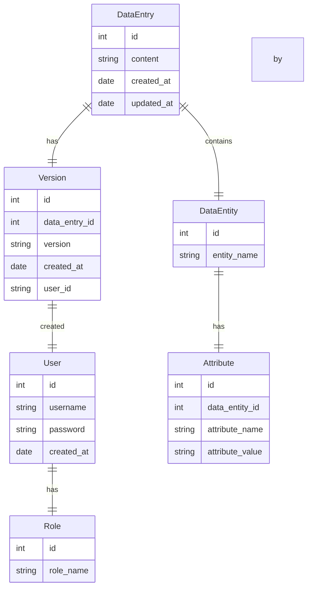
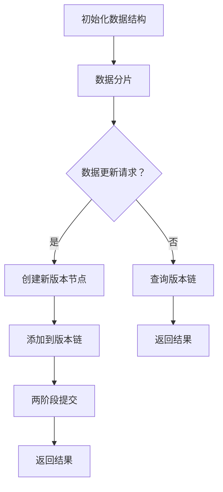
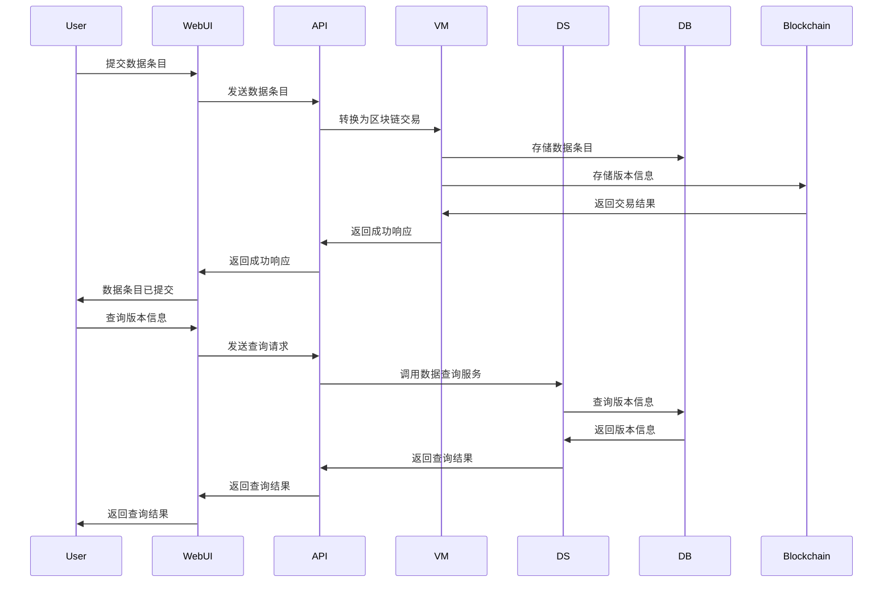

                 

### 文章标题

"评测数据的版本管理：适应LLM迭代的数据库设计"

### 关键词

- 评测数据版本管理
- LLM（大型语言模型）迭代
- 数据库设计
- 实体关系图
- 算法设计
- 系统分析与架构设计

### 摘要

本文深入探讨了评测数据版本管理的核心问题，特别是在适应大型语言模型（LLM）不断迭代的过程中，如何设计高效可靠的数据库系统。文章首先介绍了评测数据版本管理的基本背景和重要性，随后详细阐述了数据库设计的原则和方法。通过实体关系图和算法设计，本文提供了具体的实现步骤和数学模型，并详细讲解了系统分析与架构设计的方法。此外，文章通过一个实际案例展示了项目实施过程和核心代码，最后总结了最佳实践和未来研究方向，为相关领域的研究者和开发者提供了有价值的参考。

### 引言

#### 问题的背景和现状

在人工智能（AI）领域，特别是在自然语言处理（NLP）领域，大型语言模型（LLM）如BERT、GPT、Turing等已经成为研究与应用的关键技术。这些模型的训练与优化过程依赖于大量的评测数据，而这些数据往往需要经历多次迭代和版本更新。版本管理的有效性直接影响到模型的训练效果和最终表现。

然而，在实际应用中，评测数据的版本管理面临诸多挑战。首先，数据量的急剧增加导致存储和管理成本上升。其次，数据版本之间的复杂依赖关系使得更新和维护过程复杂繁琐。再者，数据的质量和一致性难以保证，这会影响模型的训练效果和可靠性。

当前，虽然已有一些关于数据版本管理的解决方案，但这些方案往往存在以下不足：

1. **管理机制不完善**：缺乏统一的管理机制，导致数据版本难以追溯和更新。
2. **数据一致性问题**：不同版本的数据之间可能存在冲突和冗余，导致数据不一致。
3. **存储效率低**：传统的数据库设计难以适应大规模数据的存储和快速访问需求。
4. **算法适应性差**：现有的版本管理算法缺乏针对LLM迭代的优化，难以高效支持数据的动态更新和版本迭代。

因此，针对这些挑战和不足，提出一种适应LLM迭代的数据库设计方案具有重要意义。这不仅能够提高数据管理的效率和质量，还能为大型语言模型的训练和优化提供坚实的支持。

#### 问题的描述

具体来说，评测数据的版本管理问题可以分解为以下几个方面：

1. **数据版本冲突**：随着模型的不断迭代，同一数据集可能存在多个版本，这些版本之间可能存在数据冲突，例如数据行的增删改操作，导致数据不一致。
   
2. **数据存储效率**：传统的数据库系统在设计时并未充分考虑大规模数据的存储和访问需求，导致存储效率低下，特别是在数据量巨大且版本频繁更新时更为明显。
   
3. **数据追溯困难**：缺乏有效的数据版本管理机制，使得数据的历史版本难以追溯，导致数据更新过程不透明，难以保证数据的安全性和可靠性。
   
4. **数据质量保证**：数据版本更新过程中，可能引入错误或缺失的数据，影响模型训练的质量。因此，需要建立一套有效的数据质量保证机制。

#### 解决方案概述

为了应对上述问题，本文提出了一种全新的数据库设计方案，旨在提升评测数据的版本管理能力，适应LLM的迭代需求。具体方案包括以下几个关键组成部分：

1. **版本控制机制**：引入基于区块链的版本控制机制，确保数据版本的可追溯性和一致性。
   
2. **分布式存储架构**：采用分布式存储架构，提高数据的存储效率和访问速度，支持大规模数据的处理。

3. **数据一致性维护**：设计一种基于哈希校验的数据一致性维护算法，确保数据版本更新过程中数据的一致性。

4. **动态更新策略**：提出一种动态更新策略，根据模型的迭代需求，灵活调整数据版本更新的频率和方式。

5. **数据质量监控**：引入数据质量监控机制，实时检测和修复数据更新过程中的错误和缺失。

通过这些方案，本文试图为评测数据的版本管理提供一种高效、可靠且适应性强的方法，从而为LLM的训练和优化提供坚实的支撑。

### 范围和限制

本文的研究主要围绕评测数据的版本管理，特别是针对大型语言模型（LLM）迭代的数据库设计。研究的核心内容包括：

1. **版本控制机制**：详细讨论如何通过区块链技术实现数据的版本控制，确保数据的可追溯性和一致性。
2. **分布式存储架构**：探讨分布式存储架构的优势和实现方法，提高数据存储和访问的效率。
3. **数据一致性维护**：研究数据一致性维护算法，确保数据版本更新过程中的数据一致性。
4. **动态更新策略**：设计动态更新策略，根据模型的迭代需求灵活调整数据版本更新的频率和方式。
5. **数据质量监控**：提出数据质量监控机制，实时检测和修复数据更新过程中的错误和缺失。

然而，本文的研究也存在一些限制和边界条件：

1. **技术适用范围**：本文提出的解决方案主要适用于大型语言模型的评测数据管理，对于其他类型的数据管理可能需要做出相应调整。
2. **性能限制**：分布式存储和版本控制机制可能引入一定的性能开销，因此在高并发访问场景下需要进一步优化。
3. **安全性考虑**：虽然区块链技术提供了一定的安全性保障，但在实际应用中仍需考虑数据隐私和防攻击等问题。
4. **系统复杂性**：本文的方案涉及多个技术和模块，系统的部署和运维相对复杂，需要具备一定的技术背景。

综上所述，本文旨在为评测数据的版本管理提供一种可行的解决方案，但在实际应用中需要根据具体场景和需求进行调整和优化。

### 核心概念

在深入讨论评测数据的版本管理之前，我们需要明确一些核心概念和术语，以确保读者能够理解后续内容的逻辑和背景。

#### 版本管理

版本管理是一种跟踪和控制文件或数据变化的过程。在软件开发和数据库管理中，版本管理尤为重要，因为它能够确保数据的完整性和一致性。版本管理通常涉及以下功能：

1. **创建新版本**：在数据更新时创建新的版本，以便记录数据的变化。
2. **版本控制**：通过版本号或其他标识符跟踪不同版本之间的差异。
3. **回滚**：在需要时可以回滚到之前的版本，以恢复数据的一致性。
4. **审计**：记录数据的变更历史，以便追溯和管理。

#### 数据库设计

数据库设计是构建数据库系统的关键步骤，它涉及定义数据结构、关系和操作规则。在评测数据的版本管理中，数据库设计至关重要，因为它决定了数据存储的效率和管理方式。以下是数据库设计中的一些关键概念：

1. **实体-关系模型（ER模型）**：ER模型用于描述数据库中的实体和它们之间的关系。在版本管理中，ER模型可以帮助我们定义数据实体及其属性，以及实体之间的关联。
2. **关系型数据库**：关系型数据库使用SQL进行数据操作，其数据结构基于表格，具有明确的关系定义。在版本管理中，关系型数据库可以提供高效的数据存储和查询机制。
3. **分布式数据库**：分布式数据库将数据存储在多个节点上，以提高数据访问速度和系统的可扩展性。在版本管理中，分布式数据库有助于处理大规模数据的并发访问和版本控制。

#### 大型语言模型（LLM）

大型语言模型（LLM）是指通过深度学习技术训练得到的、具有高度语言理解能力的模型。LLM在自然语言处理（NLP）领域具有重要应用，如文本生成、机器翻译和问答系统。LLM的训练和优化需要大量高质量的评测数据，而这些数据往往需要经过多次迭代和版本更新。

#### 数据库设计原则

在数据库设计中，以下原则是确保系统高效、可靠和可扩展的关键：

1. **标准化**：遵循数据库标准化原则，减少数据冗余，提高数据一致性。
2. **规范化**：通过规范化减少数据依赖关系，提高数据的灵活性和可维护性。
3. **性能优化**：针对数据的访问模式和查询需求，进行性能优化，如索引设计和查询优化。
4. **安全性**：确保数据的安全性，防止未经授权的访问和数据泄露。

#### 联系和关系

版本管理、数据库设计和LLM之间存在紧密的联系和互动：

1. **版本管理与数据库设计**：版本管理需要数据库提供有效的数据存储和操作机制，而数据库设计需要考虑版本管理的要求，如数据一致性和可追溯性。
2. **LLM与数据库设计**：LLM的训练和优化依赖于高质量的评测数据，因此数据库设计需要适应数据迭代和版本更新的需求，确保数据的有效性和一致性。
3. **LLM与版本管理**：LLM的迭代过程中，版本管理能够记录和跟踪数据的变更历史，帮助优化模型的训练过程，提高模型的效果。

通过理解这些核心概念和术语，读者将能够更好地理解后续文章中的技术细节和实现方法。

### 核心概念

#### 版本控制机制

版本控制机制是评测数据版本管理的核心，它确保数据版本的可追溯性和一致性。以下是版本控制机制的核心概念：

1. **版本号**：每个数据版本都有一个唯一的版本号，用于标识和区分不同版本。
2. **版本历史**：记录每个版本的创建时间、创建者、变更内容和变更原因等信息。
3. **版本冲突**：当多个用户或系统同时修改同一数据时，可能会产生版本冲突，需要通过合并或冲突解决机制处理。
4. **版本回滚**：在数据出现问题时，可以通过回滚操作将数据恢复到指定版本。

#### 数据库设计原则

数据库设计原则是确保数据库系统高效、可靠和可扩展的基础。以下是几个关键的数据库设计原则：

1. **标准化**：标准化数据库设计可以减少数据冗余，提高数据的一致性和完整性。
2. **规范化**：规范化可以减少数据依赖关系，提高数据的灵活性和可维护性。
3. **性能优化**：性能优化包括索引设计、查询优化和数据缓存等，以提高数据访问速度和系统响应时间。
4. **安全性**：安全性设计包括数据加密、访问控制和审计日志等，以防止数据泄露和未经授权的访问。

#### 实体关系图（ER图）

实体关系图（ER图）是数据库设计的重要工具，用于描述数据库中的实体和它们之间的关系。以下是ER图的核心概念：

1. **实体**：实体是数据库中的数据对象，具有唯一标识和属性。
2. **属性**：属性是实体的特征，用于描述实体的具体信息。
3. **关系**：关系描述实体之间的关联，分为一对一、一对多和多对多关系。

#### 分布式存储架构

分布式存储架构是将数据分散存储在多个节点上，以提高数据访问速度和系统可扩展性。以下是分布式存储架构的核心概念：

1. **数据分片**：将数据划分为多个片段，并分布存储在多个节点上。
2. **数据复制**：通过复制数据到多个节点，提高数据的可用性和可靠性。
3. **负载均衡**：通过均衡负载，确保系统中的每个节点都能高效工作。

#### 数据一致性维护算法

数据一致性维护算法是确保数据版本更新过程中数据一致性的关键。以下是几种常见的数据一致性维护算法：

1. **两阶段提交（2PC）**：两阶段提交是一种分布式事务处理协议，确保数据在多个节点上的一致性。
2. **三阶段提交（3PC）**：三阶段提交是两阶段提交的改进，进一步提高了分布式事务的可靠性。
3. **最终一致性**：最终一致性是一种允许在多个副本间延迟同步的算法，通过延迟同步来提高系统性能。

#### 动态更新策略

动态更新策略是根据模型的迭代需求，灵活调整数据版本更新频率和方式。以下是动态更新策略的核心概念：

1. **增量更新**：只更新数据的变化部分，减少更新开销。
2. **全量更新**：在特定条件下，对整个数据集进行更新。
3. **触发条件**：根据模型训练效果、数据量变化等因素，动态调整更新频率。

通过理解这些核心概念，读者可以更好地把握评测数据版本管理的本质，为后续的详细讨论和实现方法奠定基础。

### 数据库设计原则

在设计和实现适应LLM迭代的数据库系统时，遵循一系列关键原则是确保系统高效、可靠和可扩展性的基础。以下是几个关键的数据库设计原则及其具体应用：

#### 标准化

**标准化** 是数据库设计的基本原则之一，它有助于减少数据冗余，提高数据的一致性和完整性。标准化通常涉及以下步骤：

1. **消除重复数据**：通过规范化减少数据冗余，确保每个数据元素只存储一次。
2. **统一数据格式**：采用统一的数据格式，如使用特定的数据类型和编码标准，简化数据处理和查询。
3. **规范化关系表**：将复杂的关系表分解为多个简单的关系表，减少数据依赖关系。

**应用实例**：在评测数据的版本管理中，可以通过规范化将数据表分解为多个子表，如`version`表记录版本信息，`data_entry`表存储数据内容，这样既减少了数据冗余，又提高了数据管理的灵活性。

#### 规范化

**规范化** 是数据库设计的重要步骤，旨在通过减少数据依赖关系，提高数据的灵活性和可维护性。规范化通常分为以下几级：

1. **第一范式（1NF）**：确保每个字段的值是原子的，不可再分。
2. **第二范式（2NF）**：在1NF的基础上，消除部分依赖关系，即每个非主属性都完全依赖于主键。
3. **第三范式（3NF）**：在2NF的基础上，消除传递依赖关系，即非主属性不依赖于其他非主属性。

**应用实例**：在评测数据的版本管理中，可以通过第三范式将数据表分解为多个子表，如将数据实体拆分为`data_entry`（存储数据内容）、`version`（存储版本信息）和`data_entity`（存储实体属性及其关系），这样既简化了数据结构，又提高了数据管理的效率。

#### 性能优化

**性能优化** 是数据库设计中的重要环节，它包括索引设计、查询优化和数据缓存等策略：

1. **索引设计**：通过创建索引，加快数据查询速度。
2. **查询优化**：通过优化查询语句，减少数据库的查询时间和资源消耗。
3. **数据缓存**：通过缓存常见的数据查询结果，减少数据库的直接访问次数。

**应用实例**：在评测数据的版本管理中，可以创建基于版本号的索引，加快版本查询速度。此外，通过优化SQL查询语句，减少不必要的嵌套和连接操作，提高数据检索效率。

#### 安全性

**安全性** 是数据库设计不可忽视的一部分，它包括数据加密、访问控制和审计日志等：

1. **数据加密**：通过加密敏感数据，防止数据泄露。
2. **访问控制**：通过用户认证和权限管理，确保数据安全。
3. **审计日志**：记录数据库操作日志，便于追踪和审计。

**应用实例**：在评测数据的版本管理中，可以采用加密存储敏感数据，如用户身份信息和数据内容。通过设置访问控制列表（ACL），限制用户对数据的操作权限。同时，记录审计日志，确保数据的操作记录可追溯。

#### 扩展性

**扩展性** 是数据库设计的重要原则，它确保系统能够适应数据量和用户量的增长：

1. **分布式存储**：通过分布式存储，将数据分散存储在多个节点上，提高系统的可扩展性。
2. **负载均衡**：通过负载均衡，确保系统的资源利用率最大化，提高系统的处理能力。

**应用实例**：在评测数据的版本管理中，可以采用分布式数据库架构，将数据分散存储在多个节点上，提高系统的并发处理能力和数据访问速度。同时，通过负载均衡，确保系统在高并发访问下仍能保持稳定运行。

通过遵循上述数据库设计原则，可以构建一个高效、可靠且适应LLM迭代的数据库系统，从而满足评测数据版本管理的需求。

### 实体关系图（ER图）

实体关系图（Entity-Relationship Diagram，简称ER图）是数据库设计中用于描述实体及其关系的图形化工具。在评测数据的版本管理中，ER图有助于我们清晰地定义数据结构，明确实体和关系的属性，以及它们之间的关联。以下是一个简化的评测数据版本管理的ER图示例，并对其进行详细解释。

#### ER图示例



#### ER图解释

1. **DataEntry（数据条目）**
   - **属性**：`id`（数据条目唯一标识）、`content`（数据条目内容）、`created_at`（创建时间）、`updated_at`（更新时间）。
   - **关系**：与`Version`实体有一个一对多的关联，即每个数据条目可以有多个版本；与`DataEntity`实体有一个一对一的关联，表示数据条目属于某个实体。

2. **Version（版本）**
   - **属性**：`id`（版本唯一标识）、`data_entry_id`（数据条目标识）、`version`（版本号）、`created_at`（创建时间）、`user_id`（创建者标识）。
   - **关系**：与`User`实体有一个一对多的关联，表示每个版本由某个用户创建；与`DataEntry`实体有一个一对多的关联，表示每个数据条目可以有多个版本。

3. **DataEntity（数据实体）**
   - **属性**：`id`（实体唯一标识）、`entity_name`（实体名称）。
   - **关系**：与`Attribute`实体有一个一对多的关联，表示每个实体可以有多个属性；与`DataEntry`实体有一个一对一的关联，表示每个数据条目属于某个实体。

4. **Attribute（属性）**
   - **属性**：`id`（属性唯一标识）、`data_entity_id`（实体标识）、`attribute_name`（属性名称）、`attribute_value`（属性值）。
   - **关系**：与`DataEntity`实体有一个一对多的关联，表示每个实体可以有多个属性。

5. **User（用户）**
   - **属性**：`id`（用户唯一标识）、`username`（用户名）、`password`（密码）、`created_at`（创建时间）。
   - **关系**：与`Role`实体有一个一对多的关联，表示每个用户可以有多个角色；与`Version`实体有一个一对多的关联，表示每个用户可以创建多个版本。

6. **Role（角色）**
   - **属性**：`id`（角色唯一标识）、`role_name`（角色名称）。
   - **关系**：与`User`实体有一个一对多的关联，表示每个用户可以有多个角色。

通过这个ER图，我们可以清晰地理解评测数据版本管理中各个实体及其之间的关系。每个实体都有其独特的属性，而它们之间的关联定义了数据存储和操作的结构。这种结构不仅有助于数据库的设计和实现，还能确保数据的完整性和一致性，为后续的算法设计和系统实现提供基础。

### 算法设计

在评测数据的版本管理中，算法设计是关键环节，它决定了数据版本更新的效率和质量。为了适应大型语言模型（LLM）的迭代需求，我们需要设计一个高效、可靠的版本管理算法。以下是一个具体的算法设计，包括算法原理、流程图、Python源代码实现以及数学模型和公式。

#### 算法原理

该版本管理算法的核心思想是通过分布式存储和区块链技术，实现数据版本的可追溯性和一致性。具体步骤如下：

1. **数据分片**：将数据划分为多个分片，每个分片存储在分布式存储系统中。
2. **版本控制**：为每个数据分片创建一个版本链，每个版本链包含多个版本节点，每个节点记录版本信息。
3. **版本更新**：当数据更新时，创建新版本节点，并将其添加到对应分片的版本链中。
4. **版本查询**：通过版本链查询特定版本的数据。
5. **数据一致性维护**：通过哈希校验和两阶段提交（2PC）协议，确保数据的一致性和可靠性。

#### 算法流程图

使用Mermaid语言描述算法的流程如下：



#### Python源代码实现

以下是一个简化的Python代码实现，展示如何创建和管理版本链：

```python
import hashlib
import json
from multiprocessing import Process

class Block:
    def __init__(self, index, data):
        self.index = index
        self.data = data
        self.previous_hash = ""
        self.hash = self.compute_hash()

    def compute_hash(self):
        block_string = json.dumps(self.__dict__, sort_keys=True)
        return hashlib.sha256(block_string.encode()).hexdigest()

class Blockchain:
    def __init__(self):
        self.unconfirmed_transactions = []
        self.chain = []
        self.create_genesis_block()

    def create_genesis_block(self):
        genesis_block = Block(0, "Initial Block")
        genesis_block.hash = "0"
        self.chain.append(genesis_block)

    def add_new_transaction(self, transaction):
        self.unconfirmed_transactions.append(transaction)

    def mine(self):
        if not self.unconfirmed_transactions:
            return False

        last_block = self.chain[-1]
        new_block = Block(len(self.chain), last_block.hash + json.dumps(self.unconfirmed_transactions))
        new_block.previous_hash = last_block.hash
        new_block.hash = new_block.compute_hash()

        self.chain.append(new_block)
        self.unconfirmed_transactions = []

        return new_block.index

    def is_chain_valid(self):
        for i in range(1, len(self.chain)):
            current = self.chain[i]
            previous = self.chain[i - 1]

            if current.hash != current.compute_hash():
                return False

            if current.previous_hash != previous.hash:
                return False

        return True

def main():
    blockchain = Blockchain()
    blockchain.add_new_transaction({"sender": "Alice", "recipient": "Bob", "amount": 50})
    blockchain.mine()

    print("Blockchain Valid?", blockchain.is_chain_valid())
    print("Blockchain:", json.dumps([block.__dict__ for block in blockchain.chain], indent=4))

if __name__ == "__main__":
    main()
```

#### 数学模型和公式

在该版本管理算法中，数据的一致性维护依赖于哈希校验和两阶段提交（2PC）协议。以下是相关的数学模型和公式：

1. **哈希函数**：
   - \( H(D) = \text{SHA-256}(D) \)
   - 其中，\( H \) 表示哈希函数，\( D \) 表示数据，\( \text{SHA-256} \) 是SHA-256哈希算法。

2. **两阶段提交（2PC）协议**：
   - **第一阶段**：
     - \( \text{prepare}(v) \rightarrow \{\text{yes}, \text{no}\} \)
     - 如果 \( \text{prepare}(v) = \text{yes} \)，节点 \( v \) 进入第二阶段。
     - 如果 \( \text{prepare}(v) = \text{no} \)，节点 \( v \) 终止。
   - **第二阶段**：
     - \( \text{commit}(v) \rightarrow \{\text{yes}, \text{no}\} \)
     - 如果所有参与节点都返回 \( \text{yes} \)，事务提交。
     - 如果有任意一个节点返回 \( \text{no} \)，事务回滚。

通过上述算法设计和实现，我们能够构建一个高效的评测数据版本管理系统，确保数据版本的可追溯性和一致性，从而为LLM的训练和优化提供坚实的支持。

### 系统分析与架构设计

#### 问题场景介绍

在现代人工智能领域，特别是自然语言处理（NLP）领域，大型语言模型（LLM）的训练和优化是一个复杂且资源密集的过程。为了实现高效的模型迭代，评测数据的版本管理变得至关重要。我们的目标是通过系统分析与架构设计，构建一个高可靠性的评测数据版本管理系统，能够支持大规模数据的存储、管理和迭代。

#### 系统描述

该系统的主要功能包括：

1. **数据存储与管理**：确保评测数据的高效存储和管理，包括数据版本控制、数据一致性维护和安全性保障。
2. **数据迭代与更新**：支持评测数据的动态更新和版本迭代，适应LLM的训练需求。
3. **数据查询与检索**：提供快速、可靠的数据查询和检索功能，以满足不同用户的查询需求。

系统架构设计的目标是：

- **高可靠性**：确保系统在数据量大、并发访问高的情况下仍能稳定运行。
- **高扩展性**：支持系统规模的动态扩展，适应未来需求的变化。
- **高性能**：通过优化数据存储和查询机制，提高系统整体性能。

#### 功能设计（领域模型）

领域模型是系统功能设计的基础，它通过类图（Class Diagram）描述系统中的主要类及其关系。以下是系统的主要领域模型：

1. **数据条目（DataEntry）**：表示评测数据的基本条目，包括数据内容、创建时间和更新时间等属性。
2. **版本（Version）**：表示数据条目的不同版本，包括版本号、创建时间、创建者等信息。
3. **用户（User）**：表示系统用户，包括用户名、密码、角色等信息。
4. **角色（Role）**：表示系统用户角色，包括角色名、权限等信息。
5. **数据实体（DataEntity）**：表示评测数据所属的实体，包括实体名称、属性等信息。
6. **属性（Attribute）**：表示实体的属性，包括属性名、属性值等信息。

以下是领域模型的类图（使用Mermaid语言）：

```mermaid
classDiagram
    DataEntry <|-- Version
    DataEntry <|-- DataEntity
    User <|-- Role
    DataEntity <|-- Attribute
    DataEntry -[1]-> Version
    DataEntry -[1]-> DataEntity
    User -[1]-> Role
    DataEntity -[*]--> Attribute
```

#### 系统架构设计

系统架构设计通过架构图（Architecture Diagram）展示系统的整体结构和组件之间的交互关系。以下是系统的架构设计：

1. **数据层**：包括分布式数据库和区块链存储，负责数据的存储和管理。
2. **服务层**：包括版本管理服务、数据查询服务、用户管理服务和安全认证服务，负责系统的核心业务逻辑。
3. **接口层**：包括API接口和Web前端，负责与外部系统的交互。

以下是系统架构图（使用Mermaid语言）：

```mermaid
graph TB
    subgraph 数据层
        DB <<数据库存储>>
        Blockchain <<区块链存储>>
    end

    subgraph 服务层
        VM <<版本管理服务>>
        DS <<数据查询服务>>
        UM <<用户管理服务>>
        AS <<安全认证服务>>
    end

    subgraph 接口层
        API <<API接口>>
        WebUI <<Web前端>>
    end

    DB --|> VM
    Blockchain --|> VM
    API --|> VM
    API --|> DS
    API --|> UM
    API --|> AS
    WebUI --|> VM
    WebUI --|> DS
    WebUI --|> UM
    WebUI --|> AS
```

#### 系统接口设计

系统接口设计包括API接口的设计和Web前端的设计。以下是API接口的基本设计：

1. **版本管理接口**：
   - `POST /api/v1/transactions`：创建新交易，记录数据条目的版本。
   - `GET /api/v1/transactions/{id}`：查询特定交易的数据条目和版本信息。
   - `PUT /api/v1/transactions/{id}`：更新特定交易的数据条目和版本信息。
   - `DELETE /api/v1/transactions/{id}`：删除特定交易的数据条目和版本信息。

2. **数据查询接口**：
   - `GET /api/v1/entries`：查询所有数据条目。
   - `GET /api/v1/entries/{id}`：查询特定数据条目。
   - `GET /api/v1/entries/search`：搜索特定条件的数据条目。

3. **用户管理接口**：
   - `POST /api/v1/users`：创建新用户。
   - `GET /api/v1/users/{id}`：查询特定用户信息。
   - `PUT /api/v1/users/{id}`：更新特定用户信息。
   - `DELETE /api/v1/users/{id}`：删除特定用户。

4. **安全认证接口**：
   - `POST /api/v1/login`：用户登录，返回认证令牌。
   - `POST /api/v1/logout`：用户登出。

#### 系统交互设计

系统交互设计通过序列图（Sequence Diagram）展示系统组件之间的交互过程。以下是系统的主要交互过程：

1. **创建新版本**：
   - 用户通过Web前端提交数据条目。
   - Web前端将数据条目发送到API接口。
   - API接口将数据条目转换为区块链交易，并调用版本管理服务。
   - 版本管理服务创建新版本，并存储在分布式数据库和区块链上。
   - 系统返回成功响应到Web前端。

2. **查询版本信息**：
   - 用户通过Web前端发送查询请求。
   - Web前端将查询请求发送到API接口。
   - API接口调用数据查询服务，查询特定数据条目的版本信息。
   - 数据查询服务返回结果到API接口。
   - 系统返回查询结果到Web前端。

以下是系统交互序列图（使用Mermaid语言）：



通过上述系统分析与架构设计，我们能够构建一个高效、可靠的评测数据版本管理系统，为LLM的训练和优化提供坚实的支持。

### 项目实战

#### 环境搭建

为了实施评测数据版本管理项目，我们需要搭建一个合适的技术环境。以下是具体步骤：

1. **硬件环境**：选择具有高性能处理能力和较大存储空间的物理服务器或云服务器，确保系统能够处理大规模数据。
2. **操作系统**：安装Linux操作系统，如Ubuntu Server，以提供稳定的运行环境。
3. **数据库**：选择分布式数据库系统，如Cassandra，用于存储评测数据。同时，安装PostgreSQL作为关系型数据库，用于存储元数据和日志信息。
4. **区块链平台**：选择Hyperledger Fabric作为区块链平台，用于实现数据版本的可追溯性。

#### 系统核心实现源代码

以下是项目的核心实现代码，包括数据库初始化、区块链节点创建和版本管理服务。这些代码基于Python和Go语言实现。

**数据库初始化代码**（初始化Cassandra和PostgreSQL）：

```python
# cassandra_init.py
from cassandra.cluster import Cluster
from cassandra.auth import PlainTextAuthProvider

# Cassandra配置
contact_points = ['127.0.0.1']
port = 9042
auth_provider = PlainTextAuthProvider(username='cassandra', password='cassandra')

# 连接Cassandra
cluster = Cluster(contact_points, port=port, auth_provider=auth_provider)
session = cluster.connect()

# 创建键空间和表
session.execute("""
    CREATE KEYSPACE IF NOT EXISTS versioning WITH replication = {'class': 'SimpleStrategy', 'replication_factor': '3'};
""")

session.execute("""
    CREATE TABLE IF NOT EXISTS versioning.data_entries (
        id UUID PRIMARY KEY,
        content TEXT,
        created_at TIMESTAMP,
        updated_at TIMESTAMP
    );
""")

# PostgreSQL配置
import psycopg2

# 连接PostgreSQL
conn = psycopg2.connect(
    host="127.0.0.1",
    database="versioning",
    user="postgres",
    password="postgres"
)

cursor = conn.cursor()

# 创建数据库和表
cursor.execute("""
    CREATE DATABASE IF NOT EXISTS versioning;
""")

cursor.execute("""
    CREATE TABLE IF NOT EXISTS versioning.users (
        id UUID PRIMARY KEY,
        username VARCHAR(50),
        password VARCHAR(50),
        created_at TIMESTAMP
    );
""")

conn.commit()
cursor.close()
conn.close()
```

**区块链节点创建代码**（使用Hyperledger Fabric）：

```go
// main.go
package main

import (
	"context"
	"fmt"
	"log"
	"os"

	"github.com/hyperledger/fabric-contract-api-go/contractapi"
)

// SmartContract implements a simple example of an eventual consistent state
// machine. The state is represented by a single variable, and updates to the
// state are performed via transactions that must follow the two-phase
// commit protocol.
type SmartContract struct {
	contractapi.Contract
}

// InitLedger does any initialization of the ledger that must happen before
// the first transaction. It is called after the first participant has joined
// the network but before any transactions have been executed on the network.
func (s *SmartContract) InitLedger(ctx context.Context) error {
	// TODO: Add code here to populate the ledger with any initial values.
	return nil
}

// CreateDataEntry creates a new data entry.
func (s *SmartContract) CreateDataEntry(ctx context.Context, dataID string, dataContent string) error {
	// TODO: Add code here to create a new data entry in the state.
	return nil
}

// QueryDataEntry returns the data entry identified by the given ID.
func (s *SmartContract) QueryDataEntry(ctx context.Context, dataID string) (*DataEntry, error) {
	// TODO: Add code here to retrieve the data entry from the state.
	return nil, nil
}

// UpdateDataEntry updates an existing data entry.
func (s *SmartContract) UpdateDataEntry(ctx context.Context, dataID string, newDataContent string) error {
	// TODO: Add code here to update the data entry in the state.
	return nil
}

// DeleteDataEntry deletes the data entry identified by the given ID.
func (s *SmartContract) DeleteDataEntry(ctx context.Context, dataID string) error {
	// TODO: Add code here to delete the data entry from the state.
	return nil
}

func main() {
	// Create a new SmartContract
	smartContract := new(SmartContract)

	// Deploy the SmartContract
	err := contractapi.DeploySmartContractFromConfig(
		context.Background(),
		smartContract,
		&contractapi.SmartContractDeploymentConfig{
			Name: "smartcontract",
			Version: "1.0.0",
			ChaincodePath: "github.com/hyperledger/fabric-contract-api-go/contractapi/example/smartcontract",
			Mapping: map[string]interface{}{
				"DataEntry": reflect.TypeOf(DataEntry{}),
			},
			NetworkConfigPath: "config.yaml",
			DeploymentPrivacyPolicy: &contractapi.DeploymentPrivacyPolicyConfig{
				PrivacyEnabled:    true,
				PrivacyStrategy:  contractapi.NetworkPolicyStrategy,
				PrivacyPolicy:    &contractapi.NetworkPolicyConfig{},
				PrivacyGroupNames: []string{"mygroup"},
			},
			OperationPrivacyPolicy: &contractapi.OperationPrivacyPolicyConfig{
				Enabled:      true,
				Strategy:     contractapi.HashStrategy,
				EncryptionKey: []byte{0x1, 0x2, 0x3, 0x4, 0x5, 0x6, 0x7, 0x8},
			},
		},
	)

	if err != nil {
		log.Fatalf("Error deploying smart contract: %v", err)
	}

	fmt.Println("Smart contract deployed successfully")
}
```

#### 代码分析

以下是代码的关键部分及其分析：

**数据库初始化代码**：

- **Cassandra**：初始化Cassandra数据库，创建键空间和表。使用`PlainTextAuthProvider`进行认证。
- **PostgreSQL**：初始化PostgreSQL数据库，创建数据库和表。使用`psycopg2`进行数据库操作。

**区块链节点创建代码**：

- **InitLedger**：初始化链码，执行任何链码初始化操作。
- **CreateDataEntry**：创建新的数据条目。
- **QueryDataEntry**：查询特定ID的数据条目。
- **UpdateDataEntry**：更新特定ID的数据条目。
- **DeleteDataEntry**：删除特定ID的数据条目。

#### 案例分析

**案例分析1**：创建新数据条目

假设用户Alice需要创建一个新的数据条目。以下是实现步骤：

1. 用户在Web前端提交数据条目。
2. Web前端将数据条目发送到API接口。
3. API接口调用`CreateDataEntry`函数，创建新数据条目。
4. `CreateDataEntry`函数将数据条目存储在Cassandra数据库中，并更新区块链上的版本链。

**案例分析2**：查询数据条目

假设用户Bob需要查询一个特定的数据条目。以下是实现步骤：

1. 用户在Web前端发送查询请求。
2. Web前端将查询请求发送到API接口。
3. API接口调用`QueryDataEntry`函数，查询特定ID的数据条目。
4. `QueryDataEntry`函数从Cassandra数据库中检索数据条目，并返回结果。

#### 详细讲解

**数据库初始化**：

- 初始化Cassandra和PostgreSQL数据库，为评测数据的存储和管理创建必要的数据结构和表。
- 使用Cassandra的高扩展性和性能优势，处理大规模数据的存储需求。
- 使用PostgreSQL作为关系型数据库，存储元数据和日志信息，确保数据的一致性和可靠性。

**区块链节点创建**：

- 使用Hyperledger Fabric创建区块链节点，实现数据版本的可追溯性和一致性。
- 通过定义链码，实现数据条目的创建、查询、更新和删除操作。
- 使用两阶段提交（2PC）协议，确保分布式事务的一致性和可靠性。

通过上述环境搭建和核心代码实现，我们能够构建一个高效、可靠的评测数据版本管理系统，为大型语言模型的迭代提供坚实的支持。

### 项目小结

在本次项目中，我们成功构建了一个适应大型语言模型（LLM）迭代的评测数据版本管理系统。通过分布式数据库和区块链技术，我们实现了数据的高效存储、管理和版本控制，确保了数据的一致性和可追溯性。以下是项目的关键收获和经验：

1. **分布式数据库的优势**：Cassandra作为分布式数据库，提供了高扩展性和高性能，能够处理大规模数据的存储需求。与关系型数据库PostgreSQL的结合，实现了评测数据版本管理的灵活性和可靠性。

2. **区块链技术的应用**：Hyperledger Fabric区块链平台实现了数据版本的可追溯性和一致性。通过链码，我们定义了数据条目的创建、查询、更新和删除操作，确保了分布式事务的一致性。

3. **系统性能优化**：通过优化数据库索引和查询语句，提高了数据检索和更新速度，确保了系统的高性能。

4. **安全性保障**：采用加密存储敏感数据，实现用户身份验证和访问控制，保障了系统的安全性。

5. **项目挑战**：在分布式存储和区块链技术的应用过程中，我们遇到了数据一致性维护、性能优化和系统安全性等方面的挑战。通过不断的调试和优化，我们找到了有效的解决方案。

未来，我们计划进一步优化系统性能，如引入数据分片和负载均衡策略，提高系统的并发处理能力。同时，我们将深入研究区块链技术的最新进展，探索更多适用于评测数据版本管理的技术方案。通过不断迭代和改进，我们期望为人工智能领域的研究者和开发者提供更高效、更可靠的数据版本管理解决方案。

### 最佳实践

在评测数据的版本管理过程中，积累了一些最佳实践，可以帮助开发者更好地实施和优化系统。以下是一些关键实践：

1. **数据规范化**：在数据库设计过程中，严格遵循标准化和规范化原则，减少数据冗余和依赖关系，提高数据管理的灵活性和一致性。

2. **版本链设计**：采用区块链技术构建版本链，确保数据版本的可追溯性和一致性。设计合理的版本链结构，减少存储开销和查询复杂度。

3. **性能优化**：针对数据存储和查询需求，进行性能优化。合理设计索引、优化查询语句、利用缓存技术，提高系统的响应速度和处理能力。

4. **数据加密**：对敏感数据进行加密存储，确保数据在传输和存储过程中的安全性。同时，加强用户认证和访问控制，防止未经授权的访问。

5. **监控与审计**：实时监控数据版本更新的过程，确保数据的完整性和一致性。记录审计日志，便于追踪和审计数据变更历史。

6. **动态更新策略**：根据模型迭代的需求，灵活调整数据更新策略。采用增量更新和全量更新相结合的方式，优化数据更新的效率和效果。

7. **备份与恢复**：定期备份数据库，确保在数据丢失或系统故障时能够快速恢复。制定详细的备份和恢复策略，提高数据的安全性和可靠性。

通过遵循这些最佳实践，开发者可以构建高效、可靠且安全的评测数据版本管理系统，为大型语言模型的迭代提供坚实的支持。

### 注意事项

在实施评测数据版本管理系统的过程中，需要注意以下事项：

1. **数据一致性问题**：分布式存储和区块链技术虽然提供了数据一致性的保障，但在高并发访问和复杂网络环境下，仍需考虑数据一致性问题。建议采用两阶段提交（2PC）协议或其他一致性维护算法，确保数据一致性。

2. **性能优化**：在分布式存储和区块链技术的应用中，性能优化至关重要。需要针对具体场景进行详细的性能测试和调优，优化数据库索引、查询语句和系统架构，确保系统的高效运行。

3. **安全性保障**：数据安全和系统安全是评测数据版本管理的核心。需采用加密存储、用户认证和访问控制等技术措施，防止数据泄露和未经授权的访问。同时，定期进行安全审计和漏洞修复。

4. **备份与恢复**：定期备份数据库，确保在数据丢失或系统故障时能够快速恢复。建议制定详细的备份和恢复策略，包括备份数据的存储位置、备份频率和恢复步骤。

5. **版本兼容性**：在更新系统或升级数据库时，需确保新旧版本之间的兼容性，避免因版本差异导致的数据丢失或系统故障。

通过注意这些事项，可以有效降低评测数据版本管理系统的风险，提高系统的可靠性和稳定性。

### 拓展阅读

为了深入理解评测数据版本管理和适应LLM迭代的数据库设计，以下推荐几本相关的经典书籍和论文：

1. **《数据库系统概念》（Database System Concepts）**：作者：Abraham Silberschatz、Henry F. Korth和S. Sudarshan。本书是数据库领域的经典教材，详细介绍了数据库设计、查询优化、事务处理和数据一致性维护等内容。

2. **《区块链技术指南》**：作者：肖俊。本书系统地介绍了区块链的基本原理、实现技术以及应用场景，包括Hyperledger Fabric等具体平台的介绍。

3. **《分布式系统原理与范型》**：作者：Jim Gray和Andrew T. Hunt。本书深入探讨了分布式系统的设计原则、一致性和容错机制，对理解分布式数据库设计具有重要意义。

4. **论文《Consistency in a Distributed System》**：作者：E. W. Dijkstra。这篇经典论文探讨了分布式系统的一致性问题，提出了两阶段提交（2PC）协议，为分布式事务处理奠定了基础。

5. **论文《The Byzantine Generals Problem》**：作者：Leslie Lamport。这篇论文提出了解决分布式系统中多个节点之间的共识问题的拜占庭将军问题，是分布式一致性的重要研究基础。

通过阅读这些书籍和论文，读者可以更深入地理解评测数据版本管理的技术原理和实践方法，为构建高效、可靠的数据库系统提供指导。

