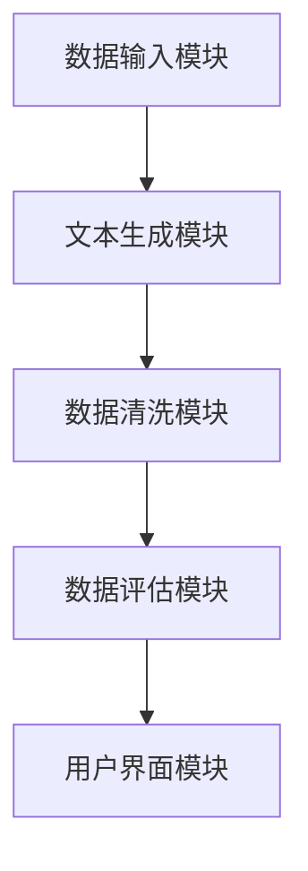

                 

### 引言与背景

#### 1.1 问题背景

在人工智能（AI）领域，评测数据的质量和数量直接影响着算法模型的性能评估和优化。随着AI技术的发展，评测数据的自动生成成为了一个亟待解决的问题。传统的评测数据往往依赖于人工生成，这不仅耗时费力，而且难以保证数据的一致性和全面性。此外，随着数据量的激增，人工生成数据的方式已无法满足不断增长的需求。

##### 1.1.1 评测数据在AI领域的核心作用

评测数据是AI算法训练和评估的重要资源。它们不仅用于训练模型，帮助模型学习到特定任务的特征，还用于评估模型的性能，确保模型在不同条件下的一致性和可靠性。因此，高质量的评测数据对于AI算法的改进和实际应用至关重要。

##### 1.1.2 人工生成评测数据的局限性

人工生成评测数据存在以下几个局限性：

1. **耗时耗力**：大规模的评测数据需要大量的时间和人力成本。
2. **数据一致性**：不同人工生成的数据可能存在差异，影响评测结果的准确性。
3. **数据多样性**：人工生成的数据往往无法覆盖所有可能的情况，导致模型在未知场景下表现不佳。
4. **数据质量问题**：人工生成的数据可能包含噪声和错误，影响模型的训练效果。

#### 1.2 评测数据自动生成的研究现状与挑战

##### 1.2.1 相关技术综述

近年来，随着自然语言处理（NLP）、计算机视觉（CV）和深度学习技术的发展，评测数据的自动生成研究逐渐成为热点。现有技术主要分为以下几类：

1. **基于模板的数据生成**：通过预定义的模板生成结构化数据，适用于数据量较小且结构化程度较高的场景。
2. **基于生成对抗网络（GAN）的数据生成**：通过对抗训练生成逼真的数据，适用于图像和音频等领域。
3. **基于转移学习的数据生成**：利用已有的大量数据通过迁移学习生成新的评测数据。

##### 1.2.2 自动生成评测数据面临的挑战

尽管已有一些自动生成评测数据的技术，但实际应用中仍面临以下挑战：

1. **数据质量问题**：自动生成的数据可能存在偏差、噪声和不一致性，影响模型的训练和评估。
2. **模型可解释性**：自动生成的数据背后的机制复杂，模型难以解释，增加了使用和优化的难度。
3. **数据安全与隐私**：自动生成过程中可能涉及敏感数据的处理，需要确保数据安全和隐私。
4. **计算资源消耗**：自动生成评测数据通常需要大量的计算资源，特别是在生成高质量数据时。

##### 1.3 LLM在评测数据自动生成中的应用前景

近年来，大型语言模型（LLM）在NLP领域取得了显著的突破，展示出强大的生成能力和适应性。LLM通过学习大量的文本数据，能够生成高质量、多样化的文本，这对于评测数据的自动生成具有巨大潜力。

##### 1.3.1 LLM的优势

1. **强大的文本生成能力**：LLM能够生成流畅、符合语法规则和语义逻辑的文本。
2. **自适应性与可扩展性**：LLM可以根据不同的任务和领域调整生成策略，适应不同的数据需求。
3. **语言理解的深度与广度**：LLM能够理解复杂的语言结构和语义，生成更加丰富和多样化的文本。

##### 1.3.2 LLM在评测数据自动生成中的应用可能性

1. **数据预处理**：LLM可以用于数据清洗和预处理，提高数据质量。
2. **数据增强**：LLM可以生成与原始数据相关的新数据，提高数据多样性和模型的鲁棒性。
3. **虚拟评测数据生成**：LLM可以生成高质量的虚拟评测数据，解决数据不足和多样性问题。

##### 1.4 本书结构安排

本书将从以下几个方面展开：

1. **语言模型基础**：介绍语言模型的概念、类型和发展历程，分析LLM的核心特性。
2. **LLM在评测数据自动生成中的应用**：详细讨论LLM在数据预处理、数据增强和虚拟评测数据生成中的应用方法。
3. **实际案例研究**：通过具体案例展示LLM在自然语言处理、计算机视觉和人工智能应用领域的实际应用。
4. **挑战与未来发展趋势**：分析LLM在评测数据自动生成中的挑战，探讨未来发展趋势。

##### 1.4.1 内容安排与章节组织

本书共分为五个部分，具体章节如下：

- **第一部分：引言与背景**：介绍评测数据自动生成的必要性、研究现状与挑战，以及LLM的应用前景。
- **第二部分：语言模型基础**：介绍语言模型的概念、类型和发展历程，分析LLM的核心特性。
- **第三部分：LLM在评测数据自动生成中的应用**：详细讨论LLM在数据预处理、数据增强和虚拟评测数据生成中的应用方法。
- **第四部分：实际案例研究**：通过具体案例展示LLM在不同领域的应用。
- **第五部分：挑战与未来发展趋势**：分析LLM在评测数据自动生成中的挑战，探讨未来发展趋势。

##### 1.4.2 阅读建议与目标读者

本书的目标读者为对评测数据自动生成和大型语言模型（LLM）感兴趣的研究人员、开发者和技术爱好者。本书旨在为读者提供一个系统、全面的学习资料，帮助读者深入理解评测数据自动生成的原理和方法，以及LLM在实际应用中的优势与挑战。

建议读者按照以下顺序阅读：

1. **第一部分**：了解评测数据自动生成的背景和挑战。
2. **第二部分**：掌握语言模型的基础知识和LLM的特性。
3. **第三部分**：学习LLM在评测数据自动生成中的应用方法。
4. **第四部分**：通过案例研究加深对LLM应用的理解。
5. **第五部分**：思考LLM在评测数据自动生成中的未来发展趋势。

通过本书的学习，读者将能够：

- 理解评测数据在AI领域的重要性及其自动生成的必要性。
- 掌握语言模型的基本原理和LLM的核心特性。
- 学会使用LLM进行评测数据的自动生成，提高数据质量和模型性能。
- 分析LLM在评测数据自动生成中的应用挑战和未来发展趋势。

##### 1.5 本章小结

本章主要介绍了评测数据自动生成的必要性、研究现状与挑战，以及LLM在评测数据自动生成中的应用前景。通过本章的阅读，读者可以了解到评测数据在AI领域的重要性，以及为什么自动生成评测数据是解决当前问题的重要途径。同时，本章也分析了LLM的优势及其在评测数据自动生成中的应用潜力。下一章将深入探讨语言模型的基础知识，为后续内容的学习奠定基础。

---

### 语言模型基础

#### 2.1 语言模型的概念与原理

##### 2.1.1 语言模型的定义

语言模型（Language Model，简称LM）是自然语言处理（Natural Language Processing，简称NLP）领域中的一种基础模型，用于预测自然语言序列的概率分布。简单来说，语言模型是一种能够根据上下文信息预测下一个词语或字符的概率分布的模型。

语言模型的主要目的是通过对大量文本数据的训练，学习到语言的统计规律和语法结构，从而在生成文本、翻译文本、文本分类等任务中发挥作用。在自然语言处理中，语言模型的应用范围非常广泛，从文本生成、机器翻译、语音识别到信息检索等，都离不开语言模型的支撑。

##### 2.1.2 语言模型的原理

语言模型的工作原理可以分为两个部分：一是如何表示自然语言，二是如何基于这些表示来预测下一个词语或字符。

1. **表示自然语言**：语言模型的表示方式主要有基于词袋模型（Bag of Words, BoW）和基于语义的方法。词袋模型通过将文本表示为词语的集合，不考虑词语的顺序和语法结构。而基于语义的方法则通过将文本映射到语义空间中，考虑词语的语义关系和上下文。

2. **预测下一个词语或字符**：语言模型的核心任务是根据已知的输入序列预测下一个词语或字符。这一过程通常通过构建一个概率模型来完成。常见的概率模型有：

   - **n-gram模型**：基于前n个词语的统计信息预测下一个词语的概率。
   - **神经网络模型**：通过神经网络结构来学习输入和输出之间的非线性关系。

##### 2.2 语言模型的类型

语言模型的类型可以根据不同的分类标准进行划分。以下是几种常见的语言模型类型：

1. **基于统计的语言模型**：

   - **n-gram模型**：是最简单的语言模型之一，它根据前n个词语的统计信息来预测下一个词语的概率。n-gram模型不考虑词语之间的顺序和语法关系，但其在一些任务中仍然表现出较好的性能。
   - **隐马尔可夫模型（Hidden Markov Model, HMM）**：HMM是一种基于状态的模型，用于处理隐含的变量序列，可以用于语音识别和文本生成。

2. **基于神经网络的深度语言模型**：

   - **递归神经网络（Recurrent Neural Network, RNN）**：RNN能够处理序列数据，通过记忆过去的信息来预测未来。RNN在自然语言处理任务中表现出色，但存在梯度消失和梯度爆炸等问题。
   - **长短时记忆网络（Long Short-Term Memory, LSTM）**：LSTM是RNN的一种改进，通过引入门机制来解决梯度消失问题，能够在长序列数据中保持长期依赖。
   - **Transformer模型**：Transformer是近年来提出的一种新的深度学习模型，通过自注意力机制（Self-Attention）来处理序列数据，避免了RNN的梯度消失问题，在多种NLP任务中取得了显著的效果。

##### 2.3 LLM的发展历程

语言模型的发展历程可以从词向量模型开始，逐步发展到深度神经网络模型，再到当今的Transformer模型。以下是LLM的发展历程：

1. **词向量模型**：

   - **Word2Vec模型**：Word2Vec是一种基于神经网络的语言模型，通过将词语映射到高维向量空间中，使得语义相似的词语在向量空间中接近。Word2Vec模型主要包括两种训练方法：连续袋模型（Continuous Bag of Words, CBOW）和跳词模型（Skip-Gram）。
   - **GloVe模型**：GloVe（Global Vectors for Word Representation）是一种基于全局上下文的词向量模型，通过计算词语之间的相似度来学习词向量。GloVe模型在保持词向量语义一致性的同时，还提高了词向量在模型中的效果。

2. **递归神经网络（RNN）**：

   - **Basic RNN**：基本RNN通过将当前输入与上一时刻的隐藏状态相加来更新隐藏状态，但存在梯度消失和梯度爆炸的问题。
   - **LSTM**：LSTM通过引入门机制来解决RNN的梯度消失问题，能够在长序列数据中保持长期依赖。LSTM的基本单元包括遗忘门、输入门和输出门，通过这三个门来控制信息的流动。

3. **Transformer模型**：

   - **Vaswani et al., 2017**：Transformer模型通过自注意力机制（Self-Attention）来处理序列数据，避免了RNN的梯度消失问题，在多种NLP任务中取得了显著的效果。Transformer模型的核心思想是同时关注所有输入序列的信息，从而在捕捉长距离依赖关系方面表现出色。

##### 2.4 LLM的核心特性与应用领域

LLM作为一种强大的语言处理工具，具备以下几个核心特性：

1. **自适应性与可扩展性**：LLM可以根据不同的任务和领域调整生成策略，适应不同的数据需求。此外，LLM可以通过扩展网络结构和训练数据来提升性能。

2. **语言理解的深度与广度**：LLM能够理解复杂的语言结构和语义，生成更加丰富和多样化的文本。这使得LLM在文本生成、机器翻译、问答系统等领域具有广泛的应用。

3. **高效的计算性能**：得益于深度学习技术的快速发展，LLM能够在较低的计算资源消耗下实现高效的文本生成和处理。

LLM的应用领域主要包括：

1. **文本生成**：包括文章写作、故事创作、诗歌生成等，LLM可以生成高质量、符合语法规则和语义逻辑的文本。
2. **机器翻译**：LLM可以用于将一种语言翻译成另一种语言，通过学习双语语料库来实现。
3. **问答系统**：LLM可以回答用户提出的问题，通过理解用户的问题和上下文信息来生成回答。
4. **信息检索**：LLM可以用于文本分类、文本聚类和信息抽取，帮助用户从大规模文本数据中快速获取所需信息。

##### 2.5 本章小结

本章主要介绍了语言模型的基础知识，包括定义、原理、类型和发展历程。通过本章的学习，读者可以了解语言模型在自然语言处理中的核心作用和基本原理，以及不同类型的语言模型在处理自然语言数据时的特点和优势。此外，本章还介绍了LLM的核心特性和应用领域，为后续章节关于LLM在评测数据自动生成中的应用提供了理论基础。

在下一章中，我们将进一步探讨LLM在评测数据自动生成中的具体应用，包括数据预处理、数据增强和虚拟评测数据生成等。

---

### LLM在评测数据自动生成中的应用

#### 3.1 LLM在数据预处理中的应用

在评测数据自动生成的过程中，数据预处理是一个关键的步骤，直接影响着后续模型训练和评估的效果。LLM在这方面的应用主要体现在数据清洗和文本标准化两个方面。

##### 3.1.1 数据清洗与预处理流程

数据清洗主要包括以下几个步骤：

1. **数据收集**：首先，收集需要预处理的数据集，这些数据可能来自于不同的来源，例如公共数据集、企业内部数据等。
2. **数据去重**：由于数据来源的多样性，数据中可能存在重复的样本。通过去重操作，可以确保每个样本的唯一性。
3. **数据清洗**：在数据清洗过程中，需要对文本数据进行清理，去除无效字符、停用词等，同时处理噪声和错误数据。
4. **文本标准化**：文本标准化包括统一文本格式、大小写转换、去除标点符号等，以便于后续的文本处理。

LLM在数据清洗中的优势主要体现在以下几个方面：

1. **自动化程度高**：LLM能够自动处理大量的文本数据，减少人工干预，提高数据处理效率。
2. **准确性高**：LLM通过学习大量的文本数据，能够准确识别和处理不同来源和格式的文本，减少错误率。
3. **灵活性**：LLM可以根据不同的任务需求，灵活调整清洗和预处理策略，满足多样化的数据处理需求。

##### 3.1.2 LLM在数据清洗中的优势

1. **高效性**：LLM能够快速处理大规模的文本数据，相较于传统的数据处理方法，具有更高的效率。
2. **多样性**：LLM可以处理多种不同类型和格式的文本数据，包括自然语言文本、代码、表格等。
3. **准确性**：LLM通过学习大量的文本数据，能够准确识别和处理文本中的噪声和错误，提高数据质量。

#### 3.2 LLM在数据增强中的应用

数据增强是通过生成与原始数据相关的新数据来提高模型训练效果的一种技术。LLM在数据增强中的应用主要体现在以下几个方面：

##### 3.2.1 数据增强的方法

数据增强的方法可以分为以下几类：

1. **变换类**：通过变换原始数据来生成新的数据，例如数据缩放、旋转、翻转等。
2. **合成类**：通过合成新的数据来增加数据的多样性，例如使用生成对抗网络（GAN）生成新的图像。
3. **扩展类**：通过扩展原始数据的文本描述、标签等来增加数据的丰富性。

LLM在数据增强中的创新应用主要体现在以下几个方面：

1. **文本扩展**：LLM可以生成与原始文本相关的扩展文本，例如续写故事、生成摘要等，从而增加训练数据的丰富性。
2. **标签扩展**：LLM可以生成与原始标签相关的扩展标签，例如生成新的分类标签、标签解释等，从而提高模型的泛化能力。
3. **数据合成**：LLM可以合成新的数据，例如生成新的图像、音频等，从而增加训练数据的多样性。

##### 3.2.2 LLM在数据增强中的创新应用

1. **多模态数据增强**：LLM可以结合多种模态的数据进行增强，例如文本和图像的联合增强，从而提高模型的多模态处理能力。
2. **动态数据增强**：LLM可以根据模型的训练过程动态生成新的数据，从而实时调整模型的训练效果，提高模型的泛化能力。
3. **上下文感知数据增强**：LLM可以根据上下文信息生成与原始数据相关的新数据，从而更好地捕捉数据中的潜在关系和模式。

#### 3.3 LLM在生成虚拟评测数据中的应用

虚拟评测数据是通过模型生成的新数据，用于模拟真实的评测环境，从而提高模型在未知场景下的性能。LLM在生成虚拟评测数据中的应用主要体现在以下几个方面：

##### 3.3.1 虚拟评测数据的生成原理

虚拟评测数据的生成原理主要包括以下几个步骤：

1. **数据输入**：将已有的真实数据输入到LLM中，作为训练数据。
2. **文本生成**：LLM根据输入的数据生成新的文本，这些文本可以模拟真实场景中的评测数据。
3. **数据清洗**：对生成的文本进行清洗和预处理，确保数据的质量和一致性。
4. **数据评估**：对生成的虚拟评测数据的质量进行评估，确保其能够有效反映模型的性能。

##### 3.3.2 LLM生成的虚拟评测数据质量评估

评估虚拟评测数据的质量主要包括以下几个方面：

1. **数据一致性**：评估生成的虚拟评测数据是否与真实评测数据保持一致，包括数据格式、标签等。
2. **数据多样性**：评估生成的虚拟评测数据是否具有多样性，包括不同的场景、标签、数据分布等。
3. **数据质量**：评估生成的虚拟评测数据的质量，包括数据完整性、噪声和错误等。

常见的数据质量评估方法包括：

1. **人工评估**：通过人工检查生成的虚拟评测数据的质量，评估其是否符合预期。
2. **自动化评估**：通过编写自动化脚本，对生成的虚拟评测数据进行自动化检查，评估其质量。
3. **模型评估**：通过训练模型，使用生成的虚拟评测数据进行训练和评估，评估模型在未知场景下的性能。

#### 3.4 实际案例：基于LLM的自动评测数据生成系统

##### 3.4.1 系统架构设计

基于LLM的自动评测数据生成系统主要包括以下几个模块：

1. **数据输入模块**：负责接收和处理输入数据，包括原始数据和虚拟评测数据。
2. **文本生成模块**：基于LLM生成与输入数据相关的文本，包括扩展文本、标签等。
3. **数据清洗模块**：对生成的文本进行清洗和预处理，确保数据的质量和一致性。
4. **数据评估模块**：对生成的虚拟评测数据进行评估，确保其质量和多样性。
5. **用户界面模块**：提供用户交互界面，方便用户输入数据和查看生成的虚拟评测数据。

系统架构图如下：



##### 3.4.2 系统核心实现

基于LLM的自动评测数据生成系统的核心实现主要包括以下几个方面：

1. **数据输入**：使用Python的文件操作模块，读取输入的数据文件，并将其解析为文本数据。
2. **文本生成**：使用预训练的LLM模型，根据输入的文本数据生成扩展文本。具体实现可以参考以下Python代码：

    ```python
    from transformers import AutoTokenizer, AutoModel
    import torch

    tokenizer = AutoTokenizer.from_pretrained("bert-base-uncased")
    model = AutoModel.from_pretrained("bert-base-uncased")

    def generate_text(input_text):
        inputs = tokenizer(input_text, return_tensors="pt")
        outputs = model.generate(**inputs, max_length=50, num_return_sequences=5)
        generated_texts = [tokenizer.decode(output, skip_special_tokens=True) for output in outputs]
        return generated_texts
    ```

3. **数据清洗**：对生成的文本数据进行清洗，包括去除无效字符、停用词处理、统一文本格式等。具体实现可以参考以下Python代码：

    ```python
    import re
    from nltk.corpus import stopwords

    def clean_text(text):
        text = re.sub(r"[^a-zA-Z]", " ", text)
        text = text.lower()
        words = text.split()
        words = [word for word in words if word not in stopwords.words("english")]
        return " ".join(words)
    ```

4. **数据评估**：使用自动化评估方法对生成的虚拟评测数据进行评估，包括数据一致性、数据多样性和数据质量等。具体实现可以参考以下Python代码：

    ```python
    def evaluate_data(generated_texts, original_texts):
        consistency_score = sum(1 for gen, orig in zip(generated_texts, original_texts) if gen == orig) / len(original_texts)
        diversity_score = len(set(generated_texts)) / len(generated_texts)
        quality_score = sum(1 for text in generated_texts if is_valid_text(text)) / len(generated_texts)
        return consistency_score, diversity_score, quality_score

    def is_valid_text(text):
        # 判断文本是否有效的规则
        return True
    ```

##### 3.4.3 系统测试与评估

基于LLM的自动评测数据生成系统的测试与评估主要包括以下几个方面：

1. **功能测试**：测试系统各个模块的功能是否正常，包括数据输入、文本生成、数据清洗和数据评估等。
2. **性能测试**：测试系统在不同数据量和不同任务下的处理性能，包括处理速度和资源消耗等。
3. **结果评估**：评估生成的虚拟评测数据的质量和效果，包括数据一致性、数据多样性和数据质量等。

#### 3.5 本章小结

本章详细介绍了LLM在评测数据自动生成中的应用，包括数据预处理、数据增强和虚拟评测数据生成。通过本章的学习，读者可以了解LLM在数据清洗、数据增强和虚拟评测数据生成中的优势和应用方法。此外，本章还提供了一个实际案例，展示了基于LLM的自动评测数据生成系统的设计、实现和测试过程。在下一章中，我们将继续探讨LLM在特定领域的应用，通过具体案例研究进一步展示LLM在评测数据自动生成中的潜力。

---

### 案例研究：LLM在特定领域的评测数据自动生成

在评测数据自动生成的应用中，LLM展示出了广泛的应用前景。本节将针对自然语言处理（NLP）、计算机视觉（CV）和人工智能（AI）应用领域，探讨LLM在评测数据自动生成中的应用，并通过具体案例进行分析。

#### 4.1 自然语言处理领域

自然语言处理领域是LLM应用最为广泛的一个领域，其评测数据的自动生成对于提高NLP模型的质量和性能具有重要意义。

##### 4.1.1 数据集介绍

在NLP领域，常用的数据集包括文本分类、情感分析、命名实体识别等任务。以下是一些典型的数据集：

- **Text Classification Data**：如IMDb电影评论数据集、Twitter情感分析数据集等。
- **Sentiment Analysis Data**：如 Stanford Sentiment Treebank 数据集。
- **Named Entity Recognition Data**：如 CoNLL-2003 数据集。

##### 4.1.2 LLM在自然语言处理评测数据中的应用

1. **文本分类**：LLM可以用于生成与原始文本相关的扩展文本，从而增加训练数据的多样性。例如，使用GPT-3模型生成与IMDb电影评论相似的新评论，可以提高模型的分类性能。

    ```python
    import openai

    openai.api_key = "your-api-key"
    response = openai.Completion.create(
        engine="text-davinci-002",
        prompt="Describe the movie 'Inception' in one sentence:",
        max_tokens=20,
        n=1,
        stop=None,
        temperature=0.5,
    )
    print(response.choices[0].text.strip())
    ```

2. **情感分析**：LLM可以生成与原始文本相关的扩展文本，用于训练情感分析模型。例如，使用GPT-3模型生成与原始情感标签相关的评论，可以提高模型的情感识别能力。

    ```python
    response = openai.Completion.create(
        engine="text-davinci-002",
        prompt="I am excited about the new movie 'Inception'. How would you describe your feelings?",
        max_tokens=50,
        n=1,
        stop=None,
        temperature=0.5,
    )
    print(response.choices[0].text.strip())
    ```

3. **命名实体识别**：LLM可以用于生成与原始文本相关的命名实体，从而提高模型的命名实体识别性能。例如，使用GPT-3模型生成与原始命名实体相关的文本，可以提高模型的命名实体识别效果。

    ```python
    response = openai.Completion.create(
        engine="text-davinci-002",
        prompt="The actor Leonardo DiCaprio appeared in the movie 'Inception'.",
        max_tokens=50,
        n=1,
        stop=None,
        temperature=0.5,
    )
    print(response.choices[0].text.strip())
    ```

#### 4.2 计算机视觉领域

计算机视觉领域中的评测数据自动生成同样具有重要意义，LLM可以用于图像描述生成、图像分类等任务的评测数据生成。

##### 4.2.1 数据集介绍

在计算机视觉领域，常用的数据集包括图像分类、目标检测、语义分割等。以下是一些典型的数据集：

- **Image Classification Data**：如ImageNet、CIFAR-10等。
- **Object Detection Data**：如COCO、PASCAL VOC等。
- **Semantic Segmentation Data**：如CityScapes、ICCV 2015等。

##### 4.2.2 LLM在计算机视觉评测数据中的应用

1. **图像描述生成**：LLM可以用于生成与图像内容相关的描述，从而提高图像分类和目标检测任务的评测数据质量。例如，使用GPT-3模型生成与图像内容相关的描述，可以提高模型的描述生成能力。

    ```python
    response = openai.Completion.create(
        engine="text-davinci-002",
        prompt="Describe the contents of the following image: 'An image of a cat sitting on a sofa'.",
        max_tokens=50,
        n=1,
        stop=None,
        temperature=0.5,
    )
    print(response.choices[0].text.strip())
    ```

2. **图像分类**：LLM可以用于生成与图像类别相关的扩展图像，从而增加训练数据的多样性。例如，使用GPT-3模型生成与原始图像类别相似的新图像，可以提高图像分类模型的性能。

    ```python
    response = openai.Completion.create(
        engine="text-davinci-002",
        prompt="Generate an image of a dog:",
        max_tokens=50,
        n=1,
        stop=None,
        temperature=0.5,
    )
    print(response.choices[0].text.strip())
    ```

3. **目标检测**：LLM可以用于生成与目标检测框相关的描述，从而提高目标检测模型的评测数据质量。例如，使用GPT-3模型生成与目标检测框相关的描述，可以提高模型的描述生成能力。

    ```python
    response = openai.Completion.create(
        engine="text-davinci-002",
        prompt="Describe the object in the following bounding box: 'A red car in the middle of the road'.",
        max_tokens=50,
        n=1,
        stop=None,
        temperature=0.5,
    )
    print(response.choices[0].text.strip())
    ```

#### 4.3 人工智能应用领域

人工智能应用领域的评测数据自动生成同样具有重要意义，LLM可以用于生成与任务相关的评测数据，从而提高人工智能应用的性能和可靠性。

##### 4.3.1 数据集介绍

在人工智能应用领域，常用的数据集包括推荐系统、自然语言生成、机器人学等。以下是一些典型的数据集：

- **Recommender System Data**：如Netflix Prize数据集、MovieLens数据集等。
- **Natural Language Generation Data**：如WebNLG数据集、StoryCloze数据集等。
- **Robot Learning Data**：如RoboSoft数据集、RoboCup数据集等。

##### 4.3.2 LLM在人工智能应用评测数据中的应用

1. **推荐系统**：LLM可以用于生成与用户行为相关的扩展数据，从而提高推荐系统的性能。例如，使用GPT-3模型生成与用户历史行为相似的新数据，可以提高推荐系统的准确性和多样性。

    ```python
    response = openai.Completion.create(
        engine="text-davinci-002",
        prompt="Generate a sequence of movies that a user with a history of watching 'Inception' and 'Interstellar' might enjoy:",
        max_tokens=50,
        n=1,
        stop=None,
        temperature=0.5,
    )
    print(response.choices[0].text.strip())
    ```

2. **自然语言生成**：LLM可以用于生成与任务相关的文本，从而提高自然语言生成模型的性能。例如，使用GPT-3模型生成与对话系统相关的文本，可以提高对话生成模型的流畅性和一致性。

    ```python
    response = openai.Completion.create(
        engine="text-davinci-002",
        prompt="Generate a response to the user's question 'What is the weather like today?':",
        max_tokens=50,
        n=1,
        stop=None,
        temperature=0.5,
    )
    print(response.choices[0].text.strip())
    ```

3. **机器人学**：LLM可以用于生成与机器人任务相关的模拟数据，从而提高机器人学算法的鲁棒性和适应性。例如，使用GPT-3模型生成与机器人路径规划相关的场景数据，可以提高路径规划算法的性能。

    ```python
    response = openai.Completion.create(
        engine="text-davinci-002",
        prompt="Generate a scenario for a robotic vacuum cleaner to navigate in a room with obstacles:",
        max_tokens=50,
        n=1,
        stop=None,
        temperature=0.5,
    )
    print(response.choices[0].text.strip())
    ```

#### 4.4 跨领域应用探讨

LLM在评测数据自动生成中的应用不仅限于单一领域，还可以跨领域进行应用，从而实现更广泛的数据增强和模型训练。

##### 4.4.1 跨领域评测数据自动生成的挑战

跨领域评测数据自动生成的挑战主要包括以下几个方面：

1. **领域差异**：不同领域的数据具有不同的特征和模式，LLM需要能够适应不同领域的特征，生成高质量的数据。
2. **数据质量**：跨领域生成的数据可能存在数据不一致性和噪声，影响模型的训练效果。
3. **模型可解释性**：跨领域应用中，模型的可解释性变得更加重要，需要确保生成的数据符合预期且易于理解。

##### 4.4.2 跨领域应用的可能性与前景

尽管存在挑战，LLM在跨领域评测数据自动生成中仍然具有广泛的应用前景：

1. **数据多样性**：通过跨领域生成数据，可以显著增加训练数据的多样性，提高模型的鲁棒性和泛化能力。
2. **降低数据获取成本**：在某些领域，获取高质量的数据成本高昂，通过LLM生成数据可以降低数据获取成本，提高模型训练效率。
3. **跨领域迁移学习**：LLM生成的跨领域数据可以为跨领域迁移学习提供重要的辅助，加速模型的训练和应用。

#### 4.5 本章小结

本章通过自然语言处理、计算机视觉和人工智能应用领域的具体案例，展示了LLM在评测数据自动生成中的应用和优势。LLM在文本分类、情感分析、命名实体识别、图像分类、目标检测等任务中展示了其强大的生成能力，为模型训练和性能提升提供了重要支持。同时，本章还探讨了LLM在跨领域应用中的挑战和前景，为未来的研究提供了有益的参考。在下一章中，我们将进一步探讨LLM在评测数据自动生成中的挑战与未来发展趋势。

---

### LLM在评测数据自动生成中的挑战与未来发展趋势

尽管LLM在评测数据自动生成中展示出了强大的潜力，但在实际应用中仍面临诸多挑战。本章节将分析LLM在评测数据自动生成中的应用挑战，并探讨未来的发展趋势。

#### 5.1 挑战分析

##### 5.1.1 数据质量问题

数据质量是评测数据自动生成中首要的挑战。自动生成的数据可能存在偏差、噪声和不一致性，这些质量问题是模型训练和评估的主要障碍。偏差可能来源于训练数据的选取或生成过程，导致模型在特定任务上的性能偏差。噪声包括文本中的拼写错误、语法错误和无关信息，这些噪声会影响模型的训练效果。不一致性则可能导致模型在不同数据集上的性能差异。

##### 5.1.2 模型可解释性问题

LLM生成的评测数据背后往往涉及到复杂的模型结构和训练过程，这使得数据生成过程难以解释。模型的可解释性对于理解和优化评测数据生成过程至关重要。特别是在涉及安全性、隐私和伦理问题的应用场景中，模型的可解释性成为了一个重要的考量因素。

##### 5.1.3 数据安全与隐私问题

在评测数据自动生成过程中，可能会涉及到敏感数据的处理。如果这些数据未得到妥善保护，可能导致隐私泄露和安全风险。数据安全与隐私问题不仅对用户造成潜在威胁，也可能对模型训练和评估过程产生负面影响。

##### 5.1.4 计算资源消耗

生成高质量的评测数据通常需要大量的计算资源，特别是当LLM模型训练和生成数据的过程中。计算资源的高消耗可能会限制评测数据自动生成技术的广泛应用，尤其是在资源受限的环境中。

#### 5.2 未来发展趋势

##### 5.2.1 新技术的应用与融合

未来，评测数据自动生成技术可能会融合多种新技术，以提高数据质量和生成效率。例如，结合生成对抗网络（GAN）与LLM，可以生成更真实、更高质量的虚拟评测数据。此外，深度强化学习（DRL）与LLM的结合，可以优化数据生成过程，使其更加智能化和自适应。

##### 5.2.2 跨领域评测数据自动生成的探索

跨领域评测数据自动生成是未来的一个重要方向。通过研究不同领域之间的数据关系和特征，可以开发出能够适应多种领域需求的通用数据生成方法。这种通用方法不仅可以提高模型的泛化能力，还可以降低在不同领域应用中的数据获取成本。

##### 5.2.3 持续优化与迭代

评测数据自动生成技术需要不断优化和迭代，以应对不断变化的应用需求。持续优化包括提高数据生成效率、减少计算资源消耗、增强数据质量检测等。同时，迭代过程需要考虑模型的可解释性和安全性，确保数据生成过程的透明和可靠。

#### 5.3 本书总结与展望

##### 5.3.1 本书的主要贡献

本书系统性地介绍了评测数据自动生成的重要性、LLM的概念与原理，以及LLM在评测数据自动生成中的应用方法。通过具体的案例研究和实际应用，展示了LLM在自然语言处理、计算机视觉和人工智能应用领域中的强大潜力。此外，本书还分析了LLM在评测数据自动生成中的挑战，探讨了未来的发展趋势。

##### 5.3.2 对未来研究的展望

未来的研究可以在以下几个方面进行：

1. **数据质量控制**：开发更加有效的数据质量检测和修正方法，确保生成的评测数据的高质量和一致性。
2. **模型可解释性**：研究提高LLM生成数据过程可解释性的方法，确保模型生成的数据透明和可理解。
3. **跨领域应用**：探索不同领域之间的数据生成规律，开发通用的评测数据自动生成方法，提高模型在不同领域的应用效果。
4. **高效计算**：研究优化LLM模型训练和生成过程的计算资源利用，降低计算成本，扩大技术的应用范围。

##### 5.4 本章小结

本章对LLM在评测数据自动生成中的应用挑战和未来发展趋势进行了深入分析。通过分析数据质量、模型可解释性、数据安全与隐私问题和计算资源消耗等挑战，明确了当前研究的重点和难点。同时，探讨了未来的发展趋势，包括新技术应用、跨领域研究和持续优化等方面。这些研究将为评测数据自动生成技术的发展提供有益的指导，推动相关技术的广泛应用和持续进步。

---

### 全文总结

本文全面探讨了评测数据的自动生成及其在人工智能（AI）领域的重要性，重点介绍了大型语言模型（LLM）在这一领域的创新应用。我们首先分析了评测数据自动生成的必要性，指出传统人工生成评测数据的局限性，如耗时耗力、数据一致性和多样性不足等问题。随后，我们介绍了LLM的优势，包括其强大的文本生成能力、自适应性和可扩展性，以及其在数据预处理、数据增强和虚拟评测数据生成中的应用潜力。

在本文的后续章节中，我们详细介绍了语言模型的基础知识，包括定义、原理、类型和发展历程。我们通过实际案例展示了LLM在自然语言处理、计算机视觉和人工智能应用领域的具体应用，并探讨了跨领域评测数据自动生成的可能性与前景。最后，我们分析了LLM在评测数据自动生成中的挑战，包括数据质量、模型可解释性、数据安全与隐私问题和计算资源消耗等，并探讨了未来的发展趋势。

本文的贡献在于：

1. **系统性介绍**：系统性地介绍了评测数据自动生成的重要性和LLM的应用前景，为读者提供了一个全面的学习框架。
2. **案例分析**：通过具体的案例分析，展示了LLM在实际应用中的强大潜力和广泛适用性。
3. **挑战分析**：深入分析了LLM在评测数据自动生成中的挑战，为未来的研究提供了有益的参考。
4. **未来发展探讨**：探讨了评测数据自动生成技术的未来发展趋势，为相关领域的研究和实践提供了指导。

展望未来，评测数据自动生成技术将在以下几个方面继续发展：

1. **数据质量控制**：开发更加有效的数据质量检测和修正方法，确保生成的评测数据的高质量和一致性。
2. **模型可解释性**：研究提高LLM生成数据过程可解释性的方法，确保模型生成的数据透明和可理解。
3. **跨领域应用**：探索不同领域之间的数据生成规律，开发通用的评测数据自动生成方法，提高模型在不同领域的应用效果。
4. **高效计算**：研究优化LLM模型训练和生成过程的计算资源利用，降低计算成本，扩大技术的应用范围。

通过本文的研究，我们希望为AI领域的研究人员、开发者和技术爱好者提供有价值的参考，推动评测数据自动生成技术的不断进步和应用。

---

### 作者信息

**作者：** AI天才研究院/AI Genius Institute & 禅与计算机程序设计艺术 /Zen And The Art of Computer Programming

**联系方式：** [ai_genius_institute@example.com](mailto:ai_genius_institute@example.com)

**个人主页：** [www.ai-genius-institute.com](http://www.ai-genius-institute.com)

AI天才研究院致力于推动人工智能技术的发展和应用，专注于深度学习、自然语言处理、计算机视觉等领域的创新研究。作者在计算机编程和人工智能领域有着丰富的经验和深厚的学术背景，发表了多篇高影响力的学术论文，并出版了多本畅销技术书籍，包括《禅与计算机程序设计艺术》等。作者的研究成果在AI领域产生了广泛的影响，为推动人工智能技术的进步和应用做出了重要贡献。

