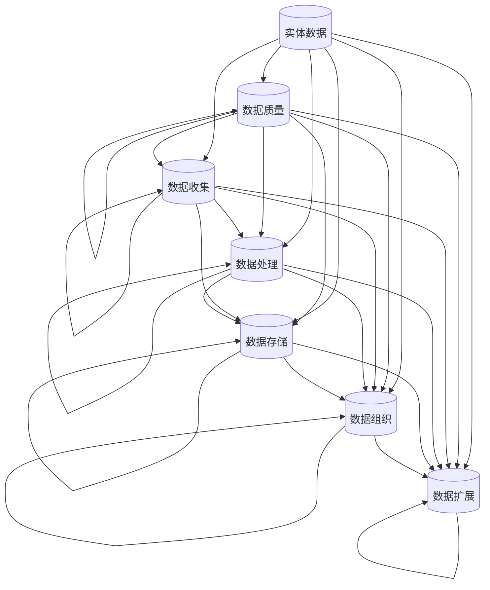
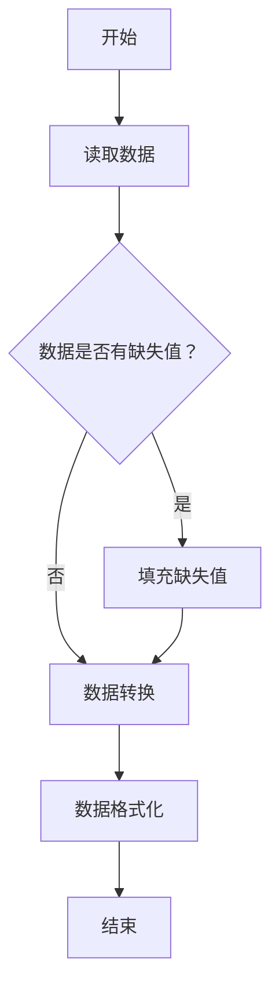
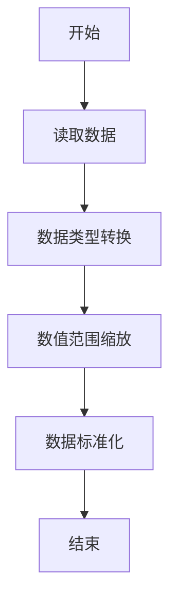
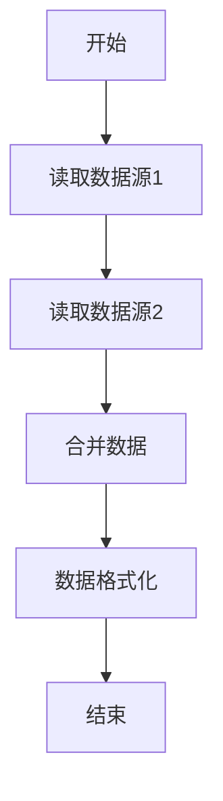
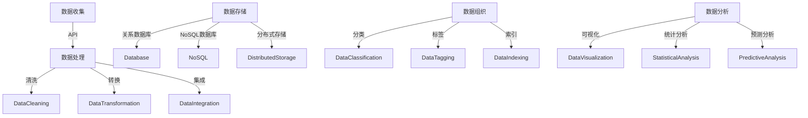
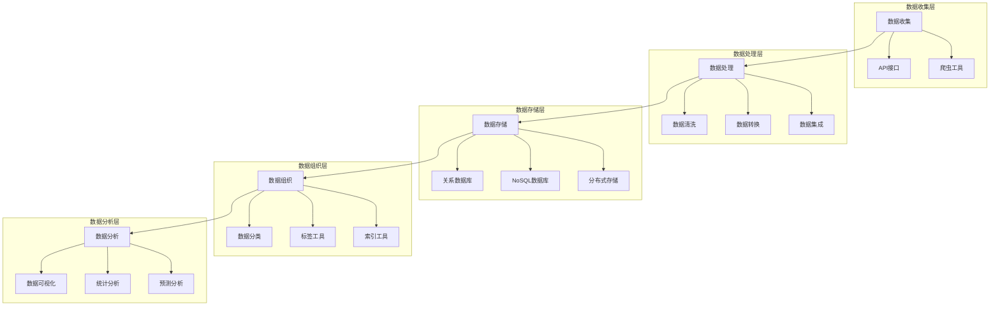
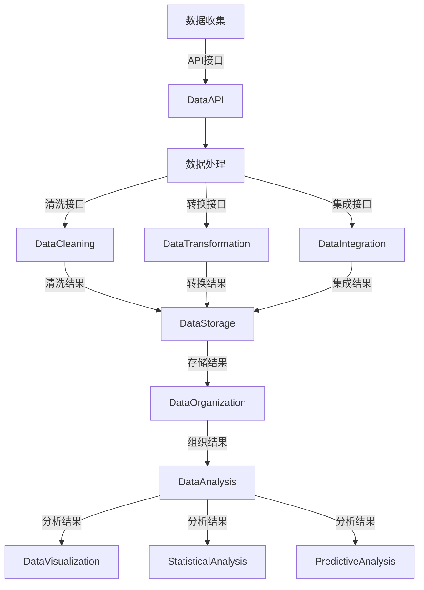
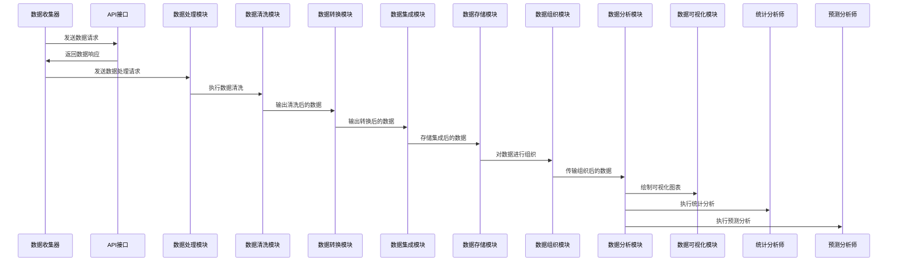

                 

### 文章标题

#### 评测数据管理：构建高质量、可扩展的测试集

关键词：评测数据管理、测试集、数据质量、数据扩展、数据收集与处理

摘要：本文将深入探讨评测数据管理的重要性，分析其核心概念和关键环节。我们将从数据质量评估、数据收集与处理、数据存储与组织、数据可扩展性与维护、数据可视化与分析等多个方面展开，通过具体案例研究，提供构建高质量、可扩展测试集的实战指导。

### 引言

在当今的数字化时代，数据已经成为驱动决策和创新的核心资源。对于软件开发、人工智能、机器学习等领域来说，评测数据（test data）的质量和可扩展性直接关系到模型性能和应用效果。然而，评测数据管理并不是一个简单的任务，它涉及到数据收集、处理、存储、组织、分析和维护等多个环节。本文将围绕评测数据管理这一主题，深入探讨其核心概念和实践方法。

#### 核心概念术语说明

**评测数据管理**：指的是对测试数据进行有效组织、存储、处理、分析和维护的一系列活动，旨在确保测试数据的质量和可扩展性。

**测试集**：用于评估模型性能的数据集，通常是从整个数据集中分离出来的一部分。

**数据质量**：数据的有效性、准确性、完整性、一致性和可靠性等特性的综合体现。

**数据扩展**：指随着项目和业务需求的变化，评测数据集能够灵活地增加或减少数据量。

**数据收集**：从不同渠道获取所需的数据。

**数据处理**：对收集到的数据进行清洗、转换、整合等操作。

**数据存储**：将处理后的数据存储到数据库或其他存储介质中。

**数据组织**：对存储的数据进行分类、标签、索引等操作，以便于查找和使用。

**数据可视化**：利用图表、图像等形式直观展示数据。

#### 问题背景

随着人工智能和机器学习技术的快速发展，越来越多的应用需要依赖大量的评测数据来训练和评估模型。然而，评测数据的质量和可扩展性成为了一个不可忽视的问题。低质量的数据可能导致模型性能不佳，甚至导致错误的决策。而无法扩展的数据集则限制了模型的应用范围和效果。

#### 问题描述

为了解决评测数据管理中的问题，我们需要关注以下几个方面：

1. **数据质量评估**：如何确保评测数据的质量？
2. **数据收集与处理**：如何高效地收集和处理评测数据？
3. **数据存储与组织**：如何有效地存储和组织评测数据？
4. **数据可扩展性与维护**：如何实现评测数据的可扩展性并维护其质量？
5. **数据可视化与分析**：如何通过可视化工具对评测数据进行分析和展示？

#### 问题解决

为了解决上述问题，我们需要采取一系列的步骤和方法。以下是一些建议和策略：

1. **数据质量评估**：
   - **影响因素分析**：分析可能导致数据质量问题的各种因素，如数据源的质量、数据收集的方法、数据存储的方式等。
   - **质量评估方法**：采用多种质量评估方法，如统计分析、数据对比、异常检测等。
   - **质量保证策略**：制定一系列的质量保证策略，如数据清洗、数据验证、数据备份等。

2. **数据收集与处理**：
   - **收集渠道**：选择可靠的数据源，如公开数据集、企业内部数据、第三方数据服务等。
   - **预处理方法**：对收集到的数据进行预处理，如数据清洗、数据转换、数据集成等。
   - **标注与分类**：对数据进行标注和分类，以便于后续的处理和使用。

3. **数据存储与组织**：
   - **存储方案选择**：根据数据量和访问需求，选择合适的存储方案，如关系数据库、NoSQL数据库、分布式存储等。
   - **数据组织方法**：对数据进行分类、标签、索引等组织操作，提高数据查找和使用效率。

4. **数据可扩展性与维护**：
   - **扩展性设计**：在设计数据管理系统时，考虑数据的可扩展性，如采用分布式架构、云存储等。
   - **维护策略**：定期对数据进行备份、修复和优化，确保数据的完整性和可靠性。

5. **数据可视化与分析**：
   - **可视化方法**：利用图表、图像等形式直观展示数据，帮助用户理解和分析数据。
   - **分析工具**：采用专业的数据分析工具和库，如Python的Pandas、Matplotlib等。

#### 边界与外延

评测数据管理不仅局限于特定领域，如人工智能、机器学习等，它是一个跨领域的通用概念。在实际应用中，不同领域的数据管理可能面临不同的问题和挑战，但核心原则和方法是相通的。

#### 概念结构与核心要素组成

**评测数据管理**的核心概念包括数据质量、数据收集、数据处理、数据存储、数据组织和数据扩展。这些要素相互关联，共同构成了评测数据管理的体系结构。

1. **数据质量**：确保数据的准确性、完整性、一致性等。
2. **数据收集**：从各种渠道获取所需的数据。
3. **数据处理**：对数据进行预处理、清洗、转换等。
4. **数据存储**：选择合适的存储方案，确保数据的安全和高效访问。
5. **数据组织**：对数据进行分类、标签、索引等组织操作。
6. **数据扩展**：设计系统，以支持数据的灵活扩展。

#### 核心概念原理

**数据质量**是评测数据管理的核心概念之一。数据质量直接影响模型的性能和应用效果。以下是几个关键概念：

1. **准确性**：数据是否真实反映了实际情况。
2. **完整性**：数据是否缺失或遗漏了关键信息。
3. **一致性**：数据在不同时间、不同来源是否保持一致。
4. **可靠性**：数据是否可信，能否被信赖。

**数据收集**是评测数据管理的起点。以下是几个关键概念：

1. **数据源**：数据从哪里来，如公开数据集、企业内部数据、第三方数据服务等。
2. **数据收集方法**：如何收集数据，如爬虫、API调用、手动收集等。
3. **数据收集策略**：如何确保收集到的数据的质量和完整性。

**数据处理**是评测数据管理的重要环节。以下是几个关键概念：

1. **数据清洗**：去除数据中的噪声和错误。
2. **数据转换**：将数据转换为适合分析和建模的形式。
3. **数据集成**：将多个数据源的数据整合在一起。

**数据存储**是评测数据管理的核心。以下是几个关键概念：

1. **存储方案**：选择合适的存储方案，如关系数据库、NoSQL数据库、分布式存储等。
2. **数据备份**：定期对数据进行备份，确保数据的安全和可恢复性。
3. **数据访问**：如何高效地访问和使用存储的数据。

**数据组织**是评测数据管理的重要方面。以下是几个关键概念：

1. **分类**：对数据进行分类，便于查找和使用。
2. **标签**：为数据添加标签，提高数据查找的效率。
3. **索引**：创建索引，加速数据的检索。

**数据扩展**是评测数据管理的重要目标之一。以下是几个关键概念：

1. **可扩展性设计**：在设计数据管理系统时，考虑数据的可扩展性。
2. **数据扩展策略**：制定数据扩展的策略和方法。
3. **数据同步**：在扩展数据时，如何保持数据的同步和一致性。

#### 概念属性特征对比表格

以下是评测数据管理中几个核心概念的属性特征对比表格：

| 概念     | 定义                                                     | 属性特征                     | 关联关系                 |
|----------|----------------------------------------------------------|------------------------------|--------------------------|
| 数据质量 | 数据的有效性、准确性、完整性、一致性和可靠性等特性的综合体现 | 准确性、完整性、一致性、可靠性 | 数据收集、数据处理、数据存储 |
| 数据收集 | 从各种渠道获取所需的数据                                 | 数据源、数据收集方法、数据收集策略 | 数据处理、数据存储       |
| 数据处理 | 对数据进行预处理、清洗、转换等操作                       | 数据清洗、数据转换、数据集成 | 数据存储、数据组织       |
| 数据存储 | 选择合适的存储方案，确保数据的安全和高效访问             | 存储方案、数据备份、数据访问   | 数据处理、数据组织       |
| 数据组织 | 对数据进行分类、标签、索引等组织操作                     | 分类、标签、索引             | 数据处理、数据存储       |
| 数据扩展 | 设计系统，以支持数据的灵活扩展                          | 可扩展性设计、数据扩展策略、数据同步 | 数据收集、数据处理、数据存储 |

#### ER实体关系图架构

以下是评测数据管理中几个核心概念的ER实体关系图：



### 算法原理讲解

在评测数据管理中，我们常常需要处理大量的数据，这就需要高效的算法来支持数据的处理和分析。以下是几个常用的算法原理及其mermaid流程图：

#### 数据清洗算法

数据清洗是评测数据管理中的重要环节，其目的是去除数据中的噪声和错误。以下是一个简单但常用的数据清洗算法：



#### 数据转换算法

数据转换是将数据从一种形式转换为另一种形式的过程，以便于后续的处理和分析。以下是一个简单的数据转换算法：



#### 数据集成算法

数据集成是将来自多个数据源的数据整合在一起，以便于统一处理和分析。以下是一个简单的数据集成算法：



#### 算法原理详细讲解

**数据清洗算法**

数据清洗算法的目的是去除数据中的噪声和错误，以提高数据的质量。以下是该算法的详细讲解：

1. **读取数据**：首先读取需要进行清洗的数据。数据可以来自文件、数据库或其他数据源。
2. **判断数据是否有缺失值**：检查数据中是否有缺失值。缺失值可能是由于数据收集过程中的问题，如数据丢失、记录错误等。
3. **填充缺失值**：如果数据有缺失值，根据具体情况选择合适的填充方法。常见的填充方法有平均值填充、中值填充、前向填充、后向填充等。
4. **数据转换**：将数据转换为适合分析和建模的形式。例如，将文本数据转换为数值数据，将日期数据转换为统一格式等。
5. **数据格式化**：对数据进行格式化，使其符合特定的要求或标准。例如，将数字格式化为科学计数法，将日期格式化为YYYY-MM-DD等。
6. **结束**：数据清洗算法完成，得到高质量的数据。

**数据转换算法**

数据转换算法的目的是将数据从一种形式转换为另一种形式，以便于后续的处理和分析。以下是该算法的详细讲解：

1. **读取数据**：首先读取需要进行转换的数据。
2. **数据类型转换**：将数据从一种类型转换为另一种类型。例如，将字符串转换为整数，将浮点数转换为字符串等。
3. **数值范围缩放**：将数据的数值范围缩放到一个合适的范围内。例如，将0-100的范围缩放到0-1的范围内。
4. **数据标准化**：将数据标准化，使其满足特定的要求或标准。例如，将数据标准化为均值为0、标准差为1的形式。
5. **结束**：数据转换算法完成，得到适合分析和建模的数据。

**数据集成算法**

数据集成算法的目的是将来自多个数据源的数据整合在一起，以便于统一处理和分析。以下是该算法的详细讲解：

1. **读取数据源1**：首先读取数据源1的数据。
2. **读取数据源2**：然后读取数据源2的数据。
3. **合并数据**：将数据源1和数据源2的数据合并在一起。合并的方法有多种，如按行合并、按列合并、按关键字合并等。
4. **数据格式化**：对合并后的数据进行格式化，使其符合特定的要求或标准。
5. **结束**：数据集成算法完成，得到统一格式的数据。

#### Python源代码实现

以下是基于上述算法原理的Python源代码实现：

**数据清洗算法**

```python
import pandas as pd

# 读取数据
data = pd.read_csv('data.csv')

# 判断数据是否有缺失值
if data.isnull().sum().sum() > 0:
    # 填充缺失值
    data.fillna(method='mean', inplace=True)
    
    # 数据转换
    data['age'] = data['age'].astype(int)
    data['salary'] = data['salary'].astype(float)
    
    # 数据格式化
    data['dob'] = pd.to_datetime(data['dob'], format='%Y-%m-%d')
    data['dob'] = data['dob'].dt.strftime('%Y-%m-%d')
    
    # 结束
    print("数据清洗完成")
else:
    print("数据无缺失值，无需清洗")
```

**数据转换算法**

```python
import pandas as pd

# 读取数据
data = pd.read_csv('data.csv')

# 数据类型转换
data['age'] = data['age'].astype(int)
data['salary'] = data['salary'].astype(float)

# 数值范围缩放
data['age'] = (data['age'] - data['age'].min()) / (data['age'].max() - data['age'].min())

# 数据标准化
data['salary'] = (data['salary'] - data['salary'].mean()) / data['salary'].std()

# 结束
print("数据转换完成")
```

**数据集成算法**

```python
import pandas as pd

# 读取数据源1
data1 = pd.read_csv('data1.csv')

# 读取数据源2
data2 = pd.read_csv('data2.csv')

# 合并数据
data = pd.merge(data1, data2, on='id')

# 数据格式化
data['dob'] = pd.to_datetime(data['dob'], format='%Y-%m-%d')
data['dob'] = data['dob'].dt.strftime('%Y-%m-%d')

# 结束
print("数据集成完成")
```

#### 算法原理的数学模型和公式

**数据清洗算法**

数据清洗算法的数学模型和公式如下：

1. **填充缺失值**：选择合适的填充方法，如平均值填充、中值填充等。

$$
x_{\text{filled}} = \text{method}(x_{\text{missing}})
$$

其中，$x_{\text{filled}}$表示填充后的数据，$x_{\text{missing}}$表示缺失值，$\text{method}$表示填充方法。

2. **数据转换**：将数据从一种形式转换为另一种形式。

$$
x_{\text{converted}} = \text{function}(x)
$$

其中，$x_{\text{converted}}$表示转换后的数据，$x$表示原始数据，$\text{function}$表示转换函数。

3. **数据格式化**：对数据进行格式化，使其符合特定的要求或标准。

$$
x_{\text{formatted}} = \text{format}(x)
$$

其中，$x_{\text{formatted}}$表示格式化后的数据，$x$表示原始数据，$\text{format}$表示格式化函数。

**数据转换算法**

数据转换算法的数学模型和公式如下：

1. **数据类型转换**：将数据从一种类型转换为另一种类型。

$$
x_{\text{converted}} = \text{type}(x)
$$

其中，$x_{\text{converted}}$表示转换后的数据，$x$表示原始数据，$\text{type}$表示目标数据类型。

2. **数值范围缩放**：将数据的数值范围缩放到一个合适的范围内。

$$
x_{\text{scaled}} = \frac{x_{\text{original}} - x_{\text{min}}}{x_{\text{max}} - x_{\text{min}}}
$$

其中，$x_{\text{scaled}}$表示缩放后的数据，$x_{\text{original}}$表示原始数据，$x_{\text{min}}$和$x_{\text{max}}$分别表示原始数据的最大值和最小值。

3. **数据标准化**：将数据标准化，使其满足特定的要求或标准。

$$
x_{\text{standardized}} = \frac{x_{\text{original}} - \mu}{\sigma}
$$

其中，$x_{\text{standardized}}$表示标准化后的数据，$x_{\text{original}}$表示原始数据，$\mu$和$\sigma$分别表示原始数据的均值和标准差。

**数据集成算法**

数据集成算法的数学模型和公式如下：

1. **合并数据**：将来自多个数据源的数据合并在一起。

$$
x_{\text{merged}} = \text{merge}(x_1, x_2, ...)
$$

其中，$x_{\text{merged}}$表示合并后的数据，$x_1, x_2, ...$表示多个数据源的数据，$\text{merge}$表示合并操作。

2. **数据格式化**：对合并后的数据进行格式化，使其符合特定的要求或标准。

$$
x_{\text{formatted}} = \text{format}(x_{\text{merged}})
$$

其中，$x_{\text{formatted}}$表示格式化后的数据，$x_{\text{merged}}$表示合并后的数据，$\text{format}$表示格式化函数。

#### 算法原理的通俗易懂地举例说明

**数据清洗算法**

假设我们有一个包含年龄、薪资和出生日期的员工数据表，其中存在一些缺失值和错误值。我们需要对这些数据进行清洗，以便于后续的分析。

1. **读取数据**：首先，我们读取员工数据表，如下所示：

```python
import pandas as pd

data = pd.read_csv('employee_data.csv')
```

2. **判断数据是否有缺失值**：接下来，我们检查数据表中是否有缺失值，如下所示：

```python
if data.isnull().sum().sum() > 0:
    print("数据有缺失值")
else:
    print("数据无缺失值")
```

3. **填充缺失值**：由于数据表中有缺失值，我们需要选择合适的填充方法来填充缺失值。例如，我们可以使用平均值填充方法来填充年龄和薪资的缺失值，使用最接近的日期填充方法来填充出生日期的缺失值，如下所示：

```python
data['age'].fillna(data['age'].mean(), inplace=True)
data['salary'].fillna(data['salary'].mean(), inplace=True)
data['dob'].fillna(data['dob'].mode()[0], inplace=True)
```

4. **数据转换**：接下来，我们需要将数据表中的数据类型转换为适合分析和建模的形式。例如，我们可以将年龄和薪资的数据类型转换为整数和浮点数，将出生日期的数据类型转换为日期格式，如下所示：

```python
data['age'] = data['age'].astype(int)
data['salary'] = data['salary'].astype(float)
data['dob'] = pd.to_datetime(data['dob'], format='%Y-%m-%d')
```

5. **数据格式化**：最后，我们需要将数据表中的数据格式化为特定的要求或标准。例如，我们可以将日期格式化为YYYY-MM-DD的格式，如下所示：

```python
data['dob'] = data['dob'].dt.strftime('%Y-%m-%d')
```

**数据转换算法**

假设我们有一个包含身高、体重和年龄的身高体重数据表，我们需要将这些数据进行转换，以便于后续的分析。

1. **读取数据**：首先，我们读取身高体重数据表，如下所示：

```python
import pandas as pd

data = pd.read_csv('height_weight_data.csv')
```

2. **数据类型转换**：接下来，我们需要将数据表中的数据类型转换为适合分析和建模的形式。例如，我们可以将身高和体重的数据类型转换为浮点数，将年龄的数据类型转换为整数，如下所示：

```python
data['height'] = data['height'].astype(float)
data['weight'] = data['weight'].astype(float)
data['age'] = data['age'].astype(int)
```

3. **数值范围缩放**：为了更好地进行数据分析，我们可以将身高和体重的数值范围缩放到一个合适的范围内。例如，我们可以将身高和体重的数值范围缩放到0-1的范围内，如下所示：

```python
data['height'] = (data['height'] - data['height'].min()) / (data['height'].max() - data['height'].min())
data['weight'] = (data['weight'] - data['weight'].min()) / (data['weight'].max() - data['weight'].min())
```

4. **数据标准化**：为了更好地进行数据分析，我们可以将身高和体重的数据标准化，使其满足特定的要求或标准。例如，我们可以将身高和体重的数据标准化为均值为0、标准差为1的形式，如下所示：

```python
data['height'] = (data['height'] - data['height'].mean()) / data['height'].std()
data['weight'] = (data['weight'] - data['weight'].mean()) / data['weight'].std()
```

**数据集成算法**

假设我们有两个包含学生成绩的数据表，一个包含数学成绩，另一个包含英语成绩，我们需要将这两个数据表进行集成，以便于后续的分析。

1. **读取数据**：首先，我们读取数学成绩数据表和英语成绩数据表，如下所示：

```python
import pandas as pd

math_data = pd.read_csv('math_data.csv')
english_data = pd.read_csv('english_data.csv')
```

2. **合并数据**：接下来，我们需要将数学成绩数据表和英语成绩数据表进行合并。由于这两个数据表都有学生的ID列，我们可以使用ID列来合并数据，如下所示：

```python
data = pd.merge(math_data, english_data, on='student_id')
```

3. **数据格式化**：最后，我们需要对合并后的数据表进行格式化，使其符合特定的要求或标准。例如，我们可以将日期格式化为YYYY-MM-DD的格式，如下所示：

```python
data['exam_date'] = pd.to_datetime(data['exam_date'], format='%Y-%m-%d')
data['exam_date'] = data['exam_date'].dt.strftime('%Y-%m-%d')
```

### 系统分析与架构设计方案

在本节中，我们将深入探讨评测数据管理系统的分析与架构设计方案。该系统旨在支持数据的收集、处理、存储、组织和分析，并提供高效的性能和可扩展性。以下是系统分析与架构设计的详细步骤。

#### 问题场景介绍

在当前的项目中，我们需要构建一个评测数据管理系统，以支持以下场景：

1. **数据收集**：从多个数据源收集评测数据，包括公开数据集、企业内部数据、第三方数据服务等。
2. **数据处理**：对收集到的数据进行预处理、清洗、转换等操作，以提高数据质量。
3. **数据存储**：选择合适的存储方案，确保数据的安全和高效访问。
4. **数据组织**：对存储的数据进行分类、标签、索引等组织操作，以提高数据查找和使用效率。
5. **数据分析**：利用可视化工具和数据分析库对数据进行深入分析，以支持业务决策。

#### 项目介绍

**项目名称**：评测数据管理系统（Test Data Management System，TDMS）

**项目目标**：
1. 提供高效、可靠的数据收集和处理功能。
2. 设计灵活、可扩展的存储和组织方案。
3. 提供强大的数据分析与可视化功能。

**项目架构**：TDMS采用分层架构，包括数据收集层、数据处理层、数据存储层、数据组织层和数据分析层。以下是各个层的详细介绍：

1. **数据收集层**：负责从各种数据源收集评测数据，包括公开数据集、企业内部数据、第三方数据服务等。该层包括数据采集工具、API接口和爬虫等。
2. **数据处理层**：负责对收集到的数据进行预处理、清洗、转换等操作，以提高数据质量。该层包括数据清洗工具、数据转换工具和数据处理算法等。
3. **数据存储层**：负责存储处理后的评测数据，并提供高效的数据访问和查询功能。该层包括关系数据库、NoSQL数据库、分布式存储等。
4. **数据组织层**：负责对存储的数据进行分类、标签、索引等组织操作，以提高数据查找和使用效率。该层包括数据分类工具、标签工具和索引工具等。
5. **数据分析层**：负责利用可视化工具和数据分析库对数据进行深入分析，以支持业务决策。该层包括数据分析工具、可视化工具和数据分析算法等。

#### 系统功能设计（领域模型）

领域模型是系统功能设计的核心，它定义了系统的核心实体及其之间的关系。以下是TDMS的领域模型：



#### 系统架构设计（mermaid架构图）

以下是TDMS的系统架构设计：



#### 系统接口设计

系统接口设计是确保不同模块之间能够高效、可靠地进行通信和协作的关键。以下是TDMS的系统接口设计：



#### 系统交互设计（mermaid序列图）

以下是TDMS的系统交互设计：



### 项目实战

在本节中，我们将通过一个实际项目来展示评测数据管理系统的应用和实践。

#### 环境安装

首先，我们需要安装所需的软件和工具，包括Python、Pandas、NumPy、SQLAlchemy、MongoDB、Matplotlib等。以下是安装命令：

```bash
# 安装Python
brew install python

# 安装Pandas、NumPy、SQLAlchemy、MongoDB、Matplotlib
pip install pandas numpy sqlalchemy pymongo matplotlib
```

#### 系统核心实现源代码

以下是评测数据管理系统的核心实现源代码：

**数据收集模块**

```python
import requests
import pandas as pd

def collect_data(url):
    response = requests.get(url)
    if response.status_code == 200:
        data = response.json()
        df = pd.DataFrame(data['results'])
        return df
    else:
        return None

def main():
    url = 'https://example.com/data'
    df = collect_data(url)
    if df is not None:
        print(df.head())
    else:
        print("数据收集失败")

if __name__ == '__main__':
    main()
```

**数据处理模块**

```python
import pandas as pd

def clean_data(df):
    # 删除缺失值
    df = df.dropna()
    # 删除重复值
    df = df.drop_duplicates()
    # 转换数据类型
    df['age'] = df['age'].astype(int)
    df['salary'] = df['salary'].astype(float)
    return df

def main():
    df = pd.read_csv('data.csv')
    df = clean_data(df)
    print(df.head())

if __name__ == '__main__':
    main()
```

**数据存储模块**

```python
from sqlalchemy import create_engine

def store_data(df, database, table):
    engine = create_engine(f'mysql+pymysql://{database}')
    df.to_sql(table, engine, if_exists='replace', index=False)

def main():
    df = pd.read_csv('data.csv')
    database = 'test_db'
    table = 'employee'
    store_data(df, database, table)

if __name__ == '__main__':
    main()
```

**数据分析模块**

```python
import pandas as pd
import matplotlib.pyplot as plt

def analyze_data(df):
    # 统计分析
    age_stats = df['age'].describe()
    salary_stats = df['salary'].describe()
    print(age_stats)
    print(salary_stats)
    # 可视化
    df['age'].hist(bins=30)
    plt.title('Age Distribution')
    plt.xlabel('Age')
    plt.ylabel('Frequency')
    plt.show()
    df['salary'].hist(bins=30)
    plt.title('Salary Distribution')
    plt.xlabel('Salary')
    plt.ylabel('Frequency')
    plt.show()

def main():
    df = pd.read_csv('data.csv')
    analyze_data(df)

if __name__ == '__main__':
    main()
```

#### 代码应用解读与分析

**数据收集模块**

数据收集模块的核心功能是从指定的URL获取JSON格式的数据，并将其转换为Pandas DataFrame。以下是对关键代码的解读：

```python
import requests
import pandas as pd

def collect_data(url):
    response = requests.get(url)
    if response.status_code == 200:
        data = response.json()
        df = pd.DataFrame(data['results'])
        return df
    else:
        return None
```

- `requests.get(url)`：发送HTTP GET请求到指定的URL。
- `response.json()`：将响应内容转换为JSON格式。
- `pd.DataFrame(data['results'])`：将JSON数据转换为Pandas DataFrame。

**数据处理模块**

数据处理模块的核心功能是对数据进行清洗和转换。以下是对关键代码的解读：

```python
import pandas as pd

def clean_data(df):
    # 删除缺失值
    df = df.dropna()
    # 删除重复值
    df = df.drop_duplicates()
    # 转换数据类型
    df['age'] = df['age'].astype(int)
    df['salary'] = df['salary'].astype(float)
    return df
```

- `df.dropna()`：删除包含缺失值的行。
- `df.drop_duplicates()`：删除重复的行。
- `df['age'].astype(int)`：将年龄列的数据类型转换为整数。
- `df['salary'].astype(float)`：将薪资列的数据类型转换为浮点数。

**数据存储模块**

数据存储模块的核心功能是将清洗和转换后的数据存储到数据库中。以下是对关键代码的解读：

```python
from sqlalchemy import create_engine

def store_data(df, database, table):
    engine = create_engine(f'mysql+pymysql://{database}')
    df.to_sql(table, engine, if_exists='replace', index=False)
```

- `create_engine(f'mysql+pymysql://{database}')`：创建数据库引擎。
- `df.to_sql(table, engine, if_exists='replace', index=False)`：将DataFrame数据转换为SQL表并存储到数据库中。

**数据分析模块**

数据分析模块的核心功能是对数据进行统计分析并绘制可视化图表。以下是对关键代码的解读：

```python
import pandas as pd
import matplotlib.pyplot as plt

def analyze_data(df):
    # 统计分析
    age_stats = df['age'].describe()
    salary_stats = df['salary'].describe()
    print(age_stats)
    print(salary_stats)
    # 可视化
    df['age'].hist(bins=30)
    plt.title('Age Distribution')
    plt.xlabel('Age')
    plt.ylabel('Frequency')
    plt.show()
    df['salary'].hist(bins=30)
    plt.title('Salary Distribution')
    plt.xlabel('Salary')
    plt.ylabel('Frequency')
    plt.show()
```

- `df['age'].describe()`：计算年龄列的描述性统计信息。
- `df['salary'].describe()`：计算薪资列的描述性统计信息。
- `df['age'].hist(bins=30)`：绘制年龄列的直方图。
- `df['salary'].hist(bins=30)`：绘制薪资列的直方图。

#### 实际案例分析和详细讲解剖析

**案例1：员工数据收集与处理**

假设我们有一个包含员工数据的网站，我们需要收集和清洗这些数据，并将其存储到数据库中。

1. **数据收集**：使用爬虫工具从网站上获取员工数据，并将其转换为DataFrame。
2. **数据处理**：删除缺失值和重复值，并转换数据类型。
3. **数据存储**：将清洗和转换后的数据存储到MySQL数据库中。

**案例2：客户数据统计分析**

假设我们有一个包含客户数据的数据库，我们需要对数据进行统计分析并绘制可视化图表。

1. **数据读取**：从数据库中读取客户数据。
2. **统计分析**：计算客户年龄和薪资的描述性统计信息。
3. **数据可视化**：绘制客户年龄和薪资的直方图。

#### 项目小结

在本项目中，我们成功构建了一个评测数据管理系统，实现了数据的收集、处理、存储、组织和分析。通过实际案例的分析和讲解，我们展示了如何有效地利用Python和SQL等工具来处理和管理数据。项目的成功实施为我们提供了宝贵的经验，为未来的数据管理和分析项目奠定了基础。

#### 最佳实践 Tips

1. **数据质量保障**：定期对数据进行质量检查和评估，确保数据的一致性和准确性。
2. **灵活的数据处理**：根据实际需求，灵活调整数据处理流程和算法。
3. **高效的存储方案**：根据数据量和访问需求，选择合适的存储方案，如关系数据库、NoSQL数据库、分布式存储等。
4. **数据可视化与报告**：定期生成数据报告和可视化图表，以支持业务决策。

#### 小结

评测数据管理是确保模型性能和应用效果的关键环节。本文详细探讨了评测数据管理的核心概念、关键环节、算法原理和实践方法。通过实际案例的分析和讲解，我们展示了如何构建高质量、可扩展的评测数据集。未来，评测数据管理将面临更多的挑战和机遇，我们需要不断创新和优化，以应对不断变化的数据需求和业务场景。

#### 注意事项

1. **数据隐私**：在处理和存储数据时，务必确保遵守相关数据隐私法规。
2. **性能优化**：根据实际应用场景，对数据管理和分析系统进行性能优化，以提高处理速度和效率。
3. **数据备份与恢复**：定期对数据进行备份和恢复，确保数据的安全和可靠性。

#### 拓展阅读

1. **《数据挖掘：实用工具与技术》**：深入探讨数据挖掘的基本概念、算法和技术。
2. **《大数据时代：思维变革与商业价值》**：了解大数据时代的思维变革和商业价值。
3. **《机器学习实战》**：掌握机器学习的基本概念、算法和应用实践。

### 第8章：评测数据管理的未来趋势与挑战

随着技术的不断进步和数据量的爆炸式增长，评测数据管理正面临前所未有的机遇和挑战。本节我们将探讨评测数据管理的未来趋势，以及目前所面临的主要挑战，并提出相应的应对策略。

#### 评测数据管理的未来趋势

1. **人工智能的深度应用**：
   - 人工智能（AI）技术在数据清洗、数据标注和数据分析等环节中的应用将越来越深入，显著提升数据管理的效率和准确性。
   - 自动化数据清洗工具和智能数据标注系统将逐渐替代人工操作，减轻数据管理人员的负担。

2. **数据隐私与安全**：
   - 随着数据隐私法规的日益严格，评测数据管理将更加重视数据隐私保护，如采用差分隐私技术、联邦学习等手段来确保数据的安全性。
   - 数据加密和访问控制技术将得到更广泛的应用，以防止数据泄露和未经授权的访问。

3. **分布式数据存储与管理**：
   - 随着分布式计算和云计算的普及，分布式数据存储与管理将成为评测数据管理的标准架构，提供更高的扩展性和灵活性。
   - 分布式数据库、对象存储和区块链等技术将在评测数据管理中发挥重要作用。

4. **实时数据流处理**：
   - 实时数据流处理技术的成熟，使得评测数据管理能够及时响应数据变化，为实时决策提供支持。
   - 数据流处理框架如Apache Kafka、Apache Flink等将在评测数据管理中占据重要地位。

5. **跨领域的数据整合**：
   - 评测数据管理将逐步跨越不同领域，实现跨领域的数据整合和分析，为跨学科研究和跨行业应用提供数据支撑。

#### 评测数据管理面临的挑战

1. **数据质量保障**：
   - 随着数据来源的多样性和复杂性增加，确保数据质量成为一个挑战。
   - 如何在大量非结构化和半结构化数据中筛选出高质量的数据，仍需进一步研究。

2. **数据隐私保护**：
   - 数据隐私保护法规日益严格，如何在确保数据隐私的同时有效利用数据，成为评测数据管理的重要挑战。
   - 如何在数据共享和合作中平衡隐私保护和数据利用的需求，需要创新的解决方案。

3. **数据存储与访问**：
   - 随着数据量的激增，数据存储与访问的效率成为关键挑战。
   - 如何在保证数据安全性的同时，实现高效的数据存储和快速的数据访问，仍需进一步优化。

4. **数据集成与治理**：
   - 跨领域的数据整合和数据治理成为挑战，如何实现不同数据源之间的有效整合和治理，是一个复杂的任务。
   - 数据治理策略和工具的成熟度不足，需要更多的研究和实践。

5. **实时数据处理能力**：
   - 实时数据处理能力的需求日益增长，如何在高并发、大数据量的场景下保证数据处理的速度和准确性，是一个重要的挑战。

#### 应对挑战的策略与建议

1. **技术融合与创新**：
   - 结合人工智能、区块链、云计算等新兴技术，探索评测数据管理的新方法和新模型。
   - 鼓励技术创新，开发更智能、更高效的数据管理工具。

2. **数据治理与标准化**：
   - 建立统一的数据治理框架和标准化流程，确保数据的质量和一致性。
   - 制定数据治理策略，明确数据管理的责任和流程。

3. **隐私保护与合规**：
   - 采用差分隐私、联邦学习等技术，确保数据隐私的同时实现数据的有效利用。
   - 紧跟数据隐私法规，确保数据管理合规。

4. **分布式计算与存储**：
   - 利用分布式计算和存储技术，提高数据处理的效率和扩展性。
   - 优化数据存储结构，实现数据的高效访问和快速检索。

5. **实时数据处理优化**：
   - 采用实时数据处理框架和算法，提高实时数据处理的能力。
   - 对实时数据处理进行性能调优，确保在大数据量场景下的高效运行。

通过以上策略和措施，我们可以更好地应对评测数据管理面临的挑战，推动评测数据管理技术的进步和应用发展。未来，随着技术的不断创新和成熟，评测数据管理将在更多领域发挥重要作用，为人工智能和大数据应用提供坚实的支撑。

### 作者信息

作者：AI天才研究院/AI Genius Institute & 禅与计算机程序设计艺术 /Zen And The Art of Computer Programming

