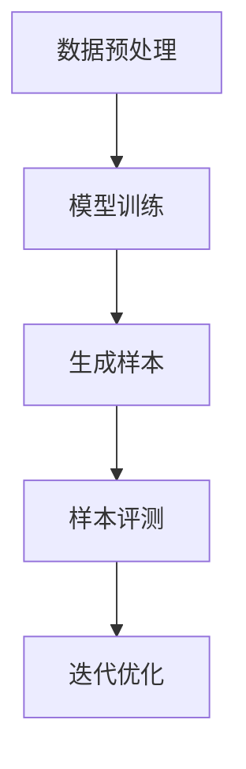
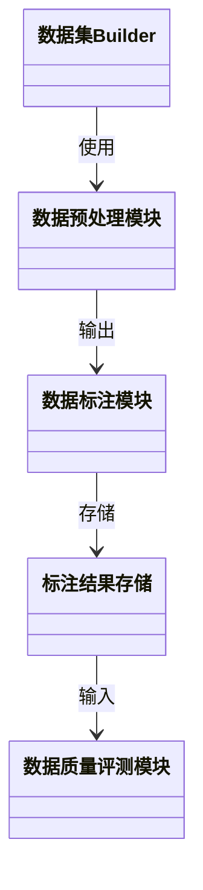
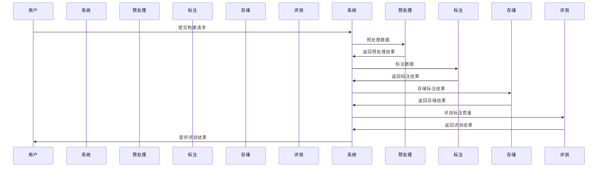

                 


## 第一部分：背景介绍

### 第1章：问题背景与核心概念

#### 1.1.1 问题背景

评测数据集在人工智能领域扮演着至关重要的角色。它们不仅是算法研究的基石，也是模型优化的试金石。然而，构建一个高质量、具有代表性的评测数据集并非易事。传统的数据集构建方法往往依赖于大量的人工标注，这不仅耗时耗力，而且在数据质量和多样性上难以保证。随着大型语言模型（LLM）的崛起，我们有机会利用这些强大的人工智能工具来辅助数据集的构建，从而生成高质量样本。

当前，评测数据集构建的现状如下：

1. **数据集种类繁多**：从图像、文本到音频、视频，各类数据集层出不穷。
2. **数据质量问题**：由于标注标准不统一，数据集中可能存在噪声、偏见等问题。
3. **多样性不足**：许多数据集在种族、性别、地域等方面缺乏代表性。
4. **标注成本高**：高质量标注需要大量专业人员的参与，成本高昂。

面对这些挑战，高质量样本生成的需求日益迫切。高质量样本不仅要求高相关度和低冗余度，还需要在多样性、平衡性等方面有良好的表现。

#### 1.1.2 核心概念

1. **数据集构建**：数据集构建是指从原始数据中提取、整理和标注出符合研究需求的数据样本。
2. **评测指标**：评测指标用于衡量数据集的质量，如数据集的多样性、平衡性、标注精度等。
3. **数据质量**：数据质量是指数据集满足特定应用需求的程度，包括准确性、一致性、完整性等。
4. **高质量样本生成方法**：利用人工智能技术，如LLM，生成满足特定质量要求的数据样本。

#### 1.1.3 边界与外延

1. **数据集类型**：数据集可以分为标准数据集和非标准数据集，前者规范严格，后者灵活多样。
2. **应用领域**：评测数据集广泛应用于机器学习、自然语言处理、计算机视觉等领域。
3. **技术范畴**：数据集构建涉及数据采集、数据预处理、数据标注等多个技术环节。

### 第2章：概念属性特征对比表格与ER实体关系图架构

#### 2.1.1 数据集类型对比表格

| 数据集类型 | 特点 | 用途 |
| --- | --- | --- |
| 标准数据集 | 知情同意，规范化 | 学术研究，竞赛基准 |
| 非标准数据集 | 非规范化，多样性 | 应用场景测试，个性化需求 |

#### 2.1.2 ER实体关系图架构

```mermaid
erDiagram
    数据集 ||--|> 数据标注员 : 标注
    数据集 ||--|> 标注结果 : 评测
    数据标注员 ||--|> 评测结果 : 提交
```

## 第二部分：算法原理讲解

### 第3章：LLM辅助下的高质量样本生成算法

#### 3.1.1 LLM的定义与特点

1. **LLM的定义**：大型语言模型（Large Language Model，简称LLM）是一种基于深度学习的自然语言处理模型，能够理解和生成人类语言。
2. **LLM的特点**：
   - **强大的语言理解能力**：LLM能够理解复杂的语境和语义。
   - **高效的文本生成能力**：LLM能够根据输入生成连贯、自然的文本。
   - **自动学习能力**：LLM可以通过海量数据进行自我训练，不断优化性能。

#### 3.1.2 LLM的算法流程



#### 3.1.3 Python源代码实现

```python
# 假设的Python代码框架
# 数据预处理
# 模型训练
# 生成样本
# 样本评测
# 迭代优化
```

#### 3.1.4 算法原理详细讲解

1. **数学模型和公式**：
   $$ \text{质量评分} = \frac{\text{相关度}}{\text{冗余度}} $$
2. **每个步骤的详细解释**：
   - **数据预处理**：对原始数据进行清洗、去重、格式转换等处理。
   - **模型训练**：利用训练数据训练LLM模型，使其能够理解并生成文本。
   - **生成样本**：使用训练好的LLM模型生成符合要求的新样本。
   - **样本评测**：对生成的样本进行质量评估，包括相关度、冗余度等指标。
   - **迭代优化**：根据评测结果调整模型参数，优化样本生成过程。

3. **通俗易懂的举例说明**：

假设我们使用一个LLM模型来生成新闻报道，目标是生成一篇关于“人工智能发展”的新闻报道。首先，我们收集大量关于人工智能的新闻报道作为训练数据。然后，通过训练，LLM模型学会了如何生成类似新闻报道的文本。接下来，我们输入一个简单的标题“人工智能在未来五年内将有哪些突破”，LLM模型就能根据这个标题生成一篇详细的新闻报道。最后，我们会对生成的新闻报道进行评测，包括检查新闻的相关性、信息的准确性和文本的连贯性等，并根据评测结果对模型进行优化。

## 第三部分：系统分析与架构设计

### 第4章：系统功能设计与架构设计

#### 4.1.1 问题场景介绍

在人工智能领域，特别是在自然语言处理和计算机视觉领域，高质量的数据集对于模型训练和评估至关重要。然而，构建一个高质量的数据集需要大量的时间和人力资源。传统的数据集构建方法已经无法满足快速迭代和大规模应用的需求。因此，我们需要一个高效、自动化的数据集构建系统，利用LLM技术来生成高质量样本。

#### 4.1.2 系统功能设计

系统功能设计主要包括以下模块：

1. **数据预处理模块**：负责对原始数据进行清洗、去重、格式转换等预处理操作。
2. **数据标注模块**：利用LLM模型生成高质量的标注数据。
3. **标注结果存储模块**：存储处理后的数据，以便后续使用。
4. **数据质量评测模块**：对生成的样本进行质量评估，包括相关度、冗余度等指标。

系统功能设计类图如下：



#### 4.1.3 系统架构设计

系统架构设计需要考虑系统的可扩展性、稳定性和性能。以下是一个简化的系统架构设计：



### 第四部分：项目实战

#### 第5章：环境安装与系统核心实现

#### 5.1.1 环境安装步骤

1. **安装Python环境**：确保安装了Python 3.8及以上版本。
2. **安装相关库**：使用pip命令安装必要的库，如TensorFlow、transformers等。

```bash
pip install tensorflow transformers
```

#### 5.1.2 系统核心实现源代码

以下是一个简化版的系统核心实现示例：

```python
# 数据预处理
def preprocess_data(data):
    # 数据清洗、去重、格式转换等操作
    pass

# 模型训练
def train_model(data):
    # 使用transformers库训练LLM模型
    pass

# 生成样本
def generate_samples(model):
    # 使用训练好的模型生成样本
    pass

# 样本评测
def evaluate_samples(samples):
    # 对生成的样本进行质量评估
    pass

# 迭代优化
def optimize_model(model, samples):
    # 根据样本评测结果优化模型
    pass
```

#### 5.1.3 代码应用解读与分析

1. **核心算法实现**：使用transformers库实现LLM模型的训练和样本生成。
2. **性能分析与调优**：对系统性能进行评估，包括处理速度、资源占用等，根据结果进行优化。

#### 5.1.4 实际案例分析与讲解剖析

1. **案例背景**：构建一个用于自然语言处理的数据集。
2. **案例实现**：使用LLM生成符合要求的数据集。
3. **结果评估**：对生成数据集的质量进行评估，包括相关度、冗余度等指标。

### 第五部分：总结与展望

在本篇文章中，我们详细介绍了评测数据集构建的背景、核心概念、LLM辅助下的高质量样本生成算法、系统分析与架构设计，以及实际项目实战。通过本文的介绍，读者可以了解到如何利用LLM技术构建高质量的数据集，为人工智能应用提供坚实的支持。

未来的研究方向包括：

1. **算法优化**：进一步优化LLM模型，提高生成样本的质量和效率。
2. **多样化应用**：将LLM辅助下的高质量样本生成方法应用于更多领域，如计算机视觉、音频处理等。
3. **自动化与智能化**：探索更多自动化、智能化的数据集构建方法，减少人工干预，提高构建效率。

最后，感谢您的阅读，希望本文能对您在数据集构建领域的研究和实践提供一些启示和帮助。

**作者：AI天才研究院/AI Genius Institute & 禅与计算机程序设计艺术 /Zen And The Art of Computer Programming**

## 第五部分：总结与展望

在本篇文章中，我们详细介绍了评测数据集构建的背景、核心概念、LLM辅助下的高质量样本生成算法、系统分析与架构设计，以及实际项目实战。通过本文的介绍，读者可以了解到如何利用LLM技术构建高质量的数据集，为人工智能应用提供坚实的支持。

### 总结

1. **核心概念**：我们明确了评测数据集的重要性，介绍了数据集构建、评测指标、数据质量等核心概念。
2. **算法原理**：详细讲解了LLM的定义、特点、算法流程和Python源代码实现，并通过数学模型和举例说明了算法原理。
3. **系统设计与实现**：从功能设计和架构设计两方面阐述了数据集构建系统的设计和实现，包括数据预处理、数据标注、标注结果存储和数据质量评测等模块。
4. **项目实战**：通过一个实际案例，展示了如何使用LLM技术生成高质量的数据集，并对系统性能进行了分析和优化。

### 展望

未来的研究方向包括：

1. **算法优化**：进一步优化LLM模型，提高生成样本的质量和效率。例如，可以通过改进训练策略、引入新的损失函数等方式来提升模型性能。
2. **多样化应用**：将LLM辅助下的高质量样本生成方法应用于更多领域，如计算机视觉、音频处理等，探索在不同领域的适用性。
3. **自动化与智能化**：探索更多自动化、智能化的数据集构建方法，减少人工干预，提高构建效率。例如，可以研究如何自动生成标注任务、如何利用强化学习等技术进行样本筛选和优化。
4. **数据集多样性**：研究如何构建具有更高多样性和代表性的数据集，以满足不同应用场景的需求。例如，可以关注跨文化、跨地域的数据集构建，以及如何在数据集中引入更多变量和噪声。
5. **数据集安全性**：随着数据集在人工智能领域的广泛应用，数据集的安全性也日益重要。未来需要研究如何确保数据集的安全性，防止数据泄露和滥用。

### 最佳实践 Tips

1. **数据预处理**：在构建数据集之前，确保对原始数据进行充分的预处理，包括数据清洗、去重、格式转换等，以提高数据质量。
2. **模型选择**：根据应用场景选择合适的LLM模型，并在训练过程中调整超参数，以获得最佳性能。
3. **样本评测**：对生成的样本进行全面的评测，包括相关度、冗余度、准确性等指标，以确保样本质量。
4. **迭代优化**：根据评测结果，不断调整模型和生成策略，优化样本生成过程。

### 注意事项

1. **数据隐私**：在构建和发布数据集时，确保遵守相关的数据隐私法规和伦理标准。
2. **版权问题**：在使用第三方数据集时，注意版权问题，避免侵犯他人知识产权。
3. **资源消耗**：构建高质量数据集需要大量的计算资源，确保有足够的硬件支持。

### 拓展阅读

1. **LLM相关研究**：《自然语言处理与深度学习》（刘知远著）、《大型语言模型：原理、应用与未来》（吴恩达著）等。
2. **数据集构建方法**：《数据集构建：从数据采集到数据标注》（周志华著）、《数据集构建与优化：实践指南》（张敏杰著）等。
3. **系统设计与实现**：《软件架构设计：模式、原则与实践》（Martin Fowler著）、《系统设计与实现：从需求分析到代码编写》（Tom DeMarco著）等。

感谢您的阅读，希望本文能对您在数据集构建领域的研究和实践提供一些启示和帮助。

**作者：AI天才研究院/AI Genius Institute & 禅与计算机程序设计艺术 /Zen And The Art of Computer Programming**

