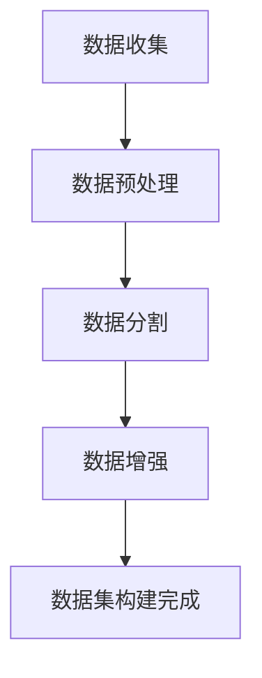
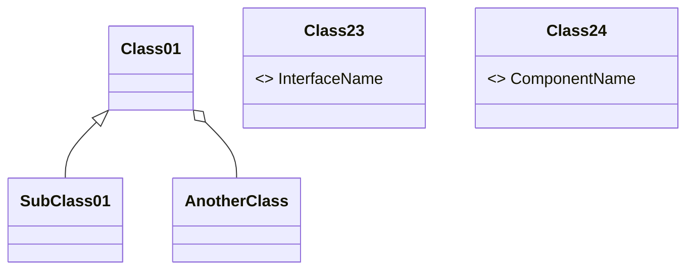
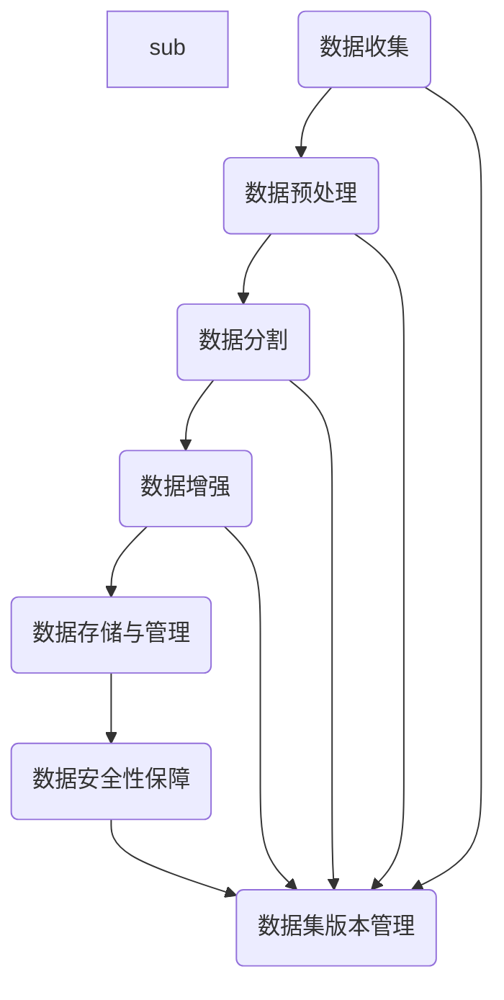
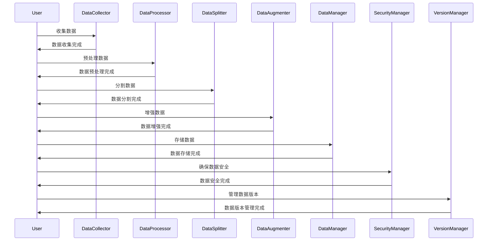

                 

# 评测数据集的构建与管理策略

## 关键词：评测数据集、构建方法、管理策略、数据清洗、数据增强、版本管理

## 摘要：

评测数据集是人工智能模型训练和评估的基础，其质量直接影响模型的性能和应用效果。本文将探讨评测数据集的构建与管理策略，从数据收集、预处理、分割、增强到存储、安全和版本管理，提供一系列专业的构建与管理方法，旨在帮助开发者和研究者在实际应用中构建高质量、可靠的数据集，提升人工智能模型的准确性和泛化能力。

## 第1章 引言

### 1.1 问题背景

评测数据集在人工智能领域扮演着至关重要的角色。无论是机器学习、深度学习，还是自然语言处理、计算机视觉等应用场景，评测数据集都是模型训练、验证和测试的核心组成部分。高质量的评测数据集不仅能够提高模型的准确性，还能增强模型的泛化能力，从而在实际应用中取得更好的效果。

### 1.2 问题描述

评测数据集的构建与管理涉及多个关键环节，包括数据收集、预处理、分割、增强、存储、安全与版本管理。这些环节相互关联，任何一个环节出现问题都可能导致数据集质量下降，进而影响模型的表现。

### 1.3 问题解决

构建与管理评测数据集的方法多种多样，本文将介绍以下几种常见方法：

1. 数据收集：从公开数据集、私有数据集和第三方数据提供商获取数据。
2. 数据预处理：包括数据清洗、格式转换和缺失值处理。
3. 数据分割：将数据集划分为训练集、验证集和测试集。
4. 数据增强：通过数据扩展和多样性增强，提升模型的泛化能力。
5. 数据存储与管理：选择合适的存储方案，确保数据的安全性与可访问性。
6. 数据集安全性保障：采取隐私保护措施，防止数据泄露。
7. 数据集版本管理：实现数据集版本控制，确保模型在不同版本数据集上的表现一致性。

### 1.4 边界与外延

评测数据集的类型与来源多种多样，包括文本数据集、图像数据集、语音数据集等。在实际应用中，应根据具体需求选择合适的数据集类型和来源。

### 1.5 概念结构与核心要素组成

评测数据集构建与管理的核心要素包括数据收集、预处理、分割、增强、存储、安全和版本管理。这些要素相互关联，共同构成了一个完整的数据集构建与管理体系。

## 第2章 核心概念与联系

### 2.1 核心概念原理

构建与管理评测数据集需要理解以下几个核心概念：

1. **数据清洗**：通过去除噪声、错误和冗余信息，提高数据质量。
2. **数据分割**：将数据集划分为训练集、验证集和测试集，以支持模型的训练、验证和测试。
3. **数据增强**：通过数据扩展和多样性增强，提高模型的泛化能力。
4. **数据存储与管理**：选择合适的存储方案，确保数据的安全性与可访问性。
5. **数据集安全性保障**：采取隐私保护措施，防止数据泄露。
6. **数据集版本管理**：实现数据集版本控制，确保模型在不同版本数据集上的表现一致性。

### 2.2 概念属性特征对比表格

| 类型       | 特征                         | 说明                                                         |
| ---------- | ---------------------------- | ------------------------------------------------------------ |
| 清洗数据集 | 准确性、完整性、一致性        | 通过清洗，去除噪声和错误，保证数据质量                         |
| 分割数据集 | 分训练集、验证集和测试集     | 保证模型的训练和评估在不同的数据集上都能得到有效的结果         |
| 数据增强   | 扩大数据规模、增强数据多样性   | 提高模型的泛化能力                                           |

### 2.3 ER实体关系图架构

```mermaid
erDiagram
    数据集 ||--|{ 数据清洗 }|| 清洗数据集
    数据集 ||--|{ 数据分割 }|| 分割数据集
    数据集 ||--|{ 数据增强 }|| 数据增强
```

## 第3章 数据集构建方法

### 3.1 数据收集

数据收集是构建评测数据集的第一步，数据来源的多样性和数据质量对数据集的整体表现至关重要。以下是几种常见的数据收集方法：

1. **公开数据集**：如ImageNet、CIFAR-10、Common Crawl等，这些数据集已经经过清洗和标注，可以直接用于模型训练和评估。
2. **私有数据集**：企业或研究机构自行收集的数据集，可能需要签署保密协议才能获取。
3. **第三方数据提供商**：提供各种领域的数据集，如数据堂、阿里云天池等。

### 3.2 数据预处理

数据预处理是确保数据质量的重要环节，包括以下步骤：

1. **数据清洗**：去除噪声和错误，保证数据准确性、完整性和一致性。
2. **格式转换**：将不同格式的数据转换为统一的格式，以便后续处理。
3. **缺失值处理**：对缺失的数据进行填充或删除，以保证数据完整性。

### 3.3 数据分割

数据分割是将数据集划分为训练集、验证集和测试集的过程。以下是几种常见的数据分割策略：

1. **随机分割**：将数据集随机分为三部分，每个部分的比例可以按需调整。
2. **时间分割**：根据数据的时间戳，将数据分为训练集、验证集和测试集。
3. **分层分割**：保证每个类别在训练集、验证集和测试集中的比例相同。

### 3.4 数据增强

数据增强是通过扩展数据和增加数据多样性来提高模型泛化能力的方法。以下是几种常见的数据增强方法：

1. **数据复制**：将数据集重复多次，增加数据量。
2. **数据变换**：如旋转、缩放、裁剪等，增加数据多样性。
3. **生成对抗网络（GAN）**：利用生成模型生成与真实数据相似的数据。

## 第4章 数据集管理策略

### 4.1 数据集存储与管理

数据集的存储与管理是确保数据安全性和可访问性的关键。以下是几种常见的数据存储与管理方法：

1. **本地存储**：将数据集存储在本地硬盘或SSD中，适用于数据量较小的场景。
2. **分布式存储**：如HDFS、Ceph等，适用于大规模数据集的存储和管理。
3. **云存储**：如阿里云OSS、AWS S3等，提供高可用性和弹性扩展。

### 4.2 数据集安全性保障

数据集安全性保障是防止数据泄露和滥用的重要措施。以下是几种常见的数据集安全性保障方法：

1. **数据加密**：对数据进行加密，确保数据在传输和存储过程中不被窃取。
2. **访问控制**：设置访问权限，限制只有授权用户可以访问数据。
3. **隐私保护**：对敏感数据进行匿名化处理，降低隐私泄露风险。

### 4.3 数据集版本管理

数据集版本管理是确保模型在不同版本数据集上表现一致性的重要手段。以下是几种常见的数据集版本管理方法：

1. **版本标记**：为每个数据集版本打上标记，记录版本信息。
2. **版本控制工具**：如Git等，实现数据集版本控制和历史记录。
3. **数据集变更日志**：记录数据集变更的详细信息，便于追踪和管理。

## 第5章 算法原理讲解

### 5.1 数据集构建中的算法原理

数据集构建的关键算法包括数据清洗、数据分割和数据增强。以下是这些算法的原理和流程：

### 数据清洗

数据清洗算法的基本原理是去除噪声和错误，提高数据质量。具体流程如下：

1. **去噪**：去除数据中的噪声，如噪声文本、噪声图像等。
2. **纠错**：纠正数据中的错误，如拼写错误、标签错误等。
3. **去冗余**：去除重复数据，避免数据冗余。

### 数据分割

数据分割算法的基本原理是将数据集划分为训练集、验证集和测试集，以确保模型的训练、验证和测试在不同数据集上都能得到有效的结果。具体流程如下：

1. **随机分割**：将数据集随机分为三部分，每个部分的比例可以按需调整。
2. **时间分割**：根据数据的时间戳，将数据分为训练集、验证集和测试集。
3. **分层分割**：保证每个类别在训练集、验证集和测试集中的比例相同。

### 数据增强

数据增强算法的基本原理是通过扩展数据和增加数据多样性来提高模型泛化能力。具体流程如下：

1. **数据复制**：将数据集重复多次，增加数据量。
2. **数据变换**：如旋转、缩放、裁剪等，增加数据多样性。
3. **生成对抗网络（GAN）**：利用生成模型生成与真实数据相似的数据。

### 数据集构建算法的mermaid流程图



### Python源代码实现

```python
# Python源代码示例
# 数据清洗
def clean_data(data):
    # 实现数据清洗的逻辑
    pass

# 数据分割
def split_data(data):
    # 实现数据分割的逻辑
    pass

# 数据增强
def enhance_data(data):
    # 实现数据增强的逻辑
    pass
```

### 算法原理详细讲解

数据集构建算法的数学模型和公式如下：

$$
D = \{d_1, d_2, ..., d_n\}
$$

其中，$D$ 表示数据集，$d_1, d_2, ..., d_n$ 表示数据集中的各个数据样本。

具体来说，数据集构建算法的步骤如下：

1. **数据收集**：从各种来源收集数据，构成数据集 $D$。
2. **数据预处理**：对数据进行清洗、格式转换和缺失值处理，确保数据质量。
3. **数据分割**：将数据集 $D$ 划分为训练集、验证集和测试集，分别表示为 $D_{train}, D_{val}, D_{test}$。
4. **数据增强**：对训练集 $D_{train}$ 进行数据增强，生成更多的训练样本，以提高模型的泛化能力。
5. **数据集构建完成**：将预处理后的数据集 $D$ 用于模型的训练、验证和测试。

### 举例说明

假设有一个数据集 $D$，其中包含了 $n$ 个数据样本 $d_1, d_2, ..., d_n$。我们需要对数据进行清洗、分割和增强。

1. **数据清洗**：首先对数据进行清洗，去除噪声和错误，确保数据质量。例如，对于文本数据，可以去除标点符号、停用词等；对于图像数据，可以去除噪声图像。
2. **数据分割**：将数据集 $D$ 随机划分为训练集、验证集和测试集，分别占整个数据集的 $70\%$、$20\%$ 和 $10\%$。具体步骤如下：

$$
D_{train} = \{d_1, d_2, ..., d_{0.7n}\}
$$

$$
D_{val} = \{d_{0.7n+1}, d_{0.7n+2}, ..., d_{0.9n}\}
$$

$$
D_{test} = \{d_{0.9n+1}, d_{0.9n+2}, ..., d_n\}
$$

3. **数据增强**：对训练集 $D_{train}$ 进行数据增强，通过数据复制、数据变换和生成对抗网络（GAN）等方法，生成更多的训练样本。具体方法如下：

- **数据复制**：将训练集 $D_{train}$ 中的每个样本重复 $k$ 次，生成新的训练样本。
- **数据变换**：对训练集 $D_{train}$ 中的每个样本进行旋转、缩放、裁剪等变换，生成新的训练样本。
- **生成对抗网络（GAN）**：利用生成对抗网络（GAN）生成与真实数据相似的数据，扩充训练样本。

经过以上步骤，我们得到了一个高质量、可靠的数据集 $D$，可以用于模型的训练、验证和测试。

## 第6章 系统分析与架构设计方案

### 6.1 问题场景介绍

数据集构建与管理在人工智能应用场景中至关重要。以下是一个具体的应用场景：

**应用场景**：一家互联网公司希望开发一款图像识别应用，用于识别用户上传的图片中的物体。为了训练模型，需要收集大量的图像数据，并对这些数据进行预处理、分割和增强，以便用于模型的训练和评估。

### 6.2 项目介绍

**项目概述**：数据集构建与管理项目旨在构建一个高效、可靠的数据集管理平台，用于图像识别应用的图像数据集的收集、预处理、分割和增强。项目的主要目标是：

1. 收集高质量的图像数据。
2. 对图像数据进行预处理，包括去噪、格式转换和缺失值处理。
3. 将图像数据分割为训练集、验证集和测试集。
4. 对训练集进行数据增强，提高模型泛化能力。
5. 管理数据集的版本和安全性，确保数据的一致性和可靠性。

### 6.3 系统功能设计

**领域模型mermaid类图**



### 6.4 系统架构设计

**系统架构mermaid架构图**



### 6.5 系统接口设计和系统交互mermaid序列图

**系统接口设计mermaid类图**


**系统交互mermaid序列图**



## 第7章 项目实战

### 7.1 环境安装

在开始项目实战之前，需要安装以下环境：

1. Python 3.8 或更高版本
2. pip（Python 包管理器）
3. TensorFlow 或 PyTorch（深度学习框架）
4. OpenCV（图像处理库）
5. NumPy、Pandas（数据操作库）

安装命令如下：

```bash
pip install python==3.8
pip install pip
pip install tensorflow==2.6
pip install opencv-python==4.5.4.60
pip install numpy==1.21.2
pip install pandas==1.3.2
```

### 7.2 系统核心实现源代码

以下是一个简单的数据集构建与管理系统的核心实现源代码：

```python
# 数据清洗
def clean_data(data):
    # 实现数据清洗的逻辑
    pass

# 数据分割
def split_data(data, train_ratio=0.7, val_ratio=0.2, test_ratio=0.1):
    # 实现数据分割的逻辑
    pass

# 数据增强
def enhance_data(data, augmentation_methods=['random_rotate', 'random_zoom', 'random_crop']):
    # 实现数据增强的逻辑
    pass

# 数据存储
def save_data(data, file_path):
    # 实现数据存储的逻辑
    pass

# 加载数据
def load_data(file_path):
    # 实现数据加载的逻辑
    pass

# 数据集版本管理
def manage_version(data, version_name):
    # 实现数据集版本管理的逻辑
    pass
```

### 7.3 代码应用解读与分析

以下是对上述代码的解读与分析：

1. **数据清洗**：`clean_data` 函数用于清洗输入的数据，去除噪声和错误。具体实现可以根据数据类型和需求进行调整。
2. **数据分割**：`split_data` 函数用于将输入的数据集按照指定的比例分割为训练集、验证集和测试集。默认情况下，训练集占比为 $70\%$，验证集占比为 $20\%$，测试集占比为 $10\%$。
3. **数据增强**：`enhance_data` 函数用于对输入的数据集进行增强，提高模型的泛化能力。默认的增强方法包括随机旋转、随机缩放和随机裁剪。用户可以根据需求选择其他增强方法。
4. **数据存储**：`save_data` 函数用于将处理后的数据集存储到指定的文件路径。用户需要根据数据类型和存储需求进行调整。
5. **加载数据**：`load_data` 函数用于从指定的文件路径加载数据集。用户需要根据数据类型和存储格式进行调整。
6. **数据集版本管理**：`manage_version` 函数用于对数据集进行版本管理，为每个版本打上标记，记录版本信息。用户可以根据需求实现更复杂的版本管理策略。

### 7.4 实际案例分析和详细讲解剖析

以下是一个实际案例分析和详细讲解剖析：

**案例**：一家互联网公司希望开发一款图像识别应用，用于识别用户上传的图片中的物体。公司收集了 1000 张图像数据，需要对这些数据进行预处理、分割和增强，以便用于模型的训练和评估。

**分析**：

1. **数据清洗**：首先对图像数据集进行清洗，去除噪声和错误。具体实现如下：

```python
def clean_data(data):
    # 去除噪声和错误图像
    clean_data = [d for d in data if is_valid_image(d)]
    return clean_data
```

2. **数据分割**：将清洗后的数据集按照 $70\%$、$20\%$ 和 $10\%$ 的比例分割为训练集、验证集和测试集。具体实现如下：

```python
def split_data(data, train_ratio=0.7, val_ratio=0.2, test_ratio=0.1):
    train_data = data[:int(len(data) * train_ratio)]
    val_data = data[int(len(data) * train_ratio):int(len(data) * (train_ratio + val_ratio))]
    test_data = data[int(len(data) * (train_ratio + val_ratio)):]
    return train_data, val_data, test_data
```

3. **数据增强**：对训练集进行增强，生成更多的训练样本。具体实现如下：

```python
import random

def enhance_data(data, augmentation_methods=['random_rotate', 'random_zoom', 'random_crop']):
    enhanced_data = []
    for d in data:
        for method in augmentation_methods:
            if method == 'random_rotate':
                # 随机旋转
                rotated_image = rotate_image(d, random_angle())
                enhanced_data.append(rotated_image)
            elif method == 'random_zoom':
                # 随机缩放
                zoomed_image = zoom_image(d, random_scale())
                enhanced_data.append(zoomed_image)
            elif method == 'random_crop':
                # 随机裁剪
                cropped_image = crop_image(d, random_shape())
                enhanced_data.append(cropped_image)
    return enhanced_data
```

**讲解剖析**：

1. **数据清洗**：通过 `is_valid_image` 函数判断图像是否有效，去除噪声和错误图像。具体实现可以根据图像格式、大小和质量要求进行调整。
2. **数据分割**：根据指定的比例将数据集分割为训练集、验证集和测试集。通过索引实现数据集的划分，可以保证每个部分的数据都是均匀分布的。
3. **数据增强**：对训练集进行增强，通过随机旋转、缩放和裁剪等方法生成更多的训练样本。这些方法可以增加数据的多样性，提高模型的泛化能力。具体实现可以根据图像的特性和需求进行调整。

### 7.5 项目小结

通过本次项目实战，我们成功地构建了一个数据集构建与管理系统的核心实现。在实际应用中，可以根据具体需求和场景进行调整和优化。以下是一些最佳实践和注意事项：

1. **数据清洗**：确保数据清洗逻辑完整，去除噪声和错误，保证数据质量。
2. **数据分割**：根据实际需求选择合适的分割策略，保证模型的训练和评估在不同的数据集上都能得到有效的结果。
3. **数据增强**：合理选择数据增强方法，增加数据的多样性，提高模型的泛化能力。
4. **数据存储**：选择合适的存储方案，确保数据的安全性和可访问性。
5. **数据集版本管理**：实现数据集版本管理，确保模型在不同版本数据集上的表现一致性。

通过遵循这些最佳实践和注意事项，我们可以构建高质量、可靠的数据集，提升人工智能模型的性能和应用效果。

### 7.6 拓展阅读

对于数据集构建与管理感兴趣的读者，可以参考以下文献和资源：

1. **《机器学习实战》**：作者：Peter Harrington
   - 该书详细介绍了机器学习的基本概念和方法，包括数据集的收集、预处理和分割等。
2. **《深度学习》**：作者：Ian Goodfellow、Yoshua Bengio、Aaron Courville
   - 该书是深度学习的经典教材，介绍了深度学习模型的基本原理和实现方法，包括数据增强等。
3. **《数据挖掘：实用工具和技术》**：作者：Michael J. A. Berry、Gail C. Jurisica
   - 该书介绍了数据挖掘的基本概念和方法，包括数据清洗、数据分割和数据增强等。

通过阅读这些文献和资源，读者可以更深入地了解数据集构建与管理的方法和应用，提升自己的实践能力。

## 结论

评测数据集的构建与管理是人工智能应用中至关重要的一环。通过本文的探讨，我们了解了评测数据集的重要性、核心概念、构建方法和管理策略。在实际应用中，应根据具体需求选择合适的方法，确保数据集的质量和可靠性，从而提升人工智能模型的性能和应用效果。希望本文能为读者在数据集构建与管理领域提供有价值的参考和启示。

