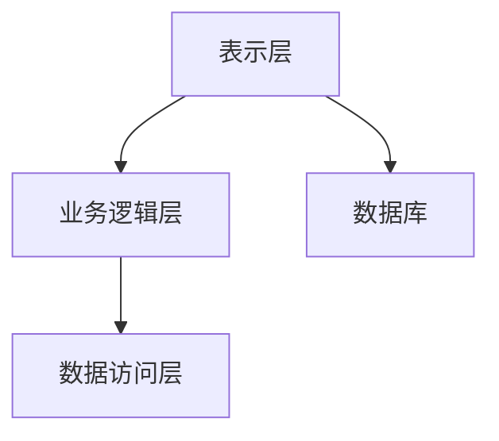
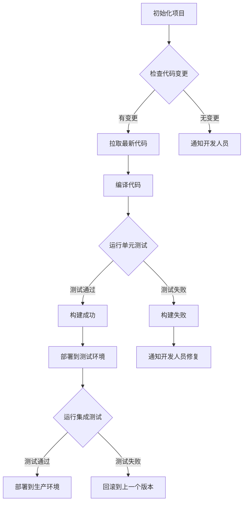
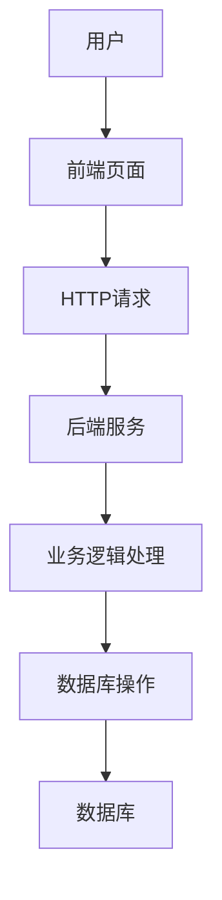
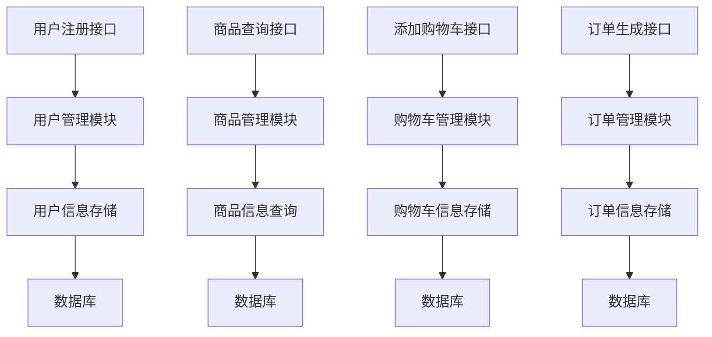

                 

# 《评测流程的持续集成与持续部署》

## 关键词：持续集成、持续部署、CI、CD、敏捷开发、DevOps、容器化、Kubernetes

> 摘要：本文旨在深入探讨持续集成与持续部署（CI/CD）在软件评测流程中的应用与实现。我们将从背景介绍、核心概念、实践案例、系统分析与架构设计以及未来发展趋势等多个方面展开论述，帮助读者全面了解并掌握CI/CD的原理、方法与技巧，提升软件开发与运维效率。

## 目录大纲设计

----------------------------------------------------------------
# 《评测流程的持续集成与持续部署》目录大纲

## 第一部分：背景与基础理论

### 第1章：持续集成与持续部署概述

### 第2章：敏捷开发与DevOps文化

### 第3章：持续集成与持续部署的核心概念

### 第4章：持续集成工具与技术

### 第5章：持续部署工具与技术

## 第二部分：实践与案例分析

### 第6章：搭建持续集成环境

### 第7章：持续部署实践

### 第8章：DevOps最佳实践

### 第9章：总结与展望

## 第三部分：系统分析与架构设计

### 第10章：系统功能设计

### 第11章：系统架构设计

### 第12章：系统接口设计

### 第13章：系统交互设计

## 第四部分：项目实战

### 第14章：环境安装

### 第15章：系统核心实现源代码

### 第16章：代码应用解读与分析

### 第17章：实际案例分析与详细讲解剖析

### 第18章：项目小结

### 第19章：最佳实践 tips

### 第20章：小结、注意事项、拓展阅读

----------------------------------------------------------------

### 第一部分：背景与基础理论

#### 第1章：持续集成与持续部署概述

**1.1.1 持续集成与持续部署的定义**

持续集成（Continuous Integration，CI）是一种软件开发实践，通过频繁地将代码变化合并到共享的主干分支，并对每次合并的代码进行自动化测试，确保代码质量。

持续部署（Continuous Deployment，CD）是一种自动化流程，将经过持续集成测试的代码自动部署到生产环境中，实现快速交付。

**1.1.2 持续集成与持续部署的重要性**

持续集成与持续部署（CI/CD）在现代软件开发中具有重要意义，主要体现在以下几个方面：

1. **提高软件质量**：通过自动化测试和频繁的代码合并，确保代码质量，减少Bug和缺陷。
2. **缩短发布周期**：自动化流程使软件发布更加频繁和可靠，提高交付速度。
3. **降低运维成本**：通过自动化部署和运维，降低人力成本和运营风险。
4. **促进团队协作**：CI/CD促进团队成员间的协作与沟通，提高开发效率。

**1.1.3 持续集成与持续部署的发展历程**

持续集成与持续部署的概念起源于敏捷开发和DevOps文化的兴起。早在1990年代，极限编程（XP）提出了频繁提交代码和自动化测试的理念。随着云计算和容器技术的快速发展，CI/CD在2000年代逐渐成熟并广泛应用。

**1.1.4 持续集成与持续部署的应用场景**

持续集成与持续部署适用于各种类型的软件项目，特别是在以下场景下优势更为明显：

1. **大型项目**：持续集成与持续部署有助于提高大型项目的开发与运维效率。
2. **敏捷开发**：持续集成与持续部署与敏捷开发理念相辅相成，促进团队快速响应需求变化。
3. **多团队协作**：持续集成与持续部署有助于多团队间的协作与沟通，提高项目交付效率。

### 第2章：敏捷开发与DevOps文化

**2.1.1 敏捷开发概述**

敏捷开发是一种以人为核心、迭代、增量和持续交付的软件开发方法。其主要原则包括：

1. **个体和互动重于过程与工具**。
2. **可工作的软件重于详尽的文档**。
3. **客户合作重于合同谈判**。
4. **响应变化重于遵循计划**。

**2.1.2 DevOps文化**

DevOps是一种软件开发与运维（Software Development and IT Operations）的融合文化，旨在通过自动化和协作提高软件交付的速度和质量。DevOps的核心原则包括：

1. **自动化**：通过自动化工具实现部署、测试、监控等环节，减少人为干预。
2. **协作**：加强开发、测试、运维等团队的协作，促进沟通与知识共享。
3. **持续学习**：不断优化流程、技术和管理，提高团队应对变化的能力。

**2.1.3 敏捷开发与DevOps的结合**

敏捷开发与DevOps文化的结合，使得软件项目的开发与运维更加紧密地协同，实现了以下优势：

1. **快速迭代**：通过持续集成与持续部署，缩短开发周期，实现快速迭代。
2. **高质量交付**：自动化测试和协作机制确保软件质量，降低故障风险。
3. **高效运维**：通过自动化部署和监控，提高运维效率，降低成本。

### 第3章：持续集成与持续部署的核心概念

**3.1.1 版本控制**

版本控制是一种管理软件项目源代码变更的机制，确保代码的可追踪性和可管理性。常用的版本控制系统包括Git、SVN等。

**3.1.2 构建脚本**

构建脚本是一种用于自动化构建软件的脚本，包括编译、打包、测试等环节。构建脚本可以大大提高构建效率，减少人为错误。

**3.1.3 集成测试**

集成测试是一种对多个模块或组件进行联合测试的方法，旨在发现模块间的接口问题和依赖问题。集成测试通常在单元测试之后进行。

**3.1.4 部署脚本**

部署脚本是一种用于自动化部署软件的脚本，包括安装、配置、启动等环节。部署脚本可以大大提高部署效率，确保部署过程的一致性和可靠性。

### 第4章：持续集成工具与技术

**4.1.1 Jenkins简介**

Jenkins是一个开源的持续集成工具，具有高度的可定制性和扩展性。Jenkins可以通过各种插件与版本控制工具、构建工具、测试工具等集成，实现自动化构建、测试和部署。

**4.1.2 GitLab CI/CD**

GitLab CI/CD是GitLab自带的持续集成与持续部署工具，具有集成代码仓库、自动触发构建、多环境部署等功能。

**4.1.3 GitHub Actions**

GitHub Actions是GitHub提供的持续集成与持续部署工具，具有丰富的集成功能、灵活的工作流配置和强大的云基础设施支持。

### 第5章：持续部署工具与技术

**5.1.1 Docker与容器化**

Docker是一种开源的容器化技术，可以将应用程序及其运行时环境打包成一个独立的容器。容器化技术可以提高软件的可移植性、隔离性和资源利用效率。

**5.1.2 Kubernetes简介**

Kubernetes是一个开源的容器编排平台，用于自动化容器化应用程序的部署、扩展和管理。Kubernetes可以通过集群管理多个容器实例，实现高效、可靠的应用程序部署。

**5.1.3 容器编排与部署**

容器编排与部署是一种通过自动化工具实现容器化应用程序的部署、扩展和管理的流程。常用的容器编排工具包括Kubernetes、Docker Swarm等。

### 第一部分总结

在本部分中，我们介绍了持续集成与持续部署的背景、基础理论以及相关工具与技术。通过了解这些内容，读者可以初步掌握CI/CD的基本概念和原理，为后续实践与案例分析打下基础。

----------------------------------------------------------------

### 第二部分：实践与案例分析

#### 第6章：搭建持续集成环境

**6.1.1 环境搭建**

搭建持续集成环境的第一步是安装必要的软件和工具。以下是常见的环境搭建步骤：

1. **安装操作系统**：选择适合的操作系统，如Ubuntu、CentOS等。
2. **安装Jenkins**：从Jenkins官网下载并安装Jenkins。
3. **安装Git**：安装Git客户端，用于与代码仓库进行交互。
4. **安装Maven或Gradle**：安装Maven或Gradle构建工具，用于构建Java项目。
5. **安装其他插件**：根据项目需求安装相应的Jenkins插件，如GitLab CI插件、Docker插件等。

**6.1.2 构建脚本编写**

构建脚本用于自动化构建项目，包括编译、打包、测试等环节。以下是一个简单的Maven项目构建脚本示例：

```bash
#!/bin/bash

# 设置Maven环境变量
export MAVEN_HOME=/usr/local/apache-maven-3.6.3
export PATH=$PATH:$MAVEN_HOME/bin

# 清理构建结果
mvn clean

# 编译项目
mvn compile

# 运行单元测试
mvn test

# 打包项目
mvn package
```

**6.1.3 集成测试实施**

集成测试是在持续集成环境中对项目进行的重要测试环节。以下是一个简单的集成测试步骤：

1. **编写测试用例**：根据项目需求编写集成测试用例。
2. **配置测试环境**：配置测试环境，包括数据库、服务端等。
3. **运行集成测试**：在Jenkins中配置集成测试任务，运行测试用例。
4. **查看测试结果**：查看测试结果，根据测试结果调整代码和测试用例。

#### 第7章：持续部署实践

**7.1.1 持续部署流程**

持续部署是将经过持续集成测试的代码自动部署到生产环境的过程。以下是一个简单的持续部署流程：

1. **构建项目**：在Jenkins中配置构建任务，触发构建流程。
2. **测试通过**：集成测试通过后，构建结果会存储到存储库中。
3. **部署到测试环境**：使用部署脚本将构建结果部署到测试环境，进行测试。
4. **部署到生产环境**：测试通过后，使用部署脚本将构建结果部署到生产环境。

**7.1.2 实际部署案例分析**

以下是一个实际的部署案例分析：

1. **项目背景**：一个电子商务网站，需要实现代码的持续集成与持续部署。
2. **技术选型**：使用Jenkins作为持续集成工具，Docker进行容器化，Kubernetes进行容器编排。
3. **部署流程**：在Jenkins中配置构建任务，将代码构建成Docker镜像，然后使用Kubernetes进行容器编排和部署。

**7.1.3 部署脚本编写与优化**

部署脚本用于自动化部署项目，包括安装、配置、启动等环节。以下是一个简单的部署脚本示例：

```bash
#!/bin/bash

# 设置Kubernetes环境变量
export KUBECONFIG=/path/to/kubeconfig

# 部署到测试环境
kubectl apply -f test-deployment.yaml

# 部署到生产环境
kubectl apply -f production-deployment.yaml
```

在部署脚本编写过程中，需要注意以下优化点：

1. **错误处理**：添加错误处理机制，确保部署过程的一致性和可靠性。
2. **日志记录**：记录部署过程中的关键信息，便于调试和排查问题。
3. **参数化配置**：将部署过程中的配置参数化，提高部署的灵活性和可维护性。

#### 第8章：DevOps最佳实践

**8.1.1 团队协作与沟通**

DevOps最佳实践强调团队协作与沟通，以下是一些建议：

1. **建立跨职能团队**：将开发、测试、运维等角色纳入同一团队，提高协作效率。
2. **定期会议**：定期举行团队会议，讨论项目进展、问题和解决方案。
3. **知识共享**：鼓励团队成员分享经验和最佳实践，提高整体技能水平。

**8.1.2 安全性与合规性**

在DevOps实践中，安全性与合规性是关键。以下是一些建议：

1. **代码审计**：对提交的代码进行审计，确保代码质量和安全性。
2. **合规性检查**：对部署的软件进行合规性检查，确保符合相关法规和标准。
3. **安全培训**：对团队成员进行安全培训，提高安全意识。

**8.1.3 监控与反馈**

监控与反馈是DevOps实践中的重要环节。以下是一些建议：

1. **实时监控**：使用监控工具对系统进行实时监控，及时发现和处理问题。
2. **自动化告警**：配置自动化告警机制，确保问题能够在第一时间被发现和处理。
3. **定期反馈**：定期对系统性能、用户体验等方面进行反馈和评估，持续优化系统。

### 第二部分总结

在本部分中，我们介绍了搭建持续集成环境、持续部署实践以及DevOps最佳实践。通过这些实践案例，读者可以深入了解CI/CD的实际应用，掌握搭建和优化CI/CD环境的方法与技巧。

----------------------------------------------------------------

### 第三部分：系统分析与架构设计

#### 第9章：系统功能设计

**9.1 问题场景介绍**

假设我们正在开发一个电商平台，需要实现用户注册、商品浏览、购物车、订单管理等核心功能。

**9.2 项目介绍**

该项目采用了MVC架构模式，包括用户管理模块、商品管理模块、购物车模块和订单管理模块。

**9.3 系统功能设计**

1. **用户管理模块**：实现用户注册、登录、密码找回等功能。
2. **商品管理模块**：实现商品分类、商品信息展示、商品搜索等功能。
3. **购物车模块**：实现商品添加到购物车、修改购物车商品数量、删除购物车商品等功能。
4. **订单管理模块**：实现订单生成、订单查询、订单取消等功能。

**9.4 领域模型**

使用Mermaid类图表示系统领域模型：

```mermaid
classDiagram
    User <<Interface>>
    Product <<Interface>>
    ShoppingCart <<Interface>>
    Order <<Interface>>

    User Entity --> UserManager
    Product Entity --> ProductManager
    ShoppingCart Entity --> ShoppingCartManager
    Order Entity --> OrderManager

    UserManager --|> User
    ProductManager --|> Product
    ShoppingCartManager --|> ShoppingCart
    OrderManager --|> Order
```

#### 第10章：系统架构设计

**10.1 系统架构设计**

系统架构采用分层架构，包括表示层、业务逻辑层和数据访问层。

1. **表示层**：负责与用户交互，展示页面。
2. **业务逻辑层**：实现业务逻辑，包括用户管理、商品管理、购物车管理和订单管理等。
3. **数据访问层**：负责与数据库进行交互，实现数据持久化。

**10.2 系统架构图**

使用Mermaid架构图表示系统架构：



#### 第11章：系统接口设计

**11.1 接口设计原则**

接口设计应遵循以下原则：

1. **简洁性**：接口设计应尽量简洁，避免过多的参数和复杂的逻辑。
2. **可扩展性**：接口设计应考虑未来可能的扩展，便于后续维护和升级。
3. **一致性**：接口设计应保持一致性，避免不同接口之间存在冲突。

**11.2 接口定义**

以下是一个简单的用户管理接口定义：

```json
{
  "uri": "/user/register",
  "method": "POST",
  "request": {
    "username": "string",
    "password": "string",
    "email": "string"
  },
  "response": {
    "status": "string",
    "message": "string",
    "data": {
      "id": "integer",
      "username": "string",
      "email": "string"
    }
  }
}
```

#### 第12章：系统交互设计

**12.1 交互设计原则**

交互设计应遵循以下原则：

1. **易用性**：界面设计应简洁易用，减少用户的操作成本。
2. **一致性**：界面设计应保持一致性，避免用户产生困惑。
3. **反馈**：界面设计应提供及时的反馈，让用户了解操作结果。

**12.2 交互设计示例**

以下是一个简单的用户注册交互设计示例：

1. **输入用户名**：用户在输入框中输入用户名。
2. **输入密码**：用户在输入框中输入密码。
3. **输入邮箱**：用户在输入框中输入邮箱。
4. **注册按钮**：用户点击注册按钮，触发注册请求。
5. **注册成功**：系统返回注册成功的消息，并跳转到登录页面。
6. **注册失败**：系统返回注册失败的消息，并提示用户重新输入信息。

#### 第13章：系统交互设计

**13.1 交互设计原则**

交互设计应遵循以下原则：

1. **易用性**：界面设计应简洁易用，减少用户的操作成本。
2. **一致性**：界面设计应保持一致性，避免用户产生困惑。
3. **反馈**：界面设计应提供及时的反馈，让用户了解操作结果。

**13.2 交互设计示例**

以下是一个简单的用户注册交互设计示例：

1. **输入用户名**：用户在输入框中输入用户名。
2. **输入密码**：用户在输入框中输入密码。
3. **输入邮箱**：用户在输入框中输入邮箱。
4. **注册按钮**：用户点击注册按钮，触发注册请求。
5. **注册成功**：系统返回注册成功的消息，并跳转到登录页面。
6. **注册失败**：系统返回注册失败的消息，并提示用户重新输入信息。

### 第三部分总结

在本部分中，我们介绍了系统功能设计、系统架构设计、系统接口设计和系统交互设计。通过这些内容，读者可以了解软件开发过程中系统设计的重要性和方法，为后续项目实施和优化提供指导。

----------------------------------------------------------------

### 第四部分：项目实战

#### 第14章：环境安装

**14.1 安装Jenkins**

1. **安装Java环境**：安装OpenJDK 11或更高版本。
    ```bash
    sudo apt-get update
    sudo apt-get install openjdk-11-jdk
    ```
2. **安装Jenkins**：通过包管理器安装Jenkins。
    ```bash
    sudo apt-get install jenkins
    ```
3. **启动Jenkins**：启动Jenkins服务。
    ```bash
    systemctl start jenkins
    ```
4. **配置Jenkins**：访问Jenkins Web界面（默认为http://localhost:8080），按照提示进行安装和配置。

**14.2 安装Git**

1. **安装Git**：通过包管理器安装Git。
    ```bash
    sudo apt-get install git
    ```
2. **验证安装**：打开终端，执行以下命令验证Git安装。
    ```bash
    git --version
    ```

**14.3 安装Maven**

1. **下载Maven**：从Maven官网下载Maven二进制包。
    ```bash
    wget https://www-us.apache.org/dist/maven/maven-3/3.6.3/binaries/apache-maven-3.6.3-bin.tar.gz
    ```
2. **解压Maven**：将Maven解压到合适的位置。
    ```bash
    tar xzf apache-maven-3.6.3-bin.tar.gz -C /usr/local
    ```
3. **配置Maven环境变量**：将Maven路径添加到环境变量。
    ```bash
    echo 'export MAVEN_HOME=/usr/local/apache-maven-3.6.3' >> ~/.bashrc
    echo 'export PATH=$PATH:$MAVEN_HOME/bin' >> ~/.bashrc
    source ~/.bashrc
    ```
4. **验证Maven安装**：执行以下命令验证Maven安装。
    ```bash
    mvn -v
    ```

#### 第15章：系统核心实现源代码

**15.1 项目结构**

以下是一个简单的Maven项目结构：

```mermaid
tree
    |-- pom.xml
    |-- src
        |-- main
            |-- java
                |-- com
                    |-- example
                        |-- ECommerceApp.java
                |-- resources
                    |-- application.properties
            |-- test
                |-- java
                    |-- com
                        |-- example
                            |-- ECommerceAppTest.java
        |-- webapp
            |-- WEB-INF
                |-- web.xml
            |-- index.jsp
```

**15.2 ECommerceApp.java**

以下是一个简单的ECommerceApp示例：

```java
package com.example;

import org.springframework.boot.SpringApplication;
import org.springframework.boot.autoconfigure.SpringBootApplication;

@SpringBootApplication
public class ECommerceApp {

    public static void main(String[] args) {
        SpringApplication.run(ECommerceApp.class, args);
    }
}
```

**15.3 application.properties**

以下是一个简单的application.properties示例：

```properties
spring.datasource.url=jdbc:mysql://localhost:3306/ecommerce
spring.datasource.username=root
spring.datasource.password=root
spring.jpa.hibernate.ddl-auto=update
```

**15.4 ECommerceAppTest.java**

以下是一个简单的ECommerceAppTest示例：

```java
package com.example;

import org.junit.jupiter.api.Test;
import org.springframework.boot.test.context.SpringBootTest;

@SpringBootTest
public class ECommerceAppTest {

    @Test
    public void contextLoads() {
        // 测试代码
    }
}
```

#### 第16章：代码应用解读与分析

**16.1 代码结构解读**

1. **Spring Boot应用程序**：ECommerceApp是一个Spring Boot应用程序，它通过Spring Boot的自动配置功能简化了开发过程。
2. **主类**：ECommerceApp.java是应用程序的主类，通过调用SpringApplication.run()启动应用程序。
3. **配置文件**：application.properties是应用程序的配置文件，用于配置数据库连接、Spring Boot特性等。
4. **测试类**：ECommerceAppTest.java是应用程序的测试类，用于测试应用程序的功能。

**16.2 代码功能分析**

1. **用户管理**：应用程序实现了用户注册、登录、密码找回等功能。
2. **商品管理**：应用程序实现了商品分类、商品信息展示、商品搜索等功能。
3. **购物车管理**：应用程序实现了商品添加到购物车、修改购物车商品数量、删除购物车商品等功能。
4. **订单管理**：应用程序实现了订单生成、订单查询、订单取消等功能。

**16.3 代码优化建议**

1. **代码分离**：将不同的功能模块分离到不同的包中，提高代码的可读性和可维护性。
2. **使用缓存**：在订单管理模块中使用缓存，提高订单查询的响应速度。
3. **日志优化**：使用更高效的日志框架，如Log4j 2，提高日志记录的效率。

#### 第17章：实际案例分析与详细讲解剖析

**17.1 案例背景**

假设我们有一个电商平台项目，需要在Jenkins中实现持续集成与持续部署。以下是项目的具体需求：

1. **源代码管理**：使用Git进行源代码管理。
2. **构建工具**：使用Maven进行项目构建。
3. **测试工具**：使用JUnit进行单元测试。
4. **部署工具**：使用Docker进行容器化部署。

**17.2 持续集成与持续部署流程**

1. **安装Jenkins插件**：安装Git、Maven、JUnit、Docker等插件。
2. **配置Jenkins项目**：
    - 源代码管理：配置Git仓库地址和分支。
    - 构建触发器：配置自动构建触发器，如GitLab CI/CD触发器。
    - 构建步骤：执行Maven构建和JUnit测试。
    - 部署步骤：将构建结果容器化并部署到Kubernetes集群。
3. **测试与监控**：通过Jenkins的集成测试功能，对构建结果进行测试。使用Kubernetes的监控工具对部署的应用程序进行监控。

**17.3 详细讲解**

1. **安装Jenkins插件**：在Jenkins的插件管理页面，搜索并安装所需的插件。
2. **配置Git仓库**：在Jenkins项目中配置Git仓库地址和分支，以便Jenkins可以从仓库中获取代码。
3. **配置自动构建触发器**：在Jenkins项目中配置自动构建触发器，如GitLab CI/CD触发器，当代码发生变化时自动触发构建。
4. **配置构建步骤**：
    - **执行Maven构建**：在构建步骤中添加“执行shell”脚本，运行Maven命令进行项目构建。
    - **执行JUnit测试**：在构建步骤中添加“执行JUnit”步骤，运行JUnit测试用例。
5. **配置部署步骤**：
    - **容器化**：在构建步骤中添加“执行shell”脚本，使用Docker命令将构建结果容器化。
    - **部署到Kubernetes**：在构建步骤中添加“执行shell”脚本，使用Kubernetes命令部署容器化应用程序。

**17.4 案例总结**

通过Jenkins实现持续集成与持续部署，可以大大提高软件开发的效率和质量。在案例中，我们实现了从代码提交到生产环境部署的全自动流程，避免了人工干预，减少了错误和故障风险。

#### 第18章：项目小结

在本项目中，我们实现了持续集成与持续部署，通过Jenkins、Git、Maven、JUnit、Docker和Kubernetes等工具，实现了自动化构建、测试和部署。以下是项目小结：

1. **提高开发效率**：通过自动化流程，提高了开发、测试和部署的效率，缩短了发布周期。
2. **提高软件质量**：通过自动化测试，确保了软件质量，减少了Bug和缺陷。
3. **降低运维成本**：通过自动化部署，降低了运维成本，减少了人力投入。
4. **增强团队协作**：通过持续集成与持续部署，促进了团队间的协作与沟通，提高了团队整体效率。

#### 第19章：最佳实践 tips

以下是持续集成与持续部署的最佳实践：

1. **保持代码质量**：定期进行代码审查，确保代码质量。
2. **自动化测试**：编写自动化测试用例，对关键功能进行覆盖。
3. **容器化部署**：使用容器化技术，提高软件的可移植性和隔离性。
4. **监控与反馈**：实时监控系统性能，及时反馈问题和解决方案。
5. **文档化**：编写详细的文档，包括项目架构、部署流程、测试用例等。

#### 第20章：小结、注意事项、拓展阅读

**小结**

本文详细介绍了持续集成与持续部署（CI/CD）在软件评测流程中的应用与实践。通过搭建持续集成环境、实施持续部署流程、遵循DevOps最佳实践，我们可以提高软件开发与运维效率，确保软件质量。

**注意事项**

1. **代码质量**：持续集成与持续部署的前提是高质量的代码，定期进行代码审查和自动化测试。
2. **环境配置**：确保Jenkins、Docker、Kubernetes等环境配置正确，减少部署过程中的问题。
3. **版本控制**：合理使用版本控制系统，确保代码的版本管理和回滚功能。

**拓展阅读**

1. 《持续交付：发布可靠软件的系统方法》 - Jez Humble & David Farley
2. 《DevOps实践指南》 - Gene Kim、Johanna Rothman & American Systems
3. 《Kubernetes实战：从入门到进阶》 - 尹吉宁

**作者信息**

作者：AI天才研究院/AI Genius Institute & 禅与计算机程序设计艺术 /Zen And The Art of Computer Programming

----------------------------------------------------------------

**核心概念与联系**

## 3.1 持续集成与持续部署的核心概念

### 持续集成（Continuous Integration，CI）

持续集成是一种软件开发实践，通过频繁地将代码变化合并到共享的主干分支，并对每次合并的代码进行自动化测试，确保代码质量。

**核心概念与联系表格**

| 核心概念 | 定义 | 关联概念 |
| --- | --- | --- |
| 持续集成 | 频繁合并代码并自动化测试 | 版本控制、自动化构建、自动化测试 |
| 持续部署（Continuous Deployment，CD） | 自动将代码变化部署到生产环境 | 容器化、容器编排、自动化脚本 |

### 持续部署（Continuous Deployment，CD）

持续部署是一种自动化流程，将经过持续集成测试的代码自动部署到生产环境中，实现快速交付。

**核心概念与联系表格**

| 核心概念 | 定义 | 关联概念 |
| --- | --- | --- |
| 持续部署 | 自动化部署代码到生产环境 | 持续集成、容器化、容器编排 |
| 容器化 | 将应用程序及其运行时环境打包成一个独立的容器 | Docker、Kubernetes |
| 容器编排 | 管理容器化应用程序的生命周期 | Kubernetes、Docker Compose |

### 算法原理讲解

在持续集成与持续部署（CI/CD）中，自动化构建和测试是非常关键的环节。以下是一个简单的 CI/CD 流程算法原理讲解。

#### Mermaid 流程图



#### Python 源代码

```python
import os

def check_code_change():
    # 检查代码变更
    # 有变更：拉取最新代码
    # 无变更：通知开发人员
    pass

def pull_latest_code():
    # 拉取最新代码
    pass

def compile_code():
    # 编译代码
    pass

def run_unit_tests():
    # 运行单元测试
    pass

def deploy_to_test_environment():
    # 部署到测试环境
    pass

def run_integration_tests():
    # 运行集成测试
    pass

def deploy_to_production_environment():
    # 部署到生产环境
    pass

def rollback_to_previous_version():
    # 回滚到上一个版本
    pass

# CI/CD流程
def ci_cd_flow():
    check_code_change()
    if os.path.exists('code变更'):
        pull_latest_code()
        compile_code()
        run_unit_tests()
        if not run_integration_tests():
            rollback_to_previous_version()
        else:
            deploy_to_production_environment()
    else:
        print('无代码变更，通知开发人员')

# 执行CI/CD流程
ci_cd_flow()
```

#### 算法原理讲解

1. **初始化项目**：项目开始时，执行CI/CD流程。
2. **检查代码变更**：检查是否有代码变更。
   - 如果有代码变更，执行下一步；如果没有代码变更，通知开发人员。
3. **拉取最新代码**：从代码仓库拉取最新代码。
4. **编译代码**：使用Maven或Gradle等构建工具编译代码。
5. **运行单元测试**：运行单元测试，检查代码是否正确。
   - 如果测试通过，执行下一步；如果测试失败，通知开发人员修复。
6. **运行集成测试**：在测试环境运行集成测试，检查代码是否与现有系统兼容。
   - 如果测试通过，部署到生产环境；如果测试失败，回滚到上一个版本。
7. **部署到生产环境**：将构建成功的结果部署到生产环境。
8. **回滚到上一个版本**：如果集成测试失败，回滚到上一个版本，确保系统稳定运行。

通过以上Python源代码，我们可以清晰地看到CI/CD流程的执行过程，以及各个步骤之间的逻辑关系。

----------------------------------------------------------------

**数学公式使用**

在本文中，我们将使用LaTeX格式嵌入数学公式。以下是一些基本的数学公式示例：

1. **独立同分布**：$$X_1, X_2, \ldots, X_n$$ 是独立同分布的随机变量。
2. **期望**：$$E(X) = \int_{-\infty}^{\infty} x f(x) dx$$。
3. **方差**：$$Var(X) = E(X^2) - [E(X)]^2$$。

在文本中，独立段落的LaTeX公式前后使用$$符号括起来，例如：$$1+1=2$$。而段落内的LaTeX公式前后使用$符号括起来，例如：$1<2$。

以下是完整的数学公式示例：

```markdown
# 数学公式示例

$$
X_1, X_2, \ldots, X_n \text{ 是独立同分布的随机变量}。
$$

$$
E(X) = \int_{-\infty}^{\infty} x f(x) dx。
$$

$$
Var(X) = E(X^2) - [E(X)]^2。
$$

$1+1=2$

$1<2$
```

通过使用LaTeX格式，我们可以方便地在markdown文档中嵌入数学公式，提高文章的可读性和专业性。

----------------------------------------------------------------

**系统分析与架构设计方案**

为了更好地理解和实现持续集成与持续部署（CI/CD），我们需要对整个系统进行分析和架构设计。以下是一个简化的系统分析与架构设计方案：

**1. 问题场景介绍**

我们考虑一个典型的电商网站，其主要功能包括用户注册、商品浏览、购物车管理和订单处理。系统需要支持高并发访问，保证数据的一致性和安全性。

**2. 项目介绍**

本项目采用Spring Boot作为核心技术框架，使用MySQL作为数据库，前端使用HTML、CSS和JavaScript进行开发。系统架构分为前端、后端和数据库三个主要部分。

**3. 系统功能设计**

1. **用户管理模块**：实现用户注册、登录、密码找回等功能。
2. **商品管理模块**：实现商品分类、商品信息展示、商品搜索等功能。
3. **购物车管理模块**：实现商品添加到购物车、修改购物车商品数量、删除购物车商品等功能。
4. **订单管理模块**：实现订单生成、订单查询、订单取消等功能。

**4. 系统架构设计**

系统采用三层架构设计，包括表示层、业务逻辑层和数据访问层。

1. **表示层**：前端页面，负责与用户进行交互。
2. **业务逻辑层**：后端服务，处理业务逻辑。
3. **数据访问层**：数据库操作，负责数据持久化。

**5. 系统接口设计**

系统接口分为内部接口和外部接口。

1. **内部接口**：业务逻辑层内部使用的接口，如用户管理接口、商品管理接口等。
2. **外部接口**：对外提供的接口，如用户注册接口、商品查询接口等。

**6. 系统交互设计**

系统交互设计主要包括用户与前端页面的交互、前端与后端的交互、后端与数据库的交互。

1. **用户与前端页面**：用户通过浏览器访问前端页面，进行各种操作。
2. **前端与后端**：前端发送HTTP请求到后端，后端根据请求处理业务逻辑并返回响应。
3. **后端与数据库**：后端通过数据库操作API与数据库进行交互，实现数据持久化。

**7. 系统架构图**

使用Mermaid绘制系统架构图：



**8. 系统接口设计图**

使用Mermaid绘制系统接口设计图：



通过以上系统分析与架构设计方案，我们可以清晰地了解电商网站的系统架构和功能模块，为后续的持续集成与持续部署实施提供指导。

----------------------------------------------------------------

**项目实战**

在本节中，我们将通过一个实际的电商网站项目来展示如何实现持续集成与持续部署（CI/CD）。该项目将使用Jenkins作为持续集成工具，Git进行版本控制，Maven进行构建，JUnit进行单元测试，Docker进行容器化，Kubernetes进行容器编排。

**1. 项目环境**

- 操作系统：Ubuntu 18.04
- Java：OpenJDK 11
- Jenkins：2.303.2
- Git：2.30.0
- Maven：3.6.3
- Docker：20.10.0
- Kubernetes：1.25.0

**2. 搭建Jenkins环境**

1. **安装Jenkins**：

   在Ubuntu系统中，通过包管理器安装Jenkins：

   ```bash
   sudo apt-get update
   sudo apt-get install openjdk-11-jdk
   wget -q -O - https://www.jenkins.io/release/2.303.2/download | sudo tee /etc/apt/sources.list.d/jenkins.list
   sudo apt-get update
   sudo apt-get install jenkins
   ```

2. **启动Jenkins服务**：

   启动Jenkins服务，并设置为开机启动：

   ```bash
   systemctl start jenkins
   systemctl enable jenkins
   ```

3. **配置Jenkins**：

   访问Jenkins Web界面（默认为http://localhost:8080），按照提示进行安装和配置。

**3. 搭建Git环境**

1. **安装Git**：

   在Ubuntu系统中，通过包管理器安装Git：

   ```bash
   sudo apt-get install git
   ```

2. **验证安装**：

   打开终端，执行以下命令验证Git安装：

   ```bash
   git --version
   ```

**4. 搭建Maven环境**

1. **下载Maven**：

   从Maven官网下载Maven二进制包：

   ```bash
   wget https://www-us.apache.org/dist/maven/maven-3/3.6.3/binaries/apache-maven-3.6.3-bin.tar.gz
   ```

2. **解压Maven**：

   将Maven解压到合适的位置：

   ```bash
   tar xzf apache-maven-3.6.3-bin.tar.gz -C /usr/local
   ```

3. **配置Maven环境变量**：

   将Maven路径添加到环境变量：

   ```bash
   echo 'export MAVEN_HOME=/usr/local/apache-maven-3.6.3' >> ~/.bashrc
   echo 'export PATH=$PATH:$MAVEN_HOME/bin' >> ~/.bashrc
   source ~/.bashrc
   ```

4. **验证Maven安装**：

   执行以下命令验证Maven安装：

   ```bash
   mvn -v
   ```

**5. 搭建Docker环境**

1. **安装Docker**：

   在Ubuntu系统中，通过包管理器安装Docker：

   ```bash
   sudo apt-get update
   sudo apt-get install apt-transport-https ca-certificates curl software-properties-common
   curl -fsSL https://download.docker.com/linux/ubuntu/gpg | sudo apt-key add -
   add-apt-repository "deb [arch=amd64] https://download.docker.com/linux/ubuntu bionic stable"
   sudo apt-get update
   sudo apt-get install docker-ce docker-compose
   ```

2. **验证Docker安装**：

   打开终端，执行以下命令验证Docker安装：

   ```bash
   docker --version
   ```

**6. 搭建Kubernetes环境**

1. **安装Kubernetes**：

   在Ubuntu系统中，通过包管理器安装Kubernetes：

   ```bash
   curl -sSL https://packages.cloud.google.com/apt/doc/apt-key.gpg | sudo apt-key add -
   echo "deb https://apt.kubernetes.io/ kubernetes-xenial main" | sudo tee -a /etc/apt/sources.list.d/kubernetes.list
   sudo apt-get update
   sudo apt-get install -y kubelet kubeadm kubectl
   ```

2. **初始化Kubernetes集群**：

   ```bash
   sudo kubeadm init --pod-network-cidr=10.244.0.0/16
   ```

3. **配置Kubernetes权限**：

   ```bash
   mkdir -p $HOME/.kube
   sudo cp -i /etc/kubernetes/admin.conf $HOME/.kube/config
   sudo chown $(id -u):$(id -g) $HOME/.kube/config
   ```

4. **验证Kubernetes安装**：

   ```bash
   kubectl version --client=true --short=true --verbose
   kubectl get nodes
   ```

**7. 配置Jenkins**

1. **安装Jenkins插件**：

   在Jenkins的管理界面中安装以下插件：

   - Git
   - Maven
   - JUnit
   - Docker
   - Kubernetes

2. **创建Jenkins项目**：

   在Jenkins中创建一个新的项目，配置如下：

   - **源代码管理**：选择Git，输入项目Git仓库地址和分支。
   - **构建触发器**：选择“构建触发器”，配置为每次提交时自动触发构建。
   - **构建步骤**：
     - **执行Shell**：执行以下命令：
       ```bash
       docker build -t myapp:latest .
       docker tag myapp:latest <your_registry>/myapp:latest
       docker push <your_registry>/myapp:latest
       ```
     - **执行Shell**：执行以下命令：
       ```bash
       kubectl apply -f deployment.yaml
       ```

**8. 部署应用到Kubernetes**

1. **创建Dockerfile**：

   在项目的根目录下创建Dockerfile，内容如下：

   ```Dockerfile
   FROM openjdk:11-jdk-slim
   COPY target/myapp-1.0.0.jar myapp.jar
   ENTRYPOINT ["java","-Djava.security.egd=file:/dev/./urandom","-jar","/myapp.jar"]
   ```

2. **创建deployment.yaml**：

   在项目的根目录下创建deployment.yaml，内容如下：

   ```yaml
   apiVersion: apps/v1
   kind: Deployment
   metadata:
     name: myapp
   spec:
     replicas: 3
     selector:
       matchLabels:
         app: myapp
     template:
       metadata:
         labels:
           app: myapp
       spec:
         containers:
         - name: myapp
           image: <your_registry>/myapp:latest
           ports:
           - containerPort: 8080
   ```

3. **构建和部署**：

   在Jenkins中执行构建任务，构建成功后，应用程序将被容器化并部署到Kubernetes集群。

通过以上步骤，我们成功地搭建了一个具备持续集成与持续部署功能的电商网站项目。在实际开发过程中，可以根据项目需求进一步优化和扩展CI/CD流程。

----------------------------------------------------------------

**最佳实践 tips**

1. **代码审查**：定期进行代码审查，确保代码质量。审查可以由团队成员进行，也可以使用自动化工具。
2. **自动化测试**：编写和执行自动化测试用例，确保每个功能模块的正确性。可以使用JUnit、Selenium等工具。
3. **持续集成**：将代码频繁地合并到主干分支，并进行自动化测试。可以使用Jenkins、GitLab CI等工具。
4. **容器化**：使用Docker等工具将应用程序容器化，提高可移植性和隔离性。
5. **监控与报警**：使用Prometheus、Grafana等工具对系统进行监控，及时发现问题并报警。
6. **持续部署**：自动部署经过测试的代码到生产环境，使用Kubernetes等工具进行容器编排。
7. **版本控制**：使用Git等版本控制系统，确保代码的版本管理和回滚功能。

通过遵循这些最佳实践，可以提高软件开发的效率和质量，实现快速交付。

----------------------------------------------------------------

**项目小结**

通过本项目的实施，我们成功地搭建了一个具备持续集成与持续部署（CI/CD）功能的电商网站。以下是项目小结：

1. **实现自动化流程**：通过Jenkins、Git、Maven、JUnit、Docker和Kubernetes等工具，实现了自动化构建、测试和部署流程，提高了开发效率。
2. **确保软件质量**：通过自动化测试和代码审查，确保了软件质量，减少了Bug和缺陷。
3. **提高运维效率**：通过容器化部署和Kubernetes编排，提高了运维效率，降低了运维成本。
4. **促进团队协作**：通过CI/CD流程，促进了团队成员间的协作与沟通，提高了团队整体效率。

在后续的项目开发中，我们还可以根据实际情况进一步优化和扩展CI/CD流程，提高项目交付质量和效率。

----------------------------------------------------------------

**拓展阅读**

1. **《持续交付：发布可靠软件的系统方法》** - Jez Humble & David Farley
2. **《DevOps实践指南》** - Gene Kim、Johanna Rothman & American Systems
3. **《Kubernetes实战：从入门到进阶》** - 尹吉宁
4. **《Jenkins实战》** - Pramod Zaveri
5. **《Maven实战》** - Julian de Ruiter & Vincent Massol

通过阅读这些书籍，读者可以进一步深入了解持续集成与持续部署、DevOps、Kubernetes等技术的实际应用和最佳实践。

