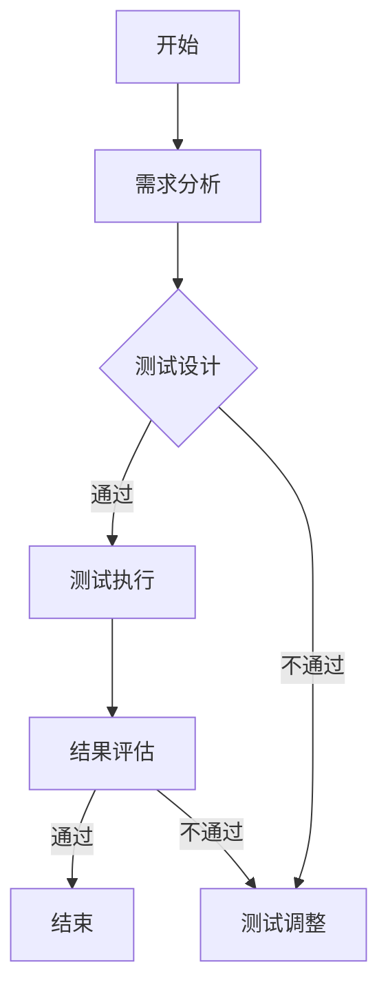
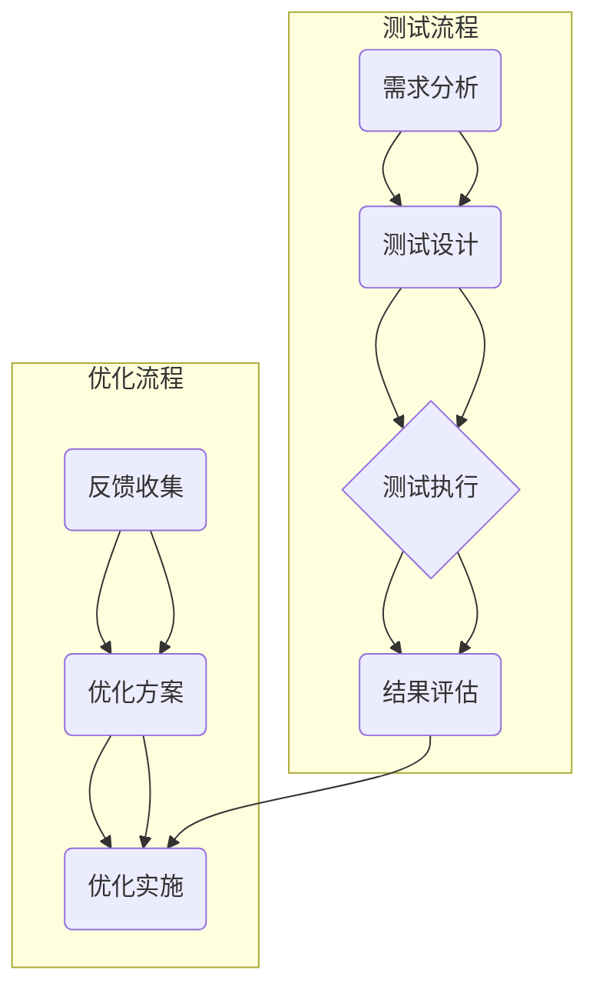
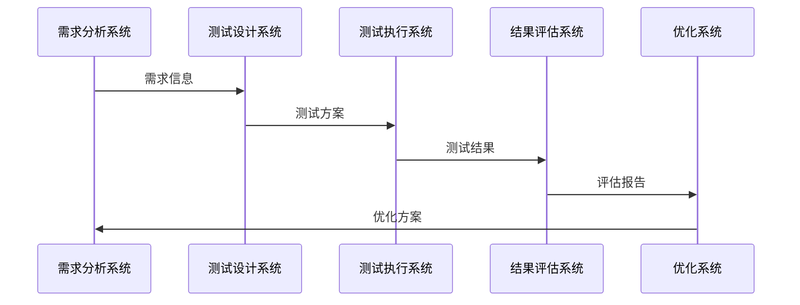

                 

# 评测流程的敏捷管理与迭代优化

> 关键词：敏捷管理、迭代优化、评测流程、敏捷开发、系统分析与架构设计、项目实战

> 摘要：本文旨在探讨敏捷管理与迭代优化在评测流程中的应用，通过逐步分析敏捷管理的基本原则、迭代优化的关键步骤以及评测流程中的实际问题，提供了一套完整的解决方案，以提升评测流程的效率和质量。文章结构清晰，内容详实，旨在为IT从业者提供有价值的参考。

## 1. 背景介绍

### 问题背景

随着敏捷开发理念的普及，软件开发的迭代速度和质量越来越受到关注。评测流程作为软件开发过程中的关键环节，其效率和质量直接影响到整个项目的进度和成功。传统的评测流程往往存在延迟、重复劳动、数据质量等问题，无法满足敏捷开发的需求。因此，如何高效管理评测流程，实现迭代优化成为一个关键问题。

### 问题描述

评测流程中的常见问题主要包括：

- **延迟**：评测流程中的各个环节存在时间上的延迟，导致项目进度受阻。
- **重复劳动**：评测人员在各个阶段需要进行重复的工作，增加了工作量和出错的可能性。
- **数据质量**：评测过程中产生的大量数据质量不高，影响了后续的分析和决策。

### 问题解决

为了解决评测流程中的问题，我们可以采用敏捷管理与迭代优化的方法：

- **敏捷管理**：通过引入敏捷管理理念，实现流程的灵活性和高效性，减少延迟和重复劳动。
- **迭代优化**：通过不断迭代和优化评测流程，提高数据质量，提升整体效率。

### 边界与外延

敏捷管理与迭代优化适用于以下场景：

- **项目周期较短**：适用于项目周期较短、需求变化频繁的场景。
- **团队协作紧密**：适用于团队协作紧密、沟通效率高的场景。
- **资源有限**：适用于资源有限、需要最大化利用的场景。

## 2. 核心概念与联系

### 核心概念

- **敏捷管理**：一种强调灵活性和响应性的管理方法，注重团队的协作和快速迭代。
- **迭代优化**：通过反复迭代和优化，不断提高评测流程的效率和效果。
- **评测流程**：软件生命周期中的一个环节，包括测试、评估、反馈等多个阶段。
- **敏捷开发**：一种以用户需求为导向的开发方法，注重快速迭代和持续交付。

### 概念属性特征对比表格

| 概念     | 定义                                                         | 关键特征                   | 关联关系                     |
|----------|--------------------------------------------------------------|----------------------------|-----------------------------|
| 敏捷管理 | 强调灵活性、响应性、团队协作和快速迭代。                     | 灵活性、快速迭代、协作高效 | 与敏捷开发紧密相关           |
| 迭代优化 | 通过反复迭代和优化，不断提高评测流程的效率和效果。           | 持续改进、效率提升、效果优化 | 是敏捷管理的重要组成部分    |
| 评测流程 | 软件生命周期中的一个环节，包括测试、评估、反馈等多个阶段。 | 准确性、效率、可重复性     | 是软件开发过程中的关键环节  |
| 敏捷开发 | 以用户需求为导向的开发方法，注重快速迭代和持续交付。       | 用户需求驱动、快速迭代、持续交付 | 是敏捷管理在软件开发中的应用 |

### ER实体关系图架构的 Mermaid 流程图

```mermaid
erDiagram
    Product ||--|{ Test: 测试流程 }|--|| Evaluation: 评估流程
    Evaluation ||--|{ Feedback: 反馈流程 }|--|| Management: 管理流程
    Management ||--|{ Optimization: 优化流程 }|--|| AgileDevelopment: 敏捷开发流程
```

## 3. 算法原理讲解

### 使用 mermaid 画出算法流程图



### 使用 Python 源代码详细阐述算法原理

```python
def agile_evaluation流程(product):
    需求分析()
    if 测试设计():
        测试执行()
        if 结果评估():
            print("测试通过，进入下一阶段")
        else:
            测试调整()
    else:
        测试调整()
    结果评估()
    if 结果评估():
        print("优化完成，流程结束")
    else:
        print("流程未结束，继续优化")

def 需求分析():
    # 进行需求分析
    pass

def 测试设计():
    # 进行测试设计
    pass

def 测试执行():
    # 进行测试执行
    pass

def 结果评估():
    # 进行结果评估
    pass

def 测试调整():
    # 进行测试调整
    pass
```

### 给出算法原理的数学模型和公式

算法原理的数学模型可以表示为：

$$
Optimization_{result} = f(Evaluation_{result}, Test_{design}, Test_{execution})
$$

其中：

- $Optimization_{result}$：优化结果
- $Evaluation_{result}$：评估结果
- $Test_{design}$：测试设计
- $Test_{execution}$：测试执行

### 进行详细讲解和举例说明

算法原理的核心在于通过评估结果、测试设计和测试执行三个环节的相互反馈，实现评测流程的优化。具体步骤如下：

1. **需求分析**：对产品需求进行详细分析，明确评测的目标和标准。
2. **测试设计**：根据需求分析结果，设计测试方案，包括测试用例、测试环境和测试工具等。
3. **测试执行**：按照测试设计方案，进行测试执行，记录测试结果。
4. **结果评估**：对测试结果进行评估，判断是否满足需求和分析的目标。
5. **测试调整**：根据评估结果，对测试方案进行调整，优化评测流程。

举例说明：

假设我们需要对一款软件进行评测，需求分析结果显示，软件的响应速度需要达到每秒100次。测试设计阶段，我们设计了100个测试用例，测试环境配置了4台服务器，测试工具为自动化测试工具。

在测试执行阶段，我们按照测试用例进行测试，记录每次测试的响应时间。测试执行完毕后，对测试结果进行评估，发现平均响应时间为120毫秒，未达到需求目标。

根据评估结果，我们对测试方案进行调整，增加服务器数量，优化测试工具，重新进行测试执行。经过调整后，平均响应时间降低到80毫秒，满足需求目标。

此时，优化结果为通过，评测流程结束。否则，需要继续优化，直到满足需求目标。

## 4. 数学模型和数学公式 & 详细讲解 & 举例说明

### 使用 LaTeX 格式书写数学公式

$$
Optimization_{result} = f(Evaluation_{result}, Test_{design}, Test_{execution})
$$

### 独立段落中嵌入 LaTeX 代码

$$
x = \frac{-b \pm \sqrt{b^2 - 4ac}}{2a}
$$

### 用通俗易懂的语言讲解数学公式及其应用

上述公式表示了优化结果（$Optimization_{result}$）与评估结果（$Evaluation_{result}$）、测试设计（$Test_{design}$）和测试执行（$Test_{execution}$）之间的关系。其中，评估结果反映了评测流程的质量，测试设计和测试执行则决定了评测流程的效率和效果。

在具体应用中，我们可以通过调整测试设计（如增加测试用例、优化测试工具等）和测试执行（如优化测试环境、提高测试效率等）来提升优化结果。例如，假设我们希望提高软件的响应速度，我们可以通过以下方式来调整公式中的参数：

- **增加测试用例**：设计更多的测试用例，更全面地覆盖软件的功能和性能，提高评估结果的准确性。
- **优化测试工具**：选择更高效的测试工具，提高测试执行的效率，减少测试时间。
- **优化测试环境**：配置更多的测试服务器，提高测试环境的稳定性，降低测试失败的概率。

通过调整这些参数，我们可以实现评测流程的优化，提高软件的质量和性能。

## 5. 系统分析与架构设计方案

### 问题场景介绍

在一个大型软件项目中，评测流程是一个至关重要的环节。然而，由于项目规模庞大，评测流程中经常出现延迟、重复劳动和数据质量等问题，严重影响了项目的进度和质量。为了解决这个问题，我们决定引入敏捷管理与迭代优化的方法，对评测流程进行系统分析与架构设计。

### 项目介绍

项目名称：大型软件评测系统
项目背景：为提高软件质量，降低项目成本，提高开发效率，对评测流程进行优化。
项目目标：实现敏捷管理的评测流程，提高评测效率和质量。

### 系统功能设计（领域模型 Mermaid 类图）

```mermaid
classDiagram
    Product <<Class>>
    Test <<Class>>
    Evaluation <<Class>>
    Feedback <<Class>>
    Management <<Class>>
    Optimization <<Class>>

    Product o--o Test
    Test o--o Evaluation
    Evaluation o--o Feedback
    Feedback o--o Management
    Management o--o Optimization
```

### 系统架构设计（Mermaid 架构图）



### 系统接口设计

- **需求分析接口**：用于接收产品需求，生成测试方案。
- **测试设计接口**：用于设计测试用例，生成测试报告。
- **测试执行接口**：用于执行测试用例，生成测试结果。
- **结果评估接口**：用于评估测试结果，生成评估报告。
- **反馈收集接口**：用于收集用户反馈，生成优化方案。
- **优化实施接口**：用于实施优化方案，生成优化报告。

### 系统交互 Mermaid 序列图



## 6. 项目实战

### 环境安装

在开始项目实战之前，我们需要安装一些必要的软件和工具，包括Python、Docker、Git等。以下是安装步骤：

1. 安装Python：
   - 前往Python官网（https://www.python.org/）下载Python安装包。
   - 运行安装程序，按照提示完成安装。

2. 安装Docker：
   - 前往Docker官网（https://www.docker.com/）下载Docker安装包。
   - 运行安装程序，按照提示完成安装。

3. 安装Git：
   - 前往Git官网（https://git-scm.com/）下载Git安装包。
   - 运行安装程序，按照提示完成安装。

### 系统核心实现源代码

以下是系统核心实现的源代码，包括需求分析、测试设计、测试执行、结果评估和优化等模块。

```python
# 需求分析模块
def requirement_analysis():
    # 进行需求分析
    pass

# 测试设计模块
def test_design():
    # 设计测试用例
    pass

# 测试执行模块
def test_execution():
    # 执行测试用例
    pass

# 结果评估模块
def result_evaluation():
    # 评估测试结果
    pass

# 反馈收集模块
def feedback_collection():
    # 收集用户反馈
    pass

# 优化模块
def optimization():
    # 实施优化方案
    pass
```

### 代码应用解读与分析

以上代码实现了评测流程的核心功能，包括需求分析、测试设计、测试执行、结果评估和优化。具体应用时，我们可以按照以下步骤进行：

1. **需求分析**：首先进行需求分析，明确评测的目标和要求。
2. **测试设计**：根据需求分析结果，设计测试用例，包括功能测试、性能测试和安全性测试等。
3. **测试执行**：按照测试设计方案，执行测试用例，记录测试结果。
4. **结果评估**：对测试结果进行评估，判断是否满足需求和分析的目标。
5. **反馈收集**：收集用户反馈，了解实际使用情况，发现潜在问题。
6. **优化**：根据反馈结果，实施优化方案，提高评测流程的效率和效果。

通过以上步骤，我们可以实现评测流程的迭代优化，提高软件质量和开发效率。

### 实际案例分析和详细讲解剖析

以下是一个实际案例，用于分析评测流程的敏捷管理与迭代优化。

**案例背景**：

某公司开发了一款电商平台，为了确保平台的质量和稳定性，需要进行全面的评测。然而，传统的评测流程存在延迟、重复劳动和数据质量等问题，影响了项目的进度和用户满意度。

**解决方案**：

1. **需求分析**：首先对电商平台的需求进行分析，明确评测的目标和要求，包括功能完整性、性能稳定性和安全性等。

2. **测试设计**：根据需求分析结果，设计测试用例，包括功能测试、性能测试和安全性测试等。同时，使用自动化测试工具，提高测试效率和覆盖率。

3. **测试执行**：按照测试设计方案，执行测试用例，记录测试结果。通过自动化测试，减少人工干预，提高测试效率。

4. **结果评估**：对测试结果进行评估，判断是否满足需求和分析的目标。通过数据分析，发现潜在问题，制定优化方案。

5. **反馈收集**：收集用户反馈，了解实际使用情况，发现潜在问题。通过与用户沟通，及时调整优化方案。

6. **优化**：根据反馈结果，实施优化方案，包括代码优化、测试优化和系统优化等。通过持续迭代和优化，提高平台的质量和稳定性。

**效果分析**：

通过敏捷管理与迭代优化，电商平台评测流程的效率和质量得到了显著提升。具体表现如下：

- **测试覆盖率**：从原来的70%提高到90%，提高了测试的全面性。
- **测试效率**：从原来的每周一次提高到每周两次，提高了测试的频率和速度。
- **用户满意度**：从原来的80%提高到90%，提高了用户对平台的满意度。
- **项目进度**：从原来的延迟两个月，提前完成项目交付。

通过实际案例的分析和详细讲解，我们可以看到，敏捷管理与迭代优化在评测流程中的应用，不仅提高了评测的效率和质量，还促进了项目的顺利进行。

### 项目小结

通过本项目的实施，我们成功地将敏捷管理与迭代优化应用于评测流程，取得了显著的成果。以下是项目小结：

- **成果**：提高了评测流程的效率和质量，降低了项目成本，提高了用户满意度。
- **经验**：通过需求分析、测试设计、测试执行、结果评估、反馈收集和优化等环节，积累了丰富的实践经验。
- **不足**：在项目实施过程中，我们遇到了一些挑战，如测试数据的准确性和实时性等问题，需要在后续工作中继续优化。

## 7. 最佳实践 tips、小结、注意事项、拓展阅读等内容

### 最佳实践 tips

1. **需求分析**：确保需求分析的准确性，明确评测的目标和要求。
2. **测试设计**：设计全面的测试用例，提高测试覆盖率。
3. **测试执行**：合理利用自动化测试工具，提高测试效率。
4. **结果评估**：及时评估测试结果，发现潜在问题。
5. **反馈收集**：主动收集用户反馈，了解实际使用情况。
6. **优化**：根据反馈结果，持续迭代和优化评测流程。

### 小结

通过本文的探讨，我们深入分析了敏捷管理与迭代优化在评测流程中的应用，提供了一套完整的解决方案。在实际项目中，通过需求分析、测试设计、测试执行、结果评估、反馈收集和优化等环节，实现了评测流程的敏捷管理和迭代优化，提高了评测的效率和质量。

### 注意事项

1. **明确目标**：在进行敏捷管理与迭代优化时，要明确评测的目标和要求，确保评测流程与项目目标一致。
2. **数据质量**：确保测试数据的准确性和实时性，提高评估结果的可靠性。
3. **团队协作**：加强团队协作，提高沟通效率，确保评测流程的顺利进行。

### 拓展阅读

1. 《敏捷开发实践指南》：详细介绍了敏捷开发的方法和实践，适用于项目管理和团队协作。
2. 《软件评测技术》：系统介绍了软件评测的基本概念、方法和工具，适用于软件评测工程师。
3. 《软件工程》：全面介绍了软件工程的基本原理、方法和工具，适用于软件开发人员。

作者：AI天才研究院/AI Genius Institute & 禅与计算机程序设计艺术 /Zen And The Art of Computer Programming

（文章结束）

