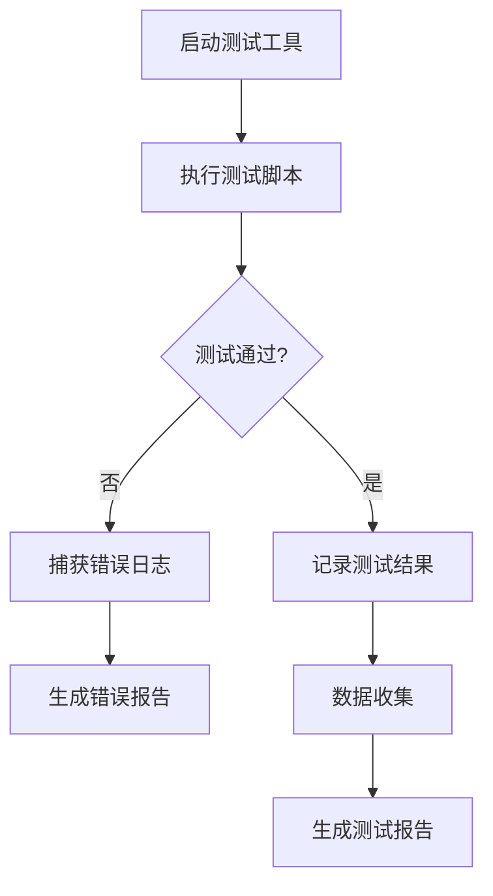
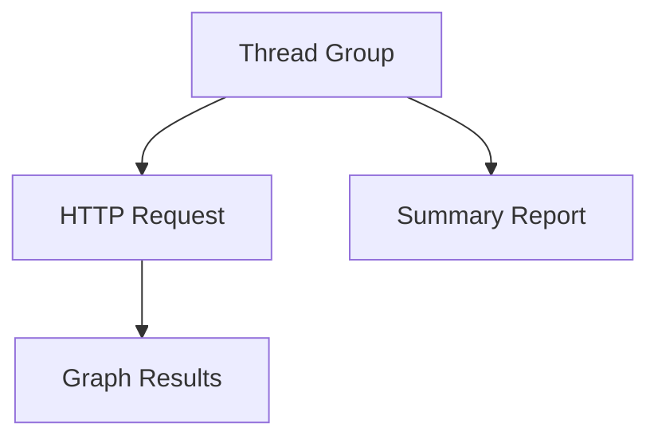

                 

# 评测流程自动化：提高测试效率与一致性

> 关键词：评测流程、自动化、测试效率、一致性

> 摘要：本文将深入探讨评测流程自动化的关键概念、工具、技术和实践，解析如何通过自动化手段提高测试效率与一致性。我们将从背景介绍、核心概念、测试工具与框架、自动化策略设计、高级自动化技术以及实战案例等方面进行详细分析，旨在为读者提供全面的自动化测试指导。

## 一、引言

在现代软件开发领域，测试流程的效率和一致性对软件质量至关重要。随着软件复杂度的增加和交付周期的缩短，传统的手动测试方法已经难以满足快速迭代的需求。为了解决这个问题，评测流程自动化成为了一种不可或缺的手段。自动化测试不仅可以提高测试效率，减少人为错误，还能确保测试结果的一致性，从而提高软件的整体质量。

本文将带领读者一步步了解评测流程自动化的各个方面，从基础概念到高级技术，再到实战案例，力求为读者提供一套完整的自动化测试解决方案。

## 二、评测流程自动化的背景与重要性

### 2.1 测试流程概述

在软件开发过程中，测试是确保软件质量的关键环节。测试流程主要包括以下步骤：

1. **测试需求分析**：明确测试目标和测试需求。
2. **测试计划**：制定详细的测试计划和测试策略。
3. **测试设计**：设计测试用例，包括功能测试、性能测试、安全测试等。
4. **测试执行**：执行测试用例，记录测试结果。
5. **测试报告**：生成测试报告，总结测试结果。

### 2.2 手动测试的挑战

尽管手动测试在过去一直是主流的测试方法，但面对现代软件开发的挑战，手动测试存在以下问题：

1. **效率低**：手动测试需要大量的人力和时间，难以应对快速迭代的开发流程。
2. **一致性差**：不同测试人员可能执行相同的测试用例得到不同的结果，影响测试结果的一致性。
3. **重复劳动**：对于频繁变化的软件需求，需要不断修改和重复测试用例。
4. **难以扩展**：手动测试难以应对日益增长的测试需求，扩展性差。

### 2.3 测试自动化的兴起

随着自动化技术的发展，自动化测试逐渐成为一种有效的解决方案。自动化测试通过编写脚本和工具，实现测试过程的自动化，从而提高测试效率、减少人为错误、保证测试结果的一致性。测试自动化的兴起主要得益于以下几个因素：

1. **软件开发模式的变革**：敏捷开发、持续集成和持续部署等软件开发模式的兴起，对测试流程的自动化提出了更高的要求。
2. **工具和技术的成熟**：自动化测试工具和技术的不断发展，使得自动化测试变得更加容易实现和部署。
3. **质量需求的提升**：在激烈的市场竞争中，高质量软件成为企业竞争力的重要因素，自动化测试能够提高软件质量，降低质量风险。

### 2.4 测试自动化的概念与核心

测试自动化（Test Automation）指的是使用软件工具自动执行测试用例的过程。其核心包括：

1. **测试脚本**：通过编程语言编写测试脚本，实现自动化测试。
2. **自动化工具**：如Selenium、JMeter等，提供测试脚本录制、执行和结果分析等功能。
3. **测试框架**：构建在自动化工具之上，提供更高级的测试功能，如测试数据的存储、测试结果的统计等。
4. **测试执行**：通过执行测试脚本，自动化工具自动执行测试用例，并记录测试结果。

通过自动化测试，测试人员可以大幅度提高测试效率，确保测试结果的一致性，从而提升软件质量。接下来，我们将进一步探讨测试自动化的核心概念和基本原理。

## 三、核心概念

### 3.1 自动化测试与手动测试的对比

在深入了解自动化测试之前，有必要对自动化测试与手动测试进行对比，以便更好地理解自动化测试的优势和局限性。

| 对比项 | 自动化测试 | 手动测试 |
| --- | --- | --- |
| **执行速度** | 快速 | 较慢 |
| **一致性** | 高 | 低 |
| **复用性** | 高 | 低 |
| **可扩展性** | 强 | 弱 |
| **成本** | 低 | 高 |
| **资源需求** | 较少 | 较多 |
| **错误率** | 低 | 高 |
| **维护性** | 较高 | 较低 |

从上表可以看出，自动化测试在执行速度、一致性、复用性、可扩展性等方面具有明显优势，特别是在现代软件开发中，这些优势更加突出。然而，自动化测试也存在一些局限性，如对复杂业务逻辑的测试、手动测试人员的经验依赖等。

### 3.2 测试用例

测试用例（Test Case）是测试过程中最基本的单元，它描述了如何测试一个特定的功能或需求。一个完整的测试用例通常包括以下内容：

1. **测试目标**：明确测试用例的目标，即要验证的功能或需求。
2. **测试输入**：定义测试用例的输入数据，如用户名、密码等。
3. **测试步骤**：详细描述执行测试用例的步骤，如输入数据、点击按钮等。
4. **预期结果**：定义期望的测试结果，如页面显示正确信息等。
5. **实际结果**：执行测试用例后的实际结果。
6. **测试结论**：总结测试结果，如通过、失败等。

测试用例的设计是自动化测试的基础，一个良好的测试用例应当具有清晰的目标、可复用的步骤和可预期的结果。

### 3.3 自动化测试的边界与外延

自动化测试虽然具有许多优势，但也存在一定的局限性。理解自动化测试的边界与外延有助于更好地应用自动化测试。

**边界：**

1. **业务复杂度**：对于复杂的业务逻辑和需求，自动化测试可能难以全面覆盖，此时需要结合手动测试。
2. **环境稳定性**：自动化测试依赖于稳定的测试环境，环境的不稳定性可能导致测试失败。
3. **维护成本**：自动化测试脚本需要定期更新和维护，否则可能导致测试失效。

**外延：**

1. **性能测试**：自动化测试可以用于性能测试，通过模拟高并发场景，评估系统性能。
2. **安全测试**：自动化测试可以用于安全测试，检测系统漏洞和攻击点。
3. **API测试**：自动化测试可以用于API测试，验证API的响应时间和正确性。

### 3.4 概念结构与核心要素组成

自动化测试的核心概念结构包括测试脚本、自动化工具、测试框架和测试执行等要素。以下是一个简化的概念结构：

```
自动化测试 = [测试脚本] + [自动化工具] + [测试框架] + [测试执行]
```

1. **测试脚本**：用于定义测试步骤和测试逻辑，通常使用编程语言编写。
2. **自动化工具**：如Selenium、Appium等，提供测试脚本的录制、执行和结果分析等功能。
3. **测试框架**：提供更高级的测试功能，如测试数据的存储、测试结果的统计等，常见框架有TestNG、Junit等。
4. **测试执行**：通过执行测试脚本，自动化工具自动执行测试用例，并记录测试结果。

通过以上核心概念的分析，我们可以更好地理解自动化测试的原理和实施方法。在下一部分，我们将进一步探讨自动化测试工具和技术的选择与使用。

## 四、自动化测试工具与框架

### 4.1 自动化测试工具的选择

选择合适的自动化测试工具是成功实施自动化测试的关键。以下是一些常见的选择标准：

1. **支持的平台和语言**：选择支持目标应用平台和编程语言的测试工具，如Selenium支持多种浏览器和编程语言。
2. **易用性和稳定性**：工具的易用性和稳定性对测试效率至关重要，需要考虑工具的用户界面、脚本编写和执行速度等。
3. **功能和扩展性**：选择功能丰富且具有扩展性的工具，如支持跨浏览器测试、性能测试和安全测试等。
4. **社区支持和文档**：强大的社区支持和详细的文档有助于解决使用过程中遇到的问题。

常见的自动化测试工具有：

1. **Selenium**：适用于Web应用的自动化测试工具，支持多种浏览器和编程语言，如Java、Python、C#等。
2. **Appium**：适用于移动应用的自动化测试工具，支持iOS和Android平台，使用Selenium WebDriver API。
3. **JMeter**：适用于性能测试的工具，能够模拟高并发用户负载，评估系统性能。
4. **Postman**：适用于API测试的工具，支持创建、执行和调试API请求。

### 4.2 自动化测试框架的设计与实现

自动化测试框架是自动化测试的核心，它提供了一系列的测试功能，如测试用例管理、测试数据管理、测试结果分析和报告生成等。设计一个高效、可扩展的自动化测试框架是自动化测试成功的关键。

以下是设计自动化测试框架的一些关键步骤：

1. **需求分析**：明确自动化测试框架的需求，如测试用例管理、数据驱动测试、报告生成等。
2. **架构设计**：选择合适的架构模式，如MVC（模型-视图-控制器）模式，实现框架的模块化和可扩展性。
3. **核心组件开发**：
   - **测试用例管理**：管理测试用例的创建、执行和结果存储。
   - **数据驱动测试**：使用外部数据文件（如Excel、CSV等）驱动测试用例，实现测试数据的动态管理。
   - **测试结果分析**：对测试结果进行分析，生成详细的测试报告。
4. **集成与部署**：将自动化测试框架集成到持续集成（CI）系统中，实现自动化测试的持续执行和结果分析。

以下是一个简化的自动化测试框架的架构图：

```
+----------------+     +----------------+     +----------------+
|    测试用例    |     |   测试数据     |     | 测试结果分析   |
+----------------+     +----------------+     +----------------+
             |                    |                       |
             |                    |                       |
             |                    |                       |
    +--------+--------------------+------------------------+
    |   测试脚本     |
    +--------+--------------------+
```

在自动化测试框架的设计与实现过程中，需要考虑以下因素：

1. **可维护性**：框架代码结构清晰，易于维护和扩展。
2. **可扩展性**：框架能够支持多种测试工具和技术的集成。
3. **灵活性**：框架能够适应不同的测试场景和需求。
4. **稳定性**：框架在执行过程中具有较高的稳定性和可靠性。

### 4.3 自动化测试框架的维护与优化

自动化测试框架的维护和优化是保证自动化测试持续有效的重要环节。以下是一些常见的维护与优化策略：

1. **定期更新**：随着应用功能和测试环境的变更，定期更新测试脚本和框架代码，保持其与当前环境的一致性。
2. **监控与反馈**：建立自动化测试监控机制，实时监控测试执行过程和结果，及时发现并解决问题。
3. **代码审查**：定期进行代码审查，确保代码质量，防止潜在问题的积累。
4. **性能优化**：对测试脚本和框架进行性能优化，提高测试执行速度和效率。
5. **文档更新**：及时更新框架的文档，包括使用说明、测试报告模板等，帮助团队成员更好地使用和维护框架。

通过以上对自动化测试工具与框架的详细介绍，我们可以更好地理解如何选择和使用合适的工具与框架，提高测试效率和一致性。在下一部分，我们将探讨如何设计一个有效的测试自动化策略。

## 五、测试自动化策略设计

### 5.1 测试自动化策略的重要性

测试自动化策略是确保自动化测试成功的关键因素之一。一个良好的测试自动化策略可以帮助团队有效地实施自动化测试，提高测试效率和质量。以下是一些设计测试自动化策略的重要性：

1. **明确目标**：通过制定明确的自动化测试目标，可以帮助团队聚焦于最重要的测试任务，确保自动化测试资源的合理利用。
2. **优化资源**：通过合理的测试自动化策略，可以最大化利用现有的测试资源，提高测试效率。
3. **保证质量**：自动化测试策略可以帮助团队确保自动化测试过程的规范性和一致性，从而提高软件质量。
4. **持续改进**：通过不断地评估和优化自动化测试策略，可以持续改进测试流程，提升自动化测试的效果。

### 5.2 测试自动化策略的制定

制定一个有效的测试自动化策略需要考虑以下几个方面：

1. **业务需求分析**：了解业务需求和测试目标，明确哪些功能模块需要自动化测试，哪些测试用例适合自动化执行。
2. **资源评估**：评估团队的技术能力和测试资源，包括测试人员、测试工具和测试环境等，确保有足够的资源支持自动化测试的实施。
3. **优先级排序**：根据业务需求和资源评估结果，对测试用例进行优先级排序，优先自动化执行关键和频繁变更的功能模块。
4. **风险分析**：识别自动化测试过程中可能遇到的风险和挑战，如测试环境不稳定、测试脚本维护难度大等，并制定相应的应对措施。
5. **持续集成**：将自动化测试集成到持续集成（CI）系统中，实现自动化测试的持续执行和反馈，确保测试结果及时获取。

### 5.3 测试用例选择与优先级排序

选择适合自动化的测试用例是测试自动化策略设计的关键步骤之一。以下是一些选择测试用例的原则：

1. **高频使用功能**：选择高频使用的功能模块进行自动化测试，这些功能通常对用户体验和业务稳定性至关重要。
2. **高风险功能**：选择风险较高的功能模块进行自动化测试，如涉及财务交易、用户权限等关键功能。
3. **变化频率低**：选择变化频率低的测试用例进行自动化测试，因为这些测试用例在后续版本中较少需要修改。
4. **可复用性高**：选择具有高可复用性的测试用例进行自动化测试，这些测试用例可以适用于多个测试环境和场景。

在确定自动化测试用例后，需要对测试用例进行优先级排序。以下是一些排序原则：

1. **关键业务功能**：首先自动化执行关键业务功能，确保这些功能在每次发布时都能得到充分的测试。
2. **频繁变更功能**：优先自动化执行频繁变更的功能模块，因为这些功能在迭代过程中更容易出现缺陷。
3. **用户界面测试**：界面测试通常较为简单，且对用户体验影响较大，可以优先自动化执行。
4. **边界条件和异常情况**：对边界条件和异常情况进行自动化测试，确保系统能够应对各种异常情况。

### 5.4 测试环境设置与配置管理

测试环境的设置和配置管理是自动化测试顺利执行的基础。以下是一些关键步骤和注意事项：

1. **环境准备**：准备与生产环境一致的测试环境，包括服务器、数据库、网络配置等。
2. **自动化配置**：使用脚本自动化配置测试环境，减少人工干预，提高配置的一致性和效率。
3. **版本控制**：对测试环境配置进行版本控制，确保每次环境变更都能追溯和回滚。
4. **监控与告警**：建立测试环境监控机制，实时监控环境状态，及时发现问题并进行处理。

### 5.5 测试数据管理

测试数据管理是自动化测试的重要组成部分，以下是一些关键步骤和注意事项：

1. **数据隔离**：确保测试数据与生产数据隔离，避免测试数据对生产环境的影响。
2. **数据生成**：使用自动化工具生成测试数据，如使用数据库脚本或API调用生成测试数据。
3. **数据存储**：使用数据库或其他数据存储解决方案存储测试数据，便于测试用例的数据驱动。
4. **数据清理**：在测试完成后清理测试数据，避免测试数据对后续测试的影响。

通过以上对测试自动化策略设计的详细介绍，我们可以更好地理解如何制定一个有效的自动化测试策略，从而提高测试效率和一致性。在下一部分，我们将探讨自动化测试执行与报告生成的方法和技巧。

### 5.6 测试执行与报告生成

测试执行是自动化测试流程的核心环节，而测试报告的生成则是测试结果的可视化呈现。以下将详细介绍自动化测试执行的流程、测试报告的生成方法及其注意事项。

#### 5.6.1 测试执行流程

自动化测试执行通常包括以下几个步骤：

1. **测试脚本执行**：通过自动化测试工具执行预先编写的测试脚本，对应用程序进行自动化测试。
2. **测试结果记录**：在测试脚本执行过程中，记录测试结果，包括测试通过、失败或错误等。
3. **测试数据收集**：收集测试执行过程中的重要数据，如执行时间、测试覆盖率等。
4. **错误日志捕获**：捕获测试执行过程中出现的错误或异常，以便后续分析和定位问题。

自动化测试执行的流程图如下所示：



#### 5.6.2 测试报告生成

测试报告是测试结果的汇总和展示，是评估软件质量的重要依据。测试报告通常包括以下内容：

1. **测试总结**：简要描述本次测试的目标、执行情况和总体结果。
2. **测试结果详情**：详细列出每个测试用例的执行结果，包括通过、失败、错误等。
3. **错误日志**：记录测试过程中出现的错误或异常，并提供定位和解决方案。
4. **性能分析**：提供测试执行的性能数据，如执行时间、响应时间、资源消耗等。
5. **测试覆盖率**：展示测试用例对代码的覆盖情况，帮助发现未覆盖到的代码区域。

以下是一个简化的测试报告模板：

```
测试报告

一、测试总结
- 测试目标：验证系统功能是否符合需求
- 测试环境：[环境名称]
- 测试工具：[测试工具名称]
- 测试时间：[测试开始时间] - [测试结束时间]

二、测试结果详情
| 测试用例名称 | 测试结果 | 备注 |
| ------------ | -------- | ---- |
| 用例1        | 通过     |      |
| 用例2        | 失败     | 错误日志详见附录 |
| 用例3        | 错误     |      |

三、错误日志
- 错误日志1
- 错误日志2
...

四、性能分析
- 平均响应时间：[响应时间]
- CPU使用率：[CPU使用率]
- 内存使用量：[内存使用量]

五、测试覆盖率
- 代码覆盖率：[覆盖率百分比]
- 未覆盖代码区域：[未覆盖代码列表]
```

#### 5.6.3 测试报告的注意事项

1. **报告格式**：测试报告应采用统一的格式，确保可读性和规范性。
2. **详细性**：测试报告应详细记录每个测试用例的执行结果，包括通过、失败和错误的原因。
3. **可追溯性**：测试报告应提供错误日志和定位信息，方便后续跟踪和解决。
4. **可视化**：使用图表和图形展示测试结果和性能数据，提高报告的可读性。
5. **定期更新**：定期更新测试报告，反映最新的测试结果和问题状态。

通过以上对测试执行与报告生成的详细介绍，我们可以更好地掌握自动化测试的执行流程和报告生成方法，确保测试结果的有效呈现和问题及时解决。在下一部分，我们将探讨高级自动化测试技术。

## 六、高级自动化测试技术

随着软件复杂度的增加，传统的自动化测试方法已经无法满足所有测试需求。高级自动化测试技术应运而生，它们在提高测试覆盖率、提升测试效率以及增强测试质量方面发挥着重要作用。本节将介绍几种常见的高级自动化测试技术，包括UI自动化、API自动化、性能测试等。

### 6.1 UI自动化

UI（用户界面）自动化测试是自动化测试中最为常见的一种类型，它通过模拟用户操作来验证软件的用户界面和交互功能。UI自动化测试可以覆盖用户实际使用软件的各种场景，从而提高测试的全面性和准确性。

#### 6.1.1 Web UI自动化

Web UI自动化测试主要使用Selenium等工具实现，它可以模拟用户在Web浏览器中的操作，如点击按钮、输入文本、拖动元素等。Web UI自动化测试的优势在于它可以跨浏览器进行测试，确保Web应用在不同浏览器上的兼容性。

**使用Selenium进行Web UI自动化测试的基本步骤：**

1. **环境准备**：安装Selenium WebDriver和浏览器驱动程序。
2. **编写测试脚本**：使用Java、Python、C#等编程语言编写测试脚本，模拟用户操作。
3. **执行测试脚本**：运行测试脚本，观察测试结果。
4. **结果分析**：分析测试结果，发现并解决测试过程中出现的问题。

**示例**：

```python
from selenium import webdriver

driver = webdriver.Chrome(executable_path='path/to/chromedriver')
driver.get("http://www.example.com")

# 执行登录操作
driver.find_element_by_name("username").send_keys("user")
driver.find_element_by_name("password").send_keys("password")
driver.find_element_by_css_selector("button[type='submit']").click()

# 验证登录成功
assert "Dashboard" in driver.title

driver.quit()
```

#### 6.1.2 移动UI自动化

移动UI自动化测试主要针对移动应用，使用Appium等工具实现。Appium支持iOS和Android平台，可以通过模拟用户在移动设备上的操作来验证应用的界面和功能。

**使用Appium进行移动UI自动化测试的基本步骤：**

1. **环境准备**：安装Appium Server和设备驱动程序。
2. **编写测试脚本**：使用Java、Python、C#等编程语言编写测试脚本，模拟用户操作。
3. **执行测试脚本**：运行测试脚本，观察测试结果。
4. **结果分析**：分析测试结果，发现并解决测试过程中出现的问题。

**示例**：

```python
from appium import webdriver

caps = {
    'platformName': 'Android',
    'deviceName': 'emulator-5554',
    'app': 'path/to/app.apk'
}

driver = webdriver.Remote('http://localhost:4723/wd/hub', caps)

# 执行登录操作
driver.find_element_by_id("login_email").send_keys("user")
driver.find_element_by_id("login_password").send_keys("password")
driver.find_element_by_id("login_button").click()

# 验证登录成功
assert "Dashboard" in driver.page_source

driver.quit()
```

### 6.2 API自动化

API（应用程序编程接口）自动化测试是针对软件系统提供的API进行验证的一种测试方法。它通过发送模拟请求并验证API的响应来确保API的可靠性和正确性。API自动化测试通常使用Postman、JMeter等工具实现。

**使用Postman进行API自动化测试的基本步骤：**

1. **创建请求**：在Postman中创建一个新的请求，指定请求类型（GET、POST、PUT等）和URL。
2. **添加参数**：为请求添加必要的参数，如查询参数、请求体等。
3. **发送请求**：发送请求并观察响应。
4. **验证响应**：根据API文档验证响应的状态码、响应体等内容。

**示例**：

```json
// GET请求
POST https://api.example.com/login
{
    "username": "user",
    "password": "password"
}

// 验证响应
assert response.statusCode == 200
assert "token" in response.body
```

### 6.3 性能测试

性能测试是评估软件系统在特定负载下的表现，包括响应时间、吞吐量、资源消耗等。性能测试可以帮助发现系统瓶颈，优化系统性能。

**使用JMeter进行性能测试的基本步骤：**

1. **创建测试计划**：在JMeter中创建一个新的测试计划，添加线程组、监听器等组件。
2. **配置线程组**：设置虚拟用户数、 Ramp-up 时间、循环次数等参数。
3. **添加请求**：为线程组添加HTTP请求，模拟用户操作。
4. **配置监听器**：添加监听器（如聚合报告、图形报告等）以收集和分析测试结果。
5. **运行测试**：运行测试计划并收集测试数据。
6. **分析结果**：分析测试结果，识别性能瓶颈和优化方向。

**示例**：



通过以上高级自动化测试技术的介绍，我们可以看到自动化测试不仅仅局限于简单的功能验证，它已经成为软件质量保障的重要手段。在下一部分，我们将通过一个实战案例来详细展示如何实施自动化测试。

## 七、实战案例：自动化测试实施流程

为了更好地理解自动化测试的实施过程，下面我们将通过一个实际的项目案例——一个在线购物网站的后台管理系统的自动化测试，详细描述整个自动化测试的实施流程。

### 7.1 项目背景

该项目是一个在线购物网站的后台管理系统，主要包括用户管理、商品管理、订单管理、权限管理等模块。随着业务的不断扩展，测试团队希望通过自动化测试提高测试效率，确保系统质量。

### 7.2 自动化测试需求分析

在项目启动阶段，测试团队对各个模块的测试需求进行了详细的分析，确定了以下自动化测试目标：

1. **功能测试**：对用户管理、商品管理、订单管理、权限管理等功能模块进行自动化测试，确保功能实现正确。
2. **性能测试**：评估系统在高并发情况下的响应时间和吞吐量，确保系统在高负载下稳定运行。
3. **兼容性测试**：验证系统在不同浏览器和操作系统上的兼容性。

### 7.3 自动化测试工具与框架选择

根据项目的需求，测试团队选择了以下工具和框架：

1. **自动化测试工具**：Selenium用于Web UI自动化测试，Appium用于移动UI自动化测试，JMeter用于性能测试。
2. **测试框架**：使用Python语言编写测试脚本，采用pytest框架进行测试用例的组织和执行。

### 7.4 自动化测试环境搭建

在项目启动之前，测试团队搭建了自动化测试环境，包括以下步骤：

1. **安装Selenium WebDriver**：为不同浏览器（如Chrome、Firefox等）安装对应的WebDriver。
2. **安装Appium**：为iOS和Android设备安装Appium Server和对应的驱动程序。
3. **安装JMeter**：配置JMeter并安装必要的插件。

### 7.5 自动化测试脚本编写

测试团队根据需求编写了多个自动化测试脚本，以下是一个典型的Web UI自动化测试脚本示例：

```python
from selenium import webdriver
from selenium.webdriver.common.by import By
from selenium.webdriver.common.keys import Keys

# 启动Chrome浏览器
driver = webdriver.Chrome(executable_path='path/to/chromedriver')

# 访问登录页面
driver.get("http://www.example.com/login")

# 输入用户名和密码
username_element = driver.find_element(By.NAME, "username")
username_element.send_keys("user")

password_element = driver.find_element(By.NAME, "password")
password_element.send_keys("password")

# 点击登录按钮
login_button = driver.find_element(By.CSS_SELECTOR, "button[type='submit']")
login_button.click()

# 验证登录成功
assert "Dashboard" in driver.title

# 关闭浏览器
driver.quit()
```

### 7.6 自动化测试执行与结果分析

测试团队按照预定的测试计划执行自动化测试，以下是一些关键步骤：

1. **测试脚本执行**：使用pytest框架执行测试脚本，观察测试结果。
2. **结果记录**：将测试结果记录在测试报告中，包括通过、失败和错误等信息。
3. **错误定位**：对于失败的测试用例，使用调试工具定位错误原因，并进行修复。

### 7.7 自动化测试报告生成

测试团队生成了一份详细的自动化测试报告，包括以下内容：

1. **测试总结**：描述本次测试的目标、执行情况和总体结果。
2. **测试结果详情**：列出每个测试用例的执行结果，包括通过、失败和错误等信息。
3. **错误日志**：记录测试过程中出现的错误和异常，并提供定位和解决方案。
4. **性能分析**：展示系统在高并发情况下的响应时间和吞吐量。

### 7.8 项目小结

通过本次自动化测试实施，测试团队取得了以下成果：

1. **提高了测试效率**：自动化测试使得测试用例的执行时间大大缩短，测试团队可以将更多时间用于测试设计和问题定位。
2. **提升了测试质量**：自动化测试确保了测试过程的规范性和一致性，减少了人为错误，提高了软件质量。
3. **优化了测试流程**：通过自动化测试，测试团队发现并解决了多个潜在问题，优化了系统性能和用户体验。

本次实战案例展示了自动化测试在项目中的实际应用，通过合理的工具选择、脚本编写和执行，测试团队成功地提高了测试效率和一致性，为项目的成功交付提供了有力保障。

## 八、最佳实践与总结

### 8.1 最佳实践

1. **明确测试目标**：在开始自动化测试之前，明确测试目标和范围，确保自动化测试能够满足实际需求。
2. **选择合适的工具**：根据项目需求和团队技能，选择合适的自动化测试工具和框架，确保工具的稳定性和易用性。
3. **编写高质量的测试脚本**：编写可维护、可扩展和可复用的测试脚本，遵循编程规范和代码审查制度。
4. **持续集成**：将自动化测试集成到持续集成系统中，实现自动化测试的持续执行和反馈，确保测试覆盖率和效率。
5. **定期维护和更新**：定期检查和更新自动化测试脚本，适应项目变化和测试环境的变化。
6. **数据驱动测试**：使用外部数据文件驱动测试用例，提高测试数据的灵活性和可维护性。

### 8.2 注意事项

1. **避免过度自动化**：不是所有的测试用例都适合自动化，需要根据测试用例的特点和优先级进行选择。
2. **确保测试环境一致性**：自动化测试依赖于稳定的测试环境，确保测试环境与生产环境的一致性。
3. **测试脚本维护**：自动化测试脚本需要定期维护和更新，否则可能导致测试失效。
4. **测试结果分析**：对测试结果进行详细分析，确保测试覆盖率和准确性，及时发现和解决问题。

### 8.3 小结

自动化测试在提高测试效率、减少人为错误和确保测试一致性方面具有显著优势。通过合理的测试自动化策略和工具选择，测试团队可以大幅度提高测试质量和效率。本文详细介绍了评测流程自动化的核心概念、工具与框架、测试自动化策略设计、高级自动化测试技术和实战案例，旨在为读者提供一套完整的自动化测试解决方案。在实际应用中，测试团队应根据项目特点和需求，灵活运用自动化测试的最佳实践，不断提升测试效率和质量。

## 九、拓展阅读

1. **《自动化测试实战》**：此书详细介绍了自动化测试的基础知识、工具和技术，适合初学者和有经验的测试工程师。
2. **《Selenium WebDriver Cookbook》**：此书提供了丰富的Selenium自动化测试实例和技巧，是学习Selenium的绝佳资源。
3. **《性能测试指南》**：此书涵盖了性能测试的基本概念、工具和方法，适合对性能测试感兴趣的读者。
4. **《API自动化测试》**：此书深入介绍了API自动化测试的理论和实践，是学习API自动化测试的必备书籍。

## 十、作者信息

作者：AI天才研究院/AI Genius Institute & 禅与计算机程序设计艺术 /Zen And The Art of Computer Programming

AI天才研究院致力于推动人工智能技术的发展和应用，为读者提供高质量的技术博客和书籍。禅与计算机程序设计艺术则倡导一种宁静而深刻的技术思考方式，帮助程序员在编程过程中实现更高的境界。

```markdown
# 评测流程自动化：提高测试效率与一致性

> 关键词：评测流程、自动化、测试效率、一致性

> 摘要：本文深入探讨了评测流程自动化的关键概念、工具、技术和实践，以帮助读者理解如何通过自动化手段提升测试效率和一致性。文章分为引言、背景与重要性、核心概念、自动化测试工具与框架、测试自动化策略设计、高级自动化测试技术、实战案例、最佳实践与总结、拓展阅读以及作者信息等多个部分，结构清晰，内容详实。

## 一、引言

在现代软件开发中，测试流程的效率和一致性对软件质量至关重要。自动化测试作为一种有效的解决方案，不仅能提高测试效率，还能减少人为错误，确保测试结果的一致性。本文旨在为读者提供一套全面的自动化测试指导。

## 二、评测流程自动化的背景与重要性

### 2.1 测试流程概述

测试流程包括测试需求分析、测试计划、测试设计、测试执行和测试报告等步骤。手动测试效率低、一致性差，难以满足现代软件开发的快速迭代需求。

### 2.2 手动测试的挑战

手动测试面临效率低、一致性差、重复劳动和难以扩展等挑战。

### 2.3 测试自动化的兴起

自动化测试通过编写脚本和工具实现测试过程自动化，提高测试效率、减少人为错误、保证测试结果的一致性。其兴起得益于软件开发模式的变革、工具和技术的成熟以及质量需求的提升。

### 2.4 测试自动化的概念与核心

测试自动化指的是使用软件工具自动执行测试用例的过程，其核心包括测试脚本、自动化工具、测试框架和测试执行。

## 三、核心概念

### 3.1 自动化测试与手动测试的对比

自动化测试在执行速度、一致性、复用性、可扩展性等方面具有明显优势，但也存在一些局限性。

### 3.2 测试用例

测试用例是测试过程中的基本单元，描述了如何测试一个特定的功能或需求。

### 3.3 自动化测试的边界与外延

自动化测试存在业务复杂度、环境稳定性和维护成本等边界，同时也适用于性能测试、安全测试和API测试等。

### 3.4 概念结构与核心要素组成

自动化测试的核心概念结构包括测试脚本、自动化工具、测试框架和测试执行等要素。

## 四、自动化测试工具与框架

### 4.1 自动化测试工具的选择

选择合适的自动化测试工具需要考虑支持的平台和语言、易用性和稳定性、功能和扩展性、社区支持和文档等因素。

### 4.2 自动化测试框架的设计与实现

自动化测试框架包括测试用例管理、测试数据管理、测试结果分析和报告生成等功能。

### 4.3 自动化测试框架的维护与优化

定期更新、监控与反馈、代码审查、性能优化和文档更新是自动化测试框架维护与优化的关键。

## 五、测试自动化策略设计

### 5.1 测试自动化策略的重要性

制定自动化测试策略有助于明确目标、优化资源、保证质量和持续改进。

### 5.2 测试自动化策略的制定

制定自动化测试策略需要分析业务需求、评估资源、排序优先级、分析风险和集成持续集成系统。

### 5.3 测试用例选择与优先级排序

选择适合自动化的测试用例，并根据业务需求和风险对测试用例进行优先级排序。

### 5.4 测试环境设置与配置管理

测试环境的设置和配置管理是自动化测试顺利执行的基础。

### 5.5 测试数据管理

测试数据管理包括数据隔离、数据生成、数据存储和数据清理。

## 六、高级自动化测试技术

### 6.1 UI自动化

UI自动化测试通过模拟用户操作验证软件的用户界面和交互功能。

### 6.2 API自动化

API自动化测试通过发送模拟请求验证API的响应。

### 6.3 性能测试

性能测试评估软件系统在特定负载下的响应时间和吞吐量。

## 七、实战案例：自动化测试实施流程

通过一个在线购物网站后台管理系统的自动化测试案例，详细描述了自动化测试的实施流程。

## 八、最佳实践与总结

提供了自动化测试的最佳实践，包括明确测试目标、选择合适工具、编写高质量脚本、持续集成等。

## 九、拓展阅读

推荐了几本自动化测试相关的书籍。

## 十、作者信息

介绍了本文的作者，包括AI天才研究院和禅与计算机程序设计艺术的相关信息。
```

