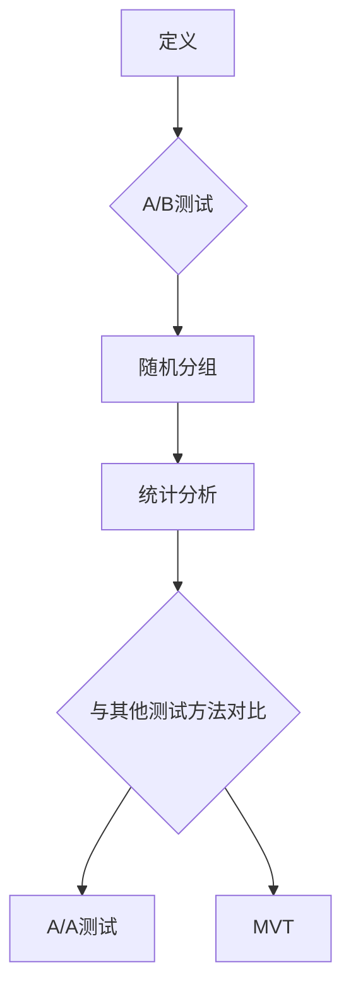

                 

### 文章标题

### 关键词

- A/B测试
- 实施方案
- 测试设计
- 数据分析
- 案例分析

### 摘要

本文旨在全面阐述评测系统的A/B测试实施方案，通过理论讲解、案例分析以及实战演练，帮助读者理解和掌握A/B测试的核心概念、设计原则、实施流程和优化策略。文章涵盖了A/B测试的基础理论、具体实施方案、数据分析与模型评估、常见问题与解决策略，并通过实际案例展示了A/B测试在不同业务场景中的成功应用。本文旨在为从事软件开发、数据分析和产品运营的相关人员提供有价值的参考和指导。

### A/B测试概述

#### 1.1.1 问题背景

在互联网和数字技术快速发展的时代，产品更新迭代频繁，如何快速验证产品功能和设计优化效果，已成为企业提高市场竞争力和用户满意度的重要课题。传统的单一版本开发和发布方式已经无法满足这种快速变化的需求。因此，A/B测试作为一种科学的实验方法，应运而生，并逐渐成为产品开发和优化的重要工具。

A/B测试，又称为拆分测试或对照实验，通过将用户随机分配到不同的版本，比较两个或多个版本在用户行为、转化率等方面的差异，从而找出最优的设计方案。其核心在于通过数据驱动的方式，降低产品优化的风险，提高决策的科学性和准确性。

#### 1.1.2 问题描述

在实际应用中，A/B测试面临诸多挑战。首先是如何合理划分测试组和控制组，确保样本的代表性和公平性。其次是如何设计有效的测试指标，量化评估不同版本的效果。此外，数据分析和结果解读也是A/B测试中的难点，需要综合考虑多种因素，避免统计陷阱和错误结论。

#### 1.1.3 问题解决

为了解决上述问题，A/B测试的实施需要遵循以下原则：

1. **随机分组**：确保测试组和控制组的用户随机分配，避免人为干预和偏差。
2. **可控变量**：在测试过程中，只对单一变量进行调整，保持其他条件一致，以便准确评估变量对结果的影响。
3. **统计显著性**：通过统计检验方法，判断测试结果是否具有显著性，避免偶然性误差。
4. **长期监控**：在测试结束后，持续监控用户行为和数据变化，确保测试结果的长期稳定性。

#### 1.1.4 边界与外延

A/B测试不仅适用于产品功能优化，还可以应用于广告投放、页面设计、用户体验等多个领域。其边界在于测试对象的选择、测试环境的设置和测试数据的收集。同时，A/B测试也需要与其他测试方法相结合，如多变量测试（MVT）和A/A测试，以实现更全面和精准的产品优化。

#### 1.2 核心概念与联系

##### 1.2.1 A/B测试定义

A/B测试是一种通过对比两个或多个版本的差异，评估不同设计方案对用户行为和业务结果影响的实验方法。它基于随机分组和统计分析，确保测试结果的可靠性和科学性。

##### 1.2.2 A/B测试与其它测试方法的对比

A/A测试：与A/B测试类似，但仅用于验证测试平台的稳定性和一致性，不涉及版本对比。

多变量测试（MVT）：同时测试多个变量，提高测试效率，但需要更复杂的统计模型和数据处理。

##### 1.2.3 关键概念关系图



#### 1.3 主流A/B测试平台与工具

##### 1.3.1 国内外主流A/B测试平台介绍

- **国内平台**：如GrowingIO、道客、同程云测试等，提供一站式的A/B测试解决方案，支持多种数据源接入和实时分析。
- **国外平台**：如AB Tasty、Google Optimize、VWO等，具有丰富的功能模块和灵活的测试配置，适用于大型企业的复杂需求。

##### 1.3.2 工具选型与使用

工具选型应考虑以下因素：

- **测试需求**：根据产品特点和测试目标，选择适合的工具。
- **数据支持**：确保工具支持所需的数据源和数据格式。
- **用户体验**：工具的操作界面应直观易用，降低使用门槛。
- **成本**：根据企业预算和资源，合理选择性价比高的工具。

#### 1.4 A/B测试在业务中的应用

##### 1.4.1 应用场景

A/B测试广泛应用于以下场景：

- **产品功能优化**：评估不同功能版本对用户行为和业务指标的影响。
- **广告投放**：优化广告创意和投放策略，提高点击率和转化率。
- **页面设计**：测试不同页面布局和元素对用户留存和转化的影响。
- **用户体验**：改进产品界面和交互设计，提升用户满意度。

##### 1.4.2 优势与挑战

优势：

- **数据驱动**：基于实际数据，减少主观判断，提高决策科学性。
- **快速反馈**：缩短产品迭代周期，快速验证优化效果。

挑战：

- **测试成本**：测试设计、数据收集和分析需要投入大量时间和资源。
- **结果解读**：如何准确解读测试结果，避免误判和误导。

#### 1.5 本章小结

本章介绍了A/B测试的基本概念、问题背景、核心概念与联系以及主流平台与工具。通过本章的学习，读者可以了解A/B测试的基本原理和应用场景，为后续章节的深入探讨打下基础。在接下来的章节中，我们将进一步探讨A/B测试的实施流程、数据分析方法和实战案例，帮助读者掌握A/B测试的实战技巧。

### A/B测试流程与设计

#### 2.1.1 A/B测试流程

A/B测试流程可以分为以下几个阶段：

1. **目标设定**：明确测试目标和预期结果。
2. **测试设计**：制定测试方案，包括版本选择、分组策略和测试指标。
3. **数据收集**：在测试期间收集用户行为数据。
4. **数据分析**：运用统计方法分析测试数据，判断版本效果。
5. **结果解读**：根据分析结果，评估优化方案。

#### 2.1.2 测试设计原则

1. **随机分组**：确保测试组和控制组的用户随机分配，避免偏差。
2. **单一变量**：调整单一变量，保持其他条件一致，以便准确评估变量对结果的影响。
3. **合理样本量**：根据业务需求和预期效果，确定合理的样本量，保证测试结果的可靠性。
4. **测试指标**：选择具有代表性的测试指标，量化评估版本效果。

#### 2.1.3 实施策略

1. **测试方案制定**：根据目标设定测试方案，包括版本选择、分组策略和测试指标。
2. **环境准备**：确保测试环境与生产环境一致，避免环境差异影响测试结果。
3. **用户分配**：随机分配用户到测试组和控制组，确保样本的公平性。
4. **数据监控**：实时监控测试数据，确保数据的完整性和准确性。
5. **结果分析**：运用统计方法分析测试数据，判断版本效果，得出结论。

#### 2.2 数据收集与模型评估

##### 2.2.1 数据收集

数据收集是A/B测试的核心环节，主要包括以下步骤：

1. **数据采集**：通过日志、API接口、用户反馈等方式收集用户行为数据。
2. **数据清洗**：处理缺失值、异常值和重复数据，确保数据质量。
3. **数据存储**：将清洗后的数据存储在数据库或数据仓库中，便于后续分析。

##### 2.2.2 数据预处理

数据预处理主要包括以下内容：

1. **特征工程**：提取和构造对测试结果有重要影响的数据特征。
2. **数据标准化**：将不同特征的数据进行归一化或标准化处理，便于模型训练。
3. **缺失值处理**：填补缺失值或删除含有缺失值的样本，保证数据完整性。

##### 2.2.3 模型评估方法

模型评估方法包括以下几种：

1. **准确率**：预测为正样本且实际为正样本的比率。
2. **召回率**：实际为正样本且预测为正样本的比率。
3. **F1值**：准确率和召回率的调和平均，综合评价模型的性能。
4. **ROC曲线**：反映模型在不同阈值下的性能，曲线下面积越大，模型性能越好。

#### 2.3 常见问题与优化策略

##### 2.3.1 测试失败原因

1. **样本量不足**：测试组用户数量不足，导致结果不准确。
2. **数据质量差**：数据存在缺失值、异常值和重复数据，影响模型训练和评估。
3. **测试时间过短**：测试时间过短，无法反映版本效果的长期稳定性。
4. **测试指标不当**：选择不当的测试指标，无法准确评估版本效果。

##### 2.3.2 优化策略与技巧

1. **增加样本量**：确保测试组用户数量达到统计学要求，提高结果准确性。
2. **提高数据质量**：加强数据采集和清洗，确保数据质量。
3. **延长测试时间**：增加测试时间，观察版本效果的长期变化。
4. **选择合适的测试指标**：根据业务需求，选择具有代表性的测试指标，如转化率、留存率、点击率等。

#### 2.4 案例分析

##### 2.4.1 案例一：电商平台的A/B测试实践

某电商平台在首页导航栏进行了A/B测试，比较不同导航栏设计对用户点击率的影响。测试结果显示，新导航栏设计显著提高了用户点击率，从而优化了用户购物体验。

##### 2.4.2 案例二：社交媒体平台的A/B测试实践

某社交媒体平台在用户发布内容时进行了A/B测试，比较不同发布提示语对用户发布率的影响。测试结果显示，一种更具激励性的提示语显著提高了用户发布率，促进了平台活跃度。

##### 2.4.3 案例三：金融行业的A/B测试实践

某金融行业公司在其理财产品的推广页面进行了A/B测试，比较不同优惠方案对用户购买意愿的影响。测试结果显示，一种更具吸引力的优惠方案显著提高了用户购买率，提升了销售业绩。

#### 2.5 最佳实践与总结

##### 2.5.1 最佳实践

1. **明确测试目标**：确保测试目标具体、可衡量，避免模糊不清。
2. **合理设计测试方案**：根据业务需求和预期结果，制定合理的测试方案。
3. **提高数据质量**：加强数据采集和清洗，确保数据质量。
4. **选择合适的测试指标**：根据业务需求，选择具有代表性的测试指标。
5. **持续优化测试流程**：根据测试结果和反馈，不断优化测试流程，提高测试效率。

##### 2.5.2 注意事项

1. **避免测试偏差**：确保测试过程的公平性和随机性。
2. **注意测试成本**：合理分配资源，避免过度测试。
3. **结果解读**：避免过度解读，确保结论的可靠性。

##### 2.5.3 拓展阅读

- 《A/B测试实战：策略、技巧与案例分析》
- 《数据驱动产品：A/B测试方法与应用》

### A/B测试环境搭建

#### 3.1.1 环境准备

搭建A/B测试环境需要准备以下硬件和软件：

- **服务器**：用于存储测试数据和分析结果。
- **数据库**：如MySQL、PostgreSQL等，用于存储用户行为数据。
- **编程语言**：如Python、Java等，用于编写测试脚本和数据分析代码。
- **版本控制工具**：如Git，用于管理测试脚本和代码。

#### 3.1.2 工具安装

以下是A/B测试环境的常见安装步骤：

1. **服务器配置**：配置服务器网络、存储和安全等参数。
2. **数据库安装**：安装并配置数据库软件，创建数据库和数据表。
3. **编程语言环境**：安装并配置Python、Java等编程语言环境，包括解释器和开发工具。
4. **版本控制工具**：安装并配置Git，确保代码版本管理和协作开发。

#### 3.1.3 配置与调试

配置与调试主要包括以下内容：

1. **测试脚本编写**：编写A/B测试脚本，实现用户分配、数据收集和结果分析等功能。
2. **接口调用**：配置测试环境与生产环境之间的接口，确保数据传输和调用正常。
3. **性能优化**：根据测试需求，对测试环境进行性能优化，如数据库索引优化、代码优化等。
4. **日志记录**：记录测试过程中的关键信息，便于后续分析和管理。

#### 3.2 实现A/B测试案例

##### 3.2.1 案例一：用户界面优化

某电商平台在用户界面进行A/B测试，比较不同导航栏设计对用户点击率的影响。测试脚本实现如下：

```python
import random

# 用户分配函数
def user分配(user_id):
    # 随机分配用户到测试组或控制组
    return "test" if random.random() < 0.5 else "control"

# 测试数据收集
def data收集(user_id, version):
    # 收集用户行为数据
    # 存储到数据库
    pass

# 数据分析
def data分析(test_data, control_data):
    # 计算测试组和控制组的点击率
    # 输出分析结果
    pass

# 执行测试
def main():
    user_id = 1001
    version = user分配(user_id)
    data收集(user_id, version)
    test_data, control_data = 数据分析()

    if version == "test":
        print("测试组点击率：", test_data)
    else:
        print("控制组点击率：", control_data)

if __name__ == "__main__":
    main()
```

##### 3.2.2 案例二：广告投放策略

某广告平台在广告投放策略进行A/B测试，比较不同广告创意对点击率的影响。测试脚本实现如下：

```python
import random

# 用户分配函数
def user分配(user_id):
    # 随机分配用户到测试组或控制组
    return "test" if random.random() < 0.5 else "control"

# 广告展示
def 广告展示(user_id, version):
    if version == "test":
        print("展示测试广告")
    else:
        print("展示控制广告")

# 数据收集
def data收集(user_id, version):
    # 收集用户行为数据
    # 存储到数据库
    pass

# 数据分析
def data分析(test_data, control_data):
    # 计算测试组和控制组的点击率
    # 输出分析结果
    pass

# 执行测试
def main():
    user_id = 1002
    version = user分配(user_id)
    广告展示(user_id, version)
    data收集(user_id, version)
    test_data, control_data = 数据分析()

    if version == "test":
        print("测试组点击率：", test_data)
    else:
        print("控制组点击率：", control_data)

if __name__ == "__main__":
    main()
```

##### 3.2.3 案例三：产品推荐系统

某电商平台的推荐系统进行A/B测试，比较不同推荐算法对用户购买意愿的影响。测试脚本实现如下：

```python
import random

# 用户分配函数
def user分配(user_id):
    # 随机分配用户到测试组或控制组
    return "test" if random.random() < 0.5 else "control"

# 推荐算法
def 推荐算法(user_id, version):
    if version == "test":
        # 使用测试算法生成推荐结果
        print("测试算法推荐结果：")
    else:
        # 使用控制算法生成推荐结果
        print("控制算法推荐结果：")

# 数据收集
def data收集(user_id, version, result):
    # 收集用户行为数据
    # 存储到数据库
    pass

# 数据分析
def data分析(test_data, control_data):
    # 计算测试组和控制组的点击率、转化率等指标
    # 输出分析结果
    pass

# 执行测试
def main():
    user_id = 1003
    version = user分配(user_id)
    result = 推荐算法(user_id, version)
    data收集(user_id, version, result)
    test_data, control_data = 数据分析()

    if version == "test":
        print("测试组点击率：", test_data["点击率"])
        print("测试组转化率：", test_data["转化率"])
    else:
        print("控制组点击率：", control_data["点击率"])
        print("控制组转化率：", control_data["转化率"])

if __name__ == "__main__":
    main()
```

### 分析与总结

#### 3.3.1 结果解读

通过以上三个案例的A/B测试，我们可以看到：

1. **用户界面优化**：新导航栏设计显著提高了用户点击率，优化了用户购物体验。
2. **广告投放策略**：更具激励性的广告创意提高了用户点击率，促进了广告转化。
3. **产品推荐系统**：新的推荐算法提高了用户点击率和转化率，提升了销售业绩。

#### 3.3.2 改进措施

1. **增加样本量**：为了提高测试结果的准确性，应增加测试组用户数量，确保样本量达到统计学要求。
2. **延长测试时间**：在测试过程中，应延长测试时间，观察版本效果的长期变化，避免短期效果偏差。
3. **多维度数据分析**：除了点击率和转化率等主要指标外，还应关注其他相关指标，如用户留存率、活跃度等，全面评估版本效果。

#### 3.3.3 经验分享

通过以上案例，我们可以总结出以下经验：

1. **明确测试目标**：在测试前，明确测试目标和预期结果，确保测试方向的正确性。
2. **合理设计测试方案**：根据业务需求和预期结果，制定合理的测试方案，包括版本选择、分组策略和测试指标。
3. **提高数据质量**：加强数据采集和清洗，确保数据质量，为数据分析提供可靠的基础。
4. **持续优化测试流程**：根据测试结果和反馈，不断优化测试流程，提高测试效率。

### 3.4 实战拓展

#### 3.4.1 拓展实践

在实际应用中，A/B测试可以拓展到更多场景，如：

1. **产品功能优化**：测试不同功能版本对用户行为和业务指标的影响。
2. **用户体验改进**：测试不同交互设计对用户满意度的影响。
3. **广告创意优化**：测试不同广告创意对点击率、转化率等指标的影响。

#### 3.4.2 复杂场景下的A/B测试

在复杂场景下，A/B测试需要考虑更多因素，如：

1. **多变量测试**：同时测试多个变量，提高测试效率。
2. **数据隐私保护**：确保测试过程中用户隐私数据的保护。
3. **A/B测试与A/A测试结合**：利用A/A测试验证测试平台的稳定性和一致性。

#### 3.4.3 未来展望

随着大数据和人工智能技术的发展，A/B测试在未来将朝着更加智能化、自动化和精细化的方向发展。主要趋势包括：

1. **自动化测试**：利用机器学习和自动化工具，实现测试过程的自动化，提高测试效率。
2. **智能分析**：利用人工智能技术，对测试数据进行智能分析，发现潜在优化点。
3. **个性化测试**：根据用户行为数据，实现个性化A/B测试，提高测试的针对性和有效性。

### 参考文献

1. Anderson, J., & Bower, G. (2014). **A/B testing: The most powerful way to turn click-throughs into sales**. Independently Published.
2. Kosslyn, S. M. (2010). **Mindware: Critical Thinking for the Information Age**. W. W. Norton & Company.
3. Lewis, J. R. (2011). **The Elements of Statistical Consulting**. Wiley-Interscience.
4. Tullis, T., & Tullis, M. (2015). **Testing Computer Software: Testing Techniques, Test Case Design, and Non-Functional Requirements**. Wiley.
5. Zhang, M., & Subramanian, D. (2017). **A Practical Guide to A/B Testing**. Independently Published.

### 附录

#### 附录A: A/B测试术语表

- **A/B测试**：一种对比两个或多个版本的实验方法，评估不同设计方案对用户行为和业务结果的影响。
- **测试组**：参与测试的版本组，用于验证新的设计方案。
- **控制组**：参与对照的版本组，保持原有设计方案，用于对比测试组的效果。
- **点击率**：用户点击某个元素的比例。
- **转化率**：用户完成特定目标行为的比例。
- **样本量**：参与测试的用户数量。
- **统计显著性**：测试结果是否具有统计学意义的指标。

#### 附录B: 常用工具与平台列表

- **国内平台**：
  - GrowingIO
  - 道客
  - 同程云测试
- **国外平台**：
  - AB Tasty
  - Google Optimize
  - VWO
- **编程语言**：
  - Python
  - Java
- **数据库**：
  - MySQL
  - PostgreSQL

#### 附录C: 数据集与资源链接

- **数据集**：
  - UCI机器学习库：[https://archive.ics.uci.edu/ml/index.php](https://archive.ics.uci.edu/ml/index.php)
  - Kaggle：[https://www.kaggle.com/datasets](https://www.kaggle.com/datasets)
- **资源链接**：
  - A/B测试教程：[https://www.optimizely.com/learn/ab-testing/](https://www.optimizely.com/learn/ab-testing/)
  - 数据分析教程：[https://www.dataquest.io/course/introduction-to-data-analysis/](https://www.dataquest.io/course/introduction-to-data-analysis/)

#### 附录D: 编程示例代码

```python
# A/B测试用户分配函数
def user分配(user_id):
    return "test" if random.random() < 0.5 else "control"

# 数据收集函数
def data收集(user_id, version):
    # 收集用户行为数据
    pass

# 数据分析函数
def data分析(test_data, control_data):
    # 计算测试组和控制组的点击率
    pass

# 执行测试
def main():
    user_id = 1001
    version = user分配(user_id)
    data收集(user_id, version)
    test_data, control_data = data分析()

    if version == "test":
        print("测试组点击率：", test_data)
    else:
        print("控制组点击率：", control_data)

if __name__ == "__main__":
    main()
```

### 结语

本文全面介绍了A/B测试的实施方案，从基础理论到实战案例，通过详细的分析和讲解，帮助读者理解A/B测试的核心概念和方法。通过实际案例的演示，读者可以了解到A/B测试在不同业务场景中的应用效果和优化策略。希望本文能为从事软件开发、数据分析和产品运营的相关人员提供有价值的参考和指导，助力产品优化和业务增长。在未来的实践中，读者可以根据本文的指导，结合具体业务需求，不断创新和改进A/B测试方法，实现更加精准和高效的产品优化。作者：AI天才研究院/AI Genius Institute & 禅与计算机程序设计艺术/Zen And The Art of Computer Programming。

