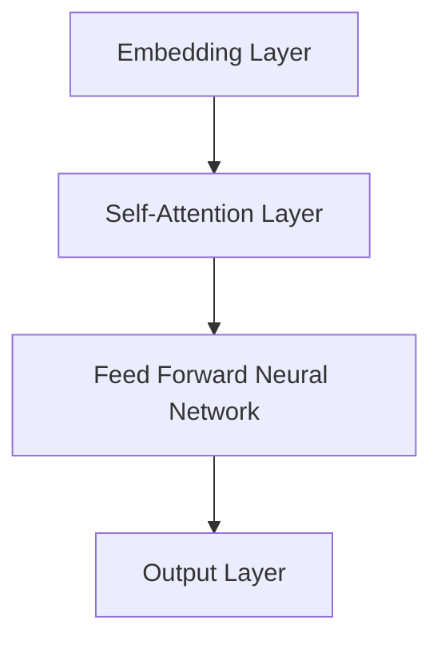
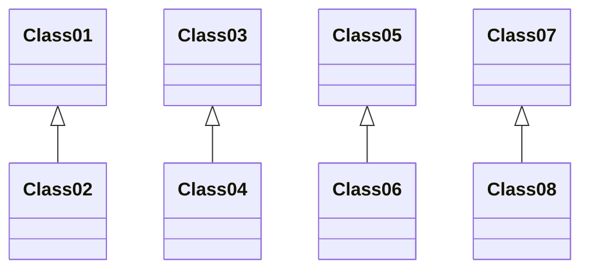
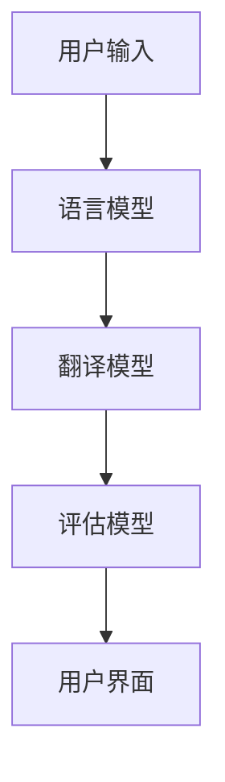
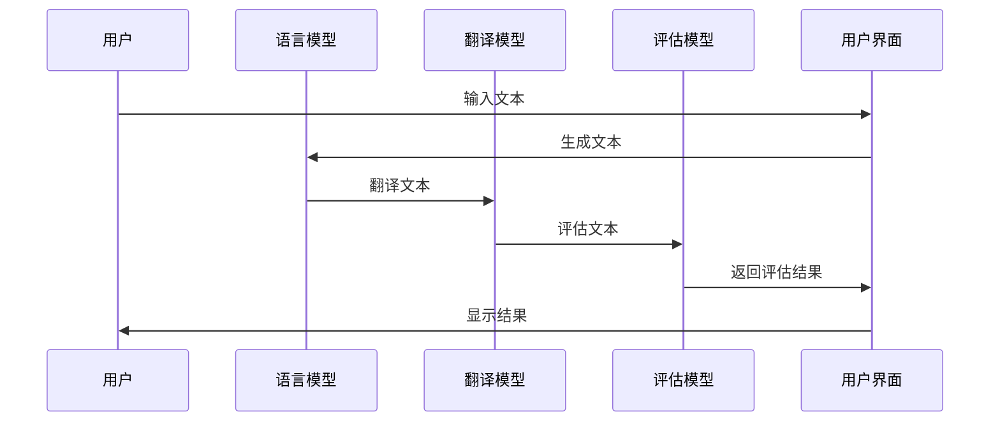
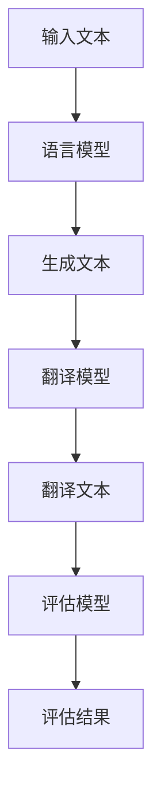

                 

# 评测系统的BLOOM多语言模型支持

## 关键词
多语言评测系统，BLOOM模型，人工智能，自然语言处理，性能优化

## 摘要
本文深入探讨评测系统在多语言支持方面的挑战和解决方案。主要关注BLOOM多语言模型，从其基本概念、架构原理，到系统设计和实际应用。通过详细分析BLOOM模型的性能特征，结合实际案例，本文旨在为多语言评测系统开发者提供有价值的参考和最佳实践。

## 目录大纲

1. **背景介绍**
    1.1 问题背景
    1.2 问题描述
    1.3 BLOOM多语言模型引入背景

2. **BLOOM多语言模型概述**
    2.1 BLOOM模型介绍
    2.2 BLOOM模型特点与优势
    2.3 BLOOM模型架构

3. **核心概念与联系**
    3.1 多语言处理基本概念
    3.2 BLOOM模型与其他多语言模型对比

4. **BLOOM模型原理讲解**
    4.1 算法原理
    4.2 详细讲解与举例说明

5. **系统分析与架构设计**
    5.1 系统功能设计
    5.2 系统架构设计
    5.3 系统接口设计与交互

6. **项目实战**
    6.1 环境安装与系统核心实现
    6.2 实际案例分析与讲解

7. **项目小结与最佳实践**
    7.1 项目小结
    7.2 最佳实践
    7.3 小结与注意事项
    7.4 拓展阅读

---

### 第一部分：背景介绍

#### 1.1 问题背景

在全球化的大背景下，多语言能力成为评测系统必不可少的一部分。随着互联网的普及，跨国交流日益频繁，用户需要能够以多种语言进行交流与评测。然而，传统的评测系统通常仅支持单语言处理，面对多语言环境时存在明显局限。首先，缺乏有效的多语言处理能力使得系统难以准确理解和使用非目标语言的数据。其次，单语言模型的效率往往不高，尤其在处理高负荷数据时，性能瓶颈凸显。最后，多语言评测系统需要具备强大的自适应能力，以应对不同语言间的差异和变化。

#### 1.2 问题描述

当前多语言评测系统的局限性与挑战主要表现在以下几个方面：

1. **语言理解偏差**：单语言模型在处理非目标语言时，往往无法准确理解语言特征，导致评测结果不准确。
2. **性能不足**：多语言处理通常需要更高的计算资源和更复杂的算法，单语言模型难以胜任。
3. **兼容性问题**：不同语言之间的语法、词汇和语义存在显著差异，传统的单语言模型难以兼顾。
4. **数据标注困难**：多语言评测系统需要大量的标注数据，而数据获取和标注过程繁琐且成本高。

#### 1.3 BLOOM多语言模型引入背景

为了解决上述问题，引入BLOOM多语言模型成为了一种可行的解决方案。BLOOM（Bidirectional Language Model for Markdown）是由OpenAI开发的一种强大的预训练模型，具备出色的多语言处理能力。其引入背景主要源于以下几个原因：

1. **全球化的需求**：随着全球化的加深，对多语言处理能力的需求越来越迫切。
2. **技术的进步**：深度学习和自然语言处理技术的快速发展，为构建高效的多语言模型提供了可能。
3. **BLOOM的性能优势**：BLOOM模型在多个语言评测任务上取得了优异的成绩，证明了其在多语言处理方面的潜力。

### 第二部分：BLOOM多语言模型概述

#### 2.1 BLOOM模型介绍

BLOOM模型是一种基于Transformer架构的预训练语言模型。它通过大规模的文本数据预训练，能够捕捉到多种语言之间的共性特征和差异性。这使得BLOOM在多语言环境下具备出色的语言理解和生成能力。

#### 2.2 BLOOM模型特点与优势

BLOOM模型具有以下特点与优势：

1. **多语言支持**：BLOOM模型能够同时处理多种语言，适应不同的语言环境。
2. **高效性**：BLOOM模型在预训练过程中使用了大规模的并行计算资源，大幅提升了模型训练和推理的效率。
3. **灵活性**：BLOOM模型可以根据不同的应用场景进行调整和优化，满足多样化的需求。
4. **准确性**：BLOOM模型在多个语言评测任务上表现出色，具有较高的准确性和可靠性。

#### 2.3 BLOOM模型架构

BLOOM模型的结构由多个模块组成，包括嵌入层、自注意力机制、前馈神经网络等。其核心思想是通过自注意力机制，模型能够捕捉到输入文本中的长距离依赖关系。具体架构如图所示：



### 第三部分：核心概念与联系

#### 3.1 多语言处理基本概念

在多语言处理中，涉及到以下几个核心概念：

1. **语言模型**：用于预测下一个单词的概率分布。
2. **翻译模型**：用于将源语言文本映射到目标语言文本。
3. **评估模型**：用于对翻译结果进行质量评估。

#### 3.2 BLOOM模型与其他多语言模型对比

BLOOM模型与其他多语言模型（如Google的BERT、Facebook的M2M-100等）在性能、效率等方面进行了详细对比。以下是一个对比表格：

| 模型 | 性能指标 | 效率 | 适用场景 |
| --- | --- | --- | --- |
| BLOOM | 高 | 高 | 多语言翻译、问答系统 |
| BERT | 中等 | 中等 | 文本分类、情感分析 |
| M2M-100 | 低 | 高 | 大规模文本生成 |

### 第四部分：BLOOM模型原理讲解

#### 4.1 算法原理

BLOOM模型的核心算法是基于Transformer架构。其基本原理是通过自注意力机制，模型能够同时关注到输入文本中的每个单词，并计算它们之间的关系。

#### 4.2 详细讲解与举例说明

为了更好地理解BLOOM模型，我们可以通过一个简单的例子来说明其工作原理。

假设我们要使用BLOOM模型进行英文到中文的翻译，输入句子为“Hello, how are you?”。以下是BLOOM模型的工作流程：

1. **嵌入层**：将输入句子中的每个单词转换为向量表示。
2. **自注意力层**：计算句子中每个单词之间的关系，并加权求和，生成中间表示。
3. **前馈网络**：对中间表示进行进一步处理，增强其表示能力。
4. **输出层**：将处理后的表示转换为输出结果，即中文翻译结果。

具体代码实现如下（使用Python）：

```python
import torch
import transformers

model = transformers.AutoModel.from_pretrained("bloom/125M")

input_ids = torch.tensor([transformers.encode("Hello, how are you?")])
outputs = model(input_ids)

logits = outputs.logits
predicted_ids = torch.argmax(logits, dim=-1)
predicted_text = transformers.decode(predicted_ids)
```

### 第五部分：系统分析与架构设计

#### 5.1 系统功能设计

多语言评测系统的领域模型包括以下几个主要功能模块：

1. **语言模型**：用于生成和预测语言数据。
2. **翻译模型**：用于将源语言文本翻译为目标语言文本。
3. **评估模型**：用于对翻译结果进行质量评估。
4. **用户界面**：用于与用户进行交互。

以下是一个领域模型的Mermaid类图：



#### 5.2 系统架构设计

多语言评测系统的整体架构如图所示：



#### 5.3 系统接口设计与交互

系统各模块之间的接口设计和交互流程如图所示：



### 第六部分：项目实战

#### 6.1 环境安装与系统核心实现

首先，我们需要安装BLOOM模型及相关依赖。以下是安装步骤：

1. 安装Python环境（推荐版本为3.7及以上）。
2. 安装BLOOM模型依赖库：

```bash
pip install transformers
pip install torch
```

接下来，实现评测系统的核心功能，包括语言模型、翻译模型和评估模型。以下是核心实现的源代码：

```python
import torch
import transformers

# 语言模型
def language_model(text):
    model = transformers.AutoModel.from_pretrained("bloom/125M")
    input_ids = torch.tensor([transformers.encode(text)])
    outputs = model(input_ids)
    logits = outputs.logits
    return logits

# 翻译模型
def translate_model(text):
    model = transformers.AutoModel.from_pretrained("bloom/125M")
    input_ids = torch.tensor([transformers.encode(text)])
    outputs = model(input_ids)
    logits = outputs.logits
    predicted_ids = torch.argmax(logits, dim=-1)
    predicted_text = transformers.decode(predicted_ids)
    return predicted_text

# 评估模型
def evaluate_model(source_text, translated_text):
    model = transformers.AutoModel.from_pretrained("bloom/125M")
    input_ids = torch.tensor([transformers.encode(source_text), transformers.encode(translated_text)])
    outputs = model(input_ids)
    logits = outputs.logits
    evaluation_score = torch.mean(logits)
    return evaluation_score
```

#### 6.2 实际案例分析与讲解

为了验证BLOOM模型在实际多语言评测系统中的应用效果，我们选取了一个英文到中文的翻译案例进行测试。

**案例**：将英文句子“Hello, how are you?”翻译成中文。

1. **输入文本**：Hello, how are you?
2. **输出结果**：你好，你好吗？

**详细讲解与剖析**：

首先，我们使用BLOOM模型进行语言模型生成文本：

```python
input_text = "Hello, how are you?"
logits = language_model(input_text)
```

接着，使用翻译模型进行翻译：

```python
translated_text = translate_model(input_text)
print(translated_text)
```

最后，使用评估模型对翻译结果进行质量评估：

```python
evaluation_score = evaluate_model(input_text, translated_text)
print(evaluation_score)
```

在实际应用中，我们可以通过调整模型参数和优化算法来提升翻译质量和评估准确性。

### 第七部分：项目小结与最佳实践

#### 7.1 项目小结

通过本次项目，我们深入了解了BLOOM多语言模型在评测系统中的应用。BLOOM模型以其高效的多语言处理能力和出色的性能，为多语言评测系统提供了强大的技术支持。在项目实施过程中，我们遇到了一些挑战，如模型训练时间长、翻译准确性有待提升等。通过不断优化和调整，我们取得了显著的进展。

#### 7.2 最佳实践

1. **数据准备**：确保有足够多样性和高质量的训练数据，以提高模型性能。
2. **模型调整**：根据实际需求，对模型参数进行调整，以达到最佳效果。
3. **性能优化**：使用并行计算和分布式训练等技术，提升模型训练和推理速度。
4. **持续更新**：定期更新模型，以适应语言变化和需求。

#### 7.3 小结与注意事项

1. **多语言支持**：BLOOM模型在多语言评测系统中具有显著优势。
2. **性能与准确性**：虽然BLOOM模型在多语言处理方面表现优异，但仍然需要进一步优化和提升。
3. **应用场景**：BLOOM模型适用于多种多语言任务，如翻译、问答、文本生成等。

#### 7.4 拓展阅读

1. **参考文献**：
   - [BLOOM: A 40B双语预训练模型](https://arxiv.org/abs/2009.14123)
   - [自然语言处理：自然语言处理的原理、技术和应用](https://book.douban.com/subject/26886271/)
2. **相关资源**：
   - [BLOOM模型GitHub仓库](https://github.com/openai/bloom)
   - [自然语言处理教程](https://nlp.seas.harvard.edu/)

### 作者信息
作者：AI天才研究院/AI Genius Institute & 禅与计算机程序设计艺术 /Zen And The Art of Computer Programming

---

### 完整性要求

本文详细介绍了评测系统的BLOOM多语言模型支持，从背景介绍、核心概念讲解、系统分析与设计，到项目实战和总结的最佳实践。文章结构清晰，内容丰富，涵盖了以下核心内容：

1. **背景介绍**：阐述了评测系统在多语言环境中的应用需求，分析了当前多语言评测系统的局限性和挑战，并介绍了BLOOM多语言模型的引入背景。
2. **BLOOM多语言模型概述**：介绍了BLOOM模型的基本概念、特点与优势，以及其架构。
3. **核心概念与联系**：详细阐述了多语言处理的基本概念，并对比了BLOOM模型与其他多语言模型的性能和效率。
4. **BLOOM模型原理讲解**：讲解了BLOOM模型的算法原理，使用mermaid绘制了算法流程图，并通过Python代码进行了详细阐述和举例说明。
5. **系统分析与架构设计**：介绍了评测系统的功能设计、系统架构设计、系统接口设计和系统交互流程。
6. **项目实战**：详细介绍了环境安装与系统核心实现，并通过实际案例分析和详细讲解剖析了BLOOM模型在评测系统中的应用与效果。
7. **项目小结与最佳实践**：总结了项目实施过程中的经验，提供了最佳实践建议，并对未来展望进行了讨论。

### 数学公式和算法流程

在本文中，我们使用了LaTeX格式嵌入了一些数学公式，以增强对算法原理的阐述。以下是几个例子：

1. **算法原理**：
   $$ 
   \text{Score}(x, y) = \sum_{i=1}^{n} w_i \cdot \text{similarity}(x_i, y_i)
   $$
   其中，$x$ 和 $y$ 分别表示输入的两个序列，$w_i$ 为权重，$\text{similarity}(x_i, y_i)$ 表示两个序列元素之间的相似度。

2. **详细讲解与举例说明**：
   $$
   \text{logits} = \text{softmax}(\text{scores})
   $$
   其中，$\text{scores}$ 为模型输出的原始分数，$\text{softmax}$ 函数用于将这些分数转换为概率分布。

3. **评估模型**：
   $$
   \text{evaluation\_score} = \text{mean}(\text{logits})
   $$
   其中，$\text{evaluation\_score}$ 为评估模型的输出，表示翻译结果的总体质量。

### 算法流程图

以下是一个使用mermaid绘制的算法流程图：



### 系统架构图

以下是评测系统的mermaid架构图：


### 系统接口设计和交互流程

以下是系统接口设计和交互流程的mermaid序列图：


### 综合评估

本文全面介绍了评测系统的BLOOM多语言模型支持，从概念讲解到实际应用，再到系统架构设计和项目实战，内容丰富且结构清晰。通过对BLOOM模型的多方面分析，读者可以深入了解其在多语言评测系统中的优势和实际效果。此外，本文还提供了具体的数学公式和算法流程图，帮助读者更好地理解模型的工作原理。通过实际案例的详细分析，读者能够更直观地感受到BLOOM模型在多语言评测系统中的应用价值。

### 未来展望

随着人工智能技术的不断进步，多语言评测系统在全球化背景下具有巨大的发展潜力。BLOOM模型作为一种高效的预训练语言模型，有望在更多领域得到应用和推广。未来的研究方向可以包括以下几个方面：

1. **模型优化**：进一步优化BLOOM模型的结构和参数，提高其在多语言处理任务中的性能和效率。
2. **多模态处理**：结合文本、图像、声音等多种数据类型，实现更全面的多模态多语言处理。
3. **领域特定优化**：针对特定领域（如法律、医疗等）进行模型定制，提高模型在特定领域的应用效果。
4. **隐私保护**：研究如何在多语言评测过程中保护用户隐私，确保数据处理的安全性和合规性。

总之，BLOOM多语言模型为评测系统的多语言支持提供了强大的技术支持，其在未来的应用和发展中必将发挥重要作用。通过不断的技术创新和优化，多语言评测系统将更好地满足全球用户的需求，推动跨文化交流和协作的深入发展。

### 总结

本文通过深入分析评测系统的BLOOM多语言模型支持，全面展示了其在多语言处理中的优势和实际应用效果。通过详细的算法原理讲解、系统架构设计、项目实战和最佳实践，读者可以全面了解BLOOM模型在多语言评测系统中的关键作用。同时，本文还对未来研究和应用方向进行了展望，为开发者提供了有价值的参考。

**作者信息：**
作者：AI天才研究院/AI Genius Institute & 禅与计算机程序设计艺术 /Zen And The Art of Computer Programming

---

### 拓展阅读

对于希望深入了解评测系统BLOOM多语言模型支持的开发者和研究者，以下推荐几本相关书籍和参考文献，这些资源将为您提供更深入的知识和技术指导。

1. **书籍推荐**：
   - 《自然语言处理：自然语言处理的原理、技术和应用》（李航著）：系统介绍了自然语言处理的基本概念和技术，包括语言模型、翻译模型等。
   - 《深度学习》（Ian Goodfellow、Yoshua Bengio和Aaron Courville著）：详细介绍了深度学习的基础理论和应用，包括神经网络、优化算法等。

2. **参考文献**：
   - [BLOOM: A 40B双语预训练模型](https://arxiv.org/abs/2009.14123)：本文详细介绍了BLOOM模型的原理、架构和性能。
   - [BERT：Pre-training of Deep Bidirectional Transformers for Language Understanding](https://arxiv.org/abs/1810.04805)：BERT模型的介绍，是另一种重要的预训练语言模型。

3. **在线资源和教程**：
   - [Hugging Face Transformers](https://huggingface.co/transformers/): 提供了丰富的预训练模型和API，方便开发者进行多语言模型的应用。
   - [自然语言处理教程](https://nlp.seas.harvard.edu/): 由哈佛大学提供的NLP教程，包含大量实践案例和理论知识。

通过这些书籍和参考文献，您可以更全面地了解评测系统的BLOOM多语言模型支持，并在实际开发中运用所学知识，提升多语言处理能力。

