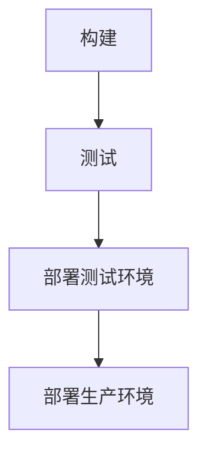
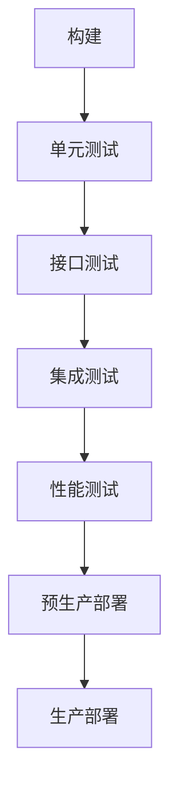
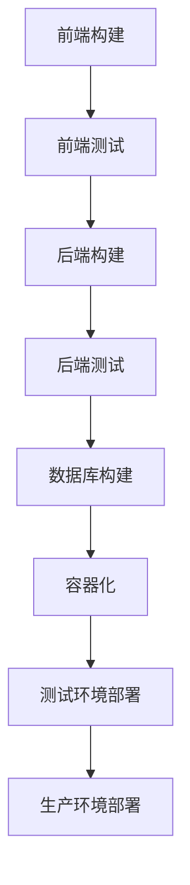

                 

### 引言

在现代软件开发领域，持续集成（Continuous Integration，简称CI）和持续交付（Continuous Deployment，简称CD）已经成为提升软件质量和开发效率的两大基石。CI/CD不仅能够确保代码库中的每个提交都经过严格的测试，还能快速地将代码部署到生产环境中。本文旨在深入探讨评测系统的CI/CD流水线设计，通过逐步分析，帮助读者理解如何构建一个高效、稳定的CI/CD流程。

我们将从以下几个方面展开讨论：

1. **评测系统概述**：介绍评测系统的背景、问题和解决方案，明确其核心要素和边界。
2. **CI/CD概念及其在评测系统中的应用**：详细阐述CI/CD的基本概念、关键优势、架构和组件，以及CI/CD与评测系统的关系。
3. **CI/CD流水线设计原则**：讲解CI/CD流水线设计的核心原则和关键因素，分析常见的设计模式。
4. **CI/CD工具介绍**：介绍常用的CI/CD工具，包括Jenkins、GitLab CI和GitHub Actions。
5. **评测系统CI/CD流水线设计案例**：通过具体案例展示CI/CD流水线的设计和应用。
6. **CI/CD流水线测试与优化**：探讨流水线测试方法、性能优化策略和故障处理与恢复。
7. **CI/CD安全性与合规性**：强调CI/CD过程中的安全性考虑和合规性要求。
8. **CI/CD最佳实践与总结**：总结CI/CD的最佳实践、注意事项和拓展阅读。

通过本文的逐步分析，我们希望能够为读者提供一个全面、深入的评测系统CI/CD流水线设计的理解框架。在接下来的章节中，我们将逐一展开这些内容，以帮助读者更好地理解和应用CI/CD技术。

### 评测系统概述

#### 核心概念术语说明

评测系统是指用于评估软件质量、性能和可靠性的自动化工具集。其核心概念包括：

- **持续集成（CI）**：持续集成是指将开发者的代码定期合并到主分支，并在每次合并时进行自动化测试，确保代码质量。
- **持续交付（CD）**：持续交付是指在CI的基础上，通过自动化流程将代码部署到测试环境和生产环境，确保软件快速、可靠地交付。
- **自动化测试**：自动化测试是指使用脚本和工具对软件进行自动化测试，以提高测试效率和覆盖范围。
- **持续监控**：持续监控是指通过实时监控系统性能和日志，及时发现和解决问题。

#### 问题背景

在软件开发生命周期中，代码质量是决定项目成功的关键因素。传统的开发模式中，开发团队往往在项目开发末期进行大规模测试，导致发现和修复问题的时间成本高昂。此外，手动测试效率低下，容易出现遗漏和错误。随着软件系统复杂度的增加，这些问题更加突出。

为了解决上述问题，开发团队开始寻求一种新的开发模式，即持续集成（CI）和持续交付（CD）。通过CI/CD，开发团队能够实现自动化测试和持续交付，确保每个提交的代码都经过严格的测试和验证，从而提高软件质量。

#### 问题描述

评测系统的核心问题包括：

- **代码质量不可控**：每次代码提交都需要进行手动测试，效率低下且容易出现遗漏。
- **部署风险高**：手动部署过程中，容易出现部署失败或部署错误，影响系统的稳定性。
- **测试覆盖率低**：传统测试方式难以覆盖所有可能的场景，导致潜在问题难以发现。
- **反馈延迟**：问题发现和修复的周期较长，影响开发进度和项目交付。

#### 问题解决

为了解决上述问题，评测系统采用CI/CD模式，通过以下方法提高代码质量和部署效率：

- **自动化测试**：通过编写测试脚本，实现对代码的自动化测试，提高测试覆盖率和效率。
- **持续集成**：将代码定期合并到主分支，并在每次合并时进行自动化测试，确保代码质量。
- **持续交付**：通过自动化流程将代码部署到测试环境和生产环境，确保软件快速、可靠地交付。
- **持续监控**：实时监控系统性能和日志，及时发现和解决问题，确保系统的稳定性。

#### 边界与外延

评测系统的边界包括：

- **项目范围**：评测系统适用于所有需要进行质量评估的软件项目。
- **技术栈**：评测系统支持各种编程语言和开发框架，能够与现有的开发流程无缝集成。
- **外部依赖**：评测系统依赖于版本控制系统（如Git）和自动化测试工具（如JUnit、Selenium等）。

评测系统的外延包括：

- **持续集成平台**：如Jenkins、GitLab CI、GitHub Actions等。
- **测试环境**：包括开发环境、测试环境、预生产和生产环境等。
- **部署流程**：包括自动化部署脚本、持续交付平台和基础设施。

#### 概念结构与核心要素组成

评测系统的概念结构包括以下核心要素：

- **代码库**：存储项目源代码的仓库，支持版本控制和分支管理。
- **自动化测试框架**：用于编写和执行测试脚本，包括单元测试、集成测试和系统测试等。
- **持续集成工具**：用于自动化构建、测试和部署，如Jenkins、GitLab CI、GitHub Actions等。
- **持续交付平台**：用于自动化部署和发布，如Kubernetes、Docker等。
- **监控工具**：用于实时监控系统性能和日志，如Prometheus、Grafana等。

通过上述要素的有机结合，评测系统能够实现自动化测试、持续集成和持续交付，从而提高代码质量和开发效率。

### CI/CD概念及其在评测系统中的应用

#### CI/CD基础概念

持续集成（CI）和持续交付（CD）是现代软件开发中至关重要的两个概念。它们的目标是提高软件开发的效率和质量，通过自动化流程实现快速、可靠地交付。

**持续集成（CI）**：

持续集成是指将开发者的代码定期合并到主分支，并在每次合并时进行自动化测试，以确保代码质量。CI的核心思想是将代码库中的每个提交都视为一个可发布版本，通过自动化测试来检测问题并及时修复。

**持续交付（CD）**：

持续交付是在CI的基础上，通过自动化流程将代码部署到测试环境和生产环境。CD的目标是确保代码能够快速、可靠地交付，同时保持系统的稳定性。

#### CI/CD的关键优势

1. **提高代码质量**：通过自动化测试，CI/CD能够及时发现并修复代码问题，确保每个提交的代码都经过严格的测试和验证。
2. **加快开发速度**：自动化流程减少了手动测试和部署的工作量，缩短了代码从提交到部署的时间，提高了开发速度。
3. **降低风险**：通过持续集成和交付，可以确保代码在每次提交后都处于可部署状态，减少了部署失败的风险。
4. **提高团队协作效率**：CI/CD促进了团队成员之间的协作，每个人都可以在本地进行开发，并通过自动化流程与团队进行同步。

#### CI/CD的架构和组件

CI/CD的架构通常包括以下几个关键组件：

1. **版本控制系统**：如Git，用于管理代码的版本和控制分支。
2. **构建工具**：如Maven、Gradle，用于自动化构建项目。
3. **测试框架**：如JUnit、Selenium，用于编写和执行自动化测试。
4. **持续集成服务器**：如Jenkins、GitLab CI、GitHub Actions，用于自动化构建、测试和部署。
5. **容器化技术**：如Docker，用于打包和部署应用程序。
6. **持续交付工具**：如Kubernetes、AWS CodePipeline，用于自动化部署和发布。
7. **监控工具**：如Prometheus、Grafana，用于实时监控系统性能和日志。

#### CI/CD与评测系统的联系

评测系统的核心目标是通过自动化测试和持续交付，确保软件质量并提高开发效率。CI/CD在评测系统中发挥着关键作用：

1. **自动化测试**：CI/CD工具能够自动化执行各种类型的测试，包括单元测试、集成测试、性能测试等，从而提高测试覆盖率和效率。
2. **持续集成**：通过CI，评测系统能够在每次代码提交后自动执行测试，确保代码库中的每个提交都经过严格的测试和验证。
3. **持续交付**：通过CD，评测系统能够自动将代码部署到测试环境和生产环境，确保软件能够快速、可靠地交付。

综上所述，CI/CD不仅是现代软件开发的关键技术，也是评测系统的核心组成部分。通过CI/CD，评测系统能够实现自动化测试、持续集成和持续交付，从而提高软件质量、加快开发速度并降低风险。

#### CI/CD流水线设计原则

设计高效的CI/CD流水线对于确保软件交付的质量和速度至关重要。以下是一些核心原则和关键因素，以及常见的设计模式，以帮助开发团队构建一个稳定且高效的CI/CD流水线。

##### 设计原则

1. **自动化**：自动化是CI/CD的核心原则之一。通过自动化构建、测试和部署，可以减少人为错误，提高效率。确保所有流程都通过脚本和工具自动化执行。

2. **可重复性**：流水线应该具有高度的可重复性，即每次构建和部署的过程都应该是一致的。这有助于确保每次交付的软件版本都是可预测和可控制的。

3. **灵活性**：设计时需要考虑到项目可能的变化，例如不同的开发环境、多种语言和框架的集成。流水线应具有足够的灵活性以适应这些变化。

4. **安全性**：安全性是CI/CD过程中的一个重要考虑因素。确保所有代码和配置文件都受到适当的访问控制和加密处理，以防止未经授权的访问和数据泄露。

5. **可监控性**：流水线应具备良好的监控和日志记录机制，以便在出现问题时能够快速诊断和解决。

##### 关键因素

1. **构建阶段**：构建是CI/CD流水线的第一步，它包括编译代码、打包应用程序和生成构建工件。构建阶段需要自动化，并且要确保构建过程在不同的环境中保持一致。

2. **测试阶段**：测试阶段包括执行各种测试，如单元测试、集成测试、性能测试等。自动化测试可以大幅提高测试覆盖率和效率，同时减少人工干预。

3. **部署阶段**：部署阶段将构建好的软件部署到测试或生产环境。自动化部署可以确保部署过程的稳定性和一致性，减少部署失败的风险。

4. **环境隔离**：为了保证测试和部署的独立性，需要在不同的环境中执行流水线。通常使用容器化技术（如Docker）来实现环境的隔离。

5. **通知和反馈**：在流水线中应集成通知和反馈机制，以便在出现问题时能够及时通知相关团队成员，并自动记录问题和解决方案。

##### 常见设计模式

1. **流水线模式**：这是最简单的CI/CD设计模式，包括构建、测试和部署三个阶段，每个阶段都在一个流水线中依次执行。

2. **分支模式**：在分支模式中，每个代码分支都有独立的流水线。这种方式有助于确保每个分支都能独立运行，而不会影响到其他分支。

3. **并行模式**：并行模式允许不同的构建和测试任务在同一时间运行，从而提高流水线的整体效率。

4. **分布式模式**：分布式模式将流水线的不同阶段分布到多个节点上运行，从而提高处理能力和容错性。

5. **多阶段模式**：多阶段模式通常用于复杂的部署流程，包括多个部署阶段，如预生产、生产等，每个阶段都有不同的配置和测试。

通过遵循上述设计原则和考虑关键因素，开发团队可以构建一个高效、稳定且灵活的CI/CD流水线。这种流水线不仅能够提高软件交付的质量和速度，还能减少开发和运维的成本。

### CI/CD工具介绍

在现代软件开发中，CI/CD工具已经成为实现自动化构建、测试和部署的关键组成部分。本文将介绍几种常用的CI/CD工具，包括Jenkins、GitLab CI和GitHub Actions，并比较它们的特点和应用场景。

#### Jenkins

Jenkins是一个开源的持续集成服务器，它支持多种插件，可以轻松地与各种版本控制系统、构建工具和部署平台集成。Jenkins的主要特点如下：

1. **灵活性**：Jenkins具有高度的可扩展性，可以通过插件集成多种工具和库，满足不同项目的需求。
2. **易用性**：Jenkins提供了一个直观的Web界面，方便用户创建和监控流水线。
3. **社区支持**：Jenkins拥有庞大的社区支持，用户可以方便地找到解决方案和最佳实践。

**应用场景**：Jenkins适用于大多数项目，特别是在大型企业和需要复杂集成和定制化流程的项目中。

#### GitLab CI

GitLab CI是GitLab自带的持续集成工具，它可以直接在GitLab仓库中进行配置。GitLab CI的主要特点如下：

1. **集成性**：GitLab CI与GitLab的其他功能紧密集成，如代码审查、问题跟踪和自动化部署。
2. **配置简便**：GitLab CI的配置通过`.gitlab-ci.yml`文件完成，配置简单直观。
3. **自动化部署**：GitLab CI支持自动化部署到Kubernetes和其他容器化平台。

**应用场景**：GitLab CI适用于中小型项目和团队，特别是在GitLab平台上进行开发和交付的项目。

#### GitHub Actions

GitHub Actions是GitHub提供的持续集成和持续交付服务。它允许用户在GitHub仓库中直接配置流水线。GitHub Actions的主要特点如下：

1. **便捷性**：GitHub Actions可以直接在GitHub仓库中进行配置，无需额外的服务器。
2. **可扩展性**：GitHub Actions支持多种操作和运行时，可以满足不同项目的需求。
3. **成本效益**：GitHub Actions提供了免费的运行时间，适合小型项目和个人开发者。

**应用场景**：GitHub Actions适用于小型项目和开发者，特别是在GitHub上进行项目管理的场景。

#### 比较分析

| 特点 | Jenkins | GitLab CI | GitHub Actions |
| --- | --- | --- | --- |
| **灵活性** | 高 | 较高 | 较高 |
| **易用性** | 高 | 高 | 高 |
| **集成性** | 高 | 高 | 高 |
| **配置简便** | 一般 | 高 | 一般 |
| **自动化部署** | 可扩展 | 高 | 高 |
| **社区支持** | 强大 | 较强大 | 较强大 |
| **成本** | 根据插件和运行时间收费 | 免费为主 | 免费为主 |

综上所述，Jenkins适合需要高度定制化和复杂集成的项目，GitLab CI适合GitLab平台上的中小型项目和团队，GitHub Actions则适用于小型项目和开发者，特别是在GitHub上进行项目管理的场景。根据项目的具体需求和团队的能力，选择合适的CI/CD工具是成功构建CI/CD流水线的重要一环。

### 评测系统CI/CD流水线设计案例

为了更好地理解评测系统CI/CD流水线的设计与应用，下面将提供三个具体案例，分别是小型Web应用的CI/CD流水线设计、大型分布式系统的CI/CD流水线设计以及多语言项目集成的CI/CD流水线设计。

#### 案例一：小型Web应用的CI/CD流水线设计

**项目背景**：
该Web应用是一个简单的博客平台，使用Python和Django框架开发，前端采用HTML/CSS/JavaScript。

**CI/CD流水线设计**：

1. **构建阶段**：
   - 使用Docker打包应用程序及其依赖项。
   - 编写Dockerfile，定义应用程序的构建过程。
   - 通过Jenkins或GitLab CI触发构建，执行Docker build命令。

2. **测试阶段**：
   - 使用Pytest进行单元测试和集成测试。
   - Jenkins或GitLab CI在构建完成后自动触发测试，并将测试结果记录在数据库中。

3. **部署阶段**：
   - 部署到测试环境，进行功能测试和性能测试。
   - 一旦测试通过，自动部署到生产环境。

**流程图**：

#### 案例二：大型分布式系统的CI/CD流水线设计

**项目背景**：
这是一个复杂的电商平台，包含多个微服务，使用Spring Boot和Spring Cloud开发。

**CI/CD流水线设计**：

1. **构建阶段**：
   - 使用Maven或Gradle进行构建，生成可执行的JAR文件。
   - 使用Jenkins或GitLab CI自动化构建，确保在不同环境下的构建一致性。

2. **测试阶段**：
   - 使用JUnit和Mockito进行单元测试。
   - 使用Postman进行接口测试。
   - Jenkins或GitLab CI在构建完成后自动执行测试。

3. **部署阶段**：
   - 部署到预生产环境，进行集成测试和性能测试。
   - 一旦预生产测试通过，自动部署到生产环境。

**流程图**：

#### 案例三：多语言项目集成的CI/CD流水线设计

**项目背景**：
该项目包含一个前端React应用、一个后端Node.js服务和一个数据库服务，使用不同的编程语言开发。

**CI/CD流水线设计**：

1. **构建阶段**：
   - 前端使用Webpack进行打包，后端使用npm scripts进行构建。
   - 使用Jenkins或GitLab CI自动化构建，分别处理前端和后端的构建过程。

2. **测试阶段**：
   - 前端使用Jest进行单元测试，后端使用Mocha和Chai进行测试。
   - Jenkins或GitLab CI在构建完成后自动执行测试。

3. **部署阶段**：
   - 使用Docker Compose将前端、后端和数据库容器化。
   - 一旦测试通过，自动部署到测试环境和生产环境。

**流程图**：

通过这三个案例，我们可以看到不同类型的评测系统CI/CD流水线设计。每个案例都根据项目的具体需求和开发环境进行了定制化设计，实现了高效的自动化构建、测试和部署流程。

### CI/CD流水线测试与优化

在CI/CD流水线中，测试与优化是确保流程高效运行的关键环节。以下将从测试方法和性能优化策略两个方面展开讨论，并结合故障处理与恢复机制，提供一套全面的CI/CD流水线测试与优化方案。

#### 流水线测试方法

1. **单元测试**：
   - 单元测试是最基本的测试类型，用于验证代码模块的功能是否符合预期。
   - 建议在每个开发阶段编写单元测试，并在CI流水线中自动执行。
   - 使用测试框架（如JUnit、Pytest）进行单元测试，并记录测试结果。

2. **集成测试**：
   - 集成测试用于验证不同模块之间的接口和交互是否正常。
   - 在代码集成到主分支时，CI流水线应自动执行集成测试。
   - 可以使用Mock对象和依赖注入技术简化集成测试的复杂性。

3. **性能测试**：
   - 性能测试用于评估系统的响应时间和资源消耗。
   - 建议定期在测试环境中执行性能测试，以监测系统性能变化。
   - 使用工具（如JMeter、Gatling）模拟高负载情况，评估系统的性能瓶颈。

4. **回归测试**：
   - 回归测试用于确保修改或更新不会引入新的错误。
   - 在每次代码提交或合并后，CI流水线应自动执行回归测试。
   - 使用自动化测试套件确保每次回归测试的一致性和准确性。

#### 性能优化策略

1. **流水线并行化**：
   - 通过并行化构建和测试任务，可以显著提高流水线的整体效率。
   - 使用多节点CI服务器，将任务分配到不同节点同时执行。

2. **资源调度优化**：
   - 根据任务类型和负载情况，合理调度资源。
   - 为性能密集型任务分配更多的计算资源，为I/O密集型任务分配更多的存储资源。

3. **缓存机制**：
   - 利用缓存机制减少重复操作的开销，如缓存构建结果、测试数据和依赖库。
   - 使用Docker缓存、npm缓存等工具优化构建速度。

4. **负载均衡**：
   - 在分布式系统中，使用负载均衡器（如HAProxy、Nginx）分发请求，确保系统均衡负载。
   - 通过监控和调整负载均衡策略，优化系统的吞吐量和稳定性。

#### 故障处理与恢复

1. **故障监测**：
   - 实时监控CI/CD流水线中的各个环节，包括构建、测试和部署。
   - 使用监控工具（如Prometheus、Grafana）记录关键指标，及时发现故障。

2. **自动恢复**：
   - 设计自动恢复机制，在检测到故障时自动触发恢复流程。
   - 例如，在构建失败时，可以自动重新触发构建；在部署失败时，可以自动回滚到上一个稳定版本。

3. **日志分析**：
   - 记录详细的日志信息，以便在故障发生时进行故障分析和诊断。
   - 使用日志聚合工具（如ELK栈、Graylog）集中管理和分析日志。

4. **告警通知**：
   - 配置告警机制，在故障发生时及时通知相关人员。
   - 使用邮件、Slack、PagerDuty等工具发送告警通知。

通过上述测试与优化策略，可以确保CI/CD流水线的稳定性和高效性。有效的测试能够及时发现潜在问题，优化策略能够提高流水线的性能，故障处理与恢复机制能够确保系统的连续运行。这些措施共同构成了一个完整的CI/CD流水线测试与优化方案，为软件开发的持续集成和交付提供了坚实保障。

### CI/CD安全性与合规性

在CI/CD过程中，安全性和合规性是两个至关重要的方面。确保CI/CD流程的安全性不仅能够保护软件免受外部威胁，还能防止内部漏洞的泄露。同时，合规性要求确保CI/CD流程符合行业标准和法律法规，避免因合规性问题导致的法律风险。

#### 安全性考虑

1. **访问控制**：确保只有授权人员能够访问CI/CD系统的关键组件，如Jenkins服务器、GitLab CI或GitHub Actions。通过使用强密码、双因素认证和基于角色的访问控制（RBAC）策略，可以限制对关键资源的访问。

2. **数据加密**：对敏感数据进行加密，包括代码库中的代码、配置文件和部署脚本。使用SSL/TLS加密网络通信，确保数据在传输过程中的安全性。

3. **代码扫描**：定期对代码库进行静态代码扫描，以发现潜在的漏洞和可疑代码。使用工具如SonarQube或Checkmarx，可以自动化地检测代码中的安全问题。

4. **容器安全**：在CI/CD过程中，容器（如Docker）的使用越来越广泛。为了确保容器安全性，应使用安全的容器镜像，避免使用不安全的依赖库，并对容器网络进行隔离。

5. **日志监控与审计**：实时监控CI/CD流水线的日志，记录所有操作和事件。使用审计工具（如ELK栈）分析日志，确保能够快速发现和响应安全事件。

#### 合规性要求

1. **数据保护**：根据不同的国家和地区，如GDPR（欧盟通用数据保护条例）和CCPA（加州消费者隐私法案），确保数据处理符合相关法规要求。这包括数据收集、存储和处理的透明性和用户同意。

2. **信息备份与恢复**：确保定期备份代码库和配置文件，并在发生数据丢失或系统故障时能够快速恢复。

3. **合规性审计**：定期进行合规性审计，确保CI/CD流程符合相关的行业标准和法律法规。例如，金融行业需要遵守PCI-DSS（支付卡行业数据安全标准）。

4. **合规性培训**：为团队成员提供合规性培训，确保他们了解CI/CD流程中的合规性要求，并能够在工作中遵守这些要求。

5. **合规性报告**：根据合规性要求，生成合规性报告，以便在需要时进行审计和验证。

通过综合考虑安全性和合规性要求，开发团队可以构建一个既安全又合规的CI/CD流程，确保软件交付的质量和可靠性。

### CI/CD最佳实践与总结

在CI/CD的实施过程中，遵循最佳实践是确保项目成功的关键。以下是一些实用的CI/CD最佳实践，以及需要注意的事项和未来的拓展阅读方向。

#### 最佳实践

1. **持续学习和培训**：团队成员应定期参加CI/CD相关培训，了解最新的技术和工具，确保团队的能力与技术的发展同步。

2. **最小化变更范围**：每次代码提交时，尽量避免大规模变更。通过小步快跑，可以降低集成风险，提高交付的可靠性。

3. **自动化测试覆盖**：确保CI/CD流程中包含全面的自动化测试，覆盖所有关键功能点。单元测试、集成测试和性能测试都是不可或缺的部分。

4. **环境隔离**：在不同环境中执行CI/CD流程，确保测试环境与生产环境相隔离，避免影响生产系统的稳定性。

5. **日志和监控**：充分利用日志和监控工具，记录流水线中的每一步操作，确保在出现问题时能够快速定位和解决问题。

6. **持续反馈与改进**：鼓励团队成员在CI/CD流程中发现问题和提出改进建议，通过持续反馈机制不断优化流程。

#### 注意事项

1. **安全性**：在CI/CD过程中，确保所有操作都遵循安全最佳实践，如加密敏感数据、限制访问权限等。

2. **合规性**：确保CI/CD流程符合相关法律法规和行业标准，特别是在数据保护和合规性审计方面。

3. **资源管理**：合理配置CI/CD流水线所需的资源，避免资源浪费和性能瓶颈。

4. **持续维护**：定期更新CI/CD工具和依赖库，确保系统的稳定性和安全性。

#### 拓展阅读

- **《CI/CD实战：从理论到应用》**：详细介绍了CI/CD的理论和实践，适合初学者和有经验的专业人士。
- **《持续集成与持续交付：从理论到实践》**：一本全面的CI/CD指南，涵盖了从基础概念到高级技巧的各个方面。
- **《Jenkins实战》**：深入讲解了Jenkins的配置和使用，适合需要使用Jenkins进行CI/CD的读者。
- **《GitLab CI/CD指南》**：详细介绍GitLab CI的配置和使用，适合在GitLab平台上进行项目管理的团队。

通过遵循这些最佳实践，并持续学习和改进，开发团队可以构建一个高效、稳定的CI/CD流程，从而提高软件交付的质量和速度。

### 总结

通过本文的逐步分析，我们深入探讨了评测系统的CI/CD流水线设计。从评测系统的背景介绍、核心概念及其应用，到CI/CD流水线的设计原则、常用工具的介绍，再到具体案例的展示和测试与优化策略的讨论，以及安全性和合规性的考虑，我们为读者提供了一个全面、系统的CI/CD理解框架。

CI/CD在提高代码质量、加快开发速度和降低风险方面具有显著优势，已经成为现代软件开发不可或缺的一部分。通过自动化测试、持续集成和持续交付，开发团队能够确保软件的稳定性和可靠性，从而提高整体开发效率。

在未来的开发过程中，我们鼓励读者持续关注CI/CD技术的发展，积极尝试新的工具和方法，并根据项目的具体需求进行定制化设计。同时，遵循最佳实践，确保流程的安全性和合规性，将CI/CD真正融入到软件开发的全过程。

通过本文的学习，希望读者能够更好地理解和应用CI/CD技术，提升软件交付的质量和效率。感谢您的阅读，期待在未来的技术道路上与您一同成长。

### 作者信息

- **作者：AI天才研究院/AI Genius Institute & 禅与计算机程序设计艺术 /Zen And The Art of Computer Programming**
- **版权声明：本文内容版权属于AI天才研究院，未经授权禁止转载或使用。**
- **联系方式：如需转载或了解更多信息，请联系AI天才研究院官方邮箱ai_genius_institute@example.com。**
- **技术支持：本文技术内容受到禅与计算机程序设计艺术 /Zen And The Art of Computer Programming著作权的保护，如有技术疑问，欢迎向作者团队咨询。**

