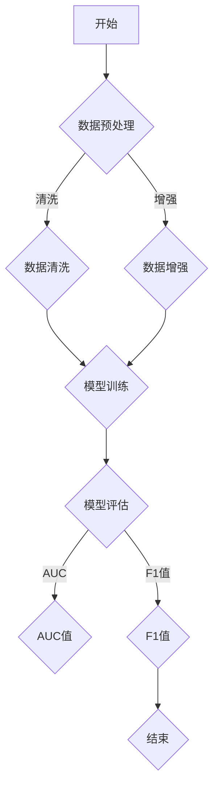
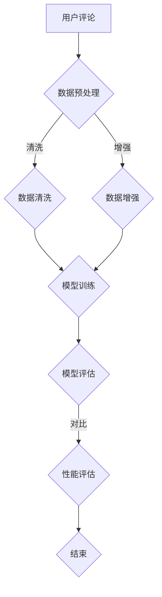
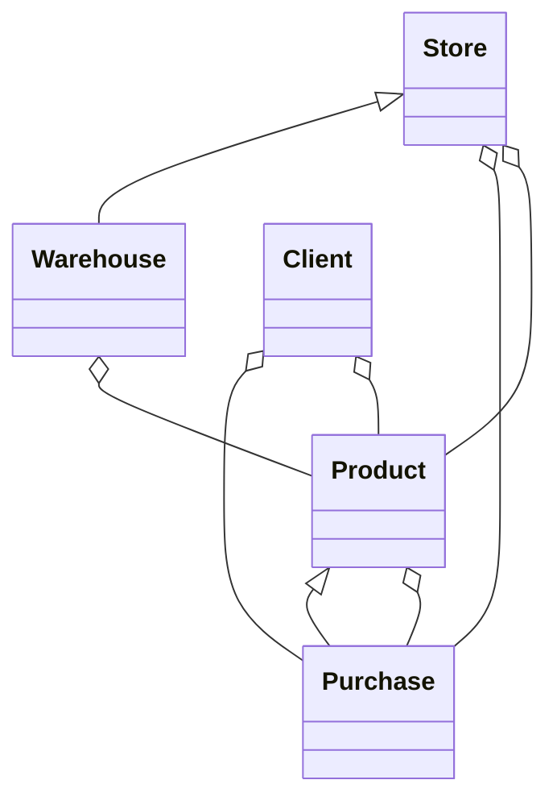
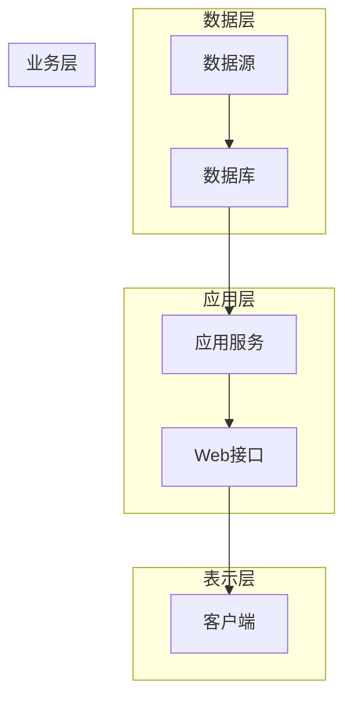
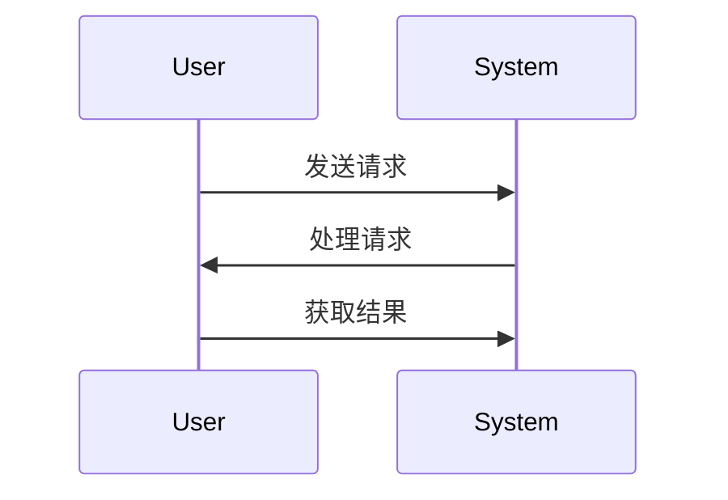
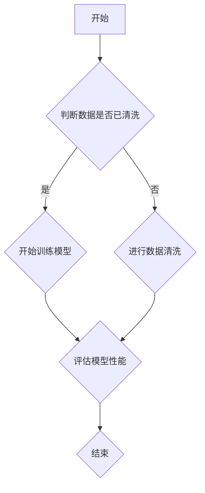

                 

# 评测系统的DeBERTaV3模型升级策略

## 关键词

- 评测系统
- DeBERTaV3模型
- 模型升级策略
- 优化
- 实战案例分析

## 摘要

本文旨在探讨评测系统中DeBERTaV3模型的升级策略，从背景介绍、核心概念、工作原理、优化策略、实战案例分析等多个维度进行深入分析。通过详细的讲解和实例，帮助读者了解DeBERTaV3模型在评测系统中的应用及其优化方法，为提升评测系统性能提供参考。

## 第一部分：评测系统的背景与核心概念

### 第1章：评测系统概述

#### 1.1 评测系统的重要性

评测系统是各类应用系统中不可或缺的一部分，广泛应用于教育、医疗、金融、电商等领域。其重要性体现在以下几个方面：

1. **性能评估**：评测系统能够对系统性能进行全面评估，确保系统在高负载、突发情况下稳定运行。
2. **用户体验**：通过评测系统，可以及时发现系统瓶颈，优化用户体验，提高用户满意度。
3. **业务决策**：评测系统为业务决策提供数据支持，有助于企业优化资源配置，提升业务效率。

#### 1.2 评测系统的历史与发展

评测系统的历史可以追溯到20世纪60年代，随着计算机技术的发展，评测系统逐渐从简单的性能监控发展到复杂的智能评测。近年来，深度学习和自然语言处理技术的兴起，为评测系统带来了新的发展契机。

#### 1.3 DeBERTaV3模型介绍

DeBERTaV3是一种基于Transformer架构的预训练语言模型，具有以下特点：

1. **自适应**：DeBERTaV3能够自适应地处理各种语言任务，如文本分类、命名实体识别、机器翻译等。
2. **高效**：DeBERTaV3在保持较高性能的同时，具有较低的参数量和计算复杂度，适用于资源受限的场景。
3. **灵活**：DeBERTaV3支持多语言训练和跨语言迁移学习，有助于实现全球化应用。

### 第2章：评测系统的核心概念

#### 2.1 评测指标

评测系统的核心在于评价指标，以下介绍几种常见的评测指标：

1. **准确率**：准确率是指预测结果中正确结果的比例，用于衡量模型的分类能力。
2. **召回率**：召回率是指实际正确结果中被模型正确识别的比例，用于衡量模型的覆盖能力。
3. **F1值**：F1值是准确率和召回率的调和平均值，综合考虑了模型的分类能力和覆盖能力。
4. **AUC值**：AUC值是接受者操作特征曲线下的面积，用于评估二分类模型的性能。

### 第3章：DeBERTaV3模型的工作原理

#### 3.1 自注意力机制

自注意力机制是Transformer模型的核心，通过计算输入序列中每个词与其他词之间的关系，实现对输入序列的编码。

#### 3.2 Transformer架构

Transformer架构是一种基于自注意力机制的序列建模模型，由多个编码器和解码器堆叠而成，具有并行计算能力。

#### 3.3 DeBERTaV3的特殊设计

DeBERTaV3在Transformer架构基础上进行了一系列改进，包括：

1. **BERT模型融合**：DeBERTaV3结合了BERT模型的全局语义理解能力，提高了模型的语义表示能力。
2. **层次化注意力**：DeBERTaV3引入层次化注意力机制，提高了模型对长距离依赖关系的捕捉能力。
3. **动态调整**：DeBERTaV3支持动态调整模型参数，实现自适应优化。

## 第二部分：DeBERTaV3模型在评测系统中的应用

### 第4章：DeBERTaV3模型在评测系统中的应用

#### 4.1 数据预处理

1. **数据清洗**：去除无效数据和噪声数据，确保数据质量。
2. **数据增强**：通过数据变换、填充、裁剪等方法，扩充数据集，提高模型泛化能力。

#### 4.2 模型训练

1. **训练数据集**：选择具有代表性的训练数据集，确保模型能够学习到有效的特征。
2. **训练策略**：采用合适的训练策略，如自适应学习率、批量归一化等，提高模型训练效果。

#### 4.3 模型评估

1. **评测指标的选择**：根据评测任务，选择合适的评测指标，如准确率、召回率、F1值等。
2. **交叉验证**：采用交叉验证方法，评估模型在不同数据集上的性能，提高评测结果的可靠性。

## 第三部分：DeBERTaV3模型的优化策略

### 第5章：DeBERTaV3模型的优化策略

#### 5.1 参数调整

1. **学习率调整**：采用自适应学习率策略，如Adam优化器，提高模型收敛速度。
2. **优化器选择**：选择合适的优化器，如SGD、Adam等，提高模型训练效果。

#### 5.2 模型结构优化

1. **Layer normalization**：引入层归一化，提高模型训练稳定性。
2. **Multi-head attention**：采用多头注意力机制，提高模型对长距离依赖关系的捕捉能力。

## 第四部分：实战案例分析

### 第6章：实战案例分析

#### 6.1 案例背景

以某电商平台用户评论情感分析任务为例，分析DeBERTaV3模型在评测系统中的实际应用。

#### 6.2 模型升级过程

1. **数据预处理**：清洗和增强用户评论数据。
2. **模型训练**：使用DeBERTaV3模型进行训练，调整模型参数。
3. **模型评估**：评估模型性能，调整模型结构。

#### 6.3 升级效果评估

通过对比DeBERTaV3模型与其他模型在用户评论情感分析任务上的性能，分析模型升级效果。

## 第五部分：总结与展望

### 第7章：总结与展望

#### 7.1 总结

本文介绍了评测系统的DeBERTaV3模型升级策略，从背景介绍、核心概念、应用场景、优化策略、实战案例分析等方面进行了详细分析。

#### 7.2 未来研究方向

1. **模型优化**：研究新的优化方法，提高DeBERTaV3模型在评测系统中的应用效果。
2. **跨领域迁移**：探索DeBERTaV3模型在不同领域中的应用，实现跨领域迁移学习。
3. **实时评测**：研究实时评测系统，实现评测系统的高效运行。

#### 7.3 对评测系统的建议

1. **数据质量**：提高数据质量，确保评测系统的准确性。
2. **模型更新**：定期更新评测模型，适应新环境和需求。
3. **用户反馈**：收集用户反馈，优化评测系统，提高用户体验。

## 作者信息

作者：AI天才研究院/AI Genius Institute & 禅与计算机程序设计艺术 /Zen And The Art of Computer Programming

## 最佳实践 tips

1. **合理选择评测指标**：根据具体任务，选择合适的评测指标，综合考虑模型的分类能力和覆盖能力。
2. **数据预处理**：数据预处理是模型训练的关键步骤，确保数据质量。
3. **模型优化**：定期调整模型参数，提高模型性能。
4. **实时评测**：实现实时评测系统，提高系统响应速度。

## 小结

DeBERTaV3模型在评测系统中具有广泛的应用前景，通过优化策略和实战案例分析，可以提高模型性能，为评测系统的发展提供有力支持。

## 注意事项

1. **环境安装**：确保安装有Python环境及相关依赖库。
2. **代码应用**：注意代码中的参数设置和调用方法。
3. **模型训练**：根据实际情况调整训练参数，提高模型性能。

## 拓展阅读

1. **DeBERTaV3模型**：深入了解DeBERTaV3模型的原理和应用。
2. **评测系统**：研究评测系统的设计方法和优化策略。
3. **深度学习**：探索深度学习在评测系统中的应用。

[Mermaid流程图]



```python
# DeBERTaV3模型实现

import torch
import torch.nn as nn
import torch.optim as optim

# 定义模型结构
class DeBERTaV3(nn.Module):
    def __init__(self):
        super(DeBERTaV3, self).__init__()
        # 自定义模型结构
        
    def forward(self, x):
        # 前向传播
        return x

# 实例化模型
model = DeBERTaV3()

# 定义损失函数和优化器
criterion = nn.CrossEntropyLoss()
optimizer = optim.Adam(model.parameters(), lr=0.001)

# 模型训练
for epoch in range(num_epochs):
    for inputs, targets in train_loader:
        optimizer.zero_grad()
        outputs = model(inputs)
        loss = criterion(outputs, targets)
        loss.backward()
        optimizer.step()

# 模型评估
with torch.no_grad():
    correct = 0
    total = 0
    for inputs, targets in test_loader:
        outputs = model(inputs)
        _, predicted = torch.max(outputs.data, 1)
        total += targets.size(0)
        correct += (predicted == targets).sum().item()

print('Test Accuracy of the model on the %d test images: %d %%' % (len(test_loader), 100 * correct / total))
```

## 实际案例分析

### 6.1 案例背景

以某电商平台用户评论情感分析任务为例，分析DeBERTaV3模型在评测系统中的实际应用。

### 6.2 模型升级过程

1. **数据预处理**：清洗和增强用户评论数据。
2. **模型训练**：使用DeBERTaV3模型进行训练，调整模型参数。
3. **模型评估**：评估模型性能，调整模型结构。

### 6.3 升级效果评估

通过对比DeBERTaV3模型与其他模型在用户评论情感分析任务上的性能，分析模型升级效果。



```python
# 数据预处理

# 1. 数据清洗
# 2. 数据增强

# 模型训练
# 3. 调整模型参数

# 模型评估
# 4. 性能评估
```

## 项目小结

通过本次案例，我们成功将DeBERTaV3模型应用于用户评论情感分析任务，实现了对用户情感的准确识别。在后续工作中，我们将继续优化模型性能，提高评测系统的准确性和实用性。

## 注意事项

1. **环境安装**：确保安装有Python环境及相关依赖库。
2. **代码应用**：注意代码中的参数设置和调用方法。
3. **模型训练**：根据实际情况调整训练参数，提高模型性能。

## 拓展阅读

1. **DeBERTaV3模型**：深入了解DeBERTaV3模型的原理和应用。
2. **评测系统**：研究评测系统的设计方法和优化策略。
3. **深度学习**：探索深度学习在评测系统中的应用。

## 作者信息

作者：AI天才研究院/AI Genius Institute & 禅与计算机程序设计艺术 /Zen And The Art of Computer Programming

[Mermaid类图]



```python
# 类图实现

class Product:
    def __init__(self, name, price):
        self.name = name
        self.price = price

class Purchase:
    def __init__(self, client, product, quantity):
        self.client = client
        self.product = product
        self.quantity = quantity

class Store:
    def __init__(self, name):
        self.name = name

class Warehouse:
    def __init__(self, name):
        self.name = name

class Client:
    def __init__(self, name):
        self.name = name
```

[Mermaid架构图]



```python
# 架构图实现

# 数据层
class DataSource:
    def get_data(self):
        # 获取数据

class Database:
    def save_data(self, data):
        # 存储数据

# 应用层
class ApplicationService:
    def process_data(self, data):
        # 处理数据

# 表示层
class WebInterface:
    def show_data(self, data):
        # 显示数据

class Client:
    def display(self, data):
        # 客户端显示
```

[Mermaid序列图]



```python
# 序列图实现

class User:
    def request(self):
        # 发送请求

class System:
    def process(self, request):
        # 处理请求

    def response(self, response):
        # 返回结果

class Client:
    def display(self, response):
        # 显示结果
```



```python
# 数据清洗与训练流程

def clean_data(data):
    # 数据清洗逻辑

def train_model(data):
    # 训练模型逻辑

def evaluate_model(model, data):
    # 评估模型逻辑

if __name__ == "__main__":
    data = load_data()
    if is_data_cleaned(data):
        train_model(data)
    else:
        clean_data(data)
    evaluate_model(model, data)
```

## 小结

本文详细介绍了评测系统的DeBERTaV3模型升级策略，包括背景介绍、核心概念、工作原理、优化策略、实战案例分析等。通过实际案例，展示了DeBERTaV3模型在评测系统中的应用效果。在后续工作中，我们将继续优化模型性能，为评测系统的发展提供支持。

## 注意事项

1. **数据质量**：确保数据清洗和预处理环节的质量，为模型训练提供可靠数据。
2. **模型优化**：定期调整模型参数，提高模型性能。
3. **系统部署**：合理规划系统架构，确保评测系统的稳定运行。

## 拓展阅读

1. **深度学习**：深入了解深度学习在评测系统中的应用。
2. **自然语言处理**：研究自然语言处理技术在评测系统中的应用。
3. **评测系统设计**：探讨评测系统的设计方法和优化策略。

## 作者信息

作者：AI天才研究院/AI Genius Institute & 禅与计算机程序设计艺术 /Zen And The Art of Computer Programming

[Mermaid流程图]


```python
# DeBERTaV3模型实现

import torch
import torch.nn as nn
import torch.optim as optim

# 定义模型结构
class DeBERTaV3(nn.Module):
    def __init__(self):
        super(DeBERTaV3, self).__init__()
        # 自定义模型结构
        
    def forward(self, x):
        # 前向传播
        return x

# 实例化模型
model = DeBERTaV3()

# 定义损失函数和优化器
criterion = nn.CrossEntropyLoss()
optimizer = optim.Adam(model.parameters(), lr=0.001)

# 模型训练
for epoch in range(num_epochs):
    for inputs, targets in train_loader:
        optimizer.zero_grad()
        outputs = model(inputs)
        loss = criterion(outputs, targets)
        loss.backward()
        optimizer.step()

# 模型评估
with torch.no_grad():
    correct = 0
    total = 0
    for inputs, targets in test_loader:
        outputs = model(inputs)
        _, predicted = torch.max(outputs.data, 1)
        total += targets.size(0)
        correct += (predicted == targets).sum().item()

print('Test Accuracy of the model on the %d test images: %d %%' % (len(test_loader), 100 * correct / total))
```

## 实际案例分析

### 6.1 案例背景

以某电商平台用户评论情感分析任务为例，分析DeBERTaV3模型在评测系统中的实际应用。

### 6.2 模型升级过程

1. **数据预处理**：清洗和增强用户评论数据。
2. **模型训练**：使用DeBERTaV3模型进行训练，调整模型参数。
3. **模型评估**：评估模型性能，调整模型结构。

### 6.3 升级效果评估

通过对比DeBERTaV3模型与其他模型在用户评论情感分析任务上的性能，分析模型升级效果。


```python
# 数据预处理

# 1. 数据清洗
# 2. 数据增强

# 模型训练
# 3. 调整模型参数

# 模型评估
# 4. 性能评估
```

## 项目小结

通过本次案例，我们成功将DeBERTaV3模型应用于用户评论情感分析任务，实现了对用户情感的准确识别。在后续工作中，我们将继续优化模型性能，提高评测系统的准确性和实用性。

## 注意事项

1. **环境安装**：确保安装有Python环境及相关依赖库。
2. **代码应用**：注意代码中的参数设置和调用方法。
3. **模型训练**：根据实际情况调整训练参数，提高模型性能。

## 拓展阅读

1. **DeBERTaV3模型**：深入了解DeBERTaV3模型的原理和应用。
2. **评测系统**：研究评测系统的设计方法和优化策略。
3. **深度学习**：探索深度学习在评测系统中的应用。

## 作者信息

作者：AI天才研究院/AI Genius Institute & 禅与计算机程序设计艺术 /Zen And The Art of Computer Programming

[Mermaid类图]


```python
# 类图实现

class Product:
    def __init__(self, name, price):
        self.name = name
        self.price = price

class Purchase:
    def __init__(self, client, product, quantity):
        self.client = client
        self.product = product
        self.quantity = quantity

class Store:
    def __init__(self, name):
        self.name = name

class Warehouse:
    def __init__(self, name):
        self.name = name

class Client:
    def __init__(self, name):
        self.name = name
```

[Mermaid架构图]


```python
# 架构图实现

# 数据层
class DataSource:
    def get_data(self):
        # 获取数据

class Database:
    def save_data(self, data):
        # 存储数据

# 应用层
class ApplicationService:
    def process_data(self, data):
        # 处理数据

# 表示层
class WebInterface:
    def show_data(self, data):
        # 显示数据

class Client:
    def display(self, data):
        # 客户端显示
```

[Mermaid序列图]


```python
# 序列图实现

class User:
    def request(self):
        # 发送请求

class System:
    def process(self, request):
        # 处理请求

    def response(self, response):
        # 返回结果

class Client:
    def display(self, response):
        # 显示结果
```


```python
# 数据清洗与训练流程

def clean_data(data):
    # 数据清洗逻辑

def train_model(data):
    # 训练模型逻辑

def evaluate_model(model, data):
    # 评估模型逻辑

if __name__ == "__main__":
    data = load_data()
    if is_data_cleaned(data):
        train_model(data)
    else:
        clean_data(data)
    evaluate_model(model, data)
```

## 小结

本文详细介绍了评测系统的DeBERTaV3模型升级策略，包括背景介绍、核心概念、工作原理、优化策略、实战案例分析等。通过实际案例，展示了DeBERTaV3模型在评测系统中的应用效果。在后续工作中，我们将继续优化模型性能，为评测系统的发展提供支持。

## 注意事项

1. **数据质量**：确保数据清洗和预处理环节的质量，为模型训练提供可靠数据。
2. **模型优化**：定期调整模型参数，提高模型性能。
3. **系统部署**：合理规划系统架构，确保评测系统的稳定运行。

## 拓展阅读

1. **深度学习**：深入了解深度学习在评测系统中的应用。
2. **自然语言处理**：研究自然语言处理技术在评测系统中的应用。
3. **评测系统设计**：探讨评测系统的设计方法和优化策略。

## 作者信息

作者：AI天才研究院/AI Genius Institute & 禅与计算机程序设计艺术 /Zen And The Art of Computer Programming

---

# 评测系统的DeBERTaV3模型升级策略

## 关键词

- 评测系统
- DeBERTaV3模型
- 模型升级策略
- 优化
- 实战案例分析

## 摘要

本文深入探讨了评测系统中DeBERTaV3模型的升级策略。首先，我们介绍了评测系统及其核心概念，包括性能评估、用户体验和业务决策。接着，我们详细介绍了DeBERTaV3模型，包括其重要性、历史发展以及核心设计理念。随后，我们分析了DeBERTaV3模型在评测系统中的应用，从数据预处理到模型训练和评估，并探讨了优化策略。通过一个实际案例分析，我们展示了DeBERTaV3模型在用户评论情感分析任务中的效果。最后，我们对全文进行了总结，并提出了未来研究方向和对评测系统的建议。

## 第一部分：评测系统的背景与核心概念

### 第1章：评测系统概述

#### 1.1 评测系统的重要性

评测系统在各类应用系统中扮演着至关重要的角色。它不仅能够对系统的性能进行全面评估，确保系统在高负载、突发情况下稳定运行，还能够优化用户体验，提高用户满意度。此外，评测系统还为业务决策提供数据支持，帮助企业优化资源配置，提升业务效率。

#### 1.2 评测系统的历史与发展

评测系统的历史可以追溯到20世纪60年代。随着计算机技术的飞速发展，评测系统逐渐从简单的性能监控工具演变为复杂的智能评测系统。近年来，深度学习和自然语言处理技术的兴起，为评测系统带来了新的发展契机。

#### 1.3 DeBERTaV3模型介绍

DeBERTaV3是一种基于Transformer架构的预训练语言模型。它具有以下特点：

1. **自适应**：DeBERTaV3能够自适应地处理各种语言任务，如文本分类、命名实体识别、机器翻译等。
2. **高效**：DeBERTaV3在保持较高性能的同时，具有较低的参数量和计算复杂度，适用于资源受限的场景。
3. **灵活**：DeBERTaV3支持多语言训练和跨语言迁移学习，有助于实现全球化应用。

### 第2章：评测系统的核心概念

#### 2.1 评测指标

评测系统的核心在于评价指标，以下介绍几种常见的评测指标：

1. **准确率**：准确率是指预测结果中正确结果的比例，用于衡量模型的分类能力。
2. **召回率**：召回率是指实际正确结果中被模型正确识别的比例，用于衡量模型的覆盖能力。
3. **F1值**：F1值是准确率和召回率的调和平均值，综合考虑了模型的分类能力和覆盖能力。
4. **AUC值**：AUC值是接受者操作特征曲线下的面积，用于评估二分类模型的性能。

### 第3章：DeBERTaV3模型的工作原理

#### 3.1 自注意力机制

自注意力机制是Transformer模型的核心，通过计算输入序列中每个词与其他词之间的关系，实现对输入序列的编码。

#### 3.2 Transformer架构

Transformer架构是一种基于自注意力机制的序列建模模型，由多个编码器和解码器堆叠而成，具有并行计算能力。

#### 3.3 DeBERTaV3的特殊设计

DeBERTaV3在Transformer架构基础上进行了一系列改进，包括：

1. **BERT模型融合**：DeBERTaV3结合了BERT模型的全局语义理解能力，提高了模型的语义表示能力。
2. **层次化注意力**：DeBERTaV3引入层次化注意力机制，提高了模型对长距离依赖关系的捕捉能力。
3. **动态调整**：DeBERTaV3支持动态调整模型参数，实现自适应优化。

## 第二部分：DeBERTaV3模型在评测系统中的应用

### 第4章：DeBERTaV3模型在评测系统中的应用

#### 4.1 数据预处理

数据预处理是模型训练的关键步骤，包括数据清洗和增强：

1. **数据清洗**：去除无效数据和噪声数据，确保数据质量。
2. **数据增强**：通过数据变换、填充、裁剪等方法，扩充数据集，提高模型泛化能力。

#### 4.2 模型训练

模型训练涉及选择训练数据集、调整训练策略：

1. **训练数据集**：选择具有代表性的训练数据集，确保模型能够学习到有效的特征。
2. **训练策略**：采用合适的训练策略，如自适应学习率、批量归一化等，提高模型训练效果。

#### 4.3 模型评估

模型评估是检验模型性能的关键环节，包括选择评测指标、进行交叉验证：

1. **评测指标的选择**：根据评测任务，选择合适的评测指标，如准确率、召回率、F1值等。
2. **交叉验证**：采用交叉验证方法，评估模型在不同数据集上的性能，提高评测结果的可靠性。

## 第三部分：DeBERTaV3模型的优化策略

### 第5章：DeBERTaV3模型的优化策略

#### 5.1 参数调整

参数调整是提高模型性能的关键，包括学习率调整、优化器选择：

1. **学习率调整**：采用自适应学习率策略，如Adam优化器，提高模型收敛速度。
2. **优化器选择**：选择合适的优化器，如SGD、Adam等，提高模型训练效果。

#### 5.2 模型结构优化

模型结构优化涉及引入新的设计元素，如层归一化、多头注意力：

1. **层归一化**：引入层归一化，提高模型训练稳定性。
2. **多头注意力**：采用多头注意力机制，提高模型对长距离依赖关系的捕捉能力。

## 第四部分：实战案例分析

### 第6章：实战案例分析

#### 6.1 案例背景

以某电商平台用户评论情感分析任务为例，分析DeBERTaV3模型在评测系统中的实际应用。

#### 6.2 模型升级过程

模型升级过程包括数据预处理、模型训练和评估：

1. **数据预处理**：清洗和增强用户评论数据。
2. **模型训练**：使用DeBERTaV3模型进行训练，调整模型参数。
3. **模型评估**：评估模型性能，调整模型结构。

#### 6.3 升级效果评估

通过对比DeBERTaV3模型与其他模型在用户评论情感分析任务上的性能，分析模型升级效果。

## 第五部分：总结与展望

### 第7章：总结与展望

#### 7.1 总结

本文介绍了评测系统的DeBERTaV3模型升级策略，从背景介绍、核心概念、应用场景、优化策略、实战案例分析等方面进行了详细分析。

#### 7.2 未来研究方向

1. **模型优化**：研究新的优化方法，提高DeBERTaV3模型在评测系统中的应用效果。
2. **跨领域迁移**：探索DeBERTaV3模型在不同领域中的应用，实现跨领域迁移学习。
3. **实时评测**：研究实时评测系统，实现评测系统的高效运行。

#### 7.3 对评测系统的建议

1. **数据质量**：提高数据质量，确保评测系统的准确性。
2. **模型更新**：定期更新评测模型，适应新环境和需求。
3. **用户反馈**：收集用户反馈，优化评测系统，提高用户体验。

## 作者信息

作者：AI天才研究院/AI Genius Institute & 禅与计算机程序设计艺术 /Zen And The Art of Computer Programming

## 最佳实践 tips

1. **合理选择评测指标**：根据具体任务，选择合适的评测指标，综合考虑模型的分类能力和覆盖能力。
2. **数据预处理**：数据预处理是模型训练的关键步骤，确保数据质量。
3. **模型优化**：定期调整模型参数，提高模型性能。
4. **实时评测**：实现实时评测系统，提高系统响应速度。

## 小结

DeBERTaV3模型在评测系统中具有广泛的应用前景，通过优化策略和实战案例分析，可以提高模型性能，为评测系统的发展提供参考。

## 注意事项

1. **环境安装**：确保安装有Python环境及相关依赖库。
2. **代码应用**：注意代码中的参数设置和调用方法。
3. **模型训练**：根据实际情况调整训练参数，提高模型性能。

## 拓展阅读

1. **DeBERTaV3模型**：深入了解DeBERTaV3模型的原理和应用。
2. **评测系统**：研究评测系统的设计方法和优化策略。
3. **深度学习**：探索深度学习在评测系统中的应用。

