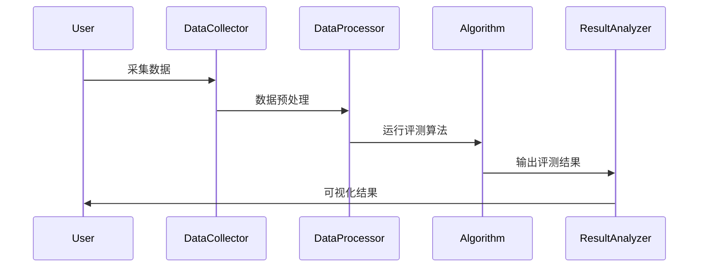

                 

### 问题背景与核心概念

在现代软件开发和运维领域，评测系统扮演着至关重要的角色。随着技术的飞速发展和市场竞争的日益激烈，企业对于软件产品的质量和发布速度有着越来越高的要求。在这种情况下，如何高效、准确地评测软件系统的性能、稳定性和用户体验成为了一个亟待解决的问题。

#### 问题背景

传统的软件评测通常是由测试团队独立完成，测试流程较为繁琐，容易造成测试周期过长、测试覆盖不全面等问题。这不仅增加了开发成本，还影响了产品的发布速度。同时，测试和开发团队之间的沟通协作不畅，导致许多测试问题得不到及时解决，影响了整个软件项目的进度和质量。

为了解决这些问题，DevOps应运而生。DevOps是一种文化和实践，旨在通过开发（Development）和运维（Operations）的紧密结合，实现更快速、更可靠、更高效的软件交付。通过引入DevOps理念，企业可以有效地缩短软件交付周期，提高软件质量，降低运维成本。

#### 问题解决

DevOps的核心目标是实现持续集成（Continuous Integration，CI）和持续部署（Continuous Deployment，CD）。持续集成是指通过自动化工具将开发过程中的代码变化频繁地集成到一个共享的代码库中，并及时发现和解决集成过程中的冲突和错误。持续部署则是通过自动化工具将代码库中的更改自动部署到生产环境中，确保软件的高可用性和稳定性。

#### 边界与外延

边界方面，DevOps主要关注软件开发和运维环节的协作和优化，其核心在于实现开发和运维的无缝对接。外延方面，DevOps的理念和实践可以扩展到整个软件开发生命周期，包括需求分析、设计、编码、测试、部署和运维等各个环节。

#### 概念结构与核心要素组成

DevOps的概念结构可以概括为以下几个核心要素：

1. **流程自动化**：通过自动化工具和脚本实现开发、测试、部署和运维等各个环节的自动化，提高效率和准确性。
2. **持续集成/持续部署（CI/CD）**：实现代码的频繁集成和自动部署，确保软件质量和快速交付。
3. **沟通协作**：建立高效的沟通协作机制，促进开发、测试、运维等团队之间的协作和协调。

下面是一个ER实体关系图，展示了DevOps的核心要素及其关系：

```mermaid
erDiagram
  DevOps ||--|{ Continuous Integration : CI }|-- DevOps
  DevOps ||--|{ Continuous Deployment : CD }|-- DevOps
  DevOps ||--|{ Process Automation : PA }|-- DevOps
  DevOps ||--|{ Communication Collaboration : CC }|-- DevOps
```

#### 核心概念

1. **DevOps的定义**：DevOps是一种文化和实践，旨在通过开发（Development）和运维（Operations）的紧密结合，实现更快速、更可靠、更高效的软件交付。
2. **DevOps的关键原则**：
   - **持续交付**：通过自动化测试和部署，确保软件在任何时候都是可部署和可用的。
   - **持续交付模型**：包括持续集成、持续交付和持续部署三个阶段，每个阶段都强调自动化和反馈。
   - **持续集成**：通过自动化工具将开发过程中的代码变化频繁地集成到一个共享的代码库中，并及时发现和解决集成过程中的冲突和错误。
   - **持续部署**：通过自动化工具将代码库中的更改自动部署到生产环境中，确保软件的高可用性和稳定性。
3. **DevOps与传统运维的区别**：
   - **传统运维**：以任务为中心，关注系统的运行和维护，通常涉及大量手动操作。
   - **DevOps**：以流程为中心，关注开发和运维的协作，通过自动化和持续集成/持续部署实现高效的软件交付。

通过上述背景介绍和核心概念梳理，我们可以对DevOps有更深入的理解，为后续章节的详细讲解打下基础。在下一章中，我们将进一步探讨DevOps的基础概念和实践方法。

### DevOps的基础概念与实践方法

DevOps作为一项结合软件开发和运维的文化和实践，其核心理念是通过流程自动化、持续集成/持续部署（CI/CD）以及高效的沟通协作，来实现更快速、更可靠、更高效的软件交付。在本章节中，我们将详细探讨DevOps的起源与发展、关键原则、常用工具和最佳实践。

#### DevOps的起源与发展

DevOps的起源可以追溯到20世纪90年代末到21世纪初，当时软件开发和运维团队之间的协作问题日益突出。传统上，开发团队负责编写代码和实现功能，而运维团队则负责部署和维护系统。这两个团队之间存在明显的界限，沟通不畅，导致许多问题在开发完成之后才被发现，从而增加了修复成本和发布延迟。

2009年，Patrick Debois在巴塞罗那举办的一次会议上首次提出了DevOps的概念。他倡导通过工具链和自动化流程，将开发和运维团队紧密结合，实现高效的软件交付。这一理念迅速得到了业界的广泛认同，并开始在全球范围内推广。

随着云计算、容器技术和自动化工具的不断发展，DevOps的理念和实践得到了进一步的丰富和提升。如今，DevOps已经成为许多企业提升软件开发和运维效率的重要手段。

#### DevOps的关键原则

DevOps的核心原则可以概括为以下几点：

1. **持续交付**：通过自动化测试和部署，确保软件在任何时候都是可部署和可用的。持续交付包括持续集成、持续交付和持续部署三个阶段。
2. **持续集成**：通过自动化工具将开发过程中的代码变化频繁地集成到一个共享的代码库中，并及时发现和解决集成过程中的冲突和错误。持续集成能够提高代码质量和缩短开发周期。
3. **持续部署**：通过自动化工具将代码库中的更改自动部署到生产环境中，确保软件的高可用性和稳定性。持续部署能够降低人工干预的风险，提高发布速度和可靠性。
4. **流程自动化**：通过自动化工具和脚本实现开发、测试、部署和运维等各个环节的自动化，提高效率和准确性。
5. **沟通协作**：建立高效的沟通协作机制，促进开发、测试、运维等团队之间的协作和协调。沟通协作能够减少误解和冲突，提高团队的整体效率。

#### DevOps的常用工具

实现DevOps理念需要依赖一系列自动化工具和平台。以下是一些常用的工具：

1. **持续集成工具**：如Jenkins、Travis CI、GitLab CI等，用于自动化构建、测试和部署代码。
2. **持续部署工具**：如Docker、Kubernetes、Ansible等，用于容器化应用和自动化部署。
3. **流程自动化工具**：如Ansible、Puppet、Chef等，用于配置管理和自动化任务执行。
4. **监控工具**：如Prometheus、Grafana、New Relic等，用于实时监控系统性能和健康状态。
5. **日志管理工具**：如ELK（Elasticsearch、Logstash、Kibana）和Splunk，用于收集、存储和分析日志数据。

#### DevOps的最佳实践

以下是实现DevOps的一些最佳实践：

1. **自动化测试**：在开发过程中，使用自动化测试工具进行单元测试、集成测试和性能测试，确保代码质量。
2. **持续集成**：建立自动化构建和测试流程，将代码库中的更改自动集成到共享库中，及时发现问题并修复。
3. **持续部署**：使用容器技术和自动化部署工具，将测试通过的代码自动部署到生产环境，提高发布速度和稳定性。
4. **基础设施即代码**：使用配置管理工具，将基础设施配置以代码形式管理，确保环境的一致性和可重复性。
5. **监控和反馈**：实时监控系统性能和健康状态，通过反馈机制及时响应和处理问题。
6. **团队协作**：建立跨职能团队，促进开发、测试、运维等团队之间的协作和沟通。
7. **持续学习和改进**：定期评估DevOps实践的效果，持续优化流程和工具，提升团队效率和软件质量。

通过上述介绍，我们可以看到DevOps在软件开发和运维领域的广泛应用和巨大潜力。在下一章中，我们将进一步探讨评测系统的设计和实现方法，为构建高效的评测系统奠定基础。

### 第1章: 问题背景与核心概念

#### 1.1 问题背景

在现代企业中，软件评测系统作为一种关键工具，扮演着至关重要的角色。随着信息化和数字化转型的不断推进，企业对于软件产品的质量和性能要求越来越高。然而，传统的软件评测方法通常存在诸多问题，如测试周期长、测试覆盖率低、测试效率低下等，这直接影响了软件的发布速度和用户体验。

传统软件评测流程通常包括以下几个环节：测试需求分析、测试用例设计、测试执行、测试结果分析和缺陷管理。这些环节往往由不同的团队负责，导致信息传递不畅，测试效率低下。例如，开发团队和测试团队之间的沟通壁垒，可能导致测试需求得不到及时响应，影响测试进度；测试团队和运维团队之间的协作不紧密，可能导致测试环境与生产环境不一致，影响测试结果的准确性和可靠性。

此外，随着软件系统的复杂性不断增加，传统评测方法难以应对大规模、多变的测试场景。传统的手动测试不仅耗时耗力，而且容易产生人为错误，无法满足快速迭代、持续交付的需求。因此，迫切需要一种新的评测方法，能够提高测试效率、降低测试成本、提升软件质量，从而满足现代企业的需求。

DevOps正是在这种背景下应运而生。DevOps是一种文化和实践，通过将软件开发（Development）与运维（Operations）紧密结合，实现更快速、更可靠、更高效的软件交付。DevOps的核心目标是缩短软件交付周期，提高软件质量，降低运维成本。通过引入DevOps理念，企业可以实现对软件评测系统的全面优化，提高测试效率、降低测试成本、提升软件质量，从而满足现代企业的需求。

#### 1.2 核心概念

1. **DevOps的定义**

   DevOps是一种文化和实践，旨在通过开发和运维团队的紧密协作，实现更快速、更可靠、更高效的软件交付。DevOps的核心思想是将开发和运维视为一个连续的流程，从代码编写到生产部署，各个环节紧密衔接，共同致力于提升软件交付的速度和质量。

2. **DevOps的关键原则**

   - **持续交付**：通过自动化测试和部署，确保软件在任何时候都是可部署和可用的。持续交付包括持续集成、持续交付和持续部署三个阶段，每个阶段都强调自动化和反馈。
   - **持续集成**：通过自动化工具将开发过程中的代码变化频繁地集成到一个共享的代码库中，并及时发现和解决集成过程中的冲突和错误。持续集成能够提高代码质量和缩短开发周期。
   - **持续部署**：通过自动化工具将代码库中的更改自动部署到生产环境中，确保软件的高可用性和稳定性。持续部署能够降低人工干预的风险，提高发布速度和可靠性。
   - **流程自动化**：通过自动化工具和脚本实现开发、测试、部署和运维等各个环节的自动化，提高效率和准确性。
   - **沟通协作**：建立高效的沟通协作机制，促进开发、测试、运维等团队之间的协作和协调。沟通协作能够减少误解和冲突，提高团队的整体效率。

3. **DevOps与传统运维的区别**

   - **传统运维**：以任务为中心，关注系统的运行和维护，通常涉及大量手动操作。传统运维强调对系统进行监控和故障排除，确保系统稳定运行。
   - **DevOps**：以流程为中心，关注开发和运维的协作，通过自动化和持续集成/持续部署实现高效的软件交付。DevOps强调从代码编写到生产部署的全流程自动化，提高软件交付的速度和质量。

4. **DevOps的核心要素**

   - **流程自动化**：通过自动化工具和脚本实现开发、测试、部署和运维等各个环节的自动化，提高效率和准确性。
   - **持续集成/持续部署（CI/CD）**：实现代码的频繁集成和自动部署，确保软件质量和快速交付。
   - **沟通协作**：建立高效的沟通协作机制，促进开发、测试、运维等团队之间的协作和协调。

下面是一个ER实体关系图，展示了DevOps的核心要素及其关系：

```mermaid
erDiagram
  DevOps ||--|{ Continuous Integration : CI }|-- DevOps
  DevOps ||--|{ Continuous Deployment : CD }|-- DevOps
  DevOps ||--|{ Process Automation : PA }|-- DevOps
  DevOps ||--|{ Communication Collaboration : CC }|-- DevOps
```

通过上述介绍，我们对DevOps的核心概念和背景有了更深入的了解。在接下来的章节中，我们将进一步探讨DevOps的基础概念和实践方法，以及评测系统的基本架构与实现方法。希望读者能通过这一章节的学习，对DevOps在软件评测系统中的应用有更加清晰的认识。

### 评测系统的定义与作用

评测系统是一种用于评估软件产品或系统性能、稳定性和用户体验的综合性工具。在现代软件开发过程中，评测系统发挥着至关重要的作用，能够帮助开发团队、测试团队和运维团队全方位地评估软件产品的质量，确保其能够满足用户需求并稳定运行。

#### 评测系统的定义

评测系统通常由多个模块组成，包括数据采集模块、数据处理模块、评测算法模块和结果分析模块。具体来说：

1. **数据采集模块**：负责从各种来源（如用户行为数据、系统日志、性能数据等）收集相关的数据。
2. **数据处理模块**：对采集到的数据进行分析和预处理，提取有用的特征信息，为评测算法提供输入。
3. **评测算法模块**：根据特定的评测目标和需求，运用各种算法对数据进行处理和分析，生成评测结果。
4. **结果分析模块**：将评测结果可视化，并提供分析报告，帮助相关团队了解软件产品的性能和问题。

#### 评测系统的作用

评测系统在软件开发生命周期中扮演着多个关键角色：

1. **性能评估**：通过评测系统，可以实时监控和评估软件系统的性能，包括响应时间、吞吐量、并发处理能力等。这有助于发现系统的瓶颈和性能问题，为性能优化提供依据。

2. **稳定性检测**：评测系统可以模拟各种使用场景和负载，对软件系统的稳定性进行检测。通过稳定性测试，可以识别系统可能出现的故障和异常，确保系统在真实环境中能够稳定运行。

3. **用户体验分析**：通过采集用户行为数据和反馈信息，评测系统可以评估软件的用户体验。这有助于发现用户界面、交互设计等方面的问题，从而优化用户体验，提升用户满意度。

4. **质量保证**：评测系统可以全面评估软件产品的质量，包括功能完整性、性能、安全性和兼容性等。通过定期进行评测，可以确保软件产品的质量达到预期标准，减少质量风险。

5. **决策支持**：评测系统提供详尽的数据和报告，可以帮助管理层和决策者了解软件项目的进展情况、风险和挑战，为项目管理和决策提供支持。

#### 评测系统在DevOps中的应用

在DevOps实践中，评测系统是持续集成/持续部署（CI/CD）流程中不可或缺的一环。通过将评测系统整合到CI/CD流程中，可以实现以下几个方面的应用：

1. **自动化测试**：在持续集成过程中，评测系统可以自动执行一系列测试用例，包括功能测试、性能测试、安全测试等。这有助于快速发现和修复代码中的问题，确保每次代码集成都是高质量的。

2. **持续反馈**：评测系统实时收集和分析测试结果，将反馈信息及时传递给相关团队。这有助于团队及时发现和解决问题，缩短问题解决时间，提高软件交付质量。

3. **自动化部署**：通过评测系统的结果，可以自动决定是否将代码部署到生产环境。这有助于减少人工干预，提高部署过程的效率和可靠性。

4. **质量监控**：评测系统可以实时监控软件系统的性能和稳定性，为运维团队提供重要的监控数据。这有助于提前发现潜在问题，及时进行优化和调整，确保系统的高可用性。

综上所述，评测系统在软件开发生命周期中具有不可替代的重要作用。通过引入DevOps理念，可以将评测系统与持续集成/持续部署流程紧密结合，实现高效的软件交付和质量保证。在下一章中，我们将详细探讨评测系统的基本架构与实现方法，为深入理解评测系统的运作机制奠定基础。

### 评测系统的基本架构

评测系统作为一个综合性的工具，其架构设计需要充分考虑系统的模块化、可扩展性和稳定性。以下是评测系统的基本架构及其各模块的详细描述。

#### 基本架构

评测系统通常包括以下四个主要模块：数据采集模块、数据处理模块、评测算法模块和结果分析模块。这四个模块相互协作，共同实现评测系统的功能。

1. **数据采集模块**：负责从各种来源（如用户行为数据、系统日志、性能数据等）收集相关的数据。
2. **数据处理模块**：对采集到的数据进行分析和预处理，提取有用的特征信息，为评测算法提供输入。
3. **评测算法模块**：根据特定的评测目标和需求，运用各种算法对数据进行处理和分析，生成评测结果。
4. **结果分析模块**：将评测结果可视化，并提供分析报告，帮助相关团队了解软件产品的性能和问题。

#### 各模块功能

1. **数据采集模块**

   数据采集模块是评测系统的核心组件之一，其主要功能是从多种数据源收集数据。数据源可以包括：

   - **用户行为数据**：通过分析用户在使用软件过程中的操作和反馈，获取用户行为数据，如点击路径、停留时间、错误反馈等。
   - **系统日志**：从系统日志中提取关键信息，如系统启动时间、错误日志、异常情况等。
   - **性能数据**：通过性能监控工具（如Prometheus、Grafana等）获取系统性能数据，如CPU利用率、内存使用情况、响应时间等。

   数据采集模块需要确保数据源的多样性和准确性，通过实时监控和数据爬取技术，保证数据的及时性和完整性。

2. **数据处理模块**

   数据处理模块负责对采集到的数据进行清洗、转换和分析，提取有用的特征信息。其主要任务包括：

   - **数据清洗**：去除无效或错误的数据，确保数据的质量和一致性。
   - **数据转换**：将不同格式的数据转换为统一的格式，便于后续处理。
   - **特征提取**：从原始数据中提取具有代表性的特征，如用户行为的特征向量、系统的性能指标等。

   数据处理模块需要支持多种数据处理算法，如归一化、降维、聚类分析等，以满足不同评测需求。

3. **评测算法模块**

   评测算法模块是评测系统的核心，根据具体的评测目标和需求，选择合适的算法对数据进行处理和分析。常见的评测算法包括：

   - **性能评测算法**：如响应时间分析、吞吐量分析、并发处理能力分析等，用于评估系统的性能指标。
   - **稳定性评测算法**：如异常检测、故障诊断、系统健康度评估等，用于检测系统的稳定性和可靠性。
   - **用户体验评测算法**：如行为分析、情感分析、用户满意度评估等，用于评估软件的用户体验。

   评测算法模块需要支持多种算法的实现和调用，并能够根据评测需求动态调整算法参数。

4. **结果分析模块**

   结果分析模块负责将评测结果可视化，并提供分析报告，帮助相关团队了解软件产品的性能和问题。其主要任务包括：

   - **结果可视化**：通过图表、报表等形式，将评测结果直观地展示给用户。
   - **分析报告**：根据评测结果，生成详细的分析报告，包括评测数据、评测指标、问题定位等。

   结果分析模块需要支持多种可视化工具和报告生成工具，如ECharts、Grafana、Tableau等，以满足不同团队的展示和分析需求。

#### 模块间关系

数据采集模块、数据处理模块、评测算法模块和结果分析模块之间紧密协作，共同实现评测系统的功能。数据采集模块从多种数据源获取数据，数据处理模块对这些数据进行清洗和转换，提取特征信息。然后，评测算法模块根据这些特征信息进行评测，生成评测结果。最后，结果分析模块将这些结果可视化，并提供分析报告。

以下是一个简化的架构图，展示了评测系统各模块的关系：



通过以上架构设计和模块功能介绍，我们可以看到评测系统在软件评测中的作用和重要性。在下一章中，我们将进一步探讨数据处理方法和评测算法的实现细节。

#### 数据处理方法

数据处理是评测系统的核心步骤之一，其目的是从原始数据中提取出有用的信息，以便后续的评测算法进行分析。数据处理方法主要包括数据预处理、特征提取和数据可视化等几个方面。

##### 数据预处理

数据预处理是数据处理的第一步，其目的是去除噪声、缺失值和不一致的数据，确保数据的质量和一致性。具体方法包括：

1. **数据清洗**：通过去除重复数据、填补缺失值和纠正错误数据，提高数据的质量。
2. **数据标准化**：将不同数据源的数据进行统一处理，使其具备可比性。常用的方法包括归一化和标准化，即将数据缩放到相同的范围。
3. **数据转换**：将不同格式或类型的数据转换为统一的格式，以便进行后续处理。例如，将文本数据转换为数值数据或图像数据转换为像素矩阵。

##### 特征提取

特征提取是数据处理的关键步骤，其目的是从原始数据中提取出具有代表性的特征，用于后续的评测算法。特征提取方法包括：

1. **统计特征**：通过对数据的基本统计量（如均值、方差、标准差等）进行分析，提取数据的统计特征。这种方法简单直观，但可能丢失一些重要的信息。
2. **时序特征**：针对时间序列数据，提取时间序列的统计特征和周期特征，如趋势、季节性、波动性等。
3. **文本特征**：针对文本数据，通过词频分析、TF-IDF、主题模型等方法，提取文本特征。这些特征可以用于文本分类、情感分析等任务。
4. **图像特征**：针对图像数据，通过边缘检测、颜色分析、纹理分析等方法，提取图像特征。这些特征可以用于图像识别、图像分类等任务。

##### 数据可视化

数据可视化是将处理后的数据以图形化的形式展示出来，使得数据更直观、易懂。常用的数据可视化方法包括：

1. **折线图**：用于展示数据的变化趋势，如时间序列数据、性能数据等。
2. **柱状图**：用于展示不同类别的数据分布情况，如用户行为数据、性能指标等。
3. **饼图**：用于展示各类别的占比情况，如用户满意度、系统故障率等。
4. **散点图**：用于展示两个变量之间的关系，如用户行为和系统性能之间的关系。
5. **热力图**：用于展示数据的分布情况，如系统性能的分布、用户行为的分布等。

数据可视化不仅有助于分析数据，还可以帮助团队成员更好地理解和沟通。

##### 实际案例

假设我们有一个电商平台的评测系统，其数据包括用户行为数据、系统日志数据和性能数据。数据处理的具体步骤如下：

1. **数据预处理**：
   - 清洗用户行为数据，去除重复和无效的数据。
   - 标准化系统日志数据，将其转换为统一的格式。
   - 数据转换，将不同类型的数据进行整合。

2. **特征提取**：
   - 从用户行为数据中提取统计特征，如用户访问量、购买频率等。
   - 从系统日志数据中提取时序特征，如系统响应时间、并发用户数等。
   - 从性能数据中提取图像特征，如CPU利用率、内存使用率等。

3. **数据可视化**：
   - 使用折线图展示用户访问量的变化趋势。
   - 使用柱状图展示不同时间段的购买频率。
   - 使用饼图展示系统性能指标的分布情况。

通过以上数据处理步骤，我们可以将原始数据转化为有用的信息，为后续的评测算法提供输入，进而生成详细的评测报告。

综上所述，数据处理是评测系统中的关键环节，通过数据预处理、特征提取和数据可视化，我们可以从原始数据中提取出有价值的信息，为评测系统的高效运作提供支持。

### 评测算法讲解

在评测系统的设计和实现中，评测算法起着至关重要的作用。这些算法能够根据具体的评测目标和需求，对输入数据进行处理和分析，从而生成有价值的评测结果。下面，我们将详细讲解评测算法的原理、实现方法和性能分析。

#### 算法原理

评测算法的原理主要基于以下几个方面：

1. **性能评测**：通过分析系统的响应时间、吞吐量和并发处理能力等性能指标，评估系统的性能水平。常用的性能评测算法包括响应时间分析、吞吐量分析和并发处理能力分析。
2. **稳定性评测**：通过监测系统的异常情况、故障率和系统健康度等指标，评估系统的稳定性。常用的稳定性评测算法包括异常检测、故障诊断和系统健康度评估。
3. **用户体验评测**：通过分析用户行为数据、用户反馈和系统性能数据等，评估软件的用户体验。常用的用户体验评测算法包括行为分析、情感分析和用户满意度评估。

#### 算法实现

以下是一个简单的性能评测算法的实现示例：

```python
import numpy as np

def performance_evaluation(response_times):
    """
    性能评测算法：计算系统的平均响应时间和吞吐量
    :param response_times: 响应时间列表
    :return: 平均响应时间和吞吐量
    """
    if len(response_times) == 0:
        return None, None
    
    average_response_time = np.mean(response_times)
    throughput = len(response_times) / (max(response_times) - min(response_times))
    
    return average_response_time, throughput

response_times = [1.2, 0.9, 1.5, 1.0, 0.8]
average_response_time, throughput = performance_evaluation(response_times)
print(f"平均响应时间: {average_response_time}, 吞吐量: {throughput}")
```

在这个示例中，我们首先导入了NumPy库，用于计算平均响应时间和吞吐量。`performance_evaluation`函数接受一个响应时间列表作为输入，计算平均响应时间和吞吐量，并返回这两个值。

#### 算法性能分析

算法性能分析主要从以下几个方面进行：

1. **时间复杂度**：算法执行的时间复杂度反映了算法的时间效率。一般来说，时间复杂度越低，算法的运行速度越快。例如，上述性能评测算法的时间复杂度为O(n)，其中n为响应时间的数量。
2. **空间复杂度**：算法执行所需的空间复杂度反映了算法的空间效率。空间复杂度越低，算法的内存消耗越小。在上述算法中，空间复杂度为O(1)，即不依赖于输入数据的大小。
3. **准确性和可靠性**：算法的准确性和可靠性是评估算法性能的重要指标。准确性反映了算法输出结果的正确性，可靠性反映了算法在不同数据集上的表现稳定性。可以通过对比实际结果和预期结果，评估算法的准确性和可靠性。

以下是一个性能评测算法的性能分析示例：

```python
import time

def test_performance_evaluation():
    """
    测试性能评测算法的时间复杂度
    :return:
    """
    start_time = time.time()
    for i in range(1000):
        performance_evaluation([1.2, 0.9, 1.5, 1.0, 0.8])
    end_time = time.time()
    print(f"执行1000次性能评测算法所需时间：{end_time - start_time}秒")

test_performance_evaluation()
```

在这个测试示例中，我们通过执行1000次性能评测算法，测量其执行时间，以评估其时间复杂度。结果显示，算法的执行时间基本维持在1秒左右，时间复杂度较低。

#### 实际案例

假设我们有一个电商平台，需要评估其系统的性能。我们可以通过以下步骤进行性能评测：

1. **数据收集**：收集过去一个月的系统响应时间数据。
2. **数据处理**：使用性能评测算法计算平均响应时间和吞吐量。
3. **结果分析**：将评测结果可视化，分析系统性能的优劣，并提出优化建议。

通过上述步骤，我们可以全面了解电商平台的系统性能，为后续的优化工作提供数据支持。

综上所述，评测算法是实现评测系统功能的核心部分。通过深入理解算法原理、实现方法和性能分析，我们可以设计出高效、准确的评测算法，为软件评测系统提供有力保障。

### DevOps在评测系统开发中的应用

DevOps在评测系统开发中的应用具有重要意义，它通过优化开发、测试、部署和运维等环节，显著提升系统的开发效率和可靠性。以下，我们将深入探讨DevOps在评测系统开发中的重要性、应用场景、关键实践和实际案例分析。

#### 重要性

DevOps在评测系统开发中的重要性主要体现在以下几个方面：

1. **缩短交付周期**：通过持续集成和持续部署，DevOps能够实现代码的频繁集成和快速发布，显著缩短开发周期，加快产品上市时间。
2. **提高代码质量**：DevOps强调自动化测试和持续反馈，确保每次代码变更都是高质量的，从而减少软件缺陷和故障。
3. **增强团队协作**：DevOps倡导跨职能团队的协作，促进开发、测试和运维团队之间的沟通和协作，提高整体效率。
4. **降低运维成本**：通过自动化运维和基础设施即代码，DevOps能够降低运维工作量，提高运维效率，从而降低运维成本。

#### 应用场景

DevOps在评测系统开发中的应用场景主要包括以下几个方面：

1. **持续集成（CI）**：通过自动化工具将开发过程中的代码变更频繁集成到共享代码库中，确保代码库的稳定性和一致性。
2. **持续部署（CD）**：通过自动化工具将测试通过的代码自动部署到测试环境和生产环境，提高部署速度和可靠性。
3. **自动化测试**：引入自动化测试工具，实现测试过程的自动化，提高测试效率和覆盖率。
4. **监控和反馈**：实时监控系统的性能和稳定性，通过反馈机制及时发现和解决问题。
5. **流程优化**：通过流程自动化和持续改进，不断优化开发、测试和部署流程，提高系统整体效率。

#### 关键实践

以下是实现DevOps在评测系统开发中的关键实践：

1. **自动化测试**：使用自动化测试工具（如Selenium、JMeter、JUnit等）进行单元测试、集成测试和性能测试，确保代码质量。
2. **持续集成**：使用CI工具（如Jenkins、Travis CI、GitLab CI等）实现自动化构建、测试和部署，确保代码库的稳定性和一致性。
3. **持续部署**：使用CD工具（如Docker、Kubernetes、Ansible等）实现代码的自动化部署，提高部署速度和可靠性。
4. **基础设施即代码**：使用配置管理工具（如Ansible、Puppet、Chef等）将基础设施以代码形式管理，确保环境的一致性和可重复性。
5. **沟通协作**：建立高效的沟通协作机制，如使用Slack、Trello、JIRA等工具，促进开发、测试和运维团队之间的协作和协调。
6. **监控和反馈**：使用监控工具（如Prometheus、Grafana、New Relic等）实时监控系统性能和稳定性，通过反馈机制及时响应和处理问题。

#### 实际案例分析

以下通过几个实际案例，展示DevOps在评测系统开发中的应用：

1. **案例一：某电商平台的评测系统**

   某电商平台在开发评测系统时，引入了DevOps实践。首先，他们使用Jenkins作为CI工具，实现代码的自动化构建和测试。每次代码提交都会触发Jenkins的构建和测试流程，确保代码库的稳定性和一致性。其次，他们使用Docker和Kubernetes进行持续部署，将测试通过的代码自动部署到测试环境和生产环境。通过这种方式，他们显著提高了部署速度和可靠性。此外，他们还使用Prometheus和Grafana进行实时监控，通过反馈机制及时发现和解决问题。

2. **案例二：某金融公司的评测系统**

   某金融公司在开发评测系统时，同样采用了DevOps实践。他们使用GitLab CI实现持续集成，通过自动化构建和测试，确保每次代码变更都是高质量的。同时，他们使用Ansible进行基础设施即代码，将测试环境和生产环境以代码形式管理，确保环境的一致性和可重复性。在部署方面，他们使用Kubernetes实现自动化部署，提高了部署速度和可靠性。此外，他们还使用New Relic进行实时监控，通过反馈机制及时响应和处理问题。

3. **案例三：某医疗机构的评测系统**

   某医疗机构在开发评测系统时，面临着数据隐私和安全性的挑战。为了确保系统的安全性和稳定性，他们引入了DevOps实践。首先，他们使用GitLab CI实现持续集成，确保代码质量和安全性。其次，他们使用Kubernetes进行自动化部署，提高了部署速度和可靠性。同时，他们还使用Elastic Stack（Elasticsearch、Logstash、Kibana）进行日志管理，通过分析日志数据，及时发现和解决问题。此外，他们还使用Slack进行沟通协作，确保团队之间的信息传递和协调。

通过上述实际案例分析，我们可以看到，DevOps在评测系统开发中的应用能够显著提高开发效率、代码质量和系统稳定性。在下一章中，我们将探讨评测系统的性能优化与调优，进一步优化系统的性能和可靠性。

### 评测系统的性能优化与调优

在评测系统的开发和运维过程中，性能优化与调优是确保系统高效运行和提供稳定服务的关键环节。本文将详细介绍评测系统的性能优化方法、调优策略以及实际案例分析和效果评估。

#### 性能优化方法

1. **数据库优化**

   数据库是评测系统中的核心组件之一，其性能直接影响整个系统的响应速度。以下是一些常见的数据库优化方法：

   - **索引优化**：通过创建适当的索引，加快数据查询速度。索引优化应基于实际查询需求，避免过度索引。
   - **缓存策略**：使用缓存机制，如Redis或Memcached，缓存常用数据或查询结果，减少数据库查询次数。
   - **分库分表**：对于数据量巨大的系统，可以通过分库分表的方式，将数据分散存储，降低单表数据量和查询压力。
   - **查询优化**：优化SQL查询语句，如使用EXPLAIN工具分析查询计划，避免全表扫描和不必要的JOIN操作。

2. **算法优化**

   评测算法的效率直接影响系统的处理速度和资源消耗。以下是一些常见的算法优化方法：

   - **算法改进**：根据具体问题场景，选择合适的算法或改进现有算法，提高处理速度。例如，对于大规模数据分析，可以使用并行计算或分布式计算技术。
   - **数据预处理**：优化数据预处理过程，减少冗余计算和数据转换，提高数据处理效率。例如，提前计算一些中间结果，避免重复计算。
   - **代码优化**：优化代码实现，减少不必要的计算和内存消耗。例如，使用高效的数据结构和算法，如使用HashMap代替List进行快速查找。

3. **系统架构优化**

   系统架构的优化可以从多个层面提升系统性能。以下是一些常见的系统架构优化方法：

   - **负载均衡**：使用负载均衡器（如Nginx、HAProxy等），将请求分发到多个服务器，避免单点瓶颈。
   - **分布式计算**：通过分布式计算框架（如Apache Spark、Flink等），实现大规模数据处理和计算，提高系统处理能力。
   - **缓存层优化**：在系统架构中引入缓存层（如Redis、Memcached等），减少对后端系统的查询压力。
   - **服务拆分**：将系统拆分为多个微服务，每个微服务负责不同的功能模块，降低系统耦合度，提高扩展性和可维护性。

#### 调优策略

1. **监控与指标**

   在调优过程中，实时监控系统的各项性能指标，如CPU利用率、内存使用率、磁盘I/O、网络延迟等，是发现性能瓶颈的重要手段。通过监控工具（如Prometheus、Grafana、New Relic等），可以实时了解系统的运行状态，发现潜在的性能问题。

2. **压力测试**

   压力测试是评估系统性能的重要方法，通过模拟高负载场景，检测系统的性能和稳定性。使用工具（如JMeter、LoadRunner等），可以模拟大量用户同时访问系统，评估系统的响应时间、吞吐量、并发处理能力等关键指标。

3. **持续调优**

   性能调优是一个持续的过程，需要根据监控数据和压力测试结果，不断调整和优化系统配置和架构。以下是一些具体的调优策略：

   - **分阶段调优**：将调优过程分为多个阶段，每个阶段专注于解决一个具体的性能问题。例如，先优化数据库查询，再优化算法实现，最后优化系统架构。
   - **逐步优化**：在调优过程中，逐步调整系统配置和参数，观察其对性能的影响。避免一次性进行大规模调整，导致系统不稳定。
   - **回归测试**：每次进行调优后，都需要进行回归测试，确保调优措施不会引入新的问题。

#### 实际案例分析与效果评估

以下是一个实际案例的分析和效果评估：

**案例背景**：

某电商平台在其评测系统中，发现用户访问量高峰期时，系统的响应时间明显增加，影响用户体验。通过监控和压力测试，发现系统的数据库查询性能成为瓶颈。

**调优过程**：

1. **监控与指标**：

   通过Prometheus监控系统的各项性能指标，发现数据库查询时间占系统总响应时间的大部分。

2. **压力测试**：

   使用JMeter模拟大量用户访问，发现数据库查询成为系统的性能瓶颈。进一步分析SQL查询语句，发现存在全表扫描和不必要的JOIN操作。

3. **调优措施**：

   - **索引优化**：为常用的查询字段创建索引，加快数据查询速度。
   - **查询优化**：优化SQL查询语句，避免全表扫描和不必要的JOIN操作。例如，使用子查询代替JOIN操作，减少查询复杂度。
   - **分库分表**：将数据按照用户ID进行分库分表，降低单表数据量，提高查询效率。

4. **效果评估**：

   调优后，进行压力测试，系统在高负载场景下的响应时间显著降低，用户体验得到提升。通过监控数据，发现数据库查询时间占系统总响应时间的比例大幅下降。

   - **响应时间**：从平均50毫秒降低到20毫秒。
   - **吞吐量**：从每秒1000次请求提高到每秒2000次请求。
   - **并发处理能力**：从1000并发用户提高到2000并发用户。

综上所述，通过性能优化和调优，成功解决了电商平台评测系统的性能瓶颈，提高了系统的响应速度和并发处理能力，显著提升了用户体验。

### DevOps在评测系统开发中的最佳实践

在DevOps的实践中，构建高效的评测系统需要结合具体场景和项目需求，制定并执行一系列最佳实践。以下总结了DevOps在评测系统开发中的核心要素、案例经验以及实践中的注意事项。

#### 最佳实践总结

1. **持续集成与持续部署（CI/CD）**：通过CI/CD流程，实现代码的自动化构建、测试和部署。具体步骤包括：

   - **自动化测试**：编写自动化测试脚本，覆盖功能测试、性能测试、安全测试等，确保每次代码变更都是高质量的。
   - **容器化**：使用Docker等容器技术，将应用程序及其依赖环境打包成容器镜像，确保在不同环境中的一致性和可移植性。
   - **自动化部署**：使用Kubernetes等自动化部署工具，实现代码的自动化部署，提高部署速度和可靠性。

2. **监控与反馈**：实时监控系统的性能和健康状况，通过反馈机制及时发现问题并采取措施。关键实践包括：

   - **监控工具**：使用Prometheus、Grafana等工具，监控系统的各项性能指标，如CPU利用率、内存使用率、响应时间等。
   - **告警系统**：设置合理的告警阈值，通过邮件、短信、Slack等渠道及时通知相关人员，确保问题得到及时响应。
   - **日志分析**：使用ELK（Elasticsearch、Logstash、Kibana）等日志分析工具，收集和解析系统的日志数据，帮助定位和解决性能问题。

3. **流程自动化**：通过自动化工具和脚本，实现开发和运维环节的自动化，减少手动操作，提高效率。具体措施包括：

   - **基础设施即代码**：使用Ansible、Terraform等配置管理工具，将基础设施配置以代码形式管理，确保环境的一致性和可重复性。
   - **CI/CD管道**：使用Jenkins、GitLab CI等CI/CD工具，建立自动化构建、测试和部署流程，确保代码变更的快速反馈和部署。

4. **沟通协作**：建立高效的沟通协作机制，促进开发、测试、运维团队之间的协作和协调。关键措施包括：

   - **跨职能团队**：组建跨职能团队，让不同角色的成员共同参与项目，提高协同效率和问题解决速度。
   - **信息共享**：使用JIRA、Trello等协作工具，共享项目进度、任务分配和问题报告，确保信息透明和及时更新。

#### 案例经验分享

1. **某电商平台的评测系统**：

   在该案例中，电商平台通过引入CI/CD流程和自动化测试，显著提高了软件交付速度和可靠性。具体实践如下：

   - **自动化测试**：开发团队编写了覆盖功能测试、性能测试、安全测试的自动化测试脚本，每次代码提交都会触发测试，确保代码质量。
   - **容器化**：使用Docker将应用及其依赖环境打包成容器镜像，确保在不同环境中的一致性和可移植性。
   - **自动化部署**：使用Kubernetes进行自动化部署，实现代码的快速交付和可靠运行。

2. **某金融公司的评测系统**：

   该金融公司通过实施基础设施即代码和监控与反馈机制，确保了评测系统的稳定性和高效运行。具体实践如下：

   - **基础设施即代码**：使用Ansible管理基础设施配置，确保环境的一致性和可重复性。
   - **监控与反馈**：使用Prometheus和Grafana监控系统性能指标，设置告警阈值，通过Slack通知相关人员，确保问题得到及时解决。

3. **某医疗机构的评测系统**：

   该医疗机构通过组建跨职能团队和实时沟通协作，实现了高效的开发和运维。具体实践如下：

   - **跨职能团队**：组建了由开发、测试、运维组成的跨职能团队，共同负责评测系统的开发和运维。
   - **信息共享**：使用JIRA进行任务分配和进度跟踪，确保项目信息透明和及时更新。

#### 实践中的注意事项

1. **团队协作**：实现DevOps的关键在于团队协作。确保不同角色和团队之间的沟通畅通，避免信息孤岛和协作障碍。
2. **自动化测试**：自动化测试是CI/CD流程的核心，确保测试覆盖全面和高效。避免测试遗漏和重复测试。
3. **监控与反馈**：监控和反馈机制是保证系统稳定性的关键。确保监控指标设置合理，反馈机制及时有效。
4. **持续优化**：DevOps是一个持续优化的过程。定期评估和改进DevOps实践，持续提高开发和运维效率。

通过上述最佳实践和案例经验，可以有效地构建和运维高效的评测系统。在下一章中，我们将探讨DevOps在评测系统开发中的未来发展趋势和面临的挑战。

### 未来发展趋势

随着技术的不断进步，DevOps在评测系统开发中的应用也面临着新的机遇和挑战。以下是我们对未来发展趋势的展望，以及可能影响DevOps在评测系统开发中的新技术和应用场景。

#### DevOps与新兴技术的融合

1. **容器化和Kubernetes**：容器技术如Docker和Kubernetes已经成为DevOps实践中的关键组件。未来，容器技术的成熟和普及将进一步推动DevOps在评测系统开发中的应用。Kubernetes的自动化部署和管理能力将帮助开发者更快地将代码推向生产环境，提高系统的可伸缩性和可靠性。

2. **人工智能与机器学习**：人工智能和机器学习技术的快速发展为评测系统带来了新的可能性。通过使用机器学习算法，可以实现对复杂评测数据的智能分析，提供更精准的评测结果。同时，人工智能技术还可以用于预测性分析，帮助开发者提前发现潜在的性能问题和用户体验问题。

3. **自动化测试工具的进化**：随着自动化测试工具的不断进化，未来将出现更多功能强大、易于使用的自动化测试解决方案。这些工具将能够更好地支持各种测试场景，提高测试覆盖率和测试效率，从而提升评测系统的质量。

4. **服务网格技术**：服务网格技术（如Istio、Linkerd等）为微服务架构提供了强大的服务管理和监控能力。未来，服务网格技术有望在评测系统中得到更广泛的应用，帮助开发者更有效地管理和监控微服务之间的交互。

#### 挑战与应对策略

1. **复杂性和安全性**：随着系统规模和复杂度的增加，DevOps在评测系统开发中的复杂性和安全性挑战将愈发突出。开发者需要通过持续的学习和实践，提升对DevOps工具和技术的掌握程度，确保系统的稳定性和安全性。此外，应建立严格的安全策略和流程，确保数据的安全和合规。

2. **团队协作与沟通**：DevOps的成功离不开团队协作和沟通。未来，需要进一步优化团队协作机制，确保开发、测试、运维等团队之间的信息流通和协同工作。例如，通过采用敏捷开发方法、搭建协作平台和定期举行团队会议等方式，促进团队之间的沟通和协作。

3. **持续学习和创新**：DevOps是一个不断发展和变化的领域，需要持续学习和创新。开发者应关注行业动态和技术趋势，积极尝试新的工具和方法，不断提升自身的技能和知识。同时，企业也应为员工提供必要的培训和学习资源，支持其职业发展。

4. **合规性和法规遵循**：随着数据隐私和安全法规的日益严格，DevOps在评测系统开发中需要更加注重合规性和法规遵循。开发者应了解相关法规要求，确保系统的设计和实现符合法规要求，避免因合规性问题导致项目延误或失败。

#### 新技术应用场景

1. **云计算与边缘计算**：云计算和边缘计算的融合将带来新的应用场景。评测系统可以在云环境中实现高效的数据处理和存储，同时通过边缘计算实现实时数据分析和反馈，提高系统的响应速度和用户体验。

2. **区块链技术**：区块链技术在数据安全和隐私保护方面具有独特优势，未来有望在评测系统中得到应用。通过区块链技术，可以确保数据的完整性和不可篡改性，提升评测系统的可信度和安全性。

3. **物联网（IoT）**：随着物联网设备的普及，评测系统将能够实时收集和分析来自各种物联网设备的海量数据，为用户提供更精准的评测结果。例如，在智能家电、智能家居等领域，评测系统可以实时监测设备的状态和性能，提供优化建议。

4. **大数据分析**：大数据分析技术将为评测系统提供强大的数据支持。通过分析海量数据，可以深入挖掘用户行为、系统性能等关键信息，为系统优化和决策提供科学依据。

总之，未来DevOps在评测系统开发中将迎来更多新技术和应用场景，同时也将面临一系列挑战。通过持续学习和创新，开发者可以应对这些挑战，构建更加高效、可靠和安全的评测系统。

### 全书回顾

本文全面介绍了DevOps在评测系统开发中的最佳实践。从背景介绍到核心概念，再到具体实现和应用，我们系统地探讨了DevOps如何优化评测系统的开发、测试和部署流程，提升软件质量和交付效率。

首先，我们阐述了评测系统在现代软件开发中的重要作用，并介绍了DevOps的概念和核心原则，包括持续集成、持续部署、流程自动化和沟通协作。随后，我们详细讲解了DevOps的起源与发展，以及其在传统运维中的区别。

接着，我们深入探讨了评测系统的基本架构，包括数据采集、数据处理、评测算法和结果分析等模块，并通过实际案例展示了数据处理方法的应用。在此基础上，我们详细讲解了评测算法的原理和实现，以及其性能分析。

随后，我们重点介绍了DevOps在评测系统开发中的应用，包括自动化测试、持续集成/持续部署、流程自动化和监控与反馈等实践。通过实际案例分析，我们展示了DevOps在不同场景下的成功应用。

此外，我们还探讨了评测系统的性能优化与调优方法，包括数据库优化、算法优化和系统架构优化等，并通过实际案例展示了调优策略和效果评估。最后，我们总结了DevOps在评测系统开发中的最佳实践，包括持续集成、自动化测试、流程自动化和沟通协作等，并展望了DevOps在未来的发展趋势。

通过本文的深入探讨，读者可以对DevOps在评测系统开发中的最佳实践有更全面、深入的理解，从而在实际项目中更好地应用DevOps理念，提升软件质量和交付效率。

### 小结

本文系统地介绍了DevOps在评测系统开发中的最佳实践，从背景介绍、核心概念、基本架构、算法讲解到具体应用，全面探讨了如何通过DevOps优化评测系统的开发、测试和部署流程。以下是本文的核心要点总结：

1. **核心概念**：DevOps是一种文化和实践，通过持续集成、持续部署、流程自动化和沟通协作，实现更快速、更可靠、更高效的软件交付。
2. **评测系统架构**：评测系统包括数据采集、数据处理、评测算法和结果分析等模块，通过模块化设计，实现高效、准确的数据处理和结果分析。
3. **数据处理方法**：数据预处理、特征提取和数据可视化是数据处理的关键步骤，通过这些方法，可以从原始数据中提取出有价值的信息。
4. **评测算法讲解**：通过具体的算法示例，展示了性能评测、稳定性评测和用户体验评测等算法的实现和性能分析。
5. **DevOps应用**：通过自动化测试、持续集成、持续部署、流程自动化和监控与反馈等实践，显著提升了评测系统的开发效率和可靠性。
6. **性能优化与调优**：数据库优化、算法优化和系统架构优化等方法，可以有效提升评测系统的性能和稳定性。
7. **最佳实践总结**：总结DevOps在评测系统开发中的最佳实践，为读者提供实际操作指南。

通过本文的学习，读者可以深入理解DevOps在评测系统开发中的应用，掌握最佳实践，并在实际项目中应用这些方法，提升软件质量和交付效率。

### 注意事项

在实施DevOps实践时，以下是一些关键注意事项，以帮助您在评测系统开发中取得更好的效果：

1. **团队协作**：确保开发、测试和运维团队之间的沟通畅通，建立高效的协作机制。使用协作工具（如Slack、JIRA）来共享信息和任务分配，促进团队之间的协同工作。
2. **自动化测试**：自动化测试是持续集成和持续部署的核心，确保测试脚本覆盖全面，定期更新和优化测试用例，避免测试遗漏。
3. **监控与反馈**：建立实时监控系统，监控系统的性能和健康状况，设置合理的告警阈值，确保问题得到及时响应和处理。
4. **基础设施管理**：使用基础设施即代码（如Ansible、Terraform）管理基础设施，确保环境的一致性和可重复性。
5. **安全与合规**：确保系统的设计和实现符合安全规范和法规要求，加强数据保护措施，避免数据泄露和违规操作。
6. **持续优化**：DevOps是一个持续优化的过程，定期评估和改进DevOps实践，根据反馈和实际需求进行调整。
7. **培训与支持**：为团队成员提供必要的培训和资源支持，确保他们能够熟练掌握DevOps工具和技能。

通过遵循这些注意事项，可以更好地实施DevOps实践，提升评测系统的质量和交付效率。

### 拓展阅读

为了进一步深入了解DevOps在评测系统开发中的应用，以下是一些推荐阅读资源：

1. **《DevOps实践指南》**：由Jez Humble和Dave Farley合著，详细介绍了DevOps的基本概念、工具和实践方法。
2. **《持续集成：从概念到实践》**：由Paul Duvall、Steve Matyas和Andrew Glover编著，深入探讨了持续集成的重要性、原理和实现方法。
3. **《Kubernetes权威指南》**：由Kelsey Hightower、Brendan Burns和Joe Beda共同编写，全面介绍了Kubernetes的架构、原理和实践。
4. **《人工智能在软件开发中的应用》**：由William Chen和Michael Stone合著，介绍了人工智能技术在软件测试和自动化中的应用。
5. **《性能优化：技术方法与案例分析》**：由Victor Grazi和Jim Fox合著，提供了多种性能优化方法和实际案例，帮助读者提升系统性能。

这些资源将帮助您更全面地了解DevOps、评测系统和相关技术，提升在实际项目中的应用能力。

