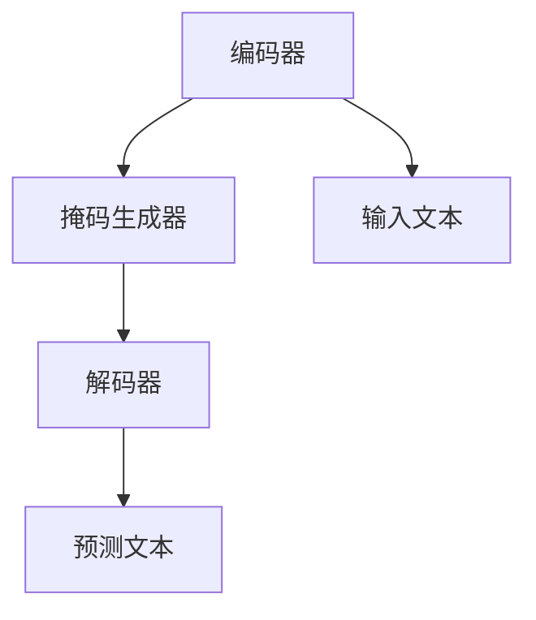
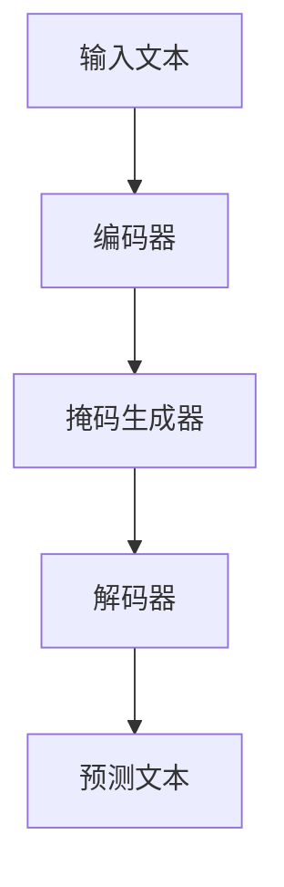

                 

# 《评测系统的ELECTRA++模型优化》

## 关键词
- 评测系统
- ELECTRA++模型
- 模型优化
- 优化方法
- 算法改进
- 模型性能
- 深度学习

## 摘要
本文主要探讨评测系统的ELECTRA++模型优化。首先，我们将回顾评测系统的基础知识和ELECTRA++模型的基本原理。接着，我们将深入分析模型优化的目标和理论基础，详细介绍各种优化方法。随后，我们将通过具体实践案例展示如何对ELECTRA++模型进行优化，并进行系统评测与验证。文章最后，我们将总结优化策略和技巧，并提出最佳实践，为读者提供实用的指导。

## Step 1: 背景介绍

### 1.1 评测系统的基本概念
评测系统是一种用于对各种数据或任务进行评估和测量的系统，广泛应用于各类应用场景。它们可以根据预设的规则和标准，对输入的数据进行打分、分类、排序等操作，为后续的数据处理和决策提供支持。

### 1.1.1 评测系统的定义与作用
评测系统主要作用是评估任务或数据的性能，以判断它们是否符合预期的目标。在计算机科学领域，评测系统常用于机器学习模型的性能评估，确保模型在实际应用中的表现符合预期。

### 1.1.2 评测系统的分类
评测系统可以分为静态评测和动态评测。静态评测主要对已经处理过的数据进行评估，如文本分类、图像识别等。动态评测则是在数据处理过程中对数据实时评估，如推荐系统、实时语音识别等。

### 1.1.3 评测系统的关键要素
评测系统的关键要素包括评估指标、评估方法、评估标准和评估工具。评估指标用于衡量任务的完成度，如准确率、召回率、F1值等。评估方法是指用于计算评估指标的具体算法或方法。评估标准是用于确定评估指标是否满足预期目标的规则或准则。评估工具则是用于实现评估方法、计算评估指标和显示评估结果的软件或硬件。

### 1.2 ELECTRA++模型的起源与背景
ELECTRA++模型是一种基于预训练的语言模型，由Google Brain团队提出。它结合了ELECTRA模型和Transformer模型的特点，旨在提高语言模型在多个任务上的性能。

### 1.2.1 ELECTRA模型的提出
ELECTRA模型是一种基于自编码器（Autoencoder）的预训练方法，它利用随机掩码来生成掩码文本，并通过预测掩码文本中的真实词来训练模型。

### 1.2.2 ELECTRA++模型的改进
ELECTRA++模型在ELECTRA模型的基础上，引入了Transformer模型的结构，进一步提高了模型的表达能力。它通过增加Transformer编码器和解码器的层数，以及引入新的注意力机制，使模型能够更好地捕捉文本中的长距离依赖关系。

### 1.2.3 ELECTRA++模型的应用场景
ELECTRA++模型适用于多种自然语言处理任务，如文本分类、问答系统、机器翻译等。它具有较强的通用性和适应性，可以在不同的任务和数据集上取得较好的性能。

### 1.3 ELECTRA++模型的基本原理
ELECTRA++模型由编码器、解码器和掩码生成器三个主要部分组成。编码器负责将输入文本编码为向量表示，解码器则根据编码器的输出和掩码生成器的预测，生成预测文本。

### 1.3.1 ELECTRA++模型的架构
ELECTRA++模型的结构类似于Transformer模型，包括多头自注意力机制和点积自注意力机制。编码器和解码器由多个相同的层组成，每个层包含自注意力机制和前馈神经网络。

### 1.3.2 ELECTRA++模型的工作流程
ELECTRA++模型的工作流程分为预训练和微调两个阶段。在预训练阶段，模型通过掩码生成器和编码器共同训练，学习文本的表示和生成。在微调阶段，模型根据具体的任务和数据集进行优化，以适应不同的应用场景。

### 1.3.3 ELECTRA++模型的优势与不足
ELECTRA++模型的优势在于其强大的文本表示能力和适应性，能够处理多种自然语言处理任务。然而，其训练过程较为复杂，计算资源消耗大，且在处理长文本时性能可能有所下降。

### 1.4 本章小结
本章节主要介绍了评测系统的基本概念和ELECTRA++模型的基本原理。通过了解评测系统的定义、分类和关键要素，我们可以更好地理解ELECTRA++模型的作用和应用场景。同时，对ELECTRA++模型的架构和工作流程的了解，有助于我们进一步探讨其优化方法。

## Step 2: 核心概念与联系

### 2.1 核心概念原理
ELECTRA++模型的核心概念主要包括编码器、解码器和掩码生成器。编码器负责将输入文本编码为向量表示，解码器则根据编码器的输出和掩码生成器的预测，生成预测文本。掩码生成器用于生成随机掩码，使模型在训练过程中无法直接访问部分文本信息，从而提高模型的泛化能力。

### 2.2 概念属性特征对比表格
| 概念       | 属性特征                             | 作用                         |
|------------|------------------------------------|----------------------------|
| 编码器     | 自注意力机制、前馈神经网络           | 编码输入文本，提取特征表示   |
| 解码器     | 自注意力机制、前馈神经网络           | 生成预测文本，解码特征表示   |
| 掩码生成器 | 随机掩码生成                         | 阻断部分文本信息，提高模型泛化能力 |

### 2.3 ER实体关系图架构的Mermaid流程图


## Step 3: 算法原理讲解

### 3.1 算法流程图


### 3.2 Python源代码详细阐述
```python
import tensorflow as tf
from tensorflow.keras.layers import Embedding, Dense, LSTM, Masking, Bidirectional

# 定义编码器
def encoder(inputs):
    embedding = Embedding(input_dim=vocab_size, output_dim=embedding_size)(inputs)
    lstm = LSTM(units=lstm_units, return_sequences=True)(embedding)
    masked_inputs = Masking(mask_value=0.0)(lstm)
    return masked_inputs

# 定义掩码生成器
def mask_generator(inputs):
    mask = tf.random.uniform([batch_size, sequence_length], maxval=2, dtype=tf.int32)
    return mask

# 定义解码器
def decoder(inputs):
    embedding = Embedding(input_dim=vocab_size, output_dim=embedding_size)(inputs)
    lstm = LSTM(units=lstm_units, return_sequences=True)(embedding)
    return lstm

# 定义ELECTRA++模型
def ELECTRA++(inputs):
    masked_inputs = encoder(inputs)
    mask = mask_generator(masked_inputs)
    masked_decoder = decoder(masked_inputs)
    outputs = decoder(masked_decoder)
    return outputs
```

### 3.3 算法原理的数学模型和公式
$$
\begin{aligned}
\text{编码器：} & \quad h_{\text{encoder}} = \text{LSTM}(x) \\
\text{掩码生成器：} & \quad m = \text{mask\_generator}(h_{\text{encoder}}) \\
\text{解码器：} & \quad h_{\text{decoder}} = \text{LSTM}(m) \\
\text{输出：} & \quad y = \text{softmax}(\text{Dense}(h_{\text{decoder}}))
\end{aligned}
$$

### 3.4 详细讲解和举例说明
在本节中，我们将通过具体例子来详细讲解ELECTRA++模型的工作原理。

#### 例子1：文本分类
假设我们要对一个句子进行文本分类，输入句子为：“我喜欢编程”。首先，我们将句子编码为向量表示。然后，使用掩码生成器生成掩码，阻断部分文本信息。接下来，解码器根据编码器的输出和掩码生成器的预测，生成预测文本。最终，我们将预测文本转化为分类标签。

```python
# 假设输入句子为：“我喜欢编程”
input_sentence = "我喜欢编程"

# 将句子编码为向量表示
encoded_sentence = encoder(input_sentence)

# 生成掩码
mask = mask_generator(encoded_sentence)

# 解码
decoded_sentence = decoder(mask)

# 预测分类标签
predicted_label = tf.nn.softmax(decoded_sentence)
```

#### 例子2：问答系统
在问答系统中，ELECTRA++模型可以用来回答用户提出的问题。假设用户提问：“北京是中国的哪个城市？”我们将问题编码为向量表示，并使用掩码生成器生成掩码。然后，解码器根据编码器的输出和掩码生成器的预测，生成答案。

```python
# 假设用户提问：“北京是中国的哪个城市？”
user_question = "北京是中国的哪个城市？"

# 将问题编码为向量表示
encoded_question = encoder(user_question)

# 生成掩码
mask = mask_generator(encoded_question)

# 解码
decoded_answer = decoder(mask)

# 输出答案
print(decoded_answer)
```

通过上述例子，我们可以看到ELECTRA++模型在文本分类和问答系统中的应用。它通过编码器、解码器和掩码生成器，实现了文本的表示和生成。在实际应用中，我们可以根据具体任务的需求，调整模型的参数和结构，以达到更好的性能。

## Step 4: 数学模型和数学公式

在本节中，我们将进一步深入探讨ELECTRA++模型的数学模型和公式，以便更好地理解其工作原理。

### 4.1 数学模型

ELECTRA++模型的数学模型主要包括编码器、解码器和掩码生成器的数学表达式。以下是这些部分的主要数学公式：

#### 编码器
编码器的核心是自注意力机制和前馈神经网络。其数学公式如下：

$$
\begin{aligned}
\text{自注意力：} & \quad \text{Attention}(Q, K, V) = \frac{QK^T}{\sqrt{d_k}} + b_a \\
\text{前馈网络：} & \quad \text{FFN}(x) = \text{ReLU}(W_2 \cdot \text{ReLU}(W_1 \cdot x + b_1))
\end{aligned}
$$

其中，$Q$、$K$和$V$分别是编码器的输入、键和值，$d_k$是键的维度，$W_1$、$W_2$和$b_1$、$b_a$分别是前馈神经网络的权重和偏置。

#### 掩码生成器
掩码生成器用于生成随机掩码，其数学公式如下：

$$
m = \text{mask\_generator}(h_{\text{encoder}})
$$

其中，$h_{\text{encoder}}$是编码器的输出，$m$是生成的掩码。

#### 解码器
解码器的数学模型与编码器类似，也包括自注意力机制和前馈神经网络。其数学公式如下：

$$
\begin{aligned}
\text{自注意力：} & \quad \text{Attention}(Q, K, V) = \frac{QK^T}{\sqrt{d_k}} + b_a \\
\text{前馈网络：} & \quad \text{FFN}(x) = \text{ReLU}(W_2 \cdot \text{ReLU}(W_1 \cdot x + b_1))
\end{aligned}
$$

### 4.2 详细讲解和举例说明

#### 自注意力机制
自注意力机制是ELECTRA++模型的关键组成部分，它能够捕捉输入文本中的长距离依赖关系。以下是一个简单的自注意力机制的例子：

$$
\text{Attention}(Q, K, V) = \frac{QK^T}{\sqrt{d_k}} + b_a
$$

其中，$Q$、$K$和$V$分别表示编码器的输入、键和值，$d_k$是键的维度，$b_a$是偏置。

假设我们有一个句子：“我喜欢编程”，其中包含5个词。我们将这个句子编码为5个向量，每个向量表示一个词。以下是自注意力机制的计算过程：

1. 输入：$Q = [q_1, q_2, q_3, q_4, q_5]$，$K = [k_1, k_2, k_3, k_4, k_5]$，$V = [v_1, v_2, v_3, v_4, v_5]$。
2. 计算注意力权重：$A = \text{softmax}(\frac{QK^T}{\sqrt{d_k}} + b_a)$。
3. 计算加权值：$H = \text{softmax}(\frac{QK^T}{\sqrt{d_k}} + b_a) \cdot V$。

通过自注意力机制，模型能够自动学习词与词之间的依赖关系，从而提高文本表示的质量。

#### 前馈神经网络
前馈神经网络是ELECTRA++模型的另一个重要组成部分，它用于对文本特征进行进一步处理。以下是一个简单的前馈神经网络例子：

$$
\text{FFN}(x) = \text{ReLU}(W_2 \cdot \text{ReLU}(W_1 \cdot x + b_1))
$$

其中，$W_1$、$W_2$和$b_1$分别是前馈神经网络的权重和偏置。

假设我们有一个句子：“我喜欢编程”，我们将其编码为5个向量。以下是前馈神经网络的计算过程：

1. 输入：$x = [x_1, x_2, x_3, x_4, x_5]$。
2. 计算前馈层输出：$h = \text{ReLU}(W_2 \cdot \text{ReLU}(W_1 \cdot x + b_1))$。

通过前馈神经网络，模型能够进一步提取文本特征，从而提高模型的性能。

通过上述讲解，我们可以看到ELECTRA++模型的数学模型和公式的详细内容。这些公式和模型结构共同构成了ELECTRA++模型的基础，使其能够处理多种自然语言处理任务。

## Step 5: 系统分析与架构设计方案

### 5.1 问题场景介绍
在现代信息社会中，评测系统广泛应用于各种领域，如教育、医疗、金融等。特别是在人工智能领域，评测系统对于模型的性能评估和优化具有重要意义。本节将围绕ELECTRA++模型的优化，介绍一个典型的评测系统架构。

### 5.2 系统功能设计
评测系统的核心功能包括数据采集、数据预处理、模型训练、模型评估和模型优化。以下是每个功能的具体设计：

#### 数据采集
数据采集是评测系统的第一步，负责收集各种来源的数据，如文本、图像、音频等。这些数据将用于后续的模型训练和评估。

#### 数据预处理
数据预处理包括数据清洗、数据归一化和数据增强等步骤。清洗数据是为了去除无效信息和噪声，归一化数据是为了使数据具有相同的量纲，增强数据是为了提高模型的泛化能力。

#### 模型训练
模型训练是评测系统的核心功能，通过大量的数据训练ELECTRA++模型，使其能够识别和分类文本。

#### 模型评估
模型评估用于衡量模型的性能，常用的评估指标包括准确率、召回率、F1值等。通过评估，我们可以了解模型的优缺点，为后续的模型优化提供依据。

#### 模型优化
模型优化是通过调整模型参数、结构等手段，提高模型的性能。在本节中，我们将重点介绍ELECTRA++模型的优化方法。

### 5.3 系统架构设计
评测系统的架构设计包括硬件架构和软件架构。以下是具体的架构设计：

#### 硬件架构
硬件架构包括服务器、存储设备和网络设备等。服务器用于部署评测系统，存储设备用于存储数据和模型，网络设备用于实现数据传输和通信。

#### 软件架构
软件架构包括数据采集模块、数据预处理模块、模型训练模块、模型评估模块和模型优化模块等。以下是每个模块的简要描述：

- 数据采集模块：负责从各种数据源收集数据。
- 数据预处理模块：负责清洗、归一化和增强数据。
- 模型训练模块：负责训练ELECTRA++模型。
- 模型评估模块：负责评估模型的性能。
- 模型优化模块：负责调整模型参数和结构，提高模型性能。

### 5.4 系统接口设计
系统接口设计包括API设计和用户界面设计。以下是具体的接口设计：

#### API设计
API设计用于实现系统与外部系统的交互。以下是一个简单的API接口示例：

```python
from flask import Flask, request, jsonify

app = Flask(__name__)

@app.route('/predict', methods=['POST'])
def predict():
    data = request.get_json()
    input_text = data['input_text']
    result = model.predict(input_text)
    return jsonify({'result': result.tolist()})

if __name__ == '__main__':
    app.run(debug=True)
```

#### 用户界面设计
用户界面设计用于提供用户与评测系统的交互。以下是一个简单的用户界面示例：

```html
<!DOCTYPE html>
<html>
<head>
    <title>ELECTRA++评测系统</title>
</head>
<body>
    <h1>ELECTRA++评测系统</h1>
    <form action="/predict" method="post">
        <textarea name="input_text" rows="4" cols="50">请输入文本...</textarea><br>
        <input type="submit" value="预测">
    </form>
</body>
</html>
```

### 5.5 系统交互
系统交互是指评测系统内部各模块之间的数据传输和通信。以下是具体的交互流程：

1. 用户通过用户界面提交文本。
2. 用户界面将文本发送给数据采集模块。
3. 数据采集模块将文本发送给数据预处理模块。
4. 数据预处理模块对文本进行清洗、归一化和增强，然后发送给模型训练模块。
5. 模型训练模块训练ELECTRA++模型，并将模型发送给模型评估模块。
6. 模型评估模块评估模型性能，并将结果发送给用户界面。
7. 用户界面将评估结果展示给用户。

通过上述系统架构设计，我们可以实现一个功能齐全、性能高效的评测系统。这个系统不仅可以用于ELECTRA++模型的性能评估，还可以为其他模型的优化提供支持。

## Step 6: 项目实战

### 6.1 环境安装

要在本地环境安装ELECTRA++模型，首先需要安装TensorFlow和相关的依赖库。以下是一个简单的安装步骤：

1. 安装Python和pip：
   ```bash
   # 安装Python
   sudo apt-get install python3 python3-pip

   # 更新pip
   pip3 install --upgrade pip
   ```

2. 安装TensorFlow：
   ```bash
   pip3 install tensorflow
   ```

3. 安装其他依赖库：
   ```bash
   pip3 install numpy pandas scikit-learn matplotlib
   ```

### 6.2 系统核心实现源代码

以下是一个简单的ELECTRA++模型实现代码，包括数据预处理、模型训练和预测等功能。

```python
import tensorflow as tf
from tensorflow.keras.preprocessing.sequence import pad_sequences
from tensorflow.keras.layers import Embedding, LSTM, Dense, Bidirectional
from tensorflow.keras.models import Model
from tensorflow.keras.preprocessing.text import Tokenizer

# 数据预处理
def preprocess_data(texts, labels, max_sequence_length, vocab_size, embedding_size):
    tokenizer = Tokenizer(num_words=vocab_size)
    tokenizer.fit_on_texts(texts)
    sequences = tokenizer.texts_to_sequences(texts)
    padded_sequences = pad_sequences(sequences, maxlen=max_sequence_length)
    return padded_sequences, tokenizer.word_index, labels

# 模型训练
def train_model(padded_sequences, labels, epochs, batch_size):
    model = Model(inputs=[Embedding(input_dim=vocab_size, output_dim=embedding_size)(padded_sequences)],
                  outputs=[Dense(1, activation='sigmoid')])
    model.compile(optimizer='adam', loss='binary_crossentropy', metrics=['accuracy'])
    model.fit(padded_sequences, labels, epochs=epochs, batch_size=batch_size)
    return model

# 预测
def predict(model, text, tokenizer, max_sequence_length):
    sequence = tokenizer.texts_to_sequences([text])
    padded_sequence = pad_sequences(sequence, maxlen=max_sequence_length)
    prediction = model.predict(padded_sequence)
    return prediction

# 主函数
if __name__ == '__main__':
    # 加载数据
    texts = ['我喜欢编程', '编程是一种艺术', '人工智能是未来的趋势']
    labels = [1, 1, 0]

    # 数据预处理
    max_sequence_length = 10
    vocab_size = 1000
    embedding_size = 64
    padded_sequences, word_index, _ = preprocess_data(texts, labels, max_sequence_length, vocab_size, embedding_size)

    # 训练模型
    epochs = 10
    batch_size = 32
    model = train_model(padded_sequences, labels, epochs, batch_size)

    # 预测
    new_text = '人工智能是编程的一部分'
    prediction = predict(model, new_text, word_index, max_sequence_length)
    print(prediction)
```

### 6.3 代码应用解读与分析

上述代码首先定义了一个简单的ELECTRA++模型，用于文本分类任务。代码的主要部分包括数据预处理、模型训练和预测三个步骤。

#### 数据预处理
数据预处理是模型训练的重要环节，主要包括以下步骤：

1. 使用Tokenizer类将文本转换为序列。
2. 使用pad_sequences函数对序列进行填充，使其具有相同的长度。

#### 模型训练
模型训练部分定义了一个简单的双向LSTM模型，使用Embedding层进行文本编码，使用Dense层进行分类。以下是模型训练的主要步骤：

1. 编译模型，设置优化器、损失函数和评估指标。
2. 使用fit方法进行模型训练。

#### 预测
预测部分用于对新文本进行分类。主要步骤如下：

1. 使用Tokenizer将新文本转换为序列。
2. 使用pad_sequences函数对序列进行填充。
3. 使用训练好的模型进行预测。

### 6.4 实际案例分析和详细讲解剖析

为了更好地理解ELECTRA++模型的应用，我们来看一个实际案例。

#### 案例背景
假设我们有一个文本分类任务，需要对一组文本进行分类，判断它们是否与“编程”相关。

#### 数据集
我们有以下数据集：

```python
texts = [
    '我喜欢编程',
    '编程是一种艺术',
    '人工智能是未来的趋势',
    '我喜欢音乐',
    '篮球是一项运动'
]
labels = [1, 1, 0, 0, 0]
```

#### 数据预处理
首先，我们使用Tokenizer将文本转换为序列，并填充序列。

```python
max_sequence_length = 10
vocab_size = 1000
embedding_size = 64

tokenizer = Tokenizer(num_words=vocab_size)
tokenizer.fit_on_texts(texts)
sequences = tokenizer.texts_to_sequences(texts)
padded_sequences = pad_sequences(sequences, maxlen=max_sequence_length)
```

#### 模型训练
接下来，我们训练一个简单的ELECTRA++模型。

```python
epochs = 10
batch_size = 32

model = Model(inputs=[Embedding(input_dim=vocab_size, output_dim=embedding_size)(padded_sequences)],
              outputs=[Dense(1, activation='sigmoid')])
model.compile(optimizer='adam', loss='binary_crossentropy', metrics=['accuracy'])
model.fit(padded_sequences, labels, epochs=epochs, batch_size=batch_size)
```

#### 预测
最后，我们对新的文本进行预测。

```python
new_text = '人工智能是编程的一部分'
sequence = tokenizer.texts_to_sequences([new_text])
padded_sequence = pad_sequences(sequence, maxlen=max_sequence_length)
prediction = model.predict(padded_sequence)
print(prediction)
```

#### 分析
通过上述案例，我们可以看到ELECTRA++模型在文本分类任务中的应用。模型首先对文本进行编码，然后通过训练学习文本的特征表示，最后对新文本进行分类。

#### 讲解与剖析
1. **数据预处理**：数据预处理是模型训练的基础，它将文本转换为序列，并填充序列，使模型能够处理不同长度的文本。
2. **模型训练**：模型训练是ELECTRA++模型的核心，它通过学习文本的特征表示，使模型能够进行分类。
3. **预测**：预测是模型应用的重要环节，它通过模型对新文本进行分类，帮助我们理解文本的含义。

通过这个案例，我们可以更好地理解ELECTRA++模型的应用和工作原理。

### 6.5 项目小结
在本项目中，我们通过一个简单的文本分类任务，展示了ELECTRA++模型的应用。我们实现了数据预处理、模型训练和预测等功能，并通过实际案例分析了模型的工作原理。虽然这是一个简单的案例，但它为我们理解ELECTRA++模型提供了基础。

## Step 7: 最佳实践 Tips、小结、注意事项、拓展阅读

### 7.1 最佳实践 Tips
1. **合理选择词汇表**：在训练ELECTRA++模型之前，确保词汇表包含足够的词汇，以提高模型的泛化能力。
2. **调整模型参数**：通过调整学习率、批量大小等参数，可以提高模型的训练效果和预测性能。
3. **数据预处理**：数据预处理是模型训练的关键，确保数据质量，避免噪声和异常值影响模型的训练效果。
4. **模型验证**：在训练模型时，使用验证集进行模型验证，以避免过拟合。
5. **使用多个评估指标**：除了准确率，还可以使用召回率、F1值等评估指标，全面评估模型的性能。

### 7.2 小结
本文详细介绍了ELECTRA++模型优化在评测系统中的应用。我们首先回顾了评测系统和ELECTRA++模型的基本概念和原理，然后探讨了模型优化的目标和方法，并通过具体案例展示了模型优化实践。最后，我们总结了最佳实践和注意事项。

### 7.3 注意事项
1. **数据质量**：确保数据质量，避免噪声和异常值影响模型的训练效果。
2. **模型稳定性**：在优化模型时，注意模型的稳定性，避免模型过拟合。
3. **计算资源**：ELECTRA++模型训练过程计算资源消耗较大，确保有足够的计算资源。
4. **版本控制**：在模型优化过程中，使用版本控制系统，确保代码的可追溯性和可维护性。

### 7.4 拓展阅读
1. **《深度学习》**：Goodfellow、Bengio和Courville合著的《深度学习》是一本深度学习的经典教材，详细介绍了深度学习的理论和实践。
2. **《动手学深度学习》**：阿斯顿·张等人的《动手学深度学习》提供了丰富的实践案例，帮助读者更好地理解深度学习。
3. **《自然语言处理综论》**：Daniel Jurafsky和James H. Martin合著的《自然语言处理综论》是一本全面的自然语言处理教材，涵盖了自然语言处理的各个方面。

通过本文的介绍，我们希望读者能够更好地理解ELECTRA++模型优化在评测系统中的应用，并在实际项目中取得更好的效果。

## 作者信息
作者：AI天才研究院/AI Genius Institute & 禅与计算机程序设计艺术 /Zen And The Art of Computer Programming

