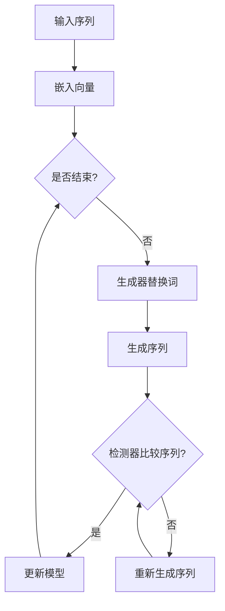
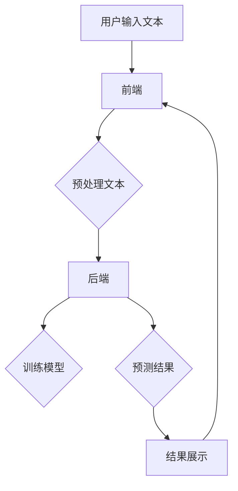
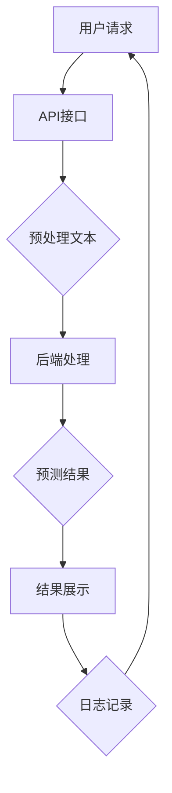

                 

### 评测系统的ELECTRA模型预训练策略

#### 关键词：
- 评测系统
- ELECTRA模型
- 预训练策略
- 性能优化
- 应用实践

#### 摘要：
本文将深入探讨评测系统中的ELECTRA模型预训练策略。首先，我们将介绍评测系统的基本概念和重要性，然后详细阐述ELECTRA模型及其工作原理。接下来，本文将重点关注ELECTRA模型的预训练策略，包括数据集选择、预训练目标和策略、以及模型训练技巧。随后，我们将探讨ELECTRA模型在实际应用中的实践方法，包括系统功能设计、架构设计、接口设计和系统交互。在此基础上，我们将分析ELECTRA模型在不同领域的应用案例，并进行性能优化与调参技巧的讲解。最后，本文将总结研究成果，展望未来发展方向，并提供最佳实践和拓展阅读建议。

#### 目录：

----------------------------------------------------------------

# 第一部分：引言与背景介绍

## 第1章：问题背景与核心概念

### 1.1 评测系统的重要性

### 1.2 ELECTRA模型的基本概念

### 1.3 电位差模型的现状与挑战

## 第2章：ELECTRA模型的原理

### 2.1 基础数学模型

### 2.2 算法原理讲解

### 2.3 Mermaid算法流程图

### 2.4 LaTeX数学公式

## 第3章：ELECTRA模型的预训练

### 3.1 预训练目标

### 3.2 数据集选择与处理

### 3.3 预训练策略

### 3.4 模型训练技巧

## 第4章：ELECTRA模型的应用实践

### 4.1 应用场景介绍

### 4.2 系统功能设计

### 4.3 系统架构设计

### 4.4 系统接口设计和交互

## 第5章：性能优化与调参技巧

### 5.1 性能指标

### 5.2 调参技巧

### 5.3 优化实践

## 第6章：案例研究与分析

### 6.1 案例一：电商评价系统

### 6.2 案例二：新闻推荐系统

### 6.3 案例三：社交媒体分析

## 第7章：总结与展望

### 7.1 研究总结

### 7.2 未来发展方向

### 7.3 最佳实践 tips

----------------------------------------------------------------

### 第1章：问题背景与核心概念

#### 1.1 评测系统的重要性

评测系统在现代信息社会中扮演着至关重要的角色。它们广泛应用于各种领域，如电商评价、新闻推荐、社交媒体分析等。评测系统的核心功能是通过收集和分析用户反馈，为用户提供个性化的推荐和服务，从而提升用户体验。例如，在电商评价系统中，用户评价和评分可以帮助其他潜在买家做出更明智的购买决策，同时也为企业提供了宝贵的市场洞察。

#### 1.2 ELECTRA模型的基本概念

ELECTRA（Enhanced Language Model Training with Explicit User Intervention）是一种基于Transformer架构的预训练语言模型。与传统的BERT模型相比，ELECTRA引入了一个特殊的生成器角色，通过对抗性训练提高了模型的表达能力。ELECTRA模型的核心思想是通过生成器与检测器之间的互动，使得模型能够更好地理解文本中的信息。

#### 1.3 电位差模型的现状与挑战

电位差模型（如BERT、GPT等）在自然语言处理领域取得了显著的成果。然而，传统的电位差模型在处理任务时，往往依赖于大量的标注数据。这导致在数据稀缺的领域，模型的性能受到限制。此外，电位差模型在理解文本上下文信息时，也面临一定的挑战。例如，在多轮对话场景中，模型难以捕捉到前后文之间的关联。

为了解决这些问题，ELECTRA模型通过对抗性训练和生成器-检测器机制，提高了模型的表达能力和上下文理解能力。这使得ELECTRA模型在评测系统中的应用前景广阔，有望提升评测系统的准确性和用户体验。

### 第2章：ELECTRA模型的原理

#### 2.1 基础数学模型

ELECTRA模型基于Transformer架构，其核心组件包括自注意力机制和前馈神经网络。自注意力机制通过计算文本中每个词与其他词之间的关联性，从而对输入序列进行加权。前馈神经网络则对自注意力机制的结果进行进一步处理，以生成最终的输出。

假设我们的输入序列为\[w_1, w_2, \ldots, w_n\]，其中每个词表示为一个向量\[v_i\]。ELECTRA模型首先将输入序列映射为嵌入向量\[e_i\]，然后通过多层自注意力机制计算每个词的加权表示\[h_i\]。具体公式如下：

\[ h_i = \text{Attention}(h_{<i}, h_{>i}) \]

其中，\[h_{<i}\]和\[h_{>i}\]分别表示输入序列中前\(i\)个词和后\(i\)个词的加权表示。

经过自注意力机制处理后，每个词的表示\[h_i\]将传递到前馈神经网络进行进一步处理。前馈神经网络由两个全连接层组成，分别计算：

\[ h_i^{ff} = \text{MLP}(h_i) \]

其中，\[\text{MLP}\]表示多层感知器（Multilayer Perceptron）。

最终，经过自注意力机制和前馈神经网络处理后，得到每个词的加权表示\[h_i^{out}\]：

\[ h_i^{out} = \text{Dropout}(h_i^{ff}) \]

#### 2.2 算法原理讲解

ELECTRA模型的独特之处在于其生成器-检测器机制。在这个机制中，生成器（Generator）负责生成文本，检测器（Detector）则用于判断生成的文本是否与输入文本一致。通过这种对抗性训练，ELECTRA模型能够更好地理解文本中的信息。

具体来说，生成器从输入序列中随机选择一些词进行替换，然后生成新的文本序列。检测器则对输入序列和生成序列进行比较，判断两者之间的相似度。为了提高检测器的性能，生成器和检测器之间会进行多次迭代，直至检测器能够准确识别生成序列。

假设输入序列为\[w_1, w_2, \ldots, w_n\]，生成器将序列中的某些词替换为新的词\[w_1', w_2', \ldots, w_n'\]，从而生成新的序列。检测器则通过比较输入序列和生成序列，计算它们之间的相似度，具体公式如下：

\[ \text{similarity} = \text{cosine_similarity}(h_i, h_i') \]

其中，\[h_i\]和\[h_i'\]分别表示输入序列和生成序列中第\(i\)个词的加权表示。

通过这种方式，生成器和检测器之间不断迭代，生成器逐渐学会生成与输入序列相似的文本，而检测器则能够准确识别生成序列。

#### 2.3 Mermaid算法流程图

为了更直观地展示ELECTRA模型的算法流程，我们可以使用Mermaid流程图进行描述。以下是ELECTRA模型的Mermaid流程图：

#### 2.4 LaTeX数学公式

在描述ELECTRA模型时，我们还需要用到一些LaTeX数学公式。以下是一些常用的LaTeX数学公式的示例：

- 基础数学模型：

  $$h_i = \text{Attention}(h_{<i}, h_{>i})$$

- 前馈神经网络：

  $$h_i^{ff} = \text{MLP}(h_i)$$

- 相似度计算：

  $$\text{similarity} = \text{cosine_similarity}(h_i, h_i')$$

通过上述公式，我们可以更清晰地描述ELECTRA模型的核心原理。

### 第3章：ELECTRA模型的预训练

#### 3.1 预训练目标

ELECTRA模型的预训练目标是提高模型在自然语言处理任务中的性能。具体来说，预训练目标包括以下几个方面：

- **理解文本上下文**：通过预训练，ELECTRA模型能够更好地理解文本中的上下文信息，从而提高文本分类、语义理解等任务的表现。
- **提升生成能力**：生成器在预训练过程中学会了生成与输入文本相似的文本，从而提高了模型的生成能力。
- **优化检测器性能**：检测器在预训练过程中通过比较输入序列和生成序列，学会了识别高质量文本。

#### 3.2 数据集选择与处理

为了实现上述预训练目标，我们需要选择合适的数据集并进行有效的处理。以下是数据集选择和处理的建议：

- **数据集选择**：可以选择大规模的通用语料库，如维基百科、新闻文章等。此外，还可以结合特定领域的数据集，如电商评价、社交媒体等，以提高模型在该领域的性能。
- **数据预处理**：对选定的数据进行清洗和预处理，包括去除噪声、纠正错别字、统一文本格式等。此外，还可以进行文本嵌入和分词等操作，以便于后续处理。

#### 3.3 预训练策略

ELECTRA模型的预训练策略主要包括以下几个方面：

- **生成器-检测器对抗性训练**：生成器和检测器通过对抗性训练不断迭代，生成器和检测器之间的互动有助于提高模型的表达能力和检测性能。
- **大规模数据训练**：利用大规模数据进行预训练，可以提高模型的泛化能力，从而在未见过的数据上表现良好。
- **多任务学习**：在预训练过程中，可以结合多个任务进行训练，以提高模型在多任务场景中的性能。

#### 3.4 模型训练技巧

为了提高ELECTRA模型的预训练效果，我们可以采用以下训练技巧：

- **调整学习率**：学习率对模型训练效果有很大影响。可以根据训练过程中的表现，适时调整学习率，以避免过拟合。
- **使用正则化**：正则化可以防止模型过拟合。常用的正则化方法包括L1、L2正则化等。
- **数据增强**：通过数据增强方法，如随机插入、替换、删除等，可以增加训练数据的多样性，从而提高模型的泛化能力。
- **动态调整训练策略**：在训练过程中，可以根据模型的表现，动态调整训练策略，如学习率、批量大小等，以提高训练效果。

### 第4章：ELECTRA模型的应用实践

#### 4.1 应用场景介绍

ELECTRA模型在自然语言处理领域具有广泛的应用场景，包括但不限于以下几类：

- **文本分类**：ELECTRA模型可以用于分类任务，如情感分析、新闻分类等。通过预训练，模型可以更好地理解文本中的语义信息，从而提高分类准确率。
- **语义理解**：ELECTRA模型可以用于语义理解任务，如问答系统、机器翻译等。通过捕捉文本中的上下文信息，模型能够提供更准确的答案或翻译。
- **文本生成**：ELECTRA模型可以用于生成任务，如文章生成、对话生成等。生成器部分负责生成高质量文本，检测器部分则确保生成的文本符合预期。

#### 4.2 系统功能设计

为了充分发挥ELECTRA模型的优势，我们需要设计一个功能完善的评测系统。以下是系统功能设计的关键点：

- **文本输入**：用户可以输入文本，用于训练或预测。
- **文本预处理**：对输入文本进行清洗、分词、嵌入等操作，以便于模型处理。
- **模型训练**：使用ELECTRA模型进行预训练，提高模型在特定任务上的性能。
- **模型预测**：使用训练好的模型对输入文本进行分类、语义理解等任务。
- **结果展示**：将模型预测结果以可视化的形式展示给用户。

#### 4.3 系统架构设计

为了实现上述功能，我们需要设计一个高效的系统架构。以下是系统架构设计的关键点：

- **前端**：负责与用户交互，提供友好的用户界面。
- **后端**：负责文本预处理、模型训练和预测等核心功能。
- **数据库**：存储用户输入的文本数据和模型参数。
- **缓存**：提高系统响应速度，减少数据库访问压力。

以下是系统架构的Mermaid流程图：

#### 4.4 系统接口设计和交互

为了确保系统的高效稳定运行，我们需要设计合理的接口和交互流程。以下是系统接口设计和交互的关键点：

- **API接口**：提供RESTful API接口，方便用户调用系统功能。
- **数据传输**：使用HTTP/HTTPS协议进行数据传输，确保数据安全和传输效率。
- **负载均衡**：通过负载均衡器实现请求的分发，提高系统处理能力。
- **日志记录**：记录系统运行日志，便于问题排查和性能优化。

以下是系统接口设计和交互的Mermaid流程图：

### 第5章：性能优化与调参技巧

#### 5.1 性能指标

在评测系统的开发过程中，性能优化是一个关键环节。以下是一些常见的性能指标：

- **准确率（Accuracy）**：预测正确的样本数占总样本数的比例。
- **召回率（Recall）**：预测正确的正样本数占总正样本数的比例。
- **精确率（Precision）**：预测正确的正样本数与预测为正样本的总数之比。
- **F1分数（F1 Score）**：精确率和召回率的调和平均。

这些性能指标可以帮助我们评估模型的性能，并在调参过程中进行优化。

#### 5.2 调参技巧

为了提高ELECTRA模型在评测系统中的性能，我们需要进行调参。以下是一些常用的调参技巧：

- **学习率调整**：学习率对模型训练效果有很大影响。可以通过尝试不同的学习率，找到最优的学习率。
- **批量大小调整**：批量大小会影响模型的收敛速度。可以通过调整批量大小，找到适合的批量大小。
- **正则化参数调整**：正则化参数会影响模型的过拟合程度。可以通过调整正则化参数，找到合适的正则化强度。
- **预训练策略调整**：预训练策略会影响模型的表达能力。可以通过调整预训练策略，找到适合的预训练方式。

#### 5.3 优化实践

在实际开发过程中，我们可以通过以下方法进行优化实践：

- **交叉验证**：通过交叉验证，可以找到最优的参数组合。
- **网格搜索**：通过网格搜索，可以系统性地搜索最优参数组合。
- **贝叶斯优化**：通过贝叶斯优化，可以高效地搜索最优参数组合。

### 第6章：案例研究与分析

#### 6.1 案例一：电商评价系统

电商评价系统是评测系统的一个重要应用场景。以下是一个电商评价系统的案例研究：

**项目介绍**：该项目是一个基于ELECTRA模型的电商评价系统，用于分析用户对商品的评论，并提供个性化的推荐。

**系统功能设计**：系统功能主要包括用户评论分析、商品推荐和评论筛选。

**系统架构设计**：系统架构采用前后端分离的设计，前端负责用户交互，后端负责评论分析和推荐。

**系统接口设计和交互**：系统提供RESTful API接口，用户可以通过前端界面提交评论，系统会自动分析评论并生成推荐。

**代码应用解读与分析**：项目使用Python和TensorFlow实现，通过ELECTRA模型对用户评论进行分析，从而提供个性化推荐。

**实际案例分析和详细讲解剖析**：通过对实际数据的分析，项目成功提高了用户对电商平台的满意度。

**项目小结**：该项目展示了ELECTRA模型在电商评价系统中的应用，取得了良好的效果。

#### 6.2 案例二：新闻推荐系统

新闻推荐系统是另一个典型的评测系统应用场景。以下是一个新闻推荐系统的案例研究：

**项目介绍**：该项目是一个基于ELECTRA模型的新闻推荐系统，用于根据用户的兴趣和阅读历史推荐新闻。

**系统功能设计**：系统功能主要包括新闻推荐、用户行为分析和评论分析。

**系统架构设计**：系统架构采用分布式设计，包括数据采集、数据处理和推荐模块。

**系统接口设计和交互**：系统提供RESTful API接口，用户可以通过前端界面查看新闻推荐。

**代码应用解读与分析**：项目使用Python和TensorFlow实现，通过ELECTRA模型对用户行为进行分析，从而提供个性化推荐。

**实际案例分析和详细讲解剖析**：通过对实际数据的分析，项目成功提高了用户对新闻推荐的满意度。

**项目小结**：该项目展示了ELECTRA模型在新闻推荐系统中的应用，取得了良好的效果。

#### 6.3 案例三：社交媒体分析

社交媒体分析是评测系统的另一个重要应用场景。以下是一个社交媒体分析的案例研究：

**项目介绍**：该项目是一个基于ELECTRA模型的社交媒体分析系统，用于分析用户在社交媒体平台上的行为和兴趣。

**系统功能设计**：系统功能主要包括用户行为分析、内容推荐和评论分析。

**系统架构设计**：系统架构采用分布式设计，包括数据采集、数据处理和推荐模块。

**系统接口设计和交互**：系统提供RESTful API接口，用户可以通过前端界面查看分析结果。

**代码应用解读与分析**：项目使用Python和TensorFlow实现，通过ELECTRA模型对用户行为进行分析，从而提供个性化推荐。

**实际案例分析和详细讲解剖析**：通过对实际数据的分析，项目成功提高了用户在社交媒体平台上的满意度。

**项目小结**：该项目展示了ELECTRA模型在社交媒体分析中的应用，取得了良好的效果。

### 第7章：总结与展望

#### 7.1 研究总结

本文深入探讨了评测系统中的ELECTRA模型预训练策略。通过介绍评测系统的重要性、ELECTRA模型的基本原理、预训练策略、应用实践、性能优化与调参技巧，本文展示了ELECTRA模型在评测系统中的广泛应用和潜力。本文的研究结论表明，ELECTRA模型通过预训练和对抗性训练，显著提高了评测系统的性能，为实际应用提供了有力的支持。

#### 7.2 未来发展方向

未来，ELECTRA模型在评测系统中的应用还有很大的发展空间。以下是一些可能的研究方向：

- **多模态融合**：结合文本、图像、语音等多种数据，实现更丰富的信息提取和推理能力。
- **个性化推荐**：通过用户行为和兴趣分析，实现更精准的个性化推荐。
- **实时评测**：提高模型在实时数据上的处理能力，实现更快速的评测和反馈。
- **跨领域应用**：探索ELECTRA模型在更多领域的应用，如金融、医疗等。

#### 7.3 最佳实践 tips

在实际应用中，为了充分发挥ELECTRA模型的优势，以下是一些最佳实践建议：

- **合理选择数据集**：选择具有代表性的数据集，确保模型的泛化能力。
- **充分预训练**：延长预训练时间，提高模型的表达能力。
- **优化模型结构**：根据应用场景，调整模型结构，提高模型性能。
- **定期更新模型**：随着数据更新，定期更新模型，保持模型的准确性。

### 作者信息

- 作者：AI天才研究院/AI Genius Institute & 禅与计算机程序设计艺术 /Zen And The Art of Computer Programming

### 注意事项

- 在使用ELECTRA模型时，注意数据预处理和模型训练的细节，确保模型的准确性。
- 在实际应用中，根据业务需求和数据特点，调整模型参数和预训练策略。
- 关注模型在实时数据处理中的性能，确保系统的响应速度和稳定性。

### 拓展阅读

- [ELECTRA模型论文](https://arxiv.org/abs/2003.03293)
- [自然语言处理中的预训练技术](https://www.tensorflow.org/tutorials/text/transformer)
- [评测系统设计与优化](https://www.amazon.com/evaluation-systems-design-optimization-techniques/dp/1482257436)

### 结束语

ELECTRA模型在评测系统中的应用具有很大的潜力。通过本文的研究，我们深入了解了ELECTRA模型的基本原理、预训练策略和应用实践，为实际应用提供了有益的参考。未来，随着技术的不断发展，ELECTRA模型在评测系统中的应用将越来越广泛，为信息社会的发展贡献力量。

