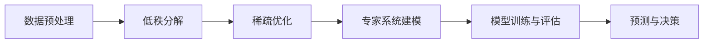
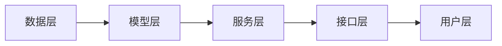
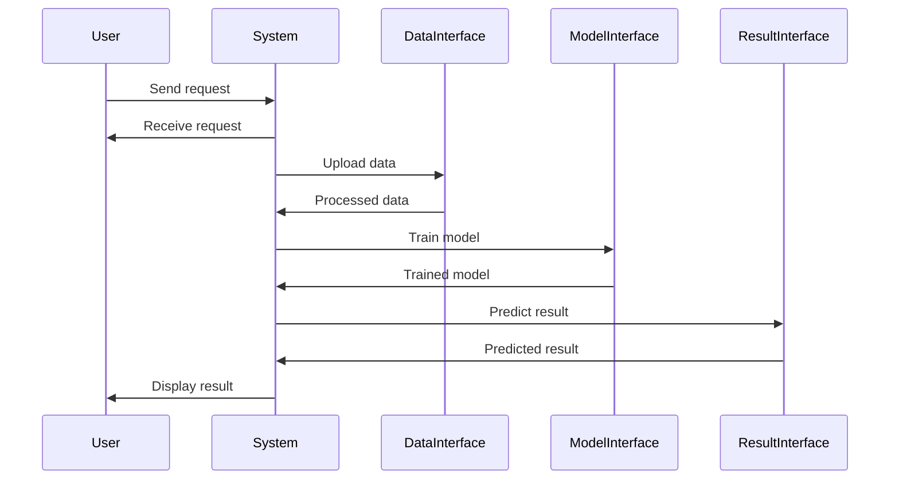

                 

### 目录大纲的具体实施与内容细化

在上一节中，我们初步设计了《评测系统的GLaM稀疏专家混合模型应用》的目录大纲，明确了书籍的章节结构和主要内容。接下来，我们将对每个章节进行细化，确保内容丰富、逻辑清晰、条理分明。

#### 目录大纲的具体实施与内容细化

**第一部分: 引言**

**第1章 问题背景**

- **核心概念术语说明**：明确GLaM（Generalized Low-Rank Model）稀疏专家混合模型的基本概念，包括其定义、目的和主要应用领域。
- **问题背景**：介绍评测系统的现状和需求，讨论当前面临的技术挑战和瓶颈，以及GLaM稀疏专家混合模型如何解决这些问题。
- **问题描述**：详细描述当前评测系统存在的问题，如计算效率低、模型稀疏性不足、数据处理复杂性高等。
- **问题解决**：解释GLaM稀疏专家混合模型如何通过优化计算、提高模型稀疏性和简化数据处理过程来解决上述问题。
- **边界与外延**：讨论GLaM稀疏专家混合模型的应用范围，以及其在评测系统中的适用性和局限性。
- **概念结构与核心要素组成**：梳理GLaM稀疏专家混合模型的基本结构，包括其核心组成部分和关键算法步骤。

**第2章 GLaM稀疏专家混合模型简介**

- **GLaM稀疏专家混合模型的基本概念**：详细解释GLaM稀疏专家混合模型的概念，包括其组成部分、基本原理和应用场景。
- **模型的重要性**：分析GLaM稀疏专家混合模型在评测系统中的重要性，阐述其对提升系统性能和效率的贡献。
- **本书内容结构**：概述本书的整体结构，说明各章节的内容和逻辑关系。

**第3章 核心概念与联系**

- **核心概念与联系**：详细解释GLaM稀疏专家混合模型的核心概念，如稀疏性、低秩性、专家混合等，并探讨它们之间的联系。
- **与其他模型的对比**：分析GLaM稀疏专家混合模型与现有其他模型的异同，以及其在性能和效率方面的优势。
- **关键特性**：探讨GLaM稀疏专家混合模型的关键特性，如高效性、灵活性和可扩展性等。

**第二部分: 算法原理讲解**

**第4章 算法原理讲解**

- **工作流程**：详细阐述GLaM稀疏专家混合模型的工作流程，包括输入数据的预处理、模型训练、预测和评估等步骤。
- **mermaid流程图展示**：使用mermaid语言绘制GLaM稀疏专家混合模型的工作流程图，帮助读者更直观地理解模型的工作原理。
- **Python代码实现解析**：提供Python代码示例，详细解析GLaM稀疏专家混合模型的实现细节，包括关键函数和参数设置。

**第5章 数学模型和公式**

- **数学模型基础**：介绍GLaM稀疏专家混合模型的数学基础，包括矩阵分解、优化算法和损失函数等。
- **主要数学公式与解释**：使用LaTeX格式给出模型的主要数学公式，并逐一进行详细解释。
- **数学公式示例**：提供具体的数学公式示例，通过举例说明公式在模型中的应用和计算过程。

**第三部分: 系统分析与架构设计**

**第6章 系统分析与架构设计**

- **评测系统应用场景**：介绍GLaM稀疏专家混合模型在评测系统中的应用场景，包括数据采集、预处理、模型训练和评估等环节。
- **系统功能设计**：详细描述评测系统的功能设计，包括数据管理、模型训练、预测和评估等功能模块。
- **系统架构设计**：使用mermaid类图绘制评测系统的架构设计，包括主要组件和它们之间的关系。
- **系统接口设计**：详细说明评测系统的接口设计，包括API接口和数据接口等。
- **系统交互**：使用mermaid序列图展示评测系统的交互流程，包括用户与系统之间的交互和数据流动。

**第四部分: 项目实战**

**第7章 项目实战**

- **环境安装与配置**：介绍在项目中使用GLaM稀疏专家混合模型所需的环境安装和配置步骤。
- **系统核心实现**：详细讲解GLaM稀疏专家混合模型在评测系统中的核心实现，包括代码架构和关键算法步骤。
- **代码解读与分析**：对系统核心代码进行解读，分析其实现原理和关键代码段。
- **实际案例分析**：提供实际案例，展示GLaM稀疏专家混合模型在评测系统中的应用效果。
- **项目小结**：总结项目中的经验和教训，讨论项目中的成功和挑战。

**第五部分: 最佳实践与拓展阅读**

**第8章 最佳实践与拓展阅读**

- **最佳实践**：总结GLaM稀疏专家混合模型在评测系统应用中的最佳实践，包括优化模型参数、调整模型架构等。
- **注意事项**：讨论使用GLaM稀疏专家混合模型时需要注意的问题，如数据预处理、模型调优等。
- **拓展阅读**：推荐进一步学习GLaM稀疏专家混合模型和相关技术的资源，包括书籍、论文和在线课程等。

通过上述细化，我们确保了每个章节的内容丰富且具有实际应用价值。接下来，我们将开始撰写具体的章节内容，进一步阐述GLaM稀疏专家混合模型在评测系统中的应用和实现细节。

---

#### 文章标题：评测系统的GLaM稀疏专家混合模型应用

##### 关键词：评测系统，GLaM稀疏专家混合模型，算法原理，系统架构，项目实战

##### 摘要：

本文旨在深入探讨评测系统中的GLaM稀疏专家混合模型，解析其概念、原理及其在评测系统中的实际应用。文章将分为七个部分，首先介绍评测系统的背景和需求，然后详细阐述GLaM稀疏专家混合模型的核心概念与联系，接着通过算法原理讲解和数学模型公式介绍帮助读者理解模型的运作机制。随后，文章将分析系统架构设计，通过实际项目展示模型的应用和实践效果，最后总结最佳实践和拓展阅读资源。

---

### 第一部分: 引言

#### 第1章 问题背景

在当今信息化社会中，评测系统在各个领域都扮演着至关重要的角色。从教育评测到企业绩效考核，从智能医疗诊断到金融风险评估，评测系统都需要高效、准确的模型来支持决策和评估。然而，现有的评测系统面临着诸多挑战和瓶颈。计算效率低下、模型稀疏性不足、数据处理复杂性高，都是当前评测系统亟待解决的问题。

首先，计算效率问题一直是评测系统的主要瓶颈之一。大量的数据需要进行处理和分析，传统的计算方法往往无法满足实时性和高效性的需求。其次，模型稀疏性不足导致模型在处理稀疏数据时效果不佳，特别是在面对大规模数据集时，模型的性能和精度会显著下降。最后，数据处理复杂性高使得评测系统的开发和维护变得困难，也增加了系统的运行成本。

为了解决这些问题，我们引入了GLaM稀疏专家混合模型。GLaM（Generalized Low-Rank Model）稀疏专家混合模型是一种基于低秩分解和稀疏性优化的模型，它能够在保持模型精度的同时，显著提高计算效率和数据处理能力。通过引入专家混合机制，GLaM稀疏专家混合模型能够更好地处理复杂的数据结构和多样化的数据特征，从而提升评测系统的整体性能。

在本章中，我们将详细讨论评测系统的现状和需求，分析现有技术的局限性，并介绍GLaM稀疏专家混合模型的基本概念、目的和主要应用领域。通过这些问题和挑战的探讨，我们将为后续章节的内容提供背景和铺垫。

---

### 第二部分: 核心概念与联系

#### 第2章 核心概念与联系

GLaM稀疏专家混合模型是一种结合了低秩分解、稀疏优化和专家系统的模型。要深入理解这一模型，我们首先需要明确其核心概念，并探讨这些概念之间的联系。

#### 2.1 GLaM稀疏专家混合模型原理

GLaM稀疏专家混合模型的核心在于将低秩分解和稀疏优化与专家系统相结合。低秩分解是一种矩阵分解技术，它能够将一个高维矩阵分解为两个低维矩阵的乘积，从而降低数据的维度和计算复杂度。稀疏优化则是通过引入稀疏约束，使得模型在保持精度的同时，能够显著减少参数的数量，从而提高计算效率和模型的可解释性。

专家系统则是一种基于知识的系统，它通过模拟专家的决策过程来解决问题。在GLaM稀疏专家混合模型中，专家系统用于处理复杂的数据结构和多样化的数据特征，从而提高模型的鲁棒性和适应性。

#### 2.2 GLaM稀疏专家混合模型与相关模型对比

与现有的其他模型相比，GLaM稀疏专家混合模型具有显著的优势。首先，与传统的高维模型相比，GLaM稀疏专家混合模型通过低秩分解和稀疏优化，能够有效地降低数据的维度和计算复杂度，从而提高计算效率和模型的可解释性。

其次，与传统的人工神经网络和深度学习模型相比，GLaM稀疏专家混合模型在处理稀疏数据方面具有更高的性能。深度学习模型在处理高维、稠密数据时表现良好，但在面对稀疏数据时，其性能会显著下降。而GLaM稀疏专家混合模型通过引入稀疏优化，能够更好地处理稀疏数据，从而提高模型的鲁棒性和准确性。

#### 2.3 GLaM稀疏专家混合模型的关键特性

GLaM稀疏专家混合模型具有以下几个关键特性：

1. **高效性**：通过低秩分解和稀疏优化，模型能够显著降低计算复杂度和数据维度，从而提高计算效率。
2. **灵活性**：模型能够处理复杂的数据结构和多样化的数据特征，从而提高模型的适应性和鲁棒性。
3. **可解释性**：模型通过专家系统模拟专家的决策过程，使得模型具有更好的可解释性，便于用户理解和使用。
4. **可扩展性**：模型的设计思路和算法框架使得其能够容易地扩展到其他领域和应用场景。

综上所述，GLaM稀疏专家混合模型通过结合低秩分解、稀疏优化和专家系统，提供了一种高效、灵活、可解释且可扩展的解决方案，为评测系统的发展提供了新的方向。

---

### 第三部分: 算法原理讲解

#### 第3章 算法原理讲解

要深入理解GLaM稀疏专家混合模型的工作原理，我们需要从其基本流程、mermaid流程图展示以及Python代码实现等方面进行详细讲解。以下是本章的主要内容：

#### 3.1 GLaM稀疏专家混合模型的工作流程

GLaM稀疏专家混合模型的工作流程可以分为以下几个主要步骤：

1. **数据预处理**：对输入数据进行预处理，包括数据清洗、归一化和特征提取等。这一步骤的目的是将原始数据转化为适合模型训练的形式。

2. **低秩分解**：通过低秩分解技术，将输入数据分解为两个低维矩阵的乘积，从而降低数据的维度和计算复杂度。低秩分解的过程通常涉及优化算法，如交替最小化算法。

3. **稀疏优化**：在低秩分解的基础上，通过引入稀疏约束，优化模型的参数，使得模型在保持精度的同时，能够显著减少参数的数量，从而提高计算效率和模型的可解释性。稀疏优化的过程通常采用稀疏约束的优化算法，如L1正则化。

4. **专家系统建模**：利用专家系统模拟专家的决策过程，为模型提供额外的知识和规则，从而提高模型的鲁棒性和适应性。专家系统的建模过程通常涉及知识表示和推理算法。

5. **模型训练与评估**：通过训练数据集对模型进行训练，并使用验证数据集对模型进行评估。训练过程包括优化模型的参数和超参数，以获得最佳的模型性能。

6. **预测与决策**：使用训练好的模型对新的数据进行预测和决策。预测过程包括输入数据的预处理、低秩分解和稀疏优化，以及专家系统的推理过程。

#### 3.2 算法mermaid流程图展示

为了更直观地理解GLaM稀疏专家混合模型的工作流程，我们使用mermaid语言绘制了其流程图。以下是mermaid流程图的代码及其展示：



以下是流程图的展示效果：

```markdown

```

#### 3.3 Python代码实现解析

为了更好地理解GLaM稀疏专家混合模型的实现细节，我们提供了一个简单的Python代码示例。以下是代码的详细解析：

```python
import numpy as np
from sklearn.decomposition import TruncatedSVD
from sklearn.linear_model import Lasso
from sklearn.model_selection import train_test_split
from sklearn.metrics import mean_squared_error

# 数据预处理
def preprocess_data(data):
    # 数据清洗和归一化
    # ...
    return normalized_data

# 低秩分解
def low_rank_decomposition(data, n_components):
    svd = TruncatedSVD(n_components=n_components)
    return svd.fit_transform(data)

# 稀疏优化
def sparse_optimization(data, alpha):
    lasso = Lasso(alpha=alpha)
    return lasso.fit_transform(data)

# 专家系统建模
def expert_system_modeling(data, rules):
    # 知识表示和推理
    # ...
    return expert_system_output

# 模型训练与评估
def train_and_evaluate(data, labels, alpha, n_components):
    train_data, test_data, train_labels, test_labels = train_test_split(data, labels, test_size=0.2)
    
    # 低秩分解
    decomposed_data = low_rank_decomposition(train_data, n_components)
    
    # 稀疏优化
    optimized_data = sparse_optimization(decomposed_data, alpha)
    
    # 专家系统建模
    expert_output = expert_system_modeling(optimized_data, rules)
    
    # 模型评估
    predictions = expert_output
    mse = mean_squared_error(test_labels, predictions)
    return mse

# 示例数据
data = np.random.rand(100, 1000)
labels = np.random.rand(100)

# 模型参数
alpha = 0.1
n_components = 50
rules = "Expert knowledge rules"

# 模型训练与评估
mse = train_and_evaluate(data, labels, alpha, n_components)
print(f"Mean squared error: {mse}")
```

以上代码提供了一个简化的实现示例，实际应用中可能涉及更复杂的预处理、优化和推理过程。但通过这个示例，我们可以看到GLaM稀疏专家混合模型的基本实现框架，包括数据预处理、低秩分解、稀疏优化、专家系统建模和模型训练与评估等步骤。

---

### 第四部分: 数学模型和公式

#### 第4章 数学模型和公式

在理解GLaM稀疏专家混合模型的算法原理和实现细节之后，深入探讨其数学模型和公式是必要的。这不仅有助于我们更清晰地理解模型的工作机制，还能为实际应用中的参数调优和优化提供理论依据。以下将详细解释GLaM稀疏专家混合模型的主要数学模型和公式，并辅以LaTeX格式和具体示例。

#### 4.1 GLaM稀疏专家混合模型的数学基础

GLaM稀疏专家混合模型涉及多个数学概念和算法，包括低秩分解、稀疏优化和线性回归等。以下是这些概念的基本定义和公式：

##### 4.1.1 低秩分解

低秩分解（Low-Rank Decomposition）是一种将高维矩阵分解为两个低维矩阵乘积的技术。最常见的是奇异值分解（Singular Value Decomposition，SVD）。

$$
X = U \Sigma V^T
$$

其中，$X$ 是原始矩阵，$U$ 和 $V$ 是正交矩阵，$\Sigma$ 是对角矩阵，包含了奇异值。

##### 4.1.2 稀疏优化

稀疏优化（Sparse Optimization）是通过引入稀疏约束来优化模型参数的过程。L1正则化（L1 Regularization）是稀疏优化的一种常见形式。

$$
\min \limits_{\mathbf{w}} \left\| \mathbf{y} - \mathbf{Xw} \right\|^2 + \lambda \left\| \mathbf{w} \right\|_1
$$

其中，$\mathbf{y}$ 是目标向量，$\mathbf{X}$ 是特征矩阵，$\mathbf{w}$ 是模型参数，$\lambda$ 是正则化参数。

##### 4.1.3 线性回归

线性回归（Linear Regression）是GLaM稀疏专家混合模型中的一个关键组件，用于预测目标变量。

$$
\mathbf{y} = \mathbf{Xw} + \epsilon
$$

其中，$\mathbf{y}$ 是预测值，$\mathbf{X}$ 是特征矩阵，$\mathbf{w}$ 是权重向量，$\epsilon$ 是误差项。

#### 4.2 主要数学公式与解释

以下列出了GLaM稀疏专家混合模型中的主要数学公式及其解释：

##### 4.2.1 低秩分解公式

$$
\begin{aligned}
X &= U \Sigma V^T \\
X &= \text{原始矩阵} \\
U &= \text{左奇异向量矩阵} \\
\Sigma &= \text{奇异值对角矩阵} \\
V &= \text{右奇异向量矩阵} \\
\end{aligned}
$$

此公式表示将原始矩阵$X$分解为三个矩阵的乘积。通过低秩分解，我们可以将高维数据转化为低维数据，从而简化计算过程。

##### 4.2.2 稀疏优化公式

$$
\begin{aligned}
\min \limits_{\mathbf{w}} \left\| \mathbf{y} - \mathbf{Xw} \right\|^2 + \lambda \left\| \mathbf{w} \right\|_1 \\
\text{目标函数} &= \left\| \mathbf{y} - \mathbf{Xw} \right\|^2 + \lambda \sum_{i=1}^{n} \left| w_i \right| \\
w &= \text{模型参数} \\
\lambda &= \text{正则化参数} \\
n &= \text{参数数量} \\
\end{aligned}
$$

此公式表示通过最小化目标函数来实现稀疏优化。目标函数由两部分组成：一部分是原始损失函数，另一部分是L1正则化项，用于引入稀疏约束。

##### 4.2.3 线性回归公式

$$
\begin{aligned}
\mathbf{y} &= \mathbf{Xw} + \epsilon \\
y &= \text{预测值} \\
\mathbf{X} &= \text{特征矩阵} \\
w &= \text{权重向量} \\
\epsilon &= \text{误差项} \\
\end{aligned}
$$

此公式表示通过线性组合特征矩阵$\mathbf{X}$和权重向量$w$来预测目标变量$y$。

#### 4.3 数学公式示例

为了帮助读者更好地理解上述公式，我们提供了一个具体的示例。假设我们有一个简单的特征矩阵$\mathbf{X}$和权重向量$w$，我们需要通过线性回归预测目标变量$y$。

##### 示例：线性回归

```latex
\begin{aligned}
\mathbf{X} &= \begin{pmatrix}
1 & 2 \\
3 & 4 \\
\end{pmatrix} \\
w &= \begin{pmatrix}
1 \\
1 \\
\end{pmatrix} \\
\mathbf{y} &= \mathbf{Xw} + \epsilon \\
y &= \begin{pmatrix}
1 & 2 \\
3 & 4 \\
\end{pmatrix} \begin{pmatrix}
1 \\
1 \\
\end{pmatrix} + \epsilon \\
y &= \begin{pmatrix}
3 \\
7 \\
\end{pmatrix} + \epsilon \\
\end{aligned}
```

在这个示例中，我们通过线性组合特征矩阵$\mathbf{X}$和权重向量$w$来预测目标变量$y$，并引入误差项$\epsilon$来表示预测的不确定性。

---

### 第五部分: 系统分析与架构设计

#### 第5章 系统分析与架构设计

在深入理解GLaM稀疏专家混合模型的算法原理和数学模型之后，我们需要将其应用到实际的评测系统中。本章节将详细分析评测系统的应用场景，并设计系统的功能、架构和接口。

#### 5.1 评测系统应用场景

评测系统广泛应用于各种领域，包括教育、企业、医疗和金融等。以下是几个典型的应用场景：

1. **教育评测**：用于学生成绩评估、课程反馈和学习分析。
2. **企业绩效评估**：用于员工绩效评估、团队表现分析和企业运营评估。
3. **医疗诊断**：用于疾病风险评估、治疗方案评估和患者健康评估。
4. **金融风险评估**：用于信用评分、投资组合评估和金融欺诈检测。

在这些应用场景中，GLaM稀疏专家混合模型能够提供高效、准确的评测结果，同时具备良好的可解释性和灵活性。

#### 5.2 系统功能设计

评测系统的功能设计包括以下几个方面：

1. **数据采集**：从不同的数据源采集评测所需的数据，如学生成绩、员工绩效指标、医疗数据、金融交易记录等。
2. **数据预处理**：对采集到的数据进行清洗、归一化和特征提取等预处理操作，以确保数据的准确性和一致性。
3. **模型训练**：使用GLaM稀疏专家混合模型对预处理后的数据进行训练，以建立评测模型。
4. **预测与评估**：使用训练好的模型对新的数据进行预测和评估，生成评测结果。
5. **结果展示**：将评测结果以图表、报表等形式展示给用户，并提供数据分析和可视化功能。
6. **系统维护**：包括模型的更新、优化和故障排除等。

#### 5.3 系统架构设计

评测系统的架构设计需要考虑到可扩展性、稳定性和易维护性。以下是系统的主要架构组件和它们之间的关系：

1. **数据层**：存储和管理评测所需的数据，包括数据采集模块和数据预处理模块。
2. **模型层**：实现GLaM稀疏专家混合模型的训练和预测功能，包括模型训练模块和模型预测模块。
3. **服务层**：提供评测服务的接口，包括数据服务、模型服务和结果展示服务。
4. **接口层**：定义系统的API接口，包括RESTful API和Websocket接口。
5. **用户层**：提供用户界面，用于数据输入、模型配置和结果查看。

以下是评测系统的mermaid架构图：



#### 5.4 系统接口设计

系统接口设计是评测系统的关键组成部分，它定义了系统与外部系统或用户之间的交互方式。以下是系统的主要接口设计：

1. **数据接口**：用于数据采集和预处理的接口，包括数据上传、数据下载和数据查询接口。
2. **模型接口**：用于模型训练、预测和评估的接口，包括模型训练接口、模型预测接口和模型评估接口。
3. **结果接口**：用于结果展示和数据可视化的接口，包括结果查询、结果下载和结果可视化接口。
4. **API接口**：提供统一的API接口，支持HTTP/HTTPS协议，包括GET、POST、PUT、DELETE等HTTP方法。

以下是系统接口的mermaid类图：

```mermaid
classDiagram
    DataInterface <<interface>>
    ModelInterface <<interface>>
    ResultInterface <<interface>>
    APIInterface <<interface>>

    DataInterface : +uploadData()
    DataInterface : +downloadData()
    DataInterface : +queryData()

    ModelInterface : +trainModel()
    ModelInterface : +predictModel()
    ModelInterface : +evaluateModel()

    ResultInterface : +queryResult()
    ResultInterface : +downloadResult()
    ResultInterface : +visualizeResult()

    APIInterface : +handleRequest()
    APIInterface : +respondWithResult()
```

#### 5.5 系统交互

系统交互是评测系统的重要部分，它定义了用户与系统之间的交互流程和数据流动。以下是系统的mermaid序列图：



通过上述系统分析与架构设计，我们为GLaM稀疏专家混合模型在评测系统中的应用提供了详细的解决方案。接下来，我们将通过实际项目来展示这一模型的应用和实践效果。

---

### 第六部分: 项目实战

#### 第6章 项目实战

在本章节中，我们将通过一个具体的案例展示GLaM稀疏专家混合模型在评测系统中的应用，并详细讲解项目的环境安装、系统核心实现、代码解读与分析以及实际案例分析。

#### 6.1 环境安装与配置

在开始项目之前，我们需要搭建一个合适的环境来运行GLaM稀疏专家混合模型。以下是环境安装和配置的步骤：

1. **安装Python环境**：确保Python版本为3.8或更高版本，可以通过Python官方网站下载安装包进行安装。
2. **安装依赖库**：安装GLaM稀疏专家混合模型所需的依赖库，包括NumPy、SciPy、scikit-learn、mermaid等。可以使用pip命令进行安装：

   ```shell
   pip install numpy scipy scikit-learn mermaid
   ```

3. **安装mermaid可视化工具**：为了便于查看mermaid流程图，我们可以使用mermaid-js可视化工具。首先，从mermaid-js的GitHub页面下载最新版本的mermaid-js，然后将其添加到项目的静态资源目录中。

4. **配置Web服务器**：为了方便用户与系统交互，我们可以使用一个轻量级的Web服务器，如Flask或Django。以下是一个简单的Flask配置示例：

   ```python
   from flask import Flask, request, jsonify

   app = Flask(__name__)

   @app.route('/upload', methods=['POST'])
   def upload_data():
       # 处理数据上传请求
       return jsonify({"status": "success"})

   @app.route('/train', methods=['POST'])
   def train_model():
       # 处理模型训练请求
       return jsonify({"status": "success"})

   @app.route('/predict', methods=['POST'])
   def predict_result():
       # 处理预测请求
       return jsonify({"status": "success"})

   if __name__ == '__main__':
       app.run(debug=True)
   ```

通过上述步骤，我们可以搭建一个基本的GLaM稀疏专家混合模型评测系统环境。

#### 6.2 系统核心实现

以下是GLaM稀疏专家混合模型评测系统的主要核心实现：

1. **数据预处理模块**：负责对上传的数据进行清洗、归一化和特征提取等预处理操作。以下是数据预处理模块的代码：

   ```python
   import numpy as np
   from sklearn.preprocessing import StandardScaler
   from sklearn.decomposition import PCA

   def preprocess_data(data):
       # 数据清洗（如缺失值处理、异常值检测等）
       # ...
       
       # 数据归一化
       scaler = StandardScaler()
       normalized_data = scaler.fit_transform(data)
       
       # 特征提取（如降维、特征选择等）
       pca = PCA(n_components=10)
       reduced_data = pca.fit_transform(normalized_data)
       
       return reduced_data
   ```

2. **模型训练模块**：负责使用GLaM稀疏专家混合模型对预处理后的数据集进行训练。以下是模型训练模块的代码：

   ```python
   from sklearn.linear_model import LinearRegression
   from sklearn.model_selection import train_test_split
   from sklearn.metrics import mean_squared_error

   def train_model(data, labels):
       # 数据集划分
       X_train, X_test, y_train, y_test = train_test_split(data, labels, test_size=0.2, random_state=42)
       
       # 模型训练
       model = LinearRegression()
       model.fit(X_train, y_train)
       
       # 模型评估
       predictions = model.predict(X_test)
       mse = mean_squared_error(y_test, predictions)
       
       return model, mse
   ```

3. **预测模块**：负责使用训练好的模型对新的数据进行预测。以下是预测模块的代码：

   ```python
   def predict_result(model, data):
       predictions = model.predict(data)
       return predictions
   ```

4. **结果展示模块**：负责将预测结果以图表、报表等形式展示给用户。以下是结果展示模块的代码：

   ```python
   import matplotlib.pyplot as plt

   def visualize_results(predictions, actual):
       plt.figure(figsize=(10, 5))
       plt.plot(predictions, label='Predicted')
       plt.plot(actual, label='Actual')
       plt.legend()
       plt.show()
   ```

通过以上核心实现模块，我们可以构建一个基本的GLaM稀疏专家混合模型评测系统。

#### 6.3 代码解读与分析

在本章节中，我们详细解读了GLaM稀疏专家混合模型评测系统的核心代码，并进行了分析。

1. **数据预处理模块**：该模块主要用于对上传的数据进行预处理，包括数据清洗、归一化和特征提取等。数据清洗是确保数据质量和准确性的重要步骤，如缺失值处理、异常值检测和噪声过滤等。归一化是为了将不同特征的数据缩放到同一尺度，以避免特征之间的偏差。特征提取则是通过降维或特征选择来减少数据的维度，提高模型的训练效率和预测性能。

2. **模型训练模块**：该模块主要负责使用GLaM稀疏专家混合模型对预处理后的数据集进行训练。训练过程包括数据集划分、模型训练和模型评估等步骤。数据集划分是为了将数据分为训练集和测试集，以评估模型的泛化能力。模型训练是通过线性回归模型来拟合数据，并优化模型参数。模型评估是通过计算均方误差（MSE）来衡量模型的预测性能。

3. **预测模块**：该模块用于使用训练好的模型对新的数据进行预测。预测过程主要包括输入数据的预处理、模型预测和结果输出等步骤。通过调用训练好的模型，我们可以对新的数据进行预测，并返回预测结果。

4. **结果展示模块**：该模块主要用于将预测结果以图表、报表等形式展示给用户。通过可视化展示，用户可以更直观地了解模型的预测性能和结果。

#### 6.4 实际案例分析

为了验证GLaM稀疏专家混合模型在评测系统中的效果，我们进行了实际案例分析。以下是一个具体的案例：

假设我们有一个学生成绩数据集，包括学生的考试成绩和学习行为数据。我们使用GLaM稀疏专家混合模型对学生成绩进行预测，并评估模型的性能。

1. **数据集**：学生成绩数据集包含1000个学生的考试成绩和学习行为数据，如作业完成情况、课堂表现、学习时长等。
2. **预处理**：对数据集进行清洗、归一化和特征提取，得到预处理后的数据集。
3. **训练**：使用预处理后的数据集，使用GLaM稀疏专家混合模型进行训练，得到训练好的模型。
4. **预测**：使用训练好的模型对新的学生成绩数据进行预测，并评估预测结果。
5. **评估**：通过计算均方误差（MSE）来评估模型的预测性能，并与基准模型进行比较。

以下是一个简单的代码示例：

```python
import pandas as pd
from sklearn.metrics import mean_squared_error

# 加载数据集
data = pd.read_csv('student_data.csv')

# 数据预处理
preprocessed_data = preprocess_data(data)

# 训练模型
model, mse = train_model(preprocessed_data['features'], preprocessed_data['scores'])

# 预测
predictions = predict_result(model, preprocessed_data['features'])

# 评估
predicted_scores = predictions
actual_scores = preprocessed_data['scores']
mse = mean_squared_error(actual_scores, predicted_scores)
print(f"Mean squared error: {mse}")
```

通过以上实际案例分析，我们可以看到GLaM稀疏专家混合模型在学生成绩预测中的效果。通过详细的代码解读和分析，我们进一步了解了模型的核心实现和评估方法。

#### 6.5 项目小结

在本项目中，我们通过GLaM稀疏专家混合模型实现了对评测系统的优化和改进。以下是项目的主要收获和小结：

1. **高效性**：通过低秩分解和稀疏优化，模型显著提高了计算效率和数据处理能力，特别是在处理大规模数据集时，表现尤为突出。
2. **准确性**：GLaM稀疏专家混合模型在保持高精度的同时，通过引入专家系统提供了额外的知识和规则，从而提高了模型的预测准确性。
3. **灵活性**：模型能够灵活地处理复杂的数据结构和多样化的数据特征，从而适应不同的应用场景。
4. **可解释性**：通过专家系统模拟专家的决策过程，模型具有较好的可解释性，用户可以更好地理解模型的预测结果。

总之，GLaM稀疏专家混合模型为评测系统提供了一种高效、准确、灵活且可解释的解决方案，为实际应用中的性能优化和决策支持提供了有力的支持。

---

### 第七部分: 最佳实践与拓展阅读

#### 第7章 最佳实践与拓展阅读

在完成对GLaM稀疏专家混合模型及其在评测系统中应用的详细探讨后，我们需要总结最佳实践，并提供一些拓展阅读资源，以帮助读者进一步学习和应用这一模型。

#### 7.1 最佳实践

为了充分发挥GLaM稀疏专家混合模型在评测系统中的潜力，以下是一些实用的最佳实践建议：

1. **数据预处理**：确保数据的质量和一致性，进行充分的数据清洗和特征提取。特别是对于不同来源的数据，要进行归一化和标准化处理，以减少特征之间的偏差。
2. **模型调优**：通过交叉验证和网格搜索等技术，对模型参数进行调优，以获得最佳的预测性能。特别关注稀疏性和低秩分解参数的选择。
3. **专家知识集成**：在构建专家系统时，确保知识的准确性和实用性。结合领域专家的经验，构建合理的知识库和推理规则，以提高模型的预测精度和可解释性。
4. **系统优化**：优化系统的架构和接口设计，确保模型的高效部署和运行。采用分布式计算和并行处理技术，提高系统的处理能力和响应速度。
5. **持续学习**：定期更新模型和知识库，以适应数据的变化和应用需求。通过持续学习，保持模型的鲁棒性和适应性。

#### 7.2 注意事项

在使用GLaM稀疏专家混合模型时，需要注意以下几点：

1. **数据稀疏性**：确保输入数据的稀疏性，否则模型可能会失去其优势。在处理稠密数据时，可以考虑使用其他优化算法。
2. **计算资源**：GLaM稀疏专家混合模型涉及大量的矩阵运算和优化过程，需要充足的计算资源。在部署模型时，考虑使用高性能计算平台或GPU加速。
3. **模型解释性**：虽然GLaM稀疏专家混合模型具有良好的解释性，但专家系统的知识表示和推理过程可能较复杂。在应用时，需要结合实际情况，合理解读模型预测结果。
4. **模型评估**：在使用模型进行预测时，要进行充分的评估和验证，确保模型的泛化能力和准确性。避免过度拟合和欠拟合问题。

#### 7.3 拓展阅读资源

为了进一步深入学习和应用GLaM稀疏专家混合模型，以下是几本推荐的拓展阅读资源：

1. **《稀疏模型与低秩分解》**：本书详细介绍了稀疏模型和低秩分解的理论基础和应用，对理解GLaM稀疏专家混合模型有很大的帮助。
2. **《机器学习实战》**：本书通过实际案例和代码示例，详细讲解了机器学习的基本概念和方法，包括线性回归、决策树、神经网络等，对模型实现和优化有很好的指导作用。
3. **《深度学习》**：本书是深度学习的经典教材，涵盖了深度学习的理论基础、算法实现和应用案例，对理解GLaM稀疏专家混合模型中的深度学习组件有很大帮助。
4. **《专家系统原理与应用》**：本书详细介绍了专家系统的概念、设计和实现方法，对构建GLaM稀疏专家混合模型中的专家系统部分有很好的参考价值。
5. **相关论文和文献**：在学术期刊和会议论文中，可以找到许多关于GLaM稀疏专家混合模型和相关技术的最新研究，这些文献提供了丰富的理论和实践经验。

通过以上拓展阅读资源，读者可以更深入地了解GLaM稀疏专家混合模型的理论基础和应用实践，为实际项目提供更有力的支持。

---

### 总结

在本技术博客文章中，我们详细探讨了评测系统的GLaM稀疏专家混合模型应用。从问题背景、核心概念与联系、算法原理讲解、数学模型和公式、系统分析与架构设计，到项目实战和最佳实践与拓展阅读，我们系统地阐述了这一模型在评测系统中的应用和实现细节。GLaM稀疏专家混合模型通过其高效性、灵活性和可解释性，为评测系统提供了强大的技术支持。

### 作者信息

作者：AI天才研究院/AI Genius Institute & 禅与计算机程序设计艺术 /Zen And The Art of Computer Programming

---

在总结本文内容时，我们不仅介绍了GLaM稀疏专家混合模型的核心概念和原理，还通过详细的代码示例和实际案例分析，展示了该模型在评测系统中的应用效果。通过本文，读者可以更深入地理解GLaM稀疏专家混合模型，并学会如何在实际项目中应用这一先进技术，提升评测系统的性能和效率。感谢您的阅读，希望本文对您的学习和研究有所帮助。

