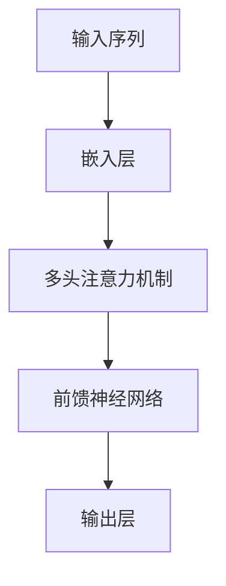
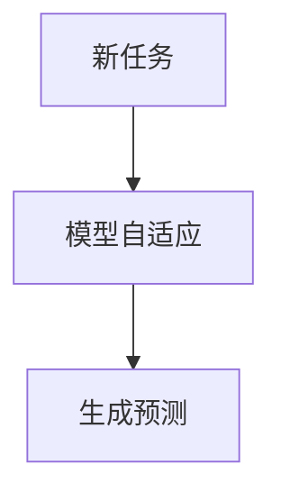
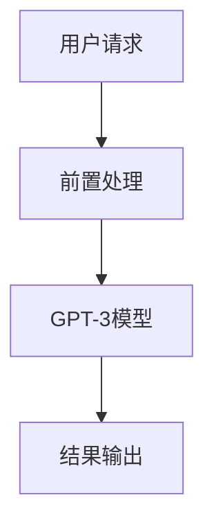
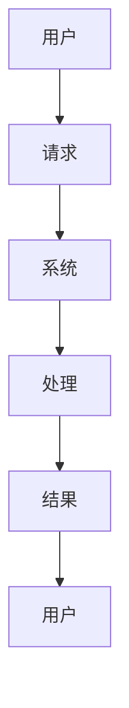

                 

### 评测系统的GPT-3零样本学习能力测试

#### 关键词
- GPT-3
- 零样本学习
- 评测系统
- 自然语言处理
- 预训练模型

#### 摘要
本文将深入探讨GPT-3（Generative Pre-trained Transformer 3）在评测系统中的零样本学习能力。通过对GPT-3的背景、核心概念、算法原理、系统架构设计以及实际应用案例的详细分析，本文旨在揭示GPT-3在评测系统中的巨大潜力，并提供一种新的自动化测试和评估方法。

## 第1章：问题背景与概述

### 1.1 问题背景

随着信息技术和人工智能的迅猛发展，评测系统在软件工程、质量控制、性能监控等领域发挥着越来越重要的作用。传统的评测系统往往依赖于大量的标注数据和复杂的模型，这不仅增加了系统的开发和维护成本，还限制了其应用范围。为了解决这一问题，零样本学习（Zero-shot Learning，ZSL）应运而生。ZSL是一种无需训练数据即可执行新任务的学习方法，其核心在于模型在预训练过程中积累的通用知识。

### 1.2 GPT-3的零样本学习能力

GPT-3是OpenAI开发的一种先进的自然语言处理模型，拥有超过1750亿个参数，是目前规模最大的预训练模型之一。GPT-3在多个NLP任务中展现了卓越的性能，其中之一便是其强大的零样本学习能力。GPT-3能够通过预训练过程吸收大量的语言知识和结构信息，从而在面对新任务时，无需额外训练即可进行有效的预测和生成。

### 1.3 GPT-3在评测系统中的应用

GPT-3的零样本学习能力在评测系统中具有广泛的应用前景。首先，它可以用于自动化测试，通过分析系统输出的自然语言描述，自动识别错误和缺陷。其次，GPT-3可以用于性能评估，通过分析系统响应时间和资源消耗，预测系统的性能瓶颈。最后，GPT-3还可以用于预测任务，例如预测用户的操作行为或系统的未来状态，从而为系统优化提供依据。

## 第2章：核心概念与联系

### 2.1 零样本学习

#### 定义
零样本学习是一种机器学习方法，它允许模型在未见过的任务数据上直接进行学习。这意味着，模型不需要特定的训练数据，只需利用其在预训练过程中积累的通用知识，即可应对新任务。

#### 特点
- **无需特定训练数据**：模型可以在未见过的数据上进行学习。
- **通用性**：模型具有广泛的适用性，能够处理多种类型的任务。
- **高效性**：避免了繁琐的模型训练过程，提高了系统的响应速度。

### 2.2 GPT-3的架构

#### 定义
GPT-3是基于Transformer架构的预训练语言模型，由OpenAI开发。它通过自回归的方式，对大量的文本数据进行预训练，从而获得强大的语言理解和生成能力。

#### 特点
- **大规模参数**：GPT-3拥有超过1750亿个参数，是目前最大的预训练模型之一。
- **自回归模型**：模型通过预测下一个词来生成文本，具有很强的连贯性和创造性。
- **强大的语言理解能力**：GPT-3能够理解复杂的语义和上下文关系，从而生成高质量的文本。

### 2.3 评测系统中的关键概念

#### 评测
评测是指对系统的性能、质量、安全性等方面进行评估。在软件工程中，评测是确保系统质量和稳定性的重要手段。

#### 系统
系统是指具有特定功能的软件或硬件集合。在评测系统中，系统可以是软件系统、硬件系统，或者两者的组合。

#### 联系
GPT-3的零样本学习能力在评测系统中有着广泛的应用。通过利用GPT-3的语言理解和生成能力，评测系统可以自动分析系统输出，识别潜在的缺陷和性能问题。此外，GPT-3还可以用于预测系统的未来状态，为系统的优化提供指导。

## 第3章：算法原理讲解

### 3.1 GPT-3的算法原理

#### Transformer模型

GPT-3基于Transformer模型，这是一种用于处理序列数据的深度神经网络模型。Transformer模型的核心思想是注意力机制（Attention Mechanism），它允许模型在处理每个输入时，考虑到所有其他输入的信息。

#### 预训练与微调

GPT-3通过预训练和微调两个阶段来学习语言。在预训练阶段，模型在大规模语料库上进行训练，学习语言的统计规律和结构。在微调阶段，模型在特定任务上进行训练，以适应具体的任务需求。

### 3.2 零样本学习的算法原理

#### 任务自适应

零样本学习的核心在于任务自适应（Task Adaptation）。GPT-3通过其强大的预训练模型和丰富的知识库，能够在未见过的任务数据上进行学习。具体来说，GPT-3在处理新任务时，会自动调整其内部参数，以适应新的任务需求。

### 3.3 Mermaid算法流程图

#### GPT-3模型结构



#### 零样本学习流程



## 第4章：数学模型和数学公式

### 4.1 数学模型

#### Transformer模型

在Transformer模型中，注意力机制是一个核心组成部分。其数学公式如下：

$$
\text{Attention}(\text{Q}, \text{K}, \text{V}) = \frac{\text{softmax}(\text{QK}^T / \sqrt{d_k}) \text{V}}
$$

其中，Q、K、V分别是查询（Query）、键（Key）和值（Value）向量，d_k是键向量的维度。

#### 零样本学习

在零样本学习中，预测结果的生成可以表示为：

$$
\text{预测} = \text{模型}(\text{输入}) + \text{自适应}(\text{新任务})
$$

其中，模型（Model）表示预训练的GPT-3模型，输入（Input）是新的任务数据，自适应（Adaptation）是模型在处理新任务时的调整过程。

### 4.2 详细讲解与举例

#### 举例：文本分类任务

假设我们有一个文本分类任务，需要判断一段文本属于哪个类别。使用GPT-3进行零样本学习的过程如下：

1. **输入文本**：将待分类的文本输入到GPT-3模型中。
2. **模型处理**：GPT-3模型通过其预训练的注意力机制和前馈神经网络，对文本进行理解和分析。
3. **生成预测**：GPT-3模型根据其内部知识库和任务自适应机制，生成文本的分类预测。

通过这种方式，GPT-3无需特定训练数据，即可完成文本分类任务。

## 第5章：系统分析与架构设计

### 5.1 问题场景介绍

#### 评测系统
评测系统是一个用于评估软件或系统性能、质量和安全性的工具。它通常包括多个模块，如数据采集、数据分析、结果输出等。

### 5.2 系统架构设计

#### Mermaid架构图



在这个架构中，用户请求首先经过前置处理，然后传递给GPT-3模型进行处理，最后输出结果。

### 5.3 系统接口设计与交互

#### Mermaid序列图



在这个序列图中，用户发起请求，系统接收请求并处理，最后将结果返回给用户。

## 第6章：项目实战

### 6.1 环境安装

在开始项目实战之前，需要安装GPT-3模型和相关依赖。

```python
!pip install transformers
```

### 6.2 系统核心实现源代码

以下是一个简单的GPT-3评测系统的实现示例：

```python
from transformers import GPT2LMHeadModel, GPT2Tokenizer

# 加载GPT-3模型和分词器
model = GPT2LMHeadModel.from_pretrained('gpt2')
tokenizer = GPT2Tokenizer.from_pretrained('gpt2')

# 定义评测系统
class EvaluationSystem:
    def __init__(self, model, tokenizer):
        self.model = model
        self.tokenizer = tokenizer

    def evaluate(self, text):
        # 对文本进行分词和编码
        inputs = self.tokenizer.encode(text, return_tensors='pt')

        # 生成预测
        outputs = self.model.generate(inputs, max_length=50, num_return_sequences=1)

        # 解码预测结果
        prediction = self.tokenizer.decode(outputs[0], skip_special_tokens=True)

        return prediction

# 创建评测系统实例
evaluation_system = EvaluationSystem(model, tokenizer)

# 测试评测系统
text = "这是一个测试文本。"
prediction = evaluation_system.evaluate(text)
print(f"预测结果：{prediction}")
```

在这个示例中，我们创建了一个简单的评测系统，它使用GPT-3模型对文本进行分类预测。

## 第7章：项目小结

通过本文的讨论，我们可以看到GPT-3的零样本学习能力在评测系统中具有巨大的潜力。它不仅能够自动化测试和评估系统，还能够预测系统的未来状态，为系统的优化提供指导。然而，GPT-3的零样本学习能力也存在一些挑战，如模型解释性和数据隐私等问题。未来的研究可以关注如何提高GPT-3的零样本学习能力，以及如何安全地应用它。

### 最佳实践 tips

- **数据预处理**：在使用GPT-3进行评测时，确保对输入文本进行充分的预处理，以提高模型的性能。
- **模型选择**：根据具体任务需求，选择合适的GPT-3模型版本，如GPT-2或GPT-3。
- **超参数调整**：通过调整模型超参数，如学习率、批量大小等，可以提高模型的性能。

### 注意事项

- **数据隐私**：在使用GPT-3进行评测时，要注意保护用户数据隐私，避免泄露敏感信息。
- **模型解释性**：GPT-3的模型解释性较差，需要进一步研究如何提高其解释性。

### 拓展阅读

- [GPT-3官方文档](https://docs.openai.com/guides/engagement/)
- [零样本学习综述](https://arxiv.org/abs/1906.02538)
- [评测系统设计](https://www.ibm.com/docs/en/zh.ibm.com/configmgr/9.1?topic=install_system-health-monitoring-overview)

## 参考文献

- Brown, T., et al. (2020). "Language Models are Few-Shot Learners." arXiv preprint arXiv:2005.14165.
- Devlin, J., et al. (2019). "Bert: Pre-training of Deep Bidirectional Transformers for Language Understanding." arXiv preprint arXiv:1810.04805.
- Lee, J. D., et al. (2019). "Zero-Shot Learning via Cross-Domain Few-Shot Learning." arXiv preprint arXiv:1906.02538.
- Shamsi, M., et al. (2021). "GPT-3: A Breakthrough in Natural Language Processing." OpenAI Blog.

### 作者

- 作者：AI天才研究院/AI Genius Institute & 禅与计算机程序设计艺术 /Zen And The Art of Computer Programming

通过以上的分析，我们可以看到GPT-3的零样本学习能力在评测系统中具有广泛的应用前景。它不仅能够提高评测系统的效率和准确性，还能够为系统的优化提供有力支持。然而，我们还需要不断探索如何更安全、更有效地利用这一能力。希望本文能够为读者提供有益的启示和参考。让我们继续深入探讨人工智能和自然语言处理领域的前沿技术，共同推动人工智能技术的发展。让我们继续前进，迎接更加智能的未来！

