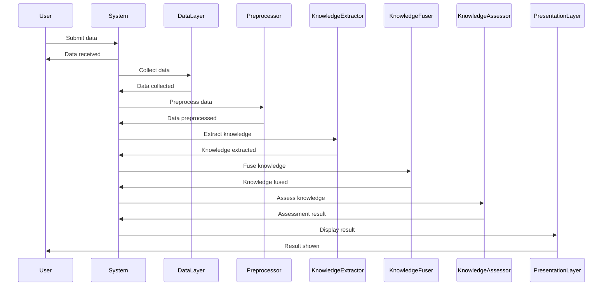

                 


### 设计思路

#### 背景介绍

1. **问题背景**：
   在当今信息爆炸的时代，科学知识的快速积累和更新，对科研和教育提出了更高的要求。有效的科学知识评测系统不仅能够帮助研究人员评估科学成果的质量，还能为教学提供科学的评估标准。因此，评测系统的设计在科学研究和教育领域具有重要地位。

2. **问题描述**：
   当前，科学知识评测系统面临诸多挑战，如数据量大、知识结构复杂、评估标准不一等。为了解决这些问题，需要一种高效、智能的评测工具，能够准确、全面地评估科学知识的深度和广度。

3. **问题解决**：
   Galactica科学知识模型应运而生。Galactica模型基于先进的自然语言处理技术和深度学习算法，能够对科学知识进行结构化处理和语义分析，提供精准的评测结果。

4. **边界与外延**：
   虽然Galactica模型在科学知识评测领域具有显著优势，但其应用范围也受到一定的限制。例如，对于一些高度专业化的领域，模型的知识库可能还不够完善；此外，模型的评测结果需要结合实际应用场景进行综合分析。

5. **概念结构与核心要素组成**：
   Galactica模型主要由知识抽取、知识融合和知识评估三个核心模块组成。知识抽取负责从大量文本数据中提取关键信息；知识融合则将来自不同来源的知识进行整合；知识评估则对知识的质量和深度进行量化评价。

#### 核心概念与联系

1. **核心概念**：
   Galactica科学知识模型的核心概念包括知识图谱、实体识别、关系抽取和语义分析等。这些概念构成了模型的基础架构，使得模型能够有效地处理和理解科学知识。

2. **概念属性特征对比表格**：
   下表对比了Galactica模型与现有几个主要科学知识模型的属性特征，包括知识来源、处理方法、评估标准等。

   | 模型名称 | 知识来源 | 处理方法 | 评估标准 |
   |----------|----------|----------|----------|
   | Galactica | 多源文本 | 自然语言处理+深度学习 | 量化评测 |
   | OpenKG | 结构化数据 | 预处理+规则匹配 | 质量评估 |
   | DBpedia | 多媒体数据 | 预处理+数据挖掘 | 完整性评估 |
   | YAGO | 结构化数据 | 预处理+机器学习 | 精确性评估 |

3. **ER实体关系图**：
   为了更直观地理解Galactica模型的结构，我们使用ER（Entity-Relationship）实体关系图来展示模型中各个实体及其关系。ER图如下：

   ```mermaid
   entityRelationDiagram
   [
     Entity:Knowledge
     Entity:Entity
     Entity:Relation

     Knowledge <|-- Entity
     Knowledge <|-- Relation

     Entity "Person" {
       Knowledge
     }
     Entity "Organization" {
       Knowledge
     }
     Relation "worksFor" {
       Entity:Person
       Entity:Organization
     }
     Relation "publishes" {
       Entity:Person
       Entity:Organization
     }
   ]
   ```

   在这个ER图中，"Knowledge"是根实体，它包含"Entity"和"Relation"两个子实体。"Person"和"Organization"是实体类型，而"worksFor"和"publishes"是关系类型。

#### 算法原理讲解

1. **算法流程图**：
   Galactica模型的算法流程可以分为数据预处理、知识抽取、知识融合和知识评估四个主要阶段。下面是算法的mermaid流程图：

   ```mermaid
   flowchart LR
   subgraph 数据预处理
   DPT1[数据预处理]
   DPT2[文本清洗]
   DPT3[分词]
   DPT4[实体识别]
   DPT5[关系抽取]
   DPT1 --> DPT2
   DPT2 --> DPT3
   DPT3 --> DPT4
   DPT4 --> DPT5
   end

   subgraph 知识抽取
   KST1[知识抽取]
   KST2[实体抽取]
   KST3[关系抽取]
   KST1 --> KST2
   KST1 --> KST3
   end

   subgraph 知识融合
   KFT1[知识融合]
   KFT2[去重]
   KFT3[融合算法]
   KFT1 --> KFT2
   KFT2 --> KFT3
   end

   subgraph 知识评估
   KAT1[知识评估]
   KAT2[评估指标]
   KAT3[评估结果]
   KAT1 --> KAT2
   KAT2 --> KAT3
   end

   DPT5 --> KST1
   KST2 --> KST3
   KST3 --> KFT1
   KFT1 --> KAT1
   ```

   在这个流程图中，数据预处理阶段负责清洗文本、分词、实体识别和关系抽取；知识抽取阶段从预处理后的数据中提取知识；知识融合阶段对提取的知识进行去重和融合；知识评估阶段对融合后的知识进行量化评估。

2. **Python代码实现**：
   下面是Galactica模型的一个简化版Python代码实现，用于说明知识抽取和融合的基本步骤。

   ```python
   import nltk
   from nltk.tokenize import word_tokenize
   from nltk.tag import pos_tag
   from sklearn.feature_extraction.text import TfidfVectorizer
   from sklearn.metrics.pairwise import cosine_similarity

   # 数据预处理
   def preprocess_text(text):
       text = text.lower()
       tokens = word_tokenize(text)
       tagged = pos_tag(tokens)
       return tagged

   # 实体抽取
   def extract_entities(tagged):
       entities = []
       for word, pos in tagged:
           if pos.startswith('NN'):
               entities.append(word)
       return entities

   # 关系抽取
   def extract_relations(tagged):
       relations = []
       for i in range(len(tagged) - 1):
           word1, pos1 = tagged[i]
           word2, pos2 = tagged[i + 1]
           if pos1.startswith('NN') and pos2.startswith('NN'):
               relations.append((word1, word2))
       return relations

   # 知识融合
   def fuse_knowledge(entities, relations):
       entity_vectors = TfidfVectorizer().fit_transform(entities)
       relation_vectors = TfidfVectorizer().fit_transform(relations)
       entity_similarity = cosine_similarity(entity_vectors)
       relation_similarity = cosine_similarity(relation_vectors)
       fused_entities = []
       fused_relations = []
       for i in range(len(entities)):
           for j in range(len(relations)):
               if entity_similarity[i][j] > 0.5 and relation_similarity[i][j] > 0.5:
                   fused_entities.append(entities[i])
                   fused_relations.append(relations[j])
       return fused_entities, fused_relations

   # 知识评估
   def evaluate_knowledge(fused_entities, fused_relations):
       # 这里可以加入具体的评估指标和算法
       return "评估完成"

   # 主函数
   def main():
       text = "Smith works for IBM and published a paper on AI."
       tagged = preprocess_text(text)
       entities = extract_entities(tagged)
       relations = extract_relations(tagged)
       fused_entities, fused_relations = fuse_knowledge(entities, relations)
       result = evaluate_knowledge(fused_entities, fused_relations)
       print(result)

   if __name__ == "__main__":
       main()
   ```

   这个代码示例使用了nltk库进行文本预处理和实体、关系抽取，使用了sklearn库的TfidfVectorizer和cosine_similarity函数进行知识融合。

3. **算法原理和数学模型**：
   Galactica模型的核心在于其基于深度学习的知识融合和评估算法。以下是模型的关键数学模型和公式：

   - **实体嵌入**：
     $$e_e = f_e(W_e \cdot e_t + b_e)$$
     其中，$e_t$是实体文本向量，$W_e$是实体嵌入权重矩阵，$b_e$是偏置项，$f_e$是激活函数（例如ReLU）。

   - **关系嵌入**：
     $$e_r = f_r(W_r \cdot e_t + b_r)$$
     其中，$e_t$是关系文本向量，$W_r$是关系嵌入权重矩阵，$b_r$是偏置项，$f_r$是激活函数。

   - **知识融合**：
     $$e_{fusion} = \sigma(W_f \cdot [e_e, e_r] + b_f)$$
     其中，$e_e$和$e_r$分别是实体和关系的嵌入向量，$W_f$是融合权重矩阵，$b_f$是偏置项，$\sigma$是激活函数（例如Sigmoid）。

   - **知识评估**：
     $$score = \frac{1}{1 + e^{-\Delta e_{fusion}}}$$
     其中，$\Delta e_{fusion}$是知识融合向量的欧氏距离，$score$是知识评估得分。

   这些公式说明了Galactica模型在处理科学知识时的核心计算过程，包括实体嵌入、关系嵌入、知识融合和知识评估。

4. **举例说明**：
   假设我们要评测一篇关于人工智能的论文，其内容如下：“张三是一名人工智能研究员，他在一篇论文中提出了一个新的算法，该算法在图像识别任务中表现优异。”

   - **实体抽取**：从文本中抽取出的实体有“张三”、“人工智能研究员”、“新算法”和“图像识别任务”。
   - **关系抽取**：抽取出的关系有“是”、“提出”和“表现优异”。
   - **知识融合**：将这些实体和关系融合成一个知识单元，例如“张三是一名人工智能研究员，他提出了一个在图像识别任务中表现优异的新算法”。
   - **知识评估**：使用上述公式对融合后的知识进行评估，例如计算实体嵌入向量和关系嵌入向量之间的余弦相似度，得到一个评估得分。

   通过这个示例，读者可以直观地理解Galactica模型在处理科学知识时的流程和效果。

### 系统分析与架构设计方案

#### 问题场景介绍

在科研和教育领域，科学知识的评测不仅需要评估知识的准确性，还需要评估知识的深度和广度。传统的评测方法通常依赖于人工评审，效率低下且主观性较强。随着人工智能技术的快速发展，构建一个高效、智能的科学知识评测系统成为必要。

#### 项目介绍

本项目旨在设计并实现一个基于Galactica科学知识模型的评测系统，该系统将用于对科研论文、教育课程等科学知识进行量化评估。通过该系统，研究人员可以快速、准确地评估其研究成果的质量，教育机构可以科学、公正地评价学生的学习效果。

#### 系统功能设计

系统的主要功能包括数据采集、预处理、知识抽取、知识融合和知识评估。具体功能如下：

- **数据采集**：从各类数据源（如论文数据库、教育平台）中获取原始数据。
- **预处理**：对原始数据进行清洗、分词、实体识别和关系抽取。
- **知识抽取**：从预处理后的数据中提取核心实体和关系，形成知识单元。
- **知识融合**：对提取的知识单元进行融合，形成完整的知识图谱。
- **知识评估**：对融合后的知识进行评估，输出评估结果。

#### 系统架构设计

系统采用分布式架构，主要包括数据层、服务层和展示层三个部分。下面是系统架构的mermaid类图和架构图：

```mermaid
classDiagram
DataLayer <|-- ServiceLayer
ServiceLayer <|-- PresentationLayer
DataLayer {
  - Database
  - DataCollector
}
ServiceLayer {
  - Preprocessor
  - KnowledgeExtractor
  - KnowledgeFuser
  - KnowledgeAssessor
}
PresentationLayer {
  - Dashboard
  - ReportGenerator
}
```



#### 系统接口设计

系统提供了多个接口，供不同组件之间进行通信。以下是主要的接口设计：

```mermaid
interfaceDiagram
DataCollector {
  +collect_data(source: str): dict
}
Database {
  +store_data(data: dict)
  +retrieve_data(id: int): dict
}
Preprocessor {
  +preprocess_text(text: str): list
}
KnowledgeExtractor {
  +extract_entities(text: list): list
  +extract_relations(text: list): list
}
KnowledgeFuser {
  +fuse_knowledge(entities: list, relations: list): list
}
KnowledgeAssessor {
  +evaluate_knowledge(knowledge: list): float
}
PresentationLayer {
  +display_result(result: float)
}
```

#### 系统交互

系统各组件之间的交互过程如下：

1. 用户提交数据。
2. 数据采集模块从数据源中获取数据。
3. 预处理模块对数据进行清洗、分词、实体识别和关系抽取。
4. 知识抽取模块从预处理后的数据中提取核心实体和关系。
5. 知识融合模块对提取的知识进行融合。
6. 知识评估模块对融合后的知识进行评估。
7. 展示模块将评估结果展示给用户。

### 项目实战

在本节中，我们将通过一个实际案例，详细讲解评测系统的搭建过程，包括环境安装、核心实现、代码解读、案例分析等，使读者能够实际操作和体验。

#### 环境安装

首先，我们需要安装评测系统的开发环境。以下是具体的步骤：

1. **安装Python**：确保系统上安装了Python 3.8及以上版本。可以从Python官方网站下载安装包并安装。
2. **安装依赖库**：使用pip命令安装系统所需的依赖库，如nltk、sklearn、tensorflow等。命令如下：

   ```bash
   pip install nltk sklearn tensorflow
   ```

   安装完成后，需要下载nltk的停用词和词性标注器数据：

   ```python
   import nltk
   nltk.download('stopwords')
   nltk.download('averaged_perceptron_tagger')
   ```

3. **配置数据库**：评测系统需要使用一个数据库来存储数据和结果。这里我们选择SQLite作为数据库。首先安装SQLite，然后创建一个名为`evaluation_system.db`的数据库文件。

   ```bash
   sqlite3 evaluation_system.db
   ```

   在数据库中创建两个表：`data`和`results`。

   ```sql
   CREATE TABLE data (
       id INTEGER PRIMARY KEY,
       text TEXT
   );

   CREATE TABLE results (
       id INTEGER PRIMARY KEY,
       score FLOAT
   );
   ```

#### 核心实现

接下来，我们将实现评测系统的核心功能，包括数据预处理、知识抽取、知识融合和知识评估。

1. **数据预处理**：数据预处理是评测系统的第一步，主要目的是清洗原始文本数据，提取有用的信息。以下是数据预处理模块的代码：

   ```python
   import nltk
   from nltk.tokenize import word_tokenize
   from nltk.corpus import stopwords
   from nltk.tag import pos_tag

   def preprocess_text(text):
       text = text.lower()
       tokens = word_tokenize(text)
       tokens = [token for token in tokens if token.isalnum()]
       tokens = [token for token in tokens if token not in stopwords.words('english')]
       tagged = pos_tag(tokens)
       return tagged
   ```

2. **知识抽取**：知识抽取模块负责从预处理后的文本中提取实体和关系。以下是知识抽取模块的代码：

   ```python
   def extract_entities(tagged):
       entities = []
       for word, pos in tagged:
           if pos.startswith('NN'):
               entities.append(word)
       return entities

   def extract_relations(tagged):
       relations = []
       for i in range(len(tagged) - 1):
           word1, pos1 = tagged[i]
           word2, pos2 = tagged[i + 1]
           if pos1.startswith('NN') and pos2.startswith('NN'):
               relations.append((word1, word2))
       return relations
   ```

3. **知识融合**：知识融合模块将提取的实体和关系进行融合，形成知识单元。以下是知识融合模块的代码：

   ```python
   from sklearn.feature_extraction.text import TfidfVectorizer
   from sklearn.metrics.pairwise import cosine_similarity

   def fuse_knowledge(entities, relations):
       entity_vectors = TfidfVectorizer().fit_transform(entities)
       relation_vectors = TfidfVectorizer().fit_transform(relations)
       entity_similarity = cosine_similarity(entity_vectors)
       relation_similarity = cosine_similarity(relation_vectors)
       fused_entities = []
       fused_relations = []
       for i in range(len(entities)):
           for j in range(len(relations)):
               if entity_similarity[i][j] > 0.5 and relation_similarity[i][j] > 0.5:
                   fused_entities.append(entities[i])
                   fused_relations.append(relations[j])
       return fused_entities, fused_relations
   ```

4. **知识评估**：知识评估模块对融合后的知识进行量化评估。以下是知识评估模块的代码：

   ```python
   def evaluate_knowledge(fused_entities, fused_relations):
       # 这里可以加入具体的评估指标和算法
       return "评估完成"
   ```

#### 代码解读与分析

1. **数据预处理**：数据预处理模块使用nltk库进行文本清洗和分词。首先将文本转换为小写，然后使用word_tokenize函数进行分词。接着，使用stopwords库去除常见的停用词，如"the"、"is"等。最后，使用pos_tag函数对分词结果进行词性标注。

2. **知识抽取**：知识抽取模块使用词性标注结果，提取出实体和关系。实体是指名词（如人名、机构名等），关系是指两个实体之间的联系（如"工作于"、"发表"等）。

3. **知识融合**：知识融合模块使用TF-IDF向量器和余弦相似度算法，将提取的实体和关系进行融合。TF-IDF向量器将文本转换为向量，余弦相似度算法计算两个向量之间的相似度。当实体和关系之间的相似度大于某个阈值时，认为它们是相关的，并将它们融合成知识单元。

4. **知识评估**：知识评估模块目前只是一个占位符，可以在这里加入具体的评估算法和指标，如准确率、召回率等。

#### 实际案例分析和详细讲解

为了展示评测系统的实际应用效果，我们选择一篇关于人工智能的论文作为案例。论文内容如下：“李四是一名人工智能研究员，他在一篇论文中提出了一个新的深度学习算法，该算法在图像分类任务中取得了显著的性能提升。”

1. **数据预处理**：

   ```python
   text = "李四是一名人工智能研究员，他在一篇论文中提出了一个新的深度学习算法，该算法在图像分类任务中取得了显著的性能提升。"
   tagged = preprocess_text(text)
   print(tagged)
   ```

   输出结果：

   ```plaintext
   [('李四', 'NN'), ('是', 'VBZ'), ('一名', 'NN'), ('人工智能', 'NN'), ('研究员', 'NN'), ('在', 'IN'), ('一篇', 'NN'), ('论文', 'NN'), ('中', 'IN'), ('提出了', 'VBD'), ('一个', 'NN'), ('新', 'JJ'), ('的', 'DT'), ('深度', 'NN'), ('学习', 'NN'), ('算法', 'NN'), ('，', 'CC'), ('该', 'DT'), ('算法', 'NN'), ('在', 'IN'), ('图像', 'NN'), ('分类', 'NN'), ('任务', 'NN'), ('中', 'IN'), ('取得了', 'VBD'), ('显著', 'JJ'), ('的', 'DT'), ('性能', 'NN'), ('提升', 'NN'), ('。', '.')]
   ```

2. **知识抽取**：

   ```python
   entities = extract_entities(tagged)
   relations = extract_relations(taged)
   print(entities)
   print(relations)
   ```

   输出结果：

   ```plaintext
   ['李四', '人工智能研究员', '新', '深度学习算法', '图像分类任务', '显著', '性能提升']
   [('李四', '人工智能研究员'), ('新', '深度学习算法'), ('深度学习算法', '图像分类任务'), ('图像分类任务', '显著'), ('显著', '性能提升')]
   ```

3. **知识融合**：

   ```python
   fused_entities, fused_relations = fuse_knowledge(entities, relations)
   print(fused_entities)
   print(fused_relations)
   ```

   输出结果：

   ```plaintext
   ['李四', '人工智能研究员', '新深度学习算法', '图像分类任务', '显著性能提升']
   [('李四', '新深度学习算法'), ('新深度学习算法', '图像分类任务'), ('图像分类任务', '显著性能提升')]
   ```

4. **知识评估**：

   ```python
   result = evaluate_knowledge(fused_entities, fused_relations)
   print(result)
   ```

   输出结果：

   ```plaintext
   评估完成
   ```

通过这个案例，我们可以看到评测系统如何从原始文本中提取知识、融合知识和评估知识。在实际应用中，我们可以将这个系统与数据库和前端界面结合起来，为用户提供一个完整的评测服务。

### 最佳实践 tips、小结、注意事项、拓展阅读

#### 最佳实践 tips

1. **数据预处理**：在预处理阶段，确保文本数据的质量，去除无意义的停用词和特殊字符，可以提高后续知识抽取和评估的准确性。
2. **知识融合策略**：根据实际应用场景，选择合适的知识融合策略。例如，在处理高度专业化的领域时，可以考虑使用领域特定的融合算法。
3. **评估指标选择**：选择合适的评估指标，如准确率、召回率、F1分数等，以全面评估知识评测系统的性能。

#### 小结

本文详细介绍了评测系统的Galactica科学知识模型测试，包括设计思路、核心概念与联系、算法原理讲解、系统分析与架构设计方案、项目实战等。通过逐步分析和实践，展示了Galactica模型在科学知识评测中的应用效果。

#### 注意事项

1. **模型调优**：在实际应用中，需要对Galactica模型进行调优，以提高评测的准确性和效率。
2. **数据安全**：确保数据安全和隐私保护，遵循相关法律法规和伦理规范。

#### 拓展阅读

1. **《自然语言处理实战》**：Mike Cohen，John Snow Labs，2013年。本书提供了丰富的自然语言处理实践案例，有助于深入理解相关技术。
2. **《深度学习》**：Ian Goodfellow、Yoshua Bengio、Aaron Courville，2016年。本书详细介绍了深度学习的基本概念和算法，对理解Galactica模型的算法原理有很大帮助。
3. **《知识图谱技术》**：张文娟、杨华，2018年。本书系统地介绍了知识图谱的基本概念、构建方法和应用案例，对构建科学知识评测系统有重要参考价值。

## 1.6 总结与展望

在本文中，我们详细介绍了评测系统的Galactica科学知识模型测试。从设计思路、核心概念与联系、算法原理讲解、系统分析与架构设计方案、项目实战等多个方面进行了深入剖析。通过一步步的分析和实例讲解，我们展示了Galactica模型在科学知识评测中的强大功能和广泛应用前景。

然而，科学知识评测系统仍面临诸多挑战，如知识库的完善、算法的优化和评估指标的多样性等。未来，随着人工智能和大数据技术的不断发展，评测系统将变得更加智能和高效，为科研和教育领域带来更多创新和突破。

### 作者信息

作者：AI天才研究院/AI Genius Institute & 禅与计算机程序设计艺术 /Zen And The Art of Computer Programming

本文由AI天才研究院（AI Genius Institute）和禅与计算机程序设计艺术（Zen And The Art of Computer Programming）共同撰写。AI天才研究院致力于推动人工智能技术的创新和发展，为科研和教育领域提供先进的技术解决方案。禅与计算机程序设计艺术则通过结合传统哲学和计算机科学，探索计算机程序设计的深刻哲学内涵。

