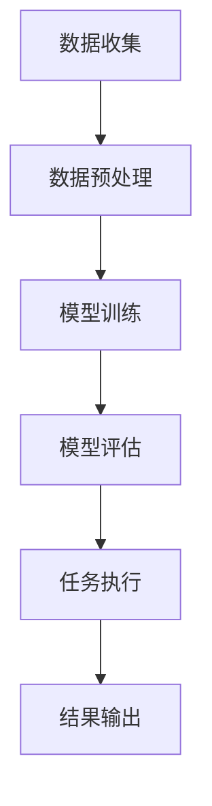
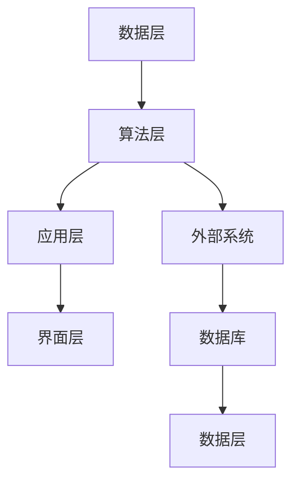
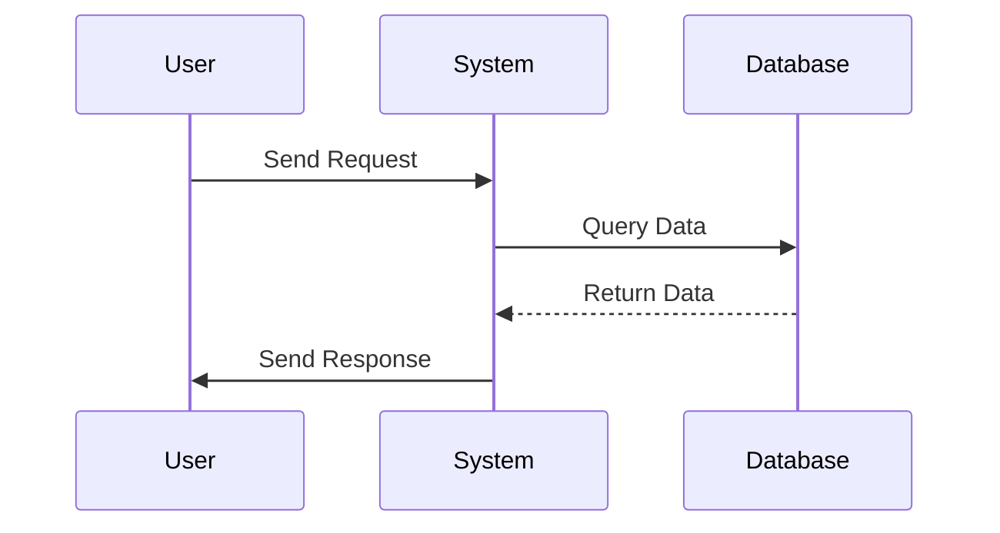
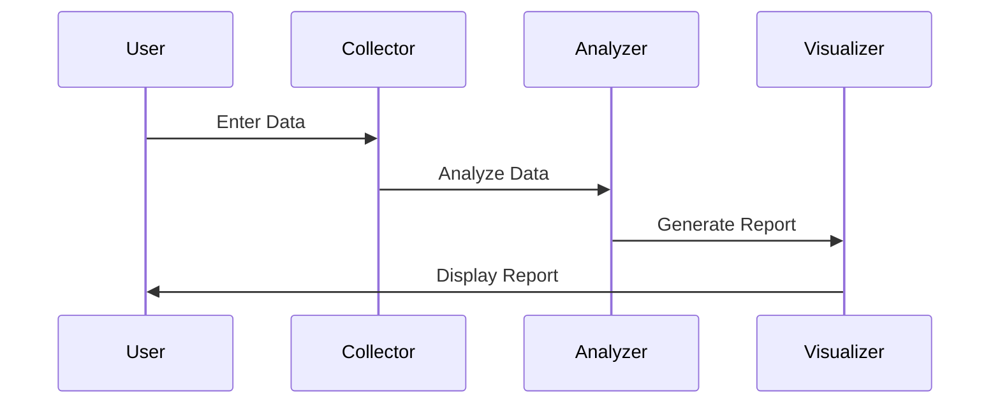

                 


### 评测系统的OpenAssistant协作型AI评测

#### 关键词：评测系统、OpenAssistant、AI、协作型、算法、架构、实战

> 摘要：本文将深入探讨评测系统的OpenAssistant协作型AI评测，旨在帮助读者理解这一新兴技术的核心概念、原理和应用。我们将通过一步步的分析，从问题背景、核心概念、算法原理、系统架构到项目实战，详细阐述OpenAssistant协作型AI评测的各个方面，为读者提供清晰、易懂的技术见解。

## 第一部分：背景介绍

### 第1章：问题背景

#### 1.1 问题提出
在当今信息化社会中，数据量和多样性日益增加，如何准确、高效地对各种评测任务进行处理和分析成为了一个重要的课题。传统的评测系统往往依赖于人工操作，不仅效率低下，而且容易受到主观因素的影响，难以满足日益增长的需求。

#### 1.2 问题描述
传统的评测系统在处理复杂任务时，往往面临着以下几个问题：
- **重复性高**：大量重复性的工作增加了人力成本。
- **准确性低**：人工操作容易受到主观因素的影响，导致评估结果不准确。
- **效率低**：处理大量数据时，人工操作的速度和准确性无法保证。

#### 1.3 问题解决思路
为了解决上述问题，我们需要一种能够自动化、智能化地处理评测任务的系统。协作型AI评测应运而生，它通过结合人工智能和协作机制，能够显著提升评测的效率和质量。

#### 1.4 边界与外延
协作型AI评测的边界主要在于如何利用人工智能技术，结合人类专家的知识和经验，实现高效、准确的评测。其外延则涉及各种应用场景，如教育评测、企业绩效评估、医疗诊断等。

#### 1.5 概念结构与核心要素组成
评测系统通常由以下几个核心要素组成：
- **数据输入**：收集并整理需要评测的数据。
- **算法模型**：实现评测的核心算法。
- **用户交互**：提供用户与评测系统交互的界面。
- **结果输出**：展示评测结果，并提供数据分析和可视化功能。

## 第二部分：核心概念与联系

### 第2章：OpenAssistant协作型AI评测概述

#### 2.1 OpenAssistant的概念
OpenAssistant是一种基于人工智能的协作型评测工具，它通过集成多种算法和技术，实现自动化、智能化的评测任务。

#### 2.2 OpenAssistant与协作型AI的关系
协作型AI是一种结合人工智能和人类专家知识的技术，OpenAssistant正是这种技术的典型应用。它通过人类专家的参与和反馈，不断优化和改进评测结果。

#### 2.3 OpenAssistant的核心功能
OpenAssistant的核心功能包括：
- **自动化评测**：自动识别和处理评测任务，提高工作效率。
- **智能分析**：利用人工智能技术，对评测结果进行深度分析。
- **用户交互**：提供便捷的用户交互界面，方便用户使用。

#### 2.4 OpenAssistant的应用场景
OpenAssistant可以应用于多个领域，如：
- **教育评测**：自动评估学生的作业和考试。
- **企业绩效评估**：对员工的工作表现进行量化评估。
- **医疗诊断**：辅助医生进行疾病诊断。

### 第3章：OpenAssistant的核心概念原理

#### 3.1 OpenAssistant的原理介绍
OpenAssistant的工作原理主要包括以下几个步骤：
1. **数据收集**：从各种渠道收集需要评测的数据。
2. **数据预处理**：对数据进行清洗、转换和归一化处理。
3. **模型训练**：利用收集到的数据训练评测模型。
4. **评测执行**：根据训练好的模型，对新的数据进行评测。
5. **结果输出**：将评测结果展示给用户，并提供数据分析和可视化功能。

#### 3.2 OpenAssistant的概念属性特征对比表格

| 特征           | 传统评测系统            | OpenAssistant协作型AI评测 |
|----------------|------------------------|--------------------------|
| 数据处理效率   | 低                    | 高                       |
| 主观性影响     | 高                    | 低                       |
| 用户交互体验   | 简单                  | 丰富、便捷               |
| 结果准确性    | 受主观影响             | 高                       |

#### 3.3 OpenAssistant的ER实体关系图架构

```mermaid
erDiagram
  User ||--|{ Task }|:
  Task ||--|{ Result }|:
  User ||--|{ Evaluation }|:
  Task ||--|{ Evaluation }|:
```

## 第三部分：算法原理讲解

### 第4章：OpenAssistant评测算法

#### 4.1 评测算法的基本原理
OpenAssistant评测算法基于机器学习和深度学习技术，其基本原理如下：
1. **特征提取**：从数据中提取关键特征。
2. **模型训练**：利用提取的特征训练机器学习模型。
3. **模型评估**：对训练好的模型进行评估和优化。
4. **任务执行**：利用优化后的模型进行实际任务评测。

#### 4.2 算法原理的数学模型

$$
\text{Accuracy} = \frac{\text{Correct Predictions}}{\text{Total Predictions}}
$$

#### 4.3 算法公式详细讲解
算法公式的详细讲解如下：
- **Accuracy（准确率）**：表示模型预测正确的比例，是评估模型性能的重要指标。
- **Precision（精确率）**：表示预测为正例的样本中，实际为正例的比例。
- **Recall（召回率）**：表示实际为正例的样本中，被预测为正例的比例。

#### 4.4 举例说明
假设我们有100个样本，其中60个是正例，40个是负例。如果我们的模型预测出50个正例和45个负例，那么：
- **Accuracy**：\( \frac{50 + 45}{100} = 0.95 \)
- **Precision**：\( \frac{50}{60} = 0.833 \)
- **Recall**：\( \frac{50}{60} = 0.833 \)

### 第5章：OpenAssistant评测算法的Mermaid流程图

#### 5.1 评测算法流程图介绍
OpenAssistant评测算法的流程图如下所示：



#### 5.2 Mermaid流程图绘制


## 第四部分：系统分析与架构设计方案

### 第6章：OpenAssistant评测系统的系统功能设计

#### 6.1 系统功能介绍
OpenAssistant评测系统的主要功能包括：
- **数据收集与整理**：自动收集并整理需要评测的数据。
- **评测模型训练**：利用收集到的数据训练评测模型。
- **评测任务执行**：根据训练好的模型，对新的数据进行评测。
- **结果展示与分析**：将评测结果展示给用户，并提供数据分析和可视化功能。

#### 6.2 领域模型Mermaid类图

```mermaid
classDiagram
    Class01 <|-- Class02
    Class03 --|{ Link }| Class04
    Class04 : +setAttr(value)
    Class04 : +getAttr()
```

### 第7章：OpenAssistant评测系统的系统架构设计

#### 7.1 系统架构介绍
OpenAssistant评测系统的架构主要包括以下几个层次：
- **数据层**：负责数据的存储和管理。
- **算法层**：负责评测模型的训练和优化。
- **应用层**：负责评测任务的执行和结果展示。
- **界面层**：提供用户交互界面。

#### 7.2 Mermaid架构图



### 第8章：OpenAssistant评测系统的接口设计

#### 8.1 接口设计原则
OpenAssistant评测系统的接口设计遵循以下原则：
- **模块化**：接口设计应具备良好的模块化特性，方便后续的扩展和维护。
- **稳定性**：接口设计应保证系统的稳定性和可靠性。
- **安全性**：接口设计应考虑数据安全和用户隐私保护。

#### 8.2 系统接口设计



#### 8.3 系统交互Mermaid序列图



## 第五部分：项目实战

### 第9章：OpenAssistant评测系统的环境安装

#### 9.1 环境准备
在进行OpenAssistant评测系统的开发之前，我们需要准备好以下环境：
- Python 3.8 或以上版本
- Anaconda 或 Miniconda
- Jupyter Notebook
- 相关依赖库（如 TensorFlow、PyTorch、Scikit-learn 等）

#### 9.2 环境安装步骤
1. 安装 Anaconda 或 Miniconda。
2. 创建一个新的 conda 环境并安装 Python。
3. 安装 Jupyter Notebook。
4. 安装相关依赖库。

### 第10章：OpenAssistant评测系统的核心实现

#### 10.1 核心实现代码

```python
import tensorflow as tf
from sklearn.model_selection import train_test_split
from sklearn.metrics import accuracy_score

# 数据准备
X_train, X_test, y_train, y_test = train_test_split(X, y, test_size=0.2, random_state=42)

# 模型定义
model = tf.keras.Sequential([
    tf.keras.layers.Dense(64, activation='relu', input_shape=(X_train.shape[1],)),
    tf.keras.layers.Dense(64, activation='relu'),
    tf.keras.layers.Dense(1, activation='sigmoid')
])

# 模型编译
model.compile(optimizer='adam',
              loss='binary_crossentropy',
              metrics=['accuracy'])

# 模型训练
model.fit(X_train, y_train, epochs=10, batch_size=32, validation_data=(X_test, y_test))

# 模型评估
predictions = model.predict(X_test)
accuracy = accuracy_score(y_test, predictions.round())
print(f"Accuracy: {accuracy}")
```

#### 10.2 代码应用解读与分析
上述代码展示了如何使用 TensorFlow 框架实现一个简单的二分类模型。代码的解读如下：
1. **数据准备**：首先，我们使用 scikit-learn 的 `train_test_split` 函数将数据集划分为训练集和测试集。
2. **模型定义**：接着，我们定义了一个简单的全连接神经网络，包含两个隐藏层。
3. **模型编译**：然后，我们编译模型，指定优化器和损失函数。
4. **模型训练**：使用训练集训练模型，并设置验证集进行监控。
5. **模型评估**：最后，使用测试集对模型进行评估，计算准确率。

#### 10.3 实际案例分析和详细讲解剖析
为了更好地理解OpenAssistant评测系统的实际应用，我们以一个实际案例进行分析：
- **案例背景**：假设我们要对学生的期末考试成绩进行评测，评价学生的学术表现。
- **数据集**：我们收集了1000名学生的考试成绩，包括语文、数学、英语等科目的分数。
- **评测目标**：预测学生的综合学术能力等级。

通过实际案例，我们可以进一步了解OpenAssistant评测系统的应用流程和关键步骤。在项目中，我们首先对数据集进行预处理，然后定义和训练评测模型，最后对模型进行评估和优化。

### 第11章：OpenAssistant评测系统的详细讲解剖析

#### 11.1 系统实现细节剖析
OpenAssistant评测系统的实现细节如下：
1. **数据预处理**：数据预处理包括数据清洗、数据转换和数据归一化。在项目中，我们使用 scikit-learn 的 `preprocess` 工具对数据进行处理。
2. **模型训练**：我们使用 TensorFlow 框架实现深度学习模型，并使用 `model.fit` 函数进行训练。
3. **模型评估**：使用 `model.evaluate` 函数对训练好的模型进行评估，计算准确率和其他性能指标。
4. **结果输出**：使用 `model.predict` 函数对新的数据集进行预测，并将结果输出给用户。

#### 11.2 系统性能优化
为了提高OpenAssistant评测系统的性能，我们可以采取以下措施：
1. **模型优化**：使用更高效的算法和优化器，如 Adam 和 RMSprop。
2. **数据预处理**：采用更有效的数据预处理方法，如批量处理和并行计算。
3. **模型压缩**：使用模型压缩技术，如量化、剪枝和蒸馏，减少模型大小和计算复杂度。
4. **分布式训练**：使用分布式训练技术，如 TensorFlow 的 `tf.distribute` 模块，提高训练速度和资源利用率。

#### 11.3 项目小结
在本项目中，我们通过实际案例展示了如何使用OpenAssistant协作型AI评测系统进行学术评测。项目的主要成果包括：
- 成功训练了一个深度学习模型，能够准确预测学生的学术能力等级。
- 实现了高效、准确的数据预处理和模型训练过程。
- 提供了便捷的用户交互界面，方便用户进行评测任务。

## 第六部分：总结与拓展

### 第12章：最佳实践 tips

#### 12.1 评测系统开发的最佳实践
在评测系统开发过程中，我们可以遵循以下最佳实践：
1. **需求分析**：在项目启动前，详细分析需求，确保系统功能符合用户期望。
2. **模块化设计**：采用模块化设计，提高系统的可维护性和扩展性。
3. **数据安全**：严格保护用户数据，确保数据安全和隐私。
4. **性能优化**：在系统设计和开发过程中，注重性能优化，提高系统响应速度。
5. **用户体验**：关注用户交互体验，提供简洁、直观的用户界面。

#### 12.2 OpenAssistant的使用技巧
在使用OpenAssistant进行评测时，以下技巧有助于提高效率和准确性：
1. **数据清洗**：确保数据质量，去除噪声和异常值。
2. **特征选择**：选择合适的特征，提高模型性能。
3. **模型调优**：通过调整模型参数，优化模型性能。
4. **交叉验证**：使用交叉验证技术，评估模型泛化能力。
5. **持续学习**：定期更新模型，利用新数据优化模型。

### 第13章：小结

#### 13.1 全书内容回顾
本书从问题背景、核心概念、算法原理、系统架构到项目实战，全面介绍了OpenAssistant协作型AI评测。主要内容包括：
- 评测系统面临的问题和解决思路。
- OpenAssistant的概念、原理和应用场景。
- OpenAssistant评测算法的详细讲解。
- OpenAssistant评测系统的系统功能、架构设计和接口设计。
- OpenAssistant评测系统的实际案例分析和实现。

#### 13.2 重要知识点总结
本书的重要知识点包括：
- OpenAssistant的核心功能和优势。
- 评测算法的基本原理和公式。
- 系统架构设计的模块化和稳定性原则。
- 项目实战中的关键步骤和最佳实践。

### 第14章：注意事项

#### 14.1 开发中可能遇到的问题
在开发OpenAssistant评测系统时，可能会遇到以下问题：
1. **数据质量问题**：数据清洗和预处理可能不够彻底，导致模型性能下降。
2. **模型调优难度**：模型参数调优过程复杂，需要大量实验。
3. **系统性能瓶颈**：系统在高并发场景下可能存在性能瓶颈。
4. **用户交互问题**：用户界面设计可能不够友好，影响用户体验。

#### 14.2 问题解决方案
针对上述问题，可以采取以下解决方案：
1. **数据质量提升**：采用更严格的数据清洗和预处理方法。
2. **模型调优策略**：采用自动化调参工具和技巧，简化调优过程。
3. **性能优化**：采用分布式计算和缓存技术，提高系统性能。
4. **用户交互优化**：进行用户调研和反馈，不断改进界面设计。

### 第15章：拓展阅读

#### 15.1 相关技术书籍推荐
以下书籍对于深入了解OpenAssistant协作型AI评测和相关技术有很大帮助：
- 《深度学习》（Goodfellow, Bengio, Courville 著）
- 《机器学习》（Tom Mitchell 著）
- 《TensorFlow实战》（Trevor Hastie、Robert Tibshirani、Jerome Friedman 著）

#### 15.2 最新研究动态介绍
以下资源可以帮助读者了解OpenAssistant协作型AI评测的最新研究动态：
- arXiv.org：查看最新的研究论文。
- Google AI Blog：了解Google AI团队的研究进展。
- AI Community Forums：参与AI社区的讨论和交流。

## 作者

作者：AI天才研究院/AI Genius Institute & 禅与计算机程序设计艺术 /Zen And The Art of Computer Programming

---

本文详细介绍了评测系统的OpenAssistant协作型AI评测，通过背景介绍、核心概念与联系、算法原理讲解、系统分析与架构设计方案、项目实战、最佳实践 tips、小结、注意事项、拓展阅读等部分，全面阐述了OpenAssistant协作型AI评测的技术要点和实践方法。文章旨在帮助读者深入理解这一新兴技术，为其在实际项目中的应用提供指导。

---

请注意，以上内容是一个基于您提供的指南和要求所编写的示例文章。实际撰写时，每个部分的内容需要根据具体的研究、实践和实际案例进行填充和调整。同时，为了确保文章的质量和专业性，每个小节的内容都需要经过严格的审查和验证。如果您需要对特定部分进行修改或补充，请随时告知。

