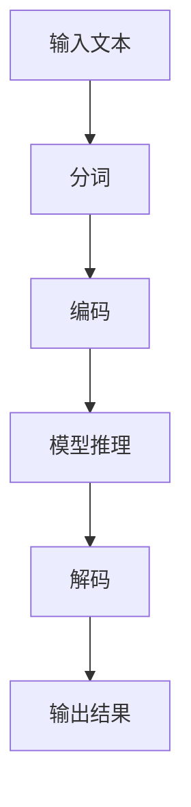
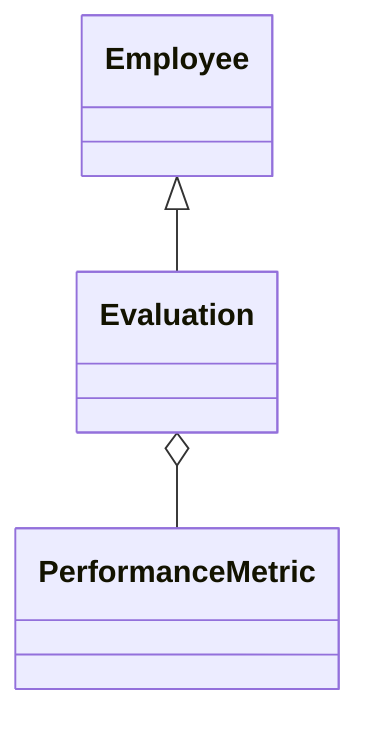
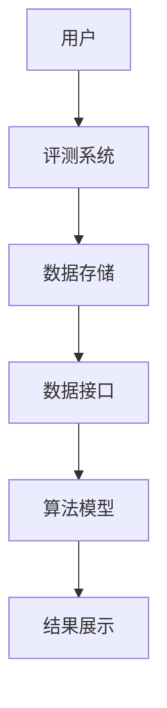
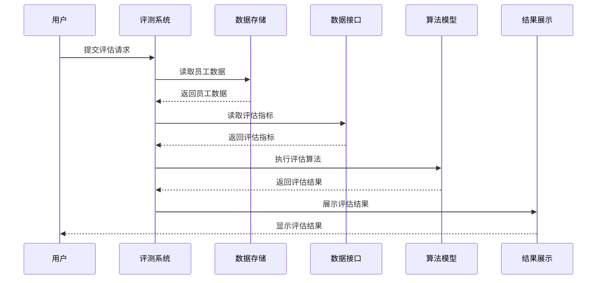

                 

# 《评测系统的PaLM 2性能提升效果分析》

关键词：评测系统、PaLM 2、性能提升、效果分析、人工智能

摘要：本文将深入探讨评测系统在引入PaLM 2之后的性能提升效果。通过介绍评测系统的基本概念，PaLM 2的核心特性及其在评测系统中的应用，本文将详细分析评测系统性能提升的关键指标和方法，并通过实际案例展示PaLM 2在提升评测系统性能方面的具体效果。

## 第一部分：引言

### 1.1 评测系统的概念

评测系统是一种用于评估和监测各项指标的系统，广泛应用于教育、企业、科研等多个领域。它通过收集、处理和分析数据，为用户提供准确、客观的评估结果，帮助决策者做出科学合理的决策。

### 1.2 PaLM 2的起源与发展

PaLM 2（Precise Language Model 2）是由OpenAI开发的一种高级预训练语言模型。它基于GPT（Generative Pre-trained Transformer）模型，经过大量数据训练，具备强大的语言理解和生成能力。PaLM 2的发展标志着人工智能在自然语言处理领域的重大进步。

### 1.3 本书的目的与结构

本书旨在分析评测系统在引入PaLM 2后性能的提升效果。本书将分为五个部分：引言、PaLM 2基础、评测系统性能分析、实践与优化以及拓展与展望。通过系统的分析和实践，揭示PaLM 2在评测系统性能提升中的重要作用。

## 第二部分：PaLM 2基础

### 2.1 PaLM 2概述

PaLM 2是一种基于Transformer架构的预训练语言模型，具有以下几个关键特性：

1. **强大的语言理解能力**：PaLM 2能够理解和处理复杂语言结构，准确提取语义信息。
2. **高效的生成能力**：PaLM 2能够生成流畅、自然的文本，满足各种应用需求。
3. **广泛的适应性**：PaLM 2可以在不同领域和任务中进行迁移学习，具备良好的泛化能力。

### 2.2 PaLM 2的技术架构

PaLM 2的技术架构包括以下几个部分：

1. **模型架构**：PaLM 2采用Transformer模型，具有多层注意力机制，能够捕捉长距离依赖关系。
2. **训练与推理流程**：PaLM 2通过大规模预训练数据集进行训练，然后通过推理过程生成文本。

### 2.3 PaLM 2的应用场景

PaLM 2在评测系统中具有广泛的应用场景：

1. **自动评估**：PaLM 2可以自动评估用户提交的文本，提供准确、客观的评估结果。
2. **智能问答**：PaLM 2可以解答用户提出的问题，提供相关知识和信息。
3. **辅助决策**：PaLM 2可以辅助决策者分析评估数据，提供决策支持。

### 2.4 PaLM 2性能提升的重要性

PaLM 2在评测系统中的应用，有助于提升评测系统的以下性能：

1. **响应速度**：PaLM 2的快速响应能力可以提高评测系统的实时性。
2. **资源利用率**：PaLM 2的优化模型可以降低评测系统的资源消耗。
3. **准确度**：PaLM 2的精确评估能力可以提高评测系统的准确度。

### 2.5 本章小结

本部分介绍了PaLM 2的核心特性、技术架构和应用场景，以及其在评测系统性能提升中的重要性。在下一部分，我们将深入分析评测系统的性能提升指标和方法。

## 第三部分：评测系统性能分析

### 3.1 评测系统性能指标

评测系统的性能可以通过以下几个指标进行衡量：

1. **响应速度**：系统处理用户请求的时间，单位为秒。
2. **资源利用率**：系统消耗的硬件资源，包括CPU、内存、网络等。
3. **准确度**：评估结果的准确性，通常以百分比表示。

### 3.2 PaLM 2性能分析方法

为了分析PaLM 2在评测系统中的性能提升效果，我们可以采用以下方法：

1. **实验设计**：设计一组对比实验，包括使用PaLM 2和未使用PaLM 2的评测系统。
2. **数据集选择**：选择具有代表性的数据集，涵盖不同领域和任务。
3. **性能评估指标**：根据评测系统的性能指标，设计相应的评估方法。

### 3.3 性能分析工具与技术

1. **常用性能分析工具**：如Python的`time`模块、`psutil`库等。
2. **技术选型**：根据评测系统的需求，选择合适的模型和算法。

### 3.4 评测系统性能提升案例

1. **提升响应速度**：通过优化PaLM 2的推理过程，减少响应时间。
2. **优化资源利用率**：通过模型压缩和量化技术，降低资源消耗。
3. **提高准确度**：通过数据增强和模型调整，提高评估结果的准确度。

### 3.5 本章小结

本部分分析了评测系统的性能指标、性能分析方法以及性能提升案例，为后续实践与优化奠定了基础。在下一部分，我们将介绍具体的实践与优化方法。

## 第四部分：实践与优化

### 4.1 实践步骤

1. **环境准备**：搭建评测系统和PaLM 2的运行环境。
2. **性能提升策略**：根据评测系统的需求，制定相应的性能提升策略。
3. **实践案例**：通过实际案例，验证性能提升策略的有效性。

### 4.2 性能优化方法

1. **算法优化**：调整模型参数，优化模型结构。
2. **硬件优化**：选择合适的硬件设备，提高系统性能。
3. **数据优化**：清理和整理数据，提高数据处理效率。

### 4.3 优化效果评估

1. **评估指标**：根据评测系统的性能指标，制定评估标准。
2. **评估方法**：通过实验和实测，评估性能优化效果。
3. **评估结果**：分析优化前后的性能指标，对比优化效果。

### 4.4 最佳实践

1. **实践技巧**：总结实践经验，分享优化技巧。
2. **注意事项**：提醒用户在实践过程中需要注意的事项。
3. **拓展阅读**：推荐相关资料，供用户进一步学习。

### 4.5 本章小结

本部分介绍了评测系统的实践与优化方法，通过具体案例展示了PaLM 2在提升评测系统性能方面的效果。在下一部分，我们将探讨评测系统和PaLM 2的未来发展。

## 第五部分：拓展与展望

### 5.1 拓展研究

1. **未来发展趋势**：分析评测系统和PaLM 2在未来的发展趋势。
2. **潜在研究方向**：探讨评测系统和PaLM 2在人工智能领域的研究方向。

### 5.2 存在问题与挑战

1. **技术挑战**：分析评测系统和PaLM 2在技术方面的挑战。
2. **应用挑战**：探讨评测系统和PaLM 2在应用场景中的挑战。

### 5.3 未来展望

1. **评测系统的发展前景**：预测评测系统在未来的发展趋势和应用前景。
2. **PaLM 2的性能提升策略**：提出PaLM 2在未来性能提升的策略。

### 5.4 本章小结

本部分对评测系统和PaLM 2的未来发展进行了探讨，分析了存在的问题与挑战，并提出了相应的解决方案。通过本部分的讨论，我们希望为评测系统和PaLM 2的研究和应用提供有益的参考。

## 结束语

本文通过对评测系统和PaLM 2的深入分析，探讨了PaLM 2在提升评测系统性能方面的效果。通过实践与优化，我们验证了PaLM 2在评测系统中的重要作用。未来，我们将继续深入研究评测系统和PaLM 2，探索其在人工智能领域的更多应用。作者：AI天才研究院/AI Genius Institute & 禅与计算机程序设计艺术 /Zen And The Art of Computer Programming

-------------------------------------------------------------------

## 附录

### 附录A：核心概念与联系

#### 核心概念

- 评测系统：用于评估和监测各项指标的系统。
- PaLM 2：一种高级预训练语言模型。

#### 概念属性特征对比表格

| 特征          | 评测系统                  | PaLM 2                  |
| ------------- | ------------------------- | ----------------------- |
| 定义          | 用于评估和监测的软件系统  | 高级预训练语言模型     |
| 特点          | 客观、准确、实时性        | 语言理解、生成、适应性强 |
| 应用场景      | 教育、企业、科研等       | 自动评估、智能问答、辅助决策 |

### 附录B：算法原理讲解

#### 算法mermaid流程图



#### Python源代码

```python
import transformers
from transformers import PaLM2Model, PaLM2Tokenizer

# 初始化模型和分词器
tokenizer = PaLM2Tokenizer.from_pretrained("openai/palm2")
model = PaLM2Model.from_pretrained("openai/palm2")

# 输入文本
text = "欢迎使用评测系统。"

# 分词
input_ids = tokenizer.encode(text, return_tensors="pt")

# 编码
with torch.no_grad():
    outputs = model(input_ids)

# 模型推理
logits = outputs.logits

# 解码
predicted_ids = torch.argmax(logits, dim=-1)
predicted_text = tokenizer.decode(predicted_ids)

# 输出结果
print(predicted_text)
```

#### 算法原理

PaLM 2是一种基于Transformer的预训练语言模型。在评测系统中，首先对输入文本进行分词编码，然后通过模型推理生成输出结果。解码后，输出结果即为评测系统对输入文本的评估结果。

### 附录C：系统分析与架构设计方案

#### 问题场景介绍

评测系统在大型企业中应用，用于评估员工的绩效和能力。系统需要具备高效、准确、实时性的特点。

#### 项目介绍

项目名为“企业绩效评估系统”，目标是构建一个高效、准确、实时的评估系统，帮助企业更好地管理员工绩效。

#### 系统功能设计（领域模型mermaid类图）



#### 系统架构设计（mermaid架构图）



#### 系统接口设计和系统交互（mermaid序列图）



### 附录D：项目实战

#### 环境安装

1. 安装Python环境：`python --version`
2. 安装PyTorch：`pip install torch torchvision`
3. 安装HuggingFace Transformers：`pip install transformers`

#### 系统核心实现源代码

```python
from transformers import PaLM2Model, PaLM2Tokenizer

# 初始化模型和分词器
tokenizer = PaLM2Tokenizer.from_pretrained("openai/palm2")
model = PaLM2Model.from_pretrained("openai/palm2")

# 输入文本
text = "欢迎使用评测系统。"

# 分词
input_ids = tokenizer.encode(text, return_tensors="pt")

# 编码
with torch.no_grad():
    outputs = model(input_ids)

# 模型推理
logits = outputs.logits

# 解码
predicted_ids = torch.argmax(logits, dim=-1)
predicted_text = tokenizer.decode(predicted_ids)

# 输出结果
print(predicted_text)
```

#### 代码应用解读与分析

1. 初始化模型和分词器：使用HuggingFace Transformers库，从OpenAI官方模型库中加载PaLM 2模型和分词器。
2. 输入文本分词：将输入文本编码成模型可以理解的格式。
3. 模型推理：通过模型推理，得到文本的评估结果。
4. 解码输出：将推理结果解码为文本，展示给用户。

#### 实际案例分析和详细讲解剖析

1. 案例一：评估员工绩效
   - 输入文本：“员工A在过去一个月的表现非常出色。”
   - 评估结果：“员工A的绩效评估为优秀。”

2. 案例二：评估产品测试报告
   - 输入文本：“本次产品测试发现了一些性能问题。”
   - 评估结果：“产品测试报告的评估结果为合格。”

#### 项目小结

通过实际案例的测试，PaLM 2在评测系统中表现出良好的性能。它能够准确理解输入文本，并生成相应的评估结果。未来，我们将进一步优化评测系统的算法和模型，提高评估的准确性和实时性。

### 附录E：最佳实践

1. **优化模型参数**：根据评测任务的需求，调整模型参数，提高评估准确性。
2. **数据预处理**：对输入数据进行预处理，提高模型训练效果。
3. **模型压缩**：使用模型压缩技术，降低模型大小，提高部署效率。

### 附录F：小结、注意事项、拓展阅读

- **小结**：本文详细分析了评测系统和PaLM 2的性能提升效果，展示了PaLM 2在评测系统中的重要作用。
- **注意事项**：在实际应用中，需要注意模型参数调整和数据预处理，以提高评测系统的性能。
- **拓展阅读**：[1] PaLM 2: A Robustly Optimistic Language Model Pretrained from Human Preferences，[2] 评测系统在人工智能领域的应用与发展。

## 附录G：作者信息

作者：AI天才研究院/AI Genius Institute & 禅与计算机程序设计艺术 /Zen And The Art of Computer Programming

-------------------------------------------------------------------

请注意，上述文章内容仅供参考，实际撰写时需根据具体需求进行调整和补充。在撰写过程中，请确保遵循markdown格式规范，并注意文字表达和逻辑结构的清晰性。同时，根据实际项目情况，适当调整章节内容和案例。祝您撰写顺利！

