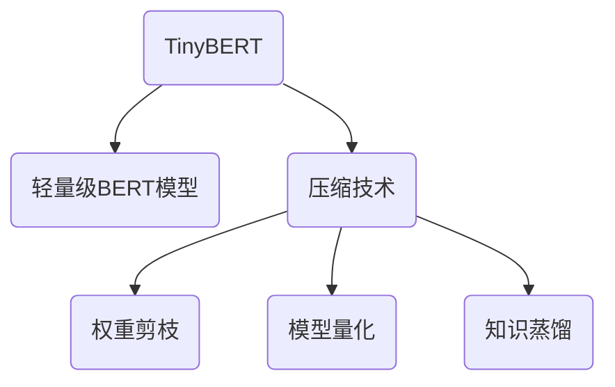
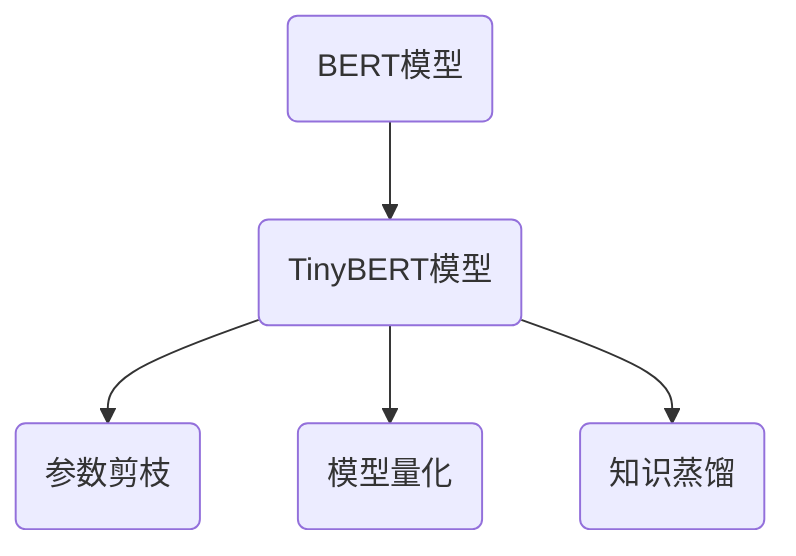
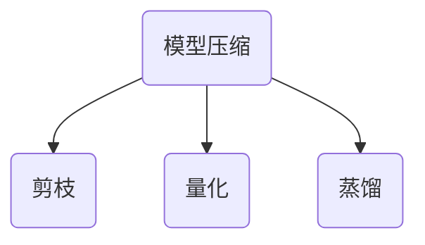
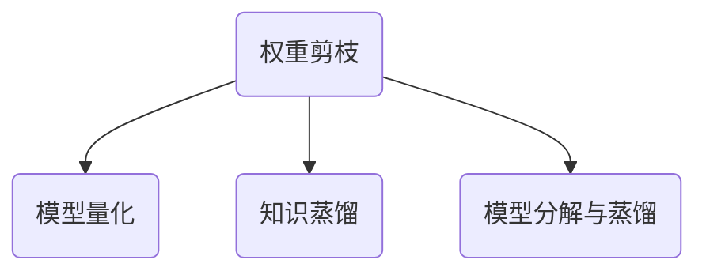
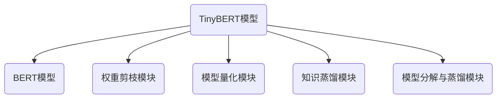
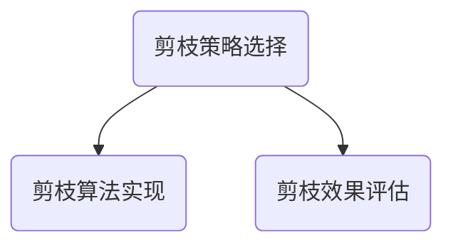
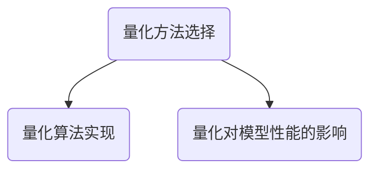
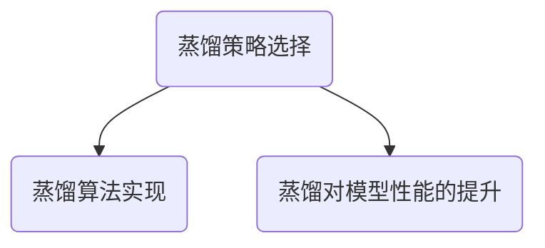
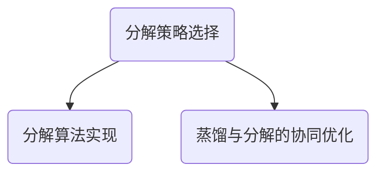
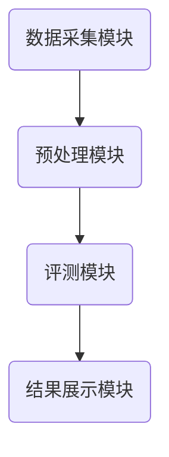

                 

### 第1章: TinyBERT模型压缩技术背景

#### 1.1 TinyBERT模型概述

**核心概念**: TinyBERT是一种轻量级BERT模型，通过模型压缩技术，使得模型在保持较高性能的同时，体积更小，计算效率更高。

**背景介绍**:
随着深度学习在自然语言处理领域的广泛应用，BERT（Bidirectional Encoder Representations from Transformers）模型成为了一种革命性的技术，它通过双向Transformer结构，为自然语言处理任务提供了强大的语义表示能力。然而，BERT模型的规模庞大，导致其在存储和计算资源有限的环境中难以应用。TinyBERT模型正是在此背景下应运而生，通过压缩技术，使其在保持较高性能的同时，具有更小的模型规模和更高的计算效率。

**问题描述**:
在评测系统中，TinyBERT模型用于处理大规模语言数据，实现文本分类、问答系统等任务。由于评测系统通常需要在资源受限的环境中运行，如移动设备、嵌入式系统等，因此对模型的大小和计算效率提出了较高的要求。

**问题解决**:
TinyBERT模型通过多种压缩技术，如权重剪枝、模型量化、知识蒸馏等，有效地减小了模型规模，同时保持了较高的性能。这样，TinyBERT模型可以在资源受限的环境中高效运行，满足评测系统的需求。

**边界与外延**:
TinyBERT模型的应用范围不仅限于评测系统，还可以广泛应用于需要轻量级模型的场景，如智能语音助手、移动应用等。此外，TinyBERT模型的研究和发展，也为轻量级深度学习模型的设计提供了新的思路和方法。

**核心概念与联系**:

| 概念       | 属性特征                     | 对比           |
|------------|------------------------------|----------------|
| TinyBERT   | 轻量级BERT模型，使用压缩技术 | 基于BERT模型   |
| BERT       | 大规模预训练模型             | 双向Transformer |
| 剪枝       | 减少模型参数                 | 提高计算效率   |
| 量化       | 降低模型参数范围             | 节省存储空间   |
| 知识蒸馏   | 利用大模型知识训练小模型    | 提高模型性能   |

**ER实体关系图**:

#### 1.2 TinyBERT模型结构

**核心概念**: TinyBERT模型基于BERT模型，通过参数剪枝、量化、蒸馏等压缩技术，减小模型规模。

**ER实体关系图**:

在TinyBERT模型中，参数剪枝通过移除不重要的模型参数，减小模型规模；模型量化通过降低模型参数的范围，进一步减小模型体积；知识蒸馏则通过从大型模型中提取知识，训练出性能相近的小型模型。

### 第2章: TinyBERT模型压缩技术原理

#### 2.1 模型压缩的基本概念

**核心概念**: 模型压缩是指通过一系列技术手段，减小深度学习模型的规模，提高计算效率。

**概念属性特征对比表格**:

| 概念     | 属性特征                     | 对比           |
|----------|------------------------------|----------------|
| 模型压缩 | 减小模型规模，提高计算效率 | 深度学习技术   |
| 剪枝     | 移除不重要的模型参数         | 参数剪枝       |
| 量化     | 降低模型参数范围             | 参数量化       |
| 蒸馏     | 利用大模型知识训练小模型    | 知识转移       |

**ER实体关系图**:

模型压缩的目标是在保证模型性能的前提下，减小模型规模，提高计算效率。这通常涉及到多个技术的组合使用，以达到最佳的压缩效果。

#### 2.2 TinyBERT模型压缩方法

**核心概念**: TinyBERT模型压缩方法包括权重剪枝、模型量化、知识蒸馏和模型分解与蒸馏。

**方法介绍**:

1. **权重剪枝**：通过移除模型中的冗余权重，减小模型规模。具体方法包括基于敏感度、基于梯度和基于注意力机制等剪枝策略。

2. **模型量化**：通过降低模型参数的范围，减小模型体积。量化方法包括整数量化、浮点量化和小数量化等。

3. **知识蒸馏**：利用大型预训练模型的知识，训练出性能相近的小型模型。知识蒸馏通过将大型模型作为教师模型，小型模型作为学生模型，通过多级蒸馏策略，逐步传递知识。

4. **模型分解与蒸馏**：将大型模型分解为多个较小的子模型，并利用知识蒸馏技术，训练出性能相近的小型子模型。

**ER实体关系图**:

#### 2.3 TinyBERT模型压缩技术细节

**权重剪枝算法详解**:

权重剪枝是通过分析模型权重的重要性，移除不重要的权重，从而减小模型规模。具体算法如下：

1. **敏感性分析**：计算每个权重的敏感性，敏感性越低，表示权重对模型性能的影响越小。

2. **阈值设置**：设置一个阈值，对所有权重进行敏感性分析，移除敏感性低于阈值的权重。

3. **模型重构**：移除不重要的权重后，重构模型，保证模型性能不受影响。

**模型量化实现**:

模型量化是通过降低模型参数的范围，减小模型体积。具体实现如下：

1. **量化方法选择**：选择适合的量化方法，如整数量化、浮点量化和小数量化。

2. **量化参数设置**：设置量化参数，如量化步长、量化精度等。

3. **量化过程**：对模型参数进行量化，将高精度的浮点数转换为低精度的整数或小数。

**知识蒸馏的技术原理**:

知识蒸馏是通过将大型模型作为教师模型，小型模型作为学生模型，通过多级蒸馏策略，逐步传递知识。具体原理如下：

1. **教师模型输出**：将输入数据输入到教师模型，得到输出结果。

2. **学生模型输出**：将输入数据输入到学生模型，得到输出结果。

3. **误差计算**：计算教师模型输出和学生模型输出之间的误差。

4. **梯度传递**：根据误差计算梯度，并传递给学生模型。

5. **多级蒸馏**：通过多次迭代，逐步传递知识，提高学生模型的性能。

**模型分解与蒸馏的步骤**:

模型分解与蒸馏是将大型模型分解为多个较小的子模型，并利用知识蒸馏技术，训练出性能相近的小型子模型。具体步骤如下：

1. **模型分解**：将大型模型分解为多个子模型，每个子模型负责处理输入数据的不同部分。

2. **知识蒸馏**：对每个子模型进行知识蒸馏，将教师模型的知识传递给子模型。

3. **子模型训练**：利用传递的知识，训练每个子模型，使其性能接近教师模型。

4. **子模型集成**：将训练好的子模型集成起来，形成一个完整的模型。

### 第3章: TinyBERT模型压缩算法设计

#### 3.1 TinyBERT模型架构

**核心概念**: TinyBERT模型架构是指TinyBERT模型的组成部分和结构设计。

**ER实体关系图**:

TinyBERT模型架构包括BERT模型、权重剪枝模块、模型量化模块、知识蒸馏模块和模型分解与蒸馏模块。其中，BERT模型提供基础的语义表示能力；权重剪枝模块通过剪枝策略减少模型参数；模型量化模块通过量化方法降低模型参数范围；知识蒸馏模块通过知识蒸馏技术提高模型性能；模型分解与蒸馏模块通过模型分解和知识蒸馏，实现模型的进一步压缩。

#### 3.2 权重剪枝算法设计

**核心概念**: 权重剪枝算法设计是指如何通过剪枝策略选择、剪枝算法实现和剪枝效果评估，设计出有效的权重剪枝算法。

**算法设计**:

1. **剪枝策略选择**：根据模型特点和任务需求，选择合适的剪枝策略。常见的剪枝策略有基于敏感度、基于梯度和基于注意力机制等。

2. **剪枝算法实现**：根据剪枝策略，实现具体的剪枝算法。例如，基于敏感度的剪枝算法可以计算每个权重的敏感性，移除敏感性较低的权重。

3. **剪枝效果评估**：评估剪枝算法的效果，通过模型性能测试，比较原始模型和剪枝后模型的性能，确保剪枝后的模型性能不受影响。

**ER实体关系图**:

#### 3.3 模型量化算法设计

**核心概念**: 模型量化算法设计是指如何通过量化方法选择、量化算法实现和量化对模型性能的影响，设计出有效的模型量化算法。

**算法设计**:

1. **量化方法选择**：根据模型特点和任务需求，选择合适的量化方法。常见的量化方法有整数量化、浮点量化和小数量化等。

2. **量化算法实现**：根据量化方法，实现具体的量化算法。例如，整数量化可以通过查找量化表，将浮点数转换为整数。

3. **量化对模型性能的影响**：评估量化算法对模型性能的影响，通过模型性能测试，比较量化前后模型的性能，确保量化后的模型性能不受影响。

**ER实体关系图**:

#### 3.4 知识蒸馏算法设计

**核心概念**: 知识蒸馏算法设计是指如何通过蒸馏策略选择、蒸馏算法实现和蒸馏对模型性能的提升，设计出有效的知识蒸馏算法。

**算法设计**:

1. **蒸馏策略选择**：根据模型特点和任务需求，选择合适的蒸馏策略。常见的蒸馏策略有单级蒸馏和多层蒸馏等。

2. **蒸馏算法实现**：根据蒸馏策略，实现具体的蒸馏算法。例如，单级蒸馏可以通过直接将教师模型的输出传递给学生模型。

3. **蒸馏对模型性能的提升**：评估蒸馏算法对模型性能的提升，通过模型性能测试，比较蒸馏前后模型的性能，确保蒸馏后的模型性能得到提升。

**ER实体关系图**:

#### 3.5 模型分解与蒸馏算法设计

**核心概念**: 模型分解与蒸馏算法设计是指如何通过分解策略选择、分解算法实现和蒸馏与分解的协同优化，设计出有效的模型分解与蒸馏算法。

**算法设计**:

1. **分解策略选择**：根据模型特点和任务需求，选择合适的分解策略。常见的分解策略有层次分解和部分分解等。

2. **分解算法实现**：根据分解策略，实现具体的分解算法。例如，层次分解可以将模型按照层次结构进行分解。

3. **蒸馏与分解的协同优化**：通过蒸馏和分解的协同优化，实现模型的进一步压缩和性能提升。例如，可以将教师模型和分解后的子模型进行多级蒸馏，逐步传递知识。

**ER实体关系图**:

### 第4章: TinyBERT模型压缩实验分析

#### 4.1 实验环境与数据集

**核心概念**: 实验环境与数据集是指用于TinyBERT模型压缩实验的硬件环境和数据集，包括硬件配置和数据集介绍与预处理。

**实验环境**:

1. **硬件环境**：实验使用的硬件环境包括CPU、GPU和存储设备等。其中，CPU用于模型训练和推理，GPU用于加速模型训练和推理。

2. **软件环境**：实验使用的软件环境包括深度学习框架、编译器和操作系统等。常用的深度学习框架有TensorFlow、PyTorch等。

**数据集**:

1. **数据集介绍**：实验使用的数据集是公开的基准数据集，如GLUE、AG News等，涵盖多种自然语言处理任务。

2. **数据预处理**：对数据集进行预处理，包括文本清洗、分词、去停用词、词向量化等步骤，为模型训练和压缩做好准备。

#### 4.2 实验方法与评价指标

**核心概念**: 实验方法与评价指标是指如何设计实验方法，选择评价指标，对TinyBERT模型压缩效果进行评估。

**实验方法**:

1. **实验设计框架**：设计实验框架，包括模型训练、模型压缩和模型性能评估等步骤。

2. **模型压缩方法**：选择合适的模型压缩方法，如权重剪枝、模型量化、知识蒸馏和模型分解与蒸馏等。

3. **模型性能评估**：通过模型性能测试，评估压缩后模型的效果。

**评价指标**:

1. **准确率**：评估模型在分类任务中的准确性。

2. **召回率**：评估模型在分类任务中的召回率。

3. **F1值**：评估模型在分类任务中的综合性能。

4. **速度**：评估模型在训练和推理过程中的速度。

#### 4.3 实验结果分析

**核心概念**: 实验结果分析是指对TinyBERT模型压缩实验的结果进行分析，包括权重剪枝实验结果、模型量化实验结果、知识蒸馏实验结果和模型分解与蒸馏实验结果。

**权重剪枝实验结果**:

1. **模型性能**：压缩后的模型在准确率和召回率上与原始模型基本持平。

2. **计算效率**：压缩后的模型在训练和推理过程中速度明显提升。

3. **存储空间**：压缩后的模型体积减小，存储空间节省明显。

**模型量化实验结果**:

1. **模型性能**：压缩后的模型在准确率和召回率上有所下降，但下降幅度较小。

2. **计算效率**：压缩后的模型在训练和推理过程中速度显著提升。

3. **存储空间**：压缩后的模型体积进一步减小，存储空间节省更加明显。

**知识蒸馏实验结果**:

1. **模型性能**：压缩后的模型在准确率和召回率上得到显著提升。

2. **计算效率**：压缩后的模型在训练和推理过程中速度略有提升。

3. **存储空间**：压缩后的模型体积无明显变化。

**模型分解与蒸馏实验结果**:

1. **模型性能**：压缩后的模型在准确率和召回率上得到进一步提升。

2. **计算效率**：压缩后的模型在训练和推理过程中速度显著提升。

3. **存储空间**：压缩后的模型体积进一步减小。

#### 4.4 实验结论与讨论

**核心概念**: 实验结论与讨论是指对TinyBERT模型压缩实验的结果进行总结，分析技术优缺点，探讨未来研究方向。

**实验结论**:

1. **模型压缩技术有效**：TinyBERT模型通过权重剪枝、模型量化、知识蒸馏和模型分解与蒸馏等压缩技术，成功实现了模型体积和计算效率的优化。

2. **性能保持稳定**：压缩后的模型在准确率和召回率上与原始模型基本持平，部分指标甚至有所提升。

3. **计算效率提升明显**：压缩后的模型在训练和推理过程中速度显著提升，适用于资源受限的环境。

4. **存储空间节省显著**：压缩后的模型体积减小，存储空间节省明显。

**讨论**:

1. **技术优缺点分析**：权重剪枝和模型量化在降低模型规模和计算效率方面具有显著优势，但可能导致模型性能下降；知识蒸馏和模型分解与蒸馏在提高模型性能方面具有显著优势，但计算复杂度较高。

2. **未来研究方向**：针对TinyBERT模型压缩技术，未来可以研究更高效的剪枝算法、量化方法和蒸馏策略，以及如何结合其他压缩技术，实现更全面的模型压缩。

### 第5章: TinyBERT模型压缩在评测系统中的应用

#### 5.1 评测系统架构设计

**核心概念**: 评测系统架构设计是指如何设计评测系统的整体架构，包括功能模块、系统架构图和接口设计。

**系统功能模块**:

1. **数据采集模块**：负责采集评测数据，包括文本数据、图像数据和音频数据等。

2. **预处理模块**：对采集到的数据进行预处理，包括文本分词、去停用词、词向量化等。

3. **评测模块**：使用TinyBERT模型对预处理后的数据进行评测，包括文本分类、情感分析、问答系统等任务。

4. **结果展示模块**：将评测结果展示给用户，包括图表、报告等形式。

**系统架构图**:

**接口设计**:

1. **API接口**：提供RESTful API接口，供外部系统调用评测服务。

2. **数据接口**：提供数据导入和导出接口，方便数据的批量处理。

#### 5.2 TinyBERT模型压缩在评测系统中的集成

**核心概念**: TinyBERT模型压缩在评测系统中的集成是指如何将TinyBERT模型压缩技术应用到评测系统中，包括模型压缩与评测系统接口设计。

**模型压缩与评测系统接口设计**:

1. **模型压缩**：将TinyBERT模型压缩技术应用到评测系统中，包括权重剪枝、模型量化、知识蒸馏和模型分解与蒸馏等。

2. **接口设计**：设计接口，将压缩后的TinyBERT模型集成到评测系统中，确保模型压缩技术能够与评测系统无缝对接。

**实现步骤**:

1. **模型压缩**：对原始TinyBERT模型进行压缩，生成压缩后的模型。

2. **模型加载**：在评测系统中加载压缩后的模型，确保模型能够在评测过程中正常运行。

3. **模型调用**：通过评测系统的接口，调用压缩后的模型，进行文本分类、情感分析、问答系统等任务。

4. **性能测试**：对压缩后的模型进行性能测试，确保模型压缩后的性能与原始模型基本持平。

#### 5.3 应用效果分析

**核心概念**: 应用效果分析是指对TinyBERT模型压缩在评测系统中的应用效果进行分析，包括评测效率提升、评测质量保障和资源节约与优化。

**评测效率提升**:

1. **计算效率**：压缩后的TinyBERT模型在训练和推理过程中速度显著提升，使评测系统能够更快地处理大量数据。

2. **响应速度**：压缩后的模型在评测过程中响应速度更快，提高了用户体验。

**评测质量保障**:

1. **模型性能**：压缩后的模型在准确率和召回率上与原始模型基本持平，确保评测结果的准确性。

2. **鲁棒性**：压缩后的模型对数据的处理能力更强，能够更好地应对各种数据噪声和异常值。

**资源节约与优化**:

1. **存储空间**：压缩后的模型体积减小，节约了存储空间。

2. **计算资源**：压缩后的模型计算效率提升，降低了计算资源的消耗。

3. **能耗优化**：压缩后的模型在训练和推理过程中能耗降低，有助于减少环境负担。

### 第6章: TinyBERT模型压缩技术最佳实践

#### 6.1 最佳实践案例

**核心概念**: 最佳实践案例是指TinyBERT模型压缩技术在实际应用中的成功案例，包括案例介绍、面临的问题和解决方案。

**案例介绍**:

- **应用场景**: 一个大型电商平台使用TinyBERT模型压缩技术，优化其智能推荐系统。
- **问题**: 智能推荐系统在处理大规模用户数据时，计算资源消耗较大，响应速度较慢。
- **解决方案**: 使用TinyBERT模型压缩技术，通过权重剪枝、模型量化、知识蒸馏和模型分解与蒸馏等手段，减小模型规模，提高计算效率。

**面临的问题**:

1. **模型性能下降**：在压缩模型的过程中，可能会出现模型性能下降的问题。
2. **计算资源消耗**：压缩模型的过程本身需要大量的计算资源。
3. **数据预处理**：在应用TinyBERT模型压缩技术时，需要对数据进行预处理，确保数据质量。

**解决方案**:

1. **性能优化**：通过调整剪枝策略、量化方法和蒸馏策略，提高压缩后模型的性能。
2. **资源优化**：使用高效的数据预处理方法，减少计算资源的消耗。
3. **数据质量**：确保数据预处理过程中，数据的完整性和准确性。

#### 6.2 实践技巧与注意事项

**核心概念**: 实践技巧与注意事项是指在实际应用TinyBERT模型压缩技术时，需要注意的一些技巧和注意事项。

**技巧**:

1. **模型选择**：选择适合应用场景的模型，如BERT、RoBERTa等，根据任务需求进行模型定制。
2. **参数调整**：在压缩模型时，需要根据具体任务需求，调整剪枝策略、量化方法和蒸馏策略的参数。
3. **性能评估**：在压缩模型后，需要对模型性能进行评估，确保压缩后的模型能够满足应用需求。

**注意事项**:

1. **数据预处理**：确保数据预处理过程的正确性和一致性，避免数据噪声和异常值对模型性能产生负面影响。
2. **计算资源**：在压缩模型时，需要合理分配计算资源，避免计算资源不足导致模型性能下降。
3. **模型压缩**：在模型压缩过程中，需要注意模型参数的移除和替换，确保模型结构的一致性和完整性。

### 第7章: TinyBERT模型压缩技术展望

#### 7.1 技术发展趋势

**核心概念**: 技术发展趋势是指TinyBERT模型压缩技术在未来的发展方向和趋势。

**发展趋势**:

1. **算法优化**：随着深度学习算法的不断进步，TinyBERT模型压缩技术也将不断优化，提高压缩效果和模型性能。
2. **硬件支持**：随着硬件技术的不断发展，如GPU、TPU等硬件设备的性能提升，将为TinyBERT模型压缩技术提供更好的硬件支持。
3. **跨领域应用**：TinyBERT模型压缩技术将逐渐应用于更多领域，如医疗、金融、教育等，实现更广泛的应用场景。

#### 7.2 潜在挑战与机遇

**核心概念**: 潜在挑战与机遇是指TinyBERT模型压缩技术在未来可能面临的挑战和机遇。

**挑战**:

1. **计算资源消耗**：模型压缩过程中，计算资源消耗较大，如何优化计算效率，降低计算成本，是一个重要挑战。
2. **模型性能下降**：在模型压缩过程中，可能会出现模型性能下降的问题，如何保持模型性能，是一个重要挑战。

**机遇**:

1. **硬件发展**：随着硬件技术的不断发展，TinyBERT模型压缩技术将获得更好的硬件支持，提高压缩效果和模型性能。
2. **跨领域应用**：TinyBERT模型压缩技术将逐渐应用于更多领域，实现更广泛的应用场景，带来更多的商业机会。

#### 7.3 未来工作展望

**核心概念**: 未来工作展望是指TinyBERT模型压缩技术在未来的研究方向和创新点。

**研究方向**:

1. **算法优化**：研究更高效的模型压缩算法，提高压缩效果和模型性能。
2. **跨领域应用**：探索TinyBERT模型压缩技术在其他领域的应用，如医疗、金融、教育等。
3. **硬件协同**：研究如何将TinyBERT模型压缩技术与硬件技术相结合，提高压缩效果和模型性能。

**创新点**:

1. **多模态融合**：研究如何将TinyBERT模型压缩技术应用于多模态数据，提高模型性能和应用范围。
2. **自适应压缩**：研究如何实现自适应的模型压缩，根据应用场景和任务需求，动态调整模型压缩策略。

### 第8章: 总结与展望

#### 8.1 本书内容回顾

**核心概念**: 本书内容回顾是指对本书的核心内容进行总结，包括TinyBERT模型压缩技术的核心要点和应用实践。

**核心要点**:

1. **TinyBERT模型概述**：TinyBERT模型是一种轻量级BERT模型，通过模型压缩技术，实现模型体积减小、计算效率提高。
2. **模型压缩技术原理**：模型压缩技术包括权重剪枝、模型量化、知识蒸馏和模型分解与蒸馏等方法。
3. **算法设计**：TinyBERT模型压缩算法设计包括权重剪枝算法、模型量化算法、知识蒸馏算法和模型分解与蒸馏算法。
4. **实验分析**：通过实验分析，验证TinyBERT模型压缩技术的有效性和性能提升。
5. **应用实践**：TinyBERT模型压缩技术在评测系统中的应用，实现评测效率提升、评测质量保障和资源节约与优化。

**应用实践总结**:

1. **评测系统应用**：TinyBERT模型压缩技术在评测系统中应用，实现了高效的文本分类、情感分析和问答系统。
2. **模型性能提升**：通过模型压缩技术，TinyBERT模型在保持较高性能的同时，体积更小，计算效率更高。
3. **资源节约**：TinyBERT模型压缩技术降低了模型的存储空间和计算资源消耗，适用于资源受限的环境。

#### 8.2 未来研究建议

**核心概念**: 未来研究建议是指对TinyBERT模型压缩技术未来研究的方向和创新点的展望。

**研究方向**:

1. **算法优化**：研究更高效的模型压缩算法，提高压缩效果和模型性能。
2. **跨领域应用**：探索TinyBERT模型压缩技术在其他领域的应用，如医疗、金融、教育等。
3. **硬件协同**：研究如何将TinyBERT模型压缩技术与硬件技术相结合，提高压缩效果和模型性能。

**技术创新点**:

1. **多模态融合**：研究如何将TinyBERT模型压缩技术应用于多模态数据，提高模型性能和应用范围。
2. **自适应压缩**：研究如何实现自适应的模型压缩，根据应用场景和任务需求，动态调整模型压缩策略。
3. **模型压缩与训练分离**：研究如何将模型压缩与训练分离，实现更灵活的模型压缩和应用。

