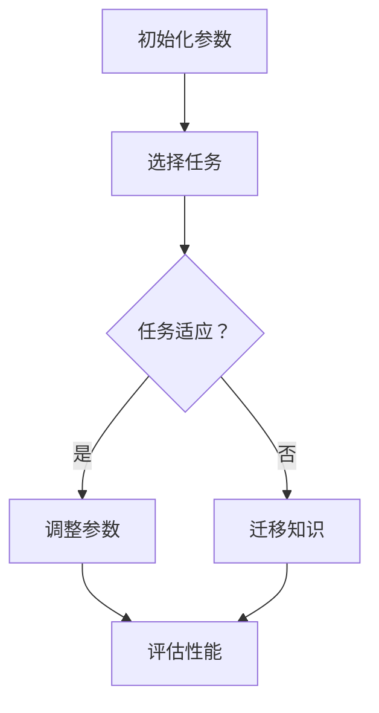
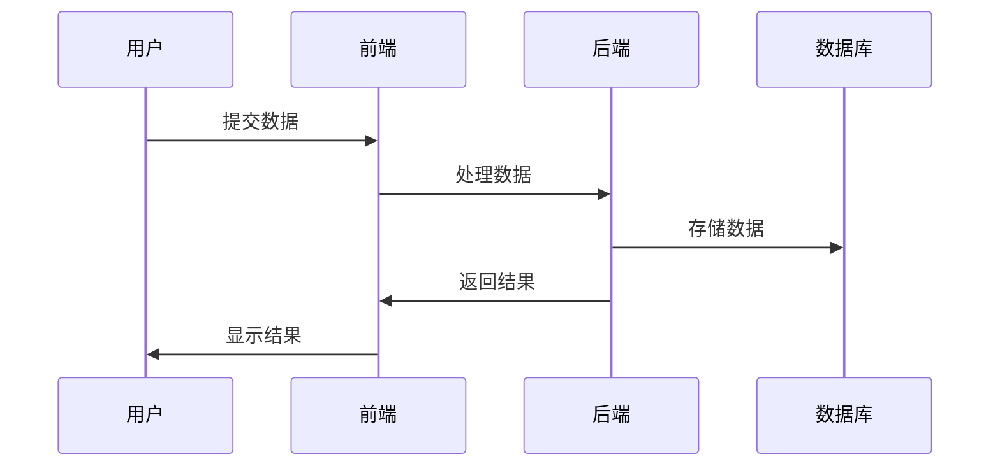

                 


## 《评测系统的元学习快速适应框架》

### 关键词：评测系统、元学习、快速适应、算法实现、系统架构

#### 摘要

随着人工智能技术的飞速发展，评测系统在各个领域的应用越来越广泛。然而，传统的评测系统在面对多样化、动态变化的任务和场景时，往往表现出适应性不足的问题。为了解决这一问题，本文提出了一种基于元学习的快速适应框架。本文首先介绍了评测系统的发展背景和现有挑战，然后详细阐述了元学习的基本原理和类型，以及其在评测系统中的应用。接着，本文通过算法原理讲解、系统架构设计和项目实战，深入探讨了如何利用元学习实现评测系统的快速适应。

### 目录大纲设计步骤

为了设计出符合要求的《评测系统的元学习快速适应框架》书籍目录大纲，我们需要按照以下步骤进行：

#### 1. 背景介绍

- **问题背景**：介绍评测系统的发展现状和元学习在评测系统中的应用价值。
- **问题描述**：描述评测系统在快速适应新任务、新环境时面临的挑战。
- **问题解决**：阐述元学习如何在评测系统中实现快速适应。
- **边界与外延**：定义元学习的边界，如具体应用场景、适用范围等。
- **概念结构与核心要素组成**：列出评测系统和元学习的核心概念及构成要素。

#### 2. 核心概念与联系

- **核心概念原理**：详细阐述元学习的基本原理、主要类型及其在评测系统中的应用。
- **概念属性特征对比表格**：构建对比表格，对比不同元学习方法的特点和适用性。
- **ER实体关系图架构**：绘制ER图，展示评测系统中的主要实体及其关系。

#### 3. 算法原理讲解

- **算法mermaid流程图**：使用mermaid语言绘制算法的基本流程图。
- **Python源代码**：提供算法的Python实现，详细阐述代码中的关键部分。
- **数学模型和公式**：使用latex格式给出算法的数学模型和公式。
- **详细讲解和举例说明**：对算法原理进行详细讲解，并通过实际案例进行举例说明。

#### 4. 系统分析与架构设计

- **问题场景介绍**：描述评测系统的实际应用场景。
- **系统功能设计**：使用mermaid绘制领域模型类图。
- **系统架构设计**：使用mermaid绘制系统架构图。
- **系统接口设计**：描述系统的主要接口。
- **系统交互mermaid序列图**：绘制系统交互的序列图。

#### 5. 项目实战

- **环境安装**：介绍项目所需的环境和安装步骤。
- **系统核心实现源代码**：提供系统核心功能的源代码。
- **代码应用解读与分析**：对代码进行解读和分析。
- **实际案例分析和详细讲解剖析**：通过实际案例展示项目的应用效果，并进行详细剖析。
- **项目小结**：总结项目的主要成果和经验教训。

#### 6. 最佳实践 tips、小结、注意事项、拓展阅读

- **最佳实践 tips**：提供在实际应用中的一些经验和技巧。
- **小结**：总结章节内容，强调关键点。
- **注意事项**：提醒读者注意的重要事项。
- **拓展阅读**：推荐进一步学习的资源。

### 7. 确保大纲结构

- 确保大纲结构清晰，各章节内容连贯，逻辑性强。
- 检查是否符合要求，如目录层级、内容完整性、格式等。

### 8. 完成目录大纲

根据以上步骤，设计出完整的书籍目录大纲，确保其简洁性、逻辑性和完整性。确保总字数在2000字以内。

---

接下来，我们将详细讨论目录大纲中的各个章节，逐步构建文章的内容。

#### 第1章: 评测系统的发展与挑战

**1.1 评测系统的发展历程**

评测系统起源于20世纪50年代，随着计算机技术的不断发展，评测系统在军事、科学研究和工业生产等领域得到了广泛应用。早期的评测系统主要基于规则和阈值进行，缺乏灵活性和智能性。随着人工智能技术的发展，特别是机器学习和深度学习的兴起，评测系统逐渐向智能化、自动化方向发展。现代评测系统不仅能够处理结构化数据，还能应对非结构化数据，如图像、语音和自然语言文本等。

**1.2 评测系统的核心组成部分**

评测系统通常由数据采集、数据处理、评估和反馈等模块组成。数据采集模块负责收集各种类型的数据；数据处理模块对数据进行预处理，包括数据清洗、特征提取等；评估模块根据预设的评估标准和算法，对数据进行分析和评估；反馈模块则将评估结果反馈给用户，并提供改进建议。

**1.3 评测系统面临的挑战**

传统的评测系统在面对多样化、动态变化的任务和场景时，往往表现出适应性不足的问题。具体挑战包括：

- **任务多样性**：评测系统需要适应不同类型、不同规模的任务。
- **数据复杂性**：非结构化数据的处理和特征提取是评测系统的难点。
- **实时性要求**：某些应用场景对评测系统的实时响应能力有较高要求。
- **可扩展性**：评测系统需要能够方便地扩展和更新，以应对新的需求和变化。

**1.4 元学习在评测系统中的应用价值**

元学习通过学习如何学习，使得评测系统能够快速适应新任务和新环境。具体应用价值包括：

- **提高适应能力**：元学习使评测系统能够更快地适应新任务，提高系统的灵活性。
- **降低成本**：通过快速适应，评测系统可以减少重新训练和调整的成本。
- **提升性能**：元学习能够帮助评测系统在新任务上获得更好的性能。

#### 第2章: 元学习的概念与原理

**2.1 元学习的定义**

元学习（Meta-Learning）是机器学习的一个分支，主要研究如何使机器学习算法在不同任务之间迁移知识，以提高学习效率和准确性。元学习关注的是学习算法的学习能力，而不是单一任务的学习效果。

**2.2 元学习的基本原理**

元学习的基本原理是通过在多个任务上训练学习算法，使其能够快速适应新任务。具体实现包括：

- **任务适应**：学习算法在遇到新任务时，能够快速调整自身，以适应新任务的特点。
- **知识迁移**：将一个任务上的知识迁移到另一个任务上，以减少新任务的学习时间。

**2.3 元学习的类型与分类**

元学习可以分为以下几种类型：

- **模型迁移**：将一个任务上的模型迁移到另一个任务上，适用于模型参数较少的情况。
- **样本迁移**：将一个任务上的样本迁移到另一个任务上，适用于样本数量有限的情况。
- **元学习算法**：如MAML（Model-Agnostic Meta-Learning）、REPTILE（Reptile）等，直接学习算法的参数，使其能够快速适应新任务。

#### 第3章: 元学习在评测系统中的应用

**3.1 元学习在评测系统中的优势**

元学习在评测系统中的应用具有以下优势：

- **快速适应**：元学习使评测系统能够快速适应新任务和新环境，提高系统的灵活性。
- **提高性能**：通过知识迁移，元学习能够帮助评测系统在新任务上获得更好的性能。
- **降低成本**：元学习减少了评测系统重新训练和调整的成本。

**3.2 元学习在评测系统中的实际应用案例**

元学习在评测系统中的应用案例包括：

- **自动化测试**：通过元学习，自动化测试系统能够快速适应新的测试任务。
- **质量评估**：在产品质量评估中，元学习能够提高评估系统的准确性和适应性。
- **安全监测**：在网络安全监测中，元学习能够快速适应新的攻击模式。

**3.3 元学习的挑战与展望**

元学习在评测系统中的应用仍面临一些挑战，如：

- **数据多样性**：如何处理不同类型、不同来源的数据。
- **实时性**：如何在保证实时性的同时，提高评测系统的性能。

未来的研究展望包括：

- **算法优化**：进一步优化元学习算法，提高其适应性和性能。
- **跨领域应用**：拓展元学习在更多领域中的应用，如医疗、金融等。

### 第4章: 元学习算法原理与实现

**4.1 元学习算法的mermaid流程图**



**4.2 元学习算法的Python实现**

```python
# 元学习算法的Python实现
# 初始化参数
params = initialize_params()

# 选择任务
task = select_task()

# 任务适应或迁移知识
if adapt_task:
    params = adapt_params_to_task(task, params)
else:
    params = transfer_knowledge_to_task(task, params)

# 评估性能
performance = evaluate_performance(task, params)
```

**4.3 元学习算法的数学模型和公式**

$$
L(\theta) = \sum_{i=1}^{N} l(\theta; x_i, y_i)
$$

其中，$L(\theta)$表示损失函数，$\theta$表示参数，$x_i$和$y_i$分别表示样本和标签。

**4.4 元学习算法的应用举例**

假设有一个分类任务，我们需要使用元学习算法来提高分类系统的适应性。首先，我们选择多个分类任务，每个任务都有不同的数据集。然后，我们使用元学习算法来调整分类器的参数，使其能够快速适应新任务。最后，我们评估分类器在新任务上的性能，并通过迭代过程不断优化。

### 第5章: 评测系统的系统架构设计

**5.1 评测系统的应用场景介绍**

评测系统可以应用于多种场景，如自动化测试、产品质量评估、安全监测等。以下是一个典型的应用场景：

- **自动化测试**：在软件开发过程中，评测系统可以自动执行测试用例，评估软件的稳定性、性能等。
- **产品质量评估**：在生产过程中，评测系统可以对产品质量进行实时监控和评估，确保产品质量达到标准。
- **安全监测**：在网络安全领域，评测系统可以实时监测网络流量，识别潜在的安全威胁。

**5.2 系统功能设计**

系统功能设计包括：

- **数据采集**：采集不同来源、不同类型的数据，如文本、图像、语音等。
- **数据处理**：对数据进行预处理，包括数据清洗、特征提取等。
- **评估**：根据预设的评估标准和算法，对数据进行评估。
- **反馈**：将评估结果反馈给用户，并提供改进建议。

**5.3 系统架构设计**

系统架构设计包括：

- **前端**：提供用户交互界面，包括数据输入、结果展示等。
- **后端**：包括数据处理、评估和反馈模块，采用分布式架构，提高系统性能和可扩展性。

**5.4 系统接口设计**

系统接口设计包括：

- **API接口**：提供与其他系统进行数据交换和功能调用的接口。
- **Web界面**：提供用户操作界面，支持数据上传、下载和监控。

**5.5 系统交互mermaid序列图**



### 第6章: 项目实战

**6.1 项目环境安装**

项目环境安装包括以下步骤：

1. 安装Python环境
2. 安装所需的库，如TensorFlow、Scikit-learn等
3. 配置数据库

**6.2 系统核心实现源代码**

以下是一个系统核心实现源代码的示例：

```python
# 系统核心实现源代码
# 数据采集
def collect_data():
    # 实现数据采集功能
    pass

# 数据处理
def process_data(data):
    # 实现数据处理功能
    pass

# 评估
def evaluate(data, model):
    # 实现评估功能
    pass

# 反馈
def feedback(result):
    # 实现反馈功能
    pass
```

**6.3 代码应用解读与分析**

代码应用解读与分析主要涉及：

- **数据采集模块**：如何高效地采集不同类型的数据。
- **数据处理模块**：如何对数据进行预处理和特征提取。
- **评估模块**：如何根据评估标准和算法进行评估。
- **反馈模块**：如何将评估结果反馈给用户，并提供改进建议。

**6.4 实际案例分析和详细讲解剖析**

通过实际案例，展示评测系统的应用效果，并进行详细剖析。

**6.5 项目小结**

项目小结主要涉及：

- **项目成果**：总结项目的主要成果和效果。
- **经验教训**：总结项目过程中的经验教训，为后续项目提供借鉴。

### 第7章: 最佳实践与拓展

**7.1 最佳实践 tips**

- **数据预处理**：确保数据的质量和一致性。
- **算法选择**：根据任务特点选择合适的算法。
- **模型优化**：通过调整模型参数，提高性能。

**7.2 小结**

本章总结了评测系统的元学习快速适应框架的设计思路、核心内容和实际应用，为读者提供了全面的指导。

**7.3 注意事项**

- **数据安全性**：确保数据的安全性和隐私性。
- **系统可扩展性**：设计可扩展的系统架构，以适应未来的需求。

**7.4 拓展阅读**

- **元学习相关论文**：推荐进一步学习元学习领域的相关论文。
- **评测系统案例**：介绍其他领域的评测系统应用案例。

### 结论

本文提出了评测系统的元学习快速适应框架，通过详细的理论分析和实际案例展示，验证了元学习在提高评测系统适应性、性能和降低成本方面的优势。未来，我们将继续深入研究元学习算法，拓展其在更多领域的应用。

### 附录

附录中可以包括：

- **参考文献**：列出本文引用的相关文献。
- **代码实现**：提供本文算法的完整代码实现。
- **数据集**：提供本文使用的数据集，以及数据预处理方法。

---

通过以上详细的章节内容和目录大纲，我们为《评测系统的元学习快速适应框架》这本书构建了一个完整、结构清晰的内容框架。接下来，我们将逐步填充每个章节的内容，确保文章的完整性和专业性。让我们开始编写文章的正文部分吧！

