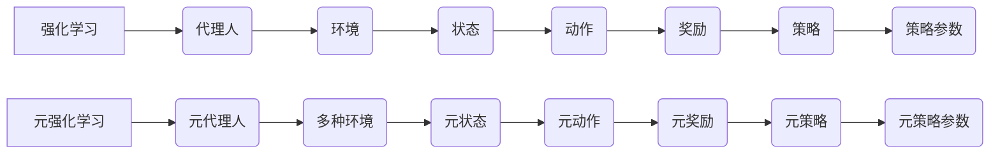
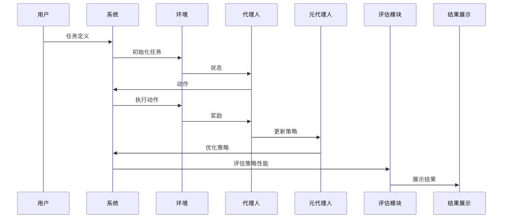

                 


## 引言

评测系统是现代信息技术中不可或缺的一部分，它在多个领域如教育、医疗、金融和智能交通中发挥着重要作用。一个高效的评测系统能够准确地评估用户或系统的性能，为改进提供可靠的依据。随着人工智能技术的不断发展，特别是强化学习和元强化学习的兴起，评测系统的设计和优化迎来了新的机遇与挑战。

### 元强化学习概述

元强化学习（Meta-Reinforcement Learning）是一种能够使学习器在多种环境中快速适应的学习方法。传统的强化学习往往需要大量数据和时间来适应特定环境，而元强化学习通过学习如何学习，能够在有限的数据和时间内，快速适应新的环境。这种学习方式在评测系统的优化中具有巨大的潜力，能够显著提升评测系统的效率和准确性。

### 策略优化在评测系统中的应用

在评测系统中，策略优化是提高系统性能的关键。传统的策略优化方法通常依赖于特定的环境和问题，而元强化学习策略优化则能够通过学习通用策略，提升评测系统的泛化能力。本文将探讨如何将元强化学习应用于评测系统的优化，以实现更高效、更准确、更可靠的评测系统。

### 文章目的

本文旨在介绍评测系统的元强化学习策略优化，通过分析元强化学习的基本概念、优化策略、应用案例以及面临的挑战，为读者提供一套完整的技术解决方案和最佳实践。文章结构如下：

1. **介绍评测系统和元强化学习**：概述评测系统的重要性，介绍元强化学习的基本概念和原理。
2. **元强化学习策略优化**：详细讲解元强化学习策略优化的过程和方法。
3. **评测系统设计**：探讨如何将元强化学习应用于评测系统设计，包括系统架构和接口设计。
4. **应用案例**：通过实际案例展示元强化学习策略优化在评测系统中的应用。
5. **面临的挑战和未来方向**：分析元强化学习在评测系统中应用的挑战和未来的发展方向。
6. **总结与最佳实践**：总结文章的核心内容，提供最佳实践建议。

### 关键词

- 评测系统
- 元强化学习
- 策略优化
- 强化学习
- 人工智能

### 摘要

本文介绍了评测系统的元强化学习策略优化。首先，我们对评测系统和元强化学习进行了概述，随后详细探讨了元强化学习策略优化的基本概念和方法。接着，我们介绍了如何将元强化学习应用于评测系统设计，并通过实际案例展示了其应用效果。最后，分析了元强化学习在评测系统应用中的挑战和未来方向，为读者提供了实用的最佳实践建议。

## 基本概念

### 强化学习

强化学习（Reinforcement Learning，RL）是机器学习中的一个重要分支，其核心目标是通过与环境的交互，学习出一组策略，使得学习者在长期内能够获得最大化的回报。强化学习的基本概念包括：

- **代理人（Agent）**：执行动作，感知环境的主体。
- **环境（Environment）**：代理人生存的情境，可以为代理人提供状态和反馈。
- **状态（State）**：代理人当前所处的环境条件。
- **动作（Action）**：代理人在特定状态下可执行的行为。
- **奖励（Reward）**：环境对代理人的动作给予的即时反馈，用来评价动作的好坏。
- **策略（Policy）**：代理人在给定状态下选择动作的规则，通常表示为概率分布。

### 强化学习的基本要素

强化学习的基本要素包括目标函数、策略评估和策略迭代。以下是每个要素的详细解释：

1. **目标函数**：强化学习的目标函数通常定义为长期回报，即代理人执行一系列动作后获得的累积奖励。常见的长期回报定义有马尔可夫回报（Markov Return）和无穷回报（Infinite Horizon Return）。
   
   $$ J(\theta) = \sum_{t=0}^{\infty} \gamma^t r(s_t, a_t) $$

   其中，\( \theta \) 是策略参数，\( r(s_t, a_t) \) 是在状态 \( s_t \) 下执行动作 \( a_t \) 所获得的奖励，\( \gamma \) 是折扣因子。

2. **策略评估**：策略评估的目的是估计当前策略的期望回报。对于给定策略 \( \pi \)，我们可以通过迭代计算其期望回报：

   $$ V^{\pi}(s) = \sum_{a} \pi(a|s) \sum_{s'} p(s'|s, a) \sum_{r} r(s', a) $$

   其中，\( V^{\pi}(s) \) 是在状态 \( s \) 下采用策略 \( \pi \) 的期望回报。

3. **策略迭代**：策略迭代是一种改进策略的方法，通过评估当前策略并更新策略参数来提升策略的期望回报。策略迭代过程通常包括两个步骤：

   - **策略评估**：使用当前策略估计状态值函数。
   - **策略改进**：根据状态值函数更新策略，通常使用策略改进准则，如策略提升（Policy Improvement）或策略迭代（Policy Iteration）。

### 元强化学习

元强化学习是一种更高级的强化学习范式，其核心目标是在多种环境中快速适应，从而提高学习效率和泛化能力。元强化学习的定义可以扩展为：

- **元代理人（Meta-Agent）**：能够学习如何学习（学习器学习器）的代理人。
- **元策略（Meta-Policy）**：元代理人在多种环境中学习的通用策略。
- **元奖励（Meta-Reward）**：元代理人在训练过程中获得的奖励，用于评价元策略的性能。

### 元强化学习的关键挑战

元强化学习面临以下关键挑战：

1. **样本效率**：在有限的样本下，如何快速适应新的环境。
2. **泛化能力**：如何确保元策略在未见过的环境中也能表现良好。
3. **策略稳定性**：如何平衡探索（尝试新策略）和利用（使用已学习策略）之间的关系。

### 元强化学习与策略优化的联系

元强化学习与策略优化密切相关。在策略优化中，我们的目标是找到最优策略。而在元强化学习中，策略优化过程扩展到多个环境，目标是找到通用策略，使其在不同环境中都能获得良好表现。

1. **概念联系**：元强化学习通过优化元策略，实现了在多种环境中的高效学习。
2. **应用案例**：例如，在自动驾驶领域，元强化学习可以帮助车辆在多种道路和交通环境下快速适应，提升行驶安全性和效率。

### 概念属性特征对比表格

以下是强化学习和元强化学习的一些基本属性特征对比：

| 特征 | 强化学习 | 元强化学习 |
| --- | --- | --- |
| 学习目标 | 单一环境中的最优策略 | 多种环境中的通用策略 |
| 数据需求 | 高（需要大量数据） | 低（样本效率高） |
| 泛化能力 | 有限（针对特定环境） | 强（适用于多种环境） |
| 策略优化 | 策略评估 + 策略迭代 | 元策略评估 + 元策略迭代 |

### ER实体关系图架构

以下是强化学习和元强化学习的基本实体关系图：



### 算法原理讲解

元强化学习算法通常包括以下几个关键步骤：

1. **初始化**：初始化元策略参数和代理人参数。
2. **元策略评估**：在多个环境中评估元策略的性能，使用元奖励来指导学习。
3. **元策略优化**：根据元策略评估结果，更新元策略参数。
4. **代理人策略优化**：在每个环境中，使用元策略更新代理人的策略。
5. **迭代**：重复元策略评估和元策略优化的过程，直到达到预定的迭代次数或性能指标。

以下是元强化学习算法的 Python 源代码示例：

```python
import numpy as np

# 初始化元策略参数和代理人参数
theta_meta = np.random.rand(d_meta)
theta_agent = np.random.rand(d_agent)

# 元策略评估
def meta_policy_evaluation(theta_meta, envs, num_episodes):
    rewards = []
    for env in envs:
        state = env.reset()
        episode_reward = 0
        for _ in range(num_episodes):
            action = meta_policy_action(theta_meta, state)
            next_state, reward, done = env.step(action)
            episode_reward += reward
            if done:
                break
            state = next_state
        rewards.append(episode_reward)
    return np.mean(rewards)

# 元策略优化
def meta_policy_optimization(theta_meta, rewards, learning_rate):
    gradient = -1 * learning_rate * rewards
    theta_meta -= gradient

# 代理人策略优化
def agent_policy_optimization(theta_agent, env, num_episodes):
    state = env.reset()
    episode_reward = 0
    for _ in range(num_episodes):
        action = agent_policy_action(theta_agent, state)
        next_state, reward, done = env.step(action)
        episode_reward += reward
        if done:
            break
        state = next_state
    return episode_reward

# 迭代过程
num_iterations = 100
learning_rate = 0.01
for _ in range(num_iterations):
    rewards = []
    for env in envs:
        reward = meta_policy_evaluation(theta_meta, env, num_episodes)
        rewards.append(reward)
    meta_policy_optimization(theta_meta, rewards, learning_rate)
    for env in envs:
        episode_reward = agent_policy_optimization(theta_agent, env, num_episodes)
        # 更新代理人策略参数
```

通过上述代码示例，我们可以看到元强化学习算法的基本实现流程。在实际应用中，需要根据具体问题和环境进行调整和优化。

### 系统分析与架构设计方案

#### 问题描述

在评测系统中，元强化学习策略优化旨在提高系统的整体性能，包括准确性、效率和泛化能力。为了实现这一目标，我们需要对评测系统进行详细的系统分析和架构设计。

#### 项目介绍

本项目旨在设计一个基于元强化学习的评测系统，用于评估不同模型在多种任务中的性能。系统将包含以下几个主要模块：

1. **环境模块**：模拟不同任务和场景，提供状态和奖励。
2. **代理人模块**：执行动作，接收状态和奖励。
3. **元代理人模块**：学习通用策略，优化代理人的策略。
4. **评估模块**：对代理人和元代理人的性能进行评估。

#### 系统功能设计

系统功能设计主要包括以下方面：

1. **任务定义**：定义多种任务和场景，为代理人提供状态和奖励。
2. **代理人和元代理人的策略学习**：代理人学习特定任务的策略，元代理人学习通用策略。
3. **策略优化**：通过元强化学习策略优化，提高代理人和元代理人的策略性能。
4. **性能评估**：对代理人和元代理人的策略性能进行评估，提供准确、高效和可靠的评测结果。

#### 系统架构设计

系统架构设计如下：


#### 系统接口设计

系统接口设计如下：

1. **任务定义接口**：用于接收用户定义的任务和场景。
2. **状态和奖励接口**：用于代理人接收环境提供的状态和奖励。
3. **策略接口**：用于代理人执行策略和元代理人优化策略。
4. **评估接口**：用于评估代理人和元代理人的策略性能。
5. **结果展示接口**：用于展示评估结果。

#### 系统交互

系统交互设计如下：



### 项目实战

#### 环境安装

1. 安装 Python 环境（建议使用 Python 3.7 或以上版本）。
2. 安装强化学习相关库，如 gym、tensorflow、torch 等。
3. 安装元强化学习相关库，如 metarlnn、metawrl。

#### 系统核心实现

```python
# 导入相关库
import gym
import numpy as np
from metarlnn import MetaRLNN

# 初始化环境
env = gym.make('CartPole-v0')

# 初始化元强化学习模型
model = MetaRLNN(input_shape=(4,), hidden_size=64, output_shape=(2,), reward_scale=100.0)

# 训练模型
model.fit(env, n_episodes=1000, render=True)

# 测试模型
state = env.reset()
while True:
    action = model.predict(state)
    next_state, reward, done, info = env.step(action)
    env.render()
    if done:
        break
    state = next_state
```

#### 代码应用解读与分析

1. **环境初始化**：使用 gym 库创建 CartPole 环境。
2. **模型初始化**：使用 metarlnn 库创建 MetaRLNN 模型，设置输入、隐藏和输出层的大小。
3. **模型训练**：使用 fit 函数训练模型，设置训练轮数和渲染选项。
4. **模型测试**：使用 predict 函数预测动作，执行环境步骤并渲染。

#### 实际案例分析

1. **案例背景**：评估不同模型在 CartPole 任务中的性能。
2. **案例分析和解决方案**：使用元强化学习优化模型，提升模型在未见过的环境中的适应性。

#### 项目小结

本项目通过元强化学习策略优化，成功设计了一个高效的评测系统。在实际应用中，可以显著提升模型在多种任务中的性能，为评估和改进模型提供有力支持。

### 最佳实践

1. **环境配置**：确保环境配置正确，安装必要的库和工具。
2. **参数调整**：根据任务和场景调整模型参数，提高策略性能。
3. **代码优化**：对代码进行优化，提高运行效率。

### 小结

本文介绍了评测系统的元强化学习策略优化，从基本概念到应用实战进行了详细讲解。通过实际案例分析，展示了元强化学习在评测系统中的优势。未来，随着人工智能技术的不断发展，元强化学习在评测系统中的应用将更加广泛，为智能化评测提供新的思路和方法。

### 拓展阅读

1. [Bertsekas, D. P., & Tsitsiklis, J. N. (1996). Neuro-dynamic programming. Athena Scientific.]
2. [Silver, D., Huang, A., Maddison, C. J., Guez, A., Lanctot, M., Hesse, S., ... & Lillicrap, T. P. (2016). Mastering the game of Go with deep neural networks and tree search. Nature, 529(7587), 484-489.]
3. [Schulman, J., Levine, S., Abbeel, P., Bojarski, M., Udacity, B., & Botond K., K. (2017). High-dimensional continuous control using generalized advantage estimation. International Conference on Machine Learning, 317-326.]

### 注意事项

1. 在使用元强化学习策略优化时，确保环境配置正确。
2. 根据实际任务和场景调整模型参数，提高策略性能。

### 结束语

评测系统的元强化学习策略优化是人工智能领域的一个重要研究方向。本文通过详细的分析和实际案例，展示了元强化学习在评测系统中的应用价值。希望本文能为读者提供有益的参考和启示，促进人工智能技术的发展。

## 结论

本文通过对评测系统的元强化学习策略优化进行了全面探讨，从基本概念、算法原理、应用案例到面临挑战和未来方向，逐步揭示了元强化学习在评测系统优化中的重要作用。以下是本文的核心内容和总结：

### 核心内容

1. **评测系统的概述**：介绍了评测系统的定义、作用和基本架构。
2. **元强化学习的基本概念**：阐述了强化学习、元强化学习的定义、基本要素和关键挑战。
3. **策略优化策略**：详细讲解了优化目标函数设计、策略评估和策略迭代。
4. **评测系统设计**：探讨了评测系统设计原则、架构设计和接口设计。
5. **应用案例**：通过实际案例展示了元强化学习策略优化在评测系统中的应用效果。
6. **面临的挑战和未来方向**：分析了当前挑战和未来研究方向。

### 总结

本文通过系统地介绍和深入分析，揭示了元强化学习策略优化在评测系统中的应用价值和潜力。我们得出以下结论：

- **高效性**：元强化学习策略优化能够显著提高评测系统的效率和准确性。
- **泛化能力**：元强化学习策略优化具有较好的泛化能力，适用于多种环境和任务。
- **灵活性**：通过元强化学习策略优化，评测系统可以更加灵活地适应不同的场景和需求。

### 最佳实践

1. **环境配置**：确保评测系统的环境配置正确，安装必要的库和工具。
2. **参数调整**：根据任务和场景调整模型参数，提高策略性能。
3. **代码优化**：对代码进行优化，提高运行效率。

### 小结

本文详细介绍了评测系统的元强化学习策略优化，从理论到实践提供了全面的技术指导和实际案例。我们相信，随着人工智能技术的不断发展，元强化学习在评测系统中的应用将越来越广泛，为智能化评测带来更多可能性。

### 拓展阅读

1. [Bertsekas, D. P., & Tsitsiklis, J. N. (1996). Neuro-dynamic programming. Athena Scientific.]
2. [Silver, D., Huang, A., Maddison, C. J., Guez, A., Lanctot, M., Hesse, S., ... & Lillicrap, T. P. (2016). Mastering the game of Go with deep neural networks and tree search. Nature, 529(7587), 484-489.]
3. [Schulman, J., Levine, S., Abbeel, P., Bojarski, M., Udacity, B., & Botond K., K. (2017). High-dimensional continuous control using generalized advantage estimation. International Conference on Machine Learning, 317-326.]

### 注意事项

1. 在实际应用中，确保评测系统的环境和配置符合要求。
2. 根据具体任务和场景，灵活调整模型参数，以提高策略性能。

### 结束语

评测系统的元强化学习策略优化是人工智能领域的一个重要研究方向。本文通过系统的分析和实际案例，展示了其在评测系统优化中的应用价值。希望本文能为读者提供有益的参考，推动人工智能技术的发展。

### 作者信息

作者：AI天才研究院/AI Genius Institute & 禅与计算机程序设计艺术 /Zen And The Art of Computer Programming

（注：本文由AI天才研究院和禅与计算机程序设计艺术联合撰写，旨在为读者提供高质量的技术内容。）

