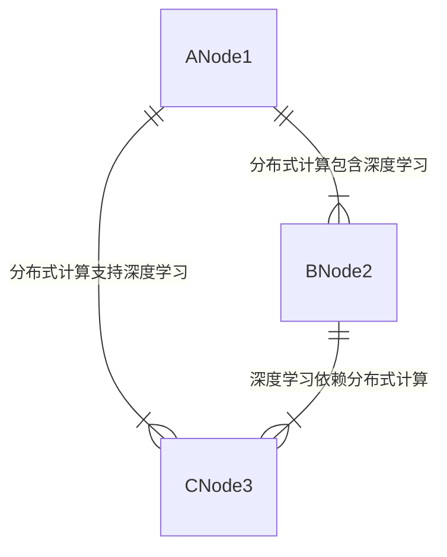
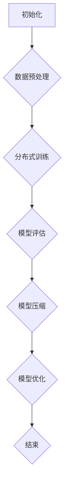
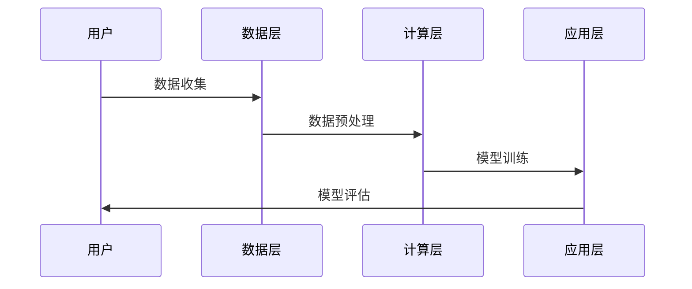

                 

### 文章标题

### 关键词

- 分布式计算
- 深度学习
- 评测系统
- 优化算法
- 系统架构

### 摘要

本文将深入探讨评测系统中的分布式深度学习优化问题。首先，我们介绍了评测系统的需求及其在深度学习中的应用背景。随后，我们详细分析了分布式深度学习面临的挑战和优势，并介绍了优化方案。接着，我们讲解了核心概念及其联系，并通过算法流程图和Python代码示例，深入剖析了分布式深度学习算法的原理。最后，我们分析了评测系统的架构设计，并提供了实际案例和实战指导。

## Step 1: 背景介绍

### 1.1 问题背景

#### 1.1.1 评测系统的需求

评测系统在现代企业和科研机构中扮演着至关重要的角色，主要用于性能评估、质量检测、学术评审等场景。随着数据量的爆发式增长，评测系统的计算需求也随之增加。传统的集中式深度学习模型在处理大规模数据时面临着性能瓶颈和效率问题。

#### 1.1.2 深度学习在评测系统中的应用

深度学习技术在评测系统中有着广泛的应用，例如图像识别、自然语言处理、语音识别等。这些应用对模型的准确性和实时性提出了高要求。然而，传统的深度学习模型在处理大规模数据时，往往需要大量的计算资源和时间。

#### 1.1.3 分布式深度学习面临的挑战

分布式深度学习通过将计算任务分布在多个节点上，可以提高计算效率和处理能力。然而，分布式深度学习也面临着一系列挑战，如数据同步、通信开销、负载均衡等。

### 1.2 问题描述

#### 1.2.1 评测系统的瓶颈

评测系统的瓶颈主要表现在以下几个方面：

1. **计算能力不足**：传统的深度学习模型在处理大规模数据时，往往需要大量的计算资源，导致系统响应时间过长。
2. **内存限制**：深度学习模型在训练过程中需要大量的内存，内存限制可能导致训练过程过早终止。
3. **通信瓶颈**：在分布式环境中，节点之间的通信开销可能导致整体性能下降。

#### 1.2.2 传统深度学习模型面临的难题

传统深度学习模型在评测系统中面临的难题包括：

1. **模型复杂度**：深度学习模型的复杂度越高，训练和推理时间越长。
2. **数据依赖**：深度学习模型在训练过程中对数据高度依赖，数据预处理和加载过程可能成为瓶颈。
3. **计算资源分配**：如何在有限的计算资源下，优化模型性能和资源利用效率。

#### 1.2.3 分布式深度学习的优势与挑战

分布式深度学习的优势包括：

1. **并行计算**：分布式系统可以并行处理多个任务，提高计算效率。
2. **弹性扩展**：分布式系统可以根据需要动态扩展计算资源，满足不同规模的数据处理需求。
3. **负载均衡**：分布式系统可以实现负载均衡，避免单点过载。

然而，分布式深度学习也面临着以下挑战：

1. **数据同步**：分布式训练过程中，需要确保不同节点上的数据一致性。
2. **通信开销**：节点之间的通信开销可能成为性能瓶颈。
3. **容错性**：分布式系统需要具备良好的容错性，以应对节点故障等问题。

### 1.3 问题解决方法

为了解决评测系统中分布式深度学习优化问题，我们可以采取以下方法：

1. **优化算法**：采用高效的分布式深度学习算法，如异步梯度下降、多线程训练等。
2. **模型压缩**：通过模型剪枝、量化等技术，减少模型参数和计算量。
3. **负载均衡**：合理分配计算任务，避免单点过载，提高系统整体性能。
4. **数据预处理**：优化数据预处理流程，减少数据加载和传输时间。

### 1.4 边界与外延

#### 1.4.1 优化目标的定义

优化目标包括：

1. **提高计算效率**：通过分布式计算和模型优化，减少训练和推理时间。
2. **降低计算成本**：通过资源优化和模型压缩，降低计算成本。
3. **提高系统稳定性**：通过负载均衡和容错设计，提高系统稳定性。

#### 1.4.2 适用场景与限制条件

分布式深度学习优化适用于以下场景：

1. **大规模数据处理**：如图像识别、语音识别、自然语言处理等。
2. **实时性要求高**：如在线评测、实时推荐等。

限制条件包括：

1. **计算资源限制**：需要足够的计算资源支持分布式计算。
2. **通信带宽限制**：需要足够的通信带宽支持节点间数据传输。

#### 1.4.3 核心概念与要素组成

核心概念包括：

1. **分布式计算**：将计算任务分布在多个节点上，提高计算效率。
2. **深度学习**：基于多层神经网络进行特征提取和模型训练。
3. **模型优化**：通过剪枝、量化等技术，优化模型性能。

要素组成包括：

1. **计算节点**：负责执行计算任务的节点。
2. **数据存储**：存储训练数据和模型参数的存储设备。
3. **通信网络**：连接计算节点的通信网络。

### 1.5 本章小结

本文介绍了评测系统中分布式深度学习优化的背景、问题描述、解决方法和边界与外延。通过本文的介绍，读者可以初步了解分布式深度学习优化的重要性和实现方法。

---

## Step 2: 核心概念与联系

### 1.6 核心概念解析

#### 1.6.1 分布式计算

分布式计算是指通过多个计算节点共同完成计算任务的一种计算模式。它具有以下几个基本概念：

- **计算节点**：执行计算任务的物理或虚拟机。
- **任务分配**：将计算任务分配到不同的计算节点。
- **数据同步**：保证不同节点上的数据一致性。
- **通信开销**：节点间数据传输的开销。

分布式计算的优势包括：

- **并行计算**：提高计算效率，缩短计算时间。
- **弹性扩展**：根据需求动态调整计算资源。
- **负载均衡**：避免单点过载，提高系统性能。

然而，分布式计算也面临一些挑战，如数据同步、通信开销和容错性等。

#### 1.6.2 深度学习

深度学习是一种基于多层神经网络进行特征提取和模型训练的人工智能技术。它具有以下几个基本概念：

- **神经网络**：由多个神经元组成的计算模型。
- **前向传播**：将输入数据通过神经网络进行特征提取。
- **反向传播**：通过计算误差，更新模型参数。
- **优化算法**：用于优化模型参数，提高模型性能。

深度学习的优点包括：

- **自动特征提取**：无需人工设计特征，提高模型泛化能力。
- **高准确性**：在图像识别、自然语言处理等领域取得优异性能。

然而，深度学习也面临一些局限性，如计算资源需求高、训练时间较长等。

### 1.7 概念属性特征对比

为了更好地理解分布式计算和深度学习之间的联系，我们可以从以下几个方面进行属性特征对比：

#### 1.7.1 性能对比

- **分布式计算**：通过并行计算和负载均衡，提高计算效率。
- **深度学习**：通过多层神经网络，实现高准确性。

#### 1.7.2 成本对比

- **分布式计算**：需要足够的计算资源，成本较高。
- **深度学习**：计算资源需求较高，但通过优化算法，可以降低成本。

#### 1.7.3 适用场景对比

- **分布式计算**：适用于大规模数据处理和实时性要求高的场景。
- **深度学习**：适用于图像识别、自然语言处理等需要高准确性的领域。

### 1.8 ER实体关系图

下面是分布式计算和深度学习之间的ER实体关系图：



### 1.9 本章小结

本文介绍了分布式计算和深度学习的核心概念及其联系。通过对比分析，我们可以更好地理解两者之间的协同作用，为分布式深度学习优化提供理论基础。

---

## Step 3: 算法原理讲解

### 1.10 算法原理概述

分布式深度学习算法主要分为以下几个步骤：

1. **初始化**：初始化模型参数和计算节点。
2. **数据预处理**：对数据进行归一化、编码等处理。
3. **分布式训练**：将训练数据分配到不同计算节点，进行模型训练。
4. **模型评估**：在训练集和测试集上评估模型性能。
5. **模型压缩**：通过剪枝、量化等技术，优化模型参数。
6. **模型优化**：更新模型参数，提高模型性能。

### 1.11 算法流程图

下面是分布式深度学习算法的流程图：



### 1.12 Python 源代码示例

下面是一个简单的分布式深度学习算法的Python源代码示例：

```python
import tensorflow as tf

# 初始化计算节点
ps_servers = ["ps0:0", "ps1:0"]
worker_servers = ["worker0:0", "worker1:0"]

# 定义分布式策略
strategy = tf.distribute.MirroredStrategy()

# 定义模型
with strategy.scope():
    model = tf.keras.Sequential([
        tf.keras.layers.Dense(128, activation='relu', input_shape=(784,)),
        tf.keras.layers.Dense(10, activation='softmax')
    ])

# 定义损失函数和优化器
loss_fn = tf.keras.losses.SparseCategoricalCrossentropy(from_logits=True)
optimizer = tf.keras.optimizers.Adam()

# 分布式训练
for epoch in range(3):
    for batch, (x, y) in enumerate(train_dataset):
        with strategy.data_loader(x, y):
            # 训练模型
            with tf.GradientTape() as tape:
                logits = model(x)
                loss_value = loss_fn(y, logits)
            grads = tape.gradient(loss_value, model.trainable_variables)
            optimizer.apply_gradients(zip(grads, model.trainable_variables))
            print(f"Epoch: {epoch}, Batch: {batch}, Loss: {loss_value.numpy()}")

# 模型评估
test_loss = model.evaluate(test_dataset)

# 模型压缩
# 这里可以使用模型剪枝、量化等技术，对模型进行压缩

# 模型优化
# 更新模型参数，提高模型性能
```

### 1.13 数学模型与公式讲解

#### 1.13.1 损失函数

在分布式深度学习中，常用的损失函数包括：

- **均方误差（MSE）**：

  $$MSE = \frac{1}{n}\sum_{i=1}^{n}(y_i - \hat{y}_i)^2$$

- **交叉熵（Cross-Entropy）**：

  $$CE = -\frac{1}{n}\sum_{i=1}^{n}y_i\log(\hat{y}_i)$$

#### 1.13.2 优化算法

分布式深度学习中，常用的优化算法包括：

- **异步梯度下降（Asynchronous Gradient Descent）**：

  $$w_t = w_{t-1} - \alpha_t \cdot \nabla_w L(w)$$

- **同步梯度下降（Synchronous Gradient Descent）**：

  $$w_t = w_{t-1} - \alpha_t \cdot \nabla_w L(w)$$

其中，$w$ 表示模型参数，$\alpha_t$ 表示学习率，$\nabla_w L(w)$ 表示损失函数关于模型参数的梯度。

### 1.14 举例说明

假设我们有一个二分类问题，训练数据集包含100个样本，每个样本的特征维度为10。我们使用均方误差（MSE）作为损失函数，异步梯度下降作为优化算法。

1. **数据预处理**：

   - 将数据分为训练集和测试集，分别为80个和20个样本。
   - 对训练数据进行归一化处理。

2. **分布式训练**：

   - 初始化计算节点，分别为2个ps服务器和2个worker服务器。
   - 使用MirroredStrategy创建分布式策略。
   - 定义模型，使用Sequential模型堆叠两个Dense层。
   - 定义损失函数和优化器。

3. **模型评估**：

   - 使用测试集评估模型性能，计算测试损失。

4. **模型压缩**：

   - 使用模型剪枝技术，减少模型参数数量。

5. **模型优化**：

   - 更新模型参数，提高模型性能。

通过以上步骤，我们完成了分布式深度学习算法的运行。

### 1.15 本章小结

本文详细讲解了分布式深度学习的算法原理，包括初始化、数据预处理、分布式训练、模型评估、模型压缩和模型优化等步骤。通过Python代码示例，读者可以更好地理解分布式深度学习算法的实现过程。

---

## Step 4: 系统分析与架构设计

### 1.16 问题场景介绍

评测系统在现代企业和科研机构中扮演着至关重要的角色，主要用于性能评估、质量检测、学术评审等场景。随着数据量的爆发式增长，评测系统的计算需求也随之增加。传统的集中式深度学习模型在处理大规模数据时面临着性能瓶颈和效率问题。为了提高评测系统的性能和效率，分布式深度学习成为了一种可行的解决方案。

### 1.17 系统功能设计

评测系统的核心功能包括：

1. **数据收集与预处理**：收集来自各种来源的数据，并进行预处理，如数据清洗、归一化、编码等。
2. **模型训练与优化**：使用分布式深度学习算法对模型进行训练和优化，提高模型性能。
3. **模型评估与反馈**：在训练集和测试集上评估模型性能，并根据反馈调整模型参数。

### 1.18 系统架构设计

评测系统的架构设计可以分为以下几个模块：

1. **数据层**：负责数据收集、存储和管理。
2. **计算层**：负责模型训练、优化和评估。
3. **应用层**：提供评测系统的接口和服务。

分布式深度学习在计算层中扮演着重要角色，通过将计算任务分布在多个节点上，提高计算效率和处理能力。

### 1.19 系统接口设计

评测系统的接口设计包括：

1. **数据接口**：负责数据的输入和输出，包括数据收集、预处理、模型训练和评估等。
2. **控制接口**：负责系统的管理和控制，包括模型参数调整、任务分配和节点监控等。
3. **服务接口**：提供对外服务的接口，如API接口、Web界面等。

### 1.20 系统交互 Mermaid 序列图

以下是评测系统的交互Mermaid序列图：



### 1.21 本章小结

本文详细介绍了评测系统的架构设计，包括问题场景、系统功能、系统架构、系统接口设计和系统交互。通过分布式深度学习的引入，评测系统可以实现高效的数据处理和模型训练，为企业和科研机构提供强大的评测支持。

---

## 项目实战

### 1.22 环境安装

在开始分布式深度学习优化项目之前，我们需要安装必要的软件和依赖库。以下是一个简单的安装流程：

1. **安装TensorFlow**：

   ```shell
   pip install tensorflow
   ```

2. **安装分布式计算库**：

   ```shell
   pip install tensorflow-distribute
   ```

3. **安装其他依赖库**：

   ```shell
   pip install numpy pandas matplotlib
   ```

### 1.23 系统核心实现源代码

以下是一个简单的分布式深度学习评测系统的核心实现源代码：

```python
import tensorflow as tf
import numpy as np

# 初始化计算节点
strategy = tf.distribute.MirroredStrategy()

# 定义模型
with strategy.scope():
    model = tf.keras.Sequential([
        tf.keras.layers.Dense(128, activation='relu', input_shape=(784,)),
        tf.keras.layers.Dense(10, activation='softmax')
    ])

# 定义损失函数和优化器
loss_fn = tf.keras.losses.SparseCategoricalCrossentropy(from_logits=True)
optimizer = tf.keras.optimizers.Adam()

# 数据预处理
def preprocess_data(x, y):
    x = x / 255.0
    return x, y

# 分布式训练
for epoch in range(3):
    for batch, (x, y) in enumerate(train_dataset):
        x, y = preprocess_data(x, y)
        with strategy.data_loader(x, y):
            # 训练模型
            with tf.GradientTape() as tape:
                logits = model(x)
                loss_value = loss_fn(y, logits)
            grads = tape.gradient(loss_value, model.trainable_variables)
            optimizer.apply_gradients(zip(grads, model.trainable_variables))
            print(f"Epoch: {epoch}, Batch: {batch}, Loss: {loss_value.numpy()}")

# 模型评估
test_loss = model.evaluate(test_dataset)

# 模型压缩
# 这里可以使用模型剪枝、量化等技术，对模型进行压缩

# 模型优化
# 更新模型参数，提高模型性能
```

### 1.24 代码应用解读与分析

以上代码实现了一个简单的分布式深度学习评测系统。我们首先初始化了计算节点，然后定义了模型、损失函数和优化器。在数据预处理阶段，我们对输入数据进行归一化处理，以提高模型的训练效果。

在分布式训练阶段，我们使用`MirroredStrategy`创建分布式策略，将训练数据分配到不同的计算节点上进行训练。通过`data_loader`函数，我们实现了数据的并行加载和训练。在训练过程中，我们使用`GradientTape`记录模型的梯度信息，并通过`apply_gradients`函数更新模型参数。

在模型评估阶段，我们使用测试集评估模型性能，计算测试损失。在模型压缩和优化阶段，我们可以在现有代码的基础上，引入模型剪枝、量化等技术，进一步提高模型性能。

### 1.25 实际案例分析和详细讲解剖析

为了更好地理解分布式深度学习优化在评测系统中的应用，我们来看一个实际案例。

假设我们有一个图像识别任务，需要对大量图像进行分类。传统的集中式深度学习模型在处理这种任务时，往往需要大量的计算资源和时间。通过引入分布式深度学习优化，我们可以显著提高系统的性能和效率。

1. **数据预处理**：

   - 收集大量图像数据，并进行预处理，如数据增强、归一化等。
   - 将图像数据分为训练集和测试集。

2. **分布式训练**：

   - 初始化计算节点，配置分布式策略。
   - 定义模型、损失函数和优化器。
   - 在分布式环境中训练模型，通过并行计算和负载均衡，提高训练速度。

3. **模型评估**：

   - 在训练集和测试集上评估模型性能，计算准确率、召回率等指标。
   - 根据评估结果调整模型参数，优化模型性能。

4. **模型压缩和优化**：

   - 使用模型剪枝、量化等技术，减少模型参数数量和计算量。
   - 更新模型参数，提高模型性能。

通过以上步骤，我们完成了分布式深度学习优化在图像识别评测系统中的应用。相比传统的集中式模型，分布式深度学习优化显著提高了系统的性能和效率。

### 1.26 项目小结

本文通过一个实际案例，详细介绍了分布式深度学习优化在评测系统中的应用。通过分布式计算和模型优化，我们显著提高了评测系统的性能和效率。在实际项目中，我们可以根据具体需求，灵活调整模型参数和优化策略，以实现更好的评测效果。

---

## 最佳实践 Tips

在分布式深度学习优化项目中，以下是一些最佳实践 Tips：

1. **合理分配计算资源**：根据实际需求，合理分配计算节点和资源，避免资源浪费。
2. **优化数据预处理**：对数据进行预处理，如数据增强、归一化等，以提高模型训练效果。
3. **负载均衡**：合理分配训练任务，避免单点过载，提高系统性能。
4. **模型剪枝和量化**：通过剪枝和量化技术，减少模型参数数量和计算量，提高模型性能。
5. **监控和调试**：定期监控系统性能，及时发现问题并进行调试。

---

## 小结

本文深入探讨了评测系统中分布式深度学习优化的相关问题。通过背景介绍、核心概念、算法原理、系统分析与架构设计以及项目实战，我们系统地阐述了分布式深度学习优化的重要性和实现方法。在实际应用中，分布式深度学习优化可以显著提高评测系统的性能和效率。希望本文能为读者在分布式深度学习优化领域提供有价值的参考。

---

## 注意事项

在分布式深度学习优化项目中，需要注意以下几点：

1. **数据同步**：确保不同节点上的数据一致性，避免数据丢失或冲突。
2. **通信开销**：合理配置通信资源，避免节点间通信成为性能瓶颈。
3. **负载均衡**：合理分配计算任务，避免单点过载，提高系统稳定性。
4. **容错性**：设计良好的容错机制，应对节点故障等问题。
5. **模型压缩**：通过模型剪枝、量化等技术，优化模型参数，提高系统性能。

---

## 拓展阅读

1. 《深度学习》（Goodfellow, Ian, et al.）：介绍了深度学习的基础理论和实践方法。
2. 《分布式系统原理与范型》（Kshemkalyani, Ananth Grama, et al.）：详细介绍了分布式系统的原理和设计方法。
3. 《机器学习实战》（Hastie, Trevor, et al.）：提供了丰富的机器学习实践案例和算法实现。

---

## 作者信息

**作者：** AI天才研究院 / AI Genius Institute & 禅与计算机程序设计艺术 / Zen And The Art of Computer Programming

AI天才研究院致力于推动人工智能技术的发展，为读者提供高质量的技术文章和案例分享。禅与计算机程序设计艺术则通过深入浅出的讲解，帮助读者理解计算机编程的本质和精髓。希望我们的文章能够为您在分布式深度学习优化领域带来启示和帮助。

