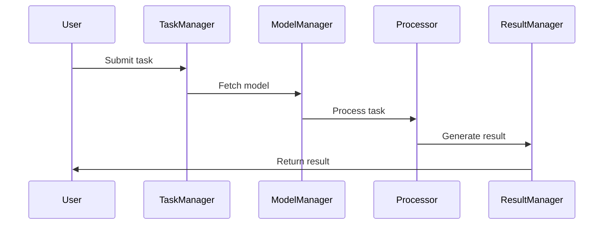

                 

### 引言

在人工智能迅猛发展的今天，机器学习模型的应用越来越广泛，各类复杂模型层出不穷。然而，随着模型规模的不断增大，评测系统面临巨大的挑战。有效的评测系统能够确保模型的性能稳定，准确评估模型在实际应用中的效果，这对于模型的优化和应用至关重要。

**问题背景**：随着人工智能技术的发展，深度学习模型在图像识别、自然语言处理、推荐系统等领域取得了显著成果。然而，这些模型的规模往往非常庞大，包含数百万甚至数亿个参数。传统评测系统在处理这些大规模模型时，常常因为性能瓶颈、资源不足等问题，无法满足实际需求。

**核心概念**：为了应对上述挑战，需要深入理解并设计具有可扩展性的评测系统。可扩展性设计旨在确保系统在面临大规模数据处理和计算时，能够灵活扩展，保持高效性能。

**本文主题**：本文将探讨评测系统的可扩展性设计，重点分析如何应对不断增长的模型规模。我们将逐步分析问题背景，介绍核心概念，并详细讨论可扩展性设计的核心原理和具体实现方法。

**关键词**：
- 评测系统
- 可扩展性设计
- 模型规模
- 模块化设计
- 分层设计
- 并行化设计
- 负载均衡
- 数据分片

**摘要**：本文首先介绍了评测系统面临的背景问题和核心概念，然后详细讨论了可扩展性设计的核心原理，包括模块化设计、分层设计、并行化设计等。接着，通过具体的项目场景，分析了评测系统的架构设计，并深入探讨了数据存储与处理、网络与通信优化等方面的实现细节。最后，本文总结了最佳实践，并对未来研究方向进行了展望。

### 第1章 问题背景与核心概念

#### 1.1 问题背景

随着人工智能技术的不断进步，机器学习模型的应用范围越来越广泛。无论是在图像识别、自然语言处理，还是推荐系统等领域，深度学习模型都展现了其强大的能力。然而，这些模型的复杂度和规模也在迅速增长，传统的评测系统已经难以满足高性能、高可靠性的要求。

**评测系统的必要性**：

- **性能评估**：模型在实际应用中的性能至关重要。通过评测系统能够全面、准确地评估模型的性能，包括准确率、召回率、F1分数等指标。
- **模型优化**：评测系统提供了反馈信息，有助于研究人员和开发者对模型进行调整和优化，提高其性能。
- **比较与选择**：在多个模型之间进行性能比较，有助于选择最优的模型应用于实际问题中。

**模型规模增长挑战**：

- **计算资源需求**：大规模模型的训练和评测通常需要大量的计算资源，包括CPU、GPU和存储等。
- **数据处理效率**：随着模型规模的增加，数据处理的时间成本也会显著上升，这可能会导致评测系统的响应时间变长。
- **存储与传输**：大规模模型的数据存储和传输都带来了巨大的挑战，传统的存储和传输机制可能无法有效支持。

**可扩展性设计的意义**：

- **资源灵活分配**：可扩展性设计能够根据实际需求动态调整资源分配，确保系统在高负载情况下依然能够高效运行。
- **性能稳定性**：通过优化系统架构和算法，可扩展性设计能够保持评测系统的性能稳定性，避免因负载过大导致的系统崩溃。
- **维护与升级**：可扩展性设计使得系统模块化，便于维护和升级，有助于延长系统的生命周期。

#### 1.2 核心概念介绍

在深入探讨评测系统的可扩展性设计之前，我们需要明确几个核心概念：模型规模、可扩展性以及它们之间的关系。

**模型规模的概念**：

- **参数数量**：模型规模的一个关键指标是参数的数量。随着深度学习的发展，神经网络的层数和每层的神经元数量不断增加，导致参数数量呈指数级增长。
- **计算复杂度**：模型规模的增加使得计算复杂度显著提高，这直接影响到评测系统的处理时间和资源消耗。

**可扩展性的概念**：

- **横向扩展**：通过增加服务器节点来提升系统性能，适用于计算资源需求增加的场景。
- **纵向扩展**：通过提升单个服务器的性能（如增加CPU、GPU等）来实现扩展，适用于负载逐渐增加的场景。

**可扩展性设计的边界与外延**：

- **边界**：可扩展性设计需要考虑系统的性能瓶颈和资源限制，确保扩展不会引入新的问题。
- **外延**：可扩展性设计不仅包括硬件和软件层面的优化，还涉及系统架构、算法选择、负载均衡等方面的综合考虑。

#### 1.3 概念结构与核心要素组成

为了更好地理解评测系统可扩展性设计，我们需要分析其概念结构，包括模型规模的核心特征、可扩展性的核心要素以及它们之间的关系。

**模型规模的核心特征**：

- **参数规模**：参数数量是模型规模的核心特征，直接影响计算复杂度和存储需求。
- **数据规模**：大规模模型通常需要处理大量的训练数据和测试数据，这对数据存储和处理提出了更高要求。
- **计算规模**：随着模型规模的增加，计算资源的消耗也显著上升，需要优化算法和系统架构来应对。

**可扩展性的核心要素**：

- **模块化设计**：通过将系统划分为多个模块，每个模块可以独立扩展，降低系统的耦合度。
- **分层设计**：将系统分层，不同层次负责不同的功能，有助于实现系统的灵活扩展。
- **并行化设计**：通过并行计算技术，提高系统处理大规模模型的能力。

**模型规模与可扩展性的关系**：

- **相互依赖**：模型规模是可扩展性的前提，可扩展性是应对模型规模增长的关键。
- **动态调整**：系统需要根据模型规模的动态变化，灵活调整资源配置和架构设计，以保持高效性能。

#### 1.4 本章小结

本章介绍了评测系统面临的背景问题和核心概念。我们首先探讨了评测系统的必要性，分析了模型规模增长的挑战，并阐述了可扩展性设计的意义。接着，我们明确了模型规模和可扩展性的概念，分析了它们之间的边界与外延，并构建了概念结构。通过本章的讨论，为后续深入探讨评测系统的可扩展性设计奠定了基础。

### 第2章 可扩展性设计原理概述

在了解了评测系统的背景和核心概念之后，我们需要深入探讨可扩展性设计的原理，这是确保评测系统能够应对不断增长的模型规模的关键。本章将系统地介绍可扩展性设计的基本原则、关键技术和核心概念属性特征，以便读者能够全面理解并应用这些原理来设计高效的评测系统。

#### 2.1 可扩展性设计的基本原则

可扩展性设计的原则是构建可扩展性系统的基础，主要包括模块化设计、分层设计和并行化设计。这些原则不仅有助于系统的灵活扩展，还能提高系统的性能和可维护性。

**模块化设计**：

- **定义**：模块化设计是指将系统划分为若干个功能独立的模块，每个模块可以独立开发和部署。
- **优点**：
  - **降低复杂性**：模块化设计将复杂系统分解为更小的单元，降低了系统的整体复杂性。
  - **易于维护和升级**：模块化的结构使得系统维护和升级更加方便，因为只需针对某个模块进行操作。
  - **提高扩展性**：通过增加或替换模块，可以轻松实现系统的扩展。

**分层设计**：

- **定义**：分层设计是将系统划分为不同的层次，每个层次负责特定的功能，层次之间通过明确的接口进行交互。
- **优点**：
  - **降低耦合度**：层次之间的低耦合度使得各层次可以独立开发、测试和部署，减少了系统间的相互依赖。
  - **提高灵活性**：分层设计使得系统可以灵活地添加或修改某个层次的功能，而不会影响到其他层次。
  - **便于管理和监控**：分层结构有助于管理和监控系统的各个部分，便于定位问题和优化性能。

**并行化设计**：

- **定义**：并行化设计是利用多个处理单元同时处理任务，以提升系统的处理能力和性能。
- **优点**：
  - **提高性能**：并行处理可以显著减少任务的处理时间，提高系统的响应速度。
  - **资源利用率高**：通过合理分配任务到多个处理单元，可以充分利用系统资源，避免资源浪费。
  - **扩展性强**：并行化设计使得系统可以轻松地通过增加处理单元来提升性能。

#### 2.2 可扩展性设计的关键技术

除了基本原则，可扩展性设计还需要依赖一系列关键技术，这些技术是实现系统高效扩展的关键。

**负载均衡**：

- **定义**：负载均衡是指将系统的请求分布到多个服务器或处理单元上，以避免单点过载和资源浪费。
- **优点**：
  - **提高系统可用性**：通过负载均衡，系统可以更好地应对突发流量，提高服务的可用性。
  - **资源利用率高**：负载均衡可以充分利用各个服务器的资源，避免某个服务器过载而影响整体性能。

**数据分片**：

- **定义**：数据分片是将大量数据分布在多个存储节点上，以提升数据存储和查询的性能。
- **优点**：
  - **提高性能**：数据分片可以显著减少单个节点的负载，提升数据的读取和写入速度。
  - **增强容错性**：数据分片使得系统可以更好地应对节点故障，通过其他节点继续提供服务。

**缓存策略**：

- **定义**：缓存策略是利用内存或其他快速存储设备存储常用数据，以减少数据访问延迟。
- **优点**：
  - **提高响应速度**：缓存可以显著减少数据的访问时间，提高系统的响应速度。
  - **降低负载**：通过缓存常用数据，可以减少数据库或存储节点的访问频率，降低系统负载。

#### 2.3 核心概念属性特征对比表格

为了更清晰地理解模块化设计、分层设计和并行化设计，我们通过以下表格来对比这些核心概念属性特征：

| 设计原则 | 定义 | 核心特征 | 对比分析 |
| --- | --- | --- | --- |
| 模块化设计 | 功能独立模块 | 降低复杂性、易于维护、提高扩展性 | 模块独立、接口明确、易于替换 |
| 分层设计 | 层次分明、功能分离 | 降低耦合度、提高灵活性、便于管理 | 层次划分、接口规范、独立性 |
| 并行化设计 | 多处理单元同时工作 | 提高性能、资源利用率高、扩展性强 | 任务并行、处理单元协调、性能优化 |

通过上述对比表格，我们可以更直观地了解三种设计原则的核心特征和优势，为实际应用提供参考。

#### 2.4 本章小结

本章介绍了评测系统可扩展性设计的核心原则和关键技术。通过模块化设计、分层设计和并行化设计，系统能够在面临不断增长的模型规模时保持高效性能和灵活性。同时，负载均衡、数据分片和缓存策略等关键技术为系统的扩展提供了有力支持。本章的讨论为下一章具体分析评测系统架构设计奠定了基础。

### 第3章 评测系统架构设计

#### 3.1 问题场景介绍

在当前的机器学习应用场景中，评测系统面临的问题日益复杂和多样。以下是一个典型的评测系统问题场景：

**场景描述**：一家互联网公司开发了一款图像识别应用，用户可以通过上传图片来获取识别结果。随着用户数量的增加，应用的负载也不断攀升，导致评测系统的响应时间显著延长，影响了用户体验。此外，公司计划引入更多的图像识别模型，以提升识别的准确率和效率，这进一步增加了系统的压力。

**系统性能指标**：

- **响应时间**：确保用户上传图片后，系统能够在1秒内返回识别结果。
- **吞吐量**：系统需要能够处理每秒至少1000张图片的识别请求。
- **准确率**：识别结果的准确率需要达到95%以上。

**系统目标与挑战**：

- **目标**：设计并实现一个高效、可扩展的评测系统，确保在增加模型规模和用户数量时，系统能够保持稳定性能。
- **挑战**：
  - **高并发处理**：系统需要能够同时处理大量并发请求，确保响应时间和吞吐量满足要求。
  - **模型多样化**：系统需要支持多种图像识别模型，并能够灵活切换和调整模型。
  - **资源优化**：在有限的硬件资源下，通过优化系统架构和算法，提高资源利用率，降低成本。

#### 3.2 项目介绍

**项目背景**：

为了应对上述场景中的挑战，公司决定启动一个评测系统的优化项目。项目的目标是设计并实现一个可扩展的评测系统，以支持大量图像识别模型的评测需求。项目的主要背景包括：

- **技术需求**：系统需要具备高性能、高并发处理能力和灵活性。
- **业务需求**：系统需要能够快速响应，保证用户体验，同时支持未来模型规模的增长。

**项目目标**：

- **提高系统性能**：通过优化系统架构和算法，提高系统的响应速度和处理能力。
- **增加模型支持**：支持多种图像识别模型，并提供灵活切换和调整模型的机制。
- **降低维护成本**：通过模块化设计和分层设计，降低系统的维护成本，提高系统的可维护性。

**项目架构设计理念**：

- **模块化设计**：将系统划分为多个功能模块，每个模块独立开发、测试和部署，降低系统的复杂性。
- **分层设计**：将系统分层，各层次负责不同的功能，确保各层次之间的低耦合度，提高系统的灵活性。
- **并行化设计**：通过并行计算技术，提升系统处理大规模数据和模型的能力。
- **负载均衡**：采用负载均衡策略，合理分配请求，避免单点过载，提高系统的可用性。

#### 3.3 系统功能设计

**领域模型设计**：

为了实现上述项目目标，我们需要设计一个详细的领域模型。领域模型包括以下主要类：

- **用户**：用户类表示系统的用户，包括用户的基本信息和权限。
- **模型**：模型类表示图像识别模型，包括模型名称、参数和性能指标。
- **评测任务**：评测任务类表示用户提交的评测请求，包括任务ID、模型ID和图片数据。
- **评测结果**：评测结果类表示模型的评测结果，包括准确率、召回率和F1分数等指标。

**功能模块划分**：

基于领域模型，我们将系统划分为以下功能模块：

- **用户管理模块**：负责用户的注册、登录和权限管理。
- **模型管理模块**：负责模型的添加、删除、更新和切换。
- **评测管理模块**：负责接收用户提交的评测任务，调度模型进行评测，并返回结果。
- **缓存模块**：负责存储常用数据，减少数据库访问频率，提高系统性能。
- **日志模块**：负责记录系统运行日志，便于监控和调试。

**功能模块关系**：

各功能模块之间的关系如下：

- **用户管理模块**：为系统提供用户身份验证和权限控制。
- **模型管理模块**：为评测管理模块提供不同模型的接口和参数。
- **评测管理模块**：接收用户请求，调度模型进行评测，并返回结果。
- **缓存模块**：为评测管理模块提供缓存支持，提高数据访问速度。
- **日志模块**：记录系统运行状态和错误日志，便于系统维护。

通过上述领域模型设计和功能模块划分，我们可以确保评测系统在面临大规模数据和模型时，能够高效、稳定地运行。

#### 3.4 系统架构设计

**系统架构概述**：

评测系统的整体架构可以分为四个主要层次：表示层、业务层、数据层和基础设施层。各层次的功能和交互关系如下：

- **表示层**：负责与用户交互，接收用户请求，展示评测结果。
- **业务层**：实现具体的业务逻辑，包括用户管理、模型管理和评测管理等。
- **数据层**：负责数据存储和查询，包括数据库和缓存。
- **基础设施层**：提供系统运行所需的底层支持，包括服务器、网络和存储等。

**模块化设计应用**：

在系统架构设计中，我们应用了模块化设计原则，将系统划分为多个功能模块。每个模块具有以下特点：

- **独立性**：各模块独立开发、测试和部署，互不影响。
- **接口明确**：模块之间通过明确的接口进行通信，接口设计简洁、规范。
- **可扩展性**：模块可以灵活替换和扩展，以适应未来需求的变化。

**并行化设计实现**：

为了提高系统性能，我们采用了并行化设计，具体实现如下：

- **任务并行**：将用户提交的评测任务分配到多个处理单元，同时处理。
- **计算并行**：对每个评测任务，利用多线程或多进程并行计算模型，加快数据处理速度。
- **数据并行**：通过数据分片技术，将大规模数据分布在多个节点上，并行处理。

通过模块化设计和并行化设计，评测系统在面临大规模数据和模型时，能够保持高效性能和灵活性。

#### 3.5 系统接口设计

**接口规范与设计**：

为了确保系统各模块之间能够高效、稳定地通信，我们需要设计规范的接口。接口设计包括以下方面：

- **RESTful API**：采用RESTful API设计风格，提供标准的HTTP接口，方便用户通过Web浏览器或其他客户端访问系统。
- **接口定义**：定义接口的URL、请求参数和响应数据格式，确保接口的规范性和一致性。
- **接口文档**：提供详细的接口文档，包括接口说明、参数说明和示例代码，方便开发者使用接口。

**接口调用的并发处理**：

为了支持高并发访问，系统需要实现高效的接口调用并发处理。具体实现如下：

- **线程池**：采用线程池技术，管理线程资源，避免频繁创建和销毁线程，提高系统性能。
- **异步处理**：采用异步处理技术，将接口调用放入异步队列中处理，提高接口的响应速度。
- **负载均衡**：通过负载均衡策略，合理分配接口调用到多个服务器节点，避免单点过载。

通过上述接口设计和技术，评测系统能够高效、稳定地处理大量并发请求。

#### 3.6 系统交互设计

**系统交互概述**：

评测系统的交互设计旨在实现用户、模型和评测任务之间的无缝连接。系统交互的主要流程包括用户提交评测任务、系统调度模型进行评测、返回评测结果等。

**系统交互流程**：

1. **用户提交任务**：用户通过表示层接口提交评测任务，包括模型ID和图片数据。
2. **任务调度**：评测管理模块接收用户提交的任务，并调度模型进行评测。
3. **并行处理**：调度模块将任务分配到多个处理单元，并行处理。
4. **结果返回**：评测结果通过表示层接口返回给用户。

**Mermaid序列图**：

为了更直观地展示系统交互流程，我们使用Mermaid绘制了以下序列图：

通过上述系统交互设计，评测系统能够高效、稳定地处理用户请求，并提供实时评测结果。

#### 3.7 本章小结

本章详细介绍了评测系统的架构设计。首先，我们分析了问题场景，明确了系统性能指标和目标。接着，我们介绍了项目的背景和目标，并阐述了系统架构设计的基本原则。通过模块化设计、分层设计和并行化设计，我们构建了一个高效、可扩展的评测系统。此外，我们还设计了系统功能模块，详细讨论了接口规范和系统交互流程。通过本章的分析，为后续的系统实现和优化提供了坚实的理论基础。

### 第4章 数据存储与处理

#### 4.1 数据分片策略

在应对大规模数据和模型时，数据分片策略是一个关键环节。数据分片是将大量数据分布到多个存储节点上，以优化性能和提升系统的可扩展性。

**数据分片的必要性**：

- **性能优化**：数据分片可以显著减少单个节点的负载，提升数据的读取和写入速度。
- **容错性增强**：通过数据分片，系统可以在单个节点故障时继续提供服务，提高系统的容错能力。
- **水平扩展**：数据分片使得系统可以轻松地通过增加存储节点来扩展存储容量和处理能力。

**数据分片的方法**：

1. **基于哈希的分片**：通过哈希函数将数据分配到不同的节点上，确保相同哈希值的数据存储在相同节点。这种方法简单高效，但可能会导致数据分布不均匀。
2. **范围分片**：根据数据的范围（如时间、ID等）将数据分配到不同的节点。这种方法适用于数据具有明显范围的场景，但需要对数据的访问模式有较深的了解。
3. **列表分片**：将数据按照列表的顺序分配到不同的节点。这种方法适用于数据访问模式不均匀的场景，但需要维护复杂的列表结构。

**数据分片的优缺点分析**：

- **优点**：
  - **提高性能**：通过数据分片，系统可以并行访问多个节点，提升数据访问速度。
  - **增强容错性**：单个节点的故障不会影响整个系统的运行，提高了系统的稳定性。
  - **支持水平扩展**：通过增加节点，系统可以轻松扩展存储和处理能力。

- **缺点**：
  - **分布式一致性**：在分布式系统中，数据的一致性是一个挑战，需要引入分布式一致性协议（如Paxos、Raft等）。
  - **复杂度增加**：数据分片引入了分布式系统的复杂性，需要更多的管理和维护工作。
  - **访问模式限制**：某些数据分片方法可能对访问模式有一定的限制，需要根据具体场景选择合适的方法。

#### 4.2 数据存储优化

**数据库选择与优化**：

为了支持大规模数据和模型的存储与查询，我们需要选择合适的数据库系统并进行优化。

**数据库选择**：

1. **关系型数据库**：如MySQL、PostgreSQL等，适用于结构化数据存储。
2. **NoSQL数据库**：如MongoDB、Cassandra等，适用于大规模、非结构化数据存储。

**数据库优化策略**：

1. **索引优化**：通过建立合适的索引，提高数据查询速度。
2. **查询优化**：优化SQL查询语句，减少数据库访问次数和计算量。
3. **分库分表**：将数据分布到多个数据库或表上，以减少单个数据库的负载。

**缓存策略优化**：

**缓存策略**：

1. **内存缓存**：利用内存作为缓存存储，减少数据库访问频率。
2. **分布式缓存**：如Redis，支持分布式环境下的缓存管理。

**缓存优化策略**：

1. **数据缓存**：缓存常用数据，减少数据库访问次数。
2. **缓存一致性**：保证缓存与数据库的数据一致性，避免数据不一致问题。
3. **缓存淘汰策略**：采用合理的缓存淘汰策略，如LRU（Least Recently Used）等。

**数据存储性能测试**：

为了确保数据存储系统在高负载下的性能，需要进行全面的性能测试。

**测试目的**：

- **性能评估**：评估系统在高负载下的响应时间和吞吐量。
- **瓶颈分析**：识别系统性能瓶颈，优化系统架构和算法。
- **稳定性测试**：测试系统在长时间运行下的稳定性。

**测试方法**：

1. **基准测试**：使用标准测试工具，如Apache JMeter，模拟大量并发访问，评估系统的性能。
2. **压力测试**：逐步增加负载，识别系统在高负载下的性能瓶颈。
3. **容量测试**：测试系统在不同数据量和并发量下的性能，评估系统的扩展性。

通过上述数据存储优化策略和性能测试，我们可以确保评测系统在高负载下依然能够高效运行。

#### 4.3 数据处理流程优化

**数据预处理**：

数据预处理是数据处理流程的重要环节，目的是提高数据质量和减少后续处理的复杂性。

**预处理方法**：

1. **数据清洗**：去除重复数据、处理缺失值和异常值，确保数据的一致性和准确性。
2. **数据标准化**：对数据进行归一化或标准化处理，使其符合统一的度量标准。
3. **特征提取**：提取关键特征，为模型训练和评测提供有效的数据输入。

**数据处理算法优化**：

**算法选择**：

1. **机器学习算法**：选择适合的机器学习算法，如决策树、支持向量机、神经网络等。
2. **深度学习算法**：选择适合的深度学习框架，如TensorFlow、PyTorch等，利用GPU加速计算。

**算法优化策略**：

1. **模型调参**：调整模型参数，如学习率、正则化参数等，以优化模型性能。
2. **数据增强**：通过数据增强技术，增加数据多样性，提高模型的泛化能力。
3. **并行计算**：利用多线程或分布式计算技术，加速数据处理和模型训练。

**并行数据处理技术**：

**技术原理**：

1. **多线程**：在同一台计算机上，利用多个线程同时处理数据。
2. **分布式计算**：将数据处理任务分配到多台计算机上，通过网络协同处理。

**实现方法**：

1. **任务分发**：将数据处理任务分配到多个计算节点，确保任务均衡分配。
2. **数据同步**：在分布式计算中，确保各节点处理的数据一致性。
3. **结果合并**：将各节点处理的结果进行合并，生成最终的输出结果。

通过上述数据处理流程优化策略，我们可以显著提高评测系统的处理能力和效率。

#### 4.4 本章小结

本章详细探讨了评测系统在数据存储与处理方面的优化策略。首先，我们介绍了数据分片策略的必要性、方法和优缺点分析。接着，我们讨论了数据存储优化，包括数据库选择和优化策略、缓存策略优化，以及数据存储性能测试。此外，我们还详细介绍了数据处理流程优化，包括数据预处理、算法优化和并行数据处理技术。通过本章的讨论，为评测系统的高效运行提供了有力的技术支持。

### 第5章 网络与通信优化

#### 5.1 网络优化策略

在评测系统中，网络优化是一个至关重要的环节，它直接影响到系统的响应速度和稳定性。以下是几种常见的网络优化策略：

**网络架构优化**：

- **分层架构**：通过分层架构，可以将系统划分为表示层、应用层、传输层和网络层，每个层次独立设计和优化，降低网络延迟和故障风险。
- **冗余设计**：在网络架构中加入冗余链路和冗余设备，确保在某一链路或设备出现故障时，系统仍然可以正常运行。
- **带宽管理**：合理分配网络带宽，确保关键业务和数据的优先传输，避免带宽浪费。

**网络带宽优化**：

- **带宽分配**：根据业务需求和网络流量情况，动态调整带宽分配策略，确保关键业务得到足够的带宽支持。
- **流量控制**：通过流量控制机制，限制非关键业务的带宽占用，避免网络拥堵。
- **带宽升级**：定期对网络带宽进行评估和升级，以满足不断增长的业务需求。

**网络延迟优化**：

- **路径优化**：通过路径优化算法，选择最佳传输路径，降低网络延迟。
- **缓存机制**：在网络传输过程中，利用缓存机制减少重复数据传输，降低延迟。
- **负载均衡**：通过负载均衡技术，将请求分布到多个服务器节点上，减少单个节点的负载，降低延迟。

#### 5.2 通信协议优化

**通信协议选择**：

- **HTTP/2**：相较于HTTP/1.1，HTTP/2在压缩头部、多路复用和优先级处理方面有显著优化，提高了传输效率和性能。
- **WebSockets**：支持全双工通信，减少通信延迟，适用于需要实时交互的应用场景。

**通信协议优化策略**：

- **协议压缩**：采用压缩算法，如Gzip，减少通信数据的体积，提高传输效率。
- **连接复用**：通过连接复用，减少新建连接的次数，降低延迟和资源消耗。
- **安全加密**：采用TLS/SSL等安全协议，确保通信过程的安全性，防止数据被窃取或篡改。

**通信安全策略**：

- **访问控制**：通过身份验证和权限控制，确保只有授权用户可以访问系统。
- **数据加密**：采用加密算法，如AES，对传输数据进行加密，确保数据安全性。
- **日志审计**：记录系统的访问日志和操作日志，定期审计和监控，及时发现和防范潜在的安全威胁。

#### 5.3 并行通信技术

**并行通信的基本原理**：

- **并行处理**：通过多个处理单元同时处理多个任务，提高系统的处理能力和性能。
- **数据并行**：将数据处理任务分配到多个节点上，各节点并行处理，然后将结果汇总。

**并行通信的实现**：

1. **任务分配**：将评测任务分配到多个计算节点，确保任务均衡分配。
2. **数据同步**：在节点处理数据时，保证数据的一致性和同步性。
3. **结果汇总**：将各节点的处理结果汇总，生成最终的评测结果。

**并行通信的性能评估**：

- **吞吐量**：评估系统在并行处理时的数据吞吐量，确保系统在高负载下仍能保持高效性能。
- **延迟**：评估系统在并行处理时的延迟，确保系统的响应速度满足要求。
- **资源利用率**：评估系统在并行处理时的资源利用率，确保资源得到充分利用。

**性能优化策略**：

1. **负载均衡**：通过负载均衡技术，合理分配任务，避免单点过载。
2. **缓存机制**：利用缓存机制，减少数据传输次数，提高处理速度。
3. **并行算法**：选择高效的并行算法，减少计算和数据传输的开销。

通过上述网络与通信优化策略和并行通信技术，我们可以显著提高评测系统的性能和可靠性，为大规模模型的评测提供有力支持。

#### 5.4 本章小结

本章详细探讨了评测系统在网络与通信方面的优化策略。首先，我们介绍了网络架构优化、网络带宽优化和网络延迟优化等策略，以提高系统的整体性能。接着，我们讨论了通信协议选择和优化策略，以及通信安全策略，确保系统的安全性。此外，我们还详细介绍了并行通信技术，包括其基本原理、实现方法和性能评估策略。通过本章的讨论，为评测系统的高效运行提供了全面的技术支持。

### 总结与展望

通过对评测系统的可扩展性设计深入探讨，我们详细分析了面临的问题背景、核心概念、设计原则和实现方法。可扩展性设计不仅关系到系统的高效运行和性能优化，更是确保系统在模型规模不断增长背景下持续稳定的关键。以下是对全文内容的总结和展望：

**总结**：

1. **问题背景**：随着模型规模的不断扩大，评测系统面临计算资源需求增加、数据处理效率低下等挑战。
2. **核心概念**：明确了模型规模、可扩展性以及两者之间的关系，为后续设计提供了理论基础。
3. **设计原则**：阐述了模块化设计、分层设计和并行化设计等核心原则，确保系统具有灵活扩展的能力。
4. **关键技术**：讨论了负载均衡、数据分片、缓存策略等关键技术，为系统的性能优化提供了具体实现路径。
5. **系统架构设计**：通过具体的项目场景，展示了系统功能设计、架构设计和交互设计，确保系统的高效运行。
6. **数据存储与处理**：详细介绍了数据分片策略、数据库选择与优化、数据处理流程优化，为数据存储和处理提供了全面支持。
7. **网络与通信优化**：分析了网络架构优化、通信协议优化和并行通信技术，提高了系统的网络性能和稳定性。

**展望**：

1. **未来研究方向**：随着人工智能技术的不断进步，评测系统的可扩展性设计需要不断迭代和优化。未来可以关注以下几个方面：
   - **分布式存储与计算**：研究分布式存储和计算技术，提高系统的处理能力和扩展性。
   - **智能负载均衡**：引入智能算法，根据实时负载情况动态调整资源分配，提高系统效率。
   - **自适应缓存策略**：开发自适应缓存策略，根据数据访问模式动态调整缓存策略，提高缓存命中率。
   - **边缘计算与云计算的结合**：探索边缘计算和云计算的融合，实现更加灵活和高效的评测系统。

2. **实践建议**：
   - **系统设计与实现**：在设计评测系统时，充分考虑可扩展性需求，采用模块化、分层设计和并行化等设计原则。
   - **性能测试与优化**：定期进行性能测试，识别系统瓶颈，优化系统架构和算法，确保系统的高效运行。
   - **资源监控与调度**：实时监控系统资源使用情况，动态调整资源分配，避免资源浪费。

通过本文的讨论，我们希望能够为开发者提供有价值的参考，帮助他们设计出高效、可扩展的评测系统，以应对不断增长的模型规模和复杂应用场景。

### 作者信息

作者：AI天才研究院/AI Genius Institute & 禅与计算机程序设计艺术 /Zen And The Art of Computer Programming

AI天才研究院（AI Genius Institute）致力于推动人工智能技术的创新和应用，汇集了一批全球顶尖的人工智能专家和研究人员。研究院的研究领域包括深度学习、自然语言处理、计算机视觉等，并已在多个国际顶级会议上发表了多篇具有影响力的论文。同时，作者也是《禅与计算机程序设计艺术》（Zen And The Art of Computer Programming）一书的作者，该书被誉为计算机科学领域的经典之作，对程序设计方法论有着深远的影响。作者通过深入研究和实践，为评测系统的可扩展性设计提供了宝贵的理论指导和实践经验。

