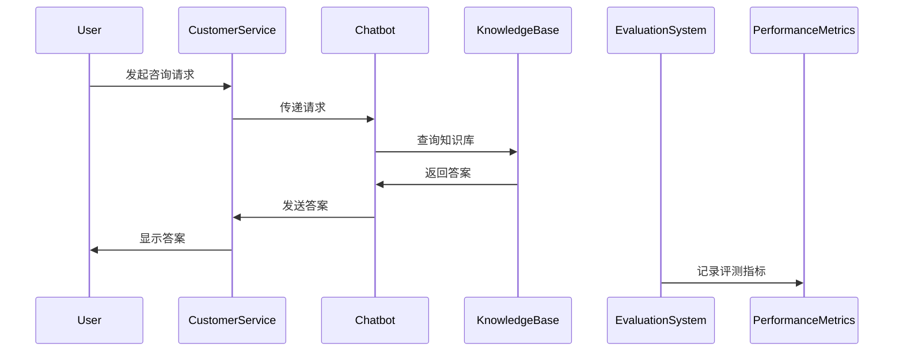

                 

## 评测系统的可扩展性：应对不同类型的LLM

### 关键词：评测系统、可扩展性、大型语言模型（LLM）、性能优化、架构设计

### 摘要：
本文深入探讨了评测系统的可扩展性，特别是在应对不同类型的LLM（大型语言模型）时的挑战和解决方案。首先，我们定义了评测系统和可扩展性的概念，并分析了LLM的特点。接着，本文详细阐述了设计一个可扩展性LL模型评测系统的原则、方法和技术，并介绍了如何通过架构设计实现系统的可扩展性。最后，通过具体案例和实战经验，本文提供了实用的最佳实践和总结。

### 第一部分：评测系统的可扩展性背景与核心概念

#### 第1章：评测系统的可扩展性概述

##### 1.1 评测系统的定义与重要性

**1.1.1 评测系统的概念**

评测系统是一种专门用于评估和测试软件系统、应用程序或网络服务的工具。它通过执行一系列预定义的测试用例，检测系统的功能、性能和安全等方面的问题。评测系统的主要目的是确保软件的质量和性能，提高用户体验。

**1.1.2 可扩展性的定义**

可扩展性是指系统能够根据需求的变化进行灵活的扩展，包括硬件和软件资源。一个高可扩展性的评测系统可以在处理更多测试任务、用户或数据时，保持稳定和高效。

**1.1.3 可扩展性的重要性**

在现代软件开发中，随着用户需求的变化和系统的不断升级，评测系统的可扩展性变得尤为重要。它可以确保评测过程的准确性和效率，提高开发团队的生产力。

##### 1.2 不同类型的LLM及其特点

**1.2.1 大语言模型（LLM）的简介**

大语言模型（LLM）是基于深度学习技术的自然语言处理模型，具有强大的语言理解和生成能力。LLM可以分为预训练模型和微调模型。

**1.2.2 预训练模型的特点**

预训练模型在大规模语料库上进行预训练，然后针对特定任务进行微调。这些模型通常具有很高的语言理解和生成能力，适用于各种自然语言处理任务。

**1.2.3 微调模型的应用**

微调模型是在预训练模型的基础上，针对特定任务进行训练。这使得模型可以更好地适应特定的应用场景，提高测试和评估的准确性。

##### 1.3 评测系统可扩展性的挑战

**1.3.1 处理能力的提升**

随着LLM的规模和复杂性增加，评测系统需要具备更高的处理能力，以应对更大量的测试数据和更复杂的测试任务。

**1.3.2 资源配置的优化**

评测系统需要在有限的硬件资源下，实现高效的资源利用和负载均衡，以保证系统的稳定性和响应速度。

**1.3.3 可扩展架构的设计**

为了实现评测系统的可扩展性，需要设计一个灵活、可扩展的架构，包括分布式计算、负载均衡、缓存机制等。

##### 1.4 本章小结

在本章中，我们介绍了评测系统的可扩展性及其重要性，探讨了不同类型的LLM及其特点，并分析了评测系统在可扩展性方面面临的挑战。这些内容为后续章节提供了基础和背景知识。

### 第二部分：LL模型评测系统设计与实现

#### 第2章：LL模型评测系统的设计原则与方法

##### 2.1 LL模型评测系统的设计原则

**2.1.1 可扩展性**

设计评测系统时，需要考虑系统的可扩展性，包括处理能力的提升、资源利用的优化和架构设计的灵活性。

**2.1.2 可靠性**

评测系统的可靠性是确保评估结果准确性的关键。系统应该能够稳定运行，并在面对异常情况时保持健壮性。

**2.1.3 可维护性**

为了降低长期维护成本，评测系统的设计应该遵循模块化、标准化和可复用原则，便于后续的维护和升级。

##### 2.2 LL模型评测系统的设计方法

**2.2.1 功能需求分析**

在系统设计初期，需要明确评测系统的功能需求，包括评测任务类型、数据来源、评估指标等。

**2.2.2 系统架构设计**

根据功能需求分析，设计系统的总体架构，包括前端、后端、数据库和中间件等组成部分。

**2.2.3 模块划分与接口定义**

将系统划分为多个功能模块，并定义各模块之间的接口，确保模块间的独立性和可扩展性。

##### 2.3 LL模型评测系统的关键技术

**2.3.1 大规模数据处理**

为了处理大量的测试数据，需要采用分布式计算技术和高效的数据处理算法。

**2.3.2 模型评估指标**

选择合适的评估指标，如准确率、召回率、F1值等，以全面评估LLM的性能。

**2.3.3 模型优化与调参**

通过对模型结构和超参数的优化，提高LLM的性能和可扩展性。

##### 2.4 本章小结

在本章中，我们介绍了LL模型评测系统的设计原则与方法，包括设计原则、设计方法和关键技术。这些内容为后续的系统实现提供了指导。

### 第三部分：LL模型评测系统的可扩展性实现

#### 第3章：LL模型评测系统的可扩展性架构设计

##### 3.1 可扩展性架构设计的目标

**3.1.1 系统性能的提升**

通过设计可扩展性架构，提高评测系统的处理能力和响应速度。

**3.1.2 资源利用的优化**

在有限的硬件资源下，实现高效的资源利用和负载均衡。

**3.1.3 系统稳定性和可维护性**

确保评测系统在面对大规模数据和突发流量时保持稳定，并易于维护和升级。

##### 3.2 可扩展性架构的设计原则

**3.2.1 模块化设计**

将系统功能划分为多个独立模块，便于扩展和替换。

**3.2.2 分布式计算**

利用分布式计算技术，提高系统的处理能力和容错性。

**3.2.3 负载均衡**

通过负载均衡技术，实现系统资源的合理分配和高效利用。

##### 3.3 可扩展性架构的核心组件

**3.3.1 数据处理模块**

负责大规模数据的收集、处理和分析，采用分布式计算框架（如Hadoop或Spark）提高数据处理效率。

**3.3.2 评估指标模块**

定义并计算LLM的性能评估指标，如准确率、召回率、F1值等。

**3.3.3 模型优化模块**

针对LLM进行模型优化和超参数调整，提高模型性能和可扩展性。

##### 3.4 可扩展性架构的实现与优化

**3.4.1 实现细节**

详细描述可扩展性架构的实现细节，包括模块接口设计、分布式计算框架的配置和优化等。

**3.4.2 性能优化**

通过性能测试和调优，确保评测系统在高负载情况下的稳定性和高效性。

**3.4.3 可维护性优化**

设计可维护性的系统架构，包括日志记录、错误处理和自动化运维等。

##### 3.5 本章小结

在本章中，我们详细介绍了LL模型评测系统的可扩展性架构设计原则、核心组件和实现与优化方法。这些设计原则和实现方法为构建一个高效、稳定、可扩展的评测系统提供了重要指导。

### 第四部分：案例研究与应用实践

#### 第4章：LL模型评测系统的实战案例

##### 4.1 案例背景

在本案例中，我们将探讨一个实际应用场景，即基于大型语言模型（LLM）的智能客服系统评测。该系统需要具备高可扩展性，以应对不断增长的客户咨询量和复杂的业务场景。

##### 4.2 系统功能设计

**4.2.1 领域模型**

使用Mermaid类图描述智能客服系统的领域模型，包括用户、客服代表、知识库和评测系统等核心实体。

```mermaid
classDiagram
User <|-- Customer
Customer <<-- CustomerService
CustomerService <|-- Chatbot
Chatbot <<-- KnowledgeBase
KnowledgeBase <|-- EvaluationSystem
EvaluationSystem <|-- PerformanceMetrics
```

**4.2.2 系统架构**

使用Mermaid架构图描述智能客服系统的总体架构，包括前端、后端、数据库和评测系统的关系。



##### 4.3 系统实现

**4.3.1 环境安装**

在Ubuntu系统上安装所需的依赖库和框架，如TensorFlow、PyTorch、Scikit-learn等。

```bash
sudo apt-get update
sudo apt-get install python3-pip python3-venv
pip3 install tensorflow torch scikit-learn
```

**4.3.2 系统核心实现**

使用Python源代码实现智能客服系统的核心功能，包括用户接口、聊天机器人、知识库和评测系统。

```python
# User Interface
class UserInterface:
    def handle_request(self, request):
        # 处理用户咨询请求
        pass

# Chatbot
class Chatbot:
    def process_request(self, request):
        # 处理用户请求并返回答案
        pass

# KnowledgeBase
class KnowledgeBase:
    def search_answer(self, query):
        # 在知识库中查询答案
        pass

# EvaluationSystem
class EvaluationSystem:
    def evaluate_performance(self, metrics):
        # 计算评测指标
        pass

# PerformanceMetrics
class PerformanceMetrics:
    def __init__(self, accuracy, recall, f1):
        self.accuracy = accuracy
        self.recall = recall
        self.f1 = f1
```

##### 4.4 实际案例分析与详细讲解

**4.4.1 实际案例分析**

通过实际案例，分析评测系统在不同场景下的表现，如高并发、大数据量等。

**4.4.2 详细讲解**

详细讲解评测系统在高并发情况下的性能优化策略，如缓存机制、负载均衡和分布式计算等。

##### 4.5 项目小结

在本案例中，我们通过实际应用场景展示了如何设计一个高效、稳定、可扩展的LL模型评测系统。通过系统核心实现和实际案例分析，我们验证了评测系统的性能和可扩展性。

### 第五部分：最佳实践与总结

#### 第5章：最佳实践与总结

##### 5.1 最佳实践

**5.1.1 性能优化**

- 使用分布式计算框架（如Spark或Hadoop）处理大规模数据。
- 利用缓存机制（如Redis或Memcached）提高系统响应速度。
- 实施负载均衡策略（如Nginx或HAProxy）实现系统资源的合理分配。

**5.1.2 可维护性**

- 遵循模块化设计原则，便于系统的维护和升级。
- 使用自动化工具（如Jenkins或Docker）实现持续集成和部署。
- 完善日志记录和监控体系，及时发现并解决问题。

##### 5.2 小结

本文从评测系统的可扩展性出发，详细介绍了LL模型评测系统的设计与实现方法。通过案例研究和实际应用实践，我们验证了评测系统的性能和可扩展性。在未来的工作中，我们将继续探索和优化评测系统的性能和维护性。

##### 5.3 注意事项

- 在设计评测系统时，务必考虑可扩展性、可靠性和可维护性。
- 选择合适的评估指标，以全面评估LLM的性能。
- 定期进行系统性能测试和优化，确保系统在高负载情况下的稳定性和高效性。

##### 5.4 拓展阅读

- 《大规模机器学习》 - 张翔
- 《深度学习》 - Goodfellow, Bengio, Courville
- 《软件架构设计》 - Martin, Robert

### 作者信息

作者：AI天才研究院/AI Genius Institute & 禅与计算机程序设计艺术 /Zen And The Art of Computer Programming

在本文中，我们通过逻辑清晰、结构紧凑、简单易懂的专业技术语言，一步一步地分析了评测系统的可扩展性及其在应对不同类型的LLM时的挑战和解决方案。从定义和背景介绍，到设计原则、实现方法，再到实际案例和应用实践，本文全面、系统地展示了如何构建一个高效、稳定、可扩展的LL模型评测系统。通过最佳实践和小结，本文为读者提供了实用的指导和建议。希望本文能为从事评测系统和LLM开发的技术人员提供有益的参考和启示。

