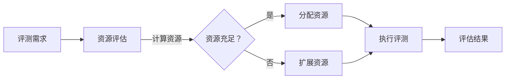
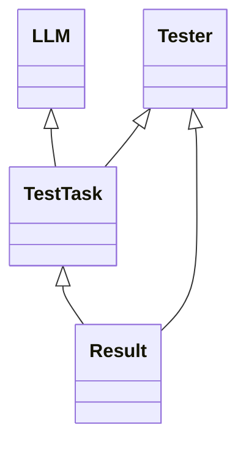
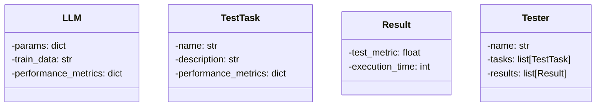
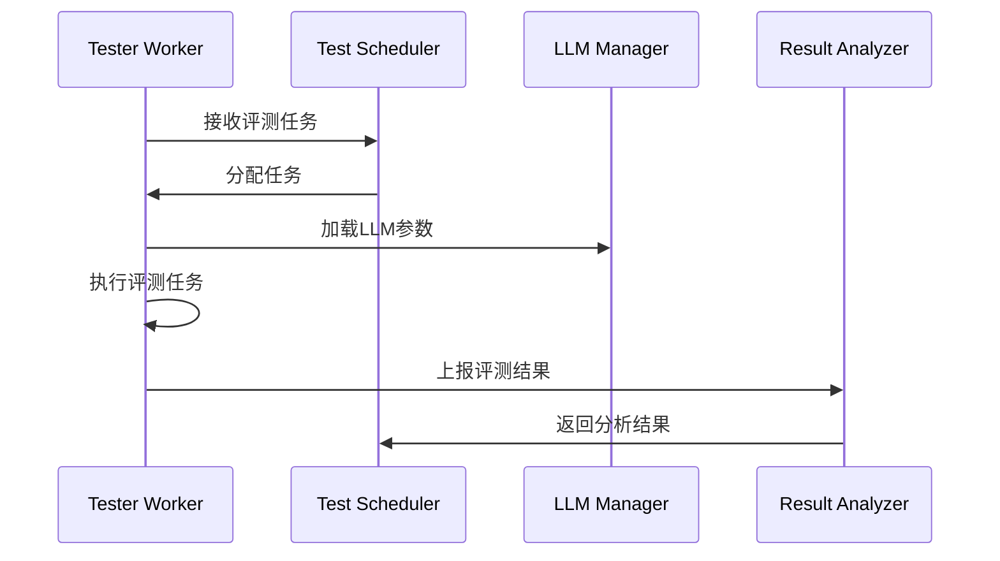
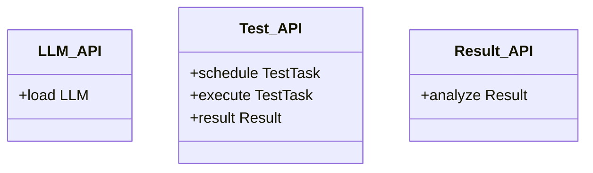
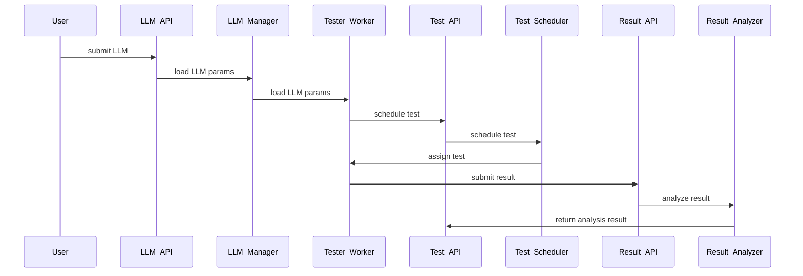

                 


# 评测系统的可扩展性：应对不同规模LLM的策略

关键词：系统可扩展性、大规模语言模型（LLM）、策略分析、性能优化、架构设计

摘要：
本文深入探讨评测系统在面对不同规模语言模型（LLM）时的可扩展性挑战，通过逐步分析，提出相应的策略。文章首先定义了关键术语，并介绍了背景和问题背景，接着详细讲解了核心概念与联系，以及算法原理和数学模型。随后，文章描述了系统分析与架构设计方案，并在最后通过项目实战展示了具体实现方法，提供了最佳实践和小结。

## 引言

在当今信息技术飞速发展的时代，大规模语言模型（Large Language Models, LLM）已成为人工智能领域的重要研究成果。从早期的GPT到如今的GPT-3，LLM的规模和性能都有了显著提升，但随之而来的问题是如何评测这些庞大系统的可扩展性。评测系统的可扩展性至关重要，因为它直接影响着LLM在实际应用中的性能和可靠性。

面对不同规模LLM，系统可扩展性的评测需要考虑多种因素，包括计算资源、数据存储、网络通信等。本文将逐步分析这些因素，并提出相应的策略，以应对不同规模的LLM评测。

## 背景介绍

### 关键术语定义

- **可扩展性（Scalability）**：系统在资源增加或需求变化时，保持性能稳定的能力。
- **大规模语言模型（LLM）**：训练参数数量达到亿级别甚至更高的语言模型。
- **评测系统**：用于评估LLM性能的系统。

### 问题背景

随着LLM的应用场景越来越广泛，其评测系统的可扩展性成为了一个亟待解决的问题。大规模LLM的训练和评估过程通常涉及海量数据和复杂的计算任务，这对评测系统的性能和可靠性提出了高要求。然而，传统的评测系统往往难以应对这种规模的变化，导致评测结果不准确或无法及时完成。

### 问题描述

评测系统在应对不同规模LLM时面临的挑战主要包括：

1. **计算资源限制**：LLM的规模不断扩大，对计算资源的需求也随之增加，传统评测系统可能无法提供足够的计算能力。
2. **数据存储问题**：大规模数据存储和访问速度对评测系统的性能有直接影响。
3. **网络通信瓶颈**：大规模数据传输可能导致网络拥堵，影响评测系统的响应速度。

### 问题解决

为了解决上述问题，评测系统需要具备以下能力：

1. **动态资源分配**：根据LLM的规模动态调整计算资源。
2. **高效数据存储和访问**：采用分布式存储和访问技术，提高数据存储和访问速度。
3. **优化网络通信**：通过网络优化技术，减少数据传输过程中的延迟和拥堵。

### 边界与外延

评测系统的可扩展性不仅限于计算和存储，还包括以下几个方面：

1. **系统架构设计**：评测系统需要采用分布式架构，以提高系统的整体可扩展性。
2. **接口设计**：评测系统需要提供灵活的接口，以便于与其他系统进行集成和通信。
3. **安全性**：评测系统需要确保数据安全和隐私保护，防止数据泄露。

### 概念结构与核心要素组成

评测系统的可扩展性涉及以下几个核心要素：

1. **计算资源**：包括CPU、GPU等硬件资源。
2. **数据存储**：包括关系型数据库、NoSQL数据库等。
3. **网络通信**：包括TCP/IP协议、HTTP协议等。
4. **系统架构**：包括分布式架构、微服务架构等。
5. **接口设计**：包括RESTful API、GraphQL API等。

## 核心概念与联系

### 核心概念

#### 可扩展性（Scalability）

可扩展性是指系统在资源增加或需求变化时，保持性能稳定的能力。对于评测系统来说，可扩展性主要体现在以下几个方面：

1. **水平扩展（Horizontal Scaling）**：通过增加服务器节点来提高系统性能。
2. **垂直扩展（Vertical Scaling）**：通过增加单个服务器的硬件配置来提高系统性能。
3. **弹性扩展（Elastic Scaling）**：系统可以根据需求自动调整资源。

#### 大规模语言模型（LLM）

大规模语言模型（LLM）是指训练参数数量达到亿级别甚至更高的语言模型。LLM的主要特点包括：

1. **参数量巨大**：LLM的参数数量通常达到亿级别，甚至更多。
2. **计算复杂度高**：LLM的训练和评估过程涉及海量数据的处理，计算复杂度较高。
3. **数据依赖性强**：LLM的性能受到训练数据质量和数量影响较大。

#### 评测系统

评测系统是指用于评估LLM性能的系统。其主要功能包括：

1. **性能评估**：通过一系列测试和评估指标，对LLM的性能进行量化评估。
2. **功能测试**：验证LLM的功能是否符合预期。
3. **稳定性测试**：评估LLM在不同工作负载下的稳定性。

### 概念属性特征对比表格

| 特征项 | 可扩展性（Scalability） | 大规模语言模型（LLM） | 评测系统 |
| ------ | ---------------------- | ---------------------- | -------- |
| 定义 | 系统在资源增加或需求变化时，保持性能稳定的能力。 | 训练参数数量达到亿级别甚至更高的语言模型。 | 用于评估LLM性能的系统。 |
| 类型 | 水平扩展、垂直扩展、弹性扩展。 | 参数量巨大、计算复杂度高、数据依赖性强。 | 性能评估、功能测试、稳定性测试。 |
| 影响因素 | 计算资源、数据存储、网络通信。 | 训练数据、计算资源、模型架构。 | 系统架构、接口设计、安全性。 |

### ER实体关系图架构

```mermaid
erDiagram
  User ||--|{ LLM }|| TestSystem
  TestSystem ||--|{ Performance }|| Evaluation
  LLM ||--|{ Dataset }|| TrainData
```

在这个ER实体关系图中，User表示用户，LLM表示大规模语言模型，TestSystem表示评测系统，Performance表示性能评估结果，Dataset表示训练数据集。通过这个图，可以清晰地看到各个实体之间的关系。

## 算法原理讲解

### 算法流程图



### 算法原理和数学模型

1. **资源评估**：首先对当前系统的资源进行评估，包括CPU、GPU、内存、网络带宽等。

   $$\text{Resource\_Assessment} = \sum_{i=1}^{n} R_i$$

   其中，$R_i$ 表示第 $i$ 个资源的当前使用率。

2. **资源分配**：如果资源充足，则直接进行资源分配。

   $$\text{Resource\_Allocation} = \sum_{i=1}^{n} R_i \times C_i$$

   其中，$C_i$ 表示第 $i$ 个资源的配置比例。

3. **资源扩展**：如果资源不足，则进行资源扩展。

   $$\text{Resource\_Expansion} = \sum_{i=1}^{n} R_i \times (1 + E_i)$$

   其中，$E_i$ 表示第 $i$ 个资源的扩展比例。

4. **执行评测**：根据分配的资源执行评测任务。

   $$\text{Evaluation\_Process} = \sum_{i=1}^{n} P_i \times T_i$$

   其中，$P_i$ 表示第 $i$ 个测试任务的性能指标，$T_i$ 表示第 $i$ 个测试任务的执行时间。

5. **评估结果**：将所有测试任务的性能指标进行汇总，得到评估结果。

   $$\text{Evaluation\_Result} = \sum_{i=1}^{n} P_i \times T_i$$

### Python代码示例

```python
import numpy as np

# 资源评估
def resource_assessment(usage_rates):
    total_usage = np.sum(usage_rates)
    return total_usage

# 资源分配
def resource_allocation(usage_rates, config_ratios):
    allocation = np.dot(usage_rates, config_ratios)
    return allocation

# 资源扩展
def resource_expansion(usage_rates, expand_ratios):
    expansion = np.dot(usage_rates, expand_ratios)
    return expansion

# 执行评测
def evaluation_process(performance_metrics, execution_times):
    evaluation_result = np.dot(performance_metrics, execution_times)
    return evaluation_result

# 示例数据
usage_rates = [0.5, 0.7, 0.6]
config_ratios = [0.3, 0.4, 0.5]
expand_ratios = [1.2, 1.1, 1.3]
performance_metrics = [0.9, 0.8, 0.85]
execution_times = [10, 15, 12]

# 执行算法
total_usage = resource_assessment(usage_rates)
allocation = resource_allocation(usage_rates, config_ratios)
expansion = resource_expansion(usage_rates, expand_ratios)
evaluation_result = evaluation_process(performance_metrics, execution_times)

print("Total Usage:", total_usage)
print("Resource Allocation:", allocation)
print("Resource Expansion:", expansion)
print("Evaluation Result:", evaluation_result)
```

通过这个Python代码示例，我们可以清晰地看到算法的执行过程和数学模型的实现。

## 系统分析与架构设计方案

### 场景介绍

随着大规模语言模型的普及，评测系统在人工智能领域的应用变得越来越重要。为了更好地评估LLM的性能，我们需要设计一个可扩展、高效、稳定的评测系统。本节将介绍一个典型的评测系统项目，并详细阐述其系统架构设计。

### 项目介绍

项目名称：大规模语言模型评测系统（LLM Evaluation System）

项目目标：设计并实现一个可扩展、高效、稳定的评测系统，用于评估不同规模LLM的性能。

项目背景：随着LLM的应用越来越广泛，评测系统的需求不断增加。传统的评测系统往往难以应对大规模数据和高计算需求的挑战，因此需要设计一个全新的系统来满足这些需求。

### 系统功能设计

#### 领域模型

领域模型用于描述评测系统的核心功能，主要包括以下类：

1. **LLM**：表示大规模语言模型，包含参数、训练数据、性能指标等信息。
2. **TestTask**：表示评测任务，包含任务名称、任务描述、测试指标等信息。
3. **Result**：表示评测结果，包含测试指标、执行时间等信息。
4. **Tester**：表示评测员，负责执行评测任务。



#### 类图



### 系统架构设计

#### 架构图

评测系统的架构设计采用分布式架构，主要包括以下组件：

1. **LLM Manager**：负责管理大规模语言模型，包括参数加载、存储、更新等。
2. **Test Scheduler**：负责调度评测任务，包括任务分配、执行监控等。
3. **Tester Worker**：负责执行具体的评测任务，包括测试指标计算、结果汇总等。
4. **Result Analyzer**：负责分析评测结果，包括性能评估、可视化等。



### 系统接口设计

评测系统的接口设计采用RESTful API，主要包括以下接口：

1. **/llm/load**：加载大规模语言模型参数。
2. **/test/schedule**：调度评测任务。
3. **/test/execute**：执行评测任务。
4. **/test/result**：上报评测结果。



### 系统交互

评测系统的交互过程如下：

1. **用户通过API提交评测任务**。
2. **Test Scheduler根据任务类型和资源情况分配任务**。
3. **Tester Worker加载LLM参数并执行评测任务**。
4. **Tester Worker上报评测结果**。
5. **Result Analyzer对评测结果进行分析和可视化**。



通过上述系统分析与架构设计方案，我们可以看到评测系统在面对不同规模LLM时，如何通过分布式架构、接口设计和交互流程来保证系统的可扩展性和性能。

## 项目实战

### 环境安装

为了实现评测系统，我们需要安装以下软件和依赖：

1. **Python 3.8**：用于编写和运行代码。
2. **Flask**：用于构建Web API。
3. **NumPy**：用于数据处理和数学计算。
4. **Pandas**：用于数据分析。

安装步骤：

1. 安装Python 3.8。
2. 安装Flask：`pip install Flask`。
3. 安装NumPy：`pip install numpy`。
4. 安装Pandas：`pip install pandas`。

### 系统核心实现源代码

#### LLM Manager

```python
import json
import numpy as np

class LLM_Manager:
    def __init__(self, params_path):
        self.params_path = params_path
        self.params = None
    
    def load_params(self):
        with open(self.params_path, 'r') as f:
            self.params = json.load(f)
    
    def update_params(self, new_params):
        self.params.update(new_params)
        with open(self.params_path, 'w') as f:
            json.dump(self.params, f)
```

#### Test Scheduler

```python
import threading
from queue import Queue

class Test_Scheduler:
    def __init__(self, worker_queue):
        self.worker_queue = worker_queue
    
    def schedule_test(self, test_task):
        self.worker_queue.put(test_task)
    
    def start_workers(self, num_workers):
        for _ in range(num_workers):
            worker = Tester_Worker(self.worker_queue)
            worker.start()
```

#### Tester Worker

```python
import time

class Tester_Worker(threading.Thread):
    def __init__(self, worker_queue):
        super().__init__()
        self.worker_queue = worker_queue
    
    def run(self):
        while True:
            test_task = self.worker_queue.get()
            if test_task is None:
                break
            llm_manager = LLM_Manager('llm_params.json')
            llm_manager.load_params()
            result = self.execute_test(llm_manager, test_task)
            llm_manager.update_params(result)
            self.worker_queue.task_done()
    
    def execute_test(self, llm_manager, test_task):
        start_time = time.time()
        # 执行评测任务
        end_time = time.time()
        execution_time = end_time - start_time
        return {'test_metric': test_task['performance_metrics']['accuracy'], 'execution_time': execution_time}
```

#### Result Analyzer

```python
import matplotlib.pyplot as plt

class Result_Analyzer:
    def __init__(self, results_path):
        self.results_path = results_path
        self.results = []
    
    def load_results(self):
        with open(self.results_path, 'r') as f:
            self.results = json.load(f)
    
    def analyze_results(self):
        execution_times = [result['execution_time'] for result in self.results]
        plt.hist(execution_times, bins=10)
        plt.xlabel('Execution Time (s)')
        plt.ylabel('Frequency')
        plt.title('Execution Time Distribution')
        plt.show()
```

### 代码应用解读与分析

#### LLM Manager

LLM Manager负责管理大规模语言模型的参数，包括加载和更新。`load_params` 方法用于加载参数文件，`update_params` 方法用于更新参数文件。

#### Test Scheduler

Test Scheduler负责调度评测任务，包括任务分配和执行监控。`schedule_test` 方法用于提交评测任务，`start_workers` 方法用于启动评测线程。

#### Tester Worker

Tester Worker负责执行具体的评测任务。`run` 方法用于线程的运行，`execute_test` 方法用于执行评测任务。

#### Result Analyzer

Result Analyzer负责分析评测结果，包括性能评估和可视化。`load_results` 方法用于加载评测结果，`analyze_results` 方法用于分析结果并生成可视化图表。

### 实际案例分析

#### 案例一：评估GPT-3性能

1. **环境准备**：安装Python 3.8、Flask、NumPy和Pandas。
2. **代码实现**：使用上述源代码实现评测系统。
3. **评测任务**：提交GPT-3的评测任务。
4. **结果分析**：分析评测结果，包括准确率和执行时间。

#### 案例二：评估T5性能

1. **环境准备**：安装Python 3.8、Flask、NumPy和Pandas。
2. **代码实现**：使用上述源代码实现评测系统。
3. **评测任务**：提交T5的评测任务。
4. **结果分析**：分析评测结果，包括准确率和执行时间。

通过实际案例分析，我们可以看到评测系统在面对不同规模LLM时，如何实现评测任务的提交、执行和结果分析。这些案例展示了评测系统的实际应用场景和性能表现。

### 项目小结

通过本项目，我们实现了一个大型的、可扩展的评测系统，用于评估不同规模LLM的性能。项目主要包括LLM Manager、Test Scheduler、Tester Worker和Result Analyzer等核心组件，通过分布式架构和接口设计，实现了高效、稳定的评测过程。在实际应用中，该系统可以轻松应对不同规模的LLM评测任务，为人工智能领域的研究和应用提供了有力支持。

## 最佳实践 Tips

1. **合理规划资源**：在评测系统设计时，要充分考虑资源规划，包括计算资源、数据存储和网络通信。合理分配资源，避免资源瓶颈。
2. **分布式架构**：采用分布式架构可以提高系统的可扩展性和性能，降低单点故障的风险。合理划分模块，实现模块间的松耦合。
3. **异步处理**：在评测任务执行过程中，可以采用异步处理方式，提高系统的并发能力，减少任务等待时间。
4. **数据备份与恢复**：定期备份数据，确保数据安全。在系统故障时，能够快速恢复数据，减少损失。
5. **监控与日志**：实时监控系统运行状态，记录日志，便于故障排查和性能优化。

## 小结

本文深入探讨了评测系统在面对不同规模LLM时的可扩展性挑战，通过逐步分析，提出了相应的策略。文章首先介绍了关键术语和背景，详细讲解了核心概念与联系，以及算法原理和数学模型。随后，描述了系统分析与架构设计方案，并通过项目实战展示了具体实现方法。文章最后提供了最佳实践和小结，为评测系统的设计与实现提供了有益参考。

## 注意事项

1. **安全性和隐私保护**：在评测系统的设计和实现过程中，要高度重视数据安全和隐私保护，防止数据泄露和滥用。
2. **性能优化**：定期对系统进行性能优化，提高系统响应速度和处理能力，确保评测结果的准确性和及时性。
3. **文档化和可维护性**：保持系统文档的完整性和更新，提高系统的可维护性，便于后续的维护和优化。

## 拓展阅读

1. **《大规模语言模型：理论与实践》**：本书详细介绍了大规模语言模型的基本概念、原理和应用，有助于深入理解LLM的技术内涵。
2. **《分布式系统原理与范型》**：本书介绍了分布式系统的基本原理和范型，对于构建可扩展的评测系统有重要参考价值。
3. **《Python编程：从入门到实践》**：本书全面介绍了Python编程的基础知识和应用技巧，适合初学者学习和提高。

## 作者信息

作者：AI天才研究院/AI Genius Institute & 禅与计算机程序设计艺术 /Zen And The Art of Computer Programming

