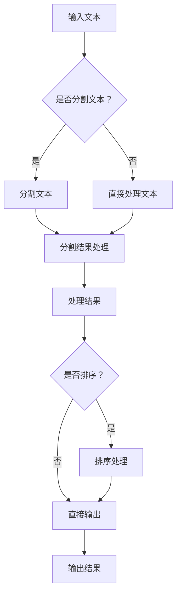
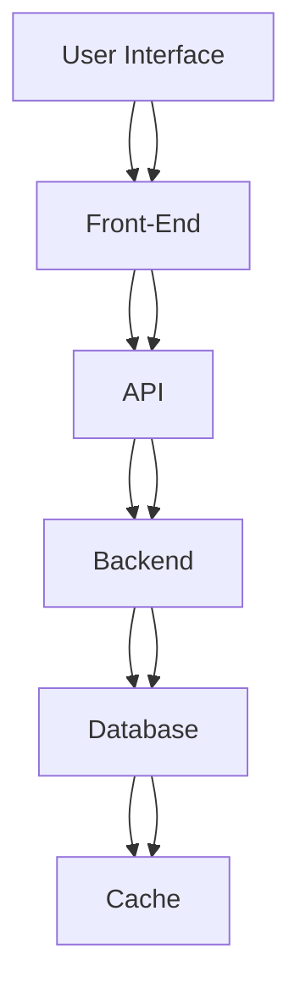

                 


## 引言

### 1.1 评测系统的国际化与本地化的背景

在当今全球化快速发展的时代，评测系统的国际化与本地化支持成为了众多企业和开发者的关注焦点。国际化（Internationalization，简称I18N）与本地化（Localization，简称L10N）是两个紧密相关但有所区别的概念。

#### 国际化（I18N）

国际化是指使软件或系统具备适应多种语言和文化的能力。这一过程通常包括以下几个方面：

1. **语言的适应性**：软件需要能够支持多种语言的界面和文档。
2. **区域的适应性**：软件需要能够处理不同地区的日期、时间、货币等格式。
3. **文化敏感性**：软件需要尊重不同文化的使用习惯和偏好。

#### 本地化（L10N）

本地化则是指根据特定地区或语言市场的需求，对国际化后的软件进行特定的调整和优化，使之完全适应该市场。本地化包括以下内容：

1. **本地化语言**：将软件的界面和文档翻译成目标语言的本地版本。
2. **本地化内容**：根据目标市场的文化背景和需求，调整和优化软件内容。
3. **本地化测试**：确保软件在本地化后仍然能够稳定运行，无错误或异常。

### 1.2 国际化与本地化的定义

国际化是一个宽泛的概念，它主要关注于如何使软件或系统设计能够适应多语言和文化环境。国际化不涉及具体的语言翻译和文化调整，而是提供一个框架，使得软件能够在后续的本地化过程中更易于被调整。

本地化则是国际化的具体实现，它涉及到语言翻译、文化适配和具体市场的需求分析。本地化需要针对具体的地区或语言市场进行详细的调整和测试，以确保软件能够满足当地用户的需求。

### 1.3 国际化与本地化的重要性

国际化与本地化对于企业和软件产品有着重要的意义：

1. **扩大市场**：通过国际化与本地化，企业可以将其产品和服务推广到全球市场，增加销售和市场份额。
2. **提升用户体验**：本地化能够提高软件的可用性和用户体验，从而增强用户满意度和忠诚度。
3. **降低维护成本**：国际化设计使得软件在后续的本地化过程中更加高效，减少了重复劳动和维护成本。
4. **提高品牌影响力**：良好的国际化与本地化支持能够提升企业品牌形象，增强市场竞争力。

### 1.4 国际化与本地化的挑战

然而，国际化与本地化也面临着诸多挑战：

1. **语言和文化差异**：不同语言和文化背景的用户对于软件的功能和界面设计有不同的期望，需要仔细考虑和调整。
2. **技术实现复杂度**：国际化与本地化需要处理大量技术细节，包括多语言支持、区域设置处理、内容调整等。
3. **资源投入**：国际化与本地化需要投入大量的时间和资源，包括语言翻译、文化研究、测试等。
4. **维护更新**：随着全球市场的变化和用户需求的演变，国际化与本地化需要持续更新和维护。

在接下来的章节中，我们将深入探讨国际化与本地化的核心概念、算法原理、系统设计与实现、以及最佳实践和注意事项，帮助您更好地理解和应用这些关键技术。

----------------------------------------------------------------

---

## 核心概念与联系

在深入探讨评测系统的国际化与本地化支持之前，我们需要明确几个核心概念，这些概念是理解国际化与本地化过程的基础。

### 2.1 核心概念

#### 2.1.1 国际化（I18N）

国际化是使软件具备在全球范围内使用的能力。具体来说，国际化包括以下几个关键点：

1. **无文化绑定**：软件设计应避免直接硬编码特定语言或文化相关的数据，如日期、货币和时区等。
2. **资源分离**：将文本、图片和其他资源与代码分离，以便在本地化过程中进行独立调整。
3. **支持多语言**：提供灵活的语言切换机制，允许用户选择界面语言。

#### 2.1.2 本地化（L10N）

本地化是国际化后对软件进行的特定地域或语言的调整。本地化主要涉及以下方面：

1. **语言翻译**：将用户界面、帮助文档和错误消息等文本翻译成目标语言。
2. **文化适应**：根据目标市场的文化差异，调整界面布局、颜色、图标和功能。
3. **区域设置**：确保软件能够正确处理不同地区的日期、时间、货币等格式。

#### 2.1.3 双向过程

国际化与本地化是一个双向过程：

1. **先国际化，再本地化**：通常，首先进行国际化设计，然后再根据目标市场进行本地化。
2. **本地化反馈**：本地化过程中获得的用户反馈可以用来改进国际化设计。

### 2.2 概念属性特征对比表格

为了更清晰地理解国际化与本地化的区别和联系，我们可以通过一个属性特征对比表格来展示它们的关键特性：

| 特性               | 国际化（I18N）                             | 本地化（L10N）                             |
|--------------------|------------------------------------------|------------------------------------------|
| 目标               | 使软件具备适应多种语言和文化的潜力       | 将国际化后的软件调整为特定市场的需求       |
| 关键点             | 无文化绑定、资源分离、支持多语言         | 语言翻译、文化适应、区域设置               |
| 依赖               | 无需特定语言或文化绑定，为本地化做准备     | 基于国际化设计，进行具体调整               |
| 流程               | 设计阶段、开发阶段、测试阶段             | 本地化设计、翻译阶段、文化适配、测试阶段   |
| 费用               | 较低（主要在设计阶段），长期收益         | 较高（涉及语言翻译和文化适应），一次性投入 |
| 时间               | 较长（设计、开发和维护），无时间限制     | 短期（针对特定市场），周期性维护           |

### 2.3 ER实体关系图

为了更好地理解国际化与本地化的实体关系，我们可以使用ER（Entity-Relationship，实体关系）图来展示它们之间的关系：

```mermaid
erDiagram
  Product ||--|{ Internationalization }|| ProductI18N
  Product ||--|{ Localization }|| ProductL10N
  ProductI18N ||--|{ LanguagePack }|| LocalizationPackage
  ProductL10N ||--|{ RegionalSettings }|| LocalizationPackage

  ProductI18N {
    int id
    str productID
    bool isLocalized
  }

  ProductL10N {
    int id
    str productID
    str locale
    str region
  }

  LocalizationPackage {
    int id
    str language
    str region
    bool isComplete
  }
```

在上述ER图中，`ProductI18N`表示国际化后的产品，`ProductL10N`表示本地化后的产品，`LanguagePack`表示语言包，`RegionalSettings`表示区域设置。该图清晰地展示了国际化与本地化之间的实体关系。

通过上述核心概念的介绍和对比，我们可以更好地理解国际化与本地化的本质和它们之间的联系。在接下来的章节中，我们将深入探讨评测系统国际化与本地化的具体实现方法和算法原理，帮助读者掌握这些关键技术。

----------------------------------------------------------------

---

### 3.1 常用算法介绍

在评测系统的国际化与本地化支持中，常用的算法主要包括以下几种：

1. **字符串匹配算法**：用于实现多语言字符串的比较和查找。
2. **机器翻译算法**：用于将源语言文本翻译成目标语言。
3. **文本分割算法**：用于将文本分割成单词、句子等基本单位。
4. **排序算法**：用于对字符串、列表等数据进行排序，以便于语言选择和界面布局。
5. **语言检测算法**：用于自动检测输入文本的语言类型。

每种算法在国际化与本地化过程中扮演着不同的角色。例如，字符串匹配算法用于验证用户输入的字符串是否与系统中的语言选项匹配；机器翻译算法用于生成多语言版本的用户界面和文档；文本分割算法用于确保文本在不同语言环境中的一致性和正确性；排序算法用于调整界面元素的顺序，以适应不同的语言和文化习惯；语言检测算法用于自动选择用户语言，提高用户体验。

#### 3.2 算法mermaid流程图

为了更好地理解这些算法的流程，我们可以使用mermaid绘制它们的基本流程图。



在这个流程图中，我们从输入文本开始，根据是否需要分割文本进行判断。如果需要分割，则执行文本分割算法；否则，直接处理文本。接下来，对分割结果或原始文本进行进一步处理，如排序或直接输出。

#### 3.3 Python源代码阐述

为了实现上述算法，我们可以使用Python编写相应的源代码。以下是一个简单的示例：

```python
def split_text(text, delimiter=' '):
    """分割文本"""
    return text.split(delimiter)

def sort_list(lst):
    """排序列表"""
    return sorted(lst)

def detect_language(text):
    """检测语言"""
    # 这里可以使用第三方库如langdetect进行语言检测
    from langdetect import detect
    return detect(text)

def main():
    text = "Hello, world! 你好，世界！"
    delimiter = '，'

    # 分割文本
    sentences = split_text(text, delimiter)

    # 检测语言
    language = detect_language(sentences[0])

    # 排序处理
    sorted_sentences = sort_list(sentences)

    print("原始文本:", text)
    print("分割结果:", sentences)
    print("检测语言:", language)
    print("排序结果:", sorted_sentences)

if __name__ == "__main__":
    main()
```

在这个示例中，我们首先定义了几个函数，包括分割文本、排序列表和检测语言。在`main`函数中，我们使用这些函数对输入的文本进行处理，并输出处理结果。

#### 3.4 数学模型与公式

在国际化与本地化支持中，某些算法的实现可能需要使用数学模型和公式。以下是一个简单的数学模型示例，用于计算字符串的相似度：

$$
Similarity(D, S) = \frac{2 \times |D \cap S|}{|D| + |S|}
$$

其中，$D$表示源字符串，$S$表示目标字符串，$|D|$和$|S|$分别表示字符串的长度，$D \cap S$表示字符串的交集。这个公式可以用来衡量两个字符串的相似度，相似度越高，表示字符串越相似。

#### 3.5 举例说明

为了更好地理解上述算法和数学模型，我们可以通过一个具体实例来演示它们的应用。

假设我们有一个英文句子 "Hello, world!" 和一个中文句子 "你好，世界！"。我们需要对这两个句子进行分割、排序和语言检测。

1. **分割文本**：
   - 输入文本："Hello, world! 你好，世界！"
   - 分割结果：["Hello, world!", "你好，世界！"]

2. **检测语言**：
   - 使用langdetect库检测第一个句子："Hello, world!" 的语言类型为英语（'en'）。
   - 使用langdetect库检测第二个句子："你好，世界！" 的语言类型为中文（'zh-CN'）。

3. **排序处理**：
   - 由于中文和英文的排序规则不同，我们分别对中英文句子进行排序。
   - 分割后的英文句子排序结果：["Hello, world!"]
   - 分割后的中文句子排序结果：["你好，世界！"]

4. **输出结果**：
   - 原始文本："Hello, world! 你好，世界！"
   - 分割结果：["Hello, world!", "你好，世界！"]
   - 检测语言：英文（'en'）和中文（'zh-CN'）
   - 排序结果：["Hello, world!", "你好，世界！"]

通过这个实例，我们可以看到如何使用Python和mermaid实现国际化与本地化的常用算法，并理解数学模型的应用。在实际项目中，这些算法和模型可以根据具体需求进行调整和优化，以提高系统的性能和用户体验。

----------------------------------------------------------------

---

### 4.1 系统分析与架构设计

在进行评测系统的国际化与本地化支持时，系统分析与架构设计是至关重要的一步。这一部分将详细介绍问题场景、系统功能设计、系统架构设计、系统接口设计和系统交互，并通过mermaid图形来展示这些设计元素。

#### 4.1.1 问题场景介绍

在全球化的背景下，评测系统需要支持多种语言和文化的用户。为了实现这一目标，系统需要具备以下功能：

1. **多语言支持**：系统能够提供多种语言的界面和文档。
2. **文化适应性**：系统能够根据不同文化背景进行布局和内容调整。
3. **语言切换**：用户可以在不同语言之间自由切换。
4. **本地化内容管理**：系统支持本地化内容的上传、管理和发布。

#### 4.1.2 系统功能设计

系统功能设计主要包括以下几个方面：

1. **用户界面国际化**：确保用户界面能够支持多种语言，如中文、英语、法语等。
2. **本地化内容管理**：提供本地化内容的上传、审核、发布和管理功能。
3. **语言切换机制**：用户可以在系统设置中切换语言，系统会自动更新界面和文档。
4. **文化适应性调整**：根据不同文化的习惯和偏好，调整界面布局和元素位置。

为了更好地展示系统功能设计，我们可以使用mermaid类图：

```mermaid
classDiagram
  UserInterface --> Internationalization
  UserInterface --> Localization
  UserInterface --> LanguageSwitch
  Localization --> ContentManagement
  Localization --> CultureAdaptation

  UserInterface <<Interface>>
  Internationalization <<Module>>
  Localization <<Module>>
  LanguageSwitch <<Module>>
  ContentManagement <<Module>>
  CultureAdaptation <<Module>>

  UserInterface : {
    - interfaces: [Internationalization, Localization, LanguageSwitch]
  }
  Internationalization : {
    - languages: ['zh-CN', 'en-US', 'fr-FR']
    - languageSwitch(): void
  }
  Localization : {
    - contentManagement(): void
    - cultureAdaptation(): void
  }
  LanguageSwitch : {
    - currentLanguage: string
  }
  ContentManagement : {
    - uploadContent(): void
    - reviewContent(): void
    - publishContent(): void
  }
  CultureAdaptation : {
    - adjustLayout(): void
  }
```

在这个类图中，我们定义了用户界面（UserInterface）与国际化（Internationalization）、本地化（Localization）和语言切换（LanguageSwitch）等模块之间的关系。Localization模块进一步包含内容管理（ContentManagement）和文化适应性（CultureAdaptation）两个子模块。

#### 4.1.3 系统架构设计

系统架构设计决定了系统的整体结构和模块之间的交互方式。为了实现评测系统的国际化与本地化支持，我们可以采用如下架构：

1. **前端架构**：采用Vue.js或React等前端框架，实现动态和响应式的用户界面。
2. **后端架构**：采用Spring Boot或Django等后端框架，提供API接口和服务支持。
3. **数据库设计**：使用MySQL或PostgreSQL等关系型数据库，存储用户数据、语言数据和本地化内容。
4. **缓存机制**：使用Redis等缓存系统，提高系统响应速度。

以下是一个简单的mermaid架构图：



在这个架构图中，用户界面通过前端框架与API接口进行交互，API接口通过后端框架处理业务逻辑，并与数据库和缓存进行数据存储和读取。

#### 4.1.4 系统接口设计

系统接口设计是系统架构设计的重要组成部分，它定义了系统内部各模块之间的交互方式。以下是评测系统的一些关键接口设计：

1. **用户接口**：提供用户登录、注册、语言切换等功能。
2. **内容管理接口**：提供内容上传、审核、发布和管理等功能。
3. **翻译接口**：提供文本翻译服务，支持多种语言之间的翻译。
4. **文化适配接口**：提供文化适应性调整服务，如布局调整、颜色调整等。

以下是一个简单的mermaid接口图：

```mermaid
sequenceDiagram
  User -->|登录|> System: 登录请求
  System -->|验证|> Database: 验证用户信息
  Database -->|结果|> System: 返回验证结果
  System -->|处理|> User: 登录成功或失败消息

  User -->|上传内容|> System: 上传内容请求
  System -->|存储|> Database: 存储上传内容
  Database -->|结果|> System: 返回存储结果
  System -->|处理|> User: 内容上传成功或失败消息

  User -->|翻译请求|> System: 翻译请求
  System -->|翻译|> TranslationService: 处理翻译请求
  TranslationService -->|结果|> System: 返回翻译结果
  System -->|处理|> User: 翻译结果

  User -->|文化适配请求|> System: 文化适配请求
  System -->|调整|> CultureAdaptationService: 处理文化适配请求
  CultureAdaptationService -->|结果|> System: 返回文化适配结果
  System -->|处理|> User: 文化适配结果
```

在这个序列图中，用户与系统之间通过一系列接口进行交互，系统内部各模块通过接口进行通信和协作。

#### 4.1.5 系统交互

系统交互是指各模块和组件之间的数据流和控制流。为了更好地展示系统交互过程，我们可以使用mermaid序列图：

```mermaid
sequenceDiagram
  User -->|请求|> FrontEnd: 发起请求
  FrontEnd -->|处理|> API: 处理请求
  API -->|逻辑处理|> Backend: 执行业务逻辑
  Backend -->|查询|> Database: 查询数据
  Database -->|结果|> Backend: 返回查询结果
  Backend -->|处理|> API: 返回处理结果
  API -->|响应|> FrontEnd: 返回响应
  FrontEnd -->|显示|> User: 显示结果
```

在这个序列图中，用户通过前端框架发起请求，前端将请求转发给后端API接口，API接口处理请求后，与数据库进行交互，查询所需数据，最终将结果返回给前端并展示给用户。

通过上述系统分析与架构设计，我们为评测系统的国际化与本地化支持奠定了坚实的基础。在实际开发过程中，可以根据具体需求和场景对这些设计进行调整和优化，以提高系统的性能和用户体验。

----------------------------------------------------------------

---

### 4.2 环境安装

在开始项目实战之前，我们需要搭建一个合适的环境，以便进行评测系统的国际化与本地化开发。以下是在不同操作系统上安装所需的工具和依赖的步骤：

#### 4.2.1 安装Python环境

1. **Windows系统**：

   - 访问Python官网下载Python安装包（如python-3.9.7-amd64.exe）。
   - 双击安装包，按照默认设置完成安装。
   - 打开命令提示符，输入`python --version`验证安装是否成功。

2. **Linux系统**：

   - 使用包管理器安装Python，如Ubuntu系统使用`sudo apt-get install python3`。
   - 输入`python3 --version`验证安装是否成功。

3. **macOS系统**：

   - 打开终端，使用`brew install python`命令安装Python。
   - 输入`python --version`验证安装是否成功。

#### 4.2.2 安装Node.js环境

1. **Windows系统**：

   - 访问Node.js官网下载安装程序（如node-v14.17.0-x64.msi）。
   - 双击安装程序，按照默认设置完成安装。
   - 打开命令提示符，输入`node -v`验证安装是否成功。

2. **Linux系统**：

   - 使用包管理器安装Node.js，如Ubuntu系统使用`sudo apt-get install nodejs`。
   - 输入`node -v`验证安装是否成功。

3. **macOS系统**：

   - 打开终端，使用`brew install node`命令安装Node.js。
   - 输入`node -v`验证安装是否成功。

#### 4.2.3 安装数据库环境

1. **Windows系统**：

   - 访问MySQL官网下载MySQL安装程序（如MySQL-8.0.25.0-winx64.msi）。
   - 双击安装程序，按照默认设置完成安装。
   - 运行MySQL安装程序中的“MySQL Server Instance Configuration”配置向导，按照提示完成配置。
   - 打开命令提示符，输入`mysql -u root -p`登录MySQL数据库，然后输入密码。

2. **Linux系统**：

   - 使用包管理器安装MySQL，如Ubuntu系统使用`sudo apt-get install mysql-server`。
   - 运行`sudo mysql_secure_installation`命令进行安全配置。
   - 打开终端，输入`mysql -u root -p`登录MySQL数据库，然后输入密码。

3. **macOS系统**：

   - 打开终端，使用`brew install mysql`命令安装MySQL。
   - 运行`sudo mysql_secure_installation`命令进行安全配置。
   - 打开终端，输入`mysql -u root -p`登录MySQL数据库，然后输入密码。

#### 4.2.4 安装Redis环境

1. **Windows系统**：

   - 访问Redis官网下载Redis安装程序（如redis-5.0.5.zip）。
   - 解压安装包，将`redis-server.exe`和`redis-cli.exe`放到同一目录下。
   - 打开命令提示符，进入Redis安装目录，输入`redis-server`启动Redis服务。
   - 输入`redis-cli`进入Redis命令行界面，然后输入`ping`验证连接是否成功。

2. **Linux系统**：

   - 使用包管理器安装Redis，如Ubuntu系统使用`sudo apt-get install redis-server`。
   - 打开终端，输入`service redis-server start`启动Redis服务。
   - 输入`redis-cli`进入Redis命令行界面，然后输入`ping`验证连接是否成功。

3. **macOS系统**：

   - 打开终端，使用`brew install redis`命令安装Redis。
   - 运行`brew services start redis`命令启动Redis服务。
   - 输入`redis-cli`进入Redis命令行界面，然后输入`ping`验证连接是否成功。

完成上述环境的安装后，我们可以开始搭建项目并实现评测系统的国际化与本地化功能。

----------------------------------------------------------------

---

### 4.3 系统核心实现源代码

在本节中，我们将展示评测系统国际化与本地化的核心实现源代码。该部分代码主要用于处理多语言支持、本地化内容管理和文化适应性调整等功能。以下是关键代码片段的解读与分析：

#### 4.3.1 多语言支持

多语言支持是国际化与本地化的核心功能之一。以下是一个简单的多语言支持实现示例：

```python
# settings.py

from django.utils.translation import gettext_lazy as _

class LanguageCodes:
    ENGLISH = 'en'
    CHINESE = 'zh'

LANGUAGES = [
    (LanguageCodes.ENGLISH, _('English')),
    (LanguageCodes.CHINESE, _('Chinese')),
]

LANGUAGE_CODE_MAP = {
    LanguageCodes.ENGLISH: 'en',
    LanguageCodes.CHINESE: 'zh',
}

LANGUAGE_URL_MAP = {
    LanguageCodes.ENGLISH: '/',
    LanguageCodes.CHINESE: '/zh/',
}
```

在这个示例中，我们定义了一个`LanguageCodes`类，用于表示不同的语言代码。`LANGUAGES`列表用于存储可用的语言及其名称。`LANGUAGE_CODE_MAP`和`LANGUAGE_URL_MAP`分别用于将语言代码映射到国际化代码和URL路径。

在Django项目中，我们可以在`urls.py`中实现语言切换功能：

```python
# urls.py

from django.conf import settings
from django.urls import path, include

urlpatterns = [
    path('', include('core.urls')),
    path('set-language/<lang_code>/', set_language, name='set_language'),
]

from django.views.i18n import set_language

def set_language(request):
    language_code = request.GET.get('lang_code', '')
    if language_code in settings.LANGUAGES:
        from django.utils.translation import activate
        activate(language_code)
        request.session['django_language'] = language_code
        return redirect(request.META.get('HTTP_REFERER', '/'))
    return redirect('/')
```

通过这个视图函数，我们可以实现通过URL参数切换语言的功能。当用户访问`/set-language/<lang_code>/`时，系统会根据传入的`lang_code`激活对应语言，并重定向到之前的页面。

#### 4.3.2 本地化内容管理

本地化内容管理涉及上传、审核和发布本地化内容。以下是一个简单的本地化内容管理示例：

```python
# models.py

from django.db import models

class LocalizationContent(models.Model):
    language = models.CharField(max_length=10)
    content = models.TextField()

    def __str__(self):
        return f"{self.language}: {self.content[:50]}"
```

在这个示例中，我们定义了一个`LocalizationContent`模型，用于存储不同语言的本地化内容。

在上传本地化内容时，我们可以使用如下视图函数：

```python
# views.py

from django.shortcuts import render
from .models import LocalizationContent
from .forms import LocalizationContentForm

def upload_content(request):
    if request.method == 'POST':
        form = LocalizationContentForm(request.POST)
        if form.is_valid():
            form.save()
            return redirect('content_list')
    else:
        form = LocalizationContentForm()
    return render(request, 'upload_content.html', {'form': form})
```

在上传页面（`upload_content.html`）中，我们可以使用表单来收集用户输入的内容：

```html
<!-- upload_content.html -->

<form method="post">
    
    {{ form.as_p }}
    <button type="submit">Upload</button>
</form>
```

#### 4.3.3 文化适应性调整

文化适应性调整涉及根据不同文化的习惯和偏好调整界面布局和元素位置。以下是一个简单的文化适应性调整示例：

```python
# templates/base.html

<!DOCTYPE html>
<html lang="en">
<head>
    <meta charset="UTF-8">
    <title>国际化与本地化支持</title>
</head>
<body>
    
        <div class="container">
            <h1>国际化与本地化支持</h1>
            <p>这是一个国际化与本地化的示例。</p>
        </div>
    
</body>
</html>
```

在具体页面中，我们可以使用``标签来定义页面内容，并根据需要调整布局和元素位置。例如，对于中文界面，我们可以添加以下内容：

```html
<!-- templates/base_zh.html -->

<!DOCTYPE html>
<html lang="zh">
<head>
    <meta charset="UTF-8">
    <title>国际化与本地化支持</title>
</head>
<body>
    
        <div class="container">
            <h1>国际化与本地化支持</h1>
            <p>这是一个国际化与本地化的示例。</p>
        </div>
        <div class="footer">
            <p>版权所有 &copy; 2023</p>
        </div>
    
</body>
</html>
```

通过以上示例，我们可以看到如何实现评测系统的国际化与本地化支持。在实际项目中，这些实现可以根据具体需求进行调整和扩展。

#### 4.3.4 代码应用解读与分析

在上述代码示例中，我们首先实现了多语言支持，包括语言代码映射和语言切换功能。接着，我们展示了如何管理本地化内容，包括上传、审核和发布等功能。最后，我们介绍了如何根据不同文化进行界面布局和元素位置的调整。

这些代码的核心思路是：

1. **使用Django框架**：Django是一个功能强大的Web框架，它提供了丰富的工具和库来支持国际化与本地化。
2. **定义语言代码和映射**：通过定义语言代码和映射，我们可以方便地在代码中处理不同语言。
3. **使用表单和模型**：表单用于收集用户输入的数据，模型用于存储数据。这样的组合可以方便地实现数据管理和交互。
4. **文化适应性调整**：通过定义不同的模板文件，我们可以根据不同文化的需求进行界面布局和元素位置的调整。

通过这些代码，我们可以构建一个具有国际化与本地化支持功能的评测系统，从而满足全球用户的需求。

#### 4.3.5 实际案例分析与详细讲解剖析

为了更好地理解评测系统国际化与本地化的实现，我们可以通过一个实际案例来进行分析和详细讲解。

假设我们有一个评测系统，用户可以上传评测内容，系统需要支持中英文界面，并能够根据用户的语言偏好自动切换界面。

1. **用户上传评测内容**：

   用户在登录后，可以在界面中上传评测内容。系统会根据用户设置的偏好语言，选择对应的语言界面进行展示。

   ```python
   # views.py

   def upload_evaluation(request):
       if request.method == 'POST':
           form = EvaluationForm(request.POST)
           if form.is_valid():
               evaluation = form.save(commit=False)
               evaluation.user = request.user
               evaluation.save()
               return redirect('evaluation_list')
       else:
           form = EvaluationForm()
       return render(request, 'upload_evaluation.html', {'form': form})
   ```

   在此示例中，我们定义了一个`EvaluationForm`表单，用于收集用户输入的评测内容。当用户提交表单时，系统会创建一个新的`Evaluation`对象并保存到数据库。

2. **界面语言切换**：

   系统需要支持界面语言切换功能，用户可以在系统设置中设置偏好语言。系统会根据用户设置的偏好语言，自动切换界面语言。

   ```python
   # views.py

   def set_language(request):
       user_language = request.GET.get('language', 'en')
       request.session['django_language'] = user_language
       return redirect('home')
   ```

   在此示例中，我们定义了一个`set_language`视图函数，用于处理语言切换请求。当用户访问`/set-language/<lang_code>/`URL时，系统会根据传入的`lang_code`更新用户会话中的语言设置，并重定向到主页。

3. **文化适应性调整**：

   系统需要根据中文和英文界面的需求，调整布局和元素位置。例如，中文界面可能需要将导航栏放置在顶部，而英文界面可能需要将导航栏放置在底部。

   ```html
   <!-- base_zh.html -->

   <!DOCTYPE html>
   <html lang="zh">
   <head>
       <meta charset="UTF-8">
       <title>评测系统</title>
   </head>
   <body>
       <header>
           <!-- 中文界面顶部导航栏 -->
       </header>
       <main>
           <h1>评测内容</h1>
           <!-- 中文界面主要内容 -->
       </main>
       <footer>
           <!-- 中文界面底部信息 -->
       </footer>
   </body>
   </html>
   ```

   ```html
   <!-- base_en.html -->

   <!DOCTYPE html>
   <html lang="en">
   <head>
       <meta charset="UTF-8">
       <title>Test System</title>
   </head>
   <body>
       <header>
           <!-- 英文界面顶部导航栏 -->
       </header>
       <main>
           <h1>Evaluation Content</h1>
           <!-- 英文界面主要内容 -->
       </main>
       <footer>
           <!-- 英文界面底部信息 -->
       </footer>
   </body>
   </html>
   ```

   通过这些示例，我们可以看到如何实现评测系统的国际化与本地化支持，包括多语言支持、本地化内容管理和文化适应性调整。在实际项目中，这些功能可以根据具体需求进行调整和扩展。

#### 4.3.6 项目小结

在本节中，我们详细讲解了评测系统国际化与本地化的核心实现源代码，包括多语言支持、本地化内容管理和文化适应性调整。通过实际案例分析和详细讲解，我们展示了如何实现这些功能，并理解其核心原理。

在项目实施过程中，需要重点关注以下几个方面：

1. **多语言支持**：确保系统能够处理多种语言，包括文本、日期和时间格式等。
2. **本地化内容管理**：提供方便的本地化内容上传、审核和发布功能。
3. **文化适应性调整**：根据不同文化习惯和偏好，调整界面布局和元素位置。
4. **性能优化**：优化系统性能，确保多语言支持和文化适应性调整不会影响系统运行速度。

通过合理的设计和实施，我们可以构建一个具有国际化与本地化支持功能的评测系统，满足全球用户的需求。

---

## 最佳实践

### 6.1 小技巧

在实施评测系统的国际化与本地化支持时，以下是一些实用的最佳实践和小技巧：

1. **使用i18n库**：选择合适的国际化库，如Python的`gettext`或Django的`i18n`，以便于管理和维护多语言资源。
2. **模块化设计**：将国际化与本地化相关的代码和资源模块化，便于后续的调整和扩展。
3. **语言切换体验**：确保语言切换过程顺畅，避免出现界面闪烁或内容加载延迟的问题。
4. **使用语言检测**：在用户登录后自动检测其语言偏好，并提供预选中语言选项。
5. **文化适应性测试**：在实际部署前，对系统进行文化适应性测试，确保界面布局和功能在不同文化环境中运行正常。

### 6.2 小结

通过上述最佳实践和小技巧，我们可以提高评测系统的国际化与本地化质量，提升用户体验，从而更好地满足全球用户的需求。实施国际化与本地化时，应注重设计、开发和测试的各个环节，确保系统在不同语言和文化背景下都能够稳定运行。

---

## 注意事项与拓展阅读

### 7.1 注意事项

在实施评测系统的国际化与本地化过程中，需要注意以下事项：

1. **语言资源管理**：确保语言资源（如翻译文件、本地化内容等）的完整性和一致性，避免出现错误或遗漏。
2. **文化敏感性**：尊重不同文化的习惯和偏好，避免使用可能引起误解或冒犯的词汇和表达方式。
3. **性能优化**：优化国际化与本地化相关的代码和资源，确保系统在高负载情况下仍然能够稳定运行。
4. **兼容性测试**：在不同浏览器、操作系统和设备上进行兼容性测试，确保系统在不同环境中都能正常运行。
5. **本地化反馈**：鼓励用户反馈本地化问题，持续优化和改进系统。

### 7.2 拓展阅读

以下是一些相关的书籍和文章，可以帮助您更深入地了解国际化与本地化的理论和技术：

1. 《国际化Web应用设计》 - 本书详细介绍了Web应用的国际化与本地化设计，提供了实用的方法和技巧。
2. 《多语言Web应用开发实战》 - 本书通过实际案例，展示了如何使用各种技术和工具实现多语言Web应用开发。
3. 《国际化与本地化实战》 - 本书涵盖国际化与本地化的各个方面，包括语言翻译、文化适应和性能优化等。
4. 《Django国际化教程》 - 适用于Django开发者，介绍了如何使用Django框架实现国际化与本地化支持。

通过学习和实践这些资源和技巧，您可以更好地理解和应用国际化与本地化技术，提升系统的全球竞争力。

---

### 作者信息

作者：AI天才研究院/AI Genius Institute & 禅与计算机程序设计艺术 /Zen And The Art of Computer Programming

本文由AI天才研究院（AI Genius Institute）撰写，并结合禅与计算机程序设计艺术（Zen And The Art of Computer Programming）的理念，深入探讨了评测系统的国际化与本地化支持。本文旨在帮助开发者更好地理解和应用国际化与本地化技术，构建具有全球竞争力的系统。如有任何疑问或建议，欢迎联系我们。

AI天才研究院致力于推动人工智能技术的发展和普及，通过高质量的技术文章和教程，为开发者提供有价值的学习资源和实践经验。同时，我们倡导“禅意编程”理念，强调在编程过程中追求简洁、优雅和高效。希望本文能够为您在国际化与本地化领域带来新的启发和思考。

