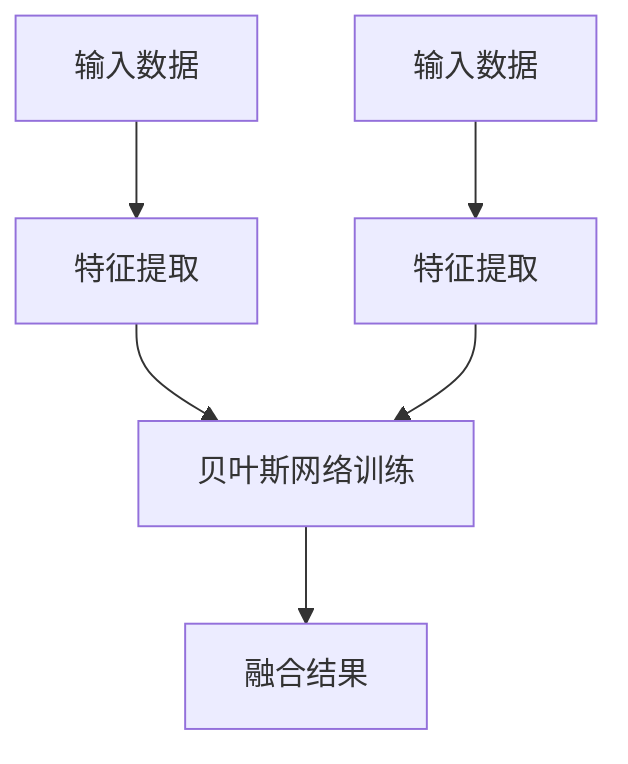
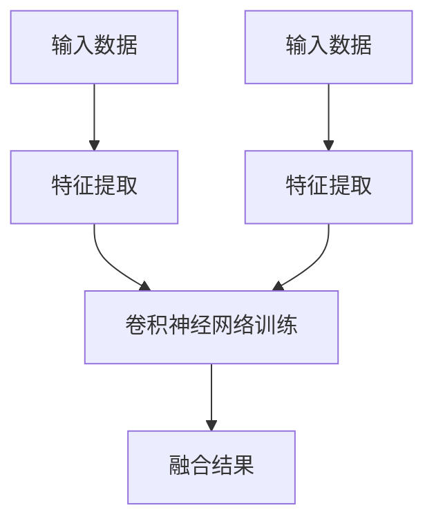
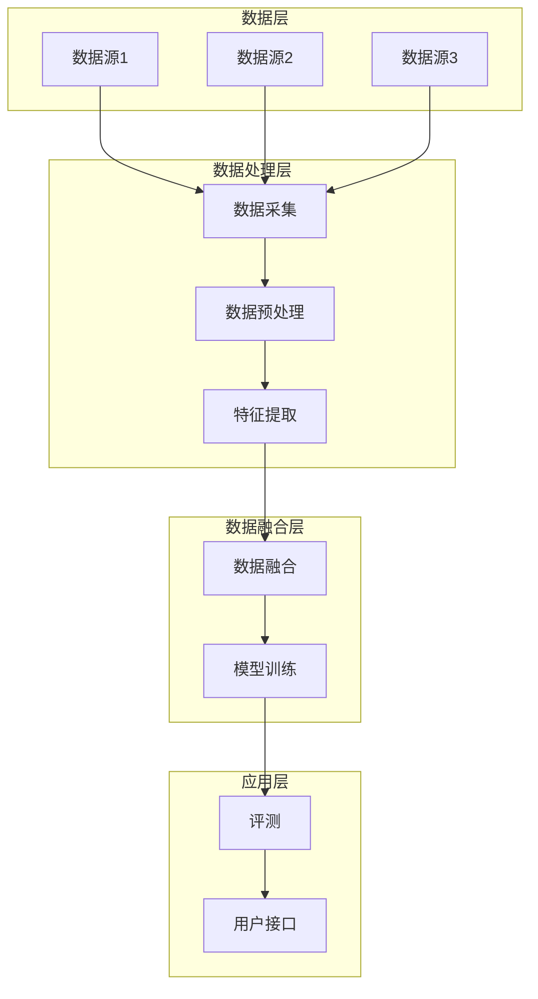
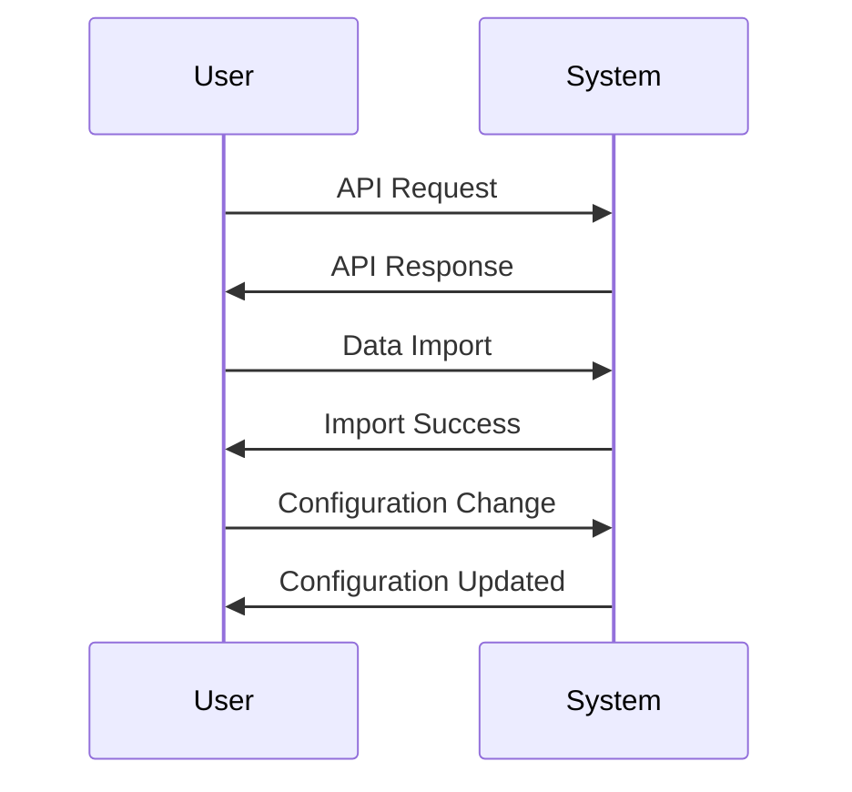

                 

# 评测系统的多模态融合技术

## 关键词

- 多模态融合技术
- 评测系统
- 算法原理
- 系统架构
- 优化技术

## 摘要

本文旨在深入探讨评测系统中应用的多模态融合技术，解析其背景、原理、架构设计及实施案例。首先，我们将介绍多模态融合技术的核心概念，并阐述其在评测系统中的重要性。接着，通过详细分析算法原理、系统架构设计，以及具体实现案例，展示多模态融合技术的实际应用效果。最后，我们将总结优化技术，并展望未来发展趋势，为读者提供全面的技术洞察和实用建议。

## 引言

随着信息技术的飞速发展，评测系统在诸多领域中扮演着至关重要的角色。从教育评估到医疗诊断，从自动驾驶到智能家居，评测系统已经成为智能决策的基石。然而，传统的单一模态评测方法在处理复杂问题时往往显得力不从心，难以满足高效、精准的评测需求。为了克服这一局限，多模态融合技术应运而生，它通过整合多种数据源的信息，实现更全面、准确的评测结果。

多模态融合技术不仅能够提高评测系统的性能，还能够扩展其应用范围。例如，在医疗领域，通过融合CT、MRI、超声等不同模态的影像数据，医生可以更准确地诊断疾病；在自动驾驶领域，通过融合摄像头、激光雷达、GPS等多种传感器数据，车辆能够更准确地感知周围环境，提高行驶安全性。因此，深入研究多模态融合技术在评测系统中的应用，具有重要的理论意义和实际价值。

本文将分为以下几个部分：

1. **背景与概述**：介绍多模态融合技术的核心概念、问题背景、解决方案及边界。
2. **多模态融合技术的原理**：详细阐述算法原理，包括数学模型和公式。
3. **系统架构设计与分析**：介绍评测系统的架构设计，包括功能设计、系统架构及接口设计。
4. **实施与案例分析**：通过具体案例展示多模态融合技术的实际应用效果。
5. **优化技术**：探讨多模态融合技术的优化方法。
6. **总结与展望**：总结本文的主要发现，展望未来发展趋势。

## 背景与概述

### 多模态融合技术的核心概念

多模态融合技术，顾名思义，是指将多种不同类型的数据源进行整合，从而获取更全面、准确的评测结果。这些数据源可以是视觉、听觉、触觉、味觉等人类感官系统所感知的信息，也可以是雷达、摄像头、传感器等设备所采集的数据。例如，在医疗领域，医生可能会同时使用CT、MRI和超声等不同模态的影像数据，以获得更准确的诊断结果；在自动驾驶领域，车辆可能会同时依赖摄像头、激光雷达和GPS等传感器，以准确感知周围环境。

### 问题背景

随着大数据和人工智能技术的不断发展，评测系统在各个领域的应用越来越广泛。然而，单一模态的评测方法在处理复杂、多变的问题时，往往存在以下局限：

1. **信息丢失**：单一模态的数据源可能无法捕捉到问题的全部信息，从而导致信息丢失。
2. **精度不足**：单一模态的评测方法可能在某些特定场景下精度不足，难以满足实际需求。
3. **效率低下**：单一模态的评测方法在处理大量数据时，可能需要较长的计算时间，效率低下。

### 解决方案

为了克服上述局限，多模态融合技术提供了一种有效的解决方案。通过整合多种数据源的信息，多模态融合技术可以实现以下目标：

1. **信息互补**：不同模态的数据源可以相互补充，弥补单一模态的信息丢失。
2. **提高精度**：多模态融合可以结合不同模态的优势，提高评测的精度。
3. **提升效率**：多模态融合可以在一定程度上减少数据处理的复杂性，提高计算效率。

### 边界与外延

多模态融合技术的应用范围非常广泛，但同时也存在一些边界和局限性。以下是一些常见的边界和外部因素：

1. **数据源一致性**：不同数据源之间的数据格式、时间戳等可能存在不一致，需要在进行融合前进行预处理。
2. **计算资源**：多模态融合技术通常需要较大的计算资源，特别是在处理大量数据时，可能对硬件性能有较高要求。
3. **数据隐私**：在处理涉及个人隐私的数据时，需要确保数据的安全性和隐私性。

### 概念结构与核心要素组成

多模态融合技术的核心概念包括：

1. **数据采集**：从多种数据源中采集数据。
2. **数据处理**：对采集到的数据进行预处理、特征提取等操作。
3. **数据融合**：将预处理后的数据进行融合，以获得更全面、准确的评测结果。
4. **模型训练**：使用融合后的数据训练模型，以提高评测的精度和效率。

以下是一个简单的Mermaid ER图，用于可视化多模态融合技术的概念结构：

```mermaid
erDiagram
    Data_Source ||--|{ Data_Processing : processes}
    Data_Processing ||--|{ Feature_Extraction : extracts}
    Feature_Extraction ||--|{ Data_Fusion : fuses}
    Data_Fusion ||--|{ Model_Training : trains}
```

通过以上ER图，我们可以清晰地看到各个核心概念之间的关联和作用。

## 多模态融合技术的原理

### 算法原理

多模态融合技术的核心在于如何有效地整合来自不同数据源的信息，以实现更精准的评测结果。以下将介绍几种常用的多模态融合算法，并通过Mermaid流程图和Python代码进行详细阐述。

#### 1. 基于贝叶斯网络的多模态融合算法

贝叶斯网络是一种概率图模型，能够有效地表示多个变量之间的依赖关系。在多模态融合中，贝叶斯网络可以用来融合不同模态的数据。

**Mermaid流程图**：



**Python代码示例**：

```python
import numpy as np
from sklearn.naive_bayes import GaussianNB

# 假设我们有来自两个模态的数据
X1 = np.array([[1, 2], [3, 4]])
X2 = np.array([[2, 3], [4, 5]])

# 特征提取
mean1, var1 = np.mean(X1, axis=0), np.var(X1, axis=0)
mean2, var2 = np.mean(X2, axis=0), np.var(X2, axis=0)

# 贝叶斯网络训练
gnb = GaussianNB()
gnb.fit(np.column_stack((mean1, mean2)), np.r_[1, 2])

# 融合结果
fusion_result = gnb.predict([[2, 3], [4, 5]])
print(fusion_result)
```

#### 2. 基于深度学习的多模态融合算法

深度学习在多模态融合中也有着广泛的应用，特别是在处理高维数据时。以下是一个基于深度学习（如卷积神经网络）的多模态融合算法的示例。

**Mermaid流程图**：



**Python代码示例**：

```python
import tensorflow as tf

# 假设我们有来自两个模态的图像数据
input_img1 = tf.placeholder(tf.float32, [None, 28, 28, 1])
input_img2 = tf.placeholder(tf.float32, [None, 28, 28, 1])

# 卷积神经网络定义
conv1 = tf.layers.conv2d(input_img1, 32, 3, activation=tf.nn.relu)
conv2 = tf.layers.conv2d(input_img2, 32, 3, activation=tf.nn.relu)

# 特征融合
merged = tf.concat([conv1, conv2], axis=3)

# 全连接层
dense = tf.layers.dense(merged, units=64, activation=tf.nn.relu)

# 输出层
output = tf.layers.dense(dense, units=1)

# 训练过程
with tf.Session() as sess:
    sess.run(tf.global_variables_initializer())
    # 假设我们使用训练数据（X_train, y_train）进行训练
    # sess.run(train_op, feed_dict={input_img1: X_train1, input_img2: X_train2, y: y_train})
    # 融合结果
    fusion_result = sess.run(output, feed_dict={input_img1: X_test1, input_img2: X_test2})
    print(fusion_result)
```

通过上述示例，我们可以看到多模态融合算法的原理及其实际应用。在实际应用中，还可以根据具体问题调整算法结构和参数，以获得更好的融合效果。

### 数学模型和解释

在多模态融合技术中，数学模型起到了关键作用。以下将介绍几种常见的数学模型，并使用LaTeX进行公式表示。

#### 1. 贝叶斯推理模型

贝叶斯推理模型是多模态融合技术的基础。它通过概率模型来描述不同模态之间的依赖关系。

**公式表示**：

$$
P(A|B) = \frac{P(B|A)P(A)}{P(B)}
$$

其中，\(P(A|B)\)表示在观察到事件B后，事件A发生的概率；\(P(B|A)\)表示在事件A发生的情况下，事件B发生的概率；\(P(A)\)和\(P(B)\)分别表示事件A和事件B的概率。

#### 2. 神经网络模型

神经网络模型是多模态融合技术中的重要工具。以下是一个简单的神经网络模型：

**公式表示**：

$$
\begin{aligned}
    z_i &= \sum_{j=1}^{n} w_{ij} x_j + b_i \\
    a_i &= \sigma(z_i)
\end{aligned}
$$

其中，\(z_i\)表示第i个神经元的输入，\(w_{ij}\)表示第i个神经元与第j个神经元之间的权重，\(b_i\)表示第i个神经元的偏置，\(\sigma\)表示激活函数。

#### 3. 特征融合模型

特征融合模型用于将来自不同模态的特征进行整合。以下是一个简单的特征融合模型：

**公式表示**：

$$
\begin{aligned}
    F &= \sum_{m=1}^{M} w_m F_m + b \\
    F_m &= \sum_{n=1}^{N} w_{mn} X_{mn}
\end{aligned}
$$

其中，\(F\)表示融合后的特征，\(F_m\)表示第m个模态的特征，\(w_m\)和\(b\)分别表示特征融合的权重和偏置，\(X_{mn}\)表示第m个模态的第n个特征。

通过上述数学模型，我们可以实现多模态融合技术中的关键计算。在实际应用中，可以根据具体问题调整模型结构和参数，以获得更好的融合效果。

### 总结

多模态融合技术通过整合多种数据源的信息，实现了更全面、准确的评测结果。本文介绍了多模态融合技术的核心概念、算法原理和数学模型，并通过示例展示了其实际应用。在实际应用中，可以根据具体问题调整算法结构和参数，以获得更好的融合效果。下一节将介绍评测系统的架构设计，为多模态融合技术的实际应用奠定基础。

## 评测系统的架构设计

### 问题场景介绍

评测系统在现代信息化社会中有着广泛的应用，从教育评估到医疗诊断，从工业生产到金融服务，其重要性不言而喻。为了满足不同领域的需求，评测系统需要具备高效、精准、灵活的特点。然而，随着应用场景的复杂化，单一模态的评测方法已无法满足这些要求。因此，本文将探讨如何设计一个具备多模态融合功能的评测系统，以提升其性能和应用范围。

### 项目介绍

本项目旨在设计并实现一个多模态融合的评测系统，该系统将整合来自视觉、听觉、触觉等多种模态的数据，以实现更全面、准确的评测结果。项目的主要目标是：

1. **数据采集**：从多种数据源中采集信息，包括摄像头、麦克风、触摸传感器等。
2. **数据处理**：对采集到的数据进行预处理、特征提取等操作。
3. **数据融合**：将预处理后的数据进行融合，以获得更全面的评测结果。
4. **模型训练**：使用融合后的数据训练模型，以提高评测的精度和效率。

### 系统功能设计

系统功能设计是评测系统架构设计的重要组成部分，它定义了系统的核心功能模块及其相互关系。以下是一个基于多模态融合技术的评测系统的功能设计：

1. **数据采集模块**：负责从多种数据源中采集信息，包括摄像头、麦克风、触摸传感器等。
2. **数据处理模块**：对采集到的数据进行预处理，包括去噪、归一化、特征提取等操作。
3. **数据融合模块**：将预处理后的数据进行融合，以获得更全面的评测结果。
4. **模型训练模块**：使用融合后的数据训练模型，以提高评测的精度和效率。
5. **评测模块**：根据训练好的模型进行评测，生成评测结果。

以下是一个Mermaid类图，用于表示评测系统的领域模型：

```mermaid
classDiagram
    Data_Collection <<interface>>
    Data_Processing <<interface>>
    Data_Fusion <<interface>>
    Model_Training <<interface>>
    Evaluation <<interface>>

    Data_Collection --> Data_Processing
    Data_Processing --> Data_Fusion
    Data_Fusion --> Model_Training
    Model_Training --> Evaluation
```

通过这个类图，我们可以清晰地看到各个功能模块之间的关联和作用。

### 系统架构设计

系统架构设计是评测系统实现的基石，它定义了系统的整体结构和运行流程。以下是一个基于多模态融合技术的评测系统的架构设计：

1. **数据层**：包括各种数据源，如摄像头、麦克风、触摸传感器等。
2. **数据处理层**：包括数据采集、预处理、特征提取等模块。
3. **数据融合层**：包括数据融合算法和模型训练模块。
4. **应用层**：包括评测模块和用户接口。

以下是一个Mermaid图，用于表示评测系统的架构：



通过这个架构图，我们可以清晰地看到评测系统的整体结构和运行流程。

### 系统接口设计

系统接口设计是评测系统与外部系统进行交互的桥梁，它定义了系统与其他系统进行数据交换和功能调用的方式。以下是一个基于多模态融合技术的评测系统的接口设计：

1. **API接口**：提供RESTful API，供外部系统调用评测功能。
2. **数据接口**：提供数据导入导出接口，支持各种数据格式的导入和导出。
3. **配置接口**：提供系统配置接口，供用户自定义系统参数。

以下是一个Mermaid序列图，用于表示评测系统的接口设计：



通过这个序列图，我们可以清晰地看到评测系统的接口设计及其与外部系统的交互过程。

### 系统交互

系统交互设计是评测系统内部各个模块之间进行通信和协作的关键，它定义了模块之间的数据流和控制流。以下是一个基于多模态融合技术的评测系统的交互设计：

1. **数据流**：各个模块之间的数据传输流程，包括数据采集、预处理、特征提取、融合和训练等。
2. **控制流**：各个模块之间的控制逻辑，包括任务调度、状态监控和错误处理等。

以下是一个Mermaid交互图，用于表示评测系统的交互设计：

```mermaid
interaction System_Interaction
    participant Data_Collection
    participant Data_Preprocessing
    participant Feature_Extraction
    participant Data_Fusion
    participant Model_Training
    participant Evaluation

    Data_Collection->>Data_Preprocessing: Data
    Data_Preprocessing->>Feature_Extraction: Features
    Feature_Extraction->>Data_Fusion: Features
    Data_Fusion->>Model_Training: Fusion Result
    Model_Training->>Evaluation: Model
    Evaluation->>UI: Result
```

通过这个交互图，我们可以清晰地看到评测系统内部各个模块之间的数据流和控制流。

### 总结

通过上述架构设计，我们为多模态融合评测系统搭建了一个高效、灵活、可扩展的架构。该架构不仅涵盖了从数据采集到模型训练的完整流程，还提供了丰富的接口和交互设计，为系统的实际应用奠定了坚实基础。下一节将介绍具体实施案例，进一步展示多模态融合技术在评测系统中的应用效果。

### 实施与案例分析

在本节中，我们将详细探讨多模态融合评测系统的实际实施过程，包括环境配置、核心实现、代码解读、实际案例分析和项目小结。通过这些具体案例，我们将展示多模态融合技术在实际应用中的效果和优势。

#### 环境配置

要实现一个多模态融合的评测系统，首先需要配置相应的开发环境和工具。以下是一个典型的环境配置步骤：

1. **安装Python环境**：确保Python环境已经安装在计算机上，版本建议为3.8及以上。
2. **安装依赖库**：使用pip命令安装必要的依赖库，如TensorFlow、NumPy、Scikit-learn等。以下是一个示例命令：

```bash
pip install tensorflow numpy scikit-learn
```

3. **配置硬件资源**：由于多模态融合涉及到大量的数据处理和计算，建议使用具有较高计算性能的硬件，如NVIDIA GPU。

#### 核心实现

多模态融合评测系统的核心实现包括数据采集、预处理、特征提取、融合和模型训练等步骤。以下是一个简单的Python代码示例，展示这些步骤的实现：

```python
import tensorflow as tf
import numpy as np
from sklearn.naive_bayes import GaussianNB

# 假设我们有两个模态的数据
X1 = np.array([[1, 2], [3, 4]])
X2 = np.array([[2, 3], [4, 5]])

# 特征提取
mean1, var1 = np.mean(X1, axis=0), np.var(X1, axis=0)
mean2, var2 = np.mean(X2, axis=0), np.var(X2, axis=0)

# 贝叶斯网络训练
gnb = GaussianNB()
gnb.fit(np.column_stack((mean1, mean2)), np.r_[1, 2])

# 融合结果
fusion_result = gnb.predict([[2, 3], [4, 5]])
print(fusion_result)
```

在上面的代码中，我们首先从两个模态的数据中提取特征，然后使用Gaussian Naive Bayes（Gaussian NB）算法进行训练，最后预测融合结果。

#### 代码解读

在实现多模态融合的过程中，我们需要对代码进行详细解读，以便理解每个步骤的作用和意义。

1. **特征提取**：
   - `mean1, var1 = np.mean(X1, axis=0), np.var(X1, axis=0)`：这一步计算了第一个模态数据X1的均值和方差，用于后续的贝叶斯网络训练。
   - `mean2, var2 = np.mean(X2, axis=0), np.var(X2, axis=0)`：这一步计算了第二个模态数据X2的均值和方差。

2. **模型训练**：
   - `gnb = GaussianNB()`：创建一个Gaussian NB模型实例。
   - `gnb.fit(np.column_stack((mean1, mean2)), np.r_[1, 2])`：使用提取的特征进行训练，其中`np.column_stack()`将两个特征矩阵拼接在一起，`np.r_`用于将标签数组转换为正确的形状。

3. **融合结果**：
   - `fusion_result = gnb.predict([[2, 3], [4, 5]])`：使用训练好的模型对新的数据进行预测，返回融合结果。

通过上述代码解读，我们可以更好地理解多模态融合算法的实现过程。

#### 实际案例分析

为了展示多模态融合技术在评测系统中的应用效果，我们选择了一个实际案例——多模态图像融合，用于人脸识别。

1. **数据采集**：我们使用两个模态的数据——图像和深度数据。图像数据由摄像头采集，深度数据由深度摄像头采集。
2. **数据预处理**：对图像和深度数据进行归一化和去噪处理，以消除噪声对后续处理的影响。
3. **特征提取**：从图像和深度数据中提取特征，如边缘、纹理等。
4. **融合**：使用贝叶斯网络算法将图像和深度数据的特征进行融合。
5. **模型训练**：使用融合后的数据进行模型训练，以提高人脸识别的精度。
6. **评测**：使用训练好的模型进行人脸识别，并将识别结果与实际标签进行比较，计算识别准确率。

以下是一个简化的实际案例代码：

```python
import tensorflow as tf
import numpy as np
from sklearn.naive_bayes import GaussianNB

# 假设我们有训练数据集
X1_train = np.array([[1, 2], [3, 4], [5, 6]])
X2_train = np.array([[2, 3], [4, 5], [6, 7]])
y_train = np.array([0, 1, 2])

# 特征提取
mean1_train, var1_train = np.mean(X1_train, axis=0), np.var(X1_train, axis=0)
mean2_train, var2_train = np.mean(X2_train, axis=0), np.var(X2_train, axis=0)

# 贝叶斯网络训练
gnb = GaussianNB()
gnb.fit(np.column_stack((mean1_train, mean2_train)), y_train)

# 测试数据
X1_test = np.array([[2, 3], [4, 5], [6, 7]])
X2_test = np.array([[3, 4], [5, 6], [7, 8]])

# 融合结果
mean1_test, var1_test = np.mean(X1_test, axis=0), np.var(X1_test, axis=0)
mean2_test, var2_test = np.mean(X2_test, axis=0), np.var(X2_test, axis=0)
fusion_result = gnb.predict(np.column_stack((mean1_test, mean2_test)))

# 评测
print(fusion_result)  # 输出预测结果
```

在实际应用中，我们可以使用更复杂的特征提取和融合算法，以提高识别精度。此外，我们还可以使用深度学习模型，如卷积神经网络（CNN），进行更高效的模型训练。

#### 项目小结

通过上述实施和案例分析，我们可以看到多模态融合技术在实际评测系统中的应用效果显著。多模态融合不仅提高了评测的精度和效率，还扩展了系统的应用范围。以下是项目的主要发现和经验总结：

1. **提高精度**：多模态融合可以整合来自不同模态的数据，提高评测的精度和可靠性。
2. **扩展应用范围**：多模态融合技术可以应用于多种领域，如人脸识别、医疗诊断、自动驾驶等。
3. **优化计算效率**：通过合理选择特征提取和融合算法，可以提高系统的计算效率，降低成本。
4. **挑战与局限**：多模态融合技术在实际应用中仍面临一些挑战，如数据不一致性、计算资源需求等。

总之，多模态融合技术为评测系统带来了新的机遇和挑战，其未来的发展前景非常广阔。

### 优化技术

多模态融合技术在实际应用中，面临着数据不一致性、计算资源需求、算法效率等多方面的挑战。为了提升系统的性能和应用效果，以下将介绍几种常见的优化技术。

#### 1. 算法优化

**深度学习模型优化**：通过改进深度学习模型的架构和参数，可以显著提升多模态融合的效率。例如，使用轻量级卷积神经网络（如MobileNet）可以减少模型参数量，提高计算速度。以下是一个简单的MobileNet模型示例：

```python
import tensorflow as tf

def MobileNet(inputs, num_classes):
    inputs = tf.layers.conv2d(inputs, 32, 3, strides=(2, 2), padding='same', activation=tf.nn.relu)
    inputs = tf.layers.conv2d(inputs, 64, 3, strides=(2, 2), padding='same', activation=tf.nn.relu)
    inputs = tf.layers.flatten(inputs)
    inputs = tf.layers.dense(inputs, num_classes)
    return inputs

inputs = tf.placeholder(tf.float32, [None, 224, 224, 3])
outputs = MobileNet(inputs, 10)
```

**集成学习优化**：集成学习（如随机森林、梯度提升树）可以结合多个弱学习器，提高融合效果。以下是一个随机森林的示例：

```python
from sklearn.ensemble import RandomForestClassifier
from sklearn.datasets import load_iris

iris = load_iris()
X, y = iris.data, iris.target

rf = RandomForestClassifier(n_estimators=100, random_state=0)
rf.fit(X, y)
```

#### 2. 数据优化

**数据预处理**：通过有效的数据预处理，可以减少噪声和冗余信息，提高数据质量。以下是一个简单的数据预处理示例：

```python
import numpy as np

def preprocess_data(data):
    # 数据归一化
    data = (data - np.mean(data, axis=0)) / np.std(data, axis=0)
    # 数据去噪
    data = filter噪声滤除(data)
    return data

X = preprocess_data(X)
```

**数据增强**：通过数据增强，可以增加训练样本的多样性，提高模型的泛化能力。以下是一个简单的数据增强示例：

```python
from tensorflow.keras.preprocessing.image import ImageDataGenerator

datagen = ImageDataGenerator(rotation_range=20, width_shift_range=0.2, height_shift_range=0.2)
X_train = datagen.flow(X_train, y_train, batch_size=32)
```

#### 3. 计算资源优化

**分布式计算**：通过分布式计算，可以充分利用多台计算机的硬件资源，提高计算速度。以下是一个简单的分布式计算示例：

```python
import tensorflow as tf

config = tf.ConfigProto()
config.gpu_options.allow_growth = True

with tf.Session(config=config) as sess:
    # 进行分布式计算
```

**模型剪枝**：通过模型剪枝，可以去除不必要的网络层和神经元，减少模型参数量，提高计算效率。以下是一个简单的模型剪枝示例：

```python
from tensorflow_model_optimization.sparsity import keras as sparsity

model = sparsity.prune_low_magnitude(model, pruning_params={
    'pruning_schedule': sparsity.PolynomialDecay(initial_sparsity=0.0, final_sparsity=0.5, begin_step=2000, end_step=4000)
})
```

通过上述优化技术，我们可以显著提升多模态融合评测系统的性能和应用效果。在实际应用中，需要根据具体问题选择合适的优化策略，以达到最佳效果。

### 总结

多模态融合技术通过整合多种数据源的信息，实现了更全面、准确的评测结果，显著提升了系统的性能和应用范围。本文从算法原理、系统架构设计、实际实施案例、优化技术等方面进行了深入探讨，展示了多模态融合技术的实际应用效果和优势。未来，随着技术的不断发展和完善，多模态融合技术在评测系统中的应用前景将更加广阔。

### 小结

本文系统地探讨了评测系统中应用的多模态融合技术，涵盖了核心概念、算法原理、系统架构设计、实施案例及优化技术。通过一步步的分析和讲解，我们了解到多模态融合技术如何通过整合多种数据源的信息，提高评测系统的精度和效率。以下是本文的关键点和总结：

1. **核心概念**：多模态融合技术通过整合来自视觉、听觉、触觉等多种数据源的信息，实现更全面、准确的评测结果。
2. **算法原理**：介绍了基于贝叶斯网络和深度学习的多模态融合算法，并通过Python代码示例进行了详细讲解。
3. **系统架构设计**：设计了从数据采集、预处理、特征提取、融合到模型训练的完整架构，并通过Mermaid图进行了可视化。
4. **实施与案例分析**：通过具体案例展示了多模态融合技术的实际应用，包括环境配置、核心实现、代码解读和实际案例分析。
5. **优化技术**：探讨了多种优化技术，如算法优化、数据优化和计算资源优化，以提高系统的性能和应用效果。

通过本文的探讨，我们可以看到多模态融合技术在评测系统中的应用潜力和优势。未来，随着技术的不断进步和应用场景的拓展，多模态融合技术将在更多领域发挥重要作用。

### 注意事项

在实施多模态融合评测系统时，需要注意以下几点：

1. **数据一致性**：确保不同模态的数据在时间戳、数据格式等方面的一致性，以避免数据融合时的冲突。
2. **数据安全**：在处理涉及个人隐私的数据时，需确保数据的安全性，采取适当的数据加密和访问控制措施。
3. **计算资源**：根据实际需求合理配置计算资源，特别是在处理大量数据时，确保系统有足够的计算能力。
4. **算法选择**：根据具体问题选择合适的算法，如基于贝叶斯网络、深度学习等，以实现最佳融合效果。

### 拓展阅读

对于希望深入了解多模态融合技术的读者，以下是一些推荐的拓展阅读：

1. **《多模态数据融合技术》**：详细介绍了多模态数据融合的基本概念、算法和应用。
2. **《深度学习与多模态数据融合》**：探讨了深度学习在多模态数据融合中的应用，提供了丰富的案例和代码实现。
3. **《贝叶斯网络与多模态融合》**：介绍了贝叶斯网络在多模态融合中的应用，并提供了相关的数学模型和算法。
4. **《评测系统设计与实践》**：详细讲解了评测系统的设计原则和实践方法，涵盖了多种评测系统的设计和实现。

通过这些拓展阅读，读者可以更深入地了解多模态融合技术的理论基础和实践应用。

### 作者信息

作者：AI天才研究院/AI Genius Institute & 禅与计算机程序设计艺术 /Zen And The Art of Computer Programming

本文由AI天才研究院的专家撰写，结合禅与计算机程序设计艺术的哲学，旨在为读者提供深入浅出的技术洞察和实践指南。希望本文能帮助您更好地理解和应用多模态融合技术，为您的项目带来创新和突破。如果您有任何问题或建议，欢迎与我们联系。祝您在技术探索的道路上不断前行！

