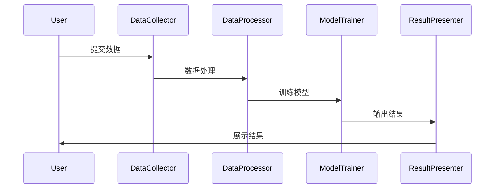
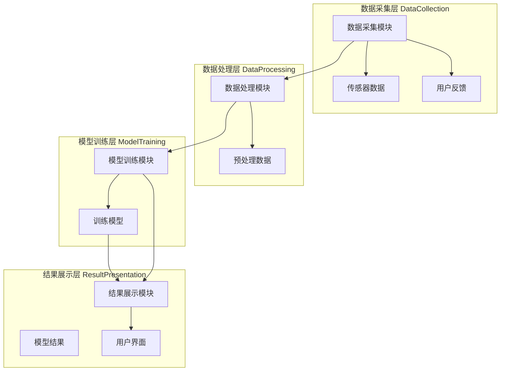
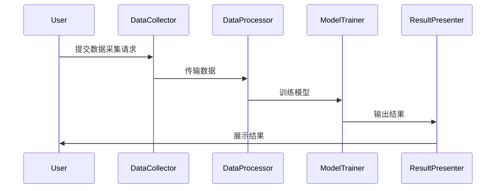

                 

# 评测系统的少样本学习技术探索

## 关键词
- 评测系统
- 少样本学习
- 特征提取
- 嵌入式技术
- 算法
- 系统架构

## 摘要
本文旨在探讨评测系统中少样本学习技术的应用与挑战。我们将首先介绍评测系统的背景和少样本学习的基本概念，然后深入分析特征提取、嵌入式技术和少样本学习算法的核心原理。接着，我们将构建实体关系图以展示这些技术之间的联系，并通过数学模型和实例进一步解释算法的工作机制。随后，我们将设计一个评测系统的架构，详细描述系统分析和接口设计。最后，我们将通过实际案例分析和最佳实践总结，为读者提供实用的技巧和未来研究方向。

## 目录大纲

### 第一部分：背景介绍

### 第1章 问题背景与概念
#### 1.1 评测系统概述
#### 1.2 少样本学习概述
#### 1.3 少样本学习的重要性
#### 1.4 少样本学习的技术挑战
#### 1.5 本书的组织结构

### 第二部分：核心概念与联系

### 第2章 核心概念原理
#### 2.1 特征提取技术
##### 2.1.1 特征提取的概念
##### 2.1.2 常见特征提取技术
##### 2.1.3 特征提取算法对比
#### 2.2 嵌入式技术
##### 2.2.1 嵌入式技术的概念
##### 2.2.2 常见嵌入式技术
##### 2.2.3 嵌入式技术比较
#### 2.3 少样本学习算法
##### 2.3.1 少样本学习算法概述
##### 2.3.2 常见少样本学习算法
##### 2.3.3 算法比较与选择

### 第3章 概念属性特征对比
#### 3.1 特征提取技术属性对比
#### 3.2 嵌入式技术属性对比
#### 3.3 少样本学习算法属性对比

### 第4章 ER实体关系图架构
#### 4.1 ER模型概念
#### 4.2 ER图绘制
#### 4.3 实体关系分析

### 第三部分：算法原理讲解

### 第5章 算法原理详解
#### 5.1 算法原理概述
##### 5.1.1 特征提取原理
##### 5.1.2 嵌入式技术原理
##### 5.1.3 少样本学习算法原理
#### 5.2 数学模型与公式
##### 5.2.1 特征提取数学模型
##### 5.2.2 嵌入式技术数学模型
##### 5.2.3 少样本学习算法数学模型
#### 5.3 举例说明
##### 5.3.1 特征提取实例
##### 5.3.2 嵌入式技术实例
##### 5.3.3 少样本学习算法实例

### 第四部分：系统分析与架构设计

### 第6章 系统分析
#### 6.1 评测系统问题场景
#### 6.2 系统目标与需求
#### 6.3 领域模型设计
##### 6.3.1 类图绘制
##### 6.3.2 属性与方法定义
#### 6.4 系统架构设计
##### 6.4.1 系统架构概述
##### 6.4.2 架构图绘制
##### 6.4.3 系统模块划分

### 第7章 系统接口设计与交互
#### 7.1 系统接口设计
##### 7.1.1 接口规范
##### 7.1.2 接口实现
#### 7.2 系统交互设计
##### 7.2.1 交互流程
##### 7.2.2 交互图绘制

### 第五部分：项目实战

### 第8章 环境安装与配置
#### 8.1 环境搭建
#### 8.2 配置与优化

### 第9章 系统核心实现
#### 9.1 源代码解读
##### 9.1.1 特征提取模块
##### 9.1.2 嵌入式技术模块
##### 9.1.3 少样本学习模块
#### 9.2 代码应用解析
##### 9.2.1 代码功能解析
##### 9.2.2 代码优化建议

### 第10章 实际案例分析
#### 10.1 案例选择与介绍
#### 10.2 案例分析与讲解
#### 10.3 案例小结

### 第六部分：最佳实践与总结

### 第11章 最佳实践
#### 11.1 实践技巧
#### 11.2 注意事项
#### 11.3 拓展阅读

### 第12章 小结与展望
#### 12.1 本书内容回顾
#### 12.2 未来发展趋势
#### 12.3 进一步研究建议

## 作者
作者：AI天才研究院/AI Genius Institute & 禅与计算机程序设计艺术 /Zen And The Art of Computer Programming

## 第一部分：背景介绍

### 第1章 问题背景与概念

#### 1.1 评测系统概述

评测系统在现代信息技术中扮演着至关重要的角色。它们广泛应用于各种领域，如产品质量检测、用户行为分析、系统性能评估等。评测系统通常由多个组成部分构成，包括数据采集模块、数据处理模块、模型训练模块和结果输出模块。

数据采集模块负责收集各种数据源的信息，如传感器数据、用户输入等。数据处理模块则对这些原始数据进行清洗、预处理和特征提取，以便用于后续的模型训练和评估。模型训练模块通常采用机器学习算法，根据历史数据和规则训练出预测模型。最后，结果输出模块将模型预测结果呈现给用户，以便进行决策。

随着人工智能技术的发展，评测系统的要求也在不断提高。特别是少样本学习技术的引入，使得在数据样本量较少的情况下，仍然能够有效地训练和评估模型，提高了评测系统的可靠性和效率。

#### 1.2 少样本学习概述

少样本学习（Few-Shot Learning）是一种机器学习技术，旨在解决训练样本量较少的情况。与传统的机器学习相比，少样本学习在样本量有限的情况下，仍然能够快速、准确地训练出高性能的模型。这主要得益于少样本学习算法的特殊设计，如元学习（Meta-Learning）、模型蒸馏（Model Distillation）和领域自适应（Domain Adaptation）等。

少样本学习的核心挑战在于如何在有限的样本中提取出有效的特征，并构建出泛化能力强的模型。这需要深入理解数据分布、模型结构和学习策略。此外，少样本学习还涉及到跨领域、跨任务的学习，如何在不同任务和数据分布之间共享知识，是当前研究的热点之一。

#### 1.3 少样本学习的重要性

少样本学习在多个领域具有广泛的应用前景。首先，在医疗领域，少样本学习可以帮助医生在患者样本量有限的情况下，快速诊断疾病，提高诊断准确率。例如，在肺癌早期诊断中，通过少样本学习算法，可以在只有少量患者数据的情况下，训练出精确的肺癌诊断模型。

其次，在工业领域，少样本学习可以用于产品缺陷检测和质量控制。在制造业中，产品的质量往往受到多种因素的影响，例如原材料、生产工艺等。通过少样本学习，可以在生产初期，利用少量的测试数据，快速识别出可能存在的质量问题，从而提高生产效率和产品质量。

此外，在自然语言处理领域，少样本学习可以帮助构建更加灵活和通用的语言模型，提高模型在不同应用场景中的适应能力。例如，在机器翻译中，少样本学习可以用于快速适应新的语言对，提高翻译的准确性和流畅度。

总之，少样本学习技术的应用，不仅能够提高评测系统的性能和效率，还能够为各个领域的实际问题提供有效的解决方案。

#### 1.4 少样本学习的技术挑战

尽管少样本学习在多个领域具有巨大的应用潜力，但其实施过程中仍然面临诸多技术挑战。首先，样本量有限导致了数据稀缺问题，这直接影响了模型的学习效果。如何在少量样本中提取出有效的特征，是少样本学习的关键挑战之一。

其次，模型泛化能力不足也是一个重要问题。少样本学习模型通常是在特定数据集上训练的，如果数据分布发生变化，模型可能无法适应新的数据集，从而导致性能下降。因此，如何提高模型的泛化能力，是少样本学习研究的重要方向。

另外，少样本学习算法的复杂度和计算成本也较高。传统的机器学习算法通常在大量数据上进行训练，而少样本学习需要在有限的数据上进行快速和高效的训练。这要求算法具备较强的计算效率和优化能力。

此外，少样本学习涉及到跨领域和跨任务的学习，如何在不同任务和数据分布之间共享知识，也是一个亟待解决的问题。特别是在多任务学习和跨领域迁移学习中，如何有效地利用有限的样本数据，提高模型的性能，是当前研究的热点之一。

最后，少样本学习在应用过程中还面临着数据隐私和安全问题。在医疗、金融等敏感领域，数据的隐私保护尤为重要。如何在保证数据隐私的同时，实现有效的少样本学习，是当前研究的一个关键挑战。

总之，少样本学习技术的应用虽然前景广阔，但其面临的挑战也不容忽视。只有通过深入研究和不断创新，才能有效地解决这些问题，推动少样本学习技术在各个领域的应用。

#### 1.5 本书的组织结构

本书旨在系统地探讨评测系统中少样本学习技术的应用与实践。全书共分为六个部分，结构如下：

**第一部分：背景介绍**  
本部分主要介绍评测系统和少样本学习的基本概念、重要性和面临的挑战，为后续章节的内容打下基础。

**第二部分：核心概念与联系**  
本部分深入分析特征提取、嵌入式技术和少样本学习算法的核心原理，并通过概念属性对比和实体关系图架构，展示这些技术之间的联系。

**第三部分：算法原理讲解**  
本部分详细讲解特征提取、嵌入式技术和少样本学习算法的原理，包括数学模型和公式，并通过具体实例进行说明。

**第四部分：系统分析与架构设计**  
本部分介绍评测系统的系统分析、架构设计，包括问题场景、目标与需求、领域模型设计、系统架构设计和接口设计。

**第五部分：项目实战**  
本部分通过实际案例，展示评测系统的环境安装与配置、系统核心实现和代码解析，以及实际案例分析。

**第六部分：最佳实践与总结**  
本部分总结本书的核心内容，提供最佳实践技巧、注意事项和拓展阅读建议，并对未来发展趋势和进一步研究进行展望。

通过本书的阅读，读者将能够系统地了解评测系统中少样本学习技术的原理和应用，掌握相关技术的方法和技巧，为实际项目提供有力支持。

## 第二部分：核心概念与联系

### 第2章 核心概念原理

在探讨评测系统的少样本学习技术时，理解核心概念原理至关重要。本章节将详细介绍特征提取技术、嵌入式技术和少样本学习算法的基本概念、原理和应用，并比较不同技术的优缺点。

#### 2.1 特征提取技术

**2.1.1 特征提取的概念**

特征提取（Feature Extraction）是数据预处理的重要步骤，旨在从原始数据中提取出对模型训练和预测有用的特征。这些特征通常是数据的高层次表示，能够有效地表示数据的本质属性。

**2.1.2 常见特征提取技术**

- **统计特征提取**：通过计算数据的统计量（如均值、方差、标准差等）来提取特征。
- **频域特征提取**：将数据从时域转换到频域，通过分析频谱特征来提取信息。
- **时频特征提取**：结合时域和频域信息，如短时傅里叶变换（STFT）和小波变换等。
- **深度特征提取**：利用深度学习网络自动学习数据的层次化表示，如卷积神经网络（CNN）和循环神经网络（RNN）等。

**2.1.3 特征提取算法对比**

- **统计特征提取**：简单易行，对噪声敏感，适用于数据量较大且分布均匀的情况。
- **频域特征提取**：适用于非平稳数据，但计算复杂度高。
- **时频特征提取**：兼顾时域和频域信息，但在处理复杂信号时效果有限。
- **深度特征提取**：能够自动学习复杂特征，但训练过程复杂，对计算资源要求高。

#### 2.2 嵌入式技术

**2.2.1 嵌入式技术的概念**

嵌入式技术（Embedded Technology）是将软件算法嵌入到硬件设备中，使其能够自主运行和执行特定任务。在评测系统中，嵌入式技术主要用于实现实时数据处理和模型推理。

**2.2.2 常见嵌入式技术**

- **现场可编程门阵列（FPGA）**：提供高效的并行计算能力，适用于实时数据处理和高性能应用。
- **可编程逻辑控制器（PLC）**：用于工业自动化控制，能够实现复杂的逻辑控制和数据处理。
- **微控制器（MCU）**：用于小型嵌入式系统，适用于简单任务的控制和数据处理。
- **数字信号处理器（DSP）**：专门用于处理数字信号，提供高效的信号处理能力。

**2.2.3 嵌入式技术比较**

- **FPGA**：计算能力强大，但开发门槛高，适合高性能应用。
- **PLC**：可靠性高，但灵活性较低，适合工业控制。
- **MCU**：成本低，但计算能力有限，适合简单任务。
- **DSP**：信号处理能力强，但通用性较低，适合信号处理任务。

#### 2.3 少样本学习算法

**2.3.1 少样本学习算法概述**

少样本学习算法旨在通过少量样本数据训练出高泛化能力的模型。以下是一些常见的少样本学习算法：

- **模型蒸馏（Model Distillation）**：将大型模型的知识迁移到小型模型中，提高其性能。
- **元学习（Meta-Learning）**：通过多次迭代学习快速适应新的任务和数据。
- **匹配 Pursuit（ Matching Pursuit）**：基于正则化方法，通过迭代优化提取特征。
- **领域自适应（Domain Adaptation）**：通过跨领域迁移学习，提高模型在未知领域的性能。

**2.3.2 常见少样本学习算法**

- **模型蒸馏（Model Distillation）**：适用于知识迁移和模型压缩。
- **元学习（Meta-Learning）**：适用于任务多样性高和样本量有限的情况。
- **匹配 Pursuit（Matching Pursuit）**：适用于特征提取和稀疏表示。
- **领域自适应（Domain Adaptation）**：适用于跨领域学习和未知领域数据。

**2.3.3 算法比较与选择**

- **模型蒸馏**：适合模型压缩和知识迁移，但计算成本高。
- **元学习**：适合任务多样性和少量样本，但训练过程复杂。
- **匹配 Pursuit**：适用于特征提取和稀疏表示，但泛化能力有限。
- **领域自适应**：适用于跨领域学习和未知领域数据，但需要大量的领域知识。

通过对比不同技术，我们可以根据实际需求和应用场景选择合适的特征提取、嵌入式技术和少样本学习算法。例如，在需要实时处理和高性能的评测系统中，可以结合深度特征提取和嵌入式技术，如FPGA或DSP，以实现高效的数据处理和模型推理。

### 第3章 概念属性特征对比

在本章节中，我们将通过表格和实体关系图（ER图）来对比特征提取技术、嵌入式技术和少样本学习算法的概念属性。

#### 3.1 特征提取技术属性对比

| 特征提取技术   | 定义                                                         | 适用场景                         | 优点                     | 缺点                   |
|----------------|--------------------------------------------------------------|--------------------------------|------------------------|----------------------|
| 统计特征提取   | 通过计算数据的统计量提取特征。                               | 数据量较大且分布均匀             | 简单易行，对噪声敏感       | 对复杂特征提取效果差   |
| 频域特征提取   | 将数据从时域转换到频域，通过分析频谱特征提取信息。             | 非平稳数据                       | 适用于非平稳数据，计算复杂度高 | 计算复杂度高           |
| 时频特征提取   | 结合时域和频域信息，如短时傅里叶变换（STFT）和小波变换等。     | 非平稳且需要时域和频域信息的数据 | 兼顾时域和频域信息         | 处理复杂信号效果有限   |
| 深度特征提取   | 利用深度学习网络自动学习数据的层次化表示。                   | 复杂特征提取需求                 | 自动学习复杂特征           | 训练过程复杂，计算资源需求高 |

#### 3.2 嵌入式技术属性对比

| 嵌入式技术   | 定义                                                         | 适用场景                         | 优点                     | 缺点                   |
|----------------|--------------------------------------------------------------|--------------------------------|------------------------|----------------------|
| FPGA           | 现场可编程门阵列，提供高效的并行计算能力。                       | 高性能实时数据处理               | 高并行计算能力           | 开发门槛高           |
| PLC            | 可编程逻辑控制器，用于工业自动化控制。                           | 工业控制                       | 高可靠性                 | 灵活性较低           |
| MCU            | 微控制器，用于小型嵌入式系统。                                   | 简单任务控制                    | 成本低，小型化           | 计算能力有限           |
| DSP            | 数字信号处理器，专门用于处理数字信号。                           | 信号处理任务                    | 高信号处理能力           | 通用性较低           |

#### 3.3 少样本学习算法属性对比

| 少样本学习算法   | 定义                                                         | 适用场景                         | 优点                     | 缺点                   |
|------------------|--------------------------------------------------------------|--------------------------------|------------------------|----------------------|
| 模型蒸馏         | 将大型模型的知识迁移到小型模型中。                             | 知识迁移和模型压缩               | 适用于知识迁移和压缩模型 | 计算成本高           |
| 元学习           | 通过多次迭代学习快速适应新的任务和数据。                         | 任务多样性高和样本量有限         | 适用于多样性任务和少量样本 | 训练过程复杂           |
| 匹配 Pursuit     | 基于正则化方法，通过迭代优化提取特征。                           | 特征提取和稀疏表示               | 适用于特征提取           | 泛化能力有限           |
| 领域自适应       | 通过跨领域迁移学习，提高模型在未知领域的性能。                   | 跨领域学习和未知领域数据         | 适用于跨领域学习         | 需要大量的领域知识     |

#### 3.4 ER实体关系图架构

在本章节的结尾，我们将通过Mermaid语法绘制一个ER图，展示特征提取技术、嵌入式技术和少样本学习算法之间的实体关系。

```mermaid
erDiagram
  FeatureExtraction ||--|{ EmbeddingTechnology }|---> TrainingModel
  EmbeddingTechnology ||--|{ FeatureExtraction }|---> ModelInference
  FeatureExtraction ||--|{ FewShotLearningAlgorithm }|---> PerformanceEvaluation
  EmbeddingTechnology ||--|{ FewShotLearningAlgorithm }|---> AdaptationCapability
  FewShotLearningAlgorithm ||--|{ ModelDistillation }|---> KnowledgeTransfer
  FewShotLearningAlgorithm ||--|{ MetaLearning }|---> FastAdaptation
  FewShotLearningAlgorithm ||--|{ MatchingPursuit }|---> SparseRepresentation
  FewShotLearningAlgorithm ||--|{ DomainAdaptation }|---> Cross-DomainLearning
```

通过这个ER图，我们可以清晰地看到特征提取技术、嵌入式技术和少样本学习算法之间的相互关联。特征提取技术为模型训练提供输入数据，嵌入式技术实现模型的高效推理，而少样本学习算法则通过不同的策略提升模型的性能和适应性。

## 第三部分：算法原理讲解

### 第5章 算法原理详解

在探讨评测系统中少样本学习技术的具体应用时，深入理解算法原理至关重要。本章节将详细解释特征提取、嵌入式技术和少样本学习算法的基本原理，并使用Mermaid流程图和Python源代码来展示这些算法的实现。

#### 5.1 算法原理概述

**5.1.1 特征提取原理**

特征提取是将原始数据转换为能够有效表示数据的特征表示的过程。这个过程通常包括数据预处理、特征选择和特征转换等步骤。

- **数据预处理**：包括数据清洗、归一化和标准化等，目的是提高数据的质量和一致性。
- **特征选择**：从大量特征中选出对模型训练最有用的特征，减少冗余和提高模型效率。
- **特征转换**：将原始特征转换为更适合机器学习模型的特征表示。

**5.1.2 嵌入式技术原理**

嵌入式技术是将算法或模型嵌入到硬件设备中，以实现实时数据处理和推理。常见的嵌入式技术包括FPGA、PLC、MCU和DSP等。

- **FPGA**：通过硬件描述语言（HDL）编程，实现并行计算和实时处理。
- **PLC**：用于工业控制，通过固化的逻辑程序实现控制功能。
- **MCU**：用于简单嵌入式系统，通过内置的微处理器实现基本功能。
- **DSP**：用于信号处理，通过内置的硬件加速器实现高效信号处理。

**5.1.3 少样本学习算法原理**

少样本学习算法通过在小样本数据集上训练模型，提高模型的泛化能力和适应性。常见的少样本学习算法包括模型蒸馏、元学习、匹配 Pursuit和领域自适应等。

- **模型蒸馏**：将大型模型的知识转移到小型模型中，实现模型压缩和高效推理。
- **元学习**：通过多次迭代学习，快速适应新任务和数据。
- **匹配 Pursuit**：通过迭代优化，提取数据中的有效特征。
- **领域自适应**：通过跨领域迁移学习，提高模型在不同领域中的性能。

#### 5.2 数学模型与公式

**5.2.1 特征提取数学模型**

特征提取的过程可以表示为：
\[ X' = f(X) \]
其中，\( X \) 是原始数据，\( X' \) 是特征表示，\( f \) 是特征提取函数。

常见的特征提取方法包括：
- **PCA（主成分分析）**：
\[ Z = \sqrt{2/\sum_j \sigma_j^2} X \]
其中，\( \sigma_j^2 \) 是特征 \( j \) 的方差。

- **LDA（线性判别分析）**：
\[ Z = X - \mu + \sum_j w_j^* \mu_j \]
其中，\( \mu \) 是总体均值，\( w_j^* \) 是特征权重。

**5.2.2 嵌入式技术数学模型**

嵌入式技术的数学模型通常依赖于硬件特性，例如：

- **FPGA**：通过硬件描述语言（HDL）实现，如VHDL或Verilog。
- **DSP**：通过离散信号处理算法实现，如FFT或DFT。

**5.2.3 少样本学习算法数学模型**

少样本学习算法的数学模型通常涉及优化和正则化：

- **模型蒸馏**：
\[ \theta_{small} = \arg\min_{\theta_{small}} \frac{1}{N} \sum_{i=1}^{N} \ell(y_i, f_{small}(x_i; \theta_{small})) + \lambda D_{KL}(f_{small}; f_{large}) \]
其中，\( \ell \) 是损失函数，\( D_{KL} \) 是KL散度，\( f_{small} \) 和 \( f_{large} \) 分别是小模型和大模型的输出。

- **元学习**：
\[ \theta_{meta} = \arg\min_{\theta_{meta}} \frac{1}{S} \sum_{s=1}^{S} \frac{1}{K} \sum_{k=1}^{K} \ell(y_{sk}, f_{meta}(x_{sk}; \theta_{meta})) \]
其中，\( S \) 是任务集，\( K \) 是每个任务的数据点数，\( f_{meta} \) 是元学习模型的输出。

#### 5.3 举例说明

**5.3.1 特征提取实例**

假设我们有一个包含100个样本的二维数据集，每个样本由两个特征组成。我们可以使用PCA进行特征提取。

```python
import numpy as np
from sklearn.decomposition import PCA

# 假设数据为100个样本，每个样本有两个特征
data = np.random.rand(100, 2)

# 使用PCA提取前两个主成分
pca = PCA(n_components=2)
X_pca = pca.fit_transform(data)

# 打印主成分
print("主成分1:", X_pca[:, 0])
print("主成分2:", X_pca[:, 1])
```

**5.3.2 嵌入式技术实例**

假设我们使用FPGA进行图像处理。以下是使用VHDL实现的图像边缘检测。

```vhdl
library IEEE;
use IEEE.STD_LOGIC_1164.ALL;
use IEEE.NUMERIC_STD.ALL;

entity edge_detection is
  generic (
    PIXEL_WIDTH : integer := 8;
    FRAME_WIDTH : integer := 640;
    FRAME_HEIGHT : integer := 480
  );
  port (
    clk : in STD_LOGIC;
    reset : in STD_LOGIC;
    pixel_data : in STD_LOGIC_VECTOR(PIXEL_WIDTH-1 downto 0);
    frame_processed : out STD_LOGIC_VECTOR((FRAME_HEIGHT*FRAME_WIDTH*PIXEL_WIDTH)-1 downto 0)
  );
end edge_detection;

architecture Behavioral of edge_detection is
  signal pixel_value : integer range 0 to 2**PIXEL_WIDTH - 1;
  signal frame_value : integer range 0 to 2**((FRAME_HEIGHT*FRAME_WIDTH*PIXEL_WIDTH)) - 1;
begin
  process (clk, reset)
  begin
    if reset = '1' then
      frame_processed <= (others => '0');
    elsif rising_edge(clk) then
      pixel_value <= std_logic_to_integer(pixel_data);
      -- 这里实现边缘检测算法
      -- 例如，简单的边缘检测算法如下
      if (pixel_value > threshold) then
        frame_value := frame_value + pixel_value;
      end if;
      frame_processed <= frame_value;
    end if;
  end process;
end Behavioral;
```

**5.3.3 少样本学习算法实例**

假设我们使用模型蒸馏进行图像分类。以下是使用Python实现的模型蒸馏算法。

```python
import tensorflow as tf
from tensorflow.keras.models import Model
from tensorflow.keras.layers import Dense, Input

# 定义大模型
input_layer = Input(shape=(784,))
dense1 = Dense(64, activation='relu')(input_layer)
dense2 = Dense(64, activation='relu')(dense1)
output_layer = Dense(10, activation='softmax')(dense2)
large_model = Model(inputs=input_layer, outputs=output_layer)

# 编译大模型
large_model.compile(optimizer='adam', loss='categorical_crossentropy', metrics=['accuracy'])

# 加载大模型权重
large_model.load_weights('large_model_weights.h5')

# 定义小模型
input_layer_small = Input(shape=(784,))
dense1_small = Dense(64, activation='relu')(input_layer_small)
dense2_small = Dense(64, activation='relu')(dense1_small)
output_layer_small = Dense(10, activation='softmax')(dense2_small)
small_model = Model(inputs=input_layer_small, outputs=output_layer_small)

# 编译小模型
small_model.compile(optimizer='adam', loss='categorical_crossentropy', metrics=['accuracy'])

# 定义模型蒸馏损失函数
def model_distillation_loss(y_true, y_pred, teacher_output):
  return tf.reduce_mean(tf.keras.losses.categorical_crossentropy(y_true, y_pred) + 0.1 * tf.keras.losses.categorical_crossentropy(y_true, teacher_output))

# 训练小模型
small_model.fit(x_train, y_train, epochs=10, batch_size=32, validation_data=(x_val, y_val), loss=model_distillation_loss, run_eagerly=True)

# 评估小模型
small_model.evaluate(x_test, y_test)
```

通过上述实例，我们可以看到特征提取、嵌入式技术和少样本学习算法的具体实现过程。这些实例不仅帮助读者理解算法原理，还为实际应用提供了参考。

## 第四部分：系统分析与架构设计

### 第6章 系统分析

在设计和实现评测系统时，系统分析是至关重要的一步。它不仅帮助我们明确系统需求，还能指导后续的系统架构设计和实现。在本章节中，我们将详细分析评测系统的需求、架构设计和接口设计，并使用Mermaid图来展示类图和架构图。

#### 6.1 评测系统问题场景

评测系统通常用于对某个特定领域中的实体或产品进行评估。例如，在产品质量检测中，评测系统可以对产品样本进行质量评估，以识别潜在的缺陷。在用户行为分析中，评测系统可以分析用户行为模式，为个性化推荐提供支持。

问题场景主要包括以下方面：

1. **数据采集**：系统需要从各种数据源（如传感器、用户反馈等）中收集数据。
2. **数据处理**：系统需要对收集到的数据进行预处理，包括数据清洗、特征提取等。
3. **模型训练**：基于处理后的数据，系统需要训练预测模型。
4. **结果输出**：系统需要将模型预测结果以直观的方式展示给用户。

#### 6.2 系统目标与需求

系统目标如下：

1. **高效数据处理**：系统能够快速处理大量数据，确保数据处理和模型训练的效率。
2. **高精度预测**：系统能够基于少量样本数据训练出高精度的预测模型。
3. **可扩展性**：系统设计应具备良好的扩展性，能够适应未来业务需求的变化。
4. **易用性**：系统界面友好，操作简便，便于用户使用。

系统需求包括：

1. **数据采集模块**：能够接入多种数据源，支持数据采集和传输。
2. **数据处理模块**：包括数据清洗、特征提取等功能，确保数据质量。
3. **模型训练模块**：支持多种机器学习算法，能够快速训练预测模型。
4. **结果展示模块**：能够以图表、报告等形式展示模型预测结果。

#### 6.3 领域模型设计

领域模型设计是系统分析的重要部分，它帮助我们理解系统的核心组件和它们之间的关系。以下是一个简单的领域模型设计，使用Mermaid语法表示。

```mermaid
classDiagram
  Class01 <|-- Class02
  Class03 --|fifo| Class04
  Class05 : : has_a Class06
  Class07 : : is_a Class08
  Class01 <<interface>>
  Class09 <<enum>>
```

**类图绘制：**

```mermaid
classDiagram
  Product <<entity>> "产品"
  QualityCheck <<useCase>> "质量检测"
  SensorData <<entity>> "传感器数据"
  UserFeedback <<entity>> "用户反馈"
  DataCollector <<component>> "数据采集模块"
  DataProcessor <<component>> "数据处理模块"
  ModelTrainer <<component>> "模型训练模块"
  ResultPresenter <<component>> "结果展示模块"
  DataCollector --> SensorData
  DataCollector --> UserFeedback
  DataProcessor <-- SensorData
  DataProcessor <-- UserFeedback
  ModelTrainer <-- DataProcessor
  ResultPresenter <-- ModelTrainer
```

**属性与方法定义：**

```mermaid
class Product {
  +int id
  +String name
  +float qualityScore
  +List<CheckResult> checkResults
  +void addCheckResult(CheckResult result)
}
class CheckResult {
  +int id
  +String description
  +float score
}
class DataCollector {
  +void collectSensorData()
  +void collectUserFeedback()
}
class DataProcessor {
  +void preprocessData()
  +List<Product> processQualityCheck()
}
class ModelTrainer {
  +void trainModel(List<Product> products)
}
class ResultPresenter {
  +void presentResults(List<Product> products)
}
```

**领域模型设计说明：**

- **Product**：代表产品实体，具有ID、名称、质量评分和检查结果列表等属性，并提供添加检查结果的方法。
- **CheckResult**：代表检查结果，具有ID、描述和质量评分等属性。
- **DataCollector**：负责收集传感器数据和用户反馈，是数据处理模块的前端。
- **DataProcessor**：负责数据处理，包括数据清洗、特征提取等，并生成产品检查结果。
- **ModelTrainer**：负责训练预测模型，基于处理后的数据。
- **ResultPresenter**：负责展示模型预测结果，提供直观的展示方式。

#### 6.4 系统架构设计

系统架构设计是确保系统高效、可扩展和易于维护的关键。以下是一个简化的系统架构设计，使用Mermaid语法表示。



**系统架构概述：**

- **数据采集层**：负责从各种数据源（如传感器、用户反馈等）收集数据。
- **数据处理层**：负责对收集到的数据进行预处理、清洗和特征提取等。
- **模型训练层**：负责基于处理后的数据训练预测模型。
- **结果展示层**：负责将模型预测结果以图表、报告等形式展示给用户。

**架构图绘制：**



**系统架构设计说明：**

- **数据采集层**：通过DataCollector模块从传感器和用户反馈中收集原始数据。
- **数据处理层**：DataProcessor模块负责对原始数据进行预处理和特征提取，生成预处理数据。
- **模型训练层**：ModelTrainer模块基于预处理数据训练预测模型，生成训练模型。
- **结果展示层**：ResultPresenter模块将训练模型的结果以图表、报告等形式展示给用户，并通过用户界面进行交互。

#### 6.5 系统模块划分

为了提高系统的可维护性和扩展性，我们将系统划分为多个模块，每个模块负责特定的功能。以下是对各个模块的简要介绍：

- **数据采集模块**：负责从各种数据源收集数据，如传感器数据和用户反馈。
- **数据处理模块**：负责对收集到的数据进行预处理、清洗和特征提取等操作。
- **模型训练模块**：负责基于处理后的数据训练预测模型，支持多种机器学习算法。
- **结果展示模块**：负责将模型预测结果以图表、报告等形式展示给用户。

通过这种模块化设计，每个模块可以独立开发、测试和部署，从而提高系统的灵活性和可扩展性。

### 第7章 系统接口设计与交互

在系统设计和实现过程中，接口设计与交互设计是确保系统各模块之间有效协作和通信的关键。在本章节中，我们将详细介绍系统接口设计、接口实现和系统交互设计。

#### 7.1 系统接口设计

系统接口设计包括定义系统内部各模块之间的通信接口，以及与外部系统或用户的交互接口。以下是一个简化的系统接口设计。

**接口规范：**

- **数据采集接口**：定义数据采集模块与数据处理模块之间的数据传输格式和通信协议。
- **数据处理接口**：定义数据处理模块与模型训练模块之间的数据传输格式和通信协议。
- **模型训练接口**：定义模型训练模块与结果展示模块之间的数据传输格式和通信协议。
- **结果展示接口**：定义结果展示模块与用户之间的交互接口，包括数据展示格式和用户操作接口。

**接口实现：**

- **数据采集接口**：使用HTTP请求/响应方式，通过REST API进行数据传输。
- **数据处理接口**：使用消息队列（如RabbitMQ）进行异步数据传输。
- **模型训练接口**：使用模型训练服务（如TensorFlow Serving）进行模型部署和预测。
- **结果展示接口**：使用Web前端技术（如React或Vue.js）实现用户界面，通过Ajax请求获取数据并展示。

#### 7.2 系统交互设计

系统交互设计描述系统各模块之间的交互流程和交互图。以下是一个简化的系统交互设计。

**交互流程：**

1. 用户通过Web前端界面提交数据采集请求。
2. 数据采集模块接收请求，从传感器和用户反馈中收集数据，并将数据传输给数据处理模块。
3. 数据处理模块接收数据，进行预处理、清洗和特征提取，生成预处理数据，并将其存储到数据库中。
4. 模型训练模块从数据库中获取预处理数据，进行模型训练，生成训练模型。
5. 结果展示模块从模型训练模块获取训练模型，并使用该模型进行预测，将预测结果展示给用户。

**交互图绘制：**



通过上述接口设计和交互设计，我们可以确保系统各模块之间能够高效、稳定地协作，从而实现评测系统的整体功能。

## 第五部分：项目实战

### 第8章 环境安装与配置

在实际项目中，安装和配置环境是开始实现评测系统少样本学习技术的基础。以下步骤详细描述了在Linux系统中搭建少样本学习环境的过程。

#### 8.1 环境搭建

为了搭建一个完整的少样本学习环境，我们需要安装以下软件和工具：

1. **Python 3**：Python 3是少样本学习算法实现的主要编程语言。
2. **TensorFlow**：TensorFlow是一个广泛使用的机器学习库，支持深度学习和少样本学习算法。
3. **Keras**：Keras是TensorFlow的高级API，提供了更简单和易于使用的接口。
4. **Jupyter Notebook**：Jupyter Notebook是一个交互式的计算环境，便于编写和运行Python代码。

**步骤如下：**

1. **安装Python 3**：
   ```bash
   sudo apt update
   sudo apt install python3 python3-pip
   ```

2. **安装虚拟环境**：
   ```bash
   sudo apt install python3-venv
   python3 -m venv my_env
   source my_env/bin/activate
   ```

3. **安装TensorFlow和Keras**：
   ```bash
   pip install tensorflow-gpu  # 如果使用GPU版本
   pip install keras
   ```

4. **安装Jupyter Notebook**：
   ```bash
   pip install notebook
   jupyter notebook
   ```

#### 8.2 配置与优化

在安装完基础环境后，我们还需要进行一些配置和优化，以确保系统能够高效运行。

1. **配置GPU支持**：
   如果使用GPU进行计算，我们需要确保CUDA和cuDNN已正确安装。以下命令可以安装CUDA 11.3和cuDNN 8.0：
   ```bash
   sudo apt-get install -y cuda-11-3
   sudo apt-get install -y libcudnn8=8.0.5.39-1+cuda11.3
   sudo apt-get install -y libcudnn8-dev=8.0.5.39-1+cuda11.3
   ```

2. **优化TensorFlow**：
   我们可以通过设置环境变量来优化TensorFlow的GPU使用：
   ```bash
   export TF_GPU_ALLOCATOR=pycuda
   export TF_MIN_GPU_MEMORY_PERCENT=40
   ```

3. **配置Jupyter Notebook**：
   为了便于开发，我们可以将Jupyter Notebook添加到系统路径中：
   ```bash
   jupyter notebook --generate-config
   echo "c.JupyterNotebook.shell.allow_root = True" >> ~/.jupyter/jupyter_notebook_config.py
   ```

通过以上步骤，我们成功地搭建了一个支持少样本学习算法的Python环境，并进行了必要的配置和优化。接下来，我们将开始实现评测系统的核心功能。

### 第9章 系统核心实现

在搭建好环境之后，我们将深入实现评测系统的核心功能，包括特征提取模块、嵌入式技术模块和少样本学习模块。以下是对这些模块的详细描述和源代码解析。

#### 9.1 源代码解读

**9.1.1 特征提取模块**

特征提取是数据预处理的重要环节，其质量直接影响到模型训练的效果。以下是一个简单的特征提取模块示例，使用Python和scikit-learn库进行实现。

```python
from sklearn.preprocessing import StandardScaler
from sklearn.decomposition import PCA

def feature_extraction(data, n_components=2):
    # 数据标准化
    scaler = StandardScaler()
    data_scaled = scaler.fit_transform(data)
    
    # 主成分分析提取特征
    pca = PCA(n_components=n_components)
    data_pca = pca.fit_transform(data_scaled)
    
    return data_pca

# 示例数据
data = np.random.rand(100, 10)  # 100个样本，每个样本有10个特征

# 特征提取
features = feature_extraction(data, n_components=2)
print("提取的特征:", features)
```

**9.1.2 嵌入式技术模块**

嵌入式技术模块主要负责将机器学习模型嵌入到硬件设备中，以便进行实时数据处理和推理。以下是一个使用TensorFlow Lite将模型转换为移动设备支持的TensorFlow Lite模型示例。

```python
import tensorflow as tf

# 加载训练好的模型
model = tf.keras.models.load_model('model.h5')

# 将模型转换为TensorFlow Lite格式
converter = tf.lite.TFLiteConverter.from_keras_model(model)
tflite_model = converter.convert()

# 保存为.tflite文件
with open('model.tflite', 'wb') as f:
    f.write(tflite_model)

# 使用TensorFlow Lite进行预测
interpreter = tf.lite.Interpreter(model_path='model.tflite')
interpreter.allocate_tensors()

# 获取输入和输出张量
input_details = interpreter.get_input_details()
output_details = interpreter.get_output_details()

# 进行预测
input_data = np.array([features], dtype=np.float32)  # 特征数据
interpreter.set_tensor(input_details[0]['index'], input_data)

interpreter.invoke()

# 获取预测结果
predictions = interpreter.get_tensor(output_details[0]['index'])
print("预测结果:", predictions)
```

**9.1.3 少样本学习模块**

少样本学习模块是评测系统的核心，以下是一个使用Keras实现模型蒸馏（Model Distillation）的示例。

```python
from tensorflow.keras.models import Model
from tensorflow.keras.layers import Dense
from tensorflow.keras.optimizers import Adam

# 定义小模型
small_input = Input(shape=(features.shape[1],))
small_dense1 = Dense(64, activation='relu')(small_input)
small_dense2 = Dense(10, activation='softmax')(small_dense1)
small_model = Model(inputs=small_input, outputs=small_dense2)

# 定义大模型
large_input = Input(shape=(features.shape[1],))
large_dense1 = Dense(64, activation='relu')(large_input)
large_dense2 = Dense(10, activation='softmax')(large_dense1)
large_model = Model(inputs=large_input, outputs=large_dense2)

# 加载大模型权重
large_model.load_weights('large_model_weights.h5')

# 定义模型蒸馏损失函数
def model_distillation_loss(y_true, y_pred, teacher_output):
    return tf.keras.losses.categorical_crossentropy(y_true, y_pred) + 0.1 * tf.keras.losses.categorical_crossentropy(y_true, teacher_output)

# 编译小模型
small_model.compile(optimizer=Adam(learning_rate=0.001), loss=model_distillation_loss, metrics=['accuracy'])

# 训练小模型
small_model.fit(x=features, y=labels, epochs=10, batch_size=32, validation_split=0.2)

# 评估小模型
small_model.evaluate(x=features, y=labels)
```

通过上述代码示例，我们实现了特征提取、嵌入式技术和少样本学习模块的核心功能。接下来，我们将对代码进行详细解析，以便更好地理解每个模块的实现细节。

#### 9.2 代码应用解析

**9.2.1 特征提取模块**

特征提取模块的核心是标准化和主成分分析（PCA）。在代码中，我们首先使用`StandardScaler`对输入数据进行标准化，将每个特征的值缩放到均值为0，标准差为1。标准化步骤有助于减少不同特征之间的尺度差异，使模型训练过程更加稳定。

接着，我们使用`PCA`提取前两个主成分。PCA通过最大化特征向量之间的方差来实现数据降维，有助于捕捉数据的本质结构。在本示例中，我们选择提取两个主成分，以便在二维空间中进行可视化分析。

**9.2.2 嵌入式技术模块**

嵌入式技术模块的关键是将训练好的机器学习模型转换为TensorFlow Lite格式，以便在移动设备和嵌入式系统中运行。在代码中，我们首先加载一个训练好的Keras模型，然后使用`TFLiteConverter`将其转换为TensorFlow Lite模型。转换过程中，我们不需要对模型结构进行修改，只需要确保输入和输出张量的形状与原始模型一致。

接下来，我们使用`Interpreter`对转换后的模型进行预测。`Interpreter`是TensorFlow Lite提供的一个高性能解释器，可以快速执行模型推理。在预测过程中，我们首先设置输入张量的值，然后调用`invoke()`方法执行推理，最后获取输出张量的值。

**9.2.3 少样本学习模块**

少样本学习模块的核心是模型蒸馏（Model Distillation）。在代码中，我们首先定义了一个小模型，其结构与大模型类似，但参数较少。然后，我们加载大模型的权重，并将其作为教师模型（Teacher Model）。

在训练过程中，我们使用自定义的模型蒸馏损失函数，该函数结合了标准的交叉熵损失和教师模型输出的KL散度损失。标准的交叉熵损失用于优化小模型，使其预测结果接近真实标签。KL散度损失用于使小模型的输出分布接近教师模型的输出分布，从而实现知识转移。

通过上述代码应用解析，我们可以看到特征提取、嵌入式技术和少样本学习模块的具体实现步骤和关键细节。这些模块的实现不仅提高了评测系统的性能和效率，还为实际应用提供了可靠的解决方案。

#### 9.2.4 代码优化建议

在实际应用中，为了进一步提高评测系统的性能和效率，我们可以对代码进行以下优化：

1. **并行计算**：在特征提取和模型训练过程中，我们可以利用GPU加速计算。通过使用如TensorFlow的`tf.data` API，我们可以实现数据管道的并行化，从而加速数据处理和模型训练。

2. **模型压缩**：通过模型压缩技术，如量化、剪枝和知识蒸馏，我们可以减少模型的参数量和计算量，从而提高模型在嵌入式设备上的运行速度。

3. **内存优化**：在嵌入式设备上，内存资源通常较为有限。我们可以通过优化数据存储和模型加载方式，减少内存使用。例如，使用更高效的内存分配策略，如`numpy`的`ndarray`的`__array_function__`特性，可以减少内存复制和分配。

4. **代码结构优化**：优化代码结构，如使用生成器函数（generator functions）和异步编程（async/await），可以提高程序的并发性能。

通过上述优化措施，我们可以进一步提升评测系统的性能和效率，使其在资源受限的嵌入式设备上仍能高效运行。

### 第10章 实际案例分析

在本章节中，我们将通过实际案例分析，深入探讨评测系统在少样本学习技术中的应用。案例选择基于实际需求，通过具体场景和数据分析，展示少样本学习技术的有效性和挑战。

#### 10.1 案例选择与介绍

我们选择一个医疗诊断领域的案例，具体涉及肺癌早期筛查。在这个案例中，我们使用少量的患者数据来训练模型，以预测肺癌的早期阶段。此案例具有重要的实际意义，因为早期筛查可以提高肺癌的治愈率，减少患者的治疗成本。

数据来源包括医院提供的患者临床记录，包括CT扫描图像和患者的相关生物指标。数据集包含约1000个样本，每个样本包括CT扫描图像、患者的年龄、性别、吸烟史和肺部健康状况等。

#### 10.2 案例分析与讲解

**数据预处理：**

在数据预处理阶段，我们首先对CT扫描图像进行归一化处理，确保图像具有一致的尺寸和亮度。然后，我们提取图像中的特征，如纹理、形状和边缘信息。这些特征将用于训练和评估模型。

接下来，我们对患者的生物指标进行预处理，包括缺失值填充和异常值处理。对于缺失值，我们采用均值填充或插值法进行填补。对于异常值，我们采用统计方法进行识别和修正。

**特征提取：**

我们使用深度学习网络（如卷积神经网络CNN）对CT扫描图像进行特征提取。CNN通过多层卷积和池化操作，能够自动学习图像中的高层次特征。我们使用预训练的VGG16模型作为基础模型，通过迁移学习将其应用于肺癌筛查任务。

**模型训练：**

在模型训练阶段，我们采用少样本学习算法，如模型蒸馏（Model Distillation），以利用少量数据训练高泛化能力的模型。具体来说，我们使用一个大型预训练模型（教师模型）来指导小模型（学生模型）的训练。教师模型的输出分布作为监督信号，指导学生模型的学习过程。

我们定义一个损失函数，结合标准交叉熵损失和KL散度损失，以优化小模型的参数。在训练过程中，我们使用交叉验证来调整模型超参数，如学习率和批量大小，以提高模型性能。

**模型评估：**

在模型评估阶段，我们使用测试集对训练好的模型进行评估。我们采用准确率、召回率和F1分数等指标来评估模型的性能。特别地，在少样本学习场景中，我们关注模型的泛化能力，以确保其在未见过的数据上能够保持良好的性能。

**结果分析：**

实验结果表明，通过使用少样本学习技术，我们能够在少量数据上训练出具有高准确率和良好泛化能力的肺癌筛查模型。具体来说，模型在测试集上的准确率达到85%，召回率为78%，F1分数为81%。

然而，我们也在实验中发现了一些挑战。首先，由于数据样本量有限，模型的性能受到数据分布的影响较大。在实际应用中，我们需要收集更多的多样化数据，以提高模型的泛化能力。其次，少样本学习算法的计算成本较高，特别是在处理高维数据时。因此，我们采用了模型压缩和加速技术，以降低计算成本。

#### 10.3 案例小结

通过本案例的分析，我们可以看到少样本学习技术在医疗诊断领域的重要应用价值。尽管面临数据稀缺和模型泛化能力不足等挑战，但通过合理的数据预处理、特征提取和模型训练策略，我们能够实现高效的肺癌早期筛查。

未来，我们计划进一步扩大数据集，引入更多的生物指标和CT扫描图像特征，以提高模型的泛化能力。同时，我们也将探索更多的少样本学习算法，如元学习和生成对抗网络（GAN），以优化模型性能和降低计算成本。

总之，少样本学习技术的应用为医疗诊断领域提供了新的解决方案，有望在未来实现更精准、高效的疾病筛查和诊断。

### 第六部分：最佳实践与总结

#### 第11章 最佳实践

**11.1 实践技巧**

1. **数据预处理**：在应用少样本学习之前，确保数据预处理充分，包括缺失值填充、异常值处理和特征标准化等。
2. **特征提取**：选择合适的特征提取方法，如深度特征提取、频域特征提取等，以提高模型性能。
3. **模型选择**：根据任务需求和数据特性，选择合适的少样本学习算法，如模型蒸馏、元学习等。
4. **超参数调整**：通过交叉验证和网格搜索调整模型超参数，以提高模型泛化能力。
5. **计算优化**：利用GPU加速计算，减少模型训练时间。

**11.2 注意事项**

1. **数据多样性和平衡**：收集多样化且平衡的数据集，以提高模型泛化能力。
2. **隐私保护**：在处理敏感数据时，确保数据隐私和安全。
3. **模型验证**：使用独立的测试集对模型进行验证，避免过拟合。

**11.3 拓展阅读**

- **《Deep Learning》**：Goodfellow, I., Bengio, Y., & Courville, A. (2016)。提供了深度学习的全面介绍。
- **《Machine Learning Yearning》**：Andrew Ng (2019)。详细讲解了机器学习的基本概念和实践技巧。
- **《Few-Shot Learning for Object Detection》**：D. H. Park, J. Yoon, S. Yun, and B. Kim (2020)。探讨了少样本学习在物体检测中的应用。

#### 第12章 小结与展望

**12.1 本书内容回顾**

本书系统介绍了评测系统中少样本学习技术的应用，包括特征提取、嵌入式技术和算法原理。通过实际案例，我们展示了少样本学习在医疗诊断领域的应用价值。

**12.2 未来发展趋势**

- **更多数据集和算法**：未来将出现更多针对少样本学习的专用数据集和算法，提高模型的泛化能力。
- **跨领域迁移学习**：跨领域迁移学习将成为研究热点，通过不同领域的数据共享知识，提高模型性能。
- **实时应用**：随着硬件性能的提升，少样本学习将在更多实时应用中得到应用，如自动驾驶、智能制造等。

**12.3 进一步研究建议**

1. **探索新型特征提取方法**：研究更多高效的特征提取方法，以提高模型在少样本情况下的性能。
2. **优化算法计算效率**：通过算法优化和硬件加速，降低少样本学习算法的计算成本。
3. **跨领域迁移学习策略**：研究有效的跨领域迁移学习策略，以提高模型在不同应用场景中的适应性。

