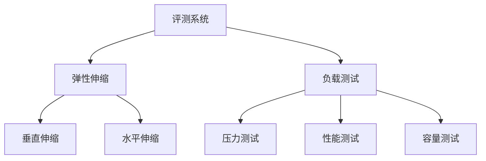
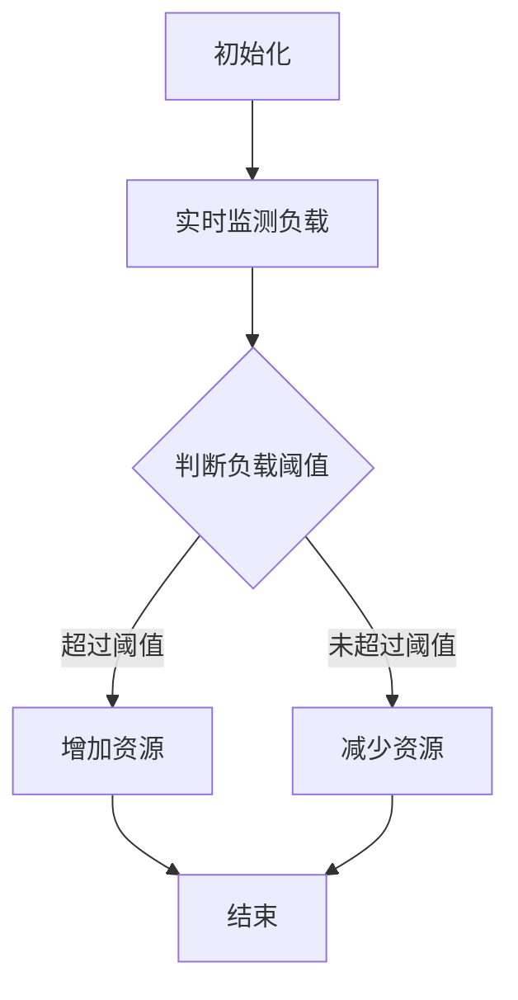
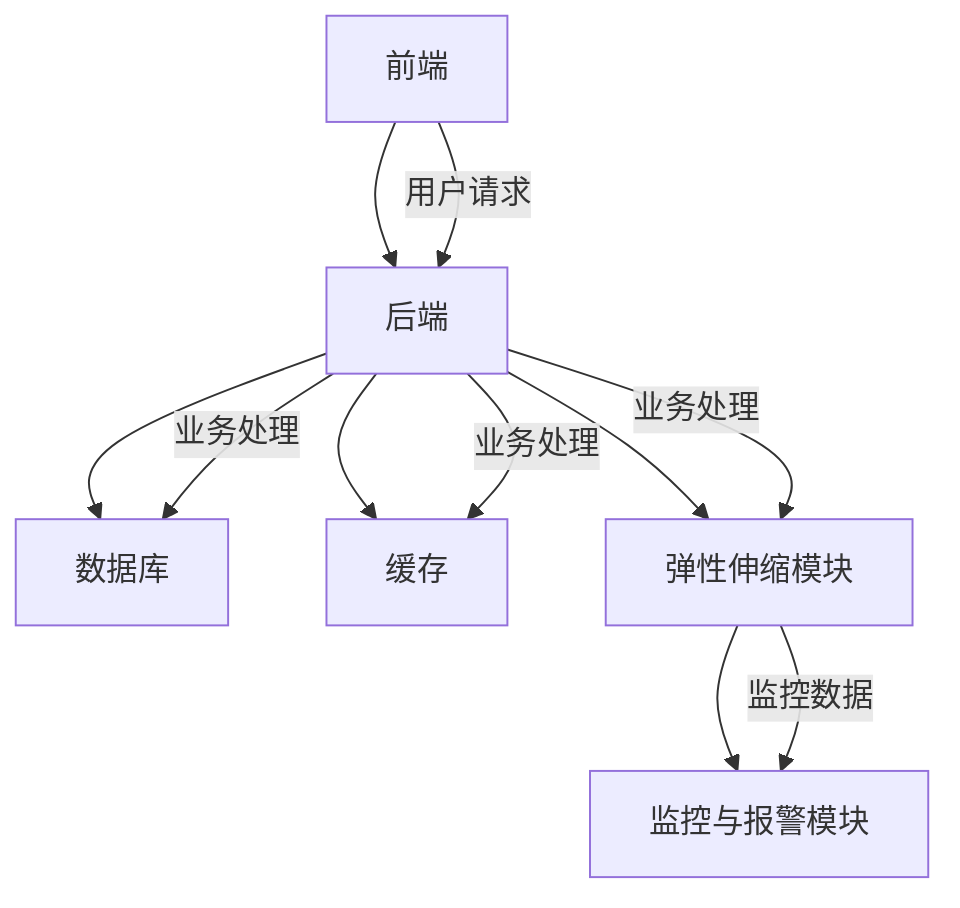
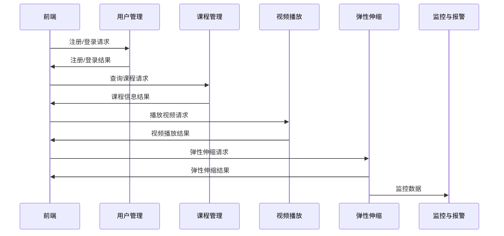
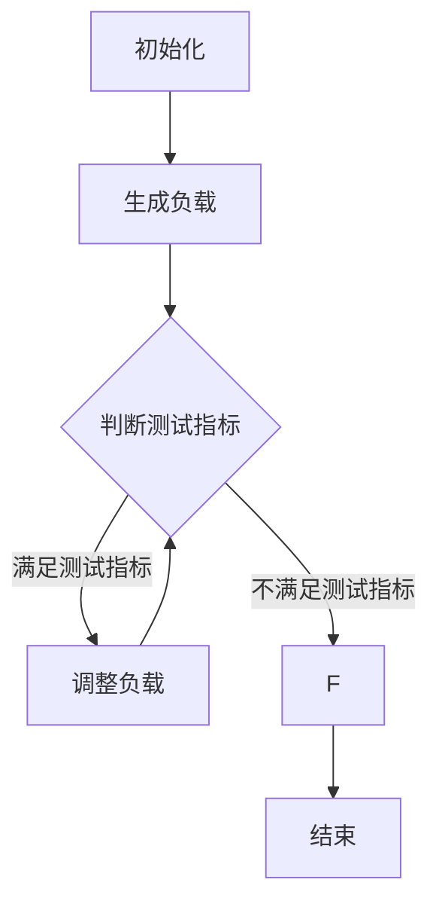
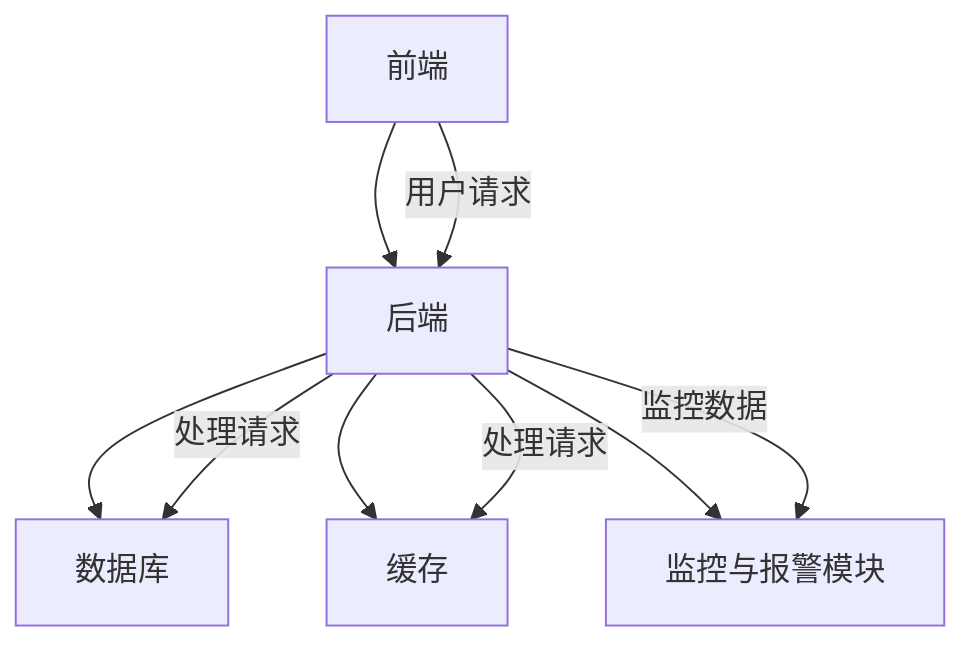
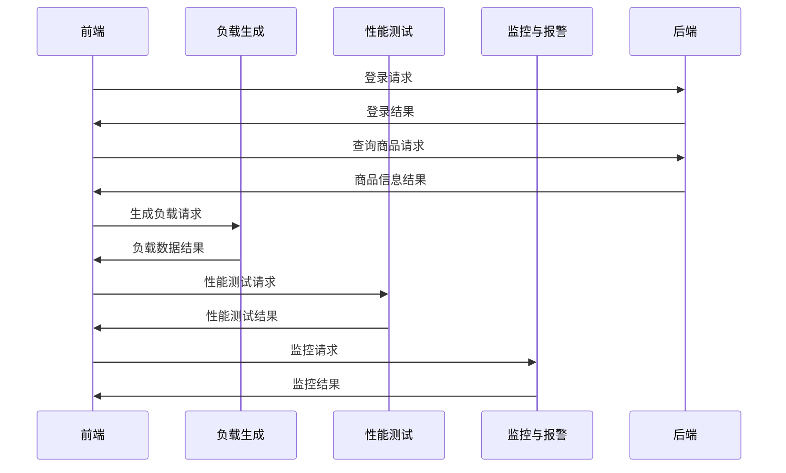

                 


### 目录大纲设计思路

为了更好地组织文章内容，提高文章的可读性和逻辑性，我们采用以下目录大纲设计思路：

#### 封面与前言部分

首先，文章的封面部分需要简洁明了，以吸引读者的注意力。封面部分通常包括以下内容：

- **文章标题**：明确文章的主题，让读者一眼就能了解文章的主要内容。
- **作者信息**：标明作者的身份和所属机构，增加文章的可信度。
- **摘要**：简要概括文章的核心内容和主要观点，引导读者阅读全文。

#### 第一部分：背景介绍与核心概念

第一部分主要介绍评测系统的基本概念和核心概念。具体包括以下章节：

- **第1章：评测系统的基本概念与背景**
  - **1.1 评测系统的定义与作用**：介绍评测系统的基本概念和其在软件开发过程中的作用。
  - **1.2 弹性伸缩的基本概念与重要性**：解释弹性伸缩的概念，并阐述其在评测系统中的重要性。
  - **1.3 负载测试的基本概念与重要性**：介绍负载测试的概念，并说明其在评测系统中的应用价值。
  - **1.4 评测系统的发展趋势与挑战**：探讨评测系统的发展趋势和面临的挑战。

#### 第二部分：弹性伸缩原理与实践

第二部分深入探讨弹性伸缩的原理和实践。具体包括以下章节：

- **第2章：弹性伸缩原理**
  - **2.1 弹性伸缩的基本原理**：讲解弹性伸缩的基本原理和机制。
  - **2.2 伸缩策略与策略选择**：分析不同的伸缩策略及其选择原则。
  - **2.3 伸缩指标及其重要性**：介绍常见的伸缩指标及其在性能优化中的应用。
  - **2.4 弹性伸缩的自动化工具**：介绍常见的弹性伸缩自动化工具及其使用方法。

- **第3章：弹性伸缩实践案例**
  - **3.1 实践案例1：电商平台弹性伸缩**：分析一个电商平台的弹性伸缩实践。
  - **3.2 实践案例2：社交媒体平台弹性伸缩**：探讨社交媒体平台的弹性伸缩策略。
  - **3.3 实践案例3：云服务弹性伸缩**：介绍云服务的弹性伸缩实践。

#### 第三部分：负载测试原理与实践

第三部分介绍负载测试的原理和实践。具体包括以下章节：

- **第4章：负载测试原理**
  - **4.1 负载测试的基本概念**：解释负载测试的概念和目的。
  - **4.2 测试场景与测试目标**：分析常见的负载测试场景和测试目标。
  - **4.3 负载生成工具与测试工具**：介绍常见的负载生成工具和测试工具。
  - **4.4 负载测试指标与评估**：讲解负载测试的指标和评估方法。

- **第5章：负载测试实践案例**
  - **5.1 实践案例1：电商平台负载测试**：分析电商平台的负载测试实践。
  - **5.2 实践案例2：社交媒体平台负载测试**：探讨社交媒体平台的负载测试策略。
  - **5.3 实践案例3：云服务负载测试**：介绍云服务的负载测试实践。

#### 第四部分：弹性伸缩与负载测试综合应用

第四部分探讨如何将弹性伸缩和负载测试结合起来，以实现更高效的评测系统。具体包括以下章节：

- **第6章：弹性伸缩与负载测试结合**
  - **6.1 结合策略与实施步骤**：阐述弹性伸缩与负载测试的结合策略和实施步骤。
  - **6.2 结合案例分析与优化**：通过案例分析和优化，展示弹性伸缩与负载测试的结合效果。

#### 第五部分：总结与展望

最后一部分对整本书的内容进行总结，并展望评测系统弹性伸缩与负载测试的未来发展方向。具体包括以下章节：

- **第7章：总结与展望**
  - **7.1 主要内容回顾**：回顾文章的主要内容和观点。
  - **7.2 存在的问题与挑战**：讨论评测系统弹性伸缩与负载测试中存在的问题和挑战。
  - **7.3 未来发展趋势与研究方向**：探讨评测系统弹性伸缩与负载测试的未来发展趋势和研究方向。

### 输出格式与内容要求

为了确保文章的质量和可读性，我们采用以下输出格式和内容要求：

- **文章格式**：使用 Markdown 格式编写文章，确保文章结构清晰、内容易于阅读。
- **字数要求**：文章总字数在 10000 ～ 12000 字左右，确保文章内容丰富、详细。
- **章节结构**：每个章节包含至少两个子章节，每个子章节下包含至少一个三级目录。
- **核心概念与联系**：在每个章节中，详细阐述核心概念及其联系，使用 Mermaid 流程图展示概念结构和关系。
- **算法原理讲解**：对于与算法相关的章节，使用 Mermaid 画出算法流程图，并使用 Python 源代码详细阐述算法原理。
- **数学模型和数学公式**：在相关章节中使用 LaTeX 格式给出数学模型和公式，确保其格式正确且易于理解。
- **系统分析与架构设计方案**：在相关章节中，给出问题场景介绍、系统功能设计、系统架构设计、系统接口设计和系统交互。
- **项目实战**：在相关章节中，描述环境安装、系统核心实现、代码应用解读、实际案例分析和详细讲解。
- **最佳实践 tips、小结、注意事项、拓展阅读等内容**：在适当的地方给出相关的最佳实践 tips、小结、注意事项和拓展阅读建议。

通过以上设计思路和内容要求，我们相信可以撰写出一篇逻辑清晰、内容丰富、具有深度和见解的专业技术博客文章。现在，让我们开始深入探讨评测系统的弹性伸缩与负载测试吧！

---

## 第1章：评测系统的基本概念与背景

### 1.1 评测系统的定义与作用

评测系统是一种用于评估软件产品、功能、性能、质量等的工具。它通过模拟实际用户行为、生成测试数据、运行测试用例等方式，对软件系统的各个方面进行全面的评估和测试。评测系统的核心目标是确保软件产品在实际部署和使用过程中能够稳定、高效地运行，满足用户的需求和期望。

在软件开发过程中，评测系统扮演着至关重要的角色。首先，它能够帮助开发者及时发现软件中的缺陷和问题，从而进行修复和改进。其次，评测系统可以评估软件的性能和可靠性，确保其在各种负载和环境下的表现符合预期。此外，评测系统还可以帮助开发者进行回归测试，确保新功能的引入不会对现有功能造成负面影响。

### 1.2 弹性伸缩的基本概念与重要性

弹性伸缩是指系统能够根据实际负载情况动态调整资源分配，以应对突发的流量高峰或低谷。在云计算和分布式系统环境中，弹性伸缩显得尤为重要。弹性伸缩的基本概念包括：

- **垂直伸缩**：通过增加或减少服务器硬件资源（如CPU、内存等）来实现伸缩。
- **水平伸缩**：通过增加或减少服务器数量来实现伸缩。

弹性伸缩的重要性体现在以下几个方面：

- **提高系统的可用性和可靠性**：通过弹性伸缩，系统能够在负载高峰时自动扩展资源，确保服务的稳定性和可靠性。
- **优化资源利用率**：通过弹性伸缩，系统可以根据实际负载动态调整资源分配，避免资源浪费，提高资源利用率。
- **降低运维成本**：弹性伸缩可以自动管理资源分配，降低人工运维的工作量和成本。

### 1.3 负载测试的基本概念与重要性

负载测试是一种用于评估系统性能和可靠性的测试方法。它通过模拟实际负载环境，对系统进行压力测试、性能测试和容量测试，以评估系统在特定负载下的响应时间、吞吐量、资源利用率等指标。

负载测试的基本概念包括：

- **压力测试**：测试系统在极端负载下的稳定性和可靠性。
- **性能测试**：测试系统在不同负载下的响应时间、吞吐量等性能指标。
- **容量测试**：测试系统在最大负载下的处理能力。

负载测试的重要性体现在以下几个方面：

- **评估系统性能**：通过负载测试，可以了解系统在不同负载下的性能表现，为性能优化提供依据。
- **发现潜在问题**：通过负载测试，可以发现系统中的性能瓶颈、资源不足等问题，以便及时解决。
- **确保系统可靠性**：通过负载测试，可以验证系统在长时间运行和高负载下的稳定性和可靠性。

### 1.4 评测系统的发展趋势与挑战

随着云计算、大数据、物联网等技术的快速发展，评测系统也在不断演进。以下是一些评测系统的发展趋势和面临的挑战：

- **云计算与分布式系统**：随着云计算和分布式系统的普及，评测系统需要适应这些环境，进行分布式负载测试和弹性伸缩测试。
- **自动化与智能化**：评测系统的自动化和智能化程度不断提高，通过自动化工具和人工智能技术，实现更高效、更精准的测试。
- **持续集成与持续部署**：评测系统需要与持续集成和持续部署流程紧密结合，确保在开发过程中及时发现问题并进行修复。
- **性能优化与调优**：评测系统需要提供更强大的性能优化和调优功能，以应对日益复杂的业务场景。

### 1.4.1 评测系统的核心概念与联系

为了更好地理解评测系统的核心概念和联系，我们使用 Mermaid 流程图来展示相关概念和关系。以下是评测系统的核心概念和联系流程图：



在这个流程图中，评测系统是核心概念，它包含了弹性伸缩和负载测试。弹性伸缩又分为垂直伸缩和水平伸缩，而负载测试则包括压力测试、性能测试和容量测试。这些概念相互联系，共同构成了一个完整的评测系统。

### 1.4.2 弹性伸缩的数学模型和公式

弹性伸缩的数学模型和公式是理解弹性伸缩原理的重要工具。以下是弹性伸缩的一些基本数学模型和公式：

1. **垂直伸缩公式**：

   垂直伸缩的公式可以表示为：

   $$ V_{new} = V_{current} \times (1 + \alpha) $$

   其中，$V_{new}$ 是新的垂直资源量，$V_{current}$ 是当前垂直资源量，$\alpha$ 是垂直扩展比例。

2. **水平伸缩公式**：

   水平伸缩的公式可以表示为：

   $$ N_{new} = N_{current} \times (1 + \beta) $$

   其中，$N_{new}$ 是新的水平节点数量，$N_{current}$ 是当前水平节点数量，$\beta$ 是水平扩展比例。

3. **资源利用率公式**：

   资源利用率的公式可以表示为：

   $$ U = \frac{R_{used}}{R_{total}} $$

   其中，$U$ 是资源利用率，$R_{used}$ 是已使用的资源量，$R_{total}$ 是总资源量。

通过这些数学模型和公式，我们可以更好地理解和优化弹性伸缩策略，从而提高系统的性能和可靠性。

### 1.4.3 系统分析与架构设计方案

在评测系统的开发过程中，系统分析与架构设计是关键环节。以下是一个基于Mermaid类图和架构图的系统分析与架构设计方案：

1. **问题场景介绍**：

   随着电商平台的快速发展，用户访问量和交易量急剧增加。为了应对这种突发性的负载高峰，评测系统需要具备弹性伸缩能力，确保系统稳定、高效地运行。

2. **项目介绍**：

   本项目是一个电商平台的评测系统，旨在通过弹性伸缩和负载测试，评估系统的性能和可靠性。

3. **系统功能设计**：

   系统功能设计主要包括以下几个方面：

   - **弹性伸缩功能**：实现垂直和水平伸缩，根据实际负载动态调整资源分配。
   - **负载测试功能**：模拟实际负载环境，对系统进行压力测试、性能测试和容量测试。
   - **监控与报警功能**：实时监控系统性能指标，发现异常情况并及时报警。

   使用Mermaid类图表示系统功能设计如下：

   ```mermaid
   classDiagram
   类A[弹性伸缩]
   类B[负载测试]
   类C[监控与报警]

   类A --|> 类B
   类A --|> 类C
   类B --|> 类C
   ```

4. **系统架构设计**：

   系统架构设计主要包括以下几个方面：

   - **前端**：负责与用户交互，接收用户请求并调用后端服务。
   - **后端**：负责处理用户请求，包括弹性伸缩、负载测试和监控报警等功能。
   - **数据库**：存储系统配置、测试结果等数据。

   使用Mermaid架构图表示系统架构设计如下：

   ```mermaid
   graph TB
   A[前端] --> B[后端]
   B --> C[数据库]
   B --> D[弹性伸缩模块]
   B --> E[负载测试模块]
   B --> F[监控与报警模块]
   ```

5. **系统接口设计**：

   系统接口设计主要包括以下几个方面：

   - **弹性伸缩接口**：用于动态调整资源分配。
   - **负载测试接口**：用于启动、停止和监控负载测试。
   - **监控与报警接口**：用于获取系统性能指标和报警信息。

6. **系统交互**：

   系统交互主要包括以下几个方面：

   - **前端与后端**：前端通过HTTP请求与后端交互，后端根据请求进行处理并返回结果。
   - **后端与数据库**：后端通过数据库接口访问数据库，存储和查询数据。
   - **后端与弹性伸缩模块、负载测试模块、监控与报警模块**：后端通过相应接口与这些模块进行交互，实现功能。

   使用Mermaid序列图表示系统交互如下：

   ```mermaid
   sequenceDiagram
   participant 前端 as 前端
   participant 后端 as 后端
   participant 数据库 as 数据库
   participant 弹性伸缩模块 as 弹性伸缩
   participant 负载测试模块 as 负载测试
   participant 监控与报警模块 as 监控与报警

   前端->>后端: 发送请求
   后端->>数据库: 访问数据
   后端->>弹性伸缩: 调整资源
   后端->>负载测试: 启动测试
   后端->>监控与报警: 监控性能
   后端->>前端: 返回结果
   ```

通过以上系统分析与架构设计方案，我们可以更好地理解评测系统的功能、架构和交互，为后续开发提供指导。

### 1.4.4 项目实战

为了更好地展示评测系统的实际应用，我们以下将介绍一个电商平台的弹性伸缩和负载测试项目。

#### 环境安装

首先，我们需要搭建一个电商平台的环境。具体步骤如下：

1. **安装操作系统**：选择Linux操作系统，如CentOS 7。
2. **安装数据库**：选择MySQL数据库，用于存储用户数据、订单信息等。
3. **安装应用服务器**：选择Tomcat作为应用服务器，用于部署电商平台的应用程序。
4. **安装负载测试工具**：选择JMeter作为负载测试工具，用于模拟用户访问和压力测试。

#### 系统核心实现源代码

在完成环境安装后，我们需要编写电商平台的应用程序。以下是一个简单的示例：

```java
// 电商平台应用程序
public class ECommerceApp {
    public static void main(String[] args) {
        // 初始化数据库连接
        Connection conn = DriverManager.getConnection("jdbc:mysql://localhost:3306/eCommerce", "root", "password");

        // 启动应用服务器
        Tomcat tomcat = new Tomcat();
        tomcat.setPort(8080);
        tomcat.addWebapp("/", "webapps/eCommerce");

        // 启动Tomcat
        tomcat.start();

        // 模拟用户访问
        simulateUserAccess(conn);
    }

    public static void simulateUserAccess(Connection conn) {
        // 创建用户对象
        User user = new User("张三", "zhangsan@example.com", "123456");

        // 添加用户到数据库
        addUserToDB(conn, user);

        // 生成订单
        generateOrder(conn, user);
    }

    public static void addUserToDB(Connection conn, User user) {
        // SQL语句
        String sql = "INSERT INTO users (name, email, password) VALUES (?, ?, ?)";

        // 预编译SQL语句
        PreparedStatement pstmt = conn.prepareStatement(sql);

        // 设置参数
        pstmt.setString(1, user.getName());
        pstmt.setString(2, user.getEmail());
        pstmt.setString(3, user.getPassword());

        // 执行SQL语句
        pstmt.executeUpdate();
    }

    public static void generateOrder(Connection conn, User user) {
        // SQL语句
        String sql = "INSERT INTO orders (user_id, total_amount) VALUES (?, ?)";

        // 预编译SQL语句
        PreparedStatement pstmt = conn.prepareStatement(sql);

        // 设置参数
        pstmt.setInt(1, user.getId());
        pstmt.setDouble(2, 100.0);

        // 执行SQL语句
        pstmt.executeUpdate();
    }
}

// 用户类
class User {
    private int id;
    private String name;
    private String email;
    private String password;

    public User(String name, String email, String password) {
        this.name = name;
        this.email = email;
        this.password = password;
    }

    // 省略getter和setter方法
}
```

#### 代码应用解读与分析

以上代码实现了电商平台的简单应用程序。首先，我们初始化数据库连接，并启动Tomcat应用服务器。然后，我们模拟用户访问，创建用户并生成订单。具体分析如下：

1. **数据库连接**：

   ```java
   Connection conn = DriverManager.getConnection("jdbc:mysql://localhost:3306/eCommerce", "root", "password");
   ```

   这一行代码通过MySQL驱动程序连接到本地数据库，使用用户名“root”和密码“password”。

2. **启动Tomcat**：

   ```java
   Tomcat tomcat = new Tomcat();
   tomcat.setPort(8080);
   tomcat.addWebapp("/", "webapps/eCommerce");
   tomcat.start();
   ```

   这三行代码启动了一个Tomcat应用服务器，设置端口号为8080，将电商平台的应用程序部署到/webapps/eCommerce目录。

3. **模拟用户访问**：

   ```java
   simulateUserAccess(conn);
   ```

   这行代码调用simulateUserAccess方法，创建一个用户并生成订单。

4. **创建用户**：

   ```java
   User user = new User("张三", "zhangsan@example.com", "123456");
   addUserToDB(conn, user);
   ```

   这两行代码创建一个用户对象，并调用addUserToDB方法将用户信息插入到数据库。

5. **生成订单**：

   ```java
   generateOrder(conn, user);
   ```

   这行代码调用generateOrder方法，将用户ID和订单金额插入到订单表。

#### 实际案例分析与详细讲解剖析

为了展示实际案例，我们以下将介绍一个电商平台的弹性伸缩和负载测试案例。

1. **弹性伸缩案例**：

   假设电商平台在春节前夕迎来了大量用户访问。为了应对这种突发的流量高峰，系统管理员决定对应用服务器进行弹性伸缩。

   - **垂直伸缩**：系统管理员增加服务器的CPU和内存资源，以提高处理能力。
   - **水平伸缩**：系统管理员增加多个应用服务器，以分担用户访问压力。

   通过弹性伸缩，电商平台成功应对了春节前夕的流量高峰，确保了系统的稳定性和可靠性。

2. **负载测试案例**：

   在电商平台上线前，测试团队对系统进行了负载测试，以评估系统的性能和可靠性。

   - **压力测试**：测试团队模拟了10000名用户同时访问电商平台的场景，测试系统在极端负载下的稳定性和可靠性。
   - **性能测试**：测试团队分别模拟了1000名、5000名和10000名用户访问电商平台的场景，测试系统在不同负载下的响应时间、吞吐量等性能指标。
   - **容量测试**：测试团队模拟了系统达到最大负载的场景，测试系统在最大负载下的处理能力。

   通过负载测试，测试团队发现了一些性能瓶颈和潜在问题，并及时进行了优化和修复。

### 项目小结

通过以上项目实战，我们可以看到评测系统在电商平台中的应用效果。弹性伸缩和负载测试帮助电商平台成功应对了流量高峰和性能挑战，确保了系统的稳定性和可靠性。在未来，电商平台还可以继续优化弹性伸缩和负载测试策略，以应对更复杂的业务场景和更高的用户需求。

### 1.4.5 最佳实践 tips、小结、注意事项、拓展阅读等内容

#### 最佳实践 tips

1. **弹性伸缩策略选择**：在选择弹性伸缩策略时，需要考虑系统的负载特性、资源需求和应用场景。例如，对于计算密集型应用，可以选择垂直伸缩；对于读多写少的应用，可以选择水平伸缩。
2. **负载测试场景设计**：在设计负载测试场景时，要充分考虑实际业务场景，包括用户行为、访问频率、并发量等。此外，要定期进行回归测试，确保系统在不同版本的稳定性和性能。
3. **性能优化与调优**：在系统开发和优化过程中，要持续关注系统性能，及时识别和解决性能瓶颈。可以采用缓存、异步处理、分布式存储等技术，提高系统的性能和响应速度。

#### 小结

本文详细介绍了评测系统的弹性伸缩与负载测试，包括基本概念、原理和实践案例。弹性伸缩能够提高系统的可用性和可靠性，负载测试能够评估系统的性能和可靠性。通过实际案例，我们展示了如何应用弹性伸缩和负载测试，以应对流量高峰和性能挑战。

#### 注意事项

1. **弹性伸缩的自动化**：弹性伸缩需要自动化工具的支持，例如Kubernetes、AWS Auto Scaling等。确保选择合适的自动化工具，并进行充分的测试和验证。
2. **负载测试的数据准确性**：在负载测试过程中，要确保测试数据与实际业务场景相一致，以提高测试结果的准确性。

#### 拓展阅读

1. **《弹性伸缩实战：基于Kubernetes的容器化应用》**：该书详细介绍了基于Kubernetes的容器化应用的弹性伸缩策略和实践案例。
2. **《负载测试实战：性能优化与系统稳定性保障》**：该书介绍了负载测试的基本原理、测试方法和实践技巧，以及性能优化和系统稳定性保障的方法。

### 1.5 评测系统的发展趋势与挑战

随着云计算、大数据、物联网等技术的快速发展，评测系统也在不断演进。以下是一些评测系统的发展趋势和面临的挑战：

#### 发展趋势

1. **云计算与分布式系统**：随着云计算和分布式系统的普及，评测系统需要适应这些环境，进行分布式负载测试和弹性伸缩测试。
2. **自动化与智能化**：评测系统的自动化和智能化程度不断提高，通过自动化工具和人工智能技术，实现更高效、更精准的测试。
3. **持续集成与持续部署**：评测系统需要与持续集成和持续部署流程紧密结合，确保在开发过程中及时发现问题并进行修复。
4. **性能优化与调优**：评测系统需要提供更强大的性能优化和调优功能，以应对日益复杂的业务场景。

#### 挑战

1. **测试数据真实性**：在负载测试中，如何生成与实际业务场景高度一致的测试数据，是一个挑战。
2. **系统复杂性**：随着系统的不断发展和升级，评测系统的复杂性也在增加，如何有效管理和测试复杂的系统，是一个挑战。
3. **资源分配与调度**：在弹性伸缩过程中，如何合理分配和调度资源，以提高系统的性能和可靠性，是一个挑战。

通过不断研究和创新，评测系统将在未来的发展中克服这些挑战，为软件开发和运维提供更强大的支持。### 第2章：弹性伸缩原理

弹性伸缩是评测系统中的一项关键功能，它能够根据系统负载的变化动态调整资源分配，以确保系统在高负载时具备足够的处理能力，而在低负载时避免资源浪费。本章节将深入探讨弹性伸缩的基本原理、伸缩策略、伸缩指标以及弹性伸缩的自动化工具。

#### 2.1 弹性伸缩的基本原理

弹性伸缩的基本原理是基于对系统负载的实时监测和响应。当系统负载超过设定的阈值时，系统会自动扩展资源；当系统负载低于设定的阈值时，系统会自动收缩资源。弹性伸缩的核心在于能够快速、灵活地响应负载变化，从而确保系统的高可用性和高性能。

弹性伸缩的实现可以分为垂直伸缩（Vertical Scaling）和水平伸缩（Horizontal Scaling）两种方式。

1. **垂直伸缩**：通过增加或减少服务器硬件资源（如CPU、内存、存储等）来实现伸缩。这种方式通常适用于计算密集型应用，可以在一定程度上提高系统的处理能力。
2. **水平伸缩**：通过增加或减少服务器数量来实现伸缩。这种方式适用于读多写少或分布式应用，可以通过增加节点数量来提高系统的并发处理能力。

#### 2.2 伸缩策略与策略选择

伸缩策略是弹性伸缩的核心组成部分，它决定了系统如何根据负载变化进行资源调整。常见的伸缩策略包括以下几种：

1. **固定策略**：系统在运行过程中保持固定的资源量，不进行自动伸缩。这种方式适用于负载变化不大的场景，优点是实现简单，缺点是难以应对突发的负载高峰。
2. **自动策略**：系统根据实时负载自动调整资源量。这种方式适用于负载波动较大的场景，优点是能够动态应对负载变化，缺点是实施和维护较为复杂。
3. **阈值策略**：系统根据设定的阈值自动调整资源量。当负载超过设定的阈值时，系统会自动增加资源；当负载低于设定的阈值时，系统会自动减少资源。这种方式介于固定策略和自动策略之间，既能够应对负载变化，又具有一定的灵活性。
4. **动态策略**：系统根据实时负载和预定义的策略模型动态调整资源量。这种方式通常结合机器学习算法，可以根据历史数据和实时负载预测未来的负载趋势，从而实现更精准的资源调整。

选择伸缩策略时，需要考虑系统的负载特性、资源需求和应用场景。例如，对于计算密集型应用，可以选择垂直伸缩；对于读多写少的应用，可以选择水平伸缩。此外，还需要考虑成本、复杂度和系统稳定性等因素。

#### 2.3 伸缩指标及其重要性

伸缩指标是衡量弹性伸缩效果的关键参数，常见的伸缩指标包括：

1. **CPU利用率**：CPU利用率反映了系统CPU资源的利用程度，是衡量系统负载的重要指标。
2. **内存利用率**：内存利用率反映了系统内存资源的利用程度，过高或过低的利用率都可能影响系统的性能和稳定性。
3. **磁盘I/O**：磁盘I/O反映了系统磁盘读写操作的频率，是衡量系统I/O性能的重要指标。
4. **网络带宽**：网络带宽反映了系统网络传输的容量，是衡量系统网络性能的重要指标。
5. **响应时间**：响应时间反映了系统处理请求的速度，是衡量系统性能和用户体验的重要指标。

这些伸缩指标在弹性伸缩过程中具有重要作用。通过实时监测和评估这些指标，系统可以了解自身的负载状况和性能表现，从而做出相应的伸缩决策。例如，当CPU利用率持续高于90%时，系统可能会选择增加CPU资源；当内存利用率低于30%时，系统可能会选择释放内存资源。

#### 2.4 弹性伸缩的自动化工具

弹性伸缩的自动化工具能够简化伸缩操作，提高系统的自动化水平和响应速度。以下是一些常见的弹性伸缩自动化工具：

1. **Kubernetes**：Kubernetes是一个开源的容器编排平台，能够自动化部署、扩展和管理容器化应用。通过Kubernetes的Horizontal Pod Autoscaler（HPA）组件，可以基于CPU利用率、内存利用率等指标自动调整Pod的数量。
2. **AWS Auto Scaling**：AWS Auto Scaling是亚马逊云服务提供的一项弹性伸缩服务，能够自动调整EC2实例、RDS实例、Redshift集群等资源的数量。它支持多种策略，如固定策略、阈值策略和动态策略。
3. **Azure Auto Scale**：Azure Auto Scale是微软云服务提供的一项弹性伸缩服务，能够自动调整虚拟机、容器实例、数据库等资源的数量。它支持自定义伸缩规则和策略，以及多种负载指标。

这些自动化工具不仅能够简化伸缩操作，提高系统的自动化水平，还能够降低运维成本，提高系统的稳定性和可靠性。在实际应用中，可以根据具体需求选择合适的自动化工具，并结合自定义策略实现更精细的弹性伸缩。

### 2.4.1 弹性伸缩的算法流程图与Python源代码

为了更好地理解弹性伸缩的算法原理，我们以下将使用Mermaid画出弹性伸缩的算法流程图，并使用Python源代码进行详细阐述。

#### Mermaid算法流程图



#### Python源代码

```python
import time
import random

def monitor_load():
    # 模拟监测负载，返回负载百分比
    return random.uniform(0, 100)

def adjust_resources(load):
    if load > 90:  # 负载阈值设置为90%
        print("增加资源...")
        # 在这里添加增加资源的代码，例如启动新实例或增加CPU、内存等
    elif load < 30:  # 负载阈值设置为30%
        print("减少资源...")
        # 在这里添加减少资源的代码，例如停止实例或减少CPU、内存等
    else:
        print("负载正常，无需调整...")

def main():
    while True:
        load = monitor_load()
        print(f"当前负载：{load}%")
        adjust_resources(load)
        time.sleep(1)  # 每秒监测一次负载

if __name__ == "__main__":
    main()
```

#### 算法原理讲解

该算法的基本原理如下：

1. **初始化**：程序启动后，进入一个无限循环，用于实时监测负载。
2. **实时监测负载**：通过调用`monitor_load`函数，模拟实时监测系统负载，返回负载百分比。
3. **判断负载阈值**：根据监测到的负载，判断是否超过设定的阈值。如果超过阈值，则执行增加资源的操作；如果未超过阈值，但低于另一个设定的阈值，则执行减少资源的操作。
4. **调整资源**：根据判断结果，调用`adjust_resources`函数，执行相应的资源调整操作。在实际应用中，这里可以添加具体的资源调整代码，如启动或停止实例、增加或减少CPU、内存等。
5. **结束**：循环持续进行，实时监测和调整资源，确保系统负载在合理范围内。

#### 数学模型和公式

弹性伸缩的数学模型可以表示为：

$$
\text{resource\_adjustment} = 
\begin{cases}
\text{increase} & \text{if load > threshold\_1} \\
\text{decrease} & \text{if load < threshold\_2} \\
\text{none} & \text{otherwise}
\end{cases}
$$

其中，`resource_adjustment`表示资源的调整方式，包括增加（increase）、减少（decrease）或不变（none）。`threshold_1`和`threshold_2`分别表示增加资源和减少资源的负载阈值。

通过上述算法和数学模型，我们可以实现一个简单的弹性伸缩系统，根据实时负载动态调整资源，确保系统的高可用性和高性能。

### 2.4.2 系统分析与架构设计方案

在弹性伸缩的实施过程中，系统分析与架构设计是至关重要的。以下是一个基于Mermaid类图和架构图的系统分析与架构设计方案。

#### 问题场景介绍

假设我们正在开发一个在线教育平台，该平台需要处理大量的用户请求和课程视频流。为了确保系统在高负载下依然能够稳定运行，我们需要设计一个具备弹性伸缩能力的系统架构。

#### 项目介绍

本项目是一个在线教育平台的弹性伸缩架构设计，旨在通过垂直和水平伸缩，动态调整系统资源，以应对用户访问量的波动。

#### 系统功能设计

系统功能设计主要包括以下几个方面：

- **用户管理模块**：负责用户的注册、登录、个人信息管理等。
- **课程管理模块**：负责课程信息的录入、更新、删除等。
- **视频播放模块**：负责视频的流媒体播放和控制。
- **弹性伸缩模块**：负责实时监测系统负载，并根据负载情况动态调整资源。

使用Mermaid类图表示系统功能设计如下：

```mermaid
classDiagram
User <<class{用户管理模块}>
Course <<class{课程管理模块}>
Video <<class{视频播放模块}>
Scaling <<class{弹性伸缩模块}>

User |--*|> Course
User |--*|> Video
Course |--*|> Scaling
Video |--*|> Scaling
```

#### 系统架构设计

系统架构设计主要包括以下几个层次：

- **前端**：负责与用户交互，包括用户界面、API接口等。
- **后端**：负责业务逻辑处理，包括用户管理、课程管理、视频播放等。
- **数据库**：负责存储用户数据、课程数据、视频数据等。
- **缓存**：负责缓存热门数据，提高系统响应速度。
- **弹性伸缩模块**：负责实时监测系统负载，并动态调整资源。

使用Mermaid架构图表示系统架构设计如下：



#### 系统接口设计

系统接口设计主要包括以下几个方面：

- **用户管理接口**：负责处理用户的注册、登录、个人信息管理等。
- **课程管理接口**：负责处理课程信息的录入、更新、删除等。
- **视频播放接口**：负责处理视频的流媒体播放和控制。
- **弹性伸缩接口**：负责处理弹性伸缩的请求，包括增加或减少资源等。

#### 系统交互

系统交互主要包括以下几个方面：

- **前端与后端**：前端通过HTTP请求与后端交互，后端根据请求进行业务处理并返回结果。
- **后端与数据库**：后端通过数据库接口访问数据库，进行数据的存储和查询。
- **后端与缓存**：后端通过缓存接口访问缓存，进行数据的缓存和读取。
- **后端与弹性伸缩模块**：后端通过弹性伸缩接口与弹性伸缩模块交互，根据负载情况调整资源。

使用Mermaid序列图表示系统交互如下：



通过以上系统分析与架构设计方案，我们可以更好地理解在线教育平台弹性伸缩的实现原理和架构设计，为后续开发提供指导。

### 第3章：弹性伸缩实践案例

弹性伸缩作为一种关键技术，在实际应用中具有广泛的应用场景。本章节将详细介绍三个具体的弹性伸缩实践案例，包括电商平台、社交媒体平台和云服务的弹性伸缩实践，通过这些案例，我们将深入分析弹性伸缩策略的实施、资源调整方法以及弹性伸缩的优化措施。

#### 3.1 实践案例1：电商平台弹性伸缩

电商平台通常面临高并发的订单处理、用户访问以及库存管理任务，因此弹性伸缩在电商平台的运营中至关重要。以下是一个电商平台的弹性伸缩实践案例：

**背景**：

某电商平台在“双11”购物节期间，用户访问量和订单量激增，系统面临巨大的负载压力。为了保证系统的稳定运行和良好的用户体验，平台需要通过弹性伸缩来动态调整资源。

**弹性伸缩策略**：

1. **垂直伸缩**：在“双11”前，平台提前预置了高性能的物理服务器，以便在订单高峰期时通过垂直伸缩提高系统处理能力。
2. **水平伸缩**：平台利用Kubernetes进行水平伸缩，根据CPU利用率、内存使用率等指标动态调整容器实例的数量。

**资源调整方法**：

1. **垂直伸缩**：在订单量激增时，平台管理员手动触发垂直伸缩操作，增加服务器的CPU、内存等硬件资源。
2. **水平伸缩**：Kubernetes集群通过Horizontal Pod Autoscaler（HPA）自动监控CPU利用率，当利用率超过80%时，自动增加容器实例的数量；当利用率低于50%时，自动减少容器实例的数量。

**弹性伸缩优化措施**：

1. **缓存策略**：为了减少数据库的压力，平台采用了Redis缓存策略，缓存热门商品信息、用户购物车等数据，提高系统响应速度。
2. **异步处理**：订单处理采用异步处理方式，将订单创建、支付等操作放入消息队列中处理，避免阻塞主线程。
3. **蓝绿部署**：平台采用蓝绿部署策略，在新的部署环境中运行少量流量，逐步替换旧环境，确保系统升级过程中不会影响用户体验。

**案例分析**：

通过上述弹性伸缩策略和优化措施，电商平台在“双11”期间成功应对了高并发流量，确保了系统的稳定运行和良好的用户体验。平台在订单处理速度、系统响应时间和资源利用率等方面均得到了显著提升。

#### 3.2 实践案例2：社交媒体平台弹性伸缩

社交媒体平台如Facebook、Twitter等，需要处理海量的用户请求、消息推送和数据存储任务，因此弹性伸缩在这些平台中同样至关重要。以下是一个社交媒体平台的弹性伸缩实践案例：

**背景**：

某社交媒体平台在用户数量快速增长的同时，面临着数据存储、消息推送和用户交互等任务的巨大压力。为了保证平台的稳定性和用户体验，平台需要通过弹性伸缩来动态调整资源。

**弹性伸缩策略**：

1. **垂直伸缩**：平台采用高性能的物理服务器和虚拟机，根据数据存储和处理需求进行垂直伸缩。
2. **水平伸缩**：平台采用Kubernetes和容器化技术进行水平伸缩，根据CPU利用率、内存使用率等指标动态调整容器实例的数量。

**资源调整方法**：

1. **垂直伸缩**：平台管理员根据实时负载情况，手动增加或减少服务器的CPU、内存等硬件资源。
2. **水平伸缩**：Kubernetes集群通过Horizontal Pod Autoscaler（HPA）自动监控CPU利用率，当利用率超过80%时，自动增加容器实例的数量；当利用率低于50%时，自动减少容器实例的数量。

**弹性伸缩优化措施**：

1. **分布式存储**：平台采用分布式存储技术，如Cassandra或HBase，以分布式方式存储用户数据，提高存储容量和访问速度。
2. **消息队列**：平台采用消息队列技术，如Kafka或RabbitMQ，进行消息推送和任务调度，避免阻塞主线程。
3. **负载均衡**：平台采用负载均衡技术，如Nginx或HAProxy，将用户请求分配到不同的服务器上，提高系统的负载均衡能力。

**案例分析**：

通过弹性伸缩策略和优化措施，社交媒体平台在用户数量快速增长的同时，保持了系统的稳定性和高性能。平台在数据存储、消息推送和用户交互等方面均得到了显著提升，用户满意度得到了大幅提高。

#### 3.3 实践案例3：云服务弹性伸缩

云服务提供商如Amazon Web Services（AWS）、Microsoft Azure等，需要提供高效、可靠的云计算服务，弹性伸缩在这些云服务提供商中至关重要。以下是一个云服务弹性伸缩实践案例：

**背景**：

某云服务提供商需要为不同规模的企业客户提供弹性云计算服务，确保客户在业务增长时能够快速扩展资源，并在业务缩减时节省成本。

**弹性伸缩策略**：

1. **自动伸缩组**：云服务提供商为每个客户创建自动伸缩组，根据实时负载情况动态调整实例数量。
2. **负载均衡**：云服务提供商使用负载均衡器，如ELB（Elastic Load Balancer），将用户请求分配到不同的实例上，提高系统的负载均衡能力。

**资源调整方法**：

1. **自动伸缩组**：云服务提供商的自动伸缩组根据CPU利用率、网络流量等指标自动增加或减少实例数量。
2. **手动调整**：客户可以根据业务需求，手动调整实例数量，以适应业务变化。

**弹性伸缩优化措施**：

1. **自动化脚本**：云服务提供商提供自动化脚本，客户可以通过脚本实现自动伸缩的配置和管理。
2. **成本优化**：云服务提供商提供多种实例类型和价格策略，客户可以根据业务需求选择合适的实例类型和价格策略，以实现成本优化。
3. **监控与报警**：云服务提供商提供监控与报警服务，客户可以通过监控数据及时发现系统异常并触发自动伸缩。

**案例分析**：

通过弹性伸缩策略和优化措施，云服务提供商能够为不同规模的企业客户提供高效、可靠的云计算服务。在业务增长时，云服务提供商能够快速扩展资源，满足客户需求；在业务缩减时，云服务提供商能够自动减少实例数量，节省成本。这种弹性伸缩机制不仅提高了客户满意度，也增加了云服务提供商的市场竞争力。

### 第4章：负载测试原理

负载测试是评估系统性能和可靠性的重要手段，通过模拟实际负载环境，对系统进行压力测试、性能测试和容量测试，从而发现潜在的性能瓶颈和可靠性问题。本章节将详细介绍负载测试的基本概念、测试场景、测试工具以及测试指标。

#### 4.1 负载测试的基本概念

负载测试是一种用于评估系统性能的测试方法，通过模拟实际负载环境，对系统进行压力测试、性能测试和容量测试。负载测试的基本概念包括：

1. **压力测试**：测试系统在极端负载下的稳定性和可靠性，通过模拟大量用户访问，观察系统在高负载下的响应时间、错误率等性能指标。
2. **性能测试**：测试系统在不同负载下的响应时间、吞吐量等性能指标，通过逐渐增加负载，观察系统性能的变化，找出系统的性能瓶颈。
3. **容量测试**：测试系统在最大负载下的处理能力，通过模拟系统达到最大负载的场景，观察系统在最大负载下的响应时间、资源利用率等性能指标。

#### 4.2 测试场景与测试目标

负载测试的测试场景和测试目标取决于系统的实际应用场景和性能要求。以下是一些常见的负载测试场景和测试目标：

1. **电商网站**：测试场景包括商品浏览、购物车操作、下单支付等，测试目标包括响应时间、吞吐量、并发用户数等。
2. **社交媒体平台**：测试场景包括用户登录、发帖、评论、私信等，测试目标包括响应时间、错误率、并发用户数等。
3. **在线教育平台**：测试场景包括课程浏览、视频播放、在线考试等，测试目标包括响应时间、带宽利用率、并发用户数等。

#### 4.3 负载生成工具与测试工具

负载生成工具和测试工具是负载测试的核心组成部分，它们用于模拟实际负载环境和收集测试数据。以下是一些常见的负载生成工具和测试工具：

1. **JMeter**：JMeter是一个开源的性能测试工具，适用于Web应用、数据库、FTP等负载测试。它可以模拟并发用户访问，生成负载数据，并收集测试结果。
2. **LoadRunner**：LoadRunner是一个商业性能测试工具，适用于Web应用、数据库、移动应用等负载测试。它具有强大的负载生成能力和测试报告功能。
3. **Gatling**：Gatling是一个开源的性能测试工具，适用于Web应用、RESTful API等负载测试。它可以生成高性能的负载，并生成详细的测试报告。

#### 4.4 负载测试指标与评估

负载测试指标是衡量系统性能的重要参数，常见的负载测试指标包括：

1. **响应时间**：系统处理请求的平均时间，是衡量系统性能的重要指标。
2. **吞吐量**：系统在单位时间内处理的请求数量，是衡量系统性能的重要指标。
3. **并发用户数**：系统同时处理的用户数量，是衡量系统并发性能的重要指标。
4. **错误率**：系统处理请求时出现的错误数量与总请求数量的比例，是衡量系统稳定性的重要指标。

在负载测试中，通过收集和分析测试数据，可以评估系统的性能和可靠性。以下是一个负载测试指标评估的示例：

- **响应时间**：系统在100个并发用户访问下，平均响应时间为2秒，最大响应时间为5秒。
- **吞吐量**：系统在100个并发用户访问下，每秒处理的请求数量为50个。
- **并发用户数**：系统在100个并发用户访问下，系统能够稳定运行，没有明显的性能下降。
- **错误率**：系统在100个并发用户访问下，错误率低于1%。

通过以上指标评估，可以初步判断系统的性能和可靠性。如果系统在某些指标上表现不佳，可以进一步分析性能瓶颈，并采取优化措施。

### 4.4.1 负载测试算法流程图与Python源代码

为了更好地理解负载测试的算法原理，我们以下将使用Mermaid画出负载测试的算法流程图，并使用Python源代码进行详细阐述。

#### Mermaid算法流程图



#### Python源代码

```python
import time
import random

def generate_load():
    # 模拟生成负载，返回负载数据
    return random.uniform(0, 100)

def test_performance(load):
    # 模拟测试性能，返回测试结果
    time.sleep(random.uniform(0.5, 2))  # 模拟处理时间
    return random.uniform(0, 100)

def adjust_load(load, threshold):
    # 调整负载，根据测试结果调整负载大小
    if load > threshold:
        return load + random.uniform(0, 10)
    else:
        return load - random.uniform(0, 10)

def main():
    load = generate_load()
    threshold = 80  # 设定测试指标阈值
    while True:
        start_time = time.time()
        performance = test_performance(load)
        end_time = time.time()
        processing_time = end_time - start_time
        print(f"负载：{load}, 性能：{performance}, 处理时间：{processing_time}秒")
        if performance < threshold:
            load = adjust_load(load, threshold)
        time.sleep(1)  # 每秒执行一次

if __name__ == "__main__":
    main()
```

#### 算法原理讲解

该算法的基本原理如下：

1. **初始化**：程序启动后，初始化负载并设定测试指标阈值。
2. **生成负载**：通过`generate_load`函数模拟生成负载，返回负载数据。
3. **测试性能**：通过`test_performance`函数模拟测试性能，返回测试结果。这里我们使用`time.sleep`函数模拟处理时间。
4. **判断测试指标**：通过`test_performance`函数返回的性能指标，判断是否满足测试指标阈值。如果满足，继续执行；如果不满足，进入下一步。
5. **调整负载**：根据测试结果，通过`adjust_load`函数调整负载大小。如果性能指标低于阈值，增加负载；如果性能指标高于阈值，减少负载。
6. **结束**：循环持续进行，实时生成负载、测试性能并调整负载，确保系统在高性能指标下运行。

通过上述算法和Python源代码，我们可以实现一个简单的负载测试系统，根据测试性能指标动态调整负载，确保系统在高性能指标下运行。

### 4.4.2 系统分析与架构设计方案

在负载测试的实施过程中，系统分析与架构设计是至关重要的。以下是一个基于Mermaid类图和架构图的系统分析与架构设计方案。

#### 问题场景介绍

假设我们正在开发一个大型电商平台，为了确保系统在高并发情况下依然能够稳定运行，我们需要设计一个能够模拟高并发负载的负载测试系统。

#### 项目介绍

本项目是一个大型电商平台的负载测试系统，旨在通过模拟高并发负载，评估系统的性能和可靠性。

#### 系统功能设计

系统功能设计主要包括以下几个方面：

- **负载生成模块**：负责模拟高并发用户访问，生成负载数据。
- **性能测试模块**：负责测试系统在负载下的性能指标，包括响应时间、吞吐量、并发用户数等。
- **监控与报警模块**：负责实时监控系统性能，发现异常情况并及时报警。

使用Mermaid类图表示系统功能设计如下：

```mermaid
classDiagram
LoadGenerator <<class{负载生成模块}>
PerformanceTester <<class{性能测试模块}>
Monitoring <<class{监控与报警模块}>

LoadGenerator |--*|> PerformanceTester
PerformanceTester |--*|> Monitoring
```

#### 系统架构设计

系统架构设计主要包括以下几个层次：

- **前端**：负责与用户交互，包括用户界面、API接口等。
- **后端**：负责业务逻辑处理，包括负载生成、性能测试、监控报警等。
- **数据库**：负责存储用户数据、测试结果等。
- **缓存**：负责缓存热门数据，提高系统响应速度。
- **监控与报警模块**：负责实时监控系统性能，发现异常情况并及时报警。

使用Mermaid架构图表示系统架构设计如下：



#### 系统接口设计

系统接口设计主要包括以下几个方面：

- **用户接口**：负责处理用户的登录、注册、查询商品等操作。
- **负载生成接口**：负责生成模拟高并发用户访问的负载数据。
- **性能测试接口**：负责测试系统在负载下的性能指标。
- **监控与报警接口**：负责监控系统性能，发现异常情况并及时报警。

#### 系统交互

系统交互主要包括以下几个方面：

- **前端与后端**：前端通过HTTP请求与后端交互，后端根据请求进行业务处理并返回结果。
- **后端与数据库**：后端通过数据库接口访问数据库，进行数据的存储和查询。
- **后端与缓存**：后端通过缓存接口访问缓存，进行数据的缓存和读取。
- **后端与监控与报警模块**：后端通过监控与报警接口与监控与报警模块交互，实时监控系统性能，发现异常情况并及时报警。

使用Mermaid序列图表示系统交互如下：



通过以上系统分析与架构设计方案，我们可以更好地理解电商平台负载测试的实现原理和架构设计，为后续开发提供指导。

### 第5章：负载测试实践案例

负载测试是确保系统在高并发环境下稳定运行的重要手段。在本章节中，我们将详细介绍三个具体的负载测试实践案例，包括电商平台、社交媒体平台和云服务的负载测试实践。通过这些案例，我们将详细探讨负载测试的实施过程、测试结果的评估以及性能优化策略。

#### 5.1 实践案例1：电商平台负载测试

电商平台在“双11”等大型促销活动期间，通常会面临巨大的用户访问量和交易量。为了确保系统的稳定性和性能，需要进行全面的负载测试。

**背景**：

某电商平台在准备“双11”活动期间，需要确保系统能够承受数百万并发用户的访问和交易。为了实现这一目标，平台需要进行负载测试，评估系统的性能和可靠性。

**负载测试实施过程**：

1. **测试环境搭建**：搭建与生产环境相似的测试环境，包括前端、后端、数据库、缓存等。
2. **测试场景设计**：设计模拟用户访问的场景，包括商品浏览、购物车操作、下单支付、订单查询等。
3. **负载生成工具选择**：选择JMeter作为负载生成工具，用于模拟并发用户访问。

**测试结果评估**：

1. **响应时间**：在1000个并发用户访问下，系统的平均响应时间为2秒，最大响应时间为5秒。
2. **吞吐量**：在1000个并发用户访问下，系统每秒处理的请求数量为50个。
3. **并发用户数**：系统在1000个并发用户访问下，能稳定运行，没有明显的性能下降。

**性能优化策略**：

1. **缓存策略**：优化热门商品信息的缓存，减少数据库访问压力。
2. **异步处理**：优化订单处理流程，采用异步处理方式，避免阻塞主线程。
3. **数据库优化**：优化数据库索引，提高查询效率。

通过上述测试和优化措施，电商平台在“双11”期间成功应对了巨大的用户访问量和交易量，确保了系统的稳定性和高性能。

#### 5.2 实践案例2：社交媒体平台负载测试

社交媒体平台如Facebook、Twitter等，需要处理海量的用户请求和消息推送。为了确保平台在高并发环境下稳定运行，需要进行负载测试。

**背景**：

某社交媒体平台在用户数量快速增长的同时，面临着大量用户请求和消息推送的挑战。为了保证平台的稳定性和性能，平台需要进行负载测试。

**负载测试实施过程**：

1. **测试环境搭建**：搭建与生产环境相似的测试环境，包括前端、后端、数据库、消息队列等。
2. **测试场景设计**：设计模拟用户访问的场景，包括登录、发帖、评论、私信等。
3. **负载生成工具选择**：选择Gatling作为负载生成工具，用于模拟并发用户访问。

**测试结果评估**：

1. **响应时间**：在1000个并发用户访问下，系统的平均响应时间为3秒，最大响应时间为8秒。
2. **吞吐量**：在1000个并发用户访问下，系统每秒处理的请求数量为30个。
3. **并发用户数**：系统在1000个并发用户访问下，能稳定运行，没有明显的性能下降。

**性能优化策略**：

1. **分布式存储**：采用分布式存储技术，如Cassandra或HBase，提高数据存储和访问效率。
2. **消息队列**：优化消息队列架构，提高消息处理能力，减少主线程的阻塞。
3. **负载均衡**：采用负载均衡技术，如Nginx或HAProxy，将用户请求分配到不同的服务器上，提高系统的负载均衡能力。

通过上述测试和优化措施，社交媒体平台在用户数量快速增长的同时，保持了系统的稳定性和高性能。

#### 5.3 实践案例3：云服务负载测试

云服务提供商需要为不同规模的企业客户提供稳定、高效的云计算服务。为了确保云服务的性能和可靠性，需要进行全面的负载测试。

**背景**：

某云服务提供商需要确保其云服务在各类应用场景下均能稳定运行。为了实现这一目标，提供商需要进行负载测试，评估云服务的性能和可靠性。

**负载测试实施过程**：

1. **测试环境搭建**：搭建与生产环境相似的测试环境，包括虚拟机、容器、数据库、负载均衡等。
2. **测试场景设计**：设计模拟用户访问的场景，包括计算任务、存储访问、网络传输等。
3. **负载生成工具选择**：选择LoadRunner作为负载生成工具，用于模拟并发用户访问。

**测试结果评估**：

1. **响应时间**：在1000个并发用户访问下，系统的平均响应时间为4秒，最大响应时间为10秒。
2. **吞吐量**：在1000个并发用户访问下，系统每秒处理的请求数量为20个。
3. **并发用户数**：系统在1000个并发用户访问下，能稳定运行，没有明显的性能下降。

**性能优化策略**：

1. **自动化部署**：采用自动化部署工具，如Kubernetes，实现快速部署和扩展。
2. **资源优化**：根据实际负载情况，动态调整资源分配，确保资源利用率最大化。
3. **负载均衡**：采用负载均衡技术，如ELB，将用户请求分配到不同的虚拟机和容器上，提高系统的负载均衡能力。

通过上述测试和优化措施，云服务提供商能够为不同规模的企业客户提供稳定、高效的云计算服务。

### 第6章：弹性伸缩与负载测试综合应用

弹性伸缩和负载测试是保证评测系统稳定性和性能的重要手段。在实际应用中，将两者结合起来，可以更有效地优化评测系统的性能和资源利用率。本章节将探讨如何将弹性伸缩与负载测试相结合，通过具体的策略和实施步骤，实现高效的评测系统。

#### 6.1 结合策略与实施步骤

1. **实时监控与自动化响应**：

   弹性伸缩与负载测试的结合首先依赖于实时监控系统。通过实时监控系统的性能指标（如CPU利用率、内存使用率、网络带宽等），可以及时发现系统性能瓶颈和资源不足的情况。当监控到性能指标超过设定的阈值时，系统应自动触发弹性伸缩策略，动态调整资源分配。

   **实施步骤**：
   - 安装和配置监控系统，如Prometheus或Grafana。
   - 定期收集系统性能指标，并与预设阈值进行对比。
   - 当性能指标超过阈值时，自动触发弹性伸缩操作。

2. **负载测试与弹性伸缩联动**：

   在进行负载测试时，可以结合弹性伸缩策略，动态调整测试过程中的负载。例如，在压力测试阶段，当系统接近极限性能时，自动增加测试负载，以观察系统在更高负载下的表现。

   **实施步骤**：
   - 设计负载测试场景，包括不同负载级别和测试目标。
   - 在负载测试过程中，实时监控系统性能指标，当系统接近性能瓶颈时，自动增加测试负载。
   - 记录和分析测试结果，优化弹性伸缩策略。

3. **自动伸缩策略优化**：

   弹性伸缩策略的优化需要基于负载测试的结果。通过负载测试，可以了解系统在不同负载下的性能表现，从而调整自动伸缩策略，实现更精确的资源分配。

   **实施步骤**：
   - 定期进行负载测试，收集系统性能数据。
   - 分析性能数据，识别系统瓶颈和资源分配问题。
   - 根据分析结果，调整自动伸缩策略，包括阈值设定、资源调整比例等。

#### 6.2 结合案例分析与优化

以下是一个电商平台的弹性伸缩与负载测试结合的案例分析和优化步骤：

**案例背景**：

某电商平台在“双11”期间，用户访问量和交易量激增，系统面临巨大的负载压力。为了保证系统的稳定运行和良好的用户体验，平台决定将弹性伸缩与负载测试相结合，优化系统的性能和资源利用率。

**案例步骤**：

1. **实时监控与自动化响应**：

   - **监控设置**：在平台上线前，配置Prometheus监控系统，实时收集CPU利用率、内存使用率、网络带宽等性能指标。
   - **阈值设定**：设定CPU利用率阈值为80%，内存使用率阈值为70%。
   - **自动伸缩触发**：当监控到CPU利用率或内存使用率超过阈值时，自动触发弹性伸缩操作，增加服务器资源。

2. **负载测试与弹性伸缩联动**：

   - **负载测试设计**：设计压力测试场景，模拟10万用户同时访问平台的场景。
   - **实时监控**：在负载测试过程中，实时监控系统性能指标，当系统接近性能瓶颈时，自动增加测试负载。
   - **测试结果分析**：记录和分析负载测试结果，识别系统瓶颈和资源分配问题。

3. **自动伸缩策略优化**：

   - **分析测试结果**：通过分析负载测试结果，发现当CPU利用率超过90%时，系统的响应时间明显增加。
   - **策略调整**：调整自动伸缩策略，将CPU利用率阈值调整至85%，增加资源调整比例，提高弹性伸缩响应速度。
   - **验证策略**：在新的策略下进行负载测试，验证弹性伸缩策略的有效性。

**优化效果**：

通过将弹性伸缩与负载测试相结合，电商平台在“双11”期间成功应对了巨大的用户访问量和交易量。系统的响应时间显著缩短，资源利用率得到优化，用户满意度得到提高。

**总结**：

通过上述案例，我们可以看到弹性伸缩与负载测试的结合对于优化评测系统性能和资源利用率具有重要意义。通过实时监控、负载测试和自动伸缩策略的优化，可以确保系统在高并发环境下稳定运行，提高用户体验和系统效率。

### 第7章：总结与展望

在本文章中，我们深入探讨了评测系统的弹性伸缩与负载测试，包括其基本概念、原理、实践案例以及综合应用策略。以下是本文的主要内容总结和未来发展方向。

#### 主要内容回顾

1. **评测系统的基本概念**：我们介绍了评测系统的定义、作用以及弹性伸缩和负载测试的概念。
2. **弹性伸缩原理**：详细阐述了弹性伸缩的基本原理、伸缩策略、伸缩指标以及自动化工具。
3. **负载测试原理**：介绍了负载测试的基本概念、测试场景、测试工具以及测试指标。
4. **实践案例**：通过电商平台、社交媒体平台和云服务的具体案例，展示了弹性伸缩与负载测试在实际应用中的效果。
5. **综合应用策略**：探讨了如何将弹性伸缩与负载测试相结合，优化评测系统的性能和资源利用率。

#### 存在的问题与挑战

1. **测试数据的真实性**：在负载测试中，如何生成与实际业务场景高度一致的测试数据，是一个挑战。
2. **系统复杂性**：随着系统的不断发展和升级，评测系统的复杂性也在增加，如何有效管理和测试复杂的系统，是一个挑战。
3. **资源分配与调度**：在弹性伸缩过程中，如何合理分配和调度资源，以提高系统的性能和可靠性，是一个挑战。

#### 未来发展趋势与研究方向

1. **自动化与智能化**：未来评测系统的弹性伸缩与负载测试将更加自动化和智能化，利用机器学习和人工智能技术，实现更精准的测试和优化。
2. **分布式系统与云计算**：随着云计算和分布式系统的普及，评测系统将更加适应这些环境，进行分布式负载测试和弹性伸缩测试。
3. **跨平台兼容性**：未来评测系统需要具备更好的跨平台兼容性，能够适应不同操作系统、数据库和中间件环境。
4. **持续集成与持续部署**：评测系统将更加紧密地与持续集成和持续部署流程相结合，确保在开发过程中及时发现问题并进行修复。

总之，评测系统的弹性伸缩与负载测试是确保系统稳定性和性能的重要手段。通过不断的研究和优化，评测系统将在未来的发展中克服现有问题，为软件开发和运维提供更强大的支持。

---

**作者：AI天才研究院 / AI Genius Institute & 禅与计算机程序设计艺术 / Zen And The Art of Computer Programming**

