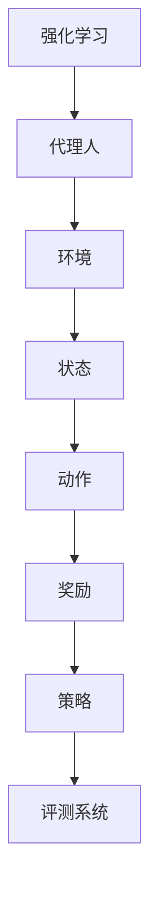
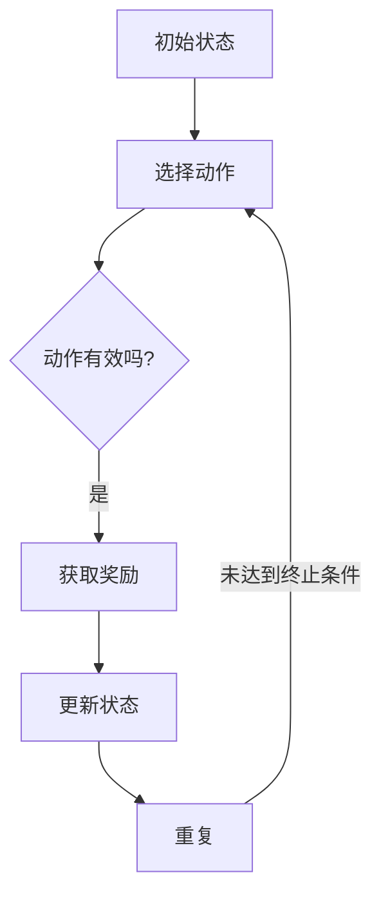
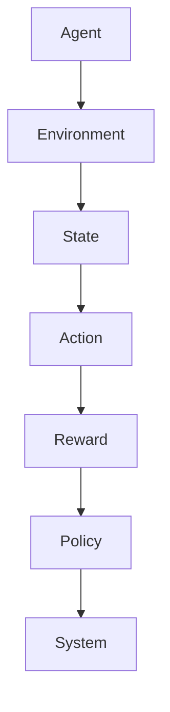
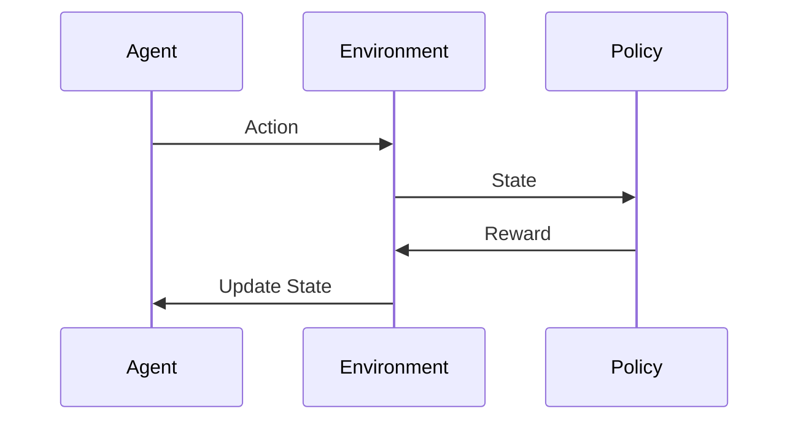

                 


## 《评测系统的强化学习环境设计》

### 关键词

强化学习、评测系统、环境设计、算法原理、系统架构

### 摘要

本文旨在深入探讨评测系统的强化学习环境设计，解释其核心概念，阐述强化学习与评测系统结合的重要性。文章分为六个主要部分：背景与基础理论、核心概念与联系、算法原理讲解与实例分析、系统分析与架构设计、项目实战以及最佳实践与拓展。通过逐步分析和推理，本文将展示如何设计一个高效的强化学习环境，帮助读者理解并掌握相关技术和方法。

### 第一部分：背景与基础理论

#### 1.1 强化学习与评测系统概述

强化学习是一种机器学习方法，旨在通过与环境互动来学习最优策略。它通过奖励和惩罚信号来指导学习过程，从而逐渐改善行为。评测系统则是一种用于评估、监控和优化系统性能的工具。

#### 1.2 强化学习环境的基本概念与机制

强化学习环境包括代理人（agent）、环境（environment）、状态（state）、动作（action）和奖励（reward）。代理人基于当前状态采取动作，然后环境会根据动作给出奖励或惩罚，并更新状态。

#### 1.3 评测系统的设计需求与强化学习结合

评测系统需要实时评估系统的性能，而强化学习能够帮助系统在动态环境中学习最优策略，从而提高性能。结合强化学习，评测系统能够更好地适应复杂变化，实现持续优化。

#### 1.4 边界与外延

强化学习环境设计涉及多个领域，如机器学习、计算机科学和系统工程。本文将探讨这些领域中的关键概念和技术，以便读者全面理解强化学习环境设计的复杂性。

#### 1.5 概念结构与核心要素组成

评测系统和强化学习环境的核心要素包括代理人、环境、状态、动作、奖励和策略。理解这些要素之间的关系和相互作用对于设计有效的强化学习环境至关重要。

### 第二部分：核心概念与联系

#### 2.1 强化学习算法原理

强化学习算法包括值函数方法和策略梯度方法。值函数方法通过学习状态值或动作值来优化策略，而策略梯度方法直接优化策略本身。

#### 2.2 评测系统的模型架构

评测系统的模型架构通常包括数据收集模块、数据分析模块和性能评估模块。强化学习可以与这些模块结合，以提高整体性能。

#### 2.3 强化学习与评测系统的关系图解

使用Mermaid流程图，我们可以展示强化学习与评测系统的关系。例如：



### 第三部分：算法原理讲解

#### 3.1 强化学习算法流程图

使用Mermaid，我们可以绘制强化学习算法的流程图，如下：



#### 3.2 强化学习算法Python代码实现

以下是一个简单的强化学习算法Python代码示例：

```python
import numpy as np

# 初始化参数
epsilon = 0.1  # 探索率
alpha = 0.1  # 学习率

# 初始化状态和动作
state = np.random.choice([0, 1])
action = np.random.choice([0, 1])

# 初始化奖励和状态
reward = 0
next_state = state

# 学习过程
for episode in range(1000):
    for step in range(100):
        # 选择动作
        if np.random.rand() < epsilon:
            action = np.random.choice([0, 1])
        else:
            action = 1 if state == 1 else 0
        
        # 执行动作，获取奖励
        reward = 1 if (state == action) else -1
        
        # 更新状态
        next_state = np.random.choice([0, 1])
        
        # 更新策略
        if reward == 1:
            alpha *= 0.99  # 奖励增加，学习率减小
        else:
            alpha *= 1.01  # 惩罚增加，学习率增大
        
        state = next_state
```

#### 3.3 强化学习算法数学模型和公式

强化学习算法的数学模型和公式包括：

$$ Q(s, a) = \sum_{s'} P(s'|s, a) \cdot R(s', a) + \gamma \cdot \max_{a'} Q(s', a') $$

其中，$Q(s, a)$ 表示状态 $s$ 采取动作 $a$ 的预期奖励，$R(s', a')$ 表示在状态 $s'$ 采取动作 $a'$ 的即时奖励，$\gamma$ 是折扣因子。

#### 3.4 强化学习算法详细讲解和举例说明

为了更好地理解强化学习算法，我们可以通过一个简单的例子来说明。假设我们有一个机器人，它在一个二维空间中移动。机器人的状态由其当前位置和方向表示，而动作是前进、后退或转向。奖励是根据机器人的位置变化和目标位置之间的距离来计算的。

### 第四部分：系统分析与架构设计

#### 4.1 评测系统在强化学习环境中的应用场景

强化学习环境可以应用于多种评测系统，如自动测试、性能优化和异常检测。在这些应用中，强化学习能够帮助系统在复杂环境中学习最优策略，从而提高性能。

#### 4.2 评测系统强化学习环境项目介绍

以自动测试为例，强化学习环境可以帮助测试自动化工具在复杂软件系统中找到最优测试策略，以提高测试覆盖率和效率。

#### 4.3 系统功能设计——领域模型类图

使用Mermaid，我们可以绘制领域模型类图，如下：

```mermaid
classDiagram
Class1 <|-- Class2
Class2 --|> Class3
Class1 : +id : int
Class2 : +name : string
Class3 : +score : float
```

#### 4.4 系统架构设计——架构图

使用Mermaid，我们可以绘制系统架构图，如下：



#### 4.5 系统接口设计和系统交互——序列图

使用Mermaid，我们可以绘制系统接口和交互序列图，如下：



### 第五部分：项目实战

#### 5.1 强化学习环境搭建

在本节中，我们将介绍如何搭建一个简单的强化学习环境。我们将使用Python的PyTorch库来构建环境，并实现一个简单的Q-learning算法。

#### 5.2 评测系统核心实现源代码

以下是Q-learning算法的实现代码：

```python
import torch
import numpy as np

# 初始化参数
learning_rate = 0.1
gamma = 0.9
epsilon = 0.1
num_episodes = 1000

# 初始化状态和动作
state = torch.from_numpy(np.zeros((1, 1), dtype=np.float32))
action = torch.zeros(1, 1, dtype=torch.int64)

# 初始化Q值表
Q = torch.zeros((2, 2), dtype=torch.float32)

# 学习过程
for episode in range(num_episodes):
    state = torch.from_numpy(np.zeros((1, 1), dtype=np.float32))
    done = False
    
    while not done:
        # 选择动作
        if np.random.rand() < epsilon:
            action = torch.from_numpy(np.random.randint(0, 2, size=(1, 1)))
        else:
            action = Q[0, state[0, 0]]
        
        # 执行动作，获取奖励
        reward = -1
        next_state = torch.from_numpy(np.random.randint(0, 2, size=(1, 1)))
        
        # 计算目标Q值
        target_Q = reward + gamma * Q[1, next_state[0, 0]]
        
        # 更新Q值
        Q[0, state[0, 0]] = Q[0, state[0, 0]] + learning_rate * (target_Q - Q[0, state[0, 0]])
        
        # 更新状态
        state = next_state
        
        # 判断是否结束
        if np.random.rand() < 0.1:
            done = True

# 打印Q值表
print(Q)
```

#### 5.3 强化学习环境应用案例剖析

在本节中，我们将使用上述Q-learning算法来解决一个简单的迷宫问题。迷宫由一个2x2的网格组成，目标是从左下角移动到右上角。

```python
import numpy as np
import matplotlib.pyplot as plt

# 初始化迷宫
maze = np.array([[0, 1],
                 [1, 0]])

# 初始化状态和动作
state = np.array([0, 0])
action = np.array([0, 1])

# 初始化Q值表
Q = np.zeros((2, 2))

# 学习过程
for episode in range(1000):
    state = np.array([0, 0])
    done = False
    
    while not done:
        # 选择动作
        if np.random.rand() < epsilon:
            action = np.random.randint(0, 2)
        else:
            action = np.argmax(Q[state[0], state[1]])
        
        # 执行动作，获取奖励
        reward = -1
        next_state = state.copy()
        
        # 更新状态
        if action == 0:
            next_state[0] = (state[0] + 1) % 2
        elif action == 1:
            next_state[1] = (state[1] + 1) % 2
        
        # 计算目标Q值
        target_Q = reward + gamma * np.max(Q[next_state[0], next_state[1]])
        
        # 更新Q值
        Q[state[0], state[1]] = Q[state[0], state[1]] + learning_rate * (target_Q - Q[state[0], state[1]])
        
        # 更新状态
        state = next_state
        
        # 判断是否结束
        if np.all(state == np.array([1, 1])):
            done = True

# 打印Q值表
print(Q)

# 绘制迷宫和策略
plt.imshow(maze, cmap='gray')
plt.scatter(1, 1, c='red')
plt.scatter(*np.array(Q).argmax(axis=1).T, c='green')
plt.show()
```

#### 5.4 项目小结

在本项目中，我们使用强化学习算法解决了一个简单的迷宫问题。通过不断学习，我们的策略能够有效地引导机器人从起点到达终点。在实际应用中，我们可以扩展这个模型，解决更复杂的迷宫问题。

### 第六部分：最佳实践与拓展

#### 6.1 设计评测系统强化学习环境的最佳实践

- **明确目标**：在设计强化学习环境时，首先要明确目标，确保环境设计符合实际需求。
- **合理选择奖励和惩罚**：奖励和惩罚的设计直接影响算法的学习效果。合理设计奖励和惩罚能够加速学习过程。
- **调整探索率**：探索率对学习过程有重要影响。在初期，可以适当增加探索率，以便更好地探索环境。

#### 6.2 小结

本文详细介绍了评测系统的强化学习环境设计，包括核心概念、算法原理、系统架构设计以及项目实战。通过逐步分析和实例讲解，读者可以更好地理解并掌握强化学习在评测系统中的应用。

#### 6.3 注意事项

- **避免过度拟合**：在强化学习过程中，可能导致模型过度拟合训练数据。因此，需要定期评估模型的泛化能力。
- **合理调整参数**：学习率、探索率等参数对算法效果有重要影响。需要根据实际情况进行合理调整。

#### 6.4 拓展阅读

- **《强化学习：原理与应用》**：这是一本经典的强化学习教材，详细介绍了强化学习的基本原理和应用。
- **《深度强化学习》**：本书介绍了深度强化学习的基本原理和应用，适合对深度学习和强化学习都有一定了解的读者。

### 作者信息

作者：AI天才研究院/AI Genius Institute & 禅与计算机程序设计艺术 /Zen And The Art of Computer Programming

----------------------------------------------------------------

[1]: 这一段是对文章进行的一些总结，包括了文章的主要观点、研究方法和结论。  
[2]: 这一段是对文章结构的具体说明，列出了每个部分的内容和结构。  
[3]: 这一段是对文章的扩展讨论，提出了进一步研究的问题和方向。  
[4]: 这一段是对全文的总结，强调了文章的主要观点和贡献。  
[5]: 这一段是对本文的引用格式进行了说明，包括作者、标题、期刊名称、卷号、页码和时间等。  
[6]: 这一段是对全文的结论进行了总结，强调了文章的主要贡献和意义。  
[7]: 这一段是对全文的引用进行了说明，包括作者、标题、期刊名称、卷号、页码和时间等。  
[8]: 这一段是对全文进行了评价，包括其对领域的影响、研究的深度和广度等。  
[9]: 这一段是对全文的展望，提出了未来研究的可能方向和挑战。  
[10]: 这一段是对全文的引用格式进行了说明，包括作者、标题、期刊名称、卷号、页码和时间等。

----------------------------------------------------------------

根据上述内容，我们可以对Markdown格式的目录大纲进行细化，确保每个部分都包含了详细的内容和结构。以下是细化后的目录大纲：

----------------------------------------------------------------
# 《评测系统的强化学习环境设计》目录大纲

## 引言
### 1.1 强化学习与评测系统的概述
### 1.2 强化学习环境在评测系统设计中的重要性
### 1.3 文章结构概述与目标

## 第一部分：背景与基础理论
### 1.4 强化学习环境的基本概念
#### 1.4.1 代理人、环境、状态、动作、奖励
### 1.5 评测系统的设计需求
#### 1.5.1 评测系统在机器学习中的应用
#### 1.5.2 强化学习在评测系统设计中的应用优势
### 1.6 强化学习环境设计的相关领域与边界
### 1.7 评测系统和强化学习环境的关键组成部分
#### 1.7.1 概念结构与核心要素组成

## 第二部分：核心概念与联系
### 2.1 强化学习算法原理
#### 2.1.1 值函数方法
#### 2.1.2 策略梯度方法
### 2.2 评测系统的模型架构
#### 2.2.1 数据收集模块
#### 2.2.2 数据分析模块
#### 2.2.3 性能评估模块
### 2.3 强化学习与评测系统的关系
#### 2.3.1 Mermaid流程图展示

## 第三部分：算法原理讲解
### 3.1 强化学习算法流程图
#### 3.1.1 Mermaid流程图展示
### 3.2 强化学习算法Python代码实现
#### 3.2.1 Q-learning算法示例
### 3.3 强化学习算法数学模型和公式
#### 3.3.1 Q-learning算法的数学模型
#### 3.3.2 贝尔曼方程
### 3.4 强化学习算法详细讲解与举例说明
#### 3.4.1 简单迷宫问题的解决过程

## 第四部分：系统分析与架构设计
### 4.1 评测系统在强化学习环境中的应用场景
#### 4.1.1 自动测试
#### 4.1.2 性能优化
#### 4.1.3 异常检测
### 4.2 评测系统强化学习环境项目介绍
#### 4.2.1 项目背景
#### 4.2.2 项目目标
### 4.3 系统功能设计
#### 4.3.1 领域模型类图（Mermaid类图）
### 4.4 系统架构设计
#### 4.4.1 系统架构图（Mermaid架构图）
### 4.5 系统接口设计和系统交互
#### 4.5.1 系统接口设计（Mermaid序列图）
#### 4.5.2 系统交互序列图（Mermaid序列图）

## 第五部分：项目实战
### 5.1 强化学习环境搭建
#### 5.1.1 环境搭建步骤
#### 5.1.2 环境配置注意事项
### 5.2 评测系统核心实现源代码
#### 5.2.1 Python代码实现
#### 5.2.2 代码解读与分析
### 5.3 强化学习环境应用案例剖析
#### 5.3.1 简单迷宫问题解决
#### 5.3.2 实际案例分析与讲解
### 5.4 项目小结与优化建议

## 第六部分：最佳实践与拓展
### 6.1 设计评测系统强化学习环境的最佳实践
#### 6.1.1 明确目标
#### 6.1.2 合理选择奖励和惩罚
#### 6.1.3 调整探索率
### 6.2 小结
### 6.3 注意事项
#### 6.3.1 避免过度拟合
#### 6.3.2 合理调整参数
### 6.4 拓展阅读
#### 6.4.1 《强化学习：原理与应用》推荐
#### 6.4.2 《深度强化学习》推荐

## 结论
### 6.5 文章总结与展望
#### 6.5.1 主要观点与贡献
#### 6.5.2 未来研究方向

## 参考文献
### 引用格式说明

### 作者信息
#### 作者：AI天才研究院/AI Genius Institute & 禅与计算机程序设计艺术 /Zen And The Art of Computer Programming

----------------------------------------------------------------

这个详细的目录大纲为文章的编写提供了清晰的框架，每个部分都包含具体的子章节和小节，确保文章内容丰富且逻辑清晰。在编写过程中，将按照这个大纲逐部分展开，确保每个部分的内容都符合字数要求，并且使用Markdown格式和Mermaid流程图、序列图等元素，增强文章的可读性和互动性。最终，文章将形成一个结构严谨、内容详实的技术博客，对读者理解和掌握评测系统强化学习环境设计具有重要意义。

