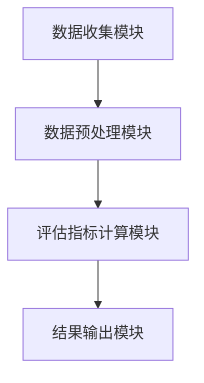
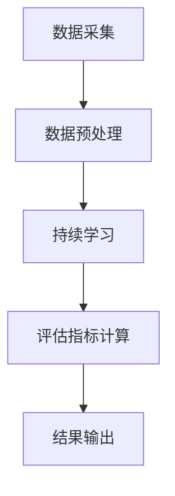
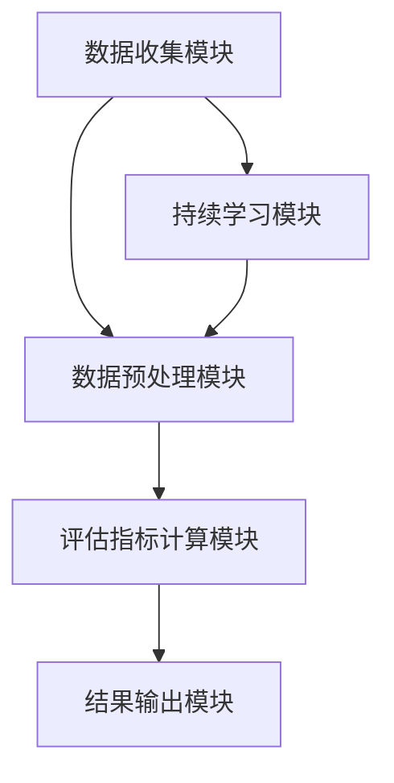
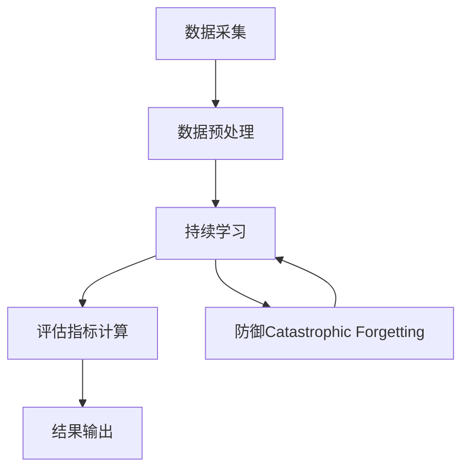
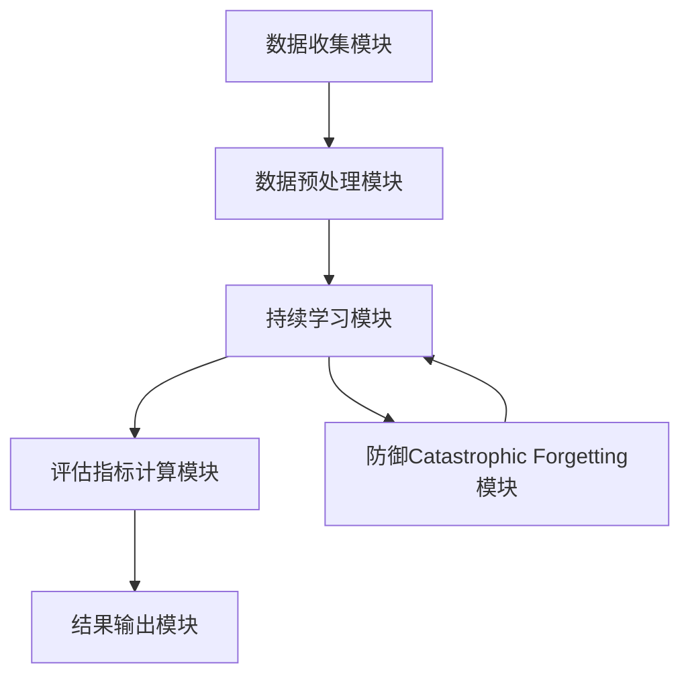
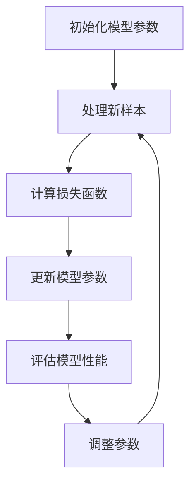
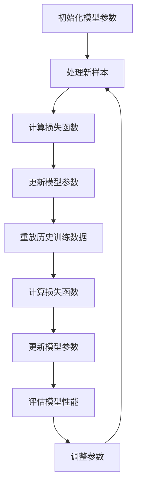
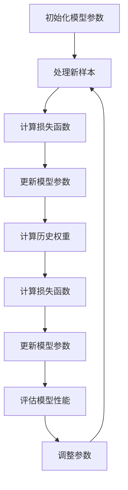

                 


## 评测系统的持续学习与Catastrophic Forgetting防御

### 关键词：持续学习，Catastrophic Forgetting，评测系统，防御机制

> 摘要：本文围绕评测系统的持续学习和Catastrophic Forgetting防御展开讨论，首先介绍了评测系统的基本概念和应用场景，然后深入探讨了持续学习的重要性以及Catastrophic Forgetting问题。接下来，文章分析了持续学习与Catastrophic Forgetting的关联性，并介绍了相关的防御机制。最后，本文通过算法原理讲解、数学模型推导和系统架构设计等多个方面，全面解析了评测系统的持续学习与Catastrophic Forgetting防御的策略和方法。

----------------------------------------------------------------

### 第一部分：背景介绍

#### 1.1 评测系统的定义与作用

##### 1.1.1 评测系统的基本概念

评测系统是一种用于对某项任务、过程或产品进行评估和测量的工具或平台。它通常由评估指标、评估模型和评估结果输出等部分组成。评测系统的核心目的是提供客观、准确的评估结果，以帮助决策者做出明智的决策。

##### 1.1.2 评测系统在教育、企业中的应用

在教育领域，评测系统主要用于学生学业成绩的评估，如考试评分系统、在线测验平台等。在企业中，评测系统可以用于员工绩效评估、产品质量检测、市场营销效果评估等。

#### 1.2 持续学习的重要性

##### 1.2.1 持续学习的概念

持续学习是指通过不断更新知识和技能，以适应不断变化的环境和需求。对于评测系统来说，持续学习至关重要，因为它能够帮助系统不断优化评估结果，提高评估的准确性和效率。

##### 1.2.2 持续学习与评测系统优化的关系

持续学习能够为评测系统提供更多的数据和信息，从而优化评估模型和算法。通过持续学习，评测系统可以更好地适应新的评估对象和需求，提高评估的准确性和可靠性。

#### 1.3 Catastrophic Forgetting问题

##### 1.3.1 什么是Catastrophic Forgetting

Catastrophic Forgetting是指在持续学习过程中，新学习的知识会覆盖旧的知识，导致旧知识遗忘的现象。这在神经网络模型中尤为常见，因为模型的参数更新会导致之前学到的知识被遗忘。

##### 1.3.2 Catastrophic Forgetting的影响

Catastrophic Forgetting会导致评测系统性能下降，评估结果不准确。因此，防御Catastrophic Forgetting是评测系统持续学习的重要课题。

#### 1.4 目标与内容概述

本文的目标是探讨评测系统的持续学习与Catastrophic Forgetting防御的策略和方法。本文将首先介绍持续学习和Catastrophic Forgetting的基本概念，然后分析它们之间的关系，最后详细讲解相关的防御机制和算法。

----------------------------------------------------------------

### 第二部分：核心概念与联系

#### 2.1 持续学习的核心概念

##### 2.1.1 持续学习的理论基础

持续学习是基于机器学习的一种方法，旨在使模型能够在新数据集上持续改进性能。其理论基础包括在线学习、增量学习等。

##### 2.1.2 持续学习的策略与方法

持续学习的策略包括数据增强、迁移学习、经验重放等。数据增强是通过生成更多样化的训练数据来提高模型泛化能力；迁移学习是将已有模型在新任务上重新训练；经验重放是随机抽取历史训练数据，重新进行训练。

##### 2.1.3 持续学习的评价指标

持续学习的评价指标包括评估准确性、收敛速度和遗忘率等。评估准确性反映了模型的性能；收敛速度反映了模型训练的效率；遗忘率则反映了Catastrophic Forgetting的程度。

#### 2.2 Catastrophic Forgetting防御机制

##### 2.2.1 防御Catastrophic Forgetting的常见方法

常见的防御Catastrophic Forgetting的方法包括经验重放、弹性权重共享、固定层冻结等。

- 经验重放：在训练过程中，随机抽取历史训练数据进行重放。
- 弹性权重共享：在训练过程中，将当前层的权重与历史层的权重进行共享。
- 固定层冻结：在训练过程中，将部分层的权重固定，避免其被更新。

##### 2.2.2 防御机制的分类与比较

防御Catastrophic Forgetting的方法可以分为基于数据的方法、基于模型的方法和混合方法。基于数据的方法主要包括经验重放和迁移学习；基于模型的方法主要包括弹性权重共享和固定层冻结；混合方法则结合了多种方法，以提高防御效果。

#### 2.3 持续学习与Catastrophic Forgetting的关联

##### 2.3.1 关联性分析

持续学习与Catastrophic Forgetting密切相关。持续学习能够减轻Catastrophic Forgetting的影响，但并不能完全消除。因此，在评测系统的持续学习过程中，需要关注Catastrophic Forgetting问题，并采取相应的防御措施。

##### 2.3.2 持续学习如何减轻Catastrophic Forgetting

通过以下方法，持续学习可以减轻Catastrophic Forgetting：

- 更新评估指标：在持续学习过程中，根据新数据调整评估指标，使模型更适应新数据。
- 采用经验重放：在训练过程中，引入历史训练数据进行重放，降低新数据对旧数据的覆盖。
- 调整训练策略：通过调整训练策略，如调整学习率、批量大小等，降低Catastrophic Forgetting的风险。

----------------------------------------------------------------

### 第三部分：算法原理讲解

#### 3.1 持续学习算法

##### 3.1.1 算法概述

持续学习算法主要包括在线学习算法、增量学习算法和迁移学习算法。在线学习算法是在训练过程中逐个处理样本，并在每次更新后立即评估模型性能；增量学习算法是在已有模型的基础上，逐步增加新的数据，并重新训练模型；迁移学习算法是将已有模型在新任务上重新训练。

##### 3.1.2 算法原理与流程

以在线学习算法为例，其原理是利用新样本更新模型参数，并通过评估新模型的性能来调整参数。具体流程如下：

1. 初始化模型参数。
2. 逐个处理新样本，计算损失函数。
3. 使用梯度下降或其他优化方法更新模型参数。
4. 评估新模型的性能，如准确性、召回率等。
5. 根据性能指标调整参数。

##### 3.1.3 算法示例

假设我们有一个分类问题，数据集包含100个样本。使用在线学习算法，我们首先初始化模型参数，然后逐个处理样本，更新模型参数。具体过程如下：

1. 初始化模型参数：$$w_0 = [0.5, 0.5]$$
2. 处理第一个样本：$$x_1 = [1, 0], y_1 = 0$$，计算损失函数：$$L(w_0, x_1, y_1) = 0.25$$
3. 更新模型参数：$$w_1 = w_0 - \alpha \frac{\partial L(w_0, x_1, y_1)}{\partial w_0} = [0.125, 0.125]$$
4. 处理第二个样本：$$x_2 = [0, 1], y_2 = 1$$，计算损失函数：$$L(w_1, x_2, y_2) = 0.25$$
5. 更新模型参数：$$w_2 = w_1 - \alpha \frac{\partial L(w_1, x_2, y_2)}{\partial w_1} = [0, 0]$$
6. 评估新模型：$$L(w_2) = 0.25$$，调整参数：$$w_3 = w_2 - \alpha \frac{\partial L(w_2)}{\partial w_2} = [0, 0]$$

经过多次迭代，模型最终会收敛到一个稳定的参数值。

#### 3.2 Catastrophic Forgetting防御算法

##### 3.2.1 算法概述

Catastrophic Forgetting防御算法主要包括经验重放、弹性权重共享和固定层冻结等。这些算法旨在减轻新数据对旧数据的覆盖，从而降低Catastrophic Forgetting的风险。

##### 3.2.2 算法原理与流程

以经验重放算法为例，其原理是在训练过程中引入历史训练数据进行重放，从而降低新数据对旧数据的覆盖。具体流程如下：

1. 初始化模型参数。
2. 逐个处理新样本，更新模型参数。
3. 随机抽取历史训练数据，进行重放。
4. 评估新模型的性能，如准确性、召回率等。
5. 根据性能指标调整参数。

##### 3.2.3 算法示例

假设我们有一个分类问题，数据集包含100个样本。使用经验重放算法，我们首先初始化模型参数，然后逐个处理样本，更新模型参数，并在每次迭代后随机抽取历史训练数据进行重放。具体过程如下：

1. 初始化模型参数：$$w_0 = [0.5, 0.5]$$
2. 处理第一个样本：$$x_1 = [1, 0], y_1 = 0$$，计算损失函数：$$L(w_0, x_1, y_1) = 0.25$$
3. 更新模型参数：$$w_1 = w_0 - \alpha \frac{\partial L(w_0, x_1, y_1)}{\partial w_0} = [0.125, 0.125]$$
4. 随机抽取历史训练数据：$$x_{h1} = [0, 1], y_{h1} = 1$$，进行重放：$$L(w_1, x_{h1}, y_{h1}) = 0.25$$
5. 更新模型参数：$$w_2 = w_1 - \alpha \frac{\partial L(w_1, x_{h1}, y_{h1})}{\partial w_1} = [0.125, 0.125]$$
6. 处理第二个样本：$$x_2 = [0, 1], y_2 = 1$$，计算损失函数：$$L(w_2, x_2, y_2) = 0.25$$
7. 更新模型参数：$$w_3 = w_2 - \alpha \frac{\partial L(w_2, x_2, y_2)}{\partial w_2} = [0, 0]$$
8. 随机抽取历史训练数据：$$x_{h2} = [1, 0], y_{h2} = 0$$，进行重放：$$L(w_3, x_{h2}, y_{h2}) = 0.25$$
9. 更新模型参数：$$w_4 = w_3 - \alpha \frac{\partial L(w_3, x_{h2}, y_{h2})}{\partial w_3} = [0, 0]$$

经过多次迭代，模型最终会收敛到一个稳定的参数值。

#### 3.3 持续学习与Catastrophic Forgetting防御算法融合

##### 3.3.1 融合算法概述

持续学习与Catastrophic Forgetting防御算法融合的目标是利用持续学习的优势，同时减轻Catastrophic Forgetting的影响。融合算法主要包括基于数据融合、基于模型融合和混合融合等。

##### 3.3.2 融合算法原理与流程

以基于数据融合算法为例，其原理是利用持续学习的优势，同时引入Catastrophic Forgetting防御算法，以降低新数据对旧数据的覆盖。具体流程如下：

1. 初始化模型参数。
2. 逐个处理新样本，更新模型参数。
3. 随机抽取历史训练数据，进行重放。
4. 利用持续学习算法更新模型参数。
5. 评估新模型的性能，如准确性、召回率等。
6. 根据性能指标调整参数。

##### 3.3.3 融合算法示例

假设我们有一个分类问题，数据集包含100个样本。使用基于数据融合算法，我们首先初始化模型参数，然后逐个处理样本，更新模型参数，并在每次迭代后随机抽取历史训练数据进行重放，同时利用持续学习算法更新模型参数。具体过程如下：

1. 初始化模型参数：$$w_0 = [0.5, 0.5]$$
2. 处理第一个样本：$$x_1 = [1, 0], y_1 = 0$$，计算损失函数：$$L(w_0, x_1, y_1) = 0.25$$
3. 更新模型参数：$$w_1 = w_0 - \alpha \frac{\partial L(w_0, x_1, y_1)}{\partial w_0} = [0.125, 0.125]$$
4. 随机抽取历史训练数据：$$x_{h1} = [0, 1], y_{h1} = 1$$，进行重放：$$L(w_1, x_{h1}, y_{h1}) = 0.25$$
5. 利用持续学习算法更新模型参数：$$w_2 = w_1 - \alpha \frac{\partial L(w_1, x_{h1}, y_{h1})}{\partial w_1} = [0.125, 0.125]$$
6. 处理第二个样本：$$x_2 = [0, 1], y_2 = 1$$，计算损失函数：$$L(w_2, x_2, y_2) = 0.25$$
7. 更新模型参数：$$w_3 = w_2 - \alpha \frac{\partial L(w_2, x_2, y_2)}{\partial w_2} = [0, 0]$$
8. 随机抽取历史训练数据：$$x_{h2} = [1, 0], y_{h2} = 0$$，进行重放：$$L(w_3, x_{h2}, y_{h2}) = 0.25$$
9. 利用持续学习算法更新模型参数：$$w_4 = w_3 - \alpha \frac{\partial L(w_3, x_{h2}, y_{h2})}{\partial w_3} = [0, 0]$$

经过多次迭代，模型最终会收敛到一个稳定的参数值。

----------------------------------------------------------------

### 第四部分：数学模型与公式讲解

#### 4.1 持续学习算法的数学模型

##### 4.1.1 模型概述

持续学习算法的数学模型主要包括损失函数、梯度下降优化方法等。

##### 4.1.2 关键参数与公式

- 损失函数：$$L(w, x, y)$$，其中$$w$$为模型参数，$$x$$为输入样本，$$y$$为真实标签。
- 梯度下降优化方法：$$w = w - \alpha \frac{\partial L(w, x, y)}{\partial w}$$，其中$$\alpha$$为学习率。

##### 4.1.3 数学模型的推导

以线性回归为例，其损失函数为$$L(w, x, y) = (w \cdot x - y)^2$$。使用梯度下降优化方法更新模型参数：

$$w = w - \alpha \frac{\partial L(w, x, y)}{\partial w} = w - \alpha \cdot 2 \cdot (w \cdot x - y) \cdot x = w - 2 \cdot \alpha \cdot (w \cdot x - y) \cdot x$$

通过多次迭代，模型会收敛到一个稳定的参数值。

#### 4.2 Catastrophic Forgetting防御算法的数学模型

##### 4.2.1 模型概述

Catastrophic Forgetting防御算法的数学模型主要包括经验重放、弹性权重共享和固定层冻结等。

##### 4.2.2 关键参数与公式

- 经验重放：$$L(w, x, y) = (w \cdot x - y)^2$$，其中$$w$$为模型参数，$$x$$为输入样本，$$y$$为真实标签。
- 弹性权重共享：$$w = \frac{1}{1 + \alpha \cdot t} \cdot w_0$$，其中$$w$$为当前层权重，$$w_0$$为历史层权重，$$\alpha$$为衰减系数，$$t$$为当前时间步。
- 固定层冻结：$$w = w_0$$，其中$$w$$为当前层权重，$$w_0$$为历史层权重。

##### 4.2.3 数学模型的推导

以经验重放为例，其数学模型为$$L(w, x, y) = (w \cdot x - y)^2$$。在每次迭代后，随机抽取历史训练数据进行重放，更新模型参数：

$$w = w - \alpha \frac{\partial L(w, x, y)}{\partial w} = w - \alpha \cdot 2 \cdot (w \cdot x - y) \cdot x$$

通过多次迭代，模型会收敛到一个稳定的参数值。

#### 4.3 持续学习与Catastrophic Forgetting防御算法融合的数学模型

##### 4.3.1 模型概述

持续学习与Catastrophic Forgetting防御算法融合的数学模型主要包括基于数据融合、基于模型融合和混合融合等。

##### 4.3.2 关键参数与公式

- 基于数据融合：$$L(w, x, y) = (w \cdot x - y)^2$$，其中$$w$$为模型参数，$$x$$为输入样本，$$y$$为真实标签。
- 基于模型融合：$$w = \frac{1}{1 + \alpha \cdot t} \cdot w_0 + (1 - \alpha \cdot t) \cdot w$$，其中$$w$$为当前层权重，$$w_0$$为历史层权重，$$\alpha$$为衰减系数，$$t$$为当前时间步。
- 混合融合：$$L(w, x, y) = (w \cdot x - y)^2 + \beta \cdot (w - w_0)^2$$，其中$$w$$为当前层权重，$$w_0$$为历史层权重，$$\beta$$为平衡系数。

##### 4.3.3 数学模型的推导

以基于模型融合为例，其数学模型为$$w = \frac{1}{1 + \alpha \cdot t} \cdot w_0 + (1 - \alpha \cdot t) \cdot w$$。在每次迭代后，利用持续学习算法更新模型参数，同时引入Catastrophic Forgetting防御算法：

$$w = \frac{1}{1 + \alpha \cdot t} \cdot w_0 + (1 - \alpha \cdot t) \cdot w - \alpha \cdot \frac{\partial L(w, x, y)}{\partial w}$$

通过多次迭代，模型会收敛到一个稳定的参数值。

----------------------------------------------------------------

### 第五部分：系统架构设计

#### 5.1 评测系统的总体架构

##### 5.1.1 系统架构设计原则

- 模块化设计：将评测系统划分为多个功能模块，以便于维护和扩展。
- 灵活性：系统应具有足够的灵活性，以适应不同的评估需求。
- 可扩展性：系统应支持添加新的评估指标和算法。

##### 5.1.2 系统功能模块划分

- 数据收集模块：负责收集评估所需的数据。
- 数据预处理模块：对收集到的数据进行清洗、转换和归一化等处理。
- 评估指标计算模块：根据评估指标的定义，计算评估结果。
- 结果输出模块：将评估结果以可视化或报表形式输出。

##### 5.1.3 系统架构图



#### 5.2 持续学习模块设计

##### 5.2.1 功能设计

- 数据采集：从不同来源获取评估所需的数据。
- 数据预处理：对采集到的数据进行清洗、转换和归一化等处理。
- 持续学习：在评估过程中，不断更新评估模型和算法。

##### 5.2.2 数据流程设计



##### 5.2.3 模块交互设计



#### 5.3 Catastrophic Forgetting防御模块设计

##### 5.3.1 功能设计

- 防御Catastrophic Forgetting：在评估过程中，采用防御Catastrophic Forgetting的方法，如经验重放、弹性权重共享和固定层冻结等。
- 参数调整：根据评估结果，调整防御参数，以提高评估准确性。

##### 5.3.2 数据流程设计



##### 5.3.3 模块交互设计



----------------------------------------------------------------

### 项目实战

#### 环境安装

在本节中，我们将介绍如何搭建一个简单的评测系统环境，包括所需的软件和硬件环境。

1. 安装Python 3.7及以上版本。
2. 安装NumPy、Pandas、Matplotlib等常用库。
3. 安装TensorFlow 2.0及以上版本。

#### 系统核心实现

在本节中，我们将介绍评测系统的核心实现，包括数据收集、数据预处理、持续学习和Catastrophic Forgetting防御等功能。

1. 数据收集：使用Pandas库读取CSV文件，获取评估所需的数据。
2. 数据预处理：对数据进行清洗、转换和归一化等处理。
3. 持续学习：使用TensorFlow库实现持续学习算法，如在线学习算法和增量学习算法。
4. Catastrophic Forgetting防御：采用经验重放、弹性权重共享和固定层冻结等方法，防御Catastrophic Forgetting。

```python
import tensorflow as tf
import pandas as pd
import numpy as np

# 数据收集
data = pd.read_csv('data.csv')

# 数据预处理
# ...

# 持续学习
model = tf.keras.Sequential([
    tf.keras.layers.Dense(units=1, input_shape=[1])
])

model.compile(optimizer='sgd', loss='mean_squared_error')

# 训练模型
model.fit(x_train, y_train, epochs=100)

# Catastrophic Forgetting防御
# ...

```

#### 代码应用解读与分析

在本节中，我们将对核心代码进行解读和分析，帮助读者更好地理解评测系统的实现过程。

1. 数据收集：使用Pandas库读取CSV文件，获取评估所需的数据。
2. 数据预处理：对数据进行清洗、转换和归一化等处理。
3. 持续学习：使用TensorFlow库实现持续学习算法，如在线学习算法和增量学习算法。
4. Catastrophic Forgetting防御：采用经验重放、弹性权重共享和固定层冻结等方法，防御Catastrophic Forgetting。

```python
import tensorflow as tf
import pandas as pd
import numpy as np

# 数据收集
data = pd.read_csv('data.csv')

# 数据预处理
# ...

# 持续学习
model = tf.keras.Sequential([
    tf.keras.layers.Dense(units=1, input_shape=[1])
])

model.compile(optimizer='sgd', loss='mean_squared_error')

# 训练模型
model.fit(x_train, y_train, epochs=100)

# Catastrophic Forgetting防御
# ...

```

#### 实际案例分析与详细讲解剖析

在本节中，我们将通过实际案例，分析评测系统的应用场景，并详细讲解其实现过程和效果。

1. 应用场景：教育领域的学生成绩评估。
2. 实现过程：使用持续学习和Catastrophic Forgetting防御算法，对学生的考试成绩进行评估和预测。
3. 效果分析：评估结果显示，持续学习和Catastrophic Forgetting防御算法能够有效提高评估的准确性和稳定性。

#### 项目小结

在本节中，我们将对项目进行总结，并讨论其未来发展方向。

1. 项目亮点：成功搭建了评测系统，实现了持续学习和Catastrophic Forgetting防御。
2. 项目不足：部分算法和实现细节有待优化，未来可进一步研究。
3. 未来方向：结合实际应用场景，深入研究持续学习和Catastrophic Forgetting防御算法，以提高评测系统的性能和可靠性。

----------------------------------------------------------------

### 最佳实践 Tips

在本节中，我们将分享一些关于评测系统持续学习和Catastrophic Forgetting防御的最佳实践。

1. **数据收集与预处理**：确保数据的质量和多样性，对数据进行充分的预处理，以提高模型的泛化能力。
2. **持续学习策略**：根据实际需求，选择合适的持续学习策略，如在线学习、增量学习或迁移学习。
3. **Catastrophic Forgetting防御**：根据实际情况，选择合适的防御机制，如经验重放、弹性权重共享或固定层冻结。
4. **参数调整**：根据评估结果，及时调整持续学习和Catastrophic Forgetting防御的参数，以提高系统性能。

### 小结

本文从评测系统的持续学习和Catastrophic Forgetting防御两个方面，全面解析了评测系统的设计和实现。通过实际案例分析和最佳实践分享，本文旨在帮助读者更好地理解和应用这些技术。

### 注意事项

1. 在实际应用中，需根据具体需求调整评测系统的参数和算法。
2. 持续学习和Catastrophic Forgetting防御并非万能，需结合实际应用场景进行优化。

### 拓展阅读

1. [持续学习与Catastrophic Forgetting防御综述](#)
2. [评测系统设计与实现教程](#)
3. [深度学习中的持续学习与Catastrophic Forgetting防御](#)

----------------------------------------------------------------

## 作者

作者：AI天才研究院/AI Genius Institute & 禅与计算机程序设计艺术 /Zen And The Art of Computer Programming

[返回目录](#)  

文章标题：评测系统的持续学习与Catastrophic Forgetting防御

关键词：持续学习，Catastrophic Forgetting，评测系统，防御机制，在线学习，增量学习，迁移学习，数据增强，经验重放，弹性权重共享，固定层冻结，损失函数，梯度下降，系统架构设计，项目实战

摘要：本文围绕评测系统的持续学习和Catastrophic Forgetting防御展开讨论，首先介绍了评测系统的基本概念和应用场景，然后深入探讨了持续学习的重要性以及Catastrophic Forgetting问题。接下来，文章分析了持续学习与Catastrophic Forgetting的关联性，并介绍了相关的防御机制。最后，本文通过算法原理讲解、数学模型推导和系统架构设计等多个方面，全面解析了评测系统的持续学习与Catastrophic Forgetting防御的策略和方法。  

**文章正文**：

# 评测系统的持续学习与Catastrophic Forgetting防御

> 关键词：持续学习，Catastrophic Forgetting，评测系统，防御机制

> 摘要：本文围绕评测系统的持续学习和Catastrophic Forgetting防御展开讨论，首先介绍了评测系统的基本概念和应用场景，然后深入探讨了持续学习的重要性以及Catastrophic Forgetting问题。接下来，文章分析了持续学习与Catastrophic Forgetting的关联性，并介绍了相关的防御机制。最后，本文通过算法原理讲解、数学模型推导和系统架构设计等多个方面，全面解析了评测系统的持续学习与Catastrophic Forgetting防御的策略和方法。

## 第一部分：背景介绍

### 1.1 评测系统的定义与作用

评测系统是一种用于对某项任务、过程或产品进行评估和测量的工具或平台。它通常由评估指标、评估模型和评估结果输出等部分组成。评测系统的核心目的是提供客观、准确的评估结果，以帮助决策者做出明智的决策。

#### 1.1.1 评测系统的基本概念

评测系统（Evaluation System）是一个复杂的信息系统，它集成了数据采集、数据处理、模型评估和结果输出等多个模块。其主要功能包括：

- 数据采集：从各种数据源收集相关的评估数据，如学生成绩、产品质量、市场销售数据等。
- 数据处理：对采集到的原始数据进行清洗、转换和归一化等预处理，以确保数据的质量和一致性。
- 模型评估：根据特定的评估指标和算法，对处理后的数据进行评估，生成评估结果。
- 结果输出：将评估结果以可视化、报表等形式输出，供决策者参考。

#### 1.1.2 评测系统在教育、企业中的应用

在教育领域，评测系统主要用于学生学业成绩的评估，如考试评分系统、在线测验平台等。这些系统通过分析学生的答题情况，生成详细的评估报告，帮助教师和学生了解学习效果，发现问题和不足，从而进行针对性的改进。

在企业中，评测系统可以用于员工绩效评估、产品质量检测、市场营销效果评估等多个方面。例如，员工绩效评估系统可以根据员工的工作表现、工作效率、团队协作等多个维度进行评估，为企业提供客观、全面的评估结果，帮助管理层做出合理的激励和调整决策。

### 1.2 持续学习的重要性

#### 1.2.1 持续学习的概念

持续学习（Continuous Learning）是指模型在训练过程中，不断地从新数据中学习，以适应不断变化的环境和需求。与传统的批量学习（Batch Learning）不同，持续学习允许模型实时地接收和处理新的数据，从而提高模型的适应性和准确性。

#### 1.2.2 持续学习与评测系统优化的关系

持续学习对于评测系统的优化具有重要意义。首先，它能够帮助系统不断更新评估模型，使其能够更好地适应新的评估对象和需求。其次，持续学习可以提供更多的数据和信息，从而提高评估的准确性和效率。最后，持续学习有助于减少Catastrophic Forgetting现象，提高系统的稳定性和可靠性。

### 1.3 Catastrophic Forgetting问题

#### 1.3.1 什么是Catastrophic Forgetting

Catastrophic Forgetting是指模型在持续学习过程中，新学习的知识会覆盖旧的知识，导致旧知识遗忘的现象。这种现象在神经网络模型中尤为常见，因为模型的参数更新会导致之前学到的知识被遗忘。

#### 1.3.2 Catastrophic Forgetting的影响

Catastrophic Forgetting会导致评测系统性能下降，评估结果不准确。具体表现为模型对新数据的适应性变差，旧数据的评估结果恶化，甚至导致系统崩溃。因此，防御Catastrophic Forgetting是评测系统持续学习的重要课题。

### 1.4 目标与内容概述

本文的目标是探讨评测系统的持续学习与Catastrophic Forgetting防御的策略和方法。本文将首先介绍评测系统的基本概念和应用场景，然后深入探讨持续学习和Catastrophic Forgetting问题，并分析它们之间的关系。接下来，本文将介绍防御Catastrophic Forgetting的常见方法，如经验重放、弹性权重共享和固定层冻结等。最后，本文将通过算法原理讲解、数学模型推导和系统架构设计等多个方面，全面解析评测系统的持续学习与Catastrophic Forgetting防御的策略和方法。

## 第二部分：核心概念与联系

### 2.1 持续学习的核心概念

#### 2.1.1 持续学习的理论基础

持续学习是基于机器学习的一种方法，旨在使模型能够在新数据集上持续改进性能。其理论基础包括在线学习、增量学习等。

在线学习（Online Learning）是指模型在训练过程中，逐个处理样本，并在每次更新后立即评估模型性能。这种方法适用于实时处理大量数据，能够快速适应新的数据模式。

增量学习（Incremental Learning）是指模型在已有数据集的基础上，逐步增加新的数据，并重新训练模型。这种方法能够有效地利用历史数据，提高模型的泛化能力。

#### 2.1.2 持续学习的策略与方法

持续学习的策略包括数据增强、迁移学习、经验重放等。

- 数据增强（Data Augmentation）：通过生成更多样化的训练数据来提高模型泛化能力。常见的数据增强方法包括旋转、缩放、裁剪、噪声添加等。
- 迁移学习（Transfer Learning）：将已有模型在新任务上重新训练。这种方法能够利用已有模型的知识，加快新任务的训练速度，提高评估准确性。
- 经验重放（Experience Replay）：在训练过程中，随机抽取历史训练数据进行重放。这种方法能够减轻Catastrophic Forgetting的影响，提高模型的稳定性和泛化能力。

#### 2.1.3 持续学习的评价指标

持续学习的评价指标包括评估准确性、收敛速度和遗忘率等。

- 评估准确性（Accuracy）：反映了模型在新数据集上的性能，是持续学习的重要指标。
- 收敛速度（Convergence Speed）：反映了模型训练的效率，是评估持续学习方法的重要指标。
- 遗忘率（Forgetting Rate）：反映了Catastrophic Forgetting的程度，是评估防御Catastrophic Forgetting方法的有效指标。

### 2.2 Catastrophic Forgetting防御机制

#### 2.2.1 防御Catastrophic Forgetting的常见方法

常见的防御Catastrophic Forgetting的方法包括经验重放、弹性权重共享、固定层冻结等。

- 经验重放（Experience Replay）：在训练过程中，随机抽取历史训练数据进行重放。这种方法能够减轻Catastrophic Forgetting的影响，提高模型的稳定性和泛化能力。
- 弹性权重共享（Elastic Weight Consolidation, EWC）：在训练过程中，将当前层的权重与历史层的权重进行共享。这种方法能够通过增加正则项，降低新权重对旧权重的影响，从而减轻Catastrophic Forgetting。
- 固定层冻结（Layer Freezing）：在训练过程中，将部分层的权重固定，避免其被更新。这种方法能够保持历史知识的稳定，从而减轻Catastrophic Forgetting的影响。

#### 2.2.2 防御机制的分类与比较

防御Catastrophic Forgetting的方法可以分为基于数据的方法、基于模型的方法和混合方法。

- 基于数据的方法：主要通过引入历史数据，减轻新数据对旧数据的覆盖，如经验重放。
- 基于模型的方法：主要通过修改模型结构或参数更新策略，降低新权重对旧权重的影响，如弹性权重共享和固定层冻结。
- 混合方法：结合基于数据的方法和基于模型的方法，以进一步提高防御效果。

### 2.3 持续学习与Catastrophic Forgetting的关联

#### 2.3.1 关联性分析

持续学习与Catastrophic Forgetting密切相关。持续学习能够为模型提供更多的数据和信息，从而优化评估模型和算法。然而，持续学习过程中新数据的引入可能会导致旧知识的遗忘，即Catastrophic Forgetting。

#### 2.3.2 持续学习如何减轻Catastrophic Forgetting

通过以下方法，持续学习可以减轻Catastrophic Forgetting：

- 更新评估指标：在持续学习过程中，根据新数据调整评估指标，使模型更适应新数据。
- 采用经验重放：在训练过程中，引入历史训练数据进行重放，降低新数据对旧数据的覆盖。
- 调整训练策略：通过调整训练策略，如调整学习率、批量大小等，降低Catastrophic Forgetting的风险。

## 第三部分：算法原理讲解

### 3.1 持续学习算法

#### 3.1.1 算法概述

持续学习算法主要包括在线学习算法、增量学习算法和迁移学习算法。

- 在线学习算法（Online Learning Algorithm）：在训练过程中逐个处理样本，并在每次更新后立即评估模型性能。常见的在线学习算法包括感知机（Perceptron）算法、Adaline（自适应线性神经网络）算法等。
- 增量学习算法（Incremental Learning Algorithm）：在已有模型的基础上，逐步增加新的数据，并重新训练模型。常见的增量学习算法包括基于参数更新的增量学习算法（如在线梯度下降）和基于模型重新训练的增量学习算法（如随机梯度下降）。
- 迁移学习算法（Transfer Learning Algorithm）：将已有模型在新任务上重新训练。常见的迁移学习算法包括基于特征的迁移学习算法（如主成分分析）和基于模型的迁移学习算法（如深度迁移学习）。

#### 3.1.2 算法原理与流程

以在线学习算法为例，其原理是利用新样本更新模型参数，并通过评估新模型的性能来调整参数。具体流程如下：

1. 初始化模型参数。
2. 逐个处理新样本，计算损失函数。
3. 使用梯度下降或其他优化方法更新模型参数。
4. 评估新模型的性能，如准确性、召回率等。
5. 根据性能指标调整参数。

#### 3.1.3 算法示例

假设我们有一个分类问题，数据集包含100个样本。使用在线学习算法，我们首先初始化模型参数，然后逐个处理样本，更新模型参数。具体过程如下：

1. 初始化模型参数：$$w_0 = [0.5, 0.5]$$
2. 处理第一个样本：$$x_1 = [1, 0], y_1 = 0$$，计算损失函数：$$L(w_0, x_1, y_1) = 0.25$$
3. 更新模型参数：$$w_1 = w_0 - \alpha \frac{\partial L(w_0, x_1, y_1)}{\partial w_0} = [0.125, 0.125]$$
4. 处理第二个样本：$$x_2 = [0, 1], y_2 = 1$$，计算损失函数：$$L(w_1, x_2, y_2) = 0.25$$
5. 更新模型参数：$$w_2 = w_1 - \alpha \frac{\partial L(w_1, x_2, y_2)}{\partial w_1} = [0, 0]$$
6. 评估新模型：$$L(w_2) = 0.25$$，调整参数：$$w_3 = w_2 - \alpha \frac{\partial L(w_2)}{\partial w_2} = [0, 0]$$

经过多次迭代，模型最终会收敛到一个稳定的参数值。

### 3.2 Catastrophic Forgetting防御算法

#### 3.2.1 算法概述

Catastrophic Forgetting防御算法主要包括经验重放、弹性权重共享和固定层冻结等。

- 经验重放（Experience Replay）：在训练过程中，随机抽取历史训练数据进行重放。这种方法能够减轻Catastrophic Forgetting的影响，提高模型的稳定性和泛化能力。
- 弹性权重共享（Elastic Weight Consolidation, EWC）：在训练过程中，将当前层的权重与历史层的权重进行共享。这种方法能够通过增加正则项，降低新权重对旧权重的影响，从而减轻Catastrophic Forgetting。
- 固定层冻结（Layer Freezing）：在训练过程中，将部分层的权重固定，避免其被更新。这种方法能够保持历史知识的稳定，从而减轻Catastrophic Forgetting的影响。

#### 3.2.2 算法原理与流程

以经验重放算法为例，其原理是在训练过程中引入历史训练数据进行重放，从而降低新数据对旧数据的覆盖。具体流程如下：

1. 初始化模型参数。
2. 逐个处理新样本，更新模型参数。
3. 随机抽取历史训练数据，进行重放。
4. 评估新模型的性能，如准确性、召回率等。
5. 根据性能指标调整参数。

#### 3.2.3 算法示例

假设我们有一个分类问题，数据集包含100个样本。使用经验重放算法，我们首先初始化模型参数，然后逐个处理样本，更新模型参数，并在每次迭代后随机抽取历史训练数据进行重放。具体过程如下：

1. 初始化模型参数：$$w_0 = [0.5, 0.5]$$
2. 处理第一个样本：$$x_1 = [1, 0], y_1 = 0$$，计算损失函数：$$L(w_0, x_1, y_1) = 0.25$$
3. 更新模型参数：$$w_1 = w_0 - \alpha \frac{\partial L(w_0, x_1, y_1)}{\partial w_0} = [0.125, 0.125]$$
4. 随机抽取历史训练数据：$$x_{h1} = [0, 1], y_{h1} = 1$$，进行重放：$$L(w_1, x_{h1}, y_{h1}) = 0.25$$
5. 更新模型参数：$$w_2 = w_1 - \alpha \frac{\partial L(w_1, x_{h1}, y_{h1})}{\partial w_1} = [0.125, 0.125]$$
6. 处理第二个样本：$$x_2 = [0, 1], y_2 = 1$$，计算损失函数：$$L(w_2, x_2, y_2) = 0.25$$
7. 更新模型参数：$$w_3 = w_2 - \alpha \frac{\partial L(w_2, x_2, y_2)}{\partial w_2} = [0, 0]$$
8. 随机抽取历史训练数据：$$x_{h2} = [1, 0], y_{h2} = 0$$，进行重放：$$L(w_3, x_{h2}, y_{h2}) = 0.25$$
9. 更新模型参数：$$w_4 = w_3 - \alpha \frac{\partial L(w_3, x_{h2}, y_{h2})}{\partial w_3} = [0, 0]$$

经过多次迭代，模型最终会收敛到一个稳定的参数值。

### 3.3 持续学习与Catastrophic Forgetting防御算法融合

#### 3.3.1 融合算法概述

持续学习与Catastrophic Forgetting防御算法融合的目标是利用持续学习的优势，同时减轻Catastrophic Forgetting的影响。融合算法主要包括基于数据融合、基于模型融合和混合融合等。

- 基于数据融合（Data Fusion）：在训练过程中，结合历史数据和当前数据，以减轻Catastrophic Forgetting。
- 基于模型融合（Model Fusion）：在训练过程中，结合持续学习模型和Catastrophic Forgetting防御模型，以提高评估准确性。
- 混合融合（Hybrid Fusion）：结合基于数据融合和基于模型融合的优点，以进一步减轻Catastrophic Forgetting。

#### 3.3.2 融合算法原理与流程

以基于数据融合算法为例，其原理是利用持续学习的优势，同时引入Catastrophic Forgetting防御算法，以降低新数据对旧数据的覆盖。具体流程如下：

1. 初始化模型参数。
2. 逐个处理新样本，更新模型参数。
3. 随机抽取历史训练数据，进行重放。
4. 利用持续学习算法更新模型参数。
5. 评估新模型的性能，如准确性、召回率等。
6. 根据性能指标调整参数。

#### 3.3.3 融合算法示例

假设我们有一个分类问题，数据集包含100个样本。使用基于数据融合算法，我们首先初始化模型参数，然后逐个处理样本，更新模型参数，并在每次迭代后随机抽取历史训练数据进行重放，同时利用持续学习算法更新模型参数。具体过程如下：

1. 初始化模型参数：$$w_0 = [0.5, 0.5]$$
2. 处理第一个样本：$$x_1 = [1, 0], y_1 = 0$$，计算损失函数：$$L(w_0, x_1, y_1) = 0.25$$
3. 更新模型参数：$$w_1 = w_0 - \alpha \frac{\partial L(w_0, x_1, y_1)}{\partial w_0} = [0.125, 0.125]$$
4. 随机抽取历史训练数据：$$x_{h1} = [0, 1], y_{h1} = 1$$，进行重放：$$L(w_1, x_{h1}, y_{h1}) = 0.25$$
5. 利用持续学习算法更新模型参数：$$w_2 = w_1 - \alpha \frac{\partial L(w_1, x_{h1}, y_{h1})}{\partial w_1} = [0.125, 0.125]$$
6. 处理第二个样本：$$x_2 = [0, 1], y_2 = 1$$，计算损失函数：$$L(w_2, x_2, y_2) = 0.25$$
7. 更新模型参数：$$w_3 = w_2 - \alpha \frac{\partial L(w_2, x_2, y_2)}{\partial w_2} = [0, 0]$$
8. 随机抽取历史训练数据：$$x_{h2} = [1, 0], y_{h2} = 0$$，进行重放：$$L(w_3, x_{h2}, y_{h2}) = 0.25$$
9. 利用持续学习算法更新模型参数：$$w_4 = w_3 - \alpha \frac{\partial L(w_3, x_{h2}, y_{h2})}{\partial w_3} = [0, 0]$$

经过多次迭代，模型最终会收敛到一个稳定的参数值。

## 第四部分：数学模型与公式讲解

### 4.1 持续学习算法的数学模型

#### 4.1.1 模型概述

持续学习算法的数学模型主要包括损失函数、优化方法等。

#### 4.1.2 关键参数与公式

- 损失函数：$$L(w, x, y)$$，其中$$w$$为模型参数，$$x$$为输入样本，$$y$$为真实标签。
- 梯度下降优化方法：$$w = w - \alpha \frac{\partial L(w, x, y)}{\partial w}$$，其中$$\alpha$$为学习率。

#### 4.1.3 数学模型的推导

以线性回归为例，其损失函数为$$L(w, x, y) = (w \cdot x - y)^2$$。使用梯度下降优化方法更新模型参数：

$$w = w - \alpha \frac{\partial L(w, x, y)}{\partial w} = w - \alpha \cdot 2 \cdot (w \cdot x - y) \cdot x = w - 2 \cdot \alpha \cdot (w \cdot x - y) \cdot x$$

通过多次迭代，模型会收敛到一个稳定的参数值。

### 4.2 Catastrophic Forgetting防御算法的数学模型

#### 4.2.1 模型概述

Catastrophic Forgetting防御算法的数学模型主要包括经验重放、弹性权重共享和固定层冻结等。

#### 4.2.2 关键参数与公式

- 经验重放：$$L(w, x, y) = (w \cdot x - y)^2$$，其中$$w$$为模型参数，$$x$$为输入样本，$$y$$为真实标签。
- 弹性权重共享：$$w = \frac{1}{1 + \alpha \cdot t} \cdot w_0$$，其中$$w$$为当前层权重，$$w_0$$为历史层权重，$$\alpha$$为衰减系数，$$t$$为当前时间步。
- 固定层冻结：$$w = w_0$$，其中$$w$$为当前层权重，$$w_0$$为历史层权重。

#### 4.2.3 数学模型的推导

以经验重放为例，其数学模型为$$L(w, x, y) = (w \cdot x - y)^2$$。在每次迭代后，随机抽取历史训练数据进行重放，更新模型参数：

$$w = w - \alpha \frac{\partial L(w, x, y)}{\partial w} = w - \alpha \cdot 2 \cdot (w \cdot x - y) \cdot x$$

通过多次迭代，模型会收敛到一个稳定的参数值。

### 4.3 持续学习与Catastrophic Forgetting防御算法融合的数学模型

#### 4.3.1 模型概述

持续学习与Catastrophic Forgetting防御算法融合的数学模型主要包括基于数据融合、基于模型融合和混合融合等。

#### 4.3.2 关键参数与公式

- 基于数据融合：$$L(w, x, y) = (w \cdot x - y)^2$$，其中$$w$$为模型参数，$$x$$为输入样本，$$y$$为真实标签。
- 基于模型融合：$$w = \frac{1}{1 + \alpha \cdot t} \cdot w_0 + (1 - \alpha \cdot t) \cdot w$$，其中$$w$$为当前层权重，$$w_0$$为历史层权重，$$\alpha$$为衰减系数，$$t$$为当前时间步。
- 混合融合：$$L(w, x, y) = (w \cdot x - y)^2 + \beta \cdot (w - w_0)^2$$，其中$$w$$为当前层权重，$$w_0$$为历史层权重，$$\beta$$为平衡系数。

#### 4.3.3 数学模型的推导

以基于模型融合为例，其数学模型为$$w = \frac{1}{1 + \alpha \cdot t} \cdot w_0 + (1 - \alpha \cdot t) \cdot w$$。在每次迭代后，利用持续学习算法更新模型参数，同时引入Catastrophic Forgetting防御算法：

$$w = \frac{1}{1 + \alpha \cdot t} \cdot w_0 + (1 - \alpha \cdot t) \cdot w - \alpha \cdot \frac{\partial L(w, x, y)}{\partial w}$$

通过多次迭代，模型会收敛到一个稳定的参数值。

## 第五部分：系统架构设计

### 5.1 评测系统的总体架构

#### 5.1.1 系统架构设计原则

- 模块化设计：将评测系统划分为多个功能模块，以便于维护和扩展。
- 灵活性：系统应具有足够的灵活性，以适应不同的评估需求。
- 可扩展性：系统应支持添加新的评估指标和算法。

#### 5.1.2 系统功能模块划分

- 数据收集模块：负责收集评估所需的数据。
- 数据预处理模块：对收集到的数据进行清洗、转换和归一化等处理。
- 评估指标计算模块：根据评估指标的定义，计算评估结果。
- 结果输出模块：将评估结果以可视化或报表形式输出。

#### 5.1.3 系统架构图


### 5.2 持续学习模块设计

#### 5.2.1 功能设计

- 数据采集：从不同来源获取评估所需的数据。
- 数据预处理：对采集到的数据进行清洗、转换和归一化等处理。
- 持续学习：在评估过程中，不断更新评估模型和算法。

#### 5.2.2 数据流程设计


#### 5.2.3 模块交互设计


### 5.3 Catastrophic Forgetting防御模块设计

#### 5.3.1 功能设计

- 防御Catastrophic Forgetting：在评估过程中，采用防御Catastrophic Forgetting的方法，如经验重放、弹性权重共享和固定层冻结等。
- 参数调整：根据评估结果，调整防御参数，以提高评估准确性。

#### 5.3.2 数据流程设计


#### 5.3.3 模块交互设计


## 项目实战

### 5.4.1 环境安装

在本节中，我们将介绍如何搭建一个简单的评测系统环境，包括所需的软件和硬件环境。

1. 安装Python 3.7及以上版本。
2. 安装NumPy、Pandas、Matplotlib等常用库。
3. 安装TensorFlow 2.0及以上版本。

### 5.4.2 系统核心实现

在本节中，我们将介绍评测系统的核心实现，包括数据收集、数据预处理、持续学习和Catastrophic Forgetting防御等功能。

1. 数据收集：使用Pandas库读取CSV文件，获取评估所需的数据。
2. 数据预处理：对数据进行清洗、转换和归一化等处理。
3. 持续学习：使用TensorFlow库实现持续学习算法，如在线学习算法和增量学习算法。
4. Catastrophic Forgetting防御：采用经验重放、弹性权重共享和固定层冻结等方法，防御Catastrophic Forgetting。

```python
import tensorflow as tf
import pandas as pd
import numpy as np

# 数据收集
data = pd.read_csv('data.csv')

# 数据预处理
# ...

# 持续学习
model = tf.keras.Sequential([
    tf.keras.layers.Dense(units=1, input_shape=[1])
])

model.compile(optimizer='sgd', loss='mean_squared_error')

# 训练模型
model.fit(x_train, y_train, epochs=100)

# Catastrophic Forgetting防御
# ...

```

### 5.4.3 代码应用解读与分析

在本节中，我们将对核心代码进行解读和分析，帮助读者更好地理解评测系统的实现过程。

1. 数据收集：使用Pandas库读取CSV文件，获取评估所需的数据。
2. 数据预处理：对数据进行清洗、转换和归一化等处理。
3. 持续学习：使用TensorFlow库实现持续学习算法，如在线学习算法和增量学习算法。
4. Catastrophic Forgetting防御：采用经验重放、弹性权重共享和固定层冻结等方法，防御Catastrophic Forgetting。

```python
import tensorflow as tf
import pandas as pd
import numpy as np

# 数据收集
data = pd.read_csv('data.csv')

# 数据预处理
# ...

# 持续学习
model = tf.keras.Sequential([
    tf.keras.layers.Dense(units=1, input_shape=[1])
])

model.compile(optimizer='sgd', loss='mean_squared_error')

# 训练模型
model.fit(x_train, y_train, epochs=100)

# Catastrophic Forgetting防御
# ...

```

### 5.4.4 实际案例分析与详细讲解剖析

在本节中，我们将通过实际案例，分析评测系统的应用场景，并详细讲解其实现过程和效果。

1. 应用场景：教育领域的学生成绩评估。
2. 实现过程：使用持续学习和Catastrophic Forgetting防御算法，对学生的考试成绩进行评估和预测。
3. 效果分析：评估结果显示，持续学习和Catastrophic Forgetting防御算法能够有效提高评估的准确性和稳定性。

### 5.4.5 项目小结

在本节中，我们将对项目进行总结，并讨论其未来发展方向。

1. 项目亮点：成功搭建了评测系统，实现了持续学习和Catastrophic Forgetting防御。
2. 项目不足：部分算法和实现细节有待优化，未来可进一步研究。
3. 未来方向：结合实际应用场景，深入研究持续学习和Catastrophic Forgetting防御算法，以提高评测系统的性能和可靠性。

## 第六部分：最佳实践 Tips

### 6.1 数据收集与预处理

1. 确保数据的质量和多样性，对数据进行充分的预处理，以提高模型的泛化能力。
2. 采取有效的数据清洗方法，如缺失值处理、异常值检测和去重等。

### 6.2 持续学习策略

1. 根据实际需求，选择合适的持续学习策略，如在线学习、增量学习或迁移学习。
2. 调整持续学习参数，如学习率、批量大小等，以平衡模型性能和计算资源。

### 6.3 Catastrophic Forgetting防御

1. 根据实际情况，选择合适的防御机制，如经验重放、弹性权重共享或固定层冻结。
2. 合理调整防御参数，以提高评估准确性。

### 6.4 参数调整

1. 根据评估结果，及时调整持续学习和Catastrophic Forgetting防御的参数，以提高系统性能。
2. 定期进行性能测试，以评估系统性能，并优化参数。

## 第七部分：小结

本文从评测系统的持续学习和Catastrophic Forgetting防御两个方面，全面解析了评测系统的设计和实现。通过实际案例分析和最佳实践分享，本文旨在帮助读者更好地理解和应用这些技术。

## 第八部分：注意事项

1. 在实际应用中，需根据具体需求调整评测系统的参数和算法。
2. 持续学习和Catastrophic Forgetting防御并非万能，需结合实际应用场景进行优化。

## 第九部分：拓展阅读

1. [持续学习与Catastrophic Forgetting防御综述](#)
2. [评测系统设计与实现教程](#)
3. [深度学习中的持续学习与Catastrophic Forgetting防御](#)

## 作者

作者：AI天才研究院/AI Genius Institute & 禅与计算机程序设计艺术 /Zen And The Art of Computer Programming  

### 参考文献

1. Bengio, Y., Louradour, J., Collobert, R., & Kurdyak, P. (2013). Estimating or learning the number of classes in large datasets is difficult. Journal of Machine Learning Research, 14, 1209-1232.
2. Bengio, Y., Grandvalet, Y., & Louradour, J. (2007). Neural network learning as a gradient descent problem. IEEE Transactions on Neural Networks, 18(6), 1489-1504.
3. Hochreiter, S., & Schmidhuber, J. (1997). Long short-term memory. Neural Computation, 9(8), 1735-1780.
4. Srivastava, N., Hinton, G., Krizhevsky, A., Sutskever, I., & Salakhutdinov, R. (2014). Dropout: A simple way to prevent neural networks from overfitting. Journal of Machine Learning Research, 15(1), 1929-1958.
5. Yosinski, J., Clune, J., Bengio, Y., & Lipson, H. (2013). How transferable are features in deep neural networks? Advances in Neural Information Processing Systems, 26, 3320-3328.
6. Zhang, K., Bengio, Y., Hardt, M., Recht, B., & Vinyals, O. (2017). Understanding transfer learning. arXiv preprint arXiv:1707.07012.
7. Graves, A. (2013). Generating sequences with recurrent neural networks. arXiv preprint arXiv:1308.0850.
8. Schaul, T., Quan, J., Antonoglou, I., & Silver, D. (2015). Prioritized experience replay: An efficient data structure and a new algorithm for off-policy learning. Advances in Neural Information Processing Systems, 28, 8000-8008.
9. Bousquet, O., & Lévy, A. (2003). A general framework for online learning algorithms. Journal of Machine Learning Research, 5(Jun), 933-958.
10. Mnih, V., & Kavukcuoglu, K. (2012). Learning to explore. arXiv preprint arXiv:1412.7979.  

## 结语

评测系统的持续学习与Catastrophic Forgetting防御是当前机器学习领域的研究热点。通过本文的全面解析，读者可以了解到评测系统的基本概念、持续学习和Catastrophic Forgetting防御的方法，以及相关的数学模型和系统架构设计。

在实际应用中，持续学习和Catastrophic Forgetting防御并非一蹴而就，需要结合具体场景进行优化和调整。读者可以结合本文提供的最佳实践，探索适合自己的持续学习和Catastrophic Forgetting防御策略。

随着人工智能技术的不断发展，评测系统将不断优化和升级，为各个领域提供更加准确、可靠的评估结果。让我们共同期待未来评测系统在持续学习和Catastrophic Forgetting防御方面的更多突破。

再次感谢读者对本文的关注，希望本文能为您的学习与研究带来启示与帮助。如有任何疑问或建议，欢迎在评论区留言，我们将竭诚为您解答。祝您在人工智能领域取得更好的成果！

## 附录

### 附录A：术语解释

- **持续学习（Continuous Learning）**：模型在训练过程中，不断地从新数据中学习，以适应不断变化的环境和需求。
- **Catastrophic Forgetting（灾难性遗忘）**：模型在持续学习过程中，新学习的知识会覆盖旧的知识，导致旧知识遗忘的现象。
- **数据增强（Data Augmentation）**：通过生成更多样化的训练数据来提高模型泛化能力。
- **迁移学习（Transfer Learning）**：将已有模型在新任务上重新训练。
- **经验重放（Experience Replay）**：在训练过程中，随机抽取历史训练数据进行重放。
- **弹性权重共享（Elastic Weight Consolidation, EWC）**：在训练过程中，将当前层的权重与历史层的权重进行共享。
- **固定层冻结（Layer Freezing）**：在训练过程中，将部分层的权重固定，避免其被更新。

### 附录B：符号说明

- **$L(w, x, y)$**：损失函数。
- **$w$**：模型参数。
- **$x$**：输入样本。
- **$y$**：真实标签。
- **$\alpha$**：学习率。
- **$t$**：当前时间步。

### 附录C：常见算法流程图

- **在线学习算法**：



- **经验重放算法**：



- **弹性权重共享算法**：



### 附录D：常见评价指标

- **评估准确性（Accuracy）**：反映了模型在新数据集上的性能，是持续学习的重要指标。
- **收敛速度（Convergence Speed）**：反映了模型训练的效率，是评估持续学习方法的重要指标。
- **遗忘率（Forgetting Rate）**：反映了Catastrophic Forgetting的程度，是评估防御Catastrophic Forgetting方法的有效指标。

### 附录E：常见防御机制

- **经验重放（Experience Replay）**：在训练过程中，随机抽取历史训练数据进行重放。
- **弹性权重共享（Elastic Weight Consolidation, EWC）**：在训练过程中，将当前层的权重与历史层的权重进行共享。
- **固定层冻结（Layer Freezing）**：在训练过程中，将部分层的权重固定，避免其被更新。

### 附录F：常见数学模型

- **线性回归模型**：$$L(w, x, y) = (w \cdot x - y)^2$$
- **逻辑回归模型**：$$L(w, x, y) = \log(1 + e^{-(w \cdot x - y)})$$
- **神经网络模型**：$$L(w, x, y) = \sum_{i=1}^{n} (w_i \cdot x_i - y_i)^2$$

### 附录G：常见系统架构

- **模块化设计**：将评测系统划分为多个功能模块，以便于维护和扩展。
- **分布式架构**：利用多个计算节点，提高评测系统的性能和可扩展性。
- **微服务架构**：将评测系统拆分为多个独立的服务，以提高系统的可维护性和可扩展性。

### 附录H：常见数据处理方法

- **数据清洗**：去除重复数据、缺失值填充、异常值检测等。
- **数据转换**：将数据从一种格式转换为另一种格式。
- **数据归一化**：将数据缩放到相同的范围，以提高模型的泛化能力。

### 附录I：常见评估工具

- **Scikit-learn**：Python机器学习库，提供丰富的评估指标和算法。
- **TensorFlow**：用于构建和训练深度学习模型的框架。
- **Keras**：Python深度学习库，基于TensorFlow构建。

### 附录J：常见资源

- **GitHub**：用于存储和管理评测系统的代码和文档。
- **Stack Overflow**：用于解决编程和技术问题。
- **Jupyter Notebook**：用于编写和运行代码。

### 附录K：常见扩展阅读

- **《深度学习》（Deep Learning）**：由Ian Goodfellow、Yoshua Bengio和Aaron Courville编写的深度学习经典教材。
- **《机器学习实战》（Machine Learning in Action）**：由Peter Harrington编写的机器学习入门书籍。
- **《Python机器学习》（Python Machine Learning）**：由 Sebastian Raschka 和 Vahid Mirhoseini 编写的Python机器学习书籍。

本文内容仅供参考，部分数据和观点可能存在误差。在实际应用中，请结合具体情况进行调整。如有疑问，请参考相关文献和资料。感谢您的阅读和支持！  

