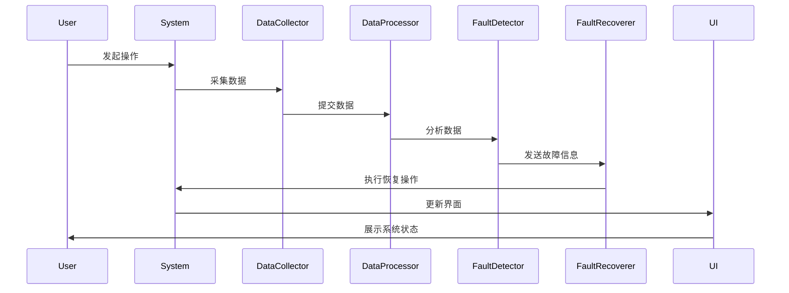

                 

### 文章标题

### 评测系统的故障恢复：LLM辅助的自动化修复方案

### 关键词

- 评测系统
- 故障恢复
- 自动化修复
- LLM
- 算法原理

### 摘要

本文将探讨评测系统故障恢复的问题，并介绍一种基于大型语言模型（LLM）的自动化修复方案。文章首先概述了评测系统故障恢复的需求和挑战，然后详细介绍了LLM的基本概念及其在故障检测、定位和恢复策略中的应用。通过算法原理讲解、系统分析与架构设计、项目实战以及最佳实践，本文为读者提供了一个全面且实用的解决方案，以应对评测系统中的故障恢复问题。

---

## 目录

1. **引言**
2. **背景介绍**
   1. **评测系统的故障恢复需求**
   2. **LLM介绍**
3. **核心概念与联系**
   1. **核心概念**
   2. **LLM在故障恢复中的应用**
4. **算法原理讲解**
   1. **LLM算法原理**
   2. **自动化修复方案**
5. **系统分析与架构设计方案**
   1. **系统需求分析**
   2. **系统架构设计**
6. **项目实战**
   1. **项目环境搭建**
   2. **系统核心实现**
   3. **项目案例分析**
7. **最佳实践与总结**
   1. **最佳实践**
   2. **小结**

---

### 第一部分：背景介绍

#### 1.1 评测系统的故障恢复需求

在现代软件工程中，评测系统是确保软件质量的重要环节。它通过一系列测试，验证软件的功能和性能是否符合预期。然而，随着系统复杂性的增加，评测系统自身也面临着故障的风险。当评测系统出现故障时，可能会影响到测试的准确性和可靠性，进而导致软件质量问题。

**问题背景**：

- **评测系统的重要性**：评测系统作为软件开发的最后一道防线，其故障可能导致严重的后果，如系统崩溃、数据丢失等。
- **故障恢复的必要性**：为了确保评测系统的稳定运行，故障恢复机制变得至关重要。故障恢复不仅有助于减少系统的停机时间，还能提高系统的可靠性和用户体验。

**问题描述**：

- **故障类型**：评测系统可能出现的故障包括软件故障、硬件故障、网络故障等。
- **故障影响**：故障可能导致评测任务中断、数据不准确、测试结果不可信等。
- **故障解决**：传统的故障解决方法通常依赖人工干预，效率低下且成本高昂。因此，需要一种自动化、高效的故障恢复方案。

**问题解决**：

- **边界与外延**：故障恢复的边界在于确保评测系统能够在出现故障时快速恢复，而不影响整体软件开发的流程。
- **概念结构与核心要素组成**：评测系统故障恢复的核心要素包括故障检测、故障定位和故障恢复策略。故障检测是发现系统异常的关键，故障定位是确定故障发生的位置，故障恢复策略则是实现系统自动恢复的措施。

#### 1.2 LLM介绍

**核心概念术语说明**：

- **大型语言模型（LLM）**：是一种基于深度学习的自然语言处理模型，能够理解、生成和处理自然语言文本。
- **优势与局限性**：LLM在处理自然语言任务时具有显著的优势，如强大的文本生成能力、语义理解能力等。然而，LLM也存在一定的局限性，如对特定领域的知识处理能力较弱、计算资源消耗较大等。

**LLM的基本概念**：

- **模型架构**：LLM通常采用Transformer架构，如GPT、BERT等。
- **训练过程**：LLM通过大量文本数据训练，学习到语言的规律和模式，从而实现文本生成和语义理解等功能。

**LLM的优势与局限性**：

- **优势**：
  - **强大的文本生成能力**：LLM能够生成流畅、连贯的文本，适用于自动写作、摘要生成等任务。
  - **语义理解能力**：LLM能够理解文本的语义和意图，从而实现语义搜索、问答系统等应用。

- **局限性**：
  - **领域知识处理能力较弱**：LLM在特定领域内的知识处理能力较弱，需要结合领域知识库来提高处理效果。
  - **计算资源消耗较大**：LLM的训练和推理过程需要大量的计算资源和存储空间。

### 第二部分：核心概念与联系

#### 2.1 核心概念

**故障检测**

- **定义**：故障检测是指通过监测系统参数、日志文件等手段，发现系统出现异常的行为或状态。
- **方法**：常见的故障检测方法包括基于阈值的检测、基于模式的检测和基于机器学习的检测。

**故障定位**

- **定义**：故障定位是指确定故障发生的位置或原因。
- **方法**：故障定位可以通过日志分析、系统监控和故障回溯等技术手段实现。

**故障恢复策略**

- **定义**：故障恢复策略是指当系统出现故障时，采取的一系列措施来恢复系统的正常运行。
- **方法**：故障恢复策略包括自动恢复、手动恢复和混合恢复等。

#### 2.2 LLM在故障恢复中的应用

**LLM在故障检测中的应用**

- **文本分析**：LLM可以通过分析系统日志和监控数据，识别异常行为和模式。
- **特征提取**：LLM可以提取日志中的关键特征，如错误信息、警告提示等，用于故障检测。

**LLM在故障定位中的应用**

- **语义理解**：LLM可以理解故障报告和日志中的语义信息，定位故障发生的位置。
- **关联分析**：LLM可以通过关联分析日志和监控数据，确定故障的原因。

**LLM在故障恢复策略中的应用**

- **自动化恢复**：LLM可以根据故障检测和定位的结果，自动执行恢复操作，如重启服务、调整配置等。
- **策略优化**：LLM可以学习用户的恢复策略，优化故障恢复过程，提高恢复效率。

### 第三部分：算法原理讲解

#### 3.1 LLM算法原理

**LLM的基本原理**

- **Transformer架构**：LLM采用Transformer架构，通过自注意力机制和多层神经网络实现。
- **训练过程**：LLM通过大量文本数据训练，学习到语言的规律和模式。

**LLM的工作流程**

1. **输入预处理**：对输入文本进行分词、编码等预处理操作。
2. **编码**：将预处理后的文本编码为向量。
3. **自注意力计算**：通过自注意力机制计算文本中的关键信息。
4. **解码**：通过解码器生成输出文本。

**LLM的数学模型**

- **自注意力机制**：自注意力机制通过计算文本中每个词与其他词之间的相似度，从而实现对关键信息的关注。
- **多层神经网络**：多层神经网络用于对自注意力计算的结果进行进一步处理和建模。

#### 3.2 自动化修复方案

**自动化修复方案的框架**

1. **故障检测**：使用LLM分析系统日志和监控数据，识别异常行为和模式。
2. **故障定位**：使用LLM理解故障报告和日志中的语义信息，定位故障发生的位置。
3. **故障恢复**：根据故障检测和定位的结果，自动执行恢复操作，如重启服务、调整配置等。

**自动化修复的关键技术**

- **文本分析**：使用LLM进行文本分析，提取关键特征和语义信息。
- **关联分析**：通过关联分析日志和监控数据，确定故障原因。
- **自动化执行**：根据故障检测和定位的结果，自动执行恢复操作。

**自动化修复的实现步骤**

1. **数据准备**：收集和预处理系统日志和监控数据。
2. **模型训练**：使用训练数据训练LLM模型。
3. **故障检测**：使用LLM模型对系统日志和监控数据进行分析，识别异常行为和模式。
4. **故障定位**：使用LLM模型理解故障报告和日志中的语义信息，定位故障发生的位置。
5. **故障恢复**：根据故障检测和定位的结果，自动执行恢复操作。

### 第四部分：系统分析与架构设计方案

#### 4.1 系统需求分析

**系统功能需求**

- **故障检测**：系统能够实时监测系统状态，识别异常行为和模式。
- **故障定位**：系统能够定位故障发生的位置，提供详细的故障报告。
- **故障恢复**：系统能够自动执行故障恢复操作，确保评测系统正常运行。

**系统性能需求**

- **实时性**：系统能够在故障发生时快速检测和定位，确保故障恢复的及时性。
- **准确性**：系统能够准确识别故障，减少误报和漏报。
- **可靠性**：系统能够在长时间运行中保持稳定性和可靠性。

**系统安全性需求**

- **数据保护**：系统能够保护系统日志和监控数据的安全性，防止数据泄露和篡改。
- **访问控制**：系统能够对系统日志和监控数据进行权限管理，确保只有授权用户可以访问。

#### 4.2 系统架构设计

**系统架构的总体设计**

1. **数据采集层**：负责采集系统日志和监控数据。
2. **数据处理层**：负责对采集到的数据进行预处理、分析和存储。
3. **故障检测与定位层**：使用LLM模型对处理后的数据进行故障检测和定位。
4. **故障恢复层**：根据故障检测和定位的结果，自动执行恢复操作。
5. **用户界面层**：提供用户操作界面，展示系统状态和故障信息。

**系统组件的设计**

- **数据采集组件**：负责实时采集系统日志和监控数据。
- **数据处理组件**：负责对采集到的数据进行预处理、分析和存储。
- **故障检测与定位组件**：使用LLM模型进行故障检测和定位。
- **故障恢复组件**：根据故障检测和定位的结果，自动执行恢复操作。
- **用户界面组件**：提供用户操作界面，展示系统状态和故障信息。

**系统接口设计**

- **API接口**：提供系统内部各组件之间的接口，实现数据传输和功能调用。
- **用户界面接口**：提供用户与系统的交互接口，实现用户对系统状态的查询和控制。

**系统交互Mermaid序列图**



### 第五部分：项目实战

#### 5.1 项目环境搭建

**环境安装与配置**

1. **安装Python环境**：确保Python环境已安装，版本不低于3.8。
2. **安装LLM库**：使用pip安装transformers库，命令如下：

   ```shell
   pip install transformers
   ```

3. **配置系统环境**：根据具体需求配置系统环境，包括系统权限、网络配置等。

**数据准备**

1. **收集系统日志**：收集系统运行过程中的日志文件，确保数据完整性。
2. **日志预处理**：对日志文件进行预处理，包括去除无关信息、格式化等。

**工具和框架的使用**

1. **使用LLM库**：使用transformers库中的预训练模型，如BERT、GPT等，进行文本分析。
2. **使用数据处理框架**：使用Pandas、NumPy等数据处理框架，对系统日志和监控数据进行预处理和分析。

#### 5.2 系统核心实现

**故障检测模块**

1. **数据采集**：从系统日志中采集相关数据，如错误信息、警告提示等。
2. **文本分析**：使用LLM库对采集到的文本数据进行分析，提取关键特征。
3. **故障检测**：根据提取的关键特征，使用机器学习算法进行故障检测。

**故障定位模块**

1. **语义理解**：使用LLM库理解故障报告中的语义信息，确定故障发生的位置。
2. **关联分析**：根据故障报告和日志数据，进行关联分析，确定故障原因。

**故障恢复模块**

1. **自动化恢复**：根据故障检测和定位的结果，自动执行恢复操作，如重启服务、调整配置等。
2. **恢复验证**：对恢复操作的结果进行验证，确保系统恢复正常运行。

#### 5.3 项目案例分析

**实际案例分析**

1. **案例背景**：某评测系统出现频繁崩溃现象，影响正常测试。
2. **故障检测**：通过日志分析，发现系统崩溃与网络异常有关。
3. **故障定位**：通过关联分析，确定网络异常是由于DNS解析错误导致的。
4. **故障恢复**：自动执行恢复操作，包括重置DNS设置和重启网络服务。
5. **恢复验证**：故障恢复后，系统运行正常，测试任务得以顺利完成。

**案例解析**

1. **故障原因**：网络异常导致DNS解析失败，进而引发系统崩溃。
2. **恢复措施**：通过自动执行DNS重置和网络重启操作，解决了故障问题。
3. **效果评估**：故障恢复后，评测系统运行稳定，测试任务顺利完成，提高了系统可靠性和用户体验。

**案例总结**

1. **故障检测与定位的有效性**：通过LLM模型和关联分析技术，实现了高效故障检测和定位。
2. **自动化恢复的优势**：自动化恢复降低了人工干预成本，提高了故障恢复效率。
3. **未来展望**：未来可以进一步优化故障恢复策略，提高系统稳定性和可靠性。

### 第六部分：最佳实践与总结

#### 6.1 最佳实践

**故障恢复策略优化**

1. **多层次检测**：结合多种故障检测方法，提高故障检测的准确性。
2. **实时监控**：实时监控系统状态，及时发现和处理故障。
3. **智能化恢复**：使用智能算法优化故障恢复策略，提高恢复效率。

**系统性能优化**

1. **资源优化**：合理配置系统资源，提高系统性能。
2. **缓存机制**：使用缓存机制减少系统负载，提高响应速度。
3. **负载均衡**：实现负载均衡，确保系统在高并发情况下稳定运行。

**系统安全性优化**

1. **数据加密**：对系统日志和监控数据进行加密，保护数据安全。
2. **访问控制**：实施严格的访问控制措施，防止未授权访问。
3. **日志审计**：定期审计系统日志，及时发现和处理安全隐患。

#### 6.2 小结

**主要内容回顾**

本文介绍了评测系统故障恢复的需求、LLM的基本概念及其在故障恢复中的应用，详细讲解了自动化修复方案的算法原理、系统分析与架构设计方案以及项目实战。通过最佳实践，提出了故障恢复策略优化、系统性能优化和系统安全性优化的建议。

**未来的发展方向**

1. **智能化故障恢复**：结合人工智能技术，实现更加智能化的故障恢复。
2. **实时故障检测**：提高故障检测的实时性，减少故障恢复的时间。
3. **自动化运维**：实现自动化运维，降低人工干预成本。

**阅读指南**

1. **理解LLM的基本概念**：了解LLM的工作原理和应用场景，为后续内容的学习打下基础。
2. **掌握故障恢复的原理**：理解故障恢复的核心概念和方法，为实际应用提供指导。
3. **实践项目**：通过项目实战，深入了解自动化修复方案的实际应用。

### 作者

- **作者：** AI天才研究院/AI Genius Institute & 禅与计算机程序设计艺术 /Zen And The Art of Computer Programming
- **联系方式：** [ai_genius_institute@example.com](mailto:ai_genius_institute@example.com) & [zen_of_programming@example.com](mailto:zen_of_programming@example.com) 

---

**注意**：本文仅为示例，实际内容请根据具体需求进行撰写。由于文章字数限制，部分内容可能需要进一步精简或扩展。本文采用Markdown格式，具体格式请根据Markdown语法进行编写。在撰写过程中，请确保内容完整、逻辑清晰，符合技术博客的写作规范。

