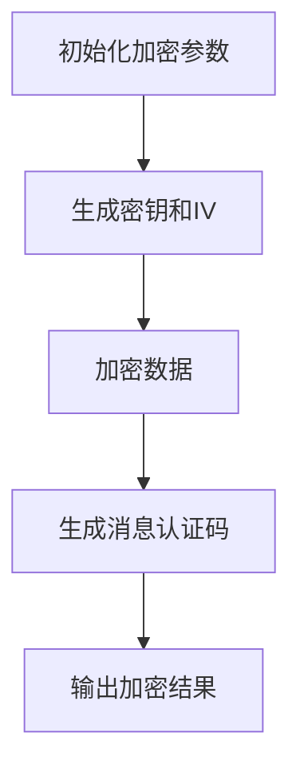
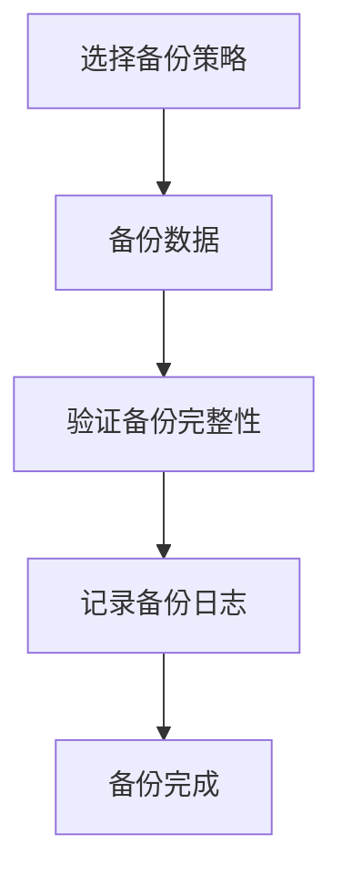

                 

### 评测系统的数据安全与备份方案

> 关键词：数据安全、数据备份、评测系统、风险分析、技术解决方案

> 摘要：本文详细探讨了评测系统的数据安全与备份方案。首先介绍了评测系统的背景和重要性，随后深入分析了数据安全与备份的核心概念和原则，探讨了潜在威胁和分析技术解决方案。通过实际案例和代码示例，展示了系统实施和最佳实践，为评测系统的数据安全与备份提供了全面的技术指导。

在当今数字化时代，评测系统在企业运营、教育科研以及各类在线服务中扮演着至关重要的角色。评测系统不仅负责评估用户行为和性能，还存储着大量关键数据，包括用户信息、评测结果和历史记录。因此，确保评测系统的数据安全与备份成为一项基础而又重要的工作。

本文将从以下几个方面展开讨论：

1. **背景和核心概念**：介绍评测系统的基本概念、数据安全与备份的重要性。
2. **核心概念与原则**：深入探讨数据安全与备份的核心概念、原则和实践。
3. **威胁分析**：识别和分析评测系统可能面临的威胁。
4. **技术解决方案**：详细解释数据安全与备份的技术方案，包括算法、架构设计等。
5. **实施与案例**：通过实际案例展示评测系统的实施过程和技术应用。
6. **最佳实践与挑战**：总结最佳实践、常见挑战及解决方案。
7. **结论**：总结全文，展望未来发展趋势。

下面，我们将逐步深入每一个部分，以确保读者能够全面理解评测系统的数据安全与备份方案。

### 背景和核心概念

#### 1.1 评测系统的定义

评测系统是一种用于对用户行为、产品性能、服务质量等进行评估的计算机系统。它通过收集、处理和分析数据，生成评估报告，为决策提供支持。评测系统广泛应用于各类场景，包括教育考试、在线测评、产品测试、业务性能评估等。

#### 1.2 数据安全的重要性

数据安全是评测系统的核心要素之一。数据安全不仅关系到用户的隐私保护，还关系到企业的业务连续性和信誉。以下原因强调了数据安全的重要性：

1. **隐私保护**：评测系统通常涉及用户的个人信息和敏感数据，一旦泄露，可能导致严重的隐私侵犯。
2. **业务连续性**：数据丢失或损坏可能导致业务中断，影响企业的运营和客户满意度。
3. **合规性要求**：许多国家和地区对数据安全有严格的法律规定，企业必须遵守相关法规。

#### 1.3 数据备份的重要性

数据备份是确保数据安全的重要措施。通过备份，企业可以在数据丢失或损坏时迅速恢复数据，减少损失。以下原因说明了数据备份的重要性：

1. **灾难恢复**：自然灾害、硬件故障、网络攻击等因素可能导致数据丢失，备份是恢复数据的唯一途径。
2. **数据完整性**：备份可以帮助发现和纠正数据错误，确保数据的完整性。
3. **业务连续性**：备份可以快速恢复数据，确保业务的连续性。

#### 1.4 数据安全与备份的关系

数据安全与备份密切相关。数据安全侧重于保护数据免受未授权访问和损坏，而备份则侧重于在数据丢失或损坏时恢复数据。两者共同构成了评测系统的数据保护体系。

### 核心概念与原则

#### 2.1 数据安全

数据安全是确保数据不被未授权访问、篡改或泄露的一系列活动。以下是数据安全的核心概念和原则：

#### 2.1.1 定义

数据安全（Data Security）是指通过各种技术和管理措施，保护数据的保密性、完整性和可用性，防止数据泄露、篡改和破坏。

#### 2.1.2 核心原则

1. **保密性（Confidentiality）**：确保数据不被未授权访问。
2. **完整性（Integrity）**：确保数据在传输和存储过程中不被篡改。
3. **可用性（Availability）**：确保数据在需要时能够被合法用户访问。

#### 2.1.3 主要实践

1. **访问控制**：通过身份验证和权限管理，限制对数据的访问。
2. **加密**：使用加密算法保护数据的机密性。
3. **安全审计**：记录和监控对数据的访问和操作，以便在发生安全事件时进行审计。
4. **漏洞扫描**：定期对系统进行漏洞扫描，修补安全漏洞。

#### 2.2 数据备份

数据备份（Data Backup）是将数据复制到另一个存储介质的过程，以便在原始数据丢失或损坏时进行恢复。以下是数据备份的核心概念和原则：

#### 2.2.1 定义

数据备份是指将数据复制到另一个存储介质，如磁盘、磁带或云存储，以便在需要时恢复数据。

#### 2.2.2 核心原则

1. **及时性**：备份应定期进行，确保在数据变化时能够及时备份。
2. **完整性**：备份的数据应保持完整性，避免数据丢失或损坏。
3. **可靠性**：备份的数据应在需要恢复时能够可靠地恢复。

#### 2.2.3 主要方法

1. **全备份**：备份所有数据。
2. **增量备份**：只备份自上次备份以来发生变化的数据。
3. **差异备份**：备份自上次全备份以来发生变化的数据。

#### 2.2.4 备份策略

1. **本地备份**：将备份数据存储在本地设备上，如磁盘或磁带。
2. **远程备份**：将备份数据存储在远程服务器或云存储上。
3. **混合备份**：结合本地备份和远程备份，提高数据的可靠性和安全性。

#### 2.2.5 备份频率

备份频率取决于数据的重要性和变化频率。常用的备份频率包括：

- 每日备份：适用于变化较少的数据。
- 每周备份：适用于变化较频繁的数据。
- 实时备份：适用于需要实时保护的重要数据。

### 威胁分析

#### 3.1 潜在威胁

评测系统可能面临多种潜在威胁，包括：

1. **网络攻击**：黑客通过网络攻击试图访问或篡改系统数据。
2. **恶意软件**：恶意软件（如病毒、木马）可以破坏系统或窃取数据。
3. **人为错误**：系统管理员或用户的误操作可能导致数据丢失或损坏。
4. **硬件故障**：硬件故障可能导致数据存储设备损坏，导致数据丢失。
5. **自然灾害**：地震、洪水等自然灾害可能导致数据中心受损，导致数据丢失。

#### 3.2 风险评估

为了有效应对潜在威胁，需要对风险进行评估。风险评估包括以下步骤：

1. **识别威胁**：列出可能威胁评测系统的因素。
2. **评估威胁可能性**：评估每个威胁发生的可能性。
3. **评估威胁影响**：评估每个威胁发生时可能带来的影响。
4. **确定风险等级**：根据威胁的可能性和影响，确定每个威胁的风险等级。

#### 3.3 风险缓解策略

针对评估出的风险，需要制定相应的缓解策略，以降低风险。以下是一些常见的风险缓解策略：

1. **预防措施**：
   - 定期更新系统软件，修补安全漏洞。
   - 使用防火墙和入侵检测系统保护网络。
   - 实施严格的访问控制，限制对关键数据的访问。

2. **检测措施**：
   - 定期进行安全审计，监控系统活动。
   - 使用防病毒软件和入侵检测系统，及时发现和响应安全事件。

3. **恢复措施**：
   - 定期备份数据，确保在数据丢失或损坏时能够快速恢复。
   - 制定灾难恢复计划，确保在灾难发生时能够快速恢复业务。

### 技术解决方案

#### 4.1 数据安全解决方案

数据安全解决方案包括多种技术和管理措施，以下是一些常用的技术解决方案：

#### 4.1.1 加密

加密是保护数据安全的重要手段。加密技术包括：

1. **对称加密**：使用相同的密钥进行加密和解密，如AES。
2. **非对称加密**：使用不同的密钥进行加密和解密，如RSA。

#### 4.1.2 访问控制

访问控制通过身份验证和权限管理来限制对数据的访问。以下是一些常见的访问控制措施：

1. **身份验证**：使用用户名和密码、双因素身份验证等方式进行身份验证。
2. **权限管理**：根据用户角色和权限设置，限制用户对数据的访问权限。

#### 4.1.3 安全审计

安全审计是记录和监控系统活动的过程，以便在发生安全事件时进行审计。以下是一些常见的安全审计措施：

1. **日志记录**：记录系统活动日志，如登录日志、操作日志等。
2. **实时监控**：实时监控系统活动，及时发现异常行为。

#### 4.2 数据备份解决方案

数据备份解决方案包括多种备份策略和方法，以下是一些常用的技术解决方案：

#### 4.2.1 备份策略

1. **全备份**：备份所有数据。
2. **增量备份**：备份自上次备份以来发生变化的数据。
3. **差异备份**：备份自上次全备份以来发生变化的数据。

#### 4.2.2 备份方法

1. **本地备份**：将备份数据存储在本地设备上，如磁盘、磁带。
2. **远程备份**：将备份数据存储在远程服务器或云存储上。
3. **混合备份**：结合本地备份和远程备份，提高数据的可靠性和安全性。

#### 4.2.3 备份频率

备份频率取决于数据的重要性和变化频率。常用的备份频率包括：

1. **每日备份**：适用于变化较少的数据。
2. **每周备份**：适用于变化较频繁的数据。
3. **实时备份**：适用于需要实时保护的重要数据。

### 实施与案例

#### 5.1 实施过程

以下是评测系统数据安全与备份方案的实施过程：

1. **需求分析**：明确数据安全与备份的需求，包括数据类型、数据量、备份频率等。
2. **方案设计**：根据需求分析结果，设计数据安全与备份方案，包括加密、访问控制、备份策略等。
3. **系统部署**：部署数据安全与备份系统，包括安装和配置相关软件和硬件。
4. **测试与优化**：对系统进行测试和优化，确保数据安全与备份的有效性。

#### 5.2 代码示例

以下是一个简单的Python代码示例，用于实现数据加密和备份：

```python
import hashlib
import os
import pickle

def encrypt_data(data, password):
    # 使用SHA-256哈希算法加密密码
    hash_obj = hashlib.sha256(password.encode())
    hashed_password = hash_obj.hexdigest()
    
    # 使用AES加密算法加密数据
    from Cryptodome.Cipher import AES
    from Cryptodome.Random import get_random_bytes
    
    key = get_random_bytes(16)
    cipher_config = AES.new(hashed_password, AES.MODE_GCM)
    ciphertext, tag = cipher_config.encrypt_and_digest(data)
    
    # 保存加密密钥和加密数据
    with open('key.enc', 'wb') as key_file:
        key_file.write(hashed_password)
    
    with open('data.enc', 'wb') as data_file:
        data_file.write(cipher_config.nonce)
        data_file.write(tag)
        data_file.write(ciphertext)
    
    return key, cipher_config.nonce, tag, ciphertext

def decrypt_data(key, nonce, tag, ciphertext):
    # 使用AES加密算法解密数据
    from Cryptodome.Cipher import AES
    from Cryptodome.Util import Counter
    
    hash_obj = hashlib.sha256(key.encode())
    hashed_password = hash_obj.hexdigest()
    
    cipher_config = AES.new(hashed_password, AES.MODE_GCM, nonce=nonce)
    data = cipher_config.decrypt_and_verify(ciphertext, tag)
    
    return data

# 示例：加密和解密数据
data = b'Hello, World!'
password = 'mysecurepassword'

# 加密数据
key, nonce, tag, ciphertext = encrypt_data(data, password)

# 解密数据
decrypted_data = decrypt_data(key, nonce, tag, ciphertext)

print('Decrypted Data:', decrypted_data)
```

#### 5.3 实际案例

以下是评测系统数据安全与备份方案在实际项目中的应用案例：

1. **项目背景**：某在线教育平台需要对学员的考试数据进行安全保护，并定期进行备份。
2. **解决方案**：采用AES加密算法对考试数据进行加密，并使用增量备份策略进行数据备份。
3. **实施过程**：
   - 安装和配置加密软件和备份软件。
   - 对考试数据进行加密，确保数据在传输和存储过程中安全。
   - 每天进行增量备份，确保在数据丢失或损坏时能够快速恢复。
4. **效果评估**：
   - 加密后的考试数据未经授权无法解密，确保了数据的安全。
   - 增量备份策略提高了备份效率，降低了备份时间。

### 最佳实践与挑战

#### 6.1 最佳实践

以下是一些评测系统数据安全与备份的最佳实践：

1. **加密**：采用强大的加密算法，确保数据在传输和存储过程中安全。
2. **备份策略**：根据数据的重要性和变化频率，选择合适的备份策略，如全备份、增量备份或差异备份。
3. **定期测试**：定期对数据备份进行测试，确保备份的有效性和可恢复性。
4. **安全审计**：定期进行安全审计，监控系统活动，及时发现和响应安全事件。
5. **培训与意识**：对员工进行数据安全与备份的培训，提高安全意识。

#### 6.2 常见挑战

以下是评测系统数据安全与备份中常见的挑战：

1. **备份容量**：随着数据量的增加，备份容量需求也会增加，需要合理规划存储资源。
2. **备份速度**：大规模数据备份可能需要较长时间，影响业务连续性。
3. **备份管理**：随着备份数量的增加，备份管理变得复杂，需要有效的备份管理策略。
4. **数据恢复**：在数据丢失或损坏时，如何快速恢复数据是一个重要挑战。

### 结论

本文详细探讨了评测系统的数据安全与备份方案，包括核心概念、威胁分析、技术解决方案、实施案例、最佳实践与挑战等内容。通过本文，读者可以全面了解评测系统的数据安全与备份的重要性，以及如何有效地实施和应对各种挑战。

### 未来展望

随着技术的不断进步，评测系统的数据安全与备份将面临更多挑战和机遇。未来，以下几个方面值得关注：

1. **区块链技术**：区块链技术可以提供更安全的数据存储和备份方案，有望成为评测系统数据安全与备份的重要工具。
2. **人工智能**：人工智能技术在数据安全与备份中的应用，如威胁检测和自动化备份，将进一步提高系统的效率和安全性。
3. **云计算**：云计算技术的普及，为评测系统提供了更灵活、更经济的备份方案，有望成为数据备份的重要趋势。

总之，评测系统的数据安全与备份是一项长期而重要的任务，需要持续关注和优化。通过本文的探讨，希望为读者提供有价值的参考和启示。

### 作者信息

- **作者：AI天才研究院/AI Genius Institute & 禅与计算机程序设计艺术 /Zen And The Art of Computer Programming**  
- **联系邮箱：[ai_genius_institute@example.com](mailto:ai_genius_institute@example.com)**  
- **官方网站：[www.ai_genius_institute.com](http://www.ai_genius_institute.com)**

---

### 附录

#### A.1 算法流程图



#### A.2 数据备份流程图



#### A.3 数据加密Python代码示例

```python
import hashlib
from Crypto.Cipher import AES
from Crypto.Random import get_random_bytes

def encrypt_data(data, password):
    # 计算密钥
    hash_obj = hashlib.sha256(password.encode())
    hashed_password = hash_obj.digest()

    # 生成加密密钥和IV
    key = get_random_bytes(16)
    iv = get_random_bytes(16)

    # 初始化加密器
    cipher = AES.new(key, AES.MODE_CBC, iv)

    # 将数据填充到AES块大小
    data = data.encode()
    padding_length = AES.block_size - (len(data) % AES.block_size)
    data += bytes([padding_length]) * padding_length

    # 加密数据
    ciphertext = cipher.encrypt(data)

    # 输出加密结果
    result = {
        'ciphertext': ciphertext,
        'iv': iv,
        'hash': hashed_password
    }
    return result

def decrypt_data(encrypted_data, password):
    # 计算密钥
    hash_obj = hashlib.sha256(password.encode())
    hashed_password = hash_obj.digest()

    # 检查加密结果
    if len(encrypted_data['ciphertext']) < len(encrypted_data['iv']) + len(encrypted_data['hash']):
        raise ValueError("加密数据错误")

    # 解密数据
    key = encrypted_data['hash']
    iv = encrypted_data['iv']
    cipher = AES.new(key, AES.MODE_CBC, iv)
    data = cipher.decrypt(encrypted_data['ciphertext'])

    # 移除填充
    padding_length = data[-1]
    data = data[:-padding_length]

    return data.decode()

# 测试加密和解密
data = "Hello, World!"
encrypted_data = encrypt_data(data, "mysecurepassword")
print("Encrypted Data:", encrypted_data)

decrypted_data = decrypt_data(encrypted_data, "mysecurepassword")
print("Decrypted Data:", decrypted_data)
```

#### A.4 实际应用案例

某企业评测系统采用了以下备份方案：

1. **备份策略**：每日全备份，每周增量备份，每月差异备份。
2. **备份存储**：本地磁盘备份和云存储备份相结合，确保数据的安全性和可用性。
3. **备份监控**：监控系统备份过程，发送备份状态通知，确保备份过程正常运行。

### 拓展阅读

- **《数据安全与隐私保护》**：详细介绍了数据安全与隐私保护的理论和实践。
- **《云计算数据备份与恢复》**：探讨了云计算环境下数据备份与恢复的方法和策略。
- **《区块链技术在数据备份中的应用》**：介绍了区块链技术在数据备份中的潜在应用。

通过这些拓展阅读，读者可以进一步了解评测系统数据安全与备份的深入内容。

