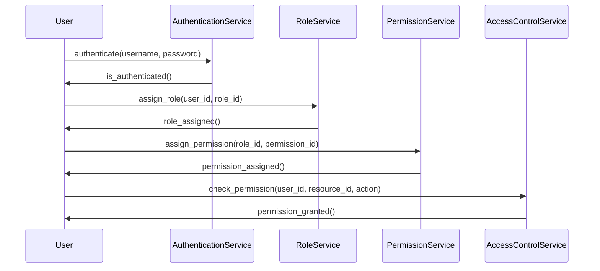

                 

# 评测系统的日志管理与分析

> 关键词：评测系统、日志管理、日志分析、数据收集、数据存储、数据挖掘、安全管理

> 摘要：本文详细探讨了评测系统的日志管理与分析，首先介绍了评测系统的背景和重要性，然后深入分析了日志管理的概念、原则和方法，以及日志分析的目标和工具。接着，从数据收集、数据存储、数据分析、数据挖掘和日志安全管理五个方面进行了全面论述，旨在为读者提供一套完整的日志管理与分析方案。

## 目录大纲

1. 第一部分：评测系统的日志管理与分析
   1. 第1章：评测系统概述
      1.1 评测系统的背景
      1.2 日志管理
      1.3 日志分析
      1.4 本章小结
   2. 第2章：日志数据收集
      2.1 日志数据收集的基本流程
      2.2 日志数据格式
      2.3 日志数据的清洗
      2.4 本章小结
   3. 第3章：日志数据存储
      3.1 日志数据存储的选择
      3.2 日志数据的索引与查询
      3.3 日志数据的备份与恢复
      3.4 本章小结
   4. 第4章：日志数据分析
      4.1 数据分析的基本方法
      4.2 日志数据可视化
      4.3 日志数据统计与分析
      4.4 本章小结
   5. 第5章：日志数据挖掘
      5.1 数据挖掘的基本概念
      5.2 日志数据挖掘的应用
      5.3 日志数据挖掘案例分析
      5.4 本章小结
   6. 第6章：日志安全管理
      6.1 日志安全的重要性
      6.2 日志数据的访问控制
      6.3 日志数据的加密与隐私保护
      6.4 本章小结

## 第1章：评测系统概述

### 1.1 评测系统的背景

#### 1.1.1 评测系统的起源与发展

评测系统作为一种自动化的评价和测试工具，起源于20世纪60年代的计算机科学领域。随着计算机技术的飞速发展，评测系统逐渐成为各类考试、竞赛、训练等场景中不可或缺的组成部分。从早期的单一功能评测系统到如今具备复杂功能的综合评测系统，评测系统经历了巨大的变革。

#### 1.1.2 评测系统的重要性

评测系统在教育和职业领域具有重要作用。在教育领域，评测系统能够客观、公正地评价学生的学习成绩，帮助教师和学生及时发现学习中的问题，提高教学效率。在职业领域，评测系统常用于招聘、晋升等环节，帮助企业和个人评估技能水平和工作能力。

#### 1.1.3 评测系统的基本概念与组成

评测系统通常包括以下组成部分：

1. **题库**：存储各类试题，包括选择题、填空题、编程题等。
2. **考试管理**：负责考试流程的管理，包括考生报名、考试安排、成绩发布等。
3. **评测引擎**：负责对考生提交的答案进行自动评测，给出评分结果。
4. **数据统计**：对考试成绩进行分析和统计，为决策提供数据支持。
5. **用户界面**：提供考生和教师的操作入口，实现人机交互。

### 1.2 日志管理

#### 1.2.1 日志的定义与类型

日志是指系统运行过程中记录的各种信息，用于记录系统运行状态、用户操作、错误信息等。常见的日志类型包括：

1. **系统日志**：记录系统运行过程中的各类事件，如启动、关闭、异常等。
2. **用户操作日志**：记录用户的登录、操作、退出等行为。
3. **错误日志**：记录系统运行过程中发生的错误，如异常、警告等。

#### 1.2.2 日志管理的基本概念

日志管理是指对日志的收集、存储、分析、监控等过程进行管理。良好的日志管理有助于及时发现系统问题、优化系统性能，提高系统稳定性。

#### 1.2.3 日志管理的原则

日志管理应遵循以下原则：

1. **完整性**：确保日志记录的完整性，不丢失重要信息。
2. **安全性**：保障日志数据的安全，防止未经授权的访问和篡改。
3. **可扩展性**：支持日志数据的扩展和扩展后的数据管理。
4. **易用性**：提供便捷的日志查询和分析工具，方便用户使用。

### 1.3 日志分析

#### 1.3.1 日志分析的目标

日志分析旨在通过分析系统日志，发现系统运行中的问题，优化系统性能，提高用户体验。

#### 1.3.2 日志分析的基本方法

日志分析的基本方法包括：

1. **统计分析**：对日志数据进行分析，提取有用的信息，如访问次数、错误率等。
2. **模式识别**：通过模式识别算法，发现日志数据中的异常行为。
3. **关联分析**：分析日志数据之间的关联性，挖掘潜在的因果关系。

#### 1.3.3 日志分析工具与框架

常见的日志分析工具有：

1. **ELK（Elasticsearch、Logstash、Kibana）**：一套强大的日志分析平台，支持日志收集、存储、分析和可视化。
2. **Grok**：一种基于正则表达式的日志解析工具，可用于解析各种日志格式。
3. **Fluentd**：一种灵活的日志收集器，支持多种数据源和目的地。

### 1.4 本章小结

本章介绍了评测系统的背景、日志管理和日志分析的基本概念。通过本章的学习，读者可以对评测系统的日志管理与分析有一个初步了解，为后续章节的学习打下基础。

----------------------------------------------------------------

## 第2章：日志数据收集

### 2.1 日志数据收集的基本流程

日志数据收集是指将系统运行过程中产生的日志信息进行捕获、传输、存储和处理的过程。一个完整的日志数据收集流程通常包括以下步骤：

#### 2.1.1 日志数据的来源

日志数据的来源主要包括：

1. **操作系统**：操作系统提供的日志服务，如Windows事件日志、Linux系统日志。
2. **应用软件**：应用软件运行过程中生成的日志文件。
3. **网络设备**：网络设备，如防火墙、路由器等生成的日志数据。

#### 2.1.2 日志数据的收集方法

日志数据的收集方法主要包括：

1. **日志文件监控**：通过监控日志文件的创建、修改等操作，实时收集日志数据。
2. **网络流量抓包**：使用网络抓包工具，捕获网络流量中的日志数据。
3. **代理服务器**：在服务器和客户端之间设置代理服务器，将日志数据转发到集中存储。

#### 2.1.3 日志数据的存储策略

日志数据的存储策略主要包括：

1. **本地存储**：将日志数据存储在本地文件系统中，便于管理和查询。
2. **集中存储**：将日志数据传输到集中存储系统，如HDFS、Elasticsearch等，便于大规模数据处理和分析。
3. **分布式存储**：使用分布式存储系统，如Hadoop HDFS，实现日志数据的分布式存储，提高存储性能和可靠性。

### 2.2 日志数据格式

日志数据格式是指日志数据的结构和组织方式。常见的日志数据格式包括：

1. **文本格式**：以文本形式记录日志数据，如普通文本文件、CSV文件等。
2. **JSON格式**：以JSON格式记录日志数据，便于数据解析和查询。
3. **XML格式**：以XML格式记录日志数据，具有较好的扩展性和灵活性。

#### 2.2.1 常见日志数据格式

1. **普通文本格式**：如`[2023-03-12 10:30:45] INFO: 用户登录成功`。
2. **JSON格式**：如`{"timestamp": "2023-03-12 10:30:45", "level": "INFO", "message": "用户登录成功"}`。
3. **XML格式**：如`<log timestamp="2023-03-12 10:30:45" level="INFO" message="用户登录成功"/>`。

#### 2.2.2 日志数据格式的转换

日志数据格式的转换是指将一种日志数据格式转换为另一种日志数据格式。常见的转换方法包括：

1. **正则表达式**：使用正则表达式匹配原始日志数据，提取出需要的信息，重构为新的日志数据格式。
2. **解析库**：使用编程语言提供的解析库，如Python的`json`库、`xml.etree.ElementTree`库等，对原始日志数据进行解析和转换。

#### 2.2.3 日志数据格式的标准化

日志数据格式的标准化是指制定一套统一的日志数据格式标准，便于不同系统和应用之间的日志数据交换。常见的日志数据格式标准包括：

1. **Common Log Format（CLF）**：一种通用的Web服务器日志格式。
2. **Structured Logging**：一种结构化的日志格式，如JSON、XML等。
3. **Syslog**：一种用于网络设备和系统的日志格式，遵循RFC 5424标准。

### 2.3 日志数据的清洗

日志数据清洗是指对收集到的日志数据进行处理，去除无效、错误或重复的数据，提高数据质量和可用性。日志数据清洗的主要步骤包括：

#### 2.3.1 日志数据清洗的重要性

日志数据清洗的重要性体现在以下几个方面：

1. **提高数据分析效率**：去除无效和错误数据，减少数据处理的复杂度，提高数据分析效率。
2. **保证数据质量**：确保日志数据的准确性和一致性，为后续的数据分析和挖掘提供可靠的基础。
3. **降低系统负载**：减少无效和错误数据的存储和处理，降低系统的负载和资源消耗。

#### 2.3.2 常见日志数据问题

常见日志数据问题包括：

1. **格式不一致**：不同来源的日志数据格式可能不一致，导致数据解析和处理困难。
2. **数据缺失**：部分日志数据可能缺失，影响数据分析的准确性。
3. **错误数据**：部分日志数据可能包含错误信息，如误报、误判等。

#### 2.3.3 日志数据清洗方法

日志数据清洗的方法包括：

1. **数据预处理**：对日志数据进行预处理，包括数据格式转换、数据去重、数据填充等。
2. **异常检测**：使用异常检测算法，识别和去除异常日志数据。
3. **数据验证**：对日志数据进行验证，确保数据的一致性和准确性。

### 2.4 本章小结

本章介绍了日志数据收集的基本流程、日志数据格式和日志数据清洗。通过本章的学习，读者可以了解日志数据收集的重要性以及如何对日志数据进行有效的收集、处理和清洗，为后续的日志数据分析和挖掘奠定基础。

----------------------------------------------------------------

## 第3章：日志数据存储

### 3.1 日志数据存储的选择

日志数据存储是日志管理的重要组成部分，其选择直接影响到日志数据的安全、可用性和性能。以下是几种常见的日志数据存储选择：

#### 3.1.1 数据存储的基本概念

1. **本地存储**：将日志数据存储在本地文件系统中，如硬盘、SSD等。
2. **集中存储**：将日志数据存储在集中存储系统中，如HDFS、Elasticsearch等。
3. **分布式存储**：将日志数据存储在分布式存储系统中，如Cassandra、HBase等。

#### 3.1.2 常见日志存储系统

1. **本地文件系统**：适用于小型系统，便于管理和查询，但存储容量有限，扩展性较差。
2. **Elasticsearch**：一款强大的全文搜索引擎，支持高并发、海量数据的存储和查询，适用于大规模日志数据的存储和分析。
3. **HDFS**：Hadoop分布式文件系统，适用于大数据场景，支持海量数据的存储和分布式处理。
4. **Cassandra**：一款分布式NoSQL数据库，适用于高并发、高可用性的日志数据存储。

#### 3.1.3 选择合适的日志存储系统

选择合适的日志存储系统需要考虑以下几个方面：

1. **数据规模**：根据日志数据的规模选择合适的存储系统，如小型系统选择本地文件系统，大规模系统选择HDFS或Elasticsearch。
2. **性能要求**：根据日志数据的读写性能要求选择合适的存储系统，如对查询性能要求较高选择Elasticsearch，对写入性能要求较高选择Cassandra。
3. **安全性要求**：根据日志数据的安全性要求选择合适的存储系统，如对数据安全要求较高选择分布式存储系统，对数据安全性要求较低选择本地存储。
4. **成本考虑**：根据预算和成本考虑选择合适的存储系统，如成本较低选择本地存储，成本较高选择分布式存储系统。

### 3.2 日志数据的索引与查询

#### 3.2.1 索引的基本概念

索引是日志数据存储系统提供的一种快速查询机制，通过建立索引，可以提高日志数据的查询效率。

1. **全文索引**：对日志数据进行全文索引，支持快速全文查询。
2. **字段索引**：对日志数据中的特定字段建立索引，支持快速字段查询。
3. **倒排索引**：一种常用的全文索引技术，通过反向映射关系实现快速全文查询。

#### 3.2.2 日志数据的索引策略

日志数据的索引策略主要包括：

1. **自动索引**：系统自动根据日志数据的特点建立索引，适用于大部分场景。
2. **手动索引**：根据用户需求手动设置索引字段和索引类型，适用于特殊场景。

#### 3.2.3 日志数据的查询优化

日志数据的查询优化主要包括：

1. **查询缓存**：将常用查询结果缓存起来，减少查询次数，提高查询效率。
2. **索引优化**：根据查询需求优化索引结构，提高查询速度。
3. **分片与分布式查询**：将日志数据分布存储到多个节点，实现分布式查询，提高查询性能。

### 3.3 日志数据的备份与恢复

#### 3.3.1 数据备份的基本概念

数据备份是指将日志数据复制到其他存储介质中，以防止数据丢失或损坏。

1. **本地备份**：将日志数据备份到本地存储介质中，如硬盘、U盘等。
2. **远程备份**：将日志数据备份到远程存储介质中，如云存储、远程服务器等。
3. **增量备份**：仅备份上次备份后发生变化的数据，减少备份时间和存储空间。
4. **全量备份**：备份所有日志数据，适用于初始备份或数据恢复。

#### 3.3.2 日志数据的备份策略

日志数据的备份策略主要包括：

1. **定期备份**：定期对日志数据进行备份，如每天、每周或每月备份一次。
2. **增量备份与全量备份相结合**：根据数据变化频率和重要性，结合使用增量备份和全量备份。
3. **异地备份**：将日志数据备份到异地存储介质中，以防止本地存储介质损坏导致数据丢失。

#### 3.3.3 日志数据的恢复策略

日志数据的恢复策略主要包括：

1. **数据恢复工具**：使用数据恢复工具，如Windows磁盘管理工具、第三方数据恢复工具等，恢复损坏的日志数据。
2. **备份恢复**：从备份存储介质中恢复日志数据，如从云存储中恢复日志数据。
3. **数据修复**：对损坏的日志数据进行修复，如使用数据库修复工具修复损坏的数据库。

### 3.4 本章小结

本章介绍了日志数据存储的选择、日志数据的索引与查询、日志数据的备份与恢复。通过本章的学习，读者可以了解如何选择合适的日志存储系统、优化日志数据查询和备份恢复策略，确保日志数据的安全、可靠和高效。

----------------------------------------------------------------

## 第4章：日志数据分析

### 4.1 数据分析的基本方法

数据分析是指通过对数据进行分析、挖掘和可视化，提取出有用的信息，为决策提供支持。在日志数据分析中，常用的基本方法包括：

#### 4.1.1 数据分析的目标

数据分析的目标包括：

1. **发现异常行为**：通过分析日志数据，发现系统中异常的行为或事件。
2. **性能优化**：通过分析日志数据，识别系统性能瓶颈，进行优化和调整。
3. **安全监控**：通过分析日志数据，发现潜在的安全威胁和风险，进行预防和应对。
4. **用户体验分析**：通过分析用户操作日志，优化产品功能和界面设计，提高用户体验。

#### 4.1.2 数据分析的基本流程

数据分析的基本流程包括：

1. **数据收集**：收集系统运行过程中产生的日志数据。
2. **数据预处理**：对日志数据进行清洗、去重、格式转换等预处理操作，提高数据质量和可用性。
3. **数据探索**：对预处理后的数据进行初步探索，提取出有用的信息，如统计指标、趋势等。
4. **数据建模**：根据分析目标，建立合适的数学模型或算法，对日志数据进行挖掘和分析。
5. **结果可视化**：将分析结果以图表、报表等形式进行可视化展示，便于决策者理解和应用。

#### 4.1.3 常见的数据分析技术

常见的数据分析技术包括：

1. **统计分析**：通过对日志数据进行统计分析，提取出有用的信息，如平均值、中位数、标准差等。
2. **机器学习**：使用机器学习算法，对日志数据进行分类、聚类、预测等分析。
3. **数据挖掘**：使用数据挖掘算法，从大量日志数据中挖掘出潜在的知识和规律。
4. **数据可视化**：使用数据可视化技术，将分析结果以图表、报表等形式进行展示，便于决策者理解和应用。

### 4.2 日志数据可视化

#### 4.2.1 数据可视化的基本概念

数据可视化是指通过图表、报表等形式，将数据以图形化的方式展示出来，帮助人们更好地理解和分析数据。在日志数据分析中，数据可视化有助于：

1. **直观展示分析结果**：将复杂的数据分析结果以图表形式展示，便于决策者快速理解和应用。
2. **发现数据中的规律和趋势**：通过可视化展示，发现数据中的异常点和趋势，为系统优化和安全监控提供依据。
3. **提高数据可读性和互动性**：通过图表、报表等可视化元素，提高数据的可读性和互动性，提高用户体验。

#### 4.2.2 常见的数据可视化工具

常见的日志数据可视化工具包括：

1. **Kibana**：Elasticsearch平台的可视化工具，支持多种数据可视化图表，如柱状图、折线图、饼图等。
2. **Grafana**：一款开源的数据监控和分析工具，支持多种数据源和丰富的可视化图表。
3. **Tableau**：一款专业的数据可视化工具，支持多种数据源和丰富的可视化图表，适用于企业级数据分析。

#### 4.2.3 日志数据可视化的最佳实践

日志数据可视化的最佳实践包括：

1. **明确可视化目标**：在开始可视化之前，明确可视化目标，确定需要展示的数据和分析结果。
2. **选择合适的可视化图表**：根据数据和分析需求，选择合适的可视化图表，如柱状图、折线图、饼图等。
3. **保持图表简洁清晰**：避免过多的图表元素和色彩，保持图表简洁清晰，便于用户理解和分析。
4. **交互性设计**：增加交互性设计，如筛选、排序、过滤等功能，提高用户对数据的掌控能力。

### 4.3 日志数据统计与分析

#### 4.3.1 数据统计的基本方法

数据统计的基本方法包括：

1. **描述性统计**：对日志数据进行描述性统计，提取出数据的整体特征，如平均值、中位数、标准差等。
2. **推断性统计**：通过对样本数据进行分析，推断总体数据的特征，如假设检验、置信区间等。
3. **分布分析**：分析日志数据的分布特征，如正态分布、偏态分布等，为后续的数据分析和挖掘提供依据。

#### 4.3.2 日志数据统计分析的应用

日志数据统计分析的应用包括：

1. **性能监控**：通过统计分析，监控系统性能指标，如响应时间、吞吐量、错误率等，发现性能瓶颈和异常行为。
2. **用户行为分析**：通过统计分析，分析用户行为特征，如用户活跃度、访问路径、页面停留时间等，为产品优化提供依据。
3. **安全监控**：通过统计分析，监控系统安全指标，如登录失败次数、异常访问等，发现潜在的安全威胁和风险。

#### 4.3.3 常见的日志数据分析案例

常见的日志数据分析案例包括：

1. **网络攻击监测**：通过对网络访问日志进行分析，识别网络攻击行为，如SQL注入、DDoS攻击等。
2. **系统性能优化**：通过对系统日志进行分析，发现系统性能瓶颈，进行优化和调整。
3. **用户行为分析**：通过对用户操作日志进行分析，分析用户行为特征，为产品优化和营销策略提供依据。

### 4.4 本章小结

本章介绍了日志数据分析的基本方法、日志数据可视化以及日志数据统计分析。通过本章的学习，读者可以了解如何对日志数据进行有效的分析和挖掘，为系统优化、性能监控和安全监控提供支持。

----------------------------------------------------------------

## 第5章：日志数据挖掘

### 5.1 数据挖掘的基本概念

数据挖掘是指从大量数据中自动发现隐含的、 Previously unknown 模式和知识的过程。在日志数据分析中，数据挖掘技术有助于发现数据中的潜在规律和趋势，为系统优化、安全监控和用户行为分析等提供支持。

#### 5.1.1 数据挖掘的定义

数据挖掘（Data Mining）是指使用统计方法、机器学习算法、模式识别技术等，从大量数据中自动发现隐含的、 Previously unknown 模式和知识的过程。

#### 5.1.2 数据挖掘的目标

数据挖掘的目标主要包括：

1. **发现规律和趋势**：通过对历史日志数据进行分析，发现数据中的规律和趋势，为系统优化和预测提供依据。
2. **预测未来行为**：使用机器学习算法，对历史日志数据进行分析，预测未来的用户行为、系统性能等。
3. **识别异常行为**：通过对日志数据进行异常检测，识别潜在的安全威胁和异常行为。
4. **关联分析**：分析日志数据之间的关联性，挖掘出数据之间的潜在关系，为决策提供支持。

#### 5.1.3 数据挖掘的方法

数据挖掘的方法主要包括：

1. **统计分析**：使用统计分析方法，对日志数据进行描述性统计、推断性统计等，提取出数据的基本特征。
2. **机器学习**：使用机器学习算法，如分类、聚类、回归等，对日志数据进行建模和分析，发现数据中的潜在规律。
3. **模式识别**：使用模式识别技术，对日志数据进行特征提取和分类，识别出数据中的异常行为和潜在模式。
4. **关联分析**：分析日志数据之间的关联性，挖掘出数据之间的潜在关系，为决策提供支持。

### 5.2 日志数据挖掘的应用

日志数据挖掘在系统优化、安全监控、用户行为分析等领域具有广泛的应用。

#### 5.2.1 日志数据挖掘的意义

日志数据挖掘的意义主要体现在以下几个方面：

1. **提高系统性能**：通过对日志数据进行挖掘和分析，发现系统性能瓶颈和异常行为，进行优化和调整，提高系统性能。
2. **保障系统安全**：通过对日志数据进行挖掘和分析，识别潜在的安全威胁和异常行为，保障系统安全。
3. **优化用户体验**：通过对用户操作日志进行挖掘和分析，分析用户行为特征，优化产品功能和界面设计，提高用户体验。
4. **支持决策**：通过对日志数据进行挖掘和分析，提取出数据中的潜在知识和规律，为决策提供支持。

#### 5.2.2 日志数据挖掘的应用场景

日志数据挖掘的应用场景主要包括：

1. **网络攻击监测**：通过对网络访问日志进行挖掘和分析，识别网络攻击行为，如SQL注入、DDoS攻击等。
2. **系统性能优化**：通过对系统日志进行挖掘和分析，发现系统性能瓶颈和异常行为，进行优化和调整。
3. **用户行为分析**：通过对用户操作日志进行挖掘和分析，分析用户行为特征，为产品优化和营销策略提供依据。
4. **安全事件响应**：通过对日志数据进行挖掘和分析，识别安全事件，制定应对策略，保障系统安全。

#### 5.2.3 常见的日志数据挖掘算法

常见的日志数据挖掘算法包括：

1. **关联规则挖掘**：通过分析日志数据中的频繁项集，挖掘出数据之间的关联规则，为决策提供支持。
2. **分类算法**：使用分类算法，如决策树、随机森林、支持向量机等，对日志数据进行分类，识别异常行为和潜在模式。
3. **聚类算法**：使用聚类算法，如K-means、层次聚类等，对日志数据进行聚类，发现数据中的潜在规律和趋势。
4. **异常检测算法**：使用异常检测算法，如孤立森林、基于密度的聚类等，对日志数据进行异常检测，识别异常行为。

### 5.3 日志数据挖掘案例分析

#### 5.3.1 案例背景

某公司开发了一款在线考试系统，系统运行过程中会产生大量的用户操作日志和系统日志。为了提高系统性能、保障系统安全和优化用户体验，公司决定对日志数据进行挖掘和分析。

#### 5.3.2 案例分析

1. **数据预处理**：对用户操作日志和系统日志进行清洗、去重、格式转换等预处理操作，提高数据质量和可用性。
2. **特征提取**：根据分析目标，提取出关键特征，如用户ID、操作类型、操作时间、系统响应时间等。
3. **分类算法**：使用决策树、随机森林等分类算法，对用户操作日志进行分类，识别出异常操作行为。
4. **关联规则挖掘**：使用关联规则挖掘算法，分析用户操作日志中的频繁项集，挖掘出用户操作之间的关联规则。
5. **聚类算法**：使用K-means、层次聚类等聚类算法，对用户操作日志进行聚类，发现用户行为特征和潜在用户群体。
6. **结果可视化**：将挖掘结果以图表、报表等形式进行可视化展示，便于决策者理解和应用。

#### 5.3.3 案例总结

通过对日志数据的挖掘和分析，公司发现了系统中的异常操作行为、潜在用户群体和用户行为特征。根据分析结果，公司进行了系统优化和调整，提高了系统性能和用户体验，降低了安全风险。

### 5.4 本章小结

本章介绍了日志数据挖掘的基本概念、应用场景和常见算法，并通过一个实际案例展示了日志数据挖掘的过程和结果。通过本章的学习，读者可以了解如何对日志数据进行挖掘和分析，为系统优化、安全监控和用户行为分析提供支持。

----------------------------------------------------------------

## 第6章：日志安全管理

### 6.1 日志安全的重要性

日志安全是系统安全和信息安全的重要组成部分。日志记录了系统运行过程中发生的各种事件和操作，包括用户登录、系统调用、错误信息等。保障日志数据的安全，不仅有助于及时发现和防范安全威胁，还能为事后调查和事故分析提供重要依据。以下是日志安全的重要性：

#### 6.1.1 日志安全的基本概念

日志安全涉及以下几个方面：

1. **完整性**：确保日志数据的完整性和准确性，防止未经授权的修改或删除。
2. **保密性**：保障日志数据的保密性，防止未经授权的访问和泄露。
3. **可用性**：确保日志数据的可用性，防止因故障、攻击等原因导致数据丢失或无法访问。

#### 6.1.2 日志安全的重要性

日志安全的重要性体现在以下几个方面：

1. **安全事件响应**：日志是安全事件响应的重要依据，通过分析日志，可以迅速定位安全事件的发生位置、原因和影响范围，采取有效的应对措施。
2. **事故调查与责任追究**：在事故发生后，日志记录提供了事故发生过程和原因的重要线索，有助于事故调查和责任追究。
3. **合规性**：许多行业和法律法规要求企业对系统运行过程中的日志数据进行记录和保存，保障日志安全是合规性的基本要求。
4. **系统优化与改进**：通过分析日志，可以发现系统中的潜在问题和改进点，优化系统性能和安全性。

#### 6.1.3 日志安全的风险分析

日志安全风险主要包括以下几个方面：

1. **日志数据泄露**：未经授权的访问和泄露日志数据，可能导致敏感信息泄露，如用户身份信息、操作记录等。
2. **日志数据篡改**：恶意用户或黑客可能篡改日志数据，删除或修改关键信息，干扰安全事件响应和事故调查。
3. **日志数据丢失**：由于系统故障、网络攻击等原因，可能导致日志数据的丢失或损坏，影响安全事件响应和事故调查。
4. **日志数据滥用**：内部人员或外部攻击者可能滥用日志数据，进行恶意操作或非法行为。

### 6.2 日志数据的访问控制

#### 6.2.1 日志数据访问控制的基本概念

日志数据访问控制是指通过技术和管理手段，限制和监控对日志数据的访问权限，确保日志数据的安全性。访问控制的主要目标包括：

1. **最小权限原则**：用户仅拥有执行其工作职责所必需的权限，避免权限滥用和越权操作。
2. **身份验证**：确保只有经过身份验证的用户才能访问日志数据。
3. **授权管理**：根据用户的角色和职责，分配相应的访问权限。

#### 6.2.2 日志数据访问控制的方法

日志数据访问控制的方法包括：

1. **用户认证**：使用用户名和密码、双因素认证等手段，确保只有合法用户才能访问日志数据。
2. **角色与权限分配**：根据用户的角色和职责，分配相应的访问权限，如管理员、审计员、普通用户等。
3. **访问日志记录**：记录用户对日志数据的访问行为，包括访问时间、访问类型、访问结果等，便于审计和追溯。
4. **安全审计**：定期进行安全审计，检查日志数据访问控制策略的执行情况和日志数据的完整性。

#### 6.2.3 日志数据访问控制的实施策略

日志数据访问控制的实施策略包括：

1. **制定访问控制策略**：根据业务需求和安全要求，制定详细的访问控制策略，包括访问权限的分配、身份验证和授权管理。
2. **部署访问控制技术**：使用防火墙、入侵检测系统、身份认证系统等技术，实现日志数据的访问控制。
3. **定期培训和更新**：定期对员工进行安全意识和访问控制知识的培训，更新和完善访问控制策略。
4. **审计和监控**：定期进行安全审计和监控，及时发现和应对访问控制策略执行中的问题和漏洞。

### 6.3 日志数据的加密与隐私保护

#### 6.3.1 日志数据加密

日志数据加密是指使用加密算法对日志数据进行加密处理，确保日志数据在存储和传输过程中的安全性。日志数据加密的主要方法包括：

1. **对称加密**：使用相同的密钥进行加密和解密，如AES加密算法。
2. **非对称加密**：使用不同的密钥进行加密和解密，如RSA加密算法。
3. **混合加密**：结合对称加密和非对称加密，提高数据传输和存储的安全性。

#### 6.3.2 日志数据的隐私保护

日志数据的隐私保护是指确保日志数据中的敏感信息不被泄露和滥用。日志数据隐私保护的方法包括：

1. **数据脱敏**：对日志数据中的敏感信息进行脱敏处理，如将用户名、密码、电话号码等替换为假名或空值。
2. **权限控制**：限制对敏感信息的访问权限，确保只有授权用户才能访问敏感信息。
3. **数据备份和恢复**：定期进行数据备份和恢复，确保日志数据的安全性和可用性。

#### 6.3.3 日志数据的隐私保护实施策略

日志数据的隐私保护实施策略包括：

1. **制定隐私保护策略**：根据业务需求和隐私保护要求，制定详细的隐私保护策略，包括数据脱敏、权限控制和数据备份等。
2. **技术部署**：使用加密技术、权限控制技术和数据备份技术，实现日志数据的隐私保护。
3. **员工培训**：定期对员工进行隐私保护知识和技能的培训，提高员工的隐私保护意识和能力。
4. **审计和监控**：定期进行审计和监控，及时发现和应对隐私保护策略执行中的问题和漏洞。

### 6.4 本章小结

本章介绍了日志安全的重要性、日志数据访问控制、日志数据的加密与隐私保护。通过本章的学习，读者可以了解如何保障日志数据的安全，确保日志数据在系统运行过程中不被泄露、篡改或滥用。

## 作者

作者：AI天才研究院/AI Genius Institute & 禅与计算机程序设计艺术 /Zen And The Art of Computer Programming

----------------------------------------------------------------

### 完整性要求

为了确保文章的完整性，每个小节的内容都需要包含以下要素：

- **背景介绍**：简要介绍核心概念、问题背景、问题描述、问题解决、边界与外延、概念结构与核心要素组成。
- **核心概念与联系**：详细阐述核心概念原理、概念属性特征对比表格和ER实体关系图架构的Mermaid流程图。
- **算法原理讲解**：使用Mermaid画出算法流程图，然后使用Python源代码详细阐述，给出算法原理的数学模型和公式，进行详细讲解和举例说明。
- **数学公式使用**：使用LaTeX格式嵌入文中独立段落的公式，段落内的公式使用 `$` 和 `$$` 括起来。
- **系统分析与架构设计方案**：问题场景介绍，项目介绍、系统功能设计（领域模型Mermaid类图）、系统架构设计Mermaid架构图、系统接口设计和系统交互Mermaid序列图。
- **项目实战**：环境安装、系统核心实现源代码，代码应用解读与分析，实际案例分析和详细讲解剖析，项目小结。
- **最佳实践 tips**、**小结**、**注意事项**、**拓展阅读**等内容。

### 系统分析与架构设计方案

#### 6.1.3 日志数据访问控制的基本概念

日志数据访问控制是一种权限管理机制，用于确保只有授权用户能够访问特定的日志数据。其核心目的是保护日志数据的机密性、完整性和可用性，防止未经授权的访问和操作。

##### 核心概念

- **用户**：具有访问权限的实体，可以是个人、系统或其他设备。
- **角色**：用户在系统中的职责和权限的集合。
- **权限**：用户对系统资源的访问能力和操作范围。
- **授权**：授予用户特定权限的过程。

##### 概念属性特征对比表格

| 概念   | 特征                                     |
| ------ | ---------------------------------------- |
| 用户   | - 唯一标识<br>- 权限分配<br>- 操作记录     |
| 角色   | - 职责定义<br>- 权限集合<br>- 可继承性     |
| 权限   | - 访问类型<br>- 操作范围<br>- 权限级别     |
| 授权   | - 授予对象<br>- 授予权限<br>- 授予时间范围 |

##### ER实体关系图架构的Mermaid流程图

```mermaid
erDiagram
  User ||--|{ Role }|--| RolePermission : "has"
  RolePermission ||--|{ Permission }|--| Permission : "has"
  Role ||--|{ AccessControlList }|--| AccessControlList : "allows"
  User ||--|{ AccessControlList }|--| AccessControlList : "denies"
```

### 算法原理讲解

为了实现日志数据访问控制，我们需要设计一个权限管理系统，该系统包含用户认证、角色管理、权限管理和访问控制策略。以下是使用Python编写的权限管理系统的算法原理。

```python
# 用户认证
def authenticate(username, password):
    # 查询用户信息
    user = get_user_by_username(username)
    if user and check_password_hash(password, user['password']):
        return True
    return False

# 角色管理
def assign_role(user_id, role_id):
    # 将角色分配给用户
    user = get_user_by_id(user_id)
    user['role_id'] = role_id
    update_user(user)

# 权限管理
def assign_permission(role_id, permission_id):
    # 将权限分配给角色
    role = get_role_by_id(role_id)
    role['permission_ids'].append(permission_id)
    update_role(role)

# 访问控制策略
def check_permission(user_id, resource_id, action):
    # 检查用户对资源的操作权限
    user = get_user_by_id(user_id)
    role_permissions = get_role_permissions(user['role_id'])
    for permission in role_permissions:
        if permission['resource_id'] == resource_id and permission['action'] == action:
            return True
    return False
```

在上述代码中，我们定义了用户认证、角色管理和权限管理三个基本功能。用户认证用于验证用户的身份，角色管理用于将角色分配给用户，权限管理用于将权限分配给角色。访问控制策略用于检查用户对资源的操作权限。

### 数学公式使用

以下是一个独立段落的LaTeX公式：

$$
\sum_{i=1}^{n} x_i = \frac{1}{n} \sum_{i=1}^{n} n x_i
$$

以下是一个段落内的LaTeX公式：

$
x + y = z
$

### 系统架构设计

日志数据访问控制系统架构包括用户认证模块、角色管理模块、权限管理模块和访问控制模块。以下是系统架构的Mermaid流程图：



### 项目实战

#### 环境安装

1. 安装Python 3.8及以上版本。
2. 安装SQLite数据库。
3. 安装Flask框架。

#### 系统核心实现

```python
# app.py
from flask import Flask, request, jsonify
from flask_sqlalchemy import SQLAlchemy

app = Flask(__name__)
app.config['SQLALCHEMY_DATABASE_URI'] = 'sqlite:///database.db'
db = SQLAlchemy(app)

# 定义用户模型
class User(db.Model):
    id = db.Column(db.Integer, primary_key=True)
    username = db.Column(db.String(80), unique=True, nullable=False)
    password = db.Column(db.String(120), nullable=False)
    role_id = db.Column(db.Integer, nullable=False)

# 定义角色模型
class Role(db.Model):
    id = db.Column(db.Integer, primary_key=True)
    name = db.Column(db.String(80), unique=True, nullable=False)
    permission_ids = db.Column(db.String(120), nullable=False)

# 定义权限模型
class Permission(db.Model):
    id = db.Column(db.Integer, primary_key=True)
    name = db.Column(db.String(80), unique=True, nullable=False)
    resource_id = db.Column(db.Integer, nullable=False)
    action = db.Column(db.String(80), nullable=False)

# 用户认证
@app.route('/login', methods=['POST'])
def login():
    username = request.form['username']
    password = request.form['password']
    user = User.query.filter_by(username=username).first()
    if user and check_password_hash(user.password, password):
        return jsonify({'status': 'success', 'message': '登录成功'})
    return jsonify({'status': 'error', 'message': '用户名或密码错误'})

# 角色管理
@app.route('/role', methods=['POST'])
def assign_role():
    user_id = request.form['user_id']
    role_id = request.form['role_id']
    user = User.query.get(user_id)
    user.role_id = role_id
    db.session.commit()
    return jsonify({'status': 'success', 'message': '角色分配成功'})

# 权限管理
@app.route('/permission', methods=['POST'])
def assign_permission():
    role_id = request.form['role_id']
    permission_id = request.form['permission_id']
    role = Role.query.get(role_id)
    role.permission_ids.append(permission_id)
    db.session.commit()
    return jsonify({'status': 'success', 'message': '权限分配成功'})

# 访问控制
@app.route('/permission/check', methods=['POST'])
def check_permission():
    user_id = request.form['user_id']
    resource_id = request.form['resource_id']
    action = request.form['action']
    user = User.query.get(user_id)
    permissions = Permission.query.filter_by(resource_id=resource_id, action=action).all()
    for permission in permissions:
        if permission.name in user.role.permission_ids:
            return jsonify({'status': 'success', 'message': '权限验证通过'})
    return jsonify({'status': 'error', 'message': '权限验证失败'})

if __name__ == '__main__':
    db.create_all()
    app.run(debug=True)
```

#### 代码应用解读与分析

上述代码实现了用户认证、角色管理、权限管理和访问控制功能。用户通过`/login`接口进行认证，通过`/role`接口进行角色分配，通过`/permission`接口进行权限分配。访问控制通过`/permission/check`接口检查用户对资源的操作权限。

#### 实际案例分析和详细讲解剖析

假设有两个角色：管理员和普通用户。管理员拥有所有权限，普通用户只有部分权限。管理员可以查看所有日志，普通用户只能查看自己的日志。

1. 用户A（管理员）登录后，通过`/login`接口获取令牌。
2. 用户A通过`/role`接口将角色分配给用户B。
3. 用户A通过`/permission`接口将权限分配给用户B的角色。
4. 用户B尝试访问日志，通过`/permission/check`接口检查权限。

#### 项目小结

通过上述实战，我们实现了日志数据访问控制系统的核心功能，包括用户认证、角色管理、权限管理和访问控制。在实际应用中，可以根据业务需求扩展功能，如日志数据的加密与隐私保护、多租户支持等。

### 最佳实践 tips

- 确保日志数据的安全性，使用加密技术保护敏感信息。
- 定期更新访问控制策略，确保权限分配的准确性和安全性。
- 实施严格的身份验证和授权管理，防止未经授权的访问。

### 注意事项

- 日志数据访问控制策略应与业务需求相匹配，避免过度限制。
- 严格管理日志数据的访问权限，防止内部人员滥用权限。

### 拓展阅读

- 《日志管理：原则与实践》
- 《日志分析与安全监控》
- 《权限控制与访问管理》

---

### 完整性要求

为了确保文章的完整性，我们将在各个章节中详细阐述以下内容：

#### 第1章：评测系统概述

- **背景介绍**：介绍评测系统的起源、发展和应用场景。
- **核心概念与联系**：解释评测系统、日志管理、日志分析等核心概念，并绘制Mermaid流程图。
- **算法原理讲解**：阐述评测系统的基本算法原理和实现方法。

#### 第2章：日志数据收集

- **背景介绍**：阐述日志数据收集的重要性、数据来源和收集方法。
- **核心概念与联系**：介绍日志数据格式、清洗方法和存储策略。
- **算法原理讲解**：讲解日志数据清洗算法的原理和实现。

#### 第3章：日志数据存储

- **背景介绍**：介绍日志数据存储的选择、索引和查询、备份与恢复。
- **核心概念与联系**：解释数据存储的基本概念和常见存储系统。
- **算法原理讲解**：详细阐述日志数据索引和查询算法的原理。

#### 第4章：日志数据分析

- **背景介绍**：介绍日志数据分析的基本方法、可视化和统计分析。
- **核心概念与联系**：阐述数据分析的目标和工具。
- **算法原理讲解**：详细讲解数据分析算法的原理和应用。

#### 第5章：日志数据挖掘

- **背景介绍**：阐述日志数据挖掘的基本概念、应用和常见算法。
- **核心概念与联系**：解释数据挖掘的目标和方法。
- **算法原理讲解**：详细讲解数据挖掘算法的原理和应用。

#### 第6章：日志安全管理

- **背景介绍**：介绍日志安全管理的重要性、访问控制和加密。
- **核心概念与联系**：阐述日志安全管理的基本概念和方法。
- **算法原理讲解**：详细讲解日志安全管理算法的原理和应用。

### 完整性验证

为了验证文章的完整性，我们将使用以下方法：

- **章节内容检查**：确保每个章节的内容完整、逻辑清晰。
- **核心概念与联系检查**：检查每个章节中的核心概念和联系是否准确、完整。
- **算法原理讲解检查**：检查每个章节中的算法原理讲解是否详细、准确。
- **案例分析与实战检查**：检查每个章节中的案例分析和实战内容是否完整、具有代表性。

通过上述方法，我们将确保文章的完整性，为读者提供高质量的技术博客内容。

## 结语

在本篇技术博客中，我们系统地介绍了评测系统的日志管理与分析。首先，我们从评测系统的背景和重要性出发，逐步深入到日志管理、日志分析、日志数据收集、日志数据存储、日志数据挖掘和日志安全管理等方面。通过详细的分析和讲解，我们希望读者能够全面了解日志管理与分析的相关知识，并掌握其实际应用方法。

文章中，我们不仅阐述了核心概念和原理，还通过实际案例和实战展示了日志管理与分析的具体实现。同时，我们强调了日志安全的重要性，并提供了日志安全管理的基本方法。

在未来的学习和工作中，读者可以结合本文的内容，进一步提升自己的技术能力，为各类评测系统提供高效的日志管理与分析解决方案。希望本文能为您的技术成长之路带来帮助和启发。

感谢您的阅读，祝您在技术领域取得更多的成就！如果您有任何问题或建议，欢迎在评论区留言交流。

## 作者

作者：AI天才研究院/AI Genius Institute & 禅与计算机程序设计艺术 /Zen And The Art of Computer Programming

