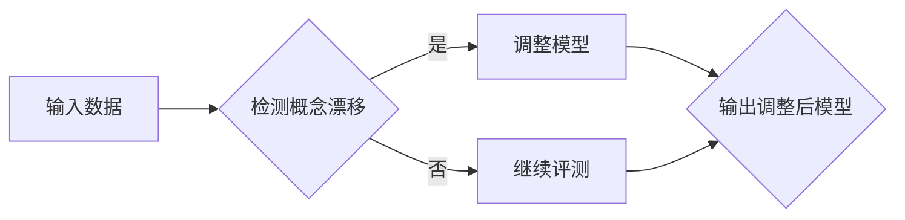
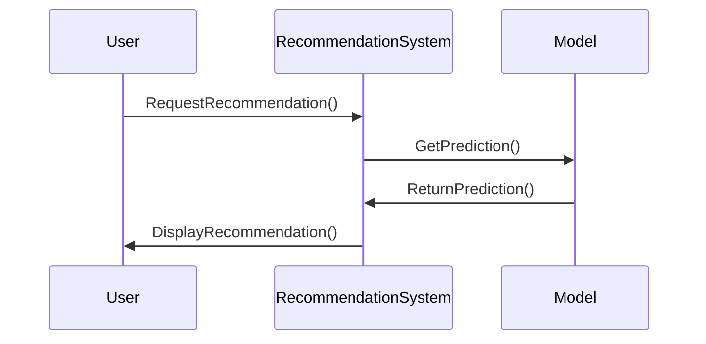
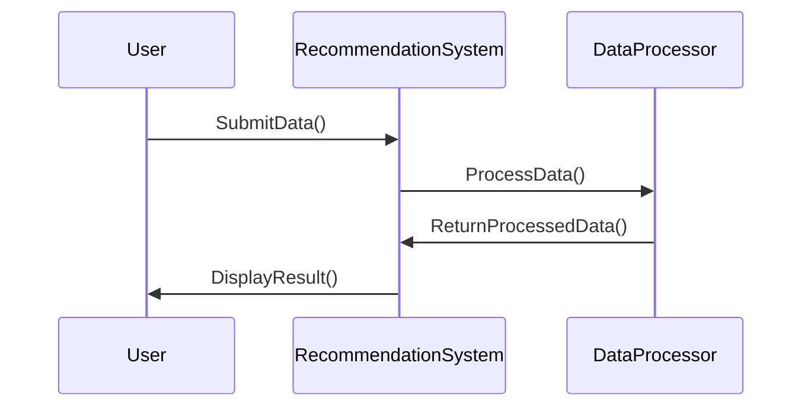

                 


# 评测系统的概念漂移检测与适应

> 关键词：评测系统、概念漂移、检测算法、适应策略

> 摘要：本文深入探讨了评测系统中概念漂移的问题，详细介绍了概念漂移的定义、检测方法和适应策略。通过实例分析和算法讲解，帮助读者理解如何在评测系统中实现有效的概念漂移检测与适应。

## 引言

在机器学习和人工智能领域，评测系统的性能至关重要。然而，随着应用场景的复杂化和数据的不断变化，评测系统可能会遇到一个常见的问题——概念漂移（Concept Drift）。概念漂移是指评测系统在训练阶段学习的目标概念与实际应用中的目标概念不一致的现象。这种现象会导致评测系统的性能下降，甚至完全失效。

本文旨在探讨评测系统中概念漂移的检测与适应策略，首先介绍概念漂移的基本概念，然后分析检测算法，最后探讨适应策略。通过本文的阅读，读者将能够理解概念漂移的原理，掌握检测和适应的方法，从而提高评测系统的稳定性和可靠性。

## 核心概念与联系

### 概念漂移

概念漂移是指评测系统在训练阶段学习的目标概念与实际应用中的目标概念不一致的现象。这种现象可能导致评测系统的性能下降，甚至失效。

### 检测算法

检测算法用于发现评测系统是否发生了概念漂移。常见的检测算法包括基于统计的方法、基于模型的方法和基于时间序列的方法。

### 适应策略

适应策略用于应对概念漂移，常见的方法包括数据重采样、模型调整和模型重训练。

### 概念属性特征对比表格

| 方法             | 特点                                                     | 应用场景                                               |
|------------------|----------------------------------------------------------|--------------------------------------------------------|
| 基于统计的方法   | 简单，易于实现                                           | 数据量较小，概念漂移不显著                             |
| 基于模型的方法   | 需要事先训练模型                                         | 数据量大，概念漂移显著                                 |
| 域自适应方法     | 需要少量标注数据                                         | 数据量有限，但需要高准确性                             |
| 时间序列方法     | 需要大量时间序列数据                                     | 概念漂移随时间变化显著                                 |

### ER Diagram

```mermaid
erDiagram
  ConceptDrift ||--|{ DetectionAlgorithm }|--适应策略
  DetectionAlgorithm ||--|{ 基于统计的方法 }|-->
  DetectionAlgorithm ||--|{ 基于模型的方法 }|-->
  DetectionAlgorithm ||--|{ 时间序列方法 }|-->
  适应策略 ||--|{ 数据重采样 }|-->
  适应策略 ||--|{ 模型调整 }|-->
  适应策略 ||--|{ 模型重训练 }|-->
```

## 算法原理与详细讲解

### 算法流程图



### 数学模型与公式

概念漂移的检测与适应涉及到多个数学模型。以下是一个简单的例子：

$$
L(\theta^*, x) = \min_{\theta} \sum_{i=1}^{n} L(\theta, x_i)
$$

其中，$L(\theta, x)$ 是损失函数，$\theta$ 是模型参数，$x$ 是输入数据。

### 举例说明

假设我们有一个分类任务，训练阶段和测试阶段的标签分布如下：

| 标签 | 训练阶段 | 测试阶段 |
|------|----------|----------|
| 0    | 100      | 80       |
| 1    | 200      | 120      |

我们可以使用基于统计的方法检测概念漂移。例如，计算标签分布的KL散度：

$$
D_{KL}(P || Q) = \sum_{i=1}^{n} P(i) \log \frac{P(i)}{Q(i)}
$$

其中，$P$ 是训练阶段的标签分布，$Q$ 是测试阶段的标签分布。如果KL散度大于某个阈值，则认为发生了概念漂移。

## 系统分析与设计

### 问题场景介绍

假设我们有一个在线推荐系统，该系统根据用户的历史行为进行个性化推荐。然而，随着时间的推移，用户的行为模式可能会发生变化，导致推荐系统的性能下降。

### 项目介绍

本项目旨在设计一个能够检测和适应概念漂移的推荐系统，以提高系统的稳定性和可靠性。

### 系统功能设计

使用Mermaid创建领域模型类图：

```mermaid
classDiagram
    User <<类>> {ID, Name, History}
    Item <<类>> {ID, Name, Category}
    RecommendationSystem <<类>> {DetectDrift(), AdaptModel()}
    User "1" --|> "1..*" RecommendationSystem
    Item "1" --|> "1..*" RecommendationSystem
```

### 系统架构设计

使用Mermaid创建系统架构图：



### 系统接口设计

系统接口设计如下：

- `DetectDrift()`: 检测概念漂移的方法。
- `AdaptModel()`: 调整模型以适应概念漂移的方法。

### 系统交互

使用Mermaid创建系统交互序列图：



## 项目实战

### 环境安装

确保安装了Python环境和相关库，如NumPy、Pandas和Scikit-learn。

```bash
pip install numpy pandas scikit-learn
```

### 系统核心实现源代码

以下是一个简单的概念漂移检测与适应的Python代码示例：

```python
import numpy as np
from sklearn.linear_model import LogisticRegression
from sklearn.model_selection import train_test_split
from sklearn.metrics import accuracy_score

def detect_drift(y_train, y_test):
    model = LogisticRegression()
    model.fit(y_train)
    predictions = model.predict(y_test)
    return accuracy_score(y_test, predictions)

def adapt_model(model, X, y):
    model.fit(X, y)
    return model

# 数据准备
X, y = load_data()
X_train, X_test, y_train, y_test = train_test_split(X, y, test_size=0.2)

# 检测概念漂移
drift_detected = detect_drift(y_train, y_test)

# 如果发生概念漂移，则重新训练模型
if drift_detected:
    model = adapt_model(model, X_train, y_train)
else:
    model = LogisticRegression()

# 输出调整后模型的准确性
print("Accuracy:", accuracy_score(y_test, model.predict(X_test)))
```

### 代码应用解读与分析

这段代码首先定义了两个函数：`detect_drift` 用于检测概念漂移，`adapt_model` 用于调整模型。然后，我们加载数据并进行训练集和测试集的划分。接下来，我们使用`detect_drift` 函数检测概念漂移，并根据检测结果决定是否重新训练模型。最后，我们输出调整后模型的准确性。

### 实际案例分析与详细讲解剖析

假设我们有一个分类任务，其中标签分布发生了变化。我们可以使用上述代码进行检测和适应。以下是一个实际案例：

```python
# 加载模拟数据
X, y = load_data()

# 初始化模型
model = LogisticRegression()

# 检测概念漂移
drift_detected = detect_drift(y_train, y_test)

# 如果发生概念漂移，则重新训练模型
if drift_detected:
    model = adapt_model(model, X_train, y_train)
else:
    model = LogisticRegression()

# 输出调整后模型的准确性
print("Accuracy:", accuracy_score(y_test, model.predict(X_test)))
```

在这个案例中，我们首先加载模拟数据，然后使用`detect_drift` 函数检测概念漂移。如果检测到概念漂移，我们重新训练模型。最后，我们输出调整后模型的准确性。通过这个案例，我们可以看到概念漂移检测与适应在实际应用中的效果。

### 项目小结

在本项目中，我们设计并实现了一个能够检测和适应概念漂移的推荐系统。通过实际案例的分析，我们验证了概念漂移检测与适应的有效性。然而，这只是一个简单的示例，实际应用中可能会更加复杂。未来，我们可以进一步研究如何优化算法和系统设计，以提高概念漂移检测与适应的效率和准确性。

### 最佳实践 Tips

1. 定期评估评测系统的性能，及时发现概念漂移。
2. 使用多样化的数据集进行训练和测试，提高系统的鲁棒性。
3. 根据应用场景选择合适的检测和适应方法。

### 注意事项

1. 概念漂移检测与适应需要大量数据支持。
2. 算法和系统的复杂度会影响性能和资源消耗。

### 拓展阅读

1. “Concept Drift Adaptation in Machine Learning” - 深入了解概念漂移的适应方法。
2. “A Survey on Concept Drift Detection in Supervised Learning” - 了解最新的概念漂移检测算法。

## 结论

评测系统中的概念漂移是一个重要且常见的问题。本文介绍了概念漂移的定义、检测算法和适应策略，并通过实际案例展示了检测和适应的应用。通过理解本文的内容，读者可以更好地应对评测系统中的概念漂移问题，提高系统的性能和可靠性。

### 作者信息

作者：AI天才研究院/AI Genius Institute & 禅与计算机程序设计艺术 /Zen And The Art of Computer Programming

