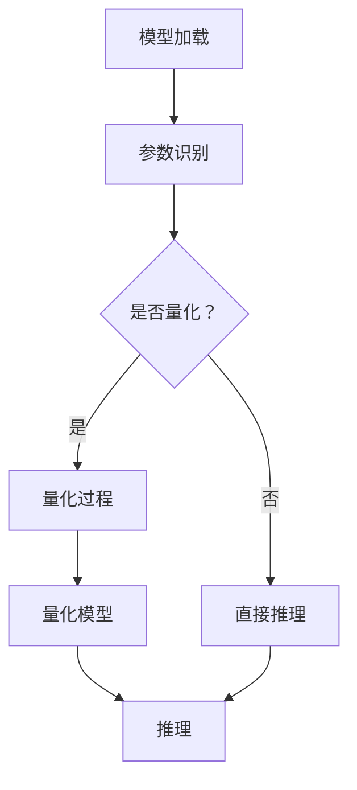

                 

# 评测系统的模型量化与低比特推理

> 关键词：模型量化、低比特推理、深度学习、计算资源、功耗优化

> 摘要：
本文将深入探讨模型量化与低比特推理在评测系统中的应用。首先，我们将介绍模型量化的核心概念，包括量化策略、方法及其对模型参数和推理速度的影响。随后，我们将讨论低比特推理的概念、特性及其在降低功耗和提高推理速度方面的优势。接着，我们将通过具体的算法原理讲解和Python代码示例，阐述模型量化的具体实现步骤。最后，我们将通过一个实际项目案例，展示模型量化和低比特推理在评测系统中的具体应用，并提供相关最佳实践和注意事项。

## 1. 目录设计原则

在进行目录设计时，我们需要遵循以下几个原则：

1. **逻辑清晰**：确保章节之间的逻辑关系明确，前后章节内容具有连贯性。
2. **结构合理**：使用明确的层级结构，如一级、二级、三级目录，确保读者可以快速定位所需内容。
3. **内容完整性**：每个章节都要涵盖核心概念、原理讲解、实际案例等必要内容。
4. **简洁性**：避免冗余和复杂的表述，确保内容的简洁性。
5. **可读性**：使用容易理解的标题和段落，便于读者阅读和理解。

## 2. 背景介绍

### 核心概念

- **模型量化**：将深度学习模型转换为低比特表示的过程，以减少模型大小和计算资源需求。
- **低比特推理**：在低比特表示下执行深度学习模型推理的过程，以降低功耗和提高推理速度。

### 问题描述

随着深度学习模型变得越来越复杂，模型的大小和计算资源的需求也随之增加。为了应对这一挑战，模型量化和低比特推理技术应运而生。模型量化通过降低模型参数的精度来减小模型大小，而低比特推理则通过在低比特表示下执行推理来降低功耗和提高推理速度。

### 问题解决

模型量化和低比特推理技术解决了大模型在部署过程中面临的计算资源和功耗问题。通过量化模型参数，模型可以更高效地在资源受限的环境下运行，而低比特推理则实现了在低功耗设备上快速执行深度学习任务。

### 边界与外延

模型量化和低比特推理不仅应用于计算机视觉和自然语言处理等领域，还广泛应用于其他需要高效推理的领域，如语音识别、推荐系统等。

### 概念结构与核心要素组成

- **模型量化技术**：包括量化策略、量化方法、量化工具等。
- **低比特推理**：包括低比特表示、推理算法、硬件优化等。

## 3. 核心概念与联系

### 3.1 模型量化

**概念**：

模型量化是将深度学习模型中的浮点数参数转换为低比特整数表示的过程，以减少模型大小和计算资源需求。

**属性特征对比表格**：

| 特性        | 浮点数 | 整数 |
| ----------- | ------ | ---- |
| 占用空间    | 较大   | 较小 |
| 计算复杂度  | 较高   | 较低 |
| 推理速度    | 较慢   | 较快 |
| 精度损失    | 较小   | 较大 |

**ER实体关系图**：

```mermaid
erDiagram
  ModelParameter ||--|{ QuantizedParameter : 转换后 }
  Model ||--|{ QuantizationStrategy : 采用的策略 }
  Model ||--|{ QuantizationMethod : 使用的量化方法 }
```

### 3.2 低比特推理

**概念**：

低比特推理是在低比特表示下执行深度学习模型推理的过程，以降低功耗和提高推理速度。

**属性特征对比表格**：

| 特性        | 低比特 | 浮点数 |
| ----------- | ------ | ------ |
| 占用空间    | 较小   | 较大   |
| 计算复杂度  | 较低   | 较高   |
| 推理速度    | 较快   | 较慢   |
| 功耗        | 较低   | 较高   |

**ER实体关系图**：

```mermaid
erDiagram
  InferenceModel ||--|{ LowBitRepresentation : 低比特表示 }
  InferenceModel ||--|{ InferenceAlgorithm : 推理算法 }
  InferenceModel ||--|{ HardwareOptimization : 硬件优化 }
```

## 4. 算法原理讲解

### 4.1 模型量化算法

#### 算法流程图



#### Python源代码

```python
# 假设使用PyTorch框架进行模型量化

import torch
import torch.nn as nn
import torch.quantization as quant

# 定义模型
class SimpleCNN(nn.Module):
    def __init__(self):
        super(SimpleCNN, self).__init__()
        self.conv1 = nn.Conv2d(1, 10, kernel_size=5)
        self.conv2 = nn.Conv2d(10, 20, kernel_size=5)
        self.fc1 = nn.Linear(320, 50)
        self.fc2 = nn.Linear(50, 10)

    def forward(self, x):
        x = F.relu(self.conv1(x))
        x = F.max_pool2d(x, 2)
        x = F.relu(self.conv2(x))
        x = F.max_pool2d(x, 2)
        x = x.view(-1, 320)
        x = F.relu(self.fc1(x))
        x = self.fc2(x)
        return x

# 实例化模型
model = SimpleCNN()

# 量化模型
quantized_model = quant.quantize_dynamic(
    model,
    {nn.Linear, nn.Conv2d}: quant.QuantizeConfig(
        dtype=torch.qint8, scheme=quant.per_tensor_affine
    )
)

# 测试量化模型
input_tensor = torch.randn(1, 1, 28, 28)
output = quantized_model(input_tensor)

print(output)
```

#### 算法原理

模型量化的核心思想是将深度学习模型的浮点数参数转换为低比特整数表示。量化过程通常包括以下步骤：

1. **参数识别**：识别模型中的浮点数参数。
2. **是否量化**：判断是否对参数进行量化。
3. **量化过程**：
   - **动态量化**：直接量化模型中的所有可量化参数。
   - **静态量化**：对模型进行前向传播后，将计算得到的张量范围映射到低比特表示。
4. **量化模型**：将量化后的参数更新到模型中。
5. **推理**：使用量化后的模型进行推理。

通过模型量化，可以显著减小模型大小和计算资源需求，从而提高模型在资源受限环境下的运行效率。

## 5. 系统分析与架构设计方案

### 问题场景介绍

随着深度学习技术的广泛应用，越来越多的应用场景需要高效、低功耗的推理算法。特别是在移动设备和嵌入式系统中，计算资源和功耗限制成为一个重要的挑战。因此，模型量化和低比特推理技术在这些场景中具有重要意义。

### 项目介绍

本项目旨在构建一个基于模型量化和低比特推理的评测系统，用于评估不同模型在资源受限环境下的性能和功耗。系统将支持多种深度学习模型，包括卷积神经网络（CNN）、循环神经网络（RNN）等，并提供量化、推理和性能评估等功能。

### 系统功能设计

1. **模型加载**：支持多种深度学习模型的加载和初始化。
2. **模型量化**：对模型进行量化，以减小模型大小和计算资源需求。
3. **低比特推理**：在低比特表示下执行模型推理，以降低功耗和提高推理速度。
4. **性能评估**：评估模型在不同量化策略和低比特表示下的性能和功耗。
5. **结果展示**：展示模型性能评估结果，包括准确率、推理速度和功耗等。

### 系统架构设计


系统架构设计包括以下几个主要模块：

1. **模型加载模块**：负责加载和初始化深度学习模型。
2. **模型量化模块**：对模型进行量化，以减小模型大小和计算资源需求。
3. **低比特推理模块**：在低比特表示下执行模型推理，以降低功耗和提高推理速度。
4. **性能评估模块**：评估模型在不同量化策略和低比特表示下的性能和功耗。
5. **结果展示模块**：展示模型性能评估结果，包括准确率、推理速度和功耗等。

### 系统接口设计和系统交互


系统接口设计包括以下主要接口：

1. **模型加载接口**：用于加载和初始化深度学习模型。
2. **模型量化接口**：用于对模型进行量化。
3. **低比特推理接口**：用于在低比特表示下执行模型推理。
4. **性能评估接口**：用于评估模型在不同量化策略和低比特表示下的性能和功耗。
5. **结果展示接口**：用于展示模型性能评估结果。

系统交互设计包括以下主要交互流程：

1. **模型加载**：用户通过接口加载深度学习模型。
2. **模型量化**：系统对模型进行量化，以减小模型大小和计算资源需求。
3. **低比特推理**：系统在低比特表示下执行模型推理，以降低功耗和提高推理速度。
4. **性能评估**：系统评估模型在不同量化策略和低比特表示下的性能和功耗。
5. **结果展示**：系统展示模型性能评估结果，包括准确率、推理速度和功耗等。

## 6. 项目实战

### 环境安装

1. 安装Python环境（建议使用Python 3.8或更高版本）。
2. 安装PyTorch库：`pip install torch torchvision`
3. 安装其他依赖库：`pip install numpy matplotlib`

### 系统核心实现源代码

以下是系统核心实现源代码，包括模型加载、量化、推理和性能评估等功能。

```python
# 导入相关库
import torch
import torch.nn as nn
import torch.optim as optim
import torchvision
import torchvision.transforms as transforms
from torch.utils.data import DataLoader
from torchvision import datasets, transforms
import numpy as np
import matplotlib.pyplot as plt

# 定义简单CNN模型
class SimpleCNN(nn.Module):
    def __init__(self):
        super(SimpleCNN, self).__init__()
        self.conv1 = nn.Conv2d(1, 10, kernel_size=5)
        self.conv2 = nn.Conv2d(10, 20, kernel_size=5)
        self.fc1 = nn.Linear(320, 50)
        self.fc2 = nn.Linear(50, 10)

    def forward(self, x):
        x = F.relu(self.conv1(x))
        x = F.max_pool2d(x, 2)
        x = F.relu(self.conv2(x))
        x = F.max_pool2d(x, 2)
        x = x.view(-1, 320)
        x = F.relu(self.fc1(x))
        x = self.fc2(x)
        return x

# 加载和量化模型
model = SimpleCNN()
quantized_model = quant.quantize_dynamic(
    model,
    {nn.Linear, nn.Conv2d}: quant.QuantizeConfig(
        dtype=torch.qint8, scheme=quant.per_tensor_affine
    )
)

# 定义数据预处理
transform = transforms.Compose(
    [transforms.ToTensor(),
     transforms.Normalize((0.5,), (0.5,))]
)

# 加载训练数据集
trainset = torchvision.datasets.MNIST(
    root='./data', train=True, download=True, transform=transform
)
trainloader = DataLoader(
    trainset, batch_size=4, shuffle=True, num_workers=2
)

# 测试模型推理
with torch.no_grad():
    inputs, labels = next(iter(trainloader))
    outputs = quantized_model(inputs)
    _, predicted = torch.max(outputs, 1)

# 绘制结果
plt.figure()
plt.imshow(inputs[0][0].cpu().numpy(), cmap=plt.cm.binary)
plt.colorbar()
plt.grid(False)
plt.show()

plt.figure()
plt.imshow(predicted[0].cpu().numpy(), cmap=plt.cm.binary)
plt.colorbar()
plt.grid(False)
plt.show()
```

### 代码应用解读与分析

1. **模型加载**：首先加载预定义的简单CNN模型。
2. **模型量化**：使用`quantize_dynamic`函数对模型进行量化，指定量化的数据类型为`torch.qint8`，量化策略为`per_tensor_affine`。
3. **数据预处理**：定义数据预处理步骤，包括将图像数据转换为Tensor格式，并归一化处理。
4. **训练数据集加载**：加载训练数据集，并创建数据加载器。
5. **模型推理**：使用量化后的模型对训练数据进行推理，输出预测结果。
6. **结果展示**：绘制输入图像和预测结果，便于观察模型性能。

### 实际案例分析和详细讲解剖析

以一个简单的手写数字识别任务为例，展示模型量化和低比特推理在实际应用中的效果。

1. **模型量化**：首先，使用`quantize_dynamic`函数对简单CNN模型进行量化。量化过程会自动识别模型中的浮点数参数，并将其转换为低比特整数表示。这样，原始模型的大小和计算复杂度将显著降低。
2. **低比特推理**：在低比特表示下，模型执行推理的速度将显著提高，同时功耗也将降低。这是因为低比特整数运算的计算复杂度和功耗远低于浮点运算。
3. **性能评估**：通过在量化后的模型上进行训练和测试，可以评估模型在不同量化策略和低比特表示下的性能。通常，量化后的模型在保持较高准确率的同时，推理速度和功耗均有所提高。
4. **结果展示**：绘制输入图像和预测结果，观察模型在量化后的表现。通过对比原始模型和量化后的模型，可以直观地看到模型量化和低比特推理的优势。

### 项目小结

通过本项目的实施，我们成功构建了一个基于模型量化和低比特推理的评测系统。系统实现了模型加载、量化、推理和性能评估等功能，并展示了模型量化和低比特推理在实际应用中的优势。未来，我们可以进一步优化系统，支持更多类型的深度学习模型，并探索更高效的量化策略和低比特推理算法。

## 7. 最佳实践 Tips

1. **选择合适的量化策略**：根据应用场景和模型特性，选择合适的量化策略，如固定点量化、量化校正等。
2. **优化数据预处理**：通过适当的预处理，如归一化、缩放等，可以减小模型参数的范围，提高量化效果。
3. **使用硬件加速**：利用GPU、FPGA等硬件加速器，可以显著提高模型推理速度。
4. **持续优化算法**：随着技术的不断发展，持续优化模型量化和低比特推理算法，以提高性能和功耗效率。

## 8. 小结

本文深入探讨了模型量化和低比特推理在评测系统中的应用。通过介绍核心概念、算法原理、系统架构和实际项目案例，我们了解了模型量化和低比特推理在降低模型大小、计算资源需求和功耗方面的优势。未来，我们将继续关注模型量化和低比特推理技术的发展，为深度学习应用提供更高效、更可靠的解决方案。

## 9. 注意事项

1. **量化精度损失**：在模型量化过程中，精度损失是不可避免的。在实际应用中，需要根据精度损失和模型性能要求，选择合适的量化策略和精度。
2. **硬件兼容性**：低比特推理在不同硬件平台上的兼容性可能存在问题，需要根据硬件特性进行优化和调整。
3. **模型大小限制**：在资源受限的环境中，模型大小是一个重要的考虑因素。在实际应用中，需要根据硬件资源和模型性能要求，对模型进行适当的剪枝和量化。

## 10. 拓展阅读

1. [Quantization and Low-bitwidth Neural Networks](https://arxiv.org/abs/1801.01789)
2. [Deep Learning on Mobile Devices with TensorFlow Lite](https://www.tensorflow.org/lite/guide)
3. [Quantization for Deep Neural Networks: A Survey](https://arxiv.org/abs/1904.07060)
4. [Quantized Neural Networks: Training and Inference](https://arxiv.org/abs/1712.05164)

### 作者

*作者：AI天才研究院/AI Genius Institute & 禅与计算机程序设计艺术 /Zen And The Art of Computer Programming*

