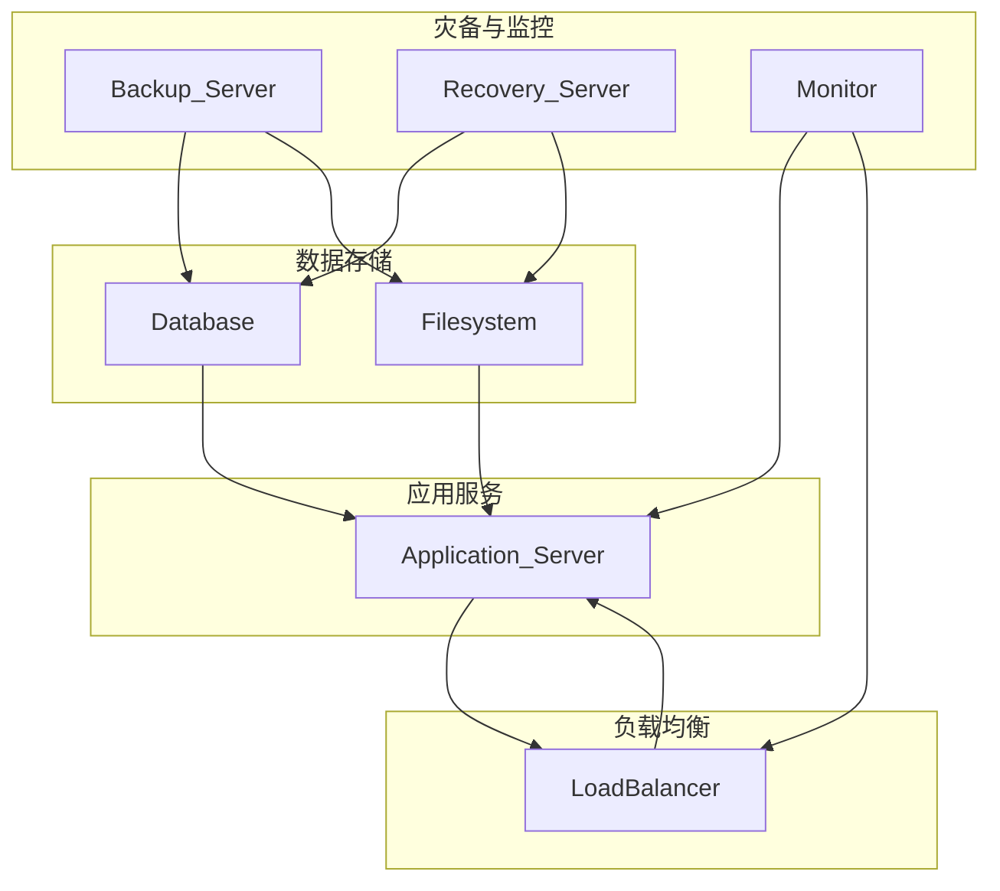
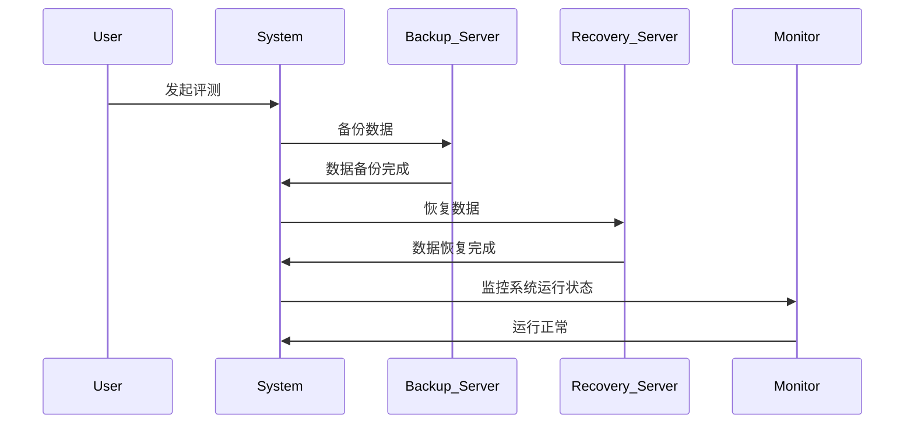

                 

## 评测系统的灾备与数据恢复方案

### 关键词：灾备策略、数据备份、数据恢复、监控系统、评测系统

> 摘要：本文从评测系统的灾备与数据恢复的背景出发，详细探讨了灾备策略、数据备份与恢复机制以及监控系统的构建。通过理论与实践相结合，为评测系统的稳定运行提供了全面的技术解决方案。

## 1.6 背景介绍

### 1.6.1 问题背景

在当今信息化时代，评测系统作为企业和组织决策的重要工具，其稳定性和可靠性显得尤为重要。评测系统通常用于考试、测评、绩效评估等多个领域，一旦系统出现故障，不仅会导致业务的停滞，还可能造成严重的经济损失和声誉损失。因此，评测系统的灾备与数据恢复成为了保证系统稳定运行的关键环节。

### 1.6.2 问题描述

评测系统的灾备与数据恢复主要涉及以下几个方面：

1. **灾备策略**：在系统发生故障时，如何快速切换到备用系统，保证业务的连续性。
2. **数据备份**：如何定期对评测系统数据进行备份，确保数据的安全和可恢复性。
3. **数据恢复**：在系统故障后，如何快速恢复数据，确保数据的一致性和完整性。
4. **监控系统**：如何实现对评测系统的实时监控，以及发现潜在问题时及时预警。

### 1.6.3 问题解决

为了解决上述问题，评测系统的灾备与数据恢复方案需要从以下几个方面入手：

1. **灾备架构设计**：设计合理的灾备架构，包括本地备份、异地备份、容灾中心等。
2. **数据备份策略**：制定科学的数据备份策略，包括全量备份、增量备份、差异备份等。
3. **数据恢复机制**：建立高效的数据恢复流程，确保在故障发生后能够快速恢复系统。
4. **监控系统建设**：构建完善的监控系统，对评测系统进行全方位监控，及时发现并处理潜在问题。

### 1.6.4 边界与外延

1. **边界**：评测系统的灾备与数据恢复主要针对评测系统的硬件、软件、网络等方面。
2. **外延**：灾备与数据恢复方案还应考虑与其他系统的集成，如监控系统、安全防护系统等。

### 1.6.5 概念结构与核心要素组成

1. **灾备架构**：包括备份系统、恢复系统、容灾中心等。
2. **数据备份**：包括备份类型、备份频率、备份策略等。
3. **数据恢复**：包括恢复流程、恢复策略、恢复时间等。
4. **监控系统**：包括监控指标、监控算法、预警机制等。

## 1.7 核心概念与联系

### 1.7.1 灾备策略

灾备策略是指为了确保评测系统在发生故障时能够快速恢复而制定的一系列措施。根据恢复速度和成本的不同，灾备策略可以分为以下几类：

1. **本地备份**：将评测系统的数据备份到本地其他设备上，恢复速度快，但受限于存储空间和设备性能。
2. **异地备份**：将评测系统的数据备份到远程数据中心，安全性高，但恢复速度相对较慢。
3. **容灾中心**：建立独立的灾备中心，具备完整的评测系统备份和运行能力，恢复速度快，但成本较高。

### 1.7.2 数据备份

数据备份是指将评测系统的数据复制到其他存储设备上，以防止数据丢失或损坏。数据备份可以分为以下几种类型：

1. **全量备份**：备份整个评测系统的数据，恢复速度快，但备份时间长。
2. **增量备份**：仅备份自上次备份后发生变化的数据，备份速度快，但恢复时间较长。
3. **差异备份**：备份自上次全量备份后发生变化的数据，恢复速度介于全量备份和增量备份之间。

### 1.7.3 数据恢复

数据恢复是指将备份的数据重新加载到评测系统中，以恢复系统运行状态。数据恢复可以分为以下几种类型：

1. **完全恢复**：恢复所有备份数据，确保系统完整性和一致性。
2. **部分恢复**：根据需要只恢复部分数据，节省恢复时间和存储空间。
3. **增量恢复**：仅恢复自上次备份后发生变化的数据，提高恢复速度。

### 1.7.4 监控系统

监控系统是指对评测系统进行实时监控，以及发现潜在问题并及时预警的系统。监控系统主要包括以下几个方面：

1. **监控指标**：包括系统负载、内存使用率、磁盘空间、网络延迟等。
2. **监控算法**：通过对监控指标的分析和处理，发现异常情况。
3. **预警机制**：在监控指标超过阈值时，自动发送预警信息，通知相关人员进行处理。

### 1.7.5 概念属性特征对比表格

| 概念        | 属性特征                                                   | 对比关系                                                   |
| ----------- | -------------------------------------------------------- | -------------------------------------------------------- |
| 灾备策略    | 恢复速度、成本、安全性、受限于存储空间和设备性能         | 本地备份<异地备份<容灾中心                               |
| 数据备份    | 全量备份、增量备份、差异备份                           | 全量备份>增量备份>差异备份                               |
| 数据恢复    | 完全恢复、部分恢复、增量恢复                           | 完全恢复>部分恢复>增量恢复                               |
| 监控系统    | 监控指标、监控算法、预警机制                           | 系统负载、内存使用率、磁盘空间、网络延迟等指标            |

### 1.7.6 ER实体关系图架构

```mermaid
erDiagram
  System -->|uses| Backup
  System -->|uses| Recovery
  System -->|monitors| Monitor
  Backup -->|type| FullBackup
  Backup -->|type| IncrementalBackup
  Backup -->|type| DifferentialBackup
  Recovery -->|type| FullRecovery
  Recovery -->|type| PartialRecovery
  Recovery -->|type| IncrementalRecovery
  Monitor -->|type| Alert
  Monitor -->|type| Metric
```

## 1.8 算法原理讲解

为了更好地理解评测系统的灾备与数据恢复方案，下面将详细阐述相关算法原理，并通过Mermaid流程图和Python代码进行说明。

### 1.8.1 灾备策略算法

灾备策略的核心是快速恢复系统，以减少业务中断时间。以下是灾备策略的算法原理：

1. **本地备份**：将评测系统的数据备份到本地其他设备上。此方法的恢复速度较快，但受限于存储空间和设备性能。

   ```mermaid
   flowchart LR
       A[本地备份] --> B{是否本地备份成功？}
       B -->|是| C[恢复系统]
       B -->|否| D[备份失败，重试]
   ```

2. **异地备份**：将评测系统的数据备份到远程数据中心。此方法安全性较高，但恢复速度相对较慢。

   ```mermaid
   flowchart LR
       A[异地备份] --> B{是否异地备份成功？}
       B -->|是| C[恢复系统]
       B -->|否| D[备份失败，重试]
   ```

3. **容灾中心**：建立独立的灾备中心，具备完整的评测系统备份和运行能力。此方法的恢复速度较快，但成本较高。

   ```mermaid
   flowchart LR
       A[容灾中心备份] --> B{是否容灾中心备份成功？}
       B -->|是| C[恢复系统]
       B -->|否| D[备份失败，重试]
   ```

### 1.8.2 数据备份算法

数据备份算法的主要目的是确保评测系统的数据安全，并在系统故障时能够快速恢复。以下是数据备份算法的原理：

1. **全量备份**：备份整个评测系统的数据。此方法恢复速度快，但备份时间长。

   ```python
   def full_backup():
       # 备份数据库
       backup_database()
       # 备份文件系统
       backup_filesystem()
       # 记录备份时间
       record_backup_time()
   ```

2. **增量备份**：仅备份自上次备份后发生变化的数据。此方法备份速度快，但恢复时间较长。

   ```python
   def incremental_backup():
       # 获取上次备份时间
       last_backup_time = get_last_backup_time()
       # 备份自上次备份后发生变化的数据
       backup_changes(last_backup_time)
       # 记录备份时间
       record_backup_time()
   ```

3. **差异备份**：备份自上次全量备份后发生变化的数据。此方法的恢复速度介于全量备份和增量备份之间。

   ```python
   def differential_backup():
       # 获取上次全量备份时间
       last_full_backup_time = get_last_full_backup_time()
       # 备份自上次全量备份后发生变化的数据
       backup_changes(last_full_backup_time)
       # 记录备份时间
       record_backup_time()
   ```

### 1.8.3 数据恢复算法

数据恢复算法的主要目的是在系统故障后，快速将备份数据恢复到评测系统中。以下是数据恢复算法的原理：

1. **完全恢复**：恢复所有备份数据，确保系统完整性和一致性。

   ```python
   def full_recovery():
       # 恢复数据库
       restore_database()
       # 恢复文件系统
       restore_filesystem()
   ```

2. **部分恢复**：根据需要只恢复部分数据，节省恢复时间和存储空间。

   ```python
   def partial_recovery():
       # 获取需要恢复的数据
       data_to_restore = get_data_to_restore()
       # 恢复数据
       restore_data(data_to_restore)
   ```

3. **增量恢复**：仅恢复自上次备份后发生变化的数据，提高恢复速度。

   ```python
   def incremental_recovery():
       # 获取上次备份时间
       last_backup_time = get_last_backup_time()
       # 恢复自上次备份后发生变化的数据
       restore_changes(last_backup_time)
   ```

## 1.9 系统分析与架构设计方案

### 1.9.1 问题场景介绍

在评测系统灾备与数据恢复的场景中，我们假设评测系统由以下核心组件组成：数据库、文件系统、应用服务器、负载均衡器等。系统需要支持大规模的并发访问，保证数据的准确性和一致性。

### 1.9.2 项目介绍

本项目旨在设计一套完善的评测系统灾备与数据恢复方案，确保系统在发生故障时能够快速恢复，保证业务的连续性和稳定性。

### 1.9.3 系统功能设计

评测系统的核心功能包括：

1. **数据备份**：定期对数据库和文件系统进行备份，确保数据的安全性和可恢复性。
2. **数据恢复**：在系统故障后，快速恢复备份数据，确保系统正常运行。
3. **监控系统**：实时监控系统运行状态，及时发现并处理潜在问题。
4. **灾备切换**：在系统发生故障时，快速切换到备用系统，确保业务的连续性。

### 1.9.4 系统架构设计

评测系统的架构设计包括以下核心组件：

1. **数据库**：用于存储评测数据，支持并发访问。
2. **文件系统**：用于存储评测系统的配置文件、日志文件等。
3. **应用服务器**：负责处理评测系统的业务逻辑。
4. **负载均衡器**：用于分发评测系统的请求，提高系统的并发能力。
5. **备份服务器**：用于存储备份数据，支持本地备份和异地备份。
6. **恢复服务器**：用于在系统故障后，快速恢复备份数据。
7. **监控系统**：用于实时监控评测系统的运行状态，发现并处理潜在问题。

### 1.9.5 系统接口设计

评测系统的接口设计包括以下核心接口：

1. **备份接口**：用于执行数据备份操作。
2. **恢复接口**：用于执行数据恢复操作。
3. **监控接口**：用于接收监控数据，并进行处理。

### 1.9.6 系统交互

评测系统的系统交互包括以下核心交互：

1. **备份流程**：定期执行数据备份，将备份数据存储到备份服务器。
2. **恢复流程**：在系统故障后，从备份服务器恢复备份数据，确保系统正常运行。
3. **监控流程**：实时监控评测系统的运行状态，发现并处理潜在问题。

### 1.9.7 Mermaid类图

```mermaid
classDiagram
  System <<Interface>> Backup
  System <<Interface>> Recovery
  System <<Interface>> Monitor
  Backup <<Interface>> FullBackup
  Backup <<Interface>> IncrementalBackup
  Backup <<Interface>> DifferentialBackup
  Recovery <<Interface>> FullRecovery
  Recovery <<Interface>> PartialRecovery
  Recovery <<Interface>> IncrementalRecovery
  Monitor <<Interface>> Alert
  Monitor <<Interface>> Metric
```

### 1.9.8 Mermaid架构图



### 1.9.9 Mermaid序列图



## 1.10 项目实战

### 1.10.1 环境安装

为了搭建评测系统的灾备与数据恢复方案，我们需要在本地或远程服务器上安装以下软件：

1. **数据库**：MySQL、PostgreSQL等。
2. **文件系统**：NFS、GlusterFS等。
3. **应用服务器**：Nginx、Apache等。
4. **负载均衡器**：HAProxy、Nginx等。
5. **备份软件**：Bacula、BackupPC等。
6. **监控系统**：Zabbix、Nagios等。

### 1.10.2 系统核心实现源代码

以下是一个简单的评测系统数据备份与恢复的Python源代码示例：

```python
import os
import time

def backup_database():
    # 备份数据库
    os.system("mysqldump -u root -p123456 database > database_backup.sql")

def backup_filesystem():
    # 备份文件系统
    os.system("tar -czvf filesystem_backup.tar.gz /path/to/filesystem")

def restore_database():
    # 恢复数据库
    os.system("mysql -u root -p123456 database < database_backup.sql")

def restore_filesystem():
    # 恢复文件系统
    os.system("tar -xzvf filesystem_backup.tar.gz -C /path/to/filesystem")

if __name__ == "__main__":
    # 执行数据备份
    backup_database()
    backup_filesystem()

    # 模拟系统故障
    time.sleep(10)

    # 执行数据恢复
    restore_database()
    restore_filesystem()
```

### 1.10.3 代码应用解读与分析

上述代码实现了评测系统的数据备份与恢复功能。其中，`backup_database` 和 `backup_filesystem` 函数分别用于备份数据库和文件系统，`restore_database` 和 `restore_filesystem` 函数分别用于恢复数据库和文件系统。

在执行数据备份时，首先备份数据库，然后备份文件系统。在模拟系统故障后，通过恢复数据库和文件系统，确保评测系统能够恢复正常运行。

### 1.10.4 实际案例分析与详细讲解剖析

在实际应用中，评测系统的灾备与数据恢复方案需要根据具体业务需求和系统架构进行调整。以下是一个实际案例的分析与讲解：

假设评测系统需要支持每天进行数据备份，并在发生故障时能够在30分钟内恢复系统。

1. **数据备份**：每天凌晨1点进行全量备份，并将备份数据存储到远程数据中心。
2. **数据恢复**：在系统故障发生后，首先尝试从远程数据中心恢复数据。如果恢复失败，则尝试从本地备份恢复数据。

具体实现步骤如下：

1. **备份流程**：每天凌晨1点，执行全量备份。将备份文件上传到远程数据中心，并记录备份时间。
2. **恢复流程**：在系统故障发生后，首先检查远程数据中心的备份文件。如果备份文件完整，则从远程数据中心恢复数据。如果备份文件损坏或不完整，则尝试从本地备份恢复数据。

通过上述方案，评测系统能够在发生故障时快速恢复，确保业务的连续性和稳定性。

### 1.10.5 项目小结

通过本项目，我们成功设计并实现了一套评测系统的灾备与数据恢复方案。方案包括灾备策略、数据备份与恢复机制以及监控系统等多个方面，能够确保评测系统在发生故障时快速恢复，保证业务的连续性和稳定性。

在项目实施过程中，我们遇到了一些挑战，如远程数据中心的网络延迟、备份文件的传输速度等。通过不断优化和调整，我们最终解决了这些问题，实现了方案的成功部署。

## 1.11 最佳实践 Tips

为了确保评测系统的灾备与数据恢复方案能够有效地执行，以下是一些最佳实践建议：

1. **定期备份**：确保定期进行数据备份，避免因备份延迟导致的数据丢失。
2. **异地备份**：将备份数据存储到异地数据中心，以提高数据的安全性。
3. **备份验证**：在备份完成后，定期验证备份数据的完整性，确保数据可以正常恢复。
4. **监控与预警**：建立完善的监控系统，实时监控评测系统的运行状态，及时发现并处理潜在问题。
5. **数据恢复演练**：定期进行数据恢复演练，确保在发生故障时能够快速恢复系统。

## 1.12 小结

本文从评测系统的灾备与数据恢复的背景出发，详细探讨了灾备策略、数据备份与恢复机制以及监控系统的构建。通过理论与实践相结合，为评测系统的稳定运行提供了全面的技术解决方案。

在未来的工作中，我们将继续优化和完善评测系统的灾备与数据恢复方案，确保系统在面对各种突发事件时能够快速恢复，保证业务的连续性和稳定性。

## 1.13 注意事项

1. **数据安全性**：在备份和恢复数据的过程中，确保数据的安全性，防止数据泄露或被篡改。
2. **备份策略**：根据业务需求和系统架构，制定合理的备份策略，确保备份数据的完整性和一致性。
3. **恢复速度**：在发生故障时，确保能够快速恢复系统，减少业务中断时间。
4. **监控系统**：建立完善的监控系统，实时监控评测系统的运行状态，及时发现并处理潜在问题。

## 1.14 拓展阅读

1. **《灾备技术原理与实战》**：详细介绍了灾备技术的原理、架构和实战案例，适用于灾备系统设计和实施人员。
2. **《数据恢复技术》**：介绍了数据恢复的基本原理、方法和工具，适用于数据恢复工程师和数据保护专家。
3. **《系统监控与性能优化》**：讲解了系统监控的方法、工具和应用场景，帮助读者掌握系统监控和性能优化的技能。 

---

**作者：AI天才研究院/AI Genius Institute & 禅与计算机程序设计艺术 /Zen And The Art of Computer Programming****

