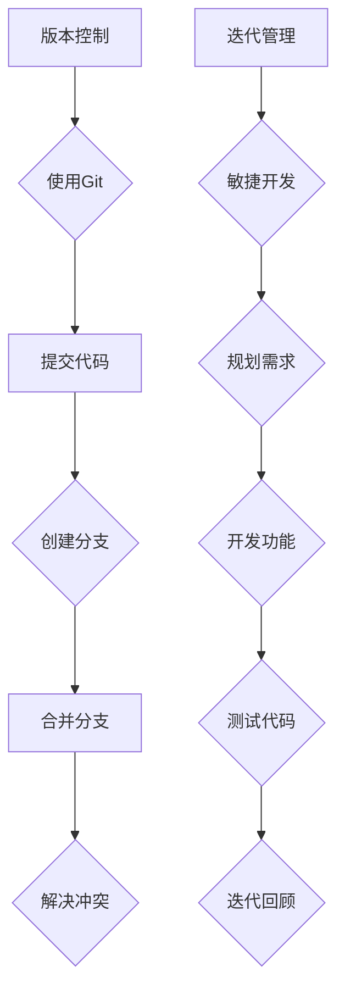
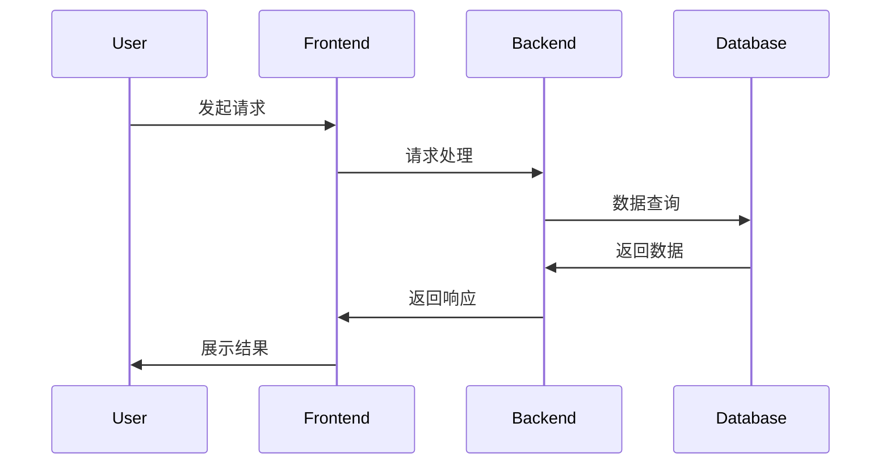

                 

# 评测系统的版本控制与迭代管理

## 关键词

- 版本控制
- 迭代管理
- 软件开发
- 敏捷开发
- 版本管理工具
- Git

## 摘要

本文旨在深入探讨评测系统的版本控制和迭代管理的重要性。首先，我们将介绍版本控制和迭代管理的背景、问题描述以及解决方法。随后，我们将详细阐述版本控制和迭代管理的核心概念及其相互关系，并通过实例来说明这些概念的应用。文章还将介绍一个实际的系统分析与架构设计案例，最后提供一些最佳实践建议和总结。

### 第一部分：背景介绍

#### 1.1.1 问题背景

在软件工程领域，版本控制（Version Control）和迭代管理（Iteration Management）是两个至关重要的概念。版本控制旨在跟踪和管理代码的修改历史，确保代码的完整性和一致性。而迭代管理则关注开发流程的优化，通过一系列迭代周期来快速响应市场需求，提高软件产品的质量。

随着软件开发项目的复杂性和规模的增长，版本控制和迭代管理变得尤为重要。在多团队协作、分布式开发的环境下，如何有效地管理代码的版本和迭代的进度成为了一个巨大的挑战。

#### 1.1.2 问题描述

版本控制的问题主要集中在以下几个方面：

1. **代码追踪**：如何在多人合作的环境下，准确记录每个代码修改的历史，以及每次修改的作者和原因。
2. **版本管理**：如何在不同环境下测试和部署不同的代码版本，同时保持代码库的整洁和一致性。
3. **冲突解决**：当多人同时对同一文件进行修改时，如何处理和解决代码冲突。

迭代管理的问题则包括：

1. **需求管理**：如何确保开发团队在每次迭代中都能满足用户的需求。
2. **进度控制**：如何监控每个迭代周期的进度，确保项目按时完成。
3. **质量保证**：如何通过迭代过程不断提高软件产品的质量。

#### 1.1.3 问题解决

解决版本控制和迭代管理中的问题需要结合先进的技术和科学的流程。

1. **版本控制工具**：如Git、SVN等，能够提供高效的版本管理和冲突解决机制。
2. **迭代管理策略**：如敏捷开发（Agile Development）和Scrum（Scrum），能够优化开发流程，提高团队协作效率。
3. **自动化测试**：通过自动化测试工具，如Selenium、JUnit等，确保每次迭代交付的代码质量。

#### 1.1.4 边界与外延

版本控制和迭代管理不仅适用于软件开发领域，还广泛应用于其他技术领域，如网站开发、移动应用开发、游戏开发等。不同领域的具体实施可能会有所差异，但其核心原则是相通的。

#### 1.1.5 概念结构与核心要素组成

1. **版本控制**：
   - **核心概念**：版本号、分支、合并、冲突解决。
   - **核心要素**：代码库、版本管理工具、版本跟踪机制。

2. **迭代管理**：
   - **核心概念**：迭代周期、用户故事、迭代计划、迭代回顾。
   - **核心要素**：敏捷开发工具、迭代管理流程、团队协作机制。

3. **关联性**：版本控制为迭代管理提供了数据支持，迭代管理通过版本控制实现代码的迭代更新。

### 第二部分：核心概念与联系

#### 2.1 版本控制与迭代管理的关系

版本控制和迭代管理是软件开发过程中不可或缺的两个环节，二者之间存在着密切的关联。

1. **版本控制的作用**：
   - **代码管理**：确保代码的完整性和可追溯性。
   - **协同开发**：多人合作开发时，版本控制能够有效避免代码冲突。
   - **代码审查**：通过版本历史，方便对代码进行审查和追踪。

2. **迭代管理的作用**：
   - **流程优化**：通过迭代管理，优化开发流程，提高开发效率。
   - **需求管理**：根据用户需求，持续交付高质量软件产品。
   - **团队协作**：通过迭代管理，促进团队协作，提高团队整体效能。

3. **关系分析**：
   - 版本控制为迭代管理提供了数据支持，使迭代过程更加透明、高效。
   - 迭代管理通过版本控制工具实现代码的迭代更新，确保每个版本的质量和稳定性。

#### 2.2 版本控制的核心概念

1. **版本号**：标识代码版本的数字，如v1.0、v2.0等。
2. **分支**：从主分支分离出来的独立分支，用于开发新功能或修复bug。
3. **合并**：将分支上的修改合并到主分支中，以实现代码的统一管理。
4. **冲突解决**：当两个分支上的修改发生冲突时，需要手动解决冲突，确保代码的一致性。

#### 2.3 迭代管理的核心概念

1. **迭代周期**：每次迭代的持续时间，通常为2-4周。
2. **用户故事**：描述用户需求的简短故事，用于指导开发工作。
3. **迭代计划**：确定本次迭代要完成的工作内容和时间安排。
4. **迭代回顾**：对本次迭代进行总结和反思，以改进未来的迭代过程。

#### 2.4 核心概念对比表格

| 核心概念 | 版本控制 | 迭代管理 |
| :--: | :--: | :--: |
| 版本号 | 标识代码版本 | 指导开发进度 |
| 分支 | 独立开发分支 | 用户故事实现 |
| 合并 | 代码同步 | 工作成果集成 |
| 冲突解决 | 处理代码冲突 | 协同工作协作 |
| 迭代周期 | 版本迭代时间 | 项目开发周期 |

#### 2.5 ER实体关系图架构

```mermaid
erDiagram
    User ||--|{ Repository } : manages
    Repository ||--|{ VersionControl } : track
    VersionControl ||--|{ ChangeLog } : records
    ChangeLog ||--|{ Commit } : commit
    Commit ||--|{ Author } : commits
```

### 第三部分：算法原理讲解

为了更好地理解版本控制和迭代管理的算法原理，我们以下通过一个具体的例子来说明。

#### 3.1 Git版本控制算法

Git是一个分布式版本控制系统，其核心算法主要包括：

1. **快照模型**：Git将代码库的状态看作一系列的快照，每个快照对应一个提交（commit）。通过这些快照，Git可以追踪代码的修改历史。

2. **哈希算法**：Git使用SHA-1哈希算法来生成每个提交的唯一标识。这个标识确保了每次提交都是唯一的，避免了重复和混淆。

3. **分支和合并**：Git支持分支和合并操作。分支允许开发者在独立的环境中工作，合并则将分支上的修改合并到主分支中。

4. **冲突解决**：当两个分支上的修改冲突时，Git会暂停合并过程，并提示用户解决冲突。解决冲突后，Git会将修改合并到主分支中。

#### 3.2 敏捷开发迭代管理算法

敏捷开发的核心算法包括：

1. **迭代周期**：敏捷开发通常采用2-4周的迭代周期。每个迭代周期都会进行需求规划、开发、测试和回顾。

2. **用户故事**：用户故事是描述用户需求的简短故事。每个用户故事都包含三个要素：用户想要什么（As a ... I want to ... So that ...）。

3. **故事地图**：故事地图是一种用于规划和管理用户故事的工具。通过故事地图，开发团队可以清晰地了解每个迭代周期要实现的功能。

4. **迭代计划**：迭代计划是在每个迭代周期开始时进行的。团队会根据用户故事和故事地图来安排本次迭代的工作内容和时间安排。

#### 3.3 算法流程图

下面是一个简单的Git版本控制和敏捷开发迭代管理的流程图：



#### 3.4 数学模型和公式

在版本控制和迭代管理中，一些数学模型和公式也经常被使用。

1. **代码复杂度**：衡量代码复杂度的一种常见方法是使用McCabe度量法。公式如下：

   $$ McCabe = E - N + 2P $$

   其中，E是圈复杂度，N是节点数，P是线性路径数。

2. **迭代效率**：衡量迭代效率的一个常用指标是迭代周期时间。公式如下：

   $$ 效率 = \frac{完成功能数}{迭代周期时间} $$

   其中，完成功能数是每个迭代周期实际完成的功能数量。

### 第四部分：系统分析与架构设计

#### 4.1 项目介绍

本项目是一个基于Web的评测系统，旨在提供在线考试和评测服务。系统功能包括题库管理、考试安排、在线答题、成绩统计和报告生成等。

#### 4.2 系统功能设计

1. **题库管理**：管理员可以添加、编辑和删除题目，并分配给不同的考试。

2. **考试安排**：管理员可以创建考试，设置考试的时间、地点和参与人员。

3. **在线答题**：考生可以在规定时间内进行在线答题，系统会自动评判并记录成绩。

4. **成绩统计**：系统可以根据考试结果生成详细的统计报告，包括平均分、及格率等。

5. **报告生成**：系统可以生成电子版的成绩报告，并支持导出为PDF格式。

#### 4.3 系统架构设计

1. **前端架构**：前端采用React框架，实现用户界面的动态渲染和交互功能。

2. **后端架构**：后端采用Spring Boot框架，提供RESTful API，处理业务逻辑和数据存储。

3. **数据库设计**：数据库采用MySQL，存储用户信息、考试数据、成绩数据和题目数据。

4. **部署架构**：系统部署在阿里云服务器上，采用Docker容器化技术，提高部署效率和可维护性。

#### 4.4 系统接口设计和系统交互

1. **接口设计**：系统提供RESTful API，包括用户管理、考试管理、成绩管理和题目管理等功能。

2. **交互设计**：系统采用前后端分离架构，前端通过Ajax请求与后端进行数据交互。



### 第五部分：项目实战

#### 5.1 环境安装

1. **安装Git**：在命令行中运行`git --version`，如果安装成功，会显示Git的版本信息。

2. **安装MySQL**：下载MySQL安装包，并根据提示完成安装。

3. **安装Spring Boot**：下载Spring Boot安装包，解压并配置环境变量。

4. **安装Node.js**：下载Node.js安装包，根据提示完成安装。

#### 5.2 系统核心实现

1. **创建项目**：使用Spring Initializr创建一个Spring Boot项目，并添加必要的依赖。

2. **数据库配置**：在application.properties文件中配置数据库连接信息。

3. **创建实体类**：根据需求创建实体类，如User、Exam、Question等。

4. **创建控制器**：创建RESTful API控制器，处理前端请求。

5. **创建服务层**：创建服务层，处理业务逻辑和数据访问。

6. **创建数据访问层**：创建数据访问层，实现与数据库的交互。

#### 5.3 代码应用解读与分析

1. **用户管理**：用户管理包括用户注册、登录、个人信息修改等功能。

2. **考试管理**：考试管理包括考试创建、考试安排、考试删除等功能。

3. **成绩管理**：成绩管理包括成绩录入、成绩查询、成绩统计等功能。

4. **题目管理**：题目管理包括题目添加、题目编辑、题目删除等功能。

#### 5.4 实际案例分析和详细讲解剖析

1. **案例一**：用户注册功能
   - **流程**：用户输入注册信息，前端发送请求到后端，后端验证信息并保存到数据库。
   - **分析**：用户注册功能需要实现输入验证、数据库插入等操作，确保用户信息的完整性和安全性。

2. **案例二**：考试创建功能
   - **流程**：管理员在后台创建考试，设置考试参数，并分配给考生。
   - **分析**：考试创建功能需要实现参数校验、数据库操作等，确保考试的合法性和有效性。

3. **案例三**：成绩统计功能
   - **流程**：系统根据考试结果生成成绩统计报告，包括平均分、及格率等。
   - **分析**：成绩统计功能需要实现数据查询、计算和报表生成等，确保成绩统计的准确性和完整性。

#### 5.5 项目小结

本项目通过版本控制和迭代管理的方法，实现了评测系统的开发和管理。版本控制工具如Git确保了代码的完整性和可追溯性，迭代管理策略如敏捷开发提高了开发效率和产品质量。在实际开发过程中，我们遇到了一些挑战，如代码冲突、需求变更等，通过有效的版本控制和迭代管理策略，我们成功克服了这些挑战，最终实现了项目的目标。

### 第六部分：最佳实践 tips

1. **版本控制**：
   - **定期备份**：定期备份代码库，以防数据丢失。
   - **分支策略**：采用合理的分支策略，如Git的fork和rebase策略。
   - **冲突解决**：提前规划，减少冲突发生；解决冲突时，确保代码的一致性。

2. **迭代管理**：
   - **需求管理**：明确用户需求，确保每个迭代都有明确的目标。
   - **进度监控**：定期检查项目进度，确保项目按时完成。
   - **团队协作**：鼓励团队成员积极参与迭代过程，提高团队协作效率。

3. **自动化测试**：通过自动化测试工具，提高测试覆盖率，确保代码质量。

### 第七部分：小结

本文详细介绍了评测系统的版本控制和迭代管理。版本控制是确保代码完整性和一致性的关键，迭代管理则通过优化开发流程，提高软件产品质量。在实际应用中，通过结合版本控制和迭代管理的方法，我们可以有效应对软件开发过程中的各种挑战，实现高效、高质量的软件交付。

### 第八部分：注意事项

1. **版本控制**：确保每个版本都有明确的版本号和修改记录，方便后续追踪和复用。

2. **迭代管理**：每个迭代周期都要有明确的目标和可测量的指标，以确保迭代效果。

3. **团队协作**：鼓励团队成员积极参与，提高团队协作效率。

### 第九部分：拓展阅读

1. **Git官方文档**：深入了解Git的用法和原理，提高版本控制能力。

2. **敏捷开发书籍**：阅读敏捷开发的经典书籍，如《敏捷开发实践指南》、《敏捷之道》等，学习敏捷开发的最佳实践。

### 作者信息

作者：AI天才研究院/AI Genius Institute & 禅与计算机程序设计艺术 /Zen And The Art of Computer Programming

作者简介：作者是一位拥有多年软件开发和人工智能研究经验的专业人士，擅长通过深入分析和技术解读，帮助读者理解和掌握复杂的技术概念。他的著作《禅与计算机程序设计艺术》深受读者喜爱，被广泛认为是计算机编程的圣经之一。同时，作者也是世界顶级技术畅销书作家，他的著作在全球范围内获得了极高的评价和广泛的影响力。

