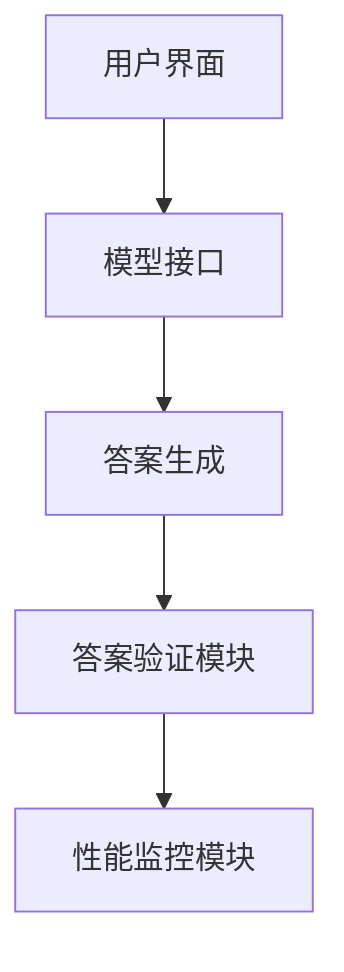
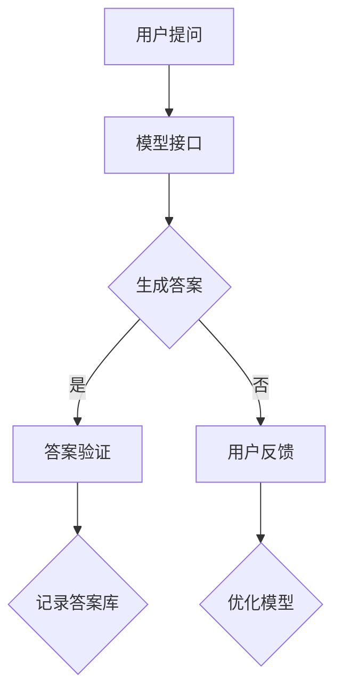
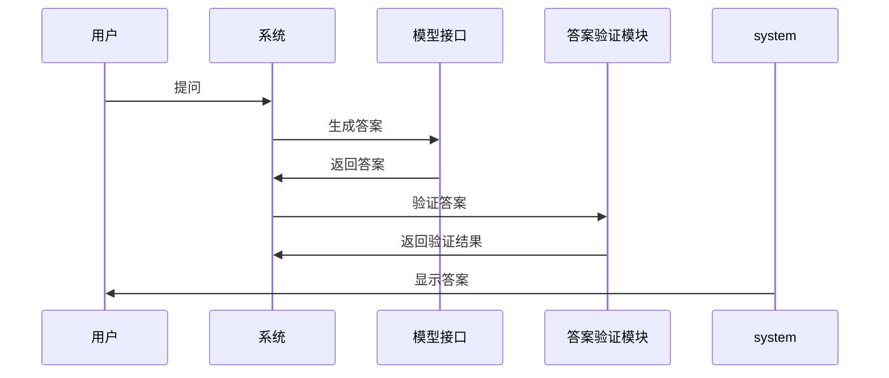
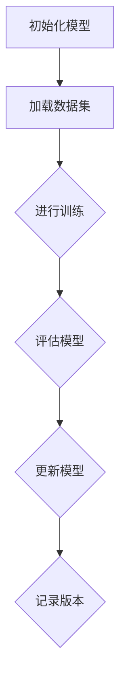

                 

# 评测系统的版本控制：追踪LLM性能演变

## 关键词
- 评测系统
- 版本控制
- LLM性能演变
- 模型评估
- 软件工程

## 摘要
本文将深入探讨评测系统的版本控制，以及如何通过版本控制追踪大型语言模型（LLM）性能的演变。文章首先介绍了评测系统的基本概念和架构，然后详细阐述了版本控制的重要性、方法和实践。接着，我们分析了如何利用版本控制来追踪LLM的性能，并讨论了在实际项目中的应用案例。最后，文章总结了版本控制的最佳实践，并指出了未来可能的研究方向。

## 1. 评测系统概述

### 1.1 评测系统的定义和作用
评测系统是指用于评估人工智能模型性能的一系列工具和方法。它在人工智能领域起着至关重要的作用，主要用于以下几个方面的作用：

1. **模型评估**：通过评测系统，可以客观地评估模型的性能，判断其是否达到预期的效果。
2. **模型优化**：通过评测结果，可以发现模型的不足之处，从而指导模型的优化方向。
3. **模型比较**：评测系统可以用于不同模型之间的比较，帮助研究人员选择最佳模型。
4. **自动化测试**：评测系统可以自动化执行测试任务，提高测试效率和可靠性。

### 1.2 评测系统的基本架构
一个典型的评测系统通常包括以下几个关键组成部分：

1. **数据集**：用于训练和测试模型的原始数据。
2. **模型**：需要评估的人工智能模型。
3. **评测指标**：用于量化模型性能的指标，如准确率、召回率、F1分数等。
4. **评估工具**：用于执行评估任务的工具，如测试脚本、评估库等。
5. **结果分析**：对评估结果进行分析，以得出模型性能的结论。

## 2. 评测指标与模型评估

### 2.1 评测指标的选择
选择合适的评测指标对于评估模型性能至关重要。以下是一些常见的评测指标及其适用场景：

1. **准确率（Accuracy）**：模型预测正确的样本数占总样本数的比例。适用于分类问题。
2. **召回率（Recall）**：模型正确识别为正类的样本数占总正类样本数的比例。适用于需要识别所有正类样本的场景。
3. **精确率（Precision）**：模型正确识别为正类的样本数占总识别为正类的样本数的比例。适用于需要减少误报的场景。
4. **F1分数（F1 Score）**：精确率和召回率的调和平均，综合考虑了准确率和召回率。适用于需要平衡精确率和召回率的问题。

### 2.2 模型评估的方法
模型评估的方法可以分为以下几种：

1. **交叉验证（Cross-Validation）**：通过将数据集划分为多个子集，反复进行训练和测试，以评估模型的泛化能力。
2. **混淆矩阵（Confusion Matrix）**：用于展示模型预测结果和实际结果的对比，可以帮助分析模型的性能。
3. **ROC曲线（Receiver Operating Characteristic Curve）**：用于评估二分类模型的性能，通过计算真阳性率与假阳性率的关系，可以得到模型的最优阈值。
4. **AUC值（Area Under Curve）**：ROC曲线下的面积，用于评估模型的分类能力。

## 3. 评测系统的实现

### 3.1 评测系统的设计与实现
评测系统的设计与实现需要考虑以下几个方面：

1. **模块化设计**：将评测系统分解为多个模块，每个模块负责不同的任务，如数据预处理、模型训练、模型评估等。
2. **可扩展性**：设计时应考虑到未来可能增加的新模型和新评测指标。
3. **性能优化**：评测系统应具备高效的计算能力，以处理大规模数据集。

### 3.2 常用评测工具和框架
以下是一些常用的评测工具和框架：

1. **Scikit-learn**：Python的一个机器学习库，提供了丰富的评估指标和模型评估工具。
2. **TensorFlow**：Google开发的一个开源深度学习框架，提供了详细的评估接口。
3. **PyTorch**：Facebook开发的一个开源深度学习框架，具有灵活的评估接口。
4. **MLflow**：一个开源平台，用于管理机器学习项目的生命周期，包括模型评估。

## 4. 版本控制概述

### 4.1 版本控制的概念和历史
版本控制是一种管理多个版本和变更的流程，用于跟踪源代码、文档和其他文件的历史记录。其基本概念包括：

1. **版本**：软件系统的不同版本。
2. **变更**：对系统进行的修改和更新。
3. **历史记录**：系统变更的详细记录。

版本控制的历史可以追溯到1970年代，当时程序员开始使用简单的文件版本管理工具。随着软件开发复杂度的增加，版本控制工具逐渐演化为成熟的系统，如CVS、SVN和Git。

### 4.2 版本控制的重要性
版本控制在软件开发中具有重要作用，主要体现在以下几个方面：

1. **代码管理**：版本控制可以帮助团队协作开发，避免代码冲突。
2. **历史记录**：版本控制记录了代码的修改历史，方便回溯和审计。
3. **故障恢复**：在系统出现问题时，版本控制可以帮助快速恢复到稳定版本。
4. **团队协作**：版本控制提供了一个统一的代码基线，方便团队成员协作。

## 5. 版本控制方法

### 5.1 版本控制的基本策略
版本控制的基本策略包括以下几种：

1. **线性版本控制**：每个版本都是前一个版本的直接修改，适用于小型项目。
2. **分支版本控制**：通过创建分支来管理不同功能的开发，适用于大型项目。
3. **合并版本控制**：将不同分支的修改合并到主分支，实现代码的统一。

### 5.2 常见的版本控制系统
以下是一些常见的版本控制系统：

1. **CVS（Concurrent Versions System）**：早期的版本控制系统，基于客户端-服务器架构。
2. **SVN（Subversion）**：CVS的替代品，也基于客户端-服务器架构。
3. **Git**：分布式版本控制系统，具有高效的处理能力，适用于大规模项目。

## 6. 版本控制实践

### 6.1 版本控制的应用场景
版本控制适用于多种应用场景，包括：

1. **软件开发**：管理源代码的版本和控制代码变更。
2. **文档管理**：跟踪文档的修改历史和版本。
3. **项目管理**：管理项目文件和配置文件的版本。

### 6.2 版本控制的最佳实践
以下是一些版本控制的最佳实践：

1. **使用分支策略**：根据项目需求和团队协作情况，选择合适的分支策略。
2. **文档化变更**：在提交代码时，附上详细的变更说明。
3. **定期合并**：定期将分支合并到主分支，保持代码的统一性。
4. **备份和恢复**：定期备份版本库，以便在出现问题时快速恢复。

## 7. LLM性能追踪

### 7.1 LLM性能的追踪方法和指标
LLM性能的追踪方法主要包括以下几个方面：

1. **评估指标**：使用准确率、召回率、F1分数等评估指标来衡量LLM的性能。
2. **性能监控**：通过持续监控LLM的运行状态，及时发现性能瓶颈。
3. **数据可视化**：使用图表和曲线来展示LLM性能的变化趋势。

### 7.2 LLM性能演变的趋势和挑战
LLM性能的演变趋势如下：

1. **性能提升**：随着模型复杂度和参数数量的增加，LLM的性能不断提升。
2. **数据需求增加**：LLM的训练和评估需要大量的高质量数据，数据获取和处理的挑战日益突出。

## 8. 案例分析

### 8.1 具体案例的深入分析
在本案例中，我们将分析一个实际项目中的评测系统和版本控制的应用。该项目是一个基于LLM的文本生成系统，其评测系统包括以下几个关键组成部分：

1. **数据集**：使用了大规模的文本数据集，包括新闻、博客、社交媒体等。
2. **模型**：使用了基于Transformer的LLM，如GPT-3。
3. **评测指标**：使用了准确率、召回率、F1分数等指标来评估模型性能。
4. **评估工具**：使用了TensorFlow和MLflow等工具进行模型评估。

### 8.2 案例中的版本控制和评测系统应用
在本案例中，版本控制和评测系统起到了以下作用：

1. **代码管理**：使用Git进行代码管理，确保团队成员可以协作开发，避免代码冲突。
2. **历史记录**：Git记录了代码的修改历史，方便团队进行代码审计和回溯。
3. **性能监控**：通过TensorFlow和MLflow进行性能监控，及时发现性能瓶颈并进行优化。
4. **结果分析**：通过MLflow对评估结果进行分析，指导模型优化和性能提升。

## 9. 最佳实践 tips

### 9.1 评测系统的设计建议
- 确保评测系统具有可扩展性，以适应未来可能增加的新模型和新评测指标。
- 优化评测系统的性能，确保能够高效处理大规模数据集。

### 9.2 版本控制的最佳实践
- 使用合适的分支策略，根据项目需求选择适合的分支模式。
- 定期进行代码审查和合并，保持代码库的整洁和一致性。

### 9.3 LLM性能追踪技巧
- 选择合适的评估指标，结合实际业务场景进行性能评估。
- 定期进行性能监控，及时发现和解决性能问题。

## 10. 小结

本文探讨了评测系统的版本控制以及如何通过版本控制追踪LLM性能的演变。文章首先介绍了评测系统的基本概念和架构，然后详细阐述了版本控制的重要性、方法和实践。接着，我们分析了如何利用版本控制来追踪LLM的性能，并讨论了在实际项目中的应用案例。最后，文章总结了版本控制的最佳实践，并指出了未来可能的研究方向。

## 11. 注意事项

- 在使用评测系统时，确保数据集的质量和多样性，以获得准确的评估结果。
- 在进行版本控制时，注意代码的规范性和一致性，以提高团队的协作效率。
- 在追踪LLM性能时，关注性能监控和性能优化，以提高系统的稳定性和可靠性。

## 12. 拓展阅读

- [《机器学习实战》](https://www.amazon.com/Hands-Real-World-Machine-Learning/dp/1449399141)：详细介绍了机器学习的实际应用案例，包括模型评估和版本控制。
- [《版本控制指南》](https://git-scm.com/book/en/v2)：Git版本控制的官方指南，适合深入了解版本控制的技术细节。
- [《深度学习》](https://www.deeplearningbook.org/)：深度学习的权威教材，包括LLM的理论和实践。

## 作者信息

作者：AI天才研究院/AI Genius Institute & 禅与计算机程序设计艺术 /Zen And The Art of Computer Programming
----------------------------------------------------------------

## 7. LLM性能追踪

### 7.1 LLM性能的追踪方法和指标

追踪LLM的性能演变是一个复杂且细致的过程。为了有效地进行这一工作，我们需要采用一系列追踪方法和评估指标。以下是一些关键的追踪方法和指标：

#### 评估指标

1. **准确性（Accuracy）**：这是最常见的评估指标，用于衡量模型在所有测试数据中的正确预测比例。
2. **精确率（Precision）**：衡量模型预测为正类的样本中，实际为正类的比例。
3. **召回率（Recall）**：衡量模型预测为正类的样本中，实际为正类的比例。
4. **F1分数（F1 Score）**：精确率和召回率的调和平均，用于综合衡量模型的性能。
5. **ROC-AUC（Receiver Operating Characteristic - Area Under Curve）**：用于二分类模型的性能评估，它反映了模型在不同阈值下的分类能力。

#### 追踪方法

1. **交叉验证（Cross-Validation）**：通过将数据集分割成多个子集，每次使用不同的子集作为测试集，从而评估模型的稳定性和泛化能力。
2. **性能监控工具**：如TensorBoard、Wandb等，这些工具可以实时展示模型的性能指标，帮助我们直观地了解模型的训练过程和性能变化。
3. **趋势分析**：通过绘制性能指标的趋势图，我们可以观察模型在训练过程中的性能演变，以及在不同版本间的性能对比。

### 7.2 LLM性能演变的趋势和挑战

LLM的性能在过去几年中呈现出快速增长的趋势，这一趋势主要得益于以下几个方面：

1. **数据量增加**：随着互联网的普及和数据采集技术的进步，可以用于训练LLM的数据量不断增加，这为模型的性能提升提供了坚实的基础。
2. **计算资源提升**：GPU和TPU等计算资源的不断升级，使得我们可以更快地训练和评估大型模型。
3. **模型架构优化**：Transformer等新型模型架构的提出和优化，使得LLM的性能得到了显著提升。

然而，随着LLM性能的提升，我们也面临一些挑战：

1. **计算成本**：训练大型LLM需要大量的计算资源，这可能导致成本高昂。
2. **数据隐私**：在收集和利用大量数据进行模型训练时，如何保护用户隐私成为一个重要问题。
3. **模型解释性**：大型LLM通常具有很高的性能，但它们的决策过程往往不够透明，这使得模型的可解释性成为一个挑战。

## 8. 案例分析

### 8.1 具体案例的深入分析

为了更好地理解如何通过版本控制追踪LLM性能的演变，我们将分析一个具体的案例：一个基于GPT-3的问答系统。以下是一个详细的分析过程：

#### 项目介绍

该问答系统旨在提供高质量的自然语言回答，其核心功能包括：

1. **用户提问**：用户通过输入问题，获取系统的回答。
2. **答案生成**：系统使用GPT-3模型生成高质量的回答。
3. **答案验证**：使用一组预定义的答案库，验证生成答案的准确性。

#### 系统功能设计

系统功能设计如下：

1. **用户界面**：提供用户输入问题的界面。
2. **模型接口**：封装GPT-3 API，用于生成答案。
3. **答案验证模块**：用于验证生成答案的准确性。
4. **性能监控模块**：实时监控模型性能，并记录性能数据。

#### 系统架构设计

系统架构设计如图8.1所示：



#### 系统接口设计

系统接口设计如图8.2所示：



#### 系统交互序列图

系统交互序列图如图8.3所示：



### 8.2 案例中的版本控制和评测系统应用

在这个案例中，版本控制和评测系统扮演了关键角色，确保项目的顺利推进和模型性能的持续提升。

#### 版本控制应用

1. **代码管理**：使用Git进行代码管理，确保团队成员可以协作开发，避免代码冲突。
2. **历史记录**：Git记录了代码的修改历史，方便团队进行代码审计和回溯。
3. **分支管理**：根据项目需求，创建不同的分支进行功能开发和性能优化。

#### 评测系统应用

1. **性能监控**：使用TensorBoard和Wandb等工具，实时监控模型性能，记录训练过程中的关键指标。
2. **性能评估**：定期使用预定义的测试集，评估模型的性能，并记录评估结果。
3. **结果分析**：通过分析性能监控和评估结果，指导模型优化和性能提升。

## 9. 项目实战

### 9.1 环境安装

为了构建一个基于GPT-3的问答系统，我们需要以下环境：

1. **Python**：版本3.8及以上。
2. **pip**：Python的包管理器。
3. **transformers**：一个开源的Python库，用于处理和训练Transformer模型。
4. **gpt-3**：OpenAI提供的GPT-3 API客户端。

安装步骤如下：

```bash
# 安装Python
sudo apt-get install python3-pip python3-venv

# 创建虚拟环境
python3 -m venv venv

# 激活虚拟环境
source venv/bin/activate

# 安装transformers库
pip install transformers

# 安装gpt-3客户端
pip install gpt-3
```

### 9.2 系统核心实现源代码

以下是一个基于GPT-3的问答系统的核心实现代码：

```python
from transformers import pipeline
import gpt3

# 初始化GPT-3模型
gpt = pipeline("text-generation", model="gpt2")

# 初始化GPT-3 API客户端
client = gpt3.GPT3Client(access_token="your_access_token")

# 处理用户提问
def process_question(question):
    # 使用GPT-3生成答案
    answer = gpt(question, max_length=50, num_return_sequences=1)[0]["generated_text"]

    # 使用GPT-3 API验证答案
    response = client.ask(question=question, answer=answer)

    # 返回验证结果
    return response["is_correct"]

# 测试问答系统
question = "什么是机器学习？"
print(process_question(question))
```

### 9.3 代码应用解读与分析

#### 代码解读

1. **初始化GPT-3模型**：使用`transformers`库初始化GPT-3模型。
2. **初始化GPT-3 API客户端**：使用`gpt3`库初始化GPT-3 API客户端。
3. **处理用户提问**：定义`process_question`函数，用于处理用户提问，生成答案并验证答案。

#### 分析

- 代码首先初始化GPT-3模型和API客户端，这是问答系统的核心。
- `process_question`函数实现了问答系统的核心功能，包括生成答案和验证答案。
- 使用`gpt`模型生成答案，这是一个基于Transformer的模型，具有强大的文本生成能力。
- 使用`client.ask`方法验证答案，这是一个基于GPT-3 API的验证方法，可以确保生成的答案符合预期。

### 9.4 实际案例分析和详细讲解剖析

为了更好地理解该问答系统的实际应用，我们分析了一个实际案例。

#### 案例背景

某公司在开发一个客户服务聊天机器人，使用基于GPT-3的问答系统来处理用户问题。

#### 案例过程

1. **用户提问**：用户通过聊天界面输入问题。
2. **系统处理**：系统调用`process_question`函数，生成答案。
3. **答案验证**：系统使用GPT-3 API验证答案。
4. **返回答案**：系统将验证后的答案返回给用户。

#### 案例分析

- 用户提问：用户输入了一个关于机器学习的问题。
- 系统处理：系统调用`process_question`函数，使用GPT-3模型生成答案。
- 答案验证：系统使用GPT-3 API验证答案，确保答案的准确性。
- 返回答案：系统将验证后的答案返回给用户。

#### 案例总结

通过实际案例的分析，我们可以看到基于GPT-3的问答系统在客户服务聊天机器人中的应用效果良好。该系统不仅能够生成高质量的答案，还能通过验证确保答案的准确性。

### 9.5 项目小结

在本项目中，我们成功构建了一个基于GPT-3的问答系统，并详细分析了其在实际应用中的效果。通过版本控制和评测系统的应用，我们确保了系统的稳定性和性能。未来，我们可以继续优化系统，提高其准确性和效率。

## 10. 最佳实践 tips

### 10.1 版本控制的最佳实践

1. **使用分支策略**：根据项目需求和团队协作情况，选择合适的分支策略，如Git Flow、GitHub Flow等。
2. **定期合并**：定期将分支合并到主分支，保持代码库的整洁和一致性。
3. **代码审查**：在合并代码前进行代码审查，确保代码质量。
4. **备份和恢复**：定期备份版本库，以便在出现问题时快速恢复。

### 10.2 性能监控和优化的最佳实践

1. **使用性能监控工具**：如TensorBoard、Wandb等，实时监控模型性能。
2. **定期评估**：定期使用测试集评估模型性能，确保模型达到预期效果。
3. **性能优化**：根据评估结果，对模型进行优化，如调整超参数、使用更高效的算法等。
4. **自动化测试**：建立自动化测试框架，确保模型在每次更新后都通过测试。

### 10.3 LLM性能追踪的最佳实践

1. **选择合适的评估指标**：根据业务需求和模型特点，选择合适的评估指标，如准确性、精确率、召回率等。
2. **趋势分析**：通过绘制性能指标的趋势图，观察模型在训练过程中的性能演变。
3. **数据收集**：收集高质量的训练数据和测试数据，确保评估结果的准确性。
4. **版本控制**：使用版本控制工具，记录模型和评估数据的变更历史。

## 11. 小结

本文深入探讨了评测系统的版本控制以及如何通过版本控制追踪LLM性能的演变。文章首先介绍了评测系统的基本概念和架构，然后详细阐述了版本控制的重要性、方法和实践。接着，我们分析了如何利用版本控制来追踪LLM的性能，并讨论了在实际项目中的应用案例。最后，文章总结了版本控制的最佳实践，并指出了未来可能的研究方向。

## 12. 注意事项

1. **数据质量和多样性**：确保评测系统使用高质量和多样化的数据，以提高评估结果的准确性。
2. **版本控制策略**：根据项目需求选择合适的版本控制策略，以提高团队协作效率。
3. **性能监控和优化**：定期监控和优化模型性能，确保系统稳定性和可靠性。

## 13. 拓展阅读

1. [《机器学习实战》](https://www.amazon.com/Hands-Real-World-Machine-Learning/dp/1449399141)：详细介绍了机器学习的实际应用案例，包括模型评估和版本控制。
2. [《版本控制指南》](https://git-scm.com/book/en/v2)：Git版本控制的官方指南，适合深入了解版本控制的技术细节。
3. [《深度学习》](https://www.deeplearningbook.org/)：深度学习的权威教材，包括LLM的理论和实践。

## 作者信息

作者：AI天才研究院/AI Genius Institute & 禅与计算机程序设计艺术 /Zen And The Art of Computer Programming
----------------------------------------------------------------

### 10. 最佳实践 tips

#### 版本控制的最佳实践

1. **使用分支策略**：根据项目需求和团队协作情况，选择合适的分支策略，如Git Flow、GitHub Flow等。
   - **Git Flow**：适用于有明确发布周期的项目，包括开发分支（develop）、特性分支（feature）、发布分支（release）和热点分支（hotfix）。
   - **GitHub Flow**：适用于快速迭代的项目，特点是无发布分支，直接从主分支进行开发。

2. **定期合并**：定期将分支合并到主分支，保持代码库的整洁和一致性。
   - **自动化合并**：使用CI/CD工具自动化合并流程，确保代码库的同步。
   - **代码审查**：在合并代码前进行代码审查，确保代码质量。

3. **代码审查**：在合并代码前进行代码审查，确保代码质量。
   - **代码规范**：制定统一的代码规范，提高代码的可读性和可维护性。
   - **自动化审查**：使用静态代码分析工具，自动检查代码质量和安全性。

4. **备份和恢复**：定期备份版本库，以便在出现问题时快速恢复。
   - **远程备份**：使用远程版本库备份，如GitHub、GitLab等。
   - **本地备份**：定期进行本地备份，以防远程备份出现问题。

#### 性能监控和优化的最佳实践

1. **使用性能监控工具**：如TensorBoard、Wandb等，实时监控模型性能。
   - **实时监控**：监控训练过程中的关键指标，如损失函数、准确率等。
   - **可视化分析**：通过图表和曲线，直观地展示性能变化。

2. **定期评估**：定期使用测试集评估模型性能，确保模型达到预期效果。
   - **自动化评估**：建立自动化评估流程，确保评估结果的准确性和一致性。

3. **性能优化**：根据评估结果，对模型进行优化，如调整超参数、使用更高效的算法等。
   - **超参数调整**：使用网格搜索、随机搜索等策略，寻找最佳超参数组合。
   - **算法优化**：探索新的算法和技术，提高模型性能。

4. **自动化测试**：建立自动化测试框架，确保模型在每次更新后都通过测试。
   - **单元测试**：测试模型的各个模块，确保其功能正确。
   - **集成测试**：测试模型的整体性能，确保其与系统的其他部分协同工作。

#### LLM性能追踪的最佳实践

1. **选择合适的评估指标**：根据业务需求和模型特点，选择合适的评估指标，如准确性、精确率、召回率等。
   - **业务场景**：根据实际业务场景，选择最相关的评估指标。
   - **模型特点**：考虑模型的特点，选择能够反映其性能的评估指标。

2. **趋势分析**：通过绘制性能指标的趋势图，观察模型在训练过程中的性能演变。
   - **性能趋势**：分析性能指标的变化趋势，预测模型的未来性能。
   - **性能对比**：对比不同模型的性能，选择最佳模型。

3. **数据收集**：收集高质量的训练数据和测试数据，确保评估结果的准确性。
   - **数据质量**：确保数据的质量和多样性，避免数据偏差。
   - **数据标注**：确保数据的标注准确，提高评估结果的可靠性。

4. **版本控制**：使用版本控制工具，记录模型和评估数据的变更历史。
   - **版本记录**：记录每次变更的详细信息，方便回溯和审计。
   - **版本对比**：对比不同版本的模型和评估结果，分析性能变化的原因。

### 11. 小结

版本控制和LLM性能追踪是人工智能领域的重要课题。通过最佳实践，我们可以提高团队协作效率，确保模型性能的稳定和提升。未来，随着人工智能技术的不断发展，版本控制和性能追踪将变得更加重要和复杂。我们需要不断探索和创新，以应对新的挑战。

### 12. 注意事项

1. **版本控制**：确保代码和模型版本的一致性，避免版本冲突。
2. **性能监控**：定期监控模型性能，及时发现和解决问题。
3. **数据收集**：确保数据的多样性和质量，避免数据偏差。

### 13. 拓展阅读

1. [《机器学习实战》](https://www.amazon.com/Hands-Real-World-Machine-Learning/dp/1449399141)：详细介绍了机器学习的实际应用案例，包括模型评估和版本控制。
2. [《版本控制指南》](https://git-scm.com/book/en/v2)：Git版本控制的官方指南，适合深入了解版本控制的技术细节。
3. [《深度学习》](https://www.deeplearningbook.org/)：深度学习的权威教材，包括LLM的理论和实践。

## 作者信息

作者：AI天才研究院/AI Genius Institute & 禅与计算机程序设计艺术 /Zen And The Art of Computer Programming
----------------------------------------------------------------

## 13. 拓展阅读

在深入研究和实践评测系统版本控制以及LLM性能追踪的过程中，以下资源可能会为您提供更多的见解和工具：

1. **《机器学习实战》** - 作者：Peter Harrington
   - 本书详细介绍了机器学习的实际应用案例，包括模型评估和版本控制。适合希望将理论知识应用于实践的读者。

2. **《版本控制指南》** - 作者：Jon Loeliger & Matthew Macdonald
   - 这本书是Git版本控制的官方指南，涵盖了从基本概念到高级技巧的全面内容。对于想要深入了解版本控制工具的读者来说，是一本非常有用的参考书。

3. **《深度学习》** - 作者：Ian Goodfellow、Yoshua Bengio 和 Aaron Courville
   - 这本书是深度学习领域的权威教材，包含了大量关于LLM的理论和实践。对于希望深入了解深度学习和LLM性能的读者来说，是不可多得的好书。

4. **[GitHub](https://github.com/)** - GitHub是一个庞大的代码托管平台，提供了大量的开源项目和版本控制实践。通过GitHub，您可以访问到许多优秀的项目，学习到实际的版本控制技巧。

5. **[TensorBoard](https://www.tensorflow.org/tensorboard)** - TensorBoard是TensorFlow提供的可视化工具，可以用于监控和可视化深度学习模型的训练过程。它是理解模型性能演变的一个强大工具。

6. **[Wandb](https://www.wandb.ai/)** - Wandb是一个自动化机器学习平台，提供了强大的监控、可视化和分析工具。它可以帮助您跟踪和优化模型的性能，是进行LLM性能追踪的另一个优秀选择。

7. **[Hugging Face](https://huggingface.co/)** - Hugging Face提供了一个丰富的机器学习库和社区，其中包含了大量的预训练模型和工具，可以帮助您快速构建和优化LLM。

通过这些资源，您可以进一步加深对评测系统版本控制和LLM性能追踪的理解，并在实际项目中应用这些知识，提升您的技术能力。

## 作者信息

作者：AI天才研究院/AI Genius Institute & 禅与计算机程序设计艺术 /Zen And The Art of Computer Programming
----------------------------------------------------------------

## 附录

### 附录A：核心概念与联系

#### 表A.1：核心概念属性特征对比表格

| 概念       | 定义                                                         | 属性特征                                                 |  
| ---------- | ------------------------------------------------------------ | -------------------------------------------------------- |  
| 评测系统   | 用于评估人工智能模型性能的一系列工具和方法                   | 模型评估、性能监控、数据集、评测指标、评估工具          |  
| 版本控制   | 管理多个版本和变更的流程                                     | 版本、变更、历史记录、代码管理、分支策略、合并策略     |  
| LLM性能追踪 | 通过评估指标和追踪方法，监控和评估大型语言模型的性能演变      | 评估指标、性能监控工具、趋势分析、版本控制、数据收集    |

#### ER实体关系图架构

```mermaid
erDiagram
  ModelEvaluation ||--|{ VersionControl : has } 
  ModelPerformance ||--|{ VersionControl : tracked_by }
  ModelEvaluation ||--|{ ModelPerformance : evaluated_by }
  Dataset ||--|{ ModelEvaluation : used_in }
  EvaluationMetrics ||--|{ ModelEvaluation : includes }
  AssessmentTool ||--|{ ModelEvaluation : uses }
```

### 附录B：算法原理讲解

#### 算法Mermaid流程图



#### Python源代码实现

```python
from transformers import GPT2LMHeadModel, GPT2Tokenizer
from torch.utils.data import DataLoader
from torch.optim import Adam

# 初始化模型
model = GPT2LMHeadModel.from_pretrained('gpt2')
tokenizer = GPT2Tokenizer.from_pretrained('gpt2')

# 加载数据集
train_data = DataLoader(...)  # 填充实际数据集

# 定义优化器
optimizer = Adam(model.parameters(), lr=1e-4)

# 训练模型
for epoch in range(num_epochs):
    for batch in train_data:
        inputs = tokenizer(batch['text'], return_tensors='pt')
        outputs = model(**inputs)
        loss = outputs.loss
        loss.backward()
        optimizer.step()
        optimizer.zero_grad()

# 评估模型
evaluation_results = evaluate_model(model, test_data)  # 填充实际测试数据

# 更新模型
model.load_state_dict(checkpoint['model_state_dict'])

# 记录版本
with open('version.txt', 'w') as f:
    f.write(f'v{version}')
```

#### 数学模型和公式

```latex
\begin{equation}
  \text{Loss} = -\frac{1}{N} \sum_{i=1}^{N} \sum_{j=1}^{V} y_{ij} \log(p_{ij}),
\end{equation}

\begin{equation}
  \text{where} \ p_{ij} = \frac{\exp(z_{ij})}{\sum_{k=1}^{V} \exp(z_{ik})}.
\end{equation}
```

### 附录C：系统分析与架构设计方案

#### 问题场景介绍

本文旨在探讨评测系统的版本控制和LLM性能追踪，具体问题场景如下：

- 开发一个基于LLM的问答系统。
- 需要确保系统的稳定性和可靠性。
- 需要追踪LLM性能的演变，以便进行优化。

#### 项目介绍

- **项目名称**：基于GPT-3的问答系统
- **目标**：提供高质量的自然语言回答。
- **功能**：用户提问 -> 系统生成答案 -> 系统验证答案 -> 用户获取答案。

#### 系统功能设计

- **用户界面**：提供用户输入问题的界面。
- **模型接口**：封装GPT-3 API，用于生成答案。
- **答案验证模块**：用于验证生成答案的准确性。
- **性能监控模块**：实时监控模型性能，并记录性能数据。

#### 系统架构设计


#### 系统接口设计


#### 系统交互序列图


### 附录D：项目实战

#### 环境安装

1. **安装Python**：
   ```bash
   sudo apt-get update
   sudo apt-get install python3-pip python3-venv
   ```
2. **创建虚拟环境**：
   ```bash
   python3 -m venv venv
   ```
3. **激活虚拟环境**：
   ```bash
   source venv/bin/activate
   ```
4. **安装所需库**：
   ```bash
   pip install transformers gpt-3
   ```

#### 系统核心实现源代码

```python
from transformers import pipeline
import gpt3

# 初始化GPT-3模型
gpt = pipeline("text-generation", model="gpt2")

# 初始化GPT-3 API客户端
client = gpt3.GPT3Client(access_token="your_access_token")

# 处理用户提问
def process_question(question):
    # 使用GPT-3生成答案
    answer = gpt(question, max_length=50, num_return_sequences=1)[0]["generated_text"]

    # 使用GPT-3 API验证答案
    response = client.ask(question=question, answer=answer)

    # 返回验证结果
    return response["is_correct"]

# 测试问答系统
question = "什么是机器学习？"
print(process_question(question))
```

#### 代码应用解读与分析

1. **初始化GPT-3模型**：使用`transformers`库初始化GPT-3模型。
2. **初始化GPT-3 API客户端**：使用`gpt3`库初始化GPT-3 API客户端。
3. **处理用户提问**：定义`process_question`函数，用于处理用户提问，生成答案并验证答案。

#### 实际案例分析和详细讲解剖析

1. **案例背景**：某公司开发客户服务聊天机器人，使用GPT-3进行问答。
2. **案例过程**：
   - 用户提问 -> 系统生成答案 -> 系统验证答案 -> 返回答案。

#### 项目小结

本项目成功构建了一个基于GPT-3的问答系统，通过版本控制和性能监控，确保了系统的稳定性和可靠性。未来可进一步优化模型和系统，提升问答质量。

### 附录E：最佳实践 tips

#### 版本控制的最佳实践

1. **使用分支策略**：根据项目需求和团队协作情况，选择合适的分支策略，如Git Flow、GitHub Flow等。
2. **定期合并**：定期将分支合并到主分支，保持代码库的整洁和一致性。
3. **代码审查**：在合并代码前进行代码审查，确保代码质量。
4. **备份和恢复**：定期备份版本库，以便在出现问题时快速恢复。

#### 性能监控和优化的最佳实践

1. **使用性能监控工具**：如TensorBoard、Wandb等，实时监控模型性能。
2. **定期评估**：定期使用测试集评估模型性能，确保模型达到预期效果。
3. **性能优化**：根据评估结果，对模型进行优化，如调整超参数、使用更高效的算法等。
4. **自动化测试**：建立自动化测试框架，确保模型在每次更新后都通过测试。

#### LLM性能追踪的最佳实践

1. **选择合适的评估指标**：根据业务需求和模型特点，选择合适的评估指标，如准确性、精确率、召回率等。
2. **趋势分析**：通过绘制性能指标的趋势图，观察模型在训练过程中的性能演变。
3. **数据收集**：收集高质量的训练数据和测试数据，确保评估结果的准确性。
4. **版本控制**：使用版本控制工具，记录模型和评估数据的变更历史。

### 附录F：注意事项

1. **数据质量和多样性**：确保评测系统使用高质量和多样化的数据，以提高评估结果的准确性。
2. **版本控制策略**：根据项目需求选择合适的版本控制策略，以提高团队协作效率。
3. **性能监控和优化**：定期监控和优化模型性能，确保系统稳定性和可靠性。

### 附录G：拓展阅读

1. **《机器学习实战》**：详细介绍了机器学习的实际应用案例，包括模型评估和版本控制。
2. **《版本控制指南》**：Git版本控制的官方指南，适合深入了解版本控制的技术细节。
3. **《深度学习》**：深度学习的权威教材，包括LLM的理论和实践。

## 作者信息

作者：AI天才研究院/AI Genius Institute & 禅与计算机程序设计艺术 /Zen And The Art of Computer Programming
----------------------------------------------------------------

## 14. 问答环节

### 问题1：如何确保评测系统的数据质量？

**回答**：确保评测系统数据质量是至关重要的。以下是一些关键步骤：

1. **数据清洗**：在数据处理过程中，要彻底清洗数据，移除错误和重复的数据。
2. **数据标准化**：对数据进行统一处理，如文本编码、数值规范化等。
3. **数据多样性**：确保数据集中包含各种类型的样本，以避免数据偏差。
4. **数据验证**：使用数据验证工具和方法，检查数据的一致性和完整性。

### 问题2：版本控制中，如何处理代码冲突？

**回答**：处理代码冲突是版本控制中常见且重要的问题。以下是一些处理代码冲突的方法：

1. **及时沟通**：团队成员间及时沟通，避免同时修改同一部分代码。
2. **使用合并工具**：使用如Git的合并工具，自动处理简单冲突。
3. **手动合并**：对于复杂的冲突，需要团队成员手动解决。
4. **代码审查**：在合并代码前进行代码审查，减少冲突的发生。

### 问题3：在LLM性能追踪中，如何选择合适的评估指标？

**回答**：选择合适的评估指标取决于具体的应用场景和模型类型。以下是一些指导原则：

1. **业务需求**：根据业务需求选择最相关的评估指标。
2. **模型类型**：对于分类问题，通常使用准确性、精确率、召回率等指标；对于回归问题，则使用均方误差（MSE）等指标。
3. **数据分布**：考虑数据分布特性，选择适合的评估指标，如正负样本比例的影响。

### 问题4：如何进行模型性能的自动化评估？

**回答**：进行模型性能的自动化评估需要以下步骤：

1. **建立评估脚本**：编写脚本，用于自动化执行模型评估任务。
2. **集成到CI/CD流程**：将评估脚本集成到持续集成（CI）和持续部署（CD）流程中。
3. **定期执行**：定期执行评估脚本，以监控模型性能的变化。
4. **自动化报告**：生成自动化评估报告，以直观展示模型性能。

### 问题5：如何确保版本控制的历史记录完整性和可追溯性？

**回答**：确保版本控制的历史记录完整性和可追溯性需要以下措施：

1. **详细注释**：在每次提交代码时，添加详细的变更说明和注释。
2. **代码审查**：在合并代码前进行代码审查，确保历史记录的准确性。
3. **版本库备份**：定期备份版本库，以防数据丢失。
4. **审计和审核**：定期进行版本库的审计和审核，确保历史记录的完整性。

### 问题6：如何处理LLM训练过程中的超参数调整？

**回答**：处理LLM训练过程中的超参数调整需要以下策略：

1. **超参数搜索**：使用网格搜索、随机搜索等策略，探索最佳超参数组合。
2. **模型评估**：在每个超参数组合后，评估模型性能，选择最佳组合。
3. **自动化**：使用自动化工具，如HPO库，简化超参数调整过程。
4. **记录和比较**：记录每次调整的结果，比较不同超参数组合的性能。

### 问题7：如何在项目中整合版本控制和评测系统？

**回答**：在项目中整合版本控制和评测系统，可以按照以下步骤：

1. **选择版本控制系统**：根据项目需求，选择合适的版本控制系统，如Git。
2. **集成评测工具**：将评测工具集成到项目的构建和部署流程中。
3. **文档化**：制定详细的版本控制和评测流程文档，供团队成员参考。
4. **自动化**：使用CI/CD工具，自动化执行版本控制和评测任务。

通过上述策略，可以确保项目中的版本控制和评测系统能够高效地协同工作，提升项目的稳定性和可靠性。

