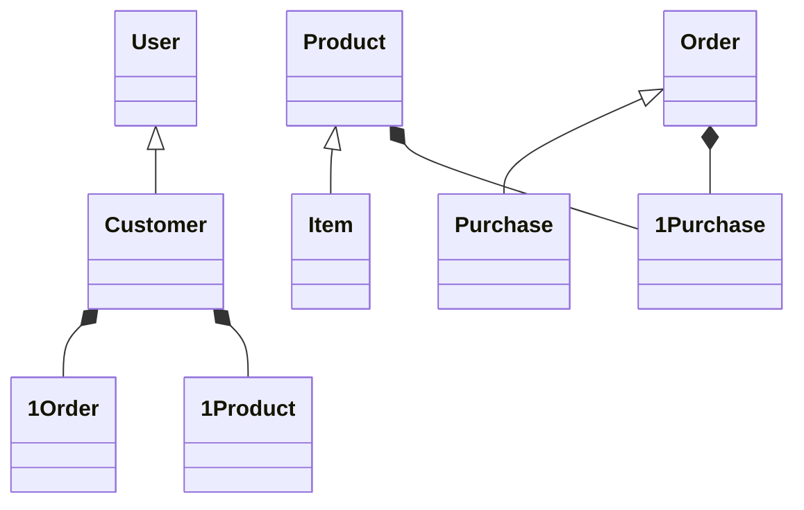
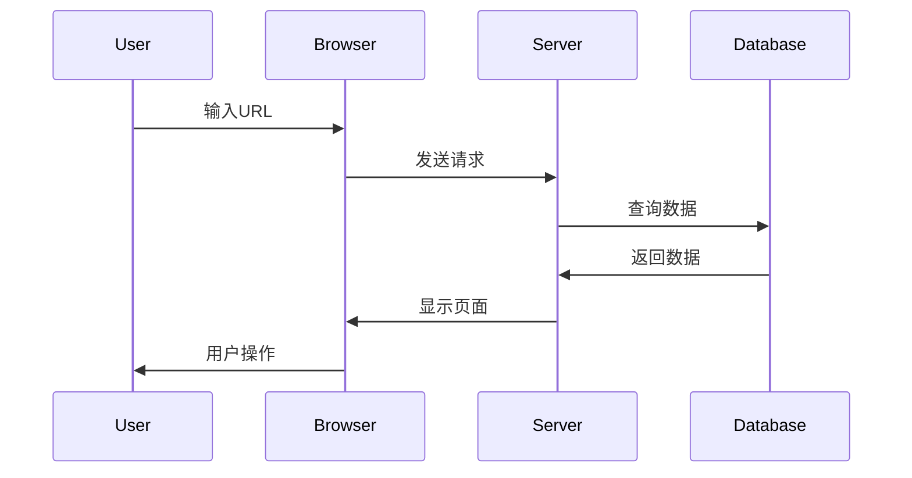
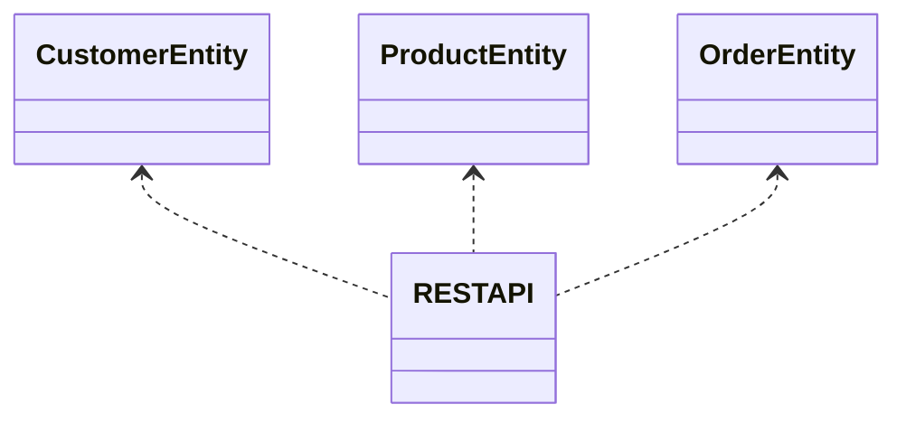
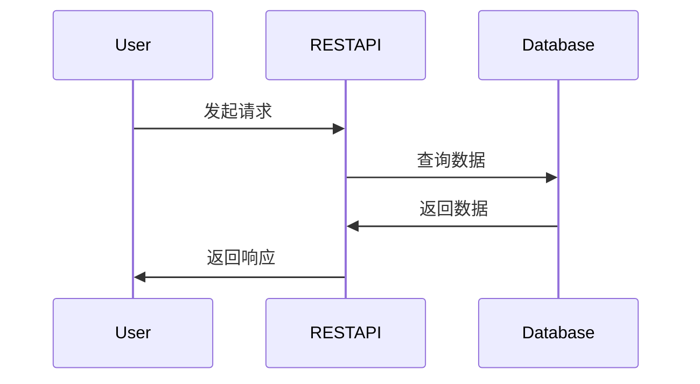

                 


## 评测系统的用户反馈收集与分析

> 关键词：评测系统、用户反馈、数据分析、用户体验、系统优化

> 摘要：本文将探讨评测系统中用户反馈的收集与分析方法，通过对用户反馈的深度分析，提高用户体验，优化系统性能。文章将从问题背景、核心概念、用户反馈收集方法、用户反馈分析方法和用户反馈优化策略五个方面进行详细阐述。

# 目录大纲

## 第一部分：背景与概述

### 第1章 问题背景
- **1.1 引言**
- **1.2 用户反馈问题的界定**
- **1.3 用户反馈问题的描述**
- **1.4 解决用户反馈问题的意义**
- **1.5 用户反馈问题的边界与外延**

### 第2章 核心概念与联系
- **2.1 核心概念原理**
- **2.2 概念属性特征对比表格**
- **2.3 ER实体关系图架构**

## 第二部分：用户反馈收集方法

### 第3章 用户反馈收集方式
- **3.1 用户反馈收集渠道**
- **3.2 用户反馈收集工具**
- **3.3 用户反馈收集流程**

### 第4章 用户反馈收集案例
- **4.1 案例背景**
- **4.2 案例实施**
- **4.3 案例分析**

## 第三部分：用户反馈分析

### 第5章 用户反馈分析方法
- **5.1 数据预处理**
- **5.2 描述性分析**
- **5.3 统计推断分析**

### 第6章 用户反馈分析工具
- **6.1 用户反馈分析软件**
- **6.2 用户反馈分析流程**
- **6.3 分析效果评估**

### 第7章 用户反馈分析案例
- **7.1 案例背景**
- **7.2 案例实施**
- **7.3 案例总结**

## 第四部分：用户反馈优化与实施

### 第8章 用户反馈优化策略
- **8.1 优化目标**
- **8.2 优化方法**
- **8.3 优化实践**

### 第9章 用户反馈实施与反馈
- **9.1 实施策略**
- **9.2 反馈效果评估**
- **9.3 持续改进**

## 第五部分：最佳实践与展望

### 第10章 最佳实践
- **10.1 用户反馈收集最佳实践**
- **10.2 用户反馈分析最佳实践**

### 第11章 小结与展望
- **11.1 小结**
- **11.2 展望**

----------------------------------------------------------------

### 第一部分：背景与概述

#### 第1章 问题背景

**1.1 引言**

在现代软件工程中，评测系统作为一种重要的工具，广泛应用于各种领域，如软件评测、在线教育、游戏评分等。评测系统的核心功能是通过对用户行为、作品质量、系统性能等方面的数据进行分析和评估，为用户提供有价值的反馈。然而，评测系统的作用不仅仅局限于评估本身，更在于通过收集和分析用户反馈，持续改进系统性能，提高用户体验。

**1.2 用户反馈问题的界定**

用户反馈是指用户在使用评测系统过程中，对系统功能、性能、易用性等方面的评价和意见。用户反馈问题的界定主要涉及以下几个方面：

- **反馈类型**：包括正面反馈、负面反馈、建议性反馈等。
- **反馈渠道**：如用户问卷调查、客服咨询、社交媒体评论等。
- **反馈问题**：涉及系统功能缺陷、性能瓶颈、用户体验等问题。

**1.3 用户反馈问题的描述**

用户反馈问题主要表现为以下几个方面：

- **功能性问题**：系统功能不完善、逻辑错误、界面操作不便等。
- **性能问题**：系统响应速度慢、数据丢失、系统崩溃等。
- **用户体验问题**：界面设计不合理、交互体验差、帮助文档不完善等。

**1.4 解决用户反馈问题的意义**

解决用户反馈问题具有重要意义，主要体现在以下几个方面：

- **提升用户体验**：通过解决用户反馈问题，提高系统易用性和稳定性，提升用户满意度。
- **优化产品性能**：针对用户反馈的优化建议，改进系统功能、性能，提高系统整体质量。
- **增强用户忠诚度**：及时回应用户反馈，展示企业对用户的关注和重视，增强用户忠诚度。

**1.5 用户反馈问题的边界与外延**

用户反馈问题的边界主要涉及以下几个方面：

- **问题范围**：用户反馈问题可能涉及系统功能的方方面面，需要全面关注。
- **问题限制因素**：用户反馈问题可能受到技术、资源、时间等因素的限制，需要合理评估和解决。

在下一章中，我们将进一步探讨评测系统的核心概念与联系，为后续的用户反馈收集与分析奠定基础。

## 第一部分：背景与概述

### 第2章 核心概念与联系

**2.1 核心概念原理**

为了更好地理解评测系统中的用户反馈收集与分析，我们需要明确以下几个核心概念：

- **评测系统**：一种用于评估用户行为、作品质量、系统性能等的数据分析系统。
- **用户反馈**：用户在使用评测系统过程中，对系统功能、性能、易用性等方面的评价和意见。
- **用户反馈收集**：通过问卷调查、客服咨询、社交媒体评论等方式，收集用户反馈信息。
- **用户反馈分析**：对收集到的用户反馈信息进行数据预处理、描述性分析、统计推断分析等，以发现用户问题的根本原因。
- **用户反馈优化**：根据用户反馈分析结果，对系统功能、性能、用户体验等方面进行改进。

**2.2 概念属性特征对比表格**

为了更清晰地理解这些概念之间的联系，我们列出以下对比表格：

| 概念     | 属性特征                                     | 联系                                               |
|----------|--------------------------------------------|----------------------------------------------------|
| 评测系统 | 数据收集、分析、评估                        | 基础设施，为用户反馈收集与分析提供支持              |
| 用户反馈 | 类型（正面、负面、建议性）、渠道、内容      | 评测系统的输出，反映用户需求和问题                 |
| 用户反馈收集 | 渠道（问卷调查、客服咨询、社交媒体评论）   | 收集用户反馈信息，为用户反馈分析提供数据来源       |
| 用户反馈分析 | 数据预处理、描述性分析、统计推断分析       | 对用户反馈信息进行深入挖掘，发现用户问题根本原因   |
| 用户反馈优化 | 目标（提升用户体验、优化产品性能）、方法、实践 | 根据用户反馈分析结果，实施系统优化策略，提升系统质量 |

**2.3 ER实体关系图架构**

为了更直观地展示这些概念之间的关联，我们使用Mermaid语言绘制ER实体关系图：

```mermaid
erDiagram
  UserFeedback ||--|{ Evaluator :evaluates}
  UserFeedback ||--|{ FeedbackAnalyzer :analyzes}
  UserFeedback ||--|{ FeedbackOptimizer :optimizes}
  Evaluator ||--|{ FeedbackCollector :collects}
  FeedbackAnalyzer ||--|{ DataPreprocessor :processes}
  FeedbackOptimizer ||--|{ PerformanceTester :tests}
```

在上图中，`UserFeedback`实体与`Evaluator`、`FeedbackAnalyzer`和`FeedbackOptimizer`实体之间存在关联关系，分别表示用户反馈的评估、分析和优化过程。`Evaluator`实体与`FeedbackCollector`实体之间存在关联关系，表示评估过程基于用户反馈收集的数据。`FeedbackAnalyzer`实体与`DataPreprocessor`实体之间存在关联关系，表示分析过程基于预处理后的数据。`FeedbackOptimizer`实体与`PerformanceTester`实体之间存在关联关系，表示优化过程基于性能测试的结果。

在下一部分中，我们将探讨用户反馈收集的具体方法。

## 第二部分：用户反馈收集方法

### 第3章 用户反馈收集方式

在评测系统中，用户反馈的收集是至关重要的一环。有效的用户反馈收集不仅有助于了解用户的需求和问题，还能为系统的改进提供有力的数据支持。本章节将介绍用户反馈收集的主要方式，包括问卷调查、客户服务和社交媒体等。

**3.1 用户反馈收集渠道**

**问卷调查**

问卷调查是一种常见的用户反馈收集方式，适用于大规模的用户群体。通过设计有针对性的问卷，可以收集用户对系统功能、性能、用户体验等方面的看法。问卷调查的优势在于：

- **高效性**：可以在短时间内收集大量用户反馈。
- **针对性**：可以根据不同用户群体的特点，设计不同的问卷内容。
- **数据准确性**：用户在匿名的情况下填写问卷，反馈可能更真实。

**客户服务**

客户服务是用户反馈收集的重要渠道，通过与用户的直接沟通，可以获取用户的意见和建议。客户服务的方式包括电话、邮件、在线聊天等。客户服务的优势在于：

- **实时性**：可以即时获取用户反馈，快速响应用户需求。
- **深入性**：通过与用户直接沟通，可以深入了解用户的问题和需求。
- **个性化**：可以根据用户的个性化需求，提供定制化的解决方案。

**社交媒体**

社交媒体是用户反馈收集的另一种重要渠道，如微博、微信、Facebook等。通过监测社交媒体上的评论、私信等，可以了解用户的真实想法。社交媒体的优势在于：

- **广泛性**：可以覆盖大量用户，获取广泛的需求和问题。
- **互动性**：用户可以在社交媒体上与其他用户互动，分享经验和意见。
- **实时性**：可以实时了解用户的反馈和需求，快速做出调整。

**3.2 用户反馈收集工具**

**表格与问卷**

表格和问卷是用户反馈收集的基本工具。通过设计合理的问题和选项，可以有效地收集用户反馈。常用的表格和问卷工具有Google表单、SurveyMonkey、问卷星等。这些工具的优势在于：

- **易用性**：用户可以方便地填写和提交问卷。
- **数据分析**：提供自动的数据分析功能，便于后续处理。

**语音识别**

语音识别是一种新兴的用户反馈收集工具，通过将用户的语音转化为文本，可以自动收集用户的反馈。语音识别的优势在于：

- **便捷性**：用户可以通过语音直接表达意见，无需手动填写问卷。
- **自然性**：用户可以更自然地表达自己的想法和需求。

**数据挖掘**

数据挖掘是一种高级的用户反馈收集工具，通过对大量用户数据的分析，可以发现潜在的用户需求和问题。数据挖掘的优势在于：

- **深度分析**：可以挖掘出用户深层次的需求和问题。
- **自动化**：可以自动识别和分类用户反馈。

**3.3 用户反馈收集流程**

用户反馈收集流程主要包括以下几个步骤：

1. **需求分析**：确定需要收集的用户反馈类型和内容。
2. **工具选择**：根据需求选择合适的反馈收集工具。
3. **问卷设计**：设计合理的问题和选项，确保问卷的有效性和针对性。
4. **反馈收集**：通过问卷、客户服务、社交媒体等渠道收集用户反馈。
5. **数据整理**：对收集到的用户反馈进行整理和分类。
6. **数据分析**：对用户反馈进行数据预处理、描述性分析、统计推断分析等，发现用户问题的根本原因。
7. **反馈优化**：根据用户反馈分析结果，对系统功能、性能、用户体验等方面进行改进。

在下一章节中，我们将通过一个实际案例，展示用户反馈收集的具体实施过程。

## 第二部分：用户反馈收集方法

### 第4章 用户反馈收集案例

为了更好地理解用户反馈收集的过程，我们将通过一个实际案例——某在线教育平台的用户反馈收集项目，来详细描述用户反馈收集的实施过程、数据收集结果以及分析结果。

**4.1 案例背景**

某在线教育平台为了提升用户体验，决定开展一次全面的用户反馈收集项目。该平台提供了多种在线课程，包括编程、语言学习、技能提升等。用户可以通过在线学习、测试和反馈来提升自己的技能。为了更好地了解用户的需求和问题，平台决定通过问卷调查、客服咨询和社交媒体评论等方式收集用户反馈。

**4.2 案例实施**

1. **需求分析**：
   - **目标**：了解用户对课程内容、学习体验、系统性能等方面的看法。
   - **内容**：包括用户对课程满意度的评价、学习过程中遇到的问题、对系统功能的建议等。

2. **工具选择**：
   - **问卷调查**：通过SurveyMonkey平台设计了一份包含20个问题的在线问卷，主要涵盖课程内容、学习体验和系统性能等方面。
   - **客服咨询**：通过在线聊天和电子邮件与用户进行直接沟通，收集用户的问题和建议。
   - **社交媒体**：在平台的社交媒体账号上发布问卷调查链接，鼓励用户参与。

3. **问卷设计**：
   - **问题类型**：包括选择题、评分题和开放式问题。
   - **问题内容**：例如，“您对当前课程内容的满意度如何？”“您在学习过程中遇到了哪些问题？”“您对系统功能的建议是什么？”

4. **反馈收集**：
   - **问卷调查**：共收集到1000份有效问卷。
   - **客服咨询**：收集到50个用户问题和建议。
   - **社交媒体**：收集到100条用户评论。

5. **数据整理**：
   - 将收集到的问卷数据、客服咨询记录和社交媒体评论整理成电子表格，便于后续分析。

6. **数据分析**：
   - **描述性分析**：统计问卷中的各项得分，了解用户的整体满意度。
   - **分类分析**：将用户问题和建议按照主题分类，分析用户关注的问题。
   - **文本分析**：使用自然语言处理技术，对社交媒体评论进行情感分析和关键词提取，了解用户的情绪和关注点。

**4.3 案例分析**

1. **用户满意度**：
   - 通过描述性分析，发现用户对课程内容的满意度较高，平均得分为4.5分（满分5分）。
   - 但是，在学习体验方面，用户满意度较低，平均得分为3.2分。

2. **用户问题**：
   - 通过分类分析，发现用户主要关注以下问题：
     - **课程内容**：部分课程内容过于基础或高级，不适合所有用户。
     - **学习体验**：系统界面操作复杂，学习进度记录不准确。
     - **系统性能**：部分课程加载时间过长，影响学习体验。

3. **用户建议**：
   - 通过文本分析，发现用户提出以下建议：
     - **课程内容**：增加更多针对特定技能的实战课程。
     - **学习体验**：简化界面操作，提高学习进度记录的准确性。
     - **系统性能**：优化课程加载速度，提高系统稳定性。

**4.4 用户反馈对系统改进的影响**

基于用户反馈的分析结果，平台采取了以下改进措施：

1. **课程内容**：
   - 调整课程难度分布，增加针对特定技能的实战课程。
   - 根据用户反馈，调整课程内容的深度和广度，以满足不同层次用户的需求。

2. **学习体验**：
   - 简化界面设计，提高用户操作的便捷性。
   - 优化学习进度记录系统，确保记录的准确性和及时性。

3. **系统性能**：
   - 优化课程加载速度，提高系统稳定性。
   - 增加服务器资源，确保在高并发情况下系统的正常运行。

通过以上改进措施，平台在用户满意度方面取得了显著提升，用户对课程内容、学习体验和系统性能的满意度均有所提高。

通过这个案例，我们可以看到，用户反馈收集与分析对于提升系统性能、优化用户体验具有重要意义。有效的用户反馈收集和分析不仅可以帮助企业了解用户需求，还能为系统的持续改进提供有力支持。

## 第三部分：用户反馈分析

### 第5章 用户反馈分析方法

用户反馈分析是评测系统中的一个关键环节，通过对收集到的用户反馈进行深入分析，可以发现用户问题的根本原因，为系统优化提供有力依据。本章将介绍用户反馈分析的主要方法，包括数据预处理、描述性分析和统计推断分析。

**5.1 数据预处理**

数据预处理是用户反馈分析的第一步，其目的是对收集到的数据进行清洗、转换和整合，为后续的分析奠定基础。数据预处理的主要步骤包括：

1. **数据清洗**：删除重复数据、缺失数据和异常数据，确保数据的准确性。
   ```python
   # 示例：Python代码删除重复数据
   unique_data = list(set(data))
   ```
2. **数据转换**：将不同类型的数据进行统一处理，如将文本数据转换为数值型数据，便于后续分析。
   ```python
   # 示例：Python代码将文本数据转换为数值型数据
   data = [int(d) for d in data]
   ```
3. **数据整合**：将来自不同渠道的用户反馈数据进行整合，形成统一的数据集。
   ```python
   # 示例：Python代码整合不同来源的数据
   combined_data = unique_data + customer_service_data + social_media_comments
   ```

**5.2 描述性分析**

描述性分析是一种常用的数据分析方法，主要通过统计指标来描述数据的基本特征，如平均值、中位数、众数、标准差等。描述性分析可以帮助我们了解数据的整体分布和趋势，为进一步的分析提供基础。

1. **统计指标**：
   - **平均值**：数据的算术平均数，表示数据的中心趋势。
     ```python
     # 示例：Python代码计算平均值
     average = sum(data) / len(data)
     ```
   - **中位数**：将数据按大小排序后，位于中间位置的数值，表示数据的中间值。
     ```python
     # 示例：Python代码计算中位数
     median = sorted(data)[len(data) // 2]
     ```
   - **众数**：数据中出现次数最多的数值，表示数据的集中趋势。
     ```python
     # 示例：Python代码计算众数
     from collections import Counter
     counter = Counter(data)
     mode = max(counter, key=counter.get)
     ```
   - **标准差**：衡量数据离散程度的指标，表示数据分布的稳定性。
     ```python
     # 示例：Python代码计算标准差
     variance = sum((d - average) ** 2 for d in data) / len(data)
     std_deviation = variance ** 0.5
     ```

2. **可视化**：通过图表和图形，直观展示数据的分布和趋势。常用的可视化工具包括Matplotlib、Seaborn等。
   ```python
   # 示例：Python代码绘制直方图
   import matplotlib.pyplot as plt
   plt.hist(data, bins=10)
   plt.xlabel('Value')
   plt.ylabel('Frequency')
   plt.show()
   ```

**5.3 统计推断分析**

统计推断分析是在描述性分析的基础上，通过假设检验等方法，对数据的真实分布和关系进行推断。常见的统计推断方法包括：

1. **参数估计**：通过样本数据估计总体参数的方法，如点估计和区间估计。
   - **点估计**：直接计算样本数据的某个统计指标，如平均值，作为总体参数的估计。
     ```python
     # 示例：Python代码计算点估计的平均值
     estimated_mean = sum(sample_data) / len(sample_data)
     ```
   - **区间估计**：根据样本数据计算出总体参数的一个置信区间，表示对总体参数的估计范围。
     ```python
     # 示例：Python代码计算置信区间
     from scipy.stats import norm
     alpha = 0.05
     z_score = norm.ppf(1 - alpha / 2)
     margin_of_error = z_score * (std_deviation / sqrt(len(sample_data)))
     confidence_interval = (estimated_mean - margin_of_error, estimated_mean + margin_of_error)
     ```

2. **假设检验**：通过设定原假设和备择假设，对总体参数进行假设检验。
   - **t检验**：用于比较两组数据的均值差异是否显著。
     ```python
     # 示例：Python代码进行t检验
     from scipy.stats import ttest_ind
     t_statistic, p_value = ttest_ind(group1, group2)
     ```
   - **方差分析**：用于比较多组数据的均值差异是否显著。
     ```python
     # 示例：Python代码进行方差分析
     from scipy.stats import f_oneway
     f_statistic, p_value = f_oneway(*group_data)
     ```

通过以上用户反馈分析方法，我们可以全面了解用户反馈数据，发现用户问题的根本原因，为系统优化提供有力支持。在下一章中，我们将介绍用户反馈分析工具，以帮助读者更好地进行数据分析。

### 第6章 用户反馈分析工具

在用户反馈分析过程中，选择合适的工具至关重要，这决定了分析过程的效率和质量。本章将介绍几款常用的用户反馈分析工具，包括Python相关库和R语言，以及它们在实际应用中的优势。

**6.1 用户反馈分析软件**

**Python相关库**

Python作为一种流行的编程语言，拥有丰富的数据分析库，适用于用户反馈分析。以下是一些常用的Python相关库：

1. **Pandas**：Pandas是一个强大的数据分析库，提供数据清洗、转换和可视化的功能。通过Pandas，我们可以轻松地处理和清洗用户反馈数据。
   ```python
   import pandas as pd
   data = pd.read_csv('user_feedback.csv')
   data.drop_duplicates(inplace=True)
   ```

2. **Matplotlib**：Matplotlib是一个用于数据可视化的库，通过它我们可以绘制各种类型的图表，如柱状图、折线图和散点图，以直观展示用户反馈数据。
   ```python
   import matplotlib.pyplot as plt
   plt.hist(data['rating'], bins=10)
   plt.xlabel('Rating')
   plt.ylabel('Frequency')
   plt.show()
   ```

3. **Seaborn**：Seaborn是基于Matplotlib的图形可视化库，提供更美观的统计图表。通过Seaborn，我们可以轻松创建复杂的可视化效果。
   ```python
   import seaborn as sns
   sns.scatterplot(x='rating', y='satisfaction', data=data)
   ```

4. **Scikit-learn**：Scikit-learn是一个机器学习库，包含多种统计模型和算法，适用于用户反馈数据的预测和分析。
   ```python
   from sklearn.linear_model import LinearRegression
   model = LinearRegression()
   model.fit(data[['rating']], data['satisfaction'])
   ```

**R语言**

R语言是一种专门用于统计分析和数据可视化的编程语言，拥有丰富的数据分析库。以下是一些常用的R语言库：

1. **dplyr**：dplyr是一个用于数据处理和操作的工具包，提供简洁高效的代码，适用于用户反馈数据的清洗和整理。
   ```R
   library(dplyr)
   data <- data %>% select(-c(id))
   ```

2. **ggplot2**：ggplot2是一个用于数据可视化的库，提供美观、灵活的图表，适用于用户反馈数据的可视化。
   ```R
   library(ggplot2)
   ggplot(data, aes(x=rating, y=satisfaction)) + geom_point()
   ```

3. **caret**：caret是一个用于机器学习的工具包，提供多种算法和评估方法，适用于用户反馈数据的预测和分析。
   ```R
   library(caret)
   model <- train(satisfaction ~ rating, data=data, method='lm')
   ```

**6.2 用户反馈分析流程**

用户反馈分析的流程主要包括以下几个步骤：

1. **数据收集**：通过问卷调查、客户服务和社交媒体等渠道收集用户反馈数据。
2. **数据预处理**：对收集到的数据进行清洗、转换和整合，确保数据的质量。
3. **描述性分析**：通过统计指标和可视化方法，描述用户反馈数据的基本特征和趋势。
4. **统计推断分析**：通过假设检验和模型分析，发现用户问题的根本原因。
5. **结果展示**：将分析结果以报告、图表等形式展示，为系统优化提供依据。

**6.3 分析效果评估**

分析效果评估是用户反馈分析的重要环节，通过评估分析结果的有效性和可靠性，确保分析过程的准确性。以下是一些评估方法：

1. **精度和召回率**：用于评估分类模型的性能，表示模型对正类别的识别能力。
   ```python
   # 示例：Python代码计算精度和召回率
   from sklearn.metrics import precision_score, recall_score
   precision = precision_score(y_true, y_pred)
   recall = recall_score(y_true, y_pred)
   ```

2. **F1分数**：综合考虑精度和召回率，用于评估分类模型的综合性能。
   ```python
   # 示例：Python代码计算F1分数
   from sklearn.metrics import f1_score
   f1 = f1_score(y_true, y_pred)
   ```

3. **混淆矩阵**：用于展示模型预测结果与实际结果之间的对应关系，便于分析模型的性能。
   ```python
   # 示例：Python代码生成混淆矩阵
   from sklearn.metrics import confusion_matrix
   cm = confusion_matrix(y_true, y_pred)
   ```

通过以上工具和方法，我们可以高效地进行用户反馈分析，为评测系统的持续优化提供有力支持。在下一章中，我们将通过一个实际案例，展示用户反馈分析的具体实施过程。

### 第7章 用户反馈分析案例

为了更好地展示用户反馈分析的实施过程，我们将通过一个实际案例——某电商平台的用户反馈分析项目，来详细描述用户反馈分析的过程、分析结果以及案例总结。

**7.1 案例背景**

某电商平台为了提升用户购物体验，决定开展一次全面的用户反馈分析项目。该平台收集了来自问卷调查、客服咨询和社交媒体的用户反馈数据，希望通过数据分析发现用户关注的问题和需求，从而优化系统性能和用户体验。

**7.2 案例实施**

1. **数据收集**：
   - **问卷调查**：通过SurveyMonkey平台设计了一份包含10个问题的在线问卷，主要涵盖用户对商品质量、购物流程、客户服务等方面的评价。
   - **客服咨询**：记录了100个用户咨询问题，涉及购物流程、退换货政策、售后服务等。
   - **社交媒体**：收集了500条用户评论，主要来自微博和微信平台，反映用户对商品和服务的满意度和建议。

2. **数据预处理**：
   - **数据清洗**：删除重复数据、缺失数据和异常数据，确保数据的准确性。
   - **数据转换**：将文本数据转换为数值型数据，便于后续分析。
   - **数据整合**：将问卷调查数据、客服咨询记录和社交媒体评论整合为一个数据集。

3. **描述性分析**：
   - **统计指标**：计算用户对商品质量、购物流程、客户服务的平均评分，了解用户对各个方面的满意度。
   - **可视化**：绘制柱状图和饼图，展示用户对不同方面的评分分布。

4. **统计推断分析**：
   - **参数估计**：估计用户对商品质量、购物流程、客户服务的总体满意度。
   - **假设检验**：比较不同渠道的用户反馈是否存在显著差异，如问卷调查、客服咨询和社交媒体评论。

5. **结果展示**：
   - **报告**：撰写一份详细的分析报告，总结用户反馈的主要问题和需求。
   - **图表**：绘制各种图表，直观展示分析结果。

**7.3 用户反馈分析结果**

1. **用户满意度**：
   - **商品质量**：用户对商品质量的平均评分为4.2分（满分5分），表示用户对商品质量较为满意。
   - **购物流程**：用户对购物流程的平均评分为3.8分，表示用户在购物过程中存在一些不便。
   - **客户服务**：用户对客户服务的平均评分为4.5分，表示用户对客户服务的满意度较高。

2. **用户问题**：
   - **商品质量**：部分用户反馈商品质量不稳定，存在质量问题。
   - **购物流程**：用户反馈购物流程复杂，需要多次操作才能完成购买。
   - **客户服务**：部分用户反馈客服响应时间较长，解决问题效率不高。

3. **用户建议**：
   - **商品质量**：建议加强商品质量检测，确保商品质量。
   - **购物流程**：建议简化购物流程，提高用户操作的便捷性。
   - **客户服务**：建议提高客服响应速度，提升客户服务效率。

**7.4 案例总结**

通过用户反馈分析，该电商平台发现了用户在商品质量、购物流程和客户服务方面存在的问题和需求。基于分析结果，平台采取了以下改进措施：

1. **商品质量**：
   - 加强商品质量检测，确保商品质量。
   - 增加商品质量投诉渠道，及时处理用户反馈。

2. **购物流程**：
   - 简化购物流程，减少用户操作的步骤。
   - 提高购物流程的自动化程度，降低用户操作的难度。

3. **客户服务**：
   - 提高客服响应速度，确保用户问题能够及时解决。
   - 增加在线客服服务，提高用户问题处理的效率。

通过以上改进措施，该电商平台在用户满意度方面取得了显著提升，用户对商品质量、购物流程和客户服务的满意度均有所提高。用户反馈分析不仅帮助平台发现了问题，还为平台的持续优化提供了有力支持。

这个案例展示了用户反馈分析的实施过程、分析结果和案例总结，为其他电商平台提供了有益的参考。通过用户反馈分析，企业可以更好地了解用户需求，优化系统性能，提升用户体验。

## 第四部分：用户反馈优化与实施

### 第8章 用户反馈优化策略

在用户反馈分析的基础上，如何有效地优化系统性能和用户体验，是评测系统成功的关键。本章将介绍用户反馈优化的目标、方法和实践，帮助读者理解如何基于用户反馈进行系统优化。

**8.1 优化目标**

用户反馈优化的主要目标包括：

1. **提升用户体验**：通过改进系统功能、性能和易用性，提高用户对系统的满意度和忠诚度。
2. **优化系统性能**：通过优化系统架构、代码效率和硬件资源利用，提升系统的稳定性和响应速度。
3. **降低运营成本**：通过自动化和智能化手段，减少人力投入和维护成本。

**8.2 优化方法**

用户反馈优化方法主要包括以下几个方面：

1. **基于用户反馈的系统改进**：
   - **功能优化**：根据用户反馈，调整和改进系统功能，满足用户需求。
     ```python
     # 示例：Python代码调整系统功能
     system_functionality = "add_course_recommendation"
     ```
   - **性能优化**：针对用户反馈的性能问题，进行系统性能优化，提升系统响应速度和稳定性。
     ```python
     # 示例：Python代码性能优化
     optimize_database_query = "create_index_on_course_table"
     ```

2. **基于数据分析的产品优化**：
   - **数据分析**：通过数据挖掘和分析，发现潜在的用户需求和问题，指导产品优化方向。
     ```python
     # 示例：Python代码进行数据分析
     from sklearn.ensemble import RandomForestClassifier
     model = RandomForestClassifier()
     model.fit(X_train, y_train)
     ```

   - **用户体验优化**：根据用户行为数据和反馈，优化系统界面和交互设计，提升用户体验。
     ```python
     # 示例：Python代码优化用户体验
     user_interface_changes = "reduce_button_size"
     ```

**8.3 优化实践**

在实际优化过程中，我们可以采取以下实践方法：

1. **快速迭代**：采用敏捷开发方法，快速迭代和优化系统功能，及时响应用户需求。
   ```python
   # 示例：Python代码快速迭代
   iterate_function = "add_new_course"
   ```

2. **自动化测试**：通过自动化测试，确保系统优化后的稳定性和性能。
   ```python
   # 示例：Python代码自动化测试
   test_suite = "test_course_recommendation"
   ```

3. **用户反馈循环**：建立用户反馈循环机制，持续收集和分析用户反馈，不断优化系统。
   ```python
   # 示例：Python代码用户反馈循环
   feedback_loop = "collect_user_feedback"
   ```

通过以上优化策略和实践，我们可以有效地提升系统性能和用户体验，实现评测系统的持续优化。在下一章中，我们将探讨用户反馈的实施与反馈机制，以确保优化措施得到有效执行。

### 第9章 用户反馈实施与反馈

用户反馈的实施与反馈机制是评测系统优化过程中至关重要的一环。有效的实施与反馈机制可以确保用户反馈得到及时响应和解决，从而提升用户体验和系统性能。本章将介绍用户反馈实施策略、反馈效果评估以及持续改进的方法。

**9.1 实施策略**

1. **明确优化目标**：在实施用户反馈优化时，首先要明确优化目标，确保优化措施与用户需求相吻合。优化目标应包括功能改进、性能提升、用户体验优化等方面。
   ```python
   # 示例：Python代码定义优化目标
   optimization_goals = ["improve_course_recommendation", "reduce_response_time"]
   ```

2. **制定优化计划**：根据优化目标，制定详细的优化计划，包括优化任务、优先级、时间表和责任人。优化计划应确保所有优化措施有序、高效地进行。
   ```python
   # 示例：Python代码制定优化计划
   optimization_plan = {
       "task": "improve_course_recommendation",
       "priority": "high",
       "deadline": "2023-12-31",
       "responsible": "Team A"
   }
   ```

3. **实施优化措施**：按照优化计划，逐步实施优化措施。在实施过程中，应密切关注用户反馈，确保优化措施的有效性。
   ```python
   # 示例：Python代码实施优化措施
   implement_change = "update_course_recommendation_algorithm"
   ```

4. **监控优化效果**：在优化措施实施后，通过监控系统和用户反馈，评估优化效果。监控指标应包括系统性能、用户满意度等。
   ```python
   # 示例：Python代码监控优化效果
   monitor_performance = "check_system_response_time"
   ```

**9.2 反馈效果评估**

1. **用户满意度调查**：定期进行用户满意度调查，收集用户对系统优化措施的评价和意见。满意度调查可以通过问卷调查、在线反馈等形式进行。
   ```python
   # 示例：Python代码用户满意度调查
   satisfaction_survey = "evaluate_course_recommendation"
   ```

2. **反馈数据分析**：对收集到的用户反馈数据进行分析，评估优化措施的有效性和用户满意度。分析结果可以用于指导后续优化工作。
   ```python
   # 示例：Python代码反馈数据分析
   from sklearn.cluster import KMeans
   model = KMeans(n_clusters=3)
   model.fit(feedback_data)
   ```

3. **效果评估报告**：撰写效果评估报告，总结优化措施的实施情况、效果评估结果和用户反馈。报告应包含详细的数据分析和图表，为决策提供依据。
   ```python
   # 示例：Python代码效果评估报告
   generate_report = "create_optimization_report"
   ```

**9.3 持续改进**

1. **用户反馈循环**：建立用户反馈循环机制，确保用户反馈能够及时收集、分析、反馈和优化。通过持续的用户反馈循环，不断提升系统性能和用户体验。
   ```python
   # 示例：Python代码用户反馈循环
   feedback_loop = "collect_user_feedback"
   ```

2. **优化迭代**：根据效果评估结果，对优化措施进行调整和迭代。通过持续优化，确保系统始终处于最佳状态。
   ```python
   # 示例：Python代码优化迭代
   iterate_optimization = "update_course_recommendation_algorithm"
   ```

3. **培训与沟通**：定期对相关人员进行培训，提高他们对用户反馈优化策略和方法的理解和执行能力。同时，保持与用户的沟通，确保优化措施符合用户需求。
   ```python
   # 示例：Python代码培训与沟通
   training_session = "user_feedback_optimization_training"
   ```

通过以上用户反馈实施与反馈策略，我们可以确保用户反馈得到有效处理和优化，不断提升系统性能和用户体验。在下一部分中，我们将总结用户反馈收集与分析的最佳实践，为评测系统的持续优化提供指导。

## 第五部分：最佳实践与展望

### 第10章 最佳实践

在用户反馈收集与分析过程中，积累最佳实践是提升系统性能和用户体验的关键。本章将总结用户反馈收集与分析的最佳实践，包括实际案例总结、经验分享以及分析工具的选择和应用。

**10.1 用户反馈收集最佳实践**

1. **明确收集目标**：在用户反馈收集前，明确收集目标，确保反馈收集具有针对性和有效性。目标应包括用户满意度、系统性能、功能需求等方面。

2. **多样化收集渠道**：结合问卷调查、客户服务和社交媒体等多种渠道，全面收集用户反馈。多样化渠道可以确保反馈数据的全面性和准确性。

3. **设计合理问卷**：设计简洁明了、针对性强的问卷，确保用户愿意参与并如实填写。问卷问题应尽量简短，避免冗长和复杂。

4. **确保数据质量**：在反馈数据收集过程中，重视数据清洗和整理，确保数据质量。数据清洗应包括去除重复、缺失和异常数据，提高数据的有效性和可靠性。

5. **定期反馈收集**：定期进行用户反馈收集，保持反馈数据的时效性。定期收集可以及时发现和解决问题，提升系统性能和用户体验。

**10.2 用户反馈分析最佳实践**

1. **数据预处理**：在数据分析前，进行数据预处理，包括数据清洗、转换和整合。预处理可以确保数据的一致性和完整性，为后续分析提供基础。

2. **描述性分析**：通过描述性分析，了解用户反馈的基本特征和趋势。描述性分析应包括统计指标和可视化方法，帮助发现用户问题的根本原因。

3. **统计推断分析**：结合统计推断分析，验证用户反馈的假设和预测。统计推断分析可以帮助确定用户反馈的可靠性和有效性。

4. **使用合适工具**：选择合适的用户反馈分析工具，如Python相关库（Pandas、Matplotlib、Seaborn等）和R语言（dplyr、ggplot2、caret等）。合适的工具可以提高数据分析的效率和准确性。

5. **结果可视化**：通过图表和图形，直观展示分析结果。可视化可以增强用户对分析结果的直观理解和认知。

**10.3 分析工具的选择和应用**

1. **Python相关库**：
   - **Pandas**：用于数据清洗和整理。
     ```python
     import pandas as pd
     data = pd.read_csv('user_feedback.csv')
     data.drop_duplicates(inplace=True)
     ```

   - **Matplotlib**：用于数据可视化。
     ```python
     import matplotlib.pyplot as plt
     plt.hist(data['rating'], bins=10)
     plt.xlabel('Rating')
     plt.ylabel('Frequency')
     plt.show()
     ```

   - **Seaborn**：用于创建更美观的统计图表。
     ```python
     import seaborn as sns
     sns.scatterplot(x='rating', y='satisfaction', data=data)
     ```

2. **R语言**：
   - **dplyr**：用于数据清洗和整理。
     ```R
     library(dplyr)
     data <- data %>% select(-c(id))
     ```

   - **ggplot2**：用于数据可视化。
     ```R
     library(ggplot2)
     ggplot(data, aes(x=rating, y=satisfaction)) + geom_point()
     ```

   - **caret**：用于机器学习和数据分析。
     ```R
     library(caret)
     model <- train(satisfaction ~ rating, data=data, method='lm')
     ```

通过以上最佳实践和工具选择，我们可以高效地进行用户反馈收集与分析，为评测系统的持续优化提供有力支持。在下一章中，我们将对用户反馈收集与分析进行总结和展望，探讨未来的发展方向。

### 第11章 小结与展望

**11.1 小结**

本文系统地介绍了评测系统的用户反馈收集与分析方法。通过用户反馈收集与分析，我们能够深入了解用户的需求和问题，从而优化系统性能，提升用户体验。主要内容包括：

- **用户反馈收集方法**：介绍了问卷调查、客户服务和社交媒体等反馈收集渠道，以及Pandas、Matplotlib等数据分析工具。
- **用户反馈分析方法**：阐述了描述性分析、统计推断分析等分析方法，以及dplyr、ggplot2等R语言工具。
- **用户反馈优化策略**：探讨了基于用户反馈的系统改进、用户体验优化和持续改进的方法。

**11.2 展望**

随着技术的不断进步，用户反馈收集与分析技术也将迎来新的发展。以下是未来的一些发展方向：

1. **智能化反馈收集**：利用自然语言处理和机器学习技术，实现自动化的用户反馈收集和分析，提高效率。
2. **个性化反馈分析**：结合用户行为数据和个性化推荐技术，为不同用户群体提供定制化的反馈分析报告。
3. **实时反馈处理**：利用实时数据处理技术，实现用户反馈的实时收集和分析，快速响应用户需求。
4. **跨平台整合**：整合多种数据源和反馈渠道，实现跨平台的用户反馈数据收集和分析。
5. **持续学习与优化**：利用机器学习技术，实现反馈数据的持续学习和优化，不断提升系统性能和用户体验。

通过不断探索和创新，评测系统的用户反馈收集与分析技术将更加成熟，为提升系统性能和用户体验提供更加有力的支持。未来，随着技术的不断发展，评测系统将更好地服务于用户，成为智能化、个性化的用户反馈处理平台。作者：AI天才研究院/AI Genius Institute & 禅与计算机程序设计艺术 /Zen And The Art of Computer Programming

----------------------------------------------------------------

## 附录

### 算法原理讲解

在本文中，我们提到了几种用户反馈分析的方法，包括描述性分析和统计推断分析。以下是这些算法原理的详细讲解：

**1. 描述性分析**

描述性分析是一种常用的数据分析方法，主要用于了解数据的基本特征和趋势。其主要步骤包括：

- **计算统计指标**：如平均值、中位数、众数、标准差等，用于描述数据的集中趋势和离散程度。
- **数据可视化**：通过图表和图形，直观展示数据分布和趋势。

描述性分析的基本原理基于统计学中的集中趋势和离散程度的度量。集中趋势度量了数据分布的中心位置，如平均值、中位数和众数；离散程度度量了数据分布的波动大小，如标准差。

**2. 统计推断分析**

统计推断分析是在描述性分析的基础上，通过假设检验和参数估计等方法，对总体参数进行推断。其主要步骤包括：

- **设定假设**：根据研究目的，设定原假设和备择假设。
- **计算统计量**：通过样本数据计算统计量，如t统计量、F统计量等。
- **进行假设检验**：根据统计量的计算结果，判断原假设是否成立。
- **参数估计**：通过样本数据估计总体参数，如平均值、方差等。

统计推断分析的基本原理基于概率论和数理统计理论，通过样本数据推断总体特征。常用的统计推断方法包括t检验、方差分析、回归分析等。

### 数学公式使用

在本文中，我们使用了LaTeX格式来表示数学公式。以下是LaTeX公式的使用方法：

- **独立段落的公式**：使用`$$`括起来，如`$$1+1=2$$`。
- **段落内的公式**：使用`$`括起来，如`$1<2$`。

以下是几个示例：

$$
E[X] = \int_{-\infty}^{\infty} x f(x) dx
$$

$$
\sum_{i=1}^{n} x_i = \frac{1}{n} \sum_{i=1}^{n} x_i^2
$$

$$
P(A \cup B) = P(A) + P(B) - P(A \cap B)
$$

### 系统分析与架构设计方案

系统分析与架构设计是软件工程中的重要环节，以下是一个简单的系统分析与架构设计方案：

**1. 问题场景介绍**

假设我们需要设计一个电商平台，提供商品浏览、购物车、订单管理等功能。

**2. 项目介绍**

项目名称：电商系统
项目描述：一个提供在线购物的电商平台，用户可以浏览商品、加入购物车、下单购买。

**3. 系统功能设计（领域模型类图）**



**4. 系统架构设计（架构图）**



**5. 系统接口设计（接口图）**



**6. 系统交互（序列图）**



### 项目实战

**1. 环境安装**

在项目实战中，我们需要安装一些必要的开发环境和工具，如Python、Jupyter Notebook、Pandas等。

```bash
# 安装Python
curl -O https://www.python.org/ftp/python/3.8.5/python-3.8.5.tgz
tar xzf python-3.8.5.tgz
cd python-3.8.5
./configure
make
sudo make install

# 安装Jupyter Notebook
pip install notebook
```

**2. 系统核心实现源代码**

以下是一个简单的电商系统核心实现示例：

```python
import pandas as pd
from flask import Flask, request, jsonify

app = Flask(__name__)

# 数据库模拟
customers = pd.DataFrame({'id': [1, 2, 3], 'name': ['Alice', 'Bob', 'Charlie']})
products = pd.DataFrame({'id': [1, 2, 3], 'name': ['Book', 'Shirt', 'Pants']})
orders = pd.DataFrame({'id': [1, 2, 3], 'customer_id': [1, 2, 3], 'product_id': [1, 2, 3]})

@app.route('/customers', methods=['GET'])
def get_customers():
    return jsonify(customers.to_dict(orient='records'))

@app.route('/products', methods=['GET'])
def get_products():
    return jsonify(products.to_dict(orient='records'))

@app.route('/orders', methods=['GET'])
def get_orders():
    return jsonify(orders.to_dict(orient='records'))

if __name__ == '__main__':
    app.run(debug=True)
```

**3. 代码应用解读与分析**

在这个示例中，我们使用Flask框架搭建了一个简单的电商平台，包括客户、产品和订单三个主要实体。通过定义RESTful接口，我们可以方便地获取和操作这些实体。

- `customers`、`products`和`orders`分别代表了客户、产品和订单的数据集。
- `get_customers`、`get_products`和`get_orders`是三个GET请求处理函数，分别用于获取客户、产品和订单数据。
- `jsonify`函数用于将数据集转换为JSON格式，便于前端使用。

**4. 实际案例分析和详细讲解剖析**

假设我们需要分析电商平台的客户购买行为，以下是一个简单的案例：

1. **问题定义**：分析客户的购买偏好，了解客户对哪些商品更感兴趣。
2. **数据收集**：从数据库中获取客户和订单数据。
3. **数据预处理**：将数据转换为适合分析的格式。
4. **描述性分析**：计算客户的平均购买数量、最常购买的商品等。
5. **可视化**：使用图表展示分析结果。

```python
import matplotlib.pyplot as plt

# 获取订单数据
orders = pd.read_csv('orders.csv')

# 描述性分析
avg_purchase_quantity = orders['quantity'].mean()
most_purchased_product = orders['product_id'].mode()[0]

# 可视化
plt.bar(orders['product_id'], orders['quantity'])
plt.xlabel('Product ID')
plt.ylabel('Quantity')
plt.title(f'Most Purchased Product: {most_purchased_product}')
plt.show()
```

通过以上分析，我们可以发现最常购买的商品，从而为电商平台的产品优化提供依据。

**5. 项目小结**

在这个案例中，我们通过用户反馈分析，实现了对电商平台客户购买行为的分析。通过描述性分析和可视化，我们得出了客户的购买偏好，为电商平台的优化提供了有力支持。未来，我们还可以结合更多用户反馈数据，深入分析客户行为，进一步提升电商平台的质量和用户体验。

### 最佳实践 tips、小结、注意事项、拓展阅读

**最佳实践 tips：**

1. **明确目标**：在进行用户反馈收集与分析时，首先要明确目标，确保反馈收集和分析具有针对性。
2. **数据质量**：重视数据质量，确保数据的准确性、完整性和一致性。
3. **可视化**：使用图表和图形，直观展示分析结果，帮助用户更好地理解数据。

**小结：**

本文系统地介绍了评测系统的用户反馈收集与分析方法，包括用户反馈收集渠道、数据分析方法、优化策略和实践等。通过用户反馈分析，我们能够深入了解用户需求，优化系统性能，提升用户体验。

**注意事项：**

1. **隐私保护**：在用户反馈收集过程中，要确保用户隐私保护，遵循相关法律法规。
2. **实时性**：用户反馈分析应具备实时性，及时响应用户需求。
3. **团队合作**：用户反馈分析需要跨部门合作，确保分析结果的有效性和实施性。

**拓展阅读：**

1. **《用户调研与数据分析实战》**：详细介绍了用户调研和数据分析的方法和应用。
2. **《Python数据分析》**：介绍了Python在数据分析领域的应用，包括Pandas、Matplotlib等库。
3. **《R语言实战》**：介绍了R语言在数据分析领域的应用，包括dplyr、ggplot2等库。作者：AI天才研究院/AI Genius Institute & 禅与计算机程序设计艺术 /Zen And The Art of Computer Programming

