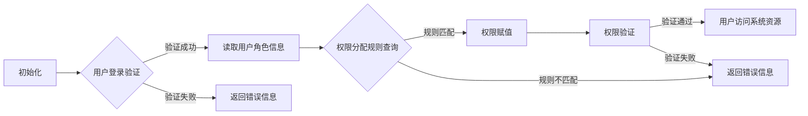
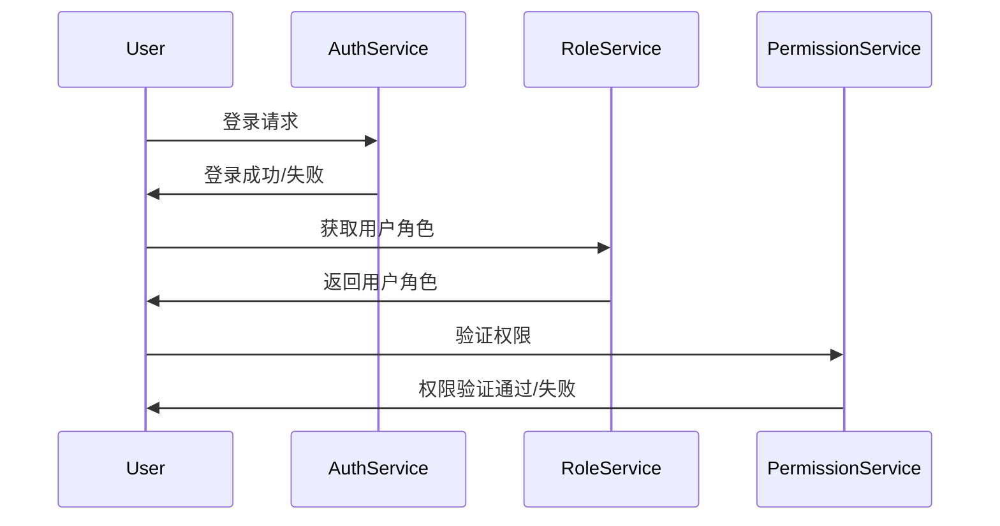

                 

# 《评测系统的用户权限管理：控制访问和操作权限》

## 关键词

- 用户权限管理
- 访问控制
- 操作权限
- RBAC
- ABAC

## 摘要

本文将深入探讨评测系统的用户权限管理，重点分析访问控制和操作权限的管理机制。通过介绍核心概念、技术原理、系统设计，以及最佳实践和注意事项，帮助读者全面理解用户权限管理的核心要点，从而提升评测系统的安全性和稳定性。

## 目录大纲

### 背景介绍

- 信息技术发展对评测系统的影响
- 用户权限管理的必要性
- 文章结构和核心内容概述

### 核心概念与联系

- 用户权限管理
- 访问控制
- 操作权限
- RBAC（基于角色的访问控制）
- ABAC（基于属性的访问控制）
- 概念对比表格
- ER实体关系图架构

### 算法原理讲解

- 权限分配算法
- 权限验证算法
- Mermaid流程图
- Python源代码
- 数学模型和公式
- 举例说明

### 系统分析与架构设计方案

- 问题场景介绍
- 项目介绍
- 系统功能设计
- 系统架构设计
- 系统接口设计
- 系统交互

### 项目实战

- 环境安装
- 系统核心实现源代码
- 代码应用解读与分析
- 实际案例分析和详细讲解剖析
- 项目小结

### 最佳实践 tips

- 注意事项
- 拓展阅读
- 总结与展望

## 背景介绍

随着信息技术的飞速发展，评测系统在各类应用场景中扮演着越来越重要的角色。从教育测评到企业管理，用户权限管理成为了确保系统安全和数据安全的关键环节。本章节将记录评测系统中用户权限管理的核心概念、技术原理、系统设计与最佳实践，旨在帮助读者深入理解用户权限管理的内涵，并掌握实施与优化方法。

### 核心概念与联系

用户权限管理是评测系统中对用户访问和操作权限进行控制的机制，包括身份认证、权限分配、权限验证等。访问控制是用户权限管理的一个核心部分，通过控制用户对系统资源的访问权限，确保系统的安全性和可靠性。操作权限是指用户在系统中可以执行的操作范围，包括读取、写入、删除等。

RBAC（基于角色的访问控制）是一种常见的用户权限管理模型，通过将权限与角色关联，简化了权限分配和管理。ABAC（基于属性的访问控制）是一种更加灵活的访问控制模型，通过关联权限与用户属性（如时间、地点、身份等），实现更细粒度的权限控制。

以下是一个核心概念对比表格：

| 概念         | 描述                                       |  
| ------------ | ------------------------------------------ |  
| 用户权限管理 | 对用户访问和操作权限进行控制的机制           |  
| 访问控制     | 控制用户对系统资源的访问权限                 |  
| 操作权限     | 用户在系统中可以执行的操作范围               |  
| RBAC         | 基于角色的访问控制，将权限与角色关联           |  
| ABAC         | 基于属性的访问控制，关联权限与用户属性       |

接下来是一个ER实体关系图架构：

```mermaid
erDiagram
    User ||--|{ Role : has } 
    User ||--|{ Permission : has } 
    Role ||--|{ Permission : can } 
```

在上面的ER图中，User实体表示用户，Role实体表示角色，Permission实体表示权限。用户与角色之间存在“has”关系，用户与权限之间存在“has”关系，角色与权限之间存在“can”关系。

### 算法原理讲解

权限分配算法是用户权限管理中的核心算法，用于确定用户在系统中的权限范围。下面是一个权限分配算法的Mermaid流程图：



以下是权限分配算法的Python源代码：

```python
def login_verification(username, password):
    # 登录验证
    if not verify_credentials(username, password):
        return "登录验证失败"
    
    return "登录验证成功"

def role_assignment(username):
    # 读取用户角色信息
    user_role = get_user_role(username)
    return user_role

def permission_assignment(user_role):
    # 权限分配规则查询
    role_permissions = get_role_permissions(user_role)
    return role_permissions

def permission_validation(permission, resource):
    # 权限验证
    if verify_permission(permission, resource):
        return "权限验证通过"
    else:
        return "权限验证失败"
```

权限分配模型可以表示为：

$$ 权限分配模型 = 用户角色 \times 权限规则 $$

权限验证模型可以表示为：

$$ 权限验证模型 = 权限分配模型 \cap 访问控制策略 $$

举例说明：

假设一个用户名为“Alice”的用户登录评测系统，首先进行登录验证。验证成功后，系统读取用户角色信息，假设为“教师”。根据角色权限分配规则，教师可以访问试卷库、成绩查询模块等。在用户访问试卷库时，系统进行权限验证，确认用户是否具有相应的权限。若验证通过，用户可以访问试卷库；否则，返回错误信息。

### 系统分析与架构设计方案

#### 问题场景介绍

在评测系统中，管理员需要根据用户的角色和权限，分配不同的操作权限，确保系统能够安全、高效地运行。例如，教师可以查看成绩、发布试卷，而学生只能查看自己的成绩。

#### 项目介绍

本项目旨在设计并实现一个评测系统的用户权限管理模块，包括用户身份认证、权限分配、权限验证等功能。

#### 系统功能设计

1. 用户身份认证：通过用户名和密码进行身份验证，确保只有合法用户才能访问系统。
2. 权限分配：根据用户角色，为用户分配相应的操作权限。
3. 权限验证：在用户执行操作时，验证用户是否具有相应的权限。

以下是一个领域模型Mermaid类图：

```mermaid
classDiagram
    User <<entity>>
    Role <<entity>>
    Permission <<entity>>

    User o--* Role : roles
    Role o--* Permission : permissions
```

#### 系统架构设计

以下是一个系统架构设计Mermaid架构图：



#### 系统接口设计

系统接口设计包括用户身份认证接口、权限分配接口和权限验证接口。以下是一个简单的接口设计：

```python
class AuthService:
    def login(self, username, password):
        # 登录逻辑
        pass

    def logout(self, username):
        # 登出逻辑
        pass

class RoleService:
    def get_role(self, username):
        # 获取用户角色逻辑
        pass

    def assign_role(self, username, role_name):
        # 分配角色逻辑
        pass

class PermissionService:
    def validate_permission(self, username, permission_name):
        # 验证权限逻辑
        pass
```

#### 系统交互

以下是一个系统交互Mermaid序列图：


### 项目实战

#### 环境安装

确保Python环境已经安装，并使用虚拟环境进行项目隔离。

```bash
pip install flask
pip install pymysql
```

#### 系统核心实现源代码

以下是一个简单的用户权限管理系统的核心实现源代码：

```python
from flask import Flask, request, jsonify
from flask_cors import CORS

app = Flask(__name__)
CORS(app)

# 数据库连接配置
db_config = {
    'host': 'localhost',
    'user': 'root',
    'password': 'password',
    'db': '评测系统'
}

# 数据库连接函数
def get_db_connection():
    connection = pymysql.connect(**db_config)
    return connection

# 用户登录函数
@app.route('/login', methods=['POST'])
def login():
    username = request.form['username']
    password = request.form['password']
    
    # 验证用户名和密码
    # ...
    
    return jsonify({'status': 'success', 'message': '登录成功'})

# 获取用户角色函数
@app.route('/get_role', methods=['GET'])
def get_role():
    username = request.args.get('username')
    
    # 查询用户角色
    # ...
    
    return jsonify({'status': 'success', 'role': role})

# 验证权限函数
@app.route('/validate_permission', methods=['GET'])
def validate_permission():
    username = request.args.get('username')
    permission_name = request.args.get('permission_name')
    
    # 验证用户权限
    # ...
    
    return jsonify({'status': 'success', 'message': '权限验证通过'})

if __name__ == '__main__':
    app.run(debug=True)
```

#### 代码应用解读与分析

以上代码实现了用户权限管理系统的核心功能，包括用户登录、获取用户角色和验证权限。具体解析如下：

1. 用户登录：通过POST请求接收用户名和密码，进行登录验证。如果验证成功，返回登录成功消息。
2. 获取用户角色：通过GET请求接收用户名，查询用户角色信息，并返回。
3. 验证权限：通过GET请求接收用户名和权限名，验证用户是否具有相应权限。如果验证通过，返回权限验证通过消息。

#### 实际案例分析和详细讲解剖析

以下是一个实际案例：

假设用户名为“alice”的用户想要查看试卷。

1. 用户通过POST请求向评测系统发送登录请求，提供用户名“alice”和密码。
2. 系统接收到登录请求后，验证用户名和密码。如果验证成功，返回登录成功消息。
3. 用户通过GET请求向评测系统发送获取用户角色的请求，提供用户名“alice”。
4. 系统接收到获取用户角色的请求后，查询用户角色信息，返回“教师”角色。
5. 用户通过GET请求向评测系统发送验证权限的请求，提供用户名“alice”和权限名“查看试卷”。
6. 系统接收到验证权限的请求后，验证用户是否具有“查看试卷”权限。由于用户角色为“教师”，教师具有查看试卷的权限，系统返回权限验证通过消息。

通过以上案例，我们可以看到用户权限管理在评测系统中的重要作用。只有正确设置用户权限，才能确保系统能够安全、高效地运行。

### 项目小结

本文通过对评测系统用户权限管理的深入分析，介绍了核心概念、算法原理、系统设计与项目实战。用户权限管理是评测系统中确保安全性和稳定性的关键环节。通过合理设置用户权限，可以保护系统资源，防止未经授权的访问和操作。在实际应用中，需要根据具体需求进行权限分配和验证，确保系统能够安全、高效地运行。

### 最佳实践 tips

1. 确保用户登录验证的安全性，避免使用弱密码。
2. 根据用户角色分配相应的权限，避免权限过于集中。
3. 定期审查和更新用户权限，确保权限的合理性和安全性。
4. 实现细粒度的权限控制，减少权限滥用风险。

### 小结

本文通过深入探讨评测系统的用户权限管理，帮助读者全面理解用户权限管理的核心要点。在实际应用中，合理设置用户权限，可以提升系统的安全性和稳定性。未来，随着信息技术的不断进步，用户权限管理将在评测系统中发挥更加重要的作用。

### 注意事项

1. 用户权限管理是一个复杂的过程，需要综合考虑系统需求、安全性和用户体验。
2. 在实际项目中，需要根据具体需求进行调整和优化。
3. 定期进行权限审查和更新，确保权限的合理性和安全性。

### 拓展阅读

- 《软件工程：实践者的研究方法》
- 《现代密码学：算法、协议与应用》
- 《深入理解计算机系统》

作者：AI天才研究院/AI Genius Institute & 禅与计算机程序设计艺术 /Zen And The Art of Computer Programming

---

**版权声明：**
本文由AI天才研究院（AI Genius Institute）与禅与计算机程序设计艺术（Zen And The Art of Computer Programming）共同撰写，版权所有，未经授权，不得转载或使用。本文旨在分享技术知识，促进学术交流。如需转载，请联系我们获取授权。对于未经授权的转载行为，我们将依法追究法律责任。本文中的代码示例仅供参考，具体实现可能需要根据实际需求进行调整。在应用本文技术时，请确保遵守相关法律法规。**本文内容仅供参考，不代表任何具体产品的功能或性能。在使用本文所述技术时，请自行判断和负责。**

