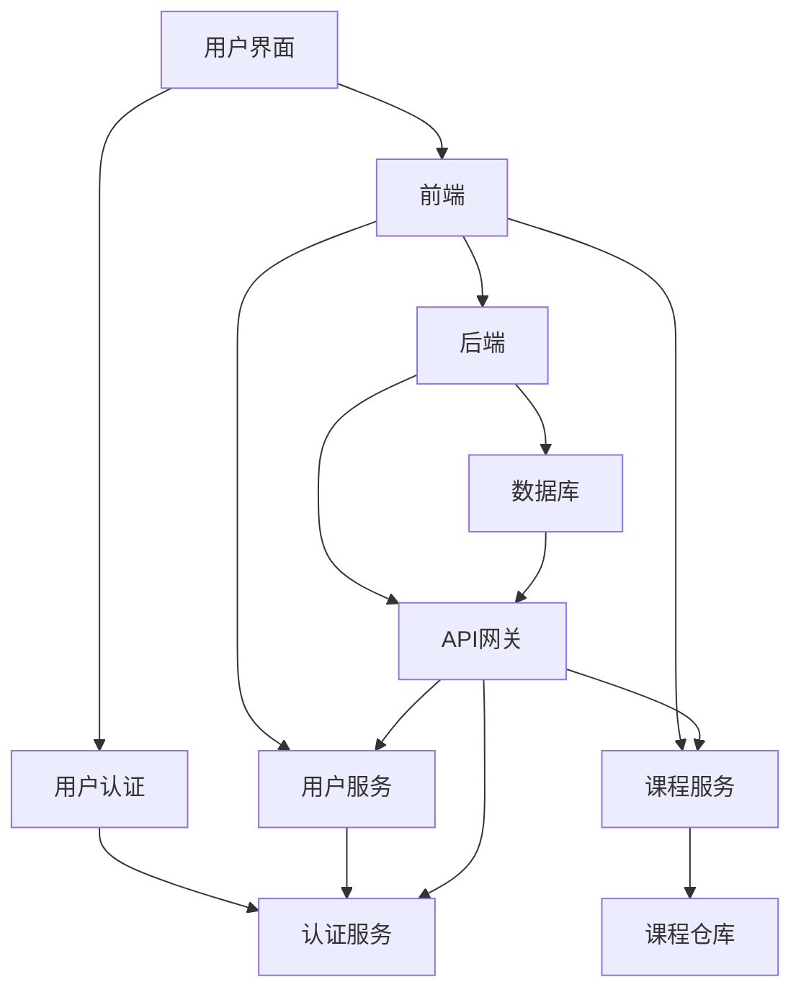
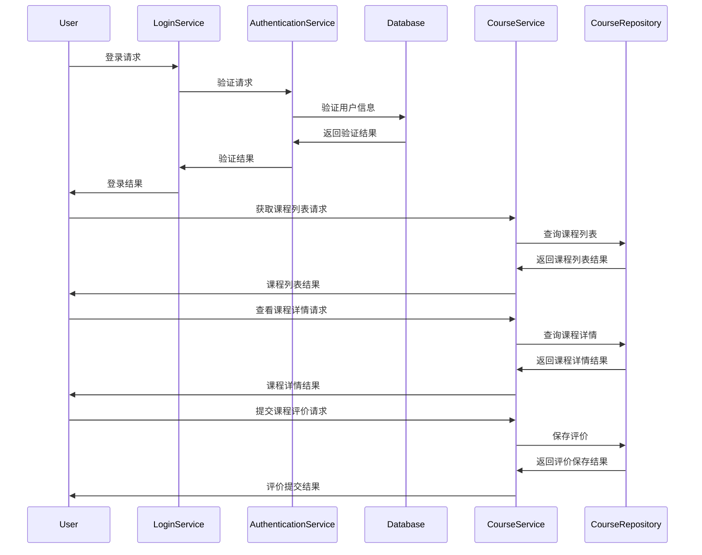
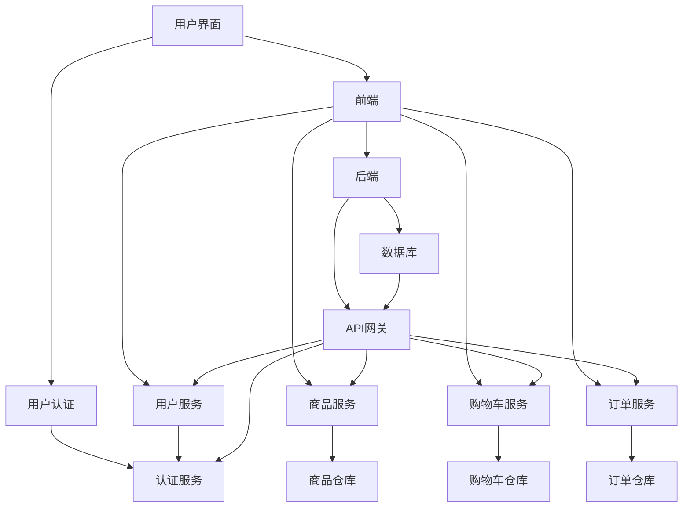
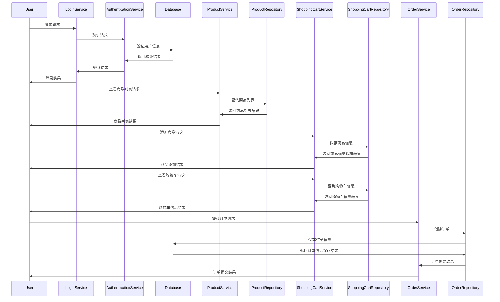
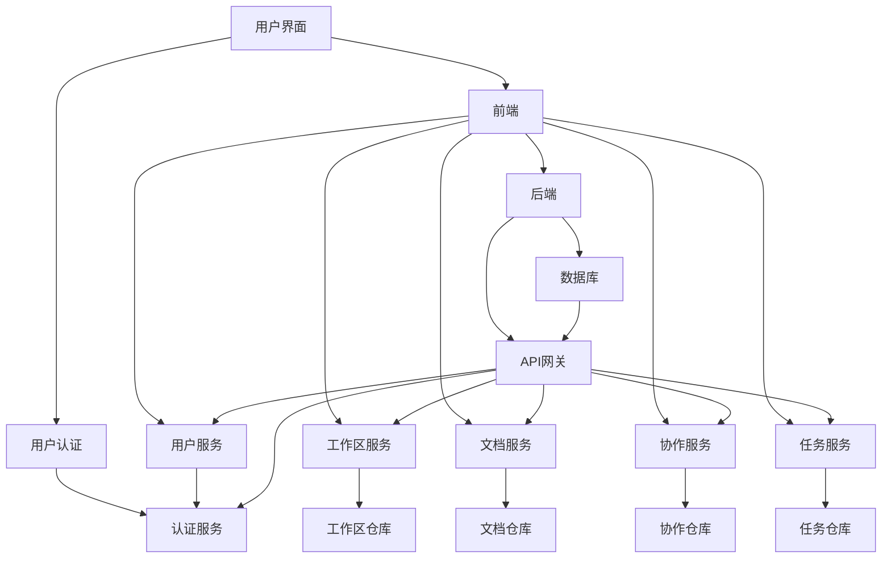
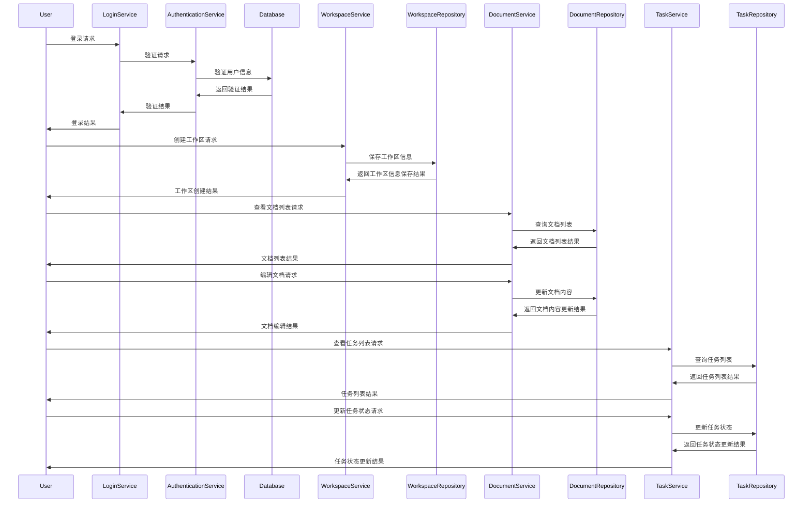
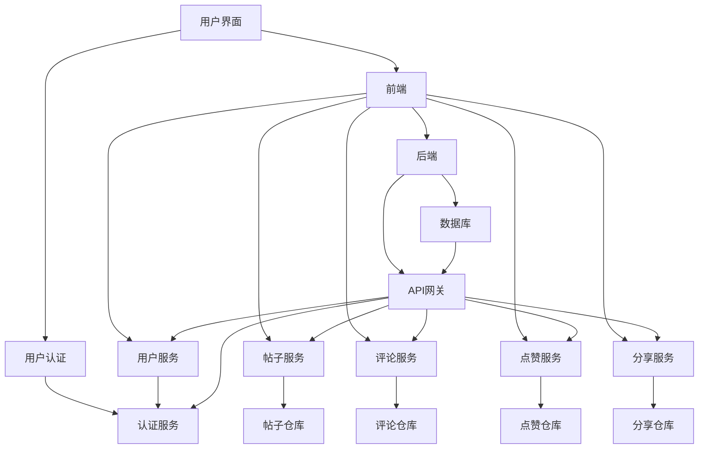
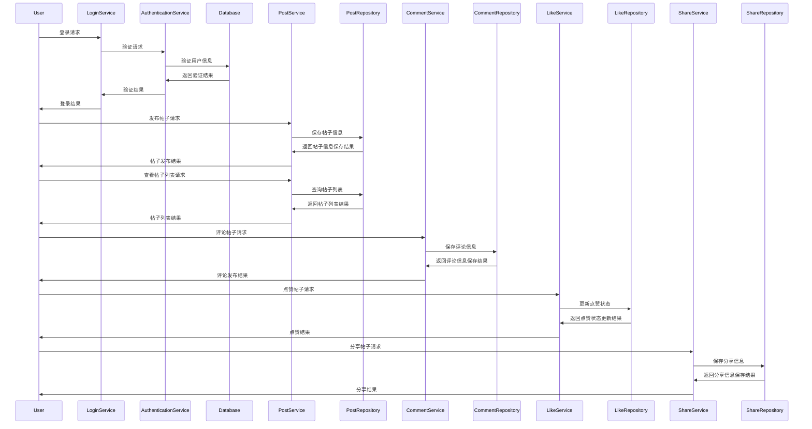
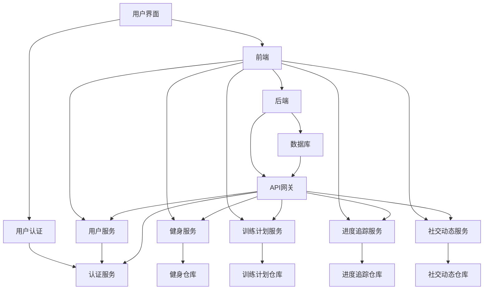
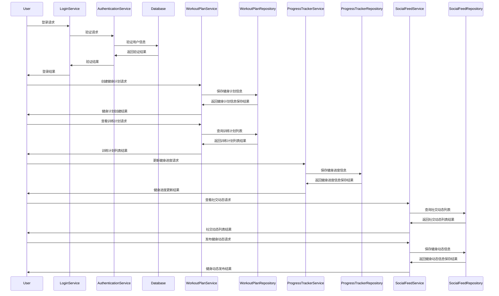

                 

### 引言：评测系统的用户界面与交互设计

**关键词**：评测系统、用户界面设计、交互设计、用户体验、UI/UX 设计、评估方法

**摘要**：
本文旨在探讨评测系统的用户界面与交互设计，重点关注其核心概念、方法、工具和技术。通过深入分析用户界面设计（UI）和用户体验设计（UX）的基本原则，我们探讨了如何有效地评估和改进系统以提升用户满意度。文章还提供了实际的案例研究，以展示最佳实践，并讨论了设计过程中的注意事项。

在当今技术快速发展的时代，评测系统的用户界面与交互设计（UI/UX）变得尤为重要。这不仅关乎用户的第一印象，还直接影响到用户的使用体验和系统效率。一个精心设计的用户界面能够提高用户的参与度，降低学习成本，从而增强用户对系统的满意度和忠诚度。

用户界面设计专注于用户与系统交互的视觉和操作方面，确保界面美观且易于导航。而用户体验设计则从更广泛的角度出发，关注用户在使用过程中的情感和心理体验。两者相辅相成，共同构成了一个优质评测系统的关键组成部分。

本文将逐步分析以下内容：

1. **问题背景**：介绍评测系统及其重要性，解释用户界面和交互设计的基本概念。
2. **核心概念和原则**：深入探讨用户界面设计（UI）和用户体验设计（UX）的基本原理。
3. **方法和技巧**：详细讲解用户研究、交互设计和视觉设计的方法和技术。
4. **工具和技术**：介绍UI/UX设计常用的软件、开发工具和评估工具。
5. **案例分析**：通过实际案例研究，展示优秀的UI/UX设计实践。
6. **总结与拓展**：总结文章要点，提供设计建议，并指引用户进一步阅读的文献。

通过本文的阅读，读者将获得关于评测系统用户界面与交互设计的深入理解，学会如何设计一个既美观又实用的系统界面，以提升用户满意度和系统性能。

### 1.1 问题背景

**定义评测系统**：评测系统是一种专门用于评估用户操作、系统性能或产品质量的计算机程序。这些系统广泛应用于各种领域，包括电子商务、游戏、教育、医疗和企业管理等。它们通过收集和分析用户行为数据，为开发人员提供宝贵的信息，帮助他们优化系统性能和用户体验。

**评测系统的重要性**：评测系统在现代软件开发中的地位愈发重要。首先，它们帮助开发者了解用户如何与系统交互，发现潜在的问题和瓶颈。通过数据驱动的决策，开发者可以及时调整和优化系统设计，从而提高系统的可用性和用户满意度。其次，评测系统可以量化用户行为，为产品经理和项目经理提供关键性能指标（KPI），帮助他们在竞争激烈的市场中做出明智的决策。最后，良好的用户体验直接关系到产品的市场成功。一个界面友好、操作流畅的评测系统能够显著降低用户的学习成本，提高用户留存率和转化率。

**用户界面设计与交互设计的基本概念**：

- **用户界面设计（UI）**：用户界面设计关注的是用户与系统交互的视觉和操作方面。它旨在创建直观、美观且易于导航的界面，使用户能够轻松完成任务。UI设计包括布局、颜色、字体、图标和按钮等方面。

- **用户体验设计（UX）**：用户体验设计则从更广泛的角度出发，关注用户在使用系统过程中的整体感受。UX设计不仅关注界面的外观，还关注交互流程、内容组织、易用性和情感体验。UX设计的目标是提高用户满意度、减少用户沮丧感，并增强用户对产品的忠诚度。

- **用户研究**：用户研究是UI/UX设计的基石。通过收集和分析用户需求、行为和反馈，设计师可以更好地理解目标用户，从而创建更符合用户需求的设计方案。

- **交互设计**：交互设计关注用户与系统之间的交互方式。它包括信息架构、导航设计、交互元素设计和动作反馈等方面。良好的交互设计能够提高系统的可用性和用户满意度。

- **视觉设计**：视觉设计专注于界面的视觉表现，包括布局、色彩、字体、图标和图片等方面。视觉设计的目标是创造吸引人的界面，增强用户体验。

**UI/UX设计在评测系统中的作用**：

- **提升用户满意度**：一个精心设计的用户界面可以显著提升用户满意度。直观的导航、清晰的信息展示和美观的界面设计能够使用户感到舒适和愉悦。

- **降低学习成本**：良好的UI/UX设计可以帮助新用户快速上手系统，减少学习成本。通过简洁的界面和明确的操作指示，用户可以更高效地完成任务。

- **优化系统性能**：通过评估用户行为和系统性能，UI/UX设计可以帮助开发者发现系统中的潜在问题。这些信息有助于优化系统设计，提高系统性能。

- **增加用户留存率**：一个优秀的用户体验能够增加用户对产品的忠诚度，从而提高用户留存率。通过持续优化UI/UX设计，开发者可以吸引更多用户，并留住现有用户。

总之，UI/UX设计在评测系统中扮演着至关重要的角色。通过深入研究用户需求和行为，设计师可以创建一个既美观又实用的系统界面，从而提升用户满意度、系统性能和商业成功。

### 1.2 问题描述

在当前软件开发中，用户界面与交互设计（UI/UX）面临诸多挑战。这些挑战主要体现在以下几个方面：

**1.2.1 用户需求多样性和复杂性**：随着科技的发展和用户需求的多样化，开发者需要面对更加复杂和多样化的用户需求。不同用户群体对界面的期望、操作习惯和信息展示方式都有所不同。例如，对于电子商务网站，年轻用户可能更偏好简洁、动态的界面，而中老年用户可能更偏好简单、清晰的界面。此外，不同领域的用户对系统的功能需求和操作流程也有不同的期望。这种需求多样性和复杂性使得UI/UX设计变得更加复杂和具有挑战性。

**1.2.2 技术快速更新和变化**：随着技术的快速发展和更新，UI/UX设计也需要不断适应新的技术趋势。例如，移动设备的普及和用户对触控操作的偏好，使得设计师需要重新考虑界面的布局和交互方式。此外，新兴技术如虚拟现实（VR）、增强现实（AR）和人工智能（AI）也为UI/UX设计带来了新的机遇和挑战。设计师需要不断学习和掌握新的设计工具和技术，以满足不断变化的市场需求。

**1.2.3 系统性能和可用性要求**：评测系统作为一种专门用于评估用户操作和系统性能的工具，对系统的性能和可用性有较高的要求。一个设计良好的UI/UX系统能够提高用户的操作效率，减少错误率，从而提升系统性能。然而，实现高性能和高可用性的系统界面设计并非易事。设计师需要在美观性、操作简便性和系统性能之间找到平衡点。

**1.2.4 用户体验的一致性和个性化**：用户体验的一致性和个性化是UI/UX设计的另一个重要挑战。一方面，用户希望界面一致、易于理解，以便快速完成任务。另一方面，用户又希望界面能够根据个人喜好和需求进行定制化，以满足个性化的需求。例如，一些用户可能偏好简洁的界面，而另一些用户则可能偏好信息丰富且功能齐全的界面。设计师需要在一致性和个性化之间找到平衡，以提供最佳的用户体验。

**1.2.5 时间和资源限制**：UI/UX设计通常需要较长时间和大量资源的投入。然而，许多开发项目往往面临时间紧迫和资源有限的限制。在这种背景下，设计师需要在有限的时间内完成高质量的设计工作。这要求设计师具备高效的工作流程和快速解决问题的能力，以便在时间和资源的压力下依然能够提供满意的设计方案。

**1.2.6 跨文化和跨地区设计**：随着全球化的发展，UI/UX设计也需要考虑跨文化和跨地区的设计。不同文化背景的用户对界面元素的理解和使用习惯有所不同。例如，某些文化中，用户对界面的颜色和布局有特定的偏好。设计师需要了解不同文化背景的用户需求，并设计出符合全球用户需求的设计方案。

综上所述，UI/UX设计在评测系统中面临诸多挑战。设计师需要深入理解用户需求、掌握最新的设计趋势和工具，并在时间和资源的压力下，提供高质量的设计方案。通过克服这些挑战，设计师可以创建出既美观又实用的评测系统界面，从而提升用户满意度、系统性能和商业成功。

### 1.3 解决方案与关键概念

为了应对评测系统用户界面与交互设计中的挑战，我们需要采取一系列解决方案，并掌握一些关键概念。

**解决方案**：

1. **用户研究**：深入了解用户需求和行为是设计成功的关键。通过用户访谈、问卷调查和可用性测试等方法，我们可以获取用户对系统的期望和反馈。这些信息有助于我们设计出更符合用户需求和使用习惯的界面。

2. **迭代设计**：采用迭代设计方法，通过不断测试和优化设计，我们可以逐步改进界面，提高其可用性和用户满意度。这种方法允许我们在有限的时间内逐步完善设计，而不必一次性完成所有工作。

3. **用户体验一致性**：确保界面的一致性对于提升用户体验至关重要。通过统一的设计语言、颜色方案和布局，用户可以更容易地理解和操作系统。此外，我们还应考虑在不同设备和平台上保持界面的一致性。

4. **可定制化设计**：为满足用户的个性化需求，界面应提供一定的可定制化功能。例如，用户可以根据个人喜好调整界面的颜色、字体和布局。这有助于提升用户满意度和参与度。

5. **性能优化**：在设计过程中，我们需要关注系统的性能和响应速度。通过优化代码、减少页面加载时间和提高系统响应速度，我们可以提高用户的操作体验。

**关键概念**：

1. **用户界面设计（UI）**：用户界面设计关注的是用户与系统交互的视觉和操作方面。它包括布局、颜色、字体、图标和按钮等方面，旨在创建直观、美观且易于导航的界面。

2. **用户体验设计（UX）**：用户体验设计则从更广泛的角度出发，关注用户在使用系统过程中的整体感受。它包括交互流程、内容组织、易用性和情感体验等方面，旨在提高用户满意度和忠诚度。

3. **用户研究**：用户研究是UI/UX设计的基石。通过收集和分析用户需求、行为和反馈，设计师可以更好地理解目标用户，从而创建更符合用户需求的设计方案。

4. **交互设计**：交互设计关注用户与系统之间的交互方式。它包括信息架构、导航设计、交互元素设计和动作反馈等方面，旨在提高系统的可用性和用户满意度。

5. **视觉设计**：视觉设计专注于界面的视觉表现，包括布局、色彩、字体、图标和图片等方面，旨在创造吸引人的界面，增强用户体验。

**UI/UX设计与评测系统的关系**：

- **提升用户满意度**：一个精心设计的用户界面和交互体验可以显著提升用户满意度，使用户在使用评测系统时感到舒适和愉悦。

- **降低学习成本**：通过简洁的界面和明确的操作指示，用户可以更快地熟悉系统，降低学习成本。

- **优化系统性能**：通过评估用户行为和系统性能，UI/UX设计可以帮助开发者发现系统中的潜在问题，并优化系统设计，提高系统性能。

- **增加用户留存率**：一个优秀的用户体验可以增加用户对产品的忠诚度，从而提高用户留存率和转化率。

总之，UI/UX设计在评测系统中扮演着至关重要的角色。通过深入研究用户需求、掌握关键概念和采用有效的解决方案，设计师可以创建出既美观又实用的评测系统界面，从而提升用户满意度、系统性能和商业成功。

### 1.4 边界与外延

**定义范围**：本文旨在探讨评测系统的用户界面与交互设计，重点关注其核心概念、方法、工具和技术。具体来说，本文将涵盖以下内容：

- 用户界面设计（UI）的基本原理和实践方法；
- 用户体验设计（UX）的基本概念和设计流程；
- 常用的UI/UX设计工具和技术；
- UI/UX设计中的用户研究和评估方法；
- 实际案例研究和最佳实践。

**限制与假设**：在撰写本文时，我们做出以下限制和假设：

1. **技术背景**：本文假设读者具备一定的计算机技术和UI/UX设计基础知识。对于一些复杂的概念和技术，我们将提供详细的解释，以便读者更好地理解。

2. **应用场景**：本文主要关注通用评测系统的用户界面与交互设计。虽然一些设计原则和方法可以应用于特定领域，但本文不会深入探讨特定领域的特殊需求和设计方法。

3. **设计工具**：本文将介绍一些常用的UI/UX设计工具，如Adobe XD、Sketch和Figma等。然而，本文不会详细介绍这些工具的使用方法和操作技巧。

4. **评估方法**：本文将探讨一些常见的用户研究方法和评估工具，如用户访谈、问卷调查和可用性测试等。然而，本文不会深入探讨这些方法的详细实施步骤和数据分析方法。

**相关概念与要素**：

- **用户界面设计（UI）**：UI设计关注用户与系统交互的视觉和操作方面，包括布局、颜色、字体、图标和按钮等元素。
- **用户体验设计（UX）**：UX设计关注用户在使用系统过程中的整体感受，包括交互流程、内容组织、易用性和情感体验等方面。
- **用户研究**：用户研究是UI/UX设计的基石，通过收集和分析用户需求、行为和反馈，设计师可以更好地理解目标用户。
- **交互设计**：交互设计关注用户与系统之间的交互方式，包括信息架构、导航设计、交互元素设计和动作反馈等方面。
- **视觉设计**：视觉设计专注于界面的视觉表现，包括布局、色彩、字体、图标和图片等方面。

通过明确本文的范围、限制和假设，以及介绍相关概念和要素，读者可以更好地理解文章的核心内容，并从中获得实用的UI/UX设计知识和技巧。

### 2.1 用户界面设计（UI）的基本原理

用户界面设计（UI）是评测系统设计的重要组成部分，它直接关系到用户对系统的第一印象和使用体验。UI设计不仅涉及视觉元素，还包括用户交互和操作逻辑。以下将详细介绍UI设计的基本原理和核心要素。

**2.1.1 UI设计的目标和重要性**

UI设计的核心目标是创建一个直观、易用且美观的界面，使用户能够高效地完成系统任务。具体来说，UI设计的目标包括以下几点：

- **易用性**：设计简洁、直观的界面，降低用户的学习成本，使用户能够快速掌握系统的使用方法。
- **可用性**：确保界面功能齐全，操作流畅，减少用户在使用过程中遇到的问题和困惑。
- **美观性**：设计吸引人的界面，提高用户对系统的满意度，增加用户的使用频率和忠诚度。

UI设计在评测系统中的重要性主要体现在以下几个方面：

- **提升用户体验**：一个良好的UI设计可以提高用户的操作体验，使用户在使用过程中感到舒适和愉悦。
- **降低错误率**：通过合理的界面布局和操作提示，可以降低用户在使用过程中的错误率。
- **提高系统性能**：一个优化过的UI设计可以提高系统的响应速度和操作效率，从而提高系统整体性能。
- **增强用户忠诚度**：一个优秀的UI设计可以增强用户对系统的忠诚度，提高用户留存率和转化率。

**2.1.2 UI设计的基本原理**

UI设计的基本原理包括以下几点：

1. **简洁性**：界面应简洁明了，避免过多的装饰和冗余信息，确保用户能够快速找到所需功能。
2. **一致性**：界面应保持一致性，包括颜色、字体、图标和布局等方面，使用户在不同页面和功能之间能够轻松过渡。
3. **对齐与网格布局**：使用对齐和网格布局，可以使界面显得整齐有序，提高视觉吸引力。
4. **视觉层次**：通过字体大小、颜色对比、图标和图像等视觉元素，建立清晰的视觉层次，引导用户关注重要信息。
5. **反馈机制**：为用户的操作提供即时反馈，例如按钮的点击效果、错误提示和信息提示等，确保用户了解操作结果。

**2.1.3 UI设计的核心要素**

UI设计的核心要素包括以下几个方面：

1. **布局**：布局是UI设计的基石，包括页面结构、导航栏、菜单栏、标签页等。合理的布局可以确保用户能够轻松找到所需功能，提高操作效率。

2. **颜色**：颜色在UI设计中起到关键作用，可以通过颜色对比、颜色搭配和颜色象征等方式，增强界面的视觉效果和用户体验。例如，蓝色通常表示冷静和信任，绿色表示安全和舒适。

3. **字体**：字体选择应考虑易读性和视觉吸引力。常用的字体包括无衬线字体和衬线字体。无衬线字体如Arial和Helvetica具有现代感和易读性，适合用于正文；衬线字体如Times New Roman则显得正式和优雅，适合用于标题和引用。

4. **图标**：图标是界面的重要组成部分，通过简洁的图形表示功能或操作。选择合适的图标可以减少用户的学习成本，提高界面易用性。

5. **交互元素**：交互元素包括按钮、输入框、滑动条、菜单等，用于用户与系统进行交互。设计交互元素时，应考虑其可访问性、易操作性和反馈机制。

6. **信息展示**：信息展示包括数据的可视化、文字的排版和图像的使用等。合理的展示方式可以确保用户能够快速获取关键信息，提高界面可用性。

**2.1.4 UI设计的流程和方法**

UI设计的流程通常包括以下几个阶段：

1. **需求分析**：与利益相关者（如产品经理、开发人员和用户）沟通，了解用户需求和系统功能。
2. **竞品分析**：研究竞争对手的界面设计，了解市场趋势和用户偏好。
3. **原型设计**：通过草图、线框图和低保真原型，初步展示界面布局和交互设计。
4. **高保真设计**：在原型设计的基础上，添加视觉元素，创建高保真原型，进行用户测试和反馈。
5. **开发与协作**：与开发团队协作，将UI设计转化为前端代码，确保设计与实现的一致性。
6. **持续优化**：根据用户反馈和实际使用情况，对界面设计进行持续优化和改进。

通过深入了解UI设计的基本原理和核心要素，设计师可以创建出既美观又实用的评测系统界面，从而提升用户体验、系统性能和商业成功。

### 2.2 用户体验（UX）设计的基本原理

用户体验（UX）设计是用户界面设计（UI）的延伸，它从更广泛的角度出发，关注用户在使用系统过程中的整体感受。UX设计不仅关注界面的视觉和操作方面，还包括交互流程、内容组织、易用性和情感体验等方面。以下将详细介绍UX设计的基本原理和核心要素。

**2.2.1 UX设计的核心目标和重要性**

UX设计的核心目标是提升用户的整体体验，使他们在使用系统时感到满意、舒适和愉悦。具体来说，UX设计的目标包括以下几点：

- **满足用户需求**：设计应充分考虑用户的需求和期望，确保系统能够满足用户的实际需求。
- **提高易用性**：设计简洁、直观的界面和交互流程，降低用户的学习成本，使用户能够快速上手并高效完成任务。
- **增强用户满意度**：通过优化用户体验，提高用户对系统的满意度，从而增加用户对产品的忠诚度。
- **提升品牌形象**：良好的用户体验有助于提升品牌形象，增加用户对品牌的信任和认可。

UX设计在评测系统中的重要性体现在以下几个方面：

- **提高用户留存率**：通过优化用户体验，减少用户流失率，提高用户在系统中的活跃度和留存率。
- **降低支持成本**：设计良好的用户体验可以减少用户对技术支持的需求，从而降低企业的支持成本。
- **增强竞争力**：在竞争激烈的市场中，优秀的用户体验可以成为产品的重要差异化因素，增强产品的竞争力。
- **提高系统性能**：通过分析用户体验数据，可以发现系统中的潜在问题和瓶颈，从而优化系统性能，提高整体运行效率。

**2.2.2 UX设计的基本原理**

UX设计的基本原理包括以下几点：

1. **以用户为中心**：UX设计的核心是用户，设计过程应始终围绕用户的需求和行为展开。设计师需要深入了解用户，了解他们的需求、期望和痛点。
2. **用户体验一致性**：用户体验应保持一致性，包括界面设计、交互流程和信息展示等方面。一致性可以减少用户的学习成本，提高用户的操作效率。
3. **可访问性和包容性**：设计应考虑所有用户，包括有特殊需求或使用障碍的用户。通过提供可访问性和包容性的设计，可以确保所有用户都能顺畅地使用系统。
4. **情感设计**：情感设计关注用户在使用系统过程中的情感体验。通过创造积极的情感体验，可以提高用户对系统的满意度和忠诚度。
5. **数据驱动**：UX设计应基于用户行为数据和用户反馈，通过数据分析来指导设计决策。数据可以帮助设计师识别问题、优化设计和验证效果。

**2.2.3 UX设计的核心要素**

UX设计的核心要素包括以下几个方面：

1. **用户研究**：用户研究是UX设计的基石。通过访谈、问卷调查、观察和可用性测试等方法，设计师可以深入了解用户需求、行为和偏好，为设计提供可靠依据。
2. **信息架构**：信息架构是指系统中信息组织和分类的方式。合理的架构设计可以确保用户能够快速找到所需信息，提高系统的可用性。
3. **交互设计**：交互设计关注用户与系统之间的交互方式。设计师需要设计清晰、直观的交互流程，确保用户能够轻松完成任务。
4. **内容策略**：内容策略涉及系统中的文本、图片、视频等内容的组织和呈现方式。良好的内容策略可以提升用户对系统的理解和满意度。
5. **视觉设计**：视觉设计关注系统的视觉表现，包括布局、颜色、字体、图标和图像等方面。视觉设计应与品牌形象和用户体验目标保持一致。

**2.2.4 UX设计的流程和方法**

UX设计的流程通常包括以下几个阶段：

1. **需求分析**：与利益相关者沟通，了解用户需求和系统功能。
2. **用户研究**：通过访谈、问卷调查和观察等方法，深入了解用户需求和行为。
3. **信息架构设计**：构建系统的信息架构，确保用户能够轻松找到所需信息。
4. **交互设计**：设计清晰的交互流程和交互元素，确保用户能够顺畅完成任务。
5. **内容策略**：制定内容策略，确保系统内容具有吸引力和易读性。
6. **原型设计**：创建低保真或高保真原型，进行用户测试和反馈。
7. **开发与协作**：与开发团队协作，将UX设计转化为实际产品。
8. **持续优化**：根据用户反馈和实际使用情况，对设计进行持续优化和改进。

通过深入了解UX设计的基本原理和核心要素，设计师可以创建出既美观又实用的评测系统界面，从而提升用户体验、系统性能和商业成功。

### 2.3 评测UI/UX设计的常用方法和工具

在评测系统的用户界面和交互设计过程中，采用合适的方法和工具可以显著提高设计质量，确保最终产品符合用户需求。以下将详细介绍一些常用的UI/UX设计评估方法、工具和测试方法，并讨论其优缺点。

**2.3.1 用户访谈**

**方法**：用户访谈是通过与目标用户进行面对面或在线交流，深入了解用户需求、偏好和痛点。访谈过程中，设计师可以提出开放性问题，鼓励用户分享他们的使用体验和反馈。

**优点**：
- **深入了解用户需求**：用户访谈可以帮助设计师获取详细、真实的用户反馈，从而设计出更符合用户需求的产品。
- **发现隐性问题**：用户访谈可以发现用户在使用过程中未意识到的潜在问题，为改进设计提供宝贵信息。

**缺点**：
- **耗时费力**：用户访谈需要大量时间和精力，尤其是面对大规模用户群体时。
- **主观性较强**：用户访谈依赖于用户的主观感受和描述，可能存在一定的偏差。

**工具**：Zoom、Skype、Google Meet等在线会议工具可用于远程用户访谈。

**2.3.2 观察法**

**方法**：观察法是通过直接观察用户在使用系统时的行为和操作，记录和分析用户的行为模式和使用习惯。观察法可以采用现场观察或远程观察（如视频记录）。

**优点**：
- **客观性较强**：观察法能够客观记录用户行为，减少主观偏差。
- **发现真实问题**：观察法可以发现用户在实际使用过程中遇到的实际问题，为改进设计提供有力依据。

**缺点**：
- **观察干扰**：观察者的存在可能影响用户的行为，导致数据偏差。
- **无法获取用户内心感受**：观察法无法直接了解用户的内心感受和情绪，需要结合其他方法进行综合分析。

**工具**：视频录制工具（如OBS Studio、Camtasia）、行为分析工具（如Mouseflow）等。

**2.3.3 问卷调查**

**方法**：问卷调查是通过在线或离线形式，向用户收集关于系统使用体验、满意度、功能需求等方面的反馈。问卷可以设计为定量或定性，以便对不同类型的用户数据进行分析。

**优点**：
- **覆盖范围广**：问卷调查可以覆盖大量用户，获取广泛的数据。
- **数据分析便捷**：问卷数据便于量化分析，有助于发现用户需求和痛点。

**缺点**：
- **用户参与度低**：问卷调查的参与度可能较低，导致数据样本不足或偏差。
- **回答真实性难以保证**：用户可能在回答时存在主观偏差，影响数据的真实性。

**工具**：SurveyMonkey、Google Forms、Typeform等在线问卷工具。

**2.3.4 可用性测试**

**方法**：可用性测试是通过模拟实际使用场景，邀请用户对系统进行操作，观察和记录用户在完成任务过程中的行为和反馈。可用性测试通常包括任务完成时间、错误率、用户满意度等指标。

**优点**：
- **真实场景反馈**：可用性测试可以在真实场景中观察用户行为，获取真实的用户反馈。
- **发现问题**：通过可用性测试，可以发现系统中的潜在问题，为改进设计提供依据。

**缺点**：
- **成本较高**：可用性测试需要招募用户、设计测试任务等，成本相对较高。
- **测试范围有限**：测试样本有限，可能无法全面反映所有用户的需求和问题。

**工具**：Maze、UserTesting、usability.gov等在线可用性测试平台。

**2.3.5 竞品分析**

**方法**：竞品分析是通过研究竞争对手的界面设计、功能实现和用户体验，了解市场趋势和用户偏好。设计师可以从竞品分析中获取灵感和改进方向。

**优点**：
- **借鉴成功经验**：竞品分析可以帮助设计师借鉴成功的界面设计经验，提高设计质量。
- **发现机会**：通过分析竞品，可以发现市场中的机会和潜在需求，为产品创新提供支持。

**缺点**：
- **数据真实性**：竞品分析的数据可能存在偏差，无法完全反映用户真实需求。
- **竞争压力**：竞品分析可能导致设计师陷入过度关注竞争者，忽视用户需求。

**工具**：Ahrefs、SimilarWeb、BuzzSumo等竞品分析工具。

**总结**：

选择合适的UI/UX评估方法和工具，可以显著提高评测系统的设计质量和用户体验。用户访谈、观察法、问卷调查、可用性测试和竞品分析等方法是设计师常用的评估手段。每种方法都有其独特的优点和缺点，设计师应根据项目需求和资源情况，选择最适合的评估方法和工具，以实现高质量的设计目标。

### 3.1 用户研究方法

用户研究是UI/UX设计过程中至关重要的一环，它为我们提供了深入了解用户需求、行为和偏好的重要信息。以下将介绍几种常见的用户研究方法，并详细讨论每种方法的特点和适用场景。

**3.1.1 用户访谈**

用户访谈是一种通过与目标用户进行面对面或在线交流，深入了解用户需求、偏好和痛点的用户研究方法。以下是其特点：

**特点**：
- **深入性**：用户访谈可以深入挖掘用户的需求和感受，获取详细、真实的反馈。
- **灵活性**：访谈过程中，设计师可以根据用户回答的内容灵活调整问题，确保获取到有价值的信息。
- **互动性**：用户访谈是一种双向沟通，设计师可以通过提问和回答与用户建立互动，深入了解用户的真实想法。

**适用场景**：
- **需求分析**：在项目初期，通过用户访谈了解用户对系统的期望和需求，为设计提供指导。
- **产品改进**：在项目中期，通过用户访谈收集用户对现有产品的反馈，发现潜在问题和改进方向。

**方法**：
1. **准备访谈问题**：提前准备访谈问题，确保问题具有针对性、开放性和引导性。
2. **进行访谈**：与用户进行面对面或在线交流，确保用户感受到尊重和关注。
3. **记录和分析**：详细记录用户访谈内容，分析用户的需求和痛点，为设计决策提供依据。

**3.1.2 观察法**

观察法是一种通过直接观察用户在使用系统时的行为和操作，记录和分析用户行为模式和使用习惯的用户研究方法。以下是其特点：

**特点**：
- **客观性**：观察法可以客观记录用户行为，减少主观偏差。
- **真实场景**：观察法可以在真实场景中观察用户行为，获取真实的用户反馈。
- **多角度分析**：观察法可以从多个角度分析用户行为，发现用户潜在的问题和需求。

**适用场景**：
- **产品设计**：在项目初期，通过观察法了解用户如何使用现有产品，为设计提供参考。
- **问题诊断**：在项目中期，通过观察法发现系统中的潜在问题和瓶颈，为改进设计提供依据。

**方法**：
1. **选择观察对象**：确定需要观察的用户群体和具体观察目标。
2. **进行观察**：在用户使用系统的过程中，记录用户的行为和反馈。
3. **分析数据**：对观察数据进行详细分析，发现用户需求和问题，为设计决策提供依据。

**3.1.3 问卷调查**

问卷调查是一种通过在线或离线形式，向用户收集关于系统使用体验、满意度、功能需求等方面反馈的用户研究方法。以下是其特点：

**特点**：
- **覆盖面广**：问卷调查可以覆盖大量用户，获取广泛的数据。
- **数据分析便捷**：问卷数据便于量化分析，有助于发现用户需求和痛点。
- **成本低**：问卷调查的成本相对较低，适合大规模用户调研。

**适用场景**：
- **需求分析**：在项目初期，通过问卷调查了解用户对系统的期望和需求，为设计提供指导。
- **满意度调查**：在项目中期，通过问卷调查收集用户对现有产品的满意度，评估设计效果。

**方法**：
1. **设计问卷**：根据研究目标设计问卷，确保问题具有针对性、开放性和可量化。
2. **分发问卷**：通过在线平台（如SurveyMonkey、Google Forms）或邮件等方式分发问卷。
3. **收集和分析**：收集问卷数据，进行统计分析，发现用户需求和痛点，为设计决策提供依据。

**3.1.4 可用性测试**

可用性测试是一种通过模拟实际使用场景，邀请用户对系统进行操作，观察和记录用户在完成任务过程中的行为和反馈的用户研究方法。以下是其特点：

**特点**：
- **真实场景反馈**：可用性测试可以在真实场景中观察用户行为，获取真实的用户反馈。
- **问题发现**：通过可用性测试，可以发现系统中的潜在问题，为改进设计提供依据。
- **任务导向**：可用性测试通常围绕具体任务进行，有助于评估系统的任务完成效果。

**适用场景**：
- **界面优化**：在项目中期，通过可用性测试评估界面设计和交互流程，发现改进方向。
- **功能验证**：在项目后期，通过可用性测试验证新功能的可行性和用户接受度。

**方法**：
1. **设计测试任务**：根据研究目标设计具体的测试任务，确保任务具有代表性和可操作性。
2. **招募测试用户**：邀请符合研究目标的目标用户参与测试，确保样本具有代表性。
3. **进行测试**：在用户进行测试的过程中，记录用户的行为和反馈。
4. **数据分析**：对测试数据进行分析，发现用户需求和问题，为设计决策提供依据。

综上所述，用户研究方法在UI/UX设计过程中发挥着至关重要的作用。通过深入了解用户需求、行为和偏好，设计师可以创建出既美观又实用的系统界面，从而提升用户体验、系统性能和商业成功。

### 3.2 交互设计技术

交互设计是UI/UX设计中的一个关键环节，它关注用户与系统之间的交互方式，旨在创造直观、高效和愉悦的用户体验。以下将详细讨论交互设计中的几种常见技术，包括线框图、原型和交互设计原则。

**3.2.1 线框图**

**定义**：线框图是一种用线条和框表示界面布局和元素的设计工具，它通常不包括颜色和细节。线框图的主要目的是展示界面结构、功能布局和元素关系。

**优点**：
- **简洁明了**：线框图简单易懂，能够快速传达界面设计的核心概念。
- **快速迭代**：由于线框图不涉及颜色和细节，修改和迭代过程更加高效。
- **易于沟通**：线框图是一种直观的设计工具，有助于设计师、开发人员和利益相关者之间的沟通。

**缺点**：
- **视觉吸引力不足**：线框图缺乏颜色和视觉效果，可能无法完全展示最终界面的视觉效果。
- **功能细节不明确**：线框图主要用于展示界面结构和布局，无法详细描述交互细节和功能实现。

**使用方法**：
1. **规划界面结构**：在项目初期，使用线框图规划界面布局和功能模块。
2. **设计原型**：在初步设计完成后，使用线框图作为设计原型，进行初步测试和反馈。
3. **设计评审**：将线框图用于设计评审，确保各方对界面设计和功能布局达成一致。

**工具**：常见的线框图工具包括Balsamiq、Lucidchart和Axure RP。

**3.2.2 原型**

**定义**：原型是交互设计的具体实现，它通过模拟真实界面和交互流程，展示系统功能和使用体验。原型可以分为低保真原型和高保真原型。

**低保真原型**：
- **定义**：低保真原型通常使用简单的线条、图标和文本表示界面元素，强调功能布局和交互逻辑。
- **优点**：
  - **快速迭代**：低保真原型易于修改和迭代，能够快速展示设计思路。
  - **成本较低**：制作低保真原型成本较低，适合项目初期和快速验证。
- **缺点**：
  - **视觉吸引力**：低保真原型缺乏视觉吸引力，可能无法完全展示最终界面的视觉效果。
  - **细节描述**：低保真原型无法详细描述交互细节和用户体验。

**高保真原型**：
- **定义**：高保真原型使用逼真的图像、颜色和细节表示界面元素，接近最终产品的视觉效果。
- **优点**：
  - **视觉吸引力**：高保真原型具有高度视觉吸引力，能够更好地展示最终界面的视觉效果。
  - **用户体验**：高保真原型能够模拟真实的交互流程，为用户提供真实的用户体验。
- **缺点**：
  - **成本较高**：制作高保真原型成本较高，需要更多的时间和资源。
  - **迭代速度**：高保真原型的修改和迭代过程相对较慢，可能影响项目进度。

**使用方法**：
1. **初步设计**：在项目初期，使用低保真原型展示设计思路和功能布局。
2. **设计评审**：在项目中期，使用高保真原型进行设计评审，确保各方对界面设计和用户体验达成一致。
3. **用户测试**：在项目后期，使用高保真原型进行用户测试，收集用户反馈，为最终设计提供依据。

**工具**：常见的原型设计工具包括Adobe XD、Sketch、Figma和InVision。

**3.2.3 交互设计原则**

交互设计原则是设计过程中遵循的基本指导原则，旨在创造直观、高效和愉悦的用户体验。以下是一些常见的交互设计原则：

- **一致性**：界面元素和交互行为应保持一致性，使用户能够轻松适应和理解系统。
- **反馈**：为用户的操作提供及时、明确的反馈，确保用户了解系统状态和操作结果。
- **简洁性**：界面设计应简洁明了，避免冗余和复杂，使用户能够快速找到所需功能。
- **易用性**：设计应考虑用户的操作习惯和认知特点，确保用户能够轻松完成任务。
- **可访问性**：设计应考虑所有用户，包括有特殊需求或使用障碍的用户，确保系统的可访问性。
- **用户控制**：用户应具有对系统的控制权，可以随时撤销或重新执行操作。

通过掌握交互设计技术，设计师可以创建出既美观又实用的评测系统界面，从而提升用户体验、系统性能和商业成功。

### 3.3 视觉设计原理

视觉设计在UI/UX设计中扮演着至关重要的角色，它直接影响用户的感受和系统的整体美观度。以下将详细介绍视觉设计的几个关键原则，包括色彩理论、字体选择和图标设计。

**3.3.1 色彩理论**

色彩是视觉设计中最重要的元素之一，它不仅影响界面的美观度，还对用户的情绪和认知产生重要影响。以下是色彩理论中的几个关键原则：

- **色彩搭配**：合适的色彩搭配能够增强界面的视觉吸引力。常见的色彩搭配原则包括对比色搭配（如红与绿、黄与紫）和互补色搭配（如红与绿、黄与紫）。对比色搭配可以增加视觉冲击力，而互补色搭配则可以增强界面的整体协调性。

- **色彩情感**：不同颜色可以唤起不同的情感反应。例如，红色通常表示热情和活力，蓝色通常表示冷静和信任，绿色通常表示安全和舒适。设计师应根据产品类型和目标用户群体选择合适的颜色，以传达正确的品牌形象和情感。

- **色彩明度**：色彩明度（亮度）对视觉设计也有重要影响。高明度颜色（如白色、浅蓝色）通常给人一种清新、轻松的感觉，而低明度颜色（如黑色、深红色）则显得沉稳、严肃。设计师应根据界面内容和用户需求调整色彩的明度，以创造适当的视觉氛围。

**3.3.2 字体选择**

字体是视觉设计中另一个关键元素，它直接影响界面的易读性和视觉体验。以下是一些关于字体选择的建议：

- **字体类型**：常见的字体类型包括无衬线字体（如Arial、Helvetica）、衬线字体（如Times New Roman、Georgia）和手写体（如Courier New、Comic Sans MS）。无衬线字体通常用于正文，因其简洁易读；衬线字体则常用于标题和引用，因其具有正式感和优雅感；手写体则适合用于特殊场景，如创意设计或个人品牌。

- **字体大小**：字体大小应适中，以确保用户能够轻松阅读。通常，正文字体大小应在16px以上，标题字体大小应在24px以上。此外，标题和正文之间应保持合理的字号差异，以增强视觉层次。

- **字体样式**：字体样式包括粗体、斜体、下划线等。粗体通常用于强调重要内容，斜体常用于引用或注释，而下划线则常用于链接。

**3.3.3 图标设计**

图标设计是视觉设计中的另一个重要组成部分，它通过简洁的图形表示功能或操作。以下是一些关于图标设计的建议：

- **简洁性**：图标应简洁明了，避免过度装饰和细节，以确保用户能够快速理解其含义。

- **一致性**：图标设计应保持一致性，包括大小、样式和颜色等。一致性可以增强界面的整体美观度和用户体验。

- **可识别性**：图标应具有高可识别性，即使在不同尺寸和背景下也能清晰辨认。设计师可以通过使用简单几何形状、颜色对比和清晰轮廓来实现这一目标。

**3.3.4 设计工具**

以下是一些常用的视觉设计工具：

- **Adobe Photoshop**：Photoshop 是一款功能强大的图像处理工具，适用于各种视觉设计需求。

- **Adobe Illustrator**：Illustrator 是一款专业的矢量图形设计工具，适用于图标、图形和标志设计。

- **Sketch**：Sketch 是一款专为UI/UX设计打造的图形设计工具，具有简洁的界面和丰富的插件生态系统。

- **Figma**：Figma 是一款基于浏览器的协作式设计工具，支持多人实时协作和原型设计。

通过掌握视觉设计原则和工具，设计师可以创建出既美观又实用的评测系统界面，从而提升用户体验、系统性能和商业成功。

### 3.4 无障碍设计（Accessibility Design）

无障碍设计（Accessibility Design）是UI/UX设计中的一个重要方面，旨在确保所有用户，包括那些有视觉、听觉、行动或其他认知障碍的用户，都能顺畅地使用系统。以下将详细介绍无障碍设计的相关概念、标准和最佳实践。

**3.4.1 无障碍设计的概念**

无障碍设计（Accessibility Design）是指设计系统和界面时，考虑并满足不同用户群体的需求，特别是那些有障碍的用户的访问和使用需求。它不仅涉及视觉障碍，还包括听觉障碍、行动障碍、认知障碍和语言障碍。无障碍设计的目标是确保系统的易用性、可访问性和包容性，使所有用户都能平等地享受技术带来的便利。

**3.4.2 无障碍设计的重要性**

无障碍设计的重要性体现在以下几个方面：

- **公平性和包容性**：无障碍设计体现了公平和包容的价值观，确保所有用户都能平等地使用系统，减少数字鸿沟。

- **扩大用户群**：通过提供无障碍设计，系统能吸引更多的用户，提高市场竞争力。

- **合规性**：许多国家和地区都有关于无障碍设计的法律法规，如美国的《美国残疾人法案》（ADA）和欧盟的《欧盟通用设计指令》。遵守这些规定可以避免法律风险和罚款。

- **用户体验**：无障碍设计不仅提高了系统的可用性，还提升了整体用户体验，使用户在使用过程中感到更加满意和舒适。

**3.4.3 无障碍设计的关键标准**

以下是几项关键的无障碍设计标准：

- **文本可访问性**：确保文本内容可以转换为语音输出，使用屏幕阅读器读取，并提供足够的对比度。

- **视觉元素可识别性**：使用明确的视觉元素，如图标和颜色，以确保用户可以轻松理解界面元素的功能。

- **交互元素可操作性**：设计可操作的交互元素，如键盘导航和可访问的按钮，确保用户可以不依赖鼠标进行操作。

- **媒体内容可访问性**：为视频和音频内容提供文字描述和字幕，确保听觉障碍用户和那些需要静音环境的人也能理解内容。

- **动态内容的可访问性**：确保动态内容（如动画和滚动内容）不会干扰用户的正常使用，并且可以调整或关闭。

**3.4.4 无障碍设计的最佳实践**

以下是一些无障碍设计的最佳实践：

- **遵循无障碍设计指南**：如Web内容无障碍指南（WCAG）和键盘导航标准，确保设计符合最佳实践。

- **用户研究**：进行无障碍设计时，应包括有障碍用户的研究，了解他们的需求和痛点，以便进行针对性设计。

- **测试和反馈**：定期进行无障碍测试，包括使用屏幕阅读器测试、用户测试和反馈，确保设计的无障碍性。

- **教育和培训**：为开发人员和设计师提供无障碍设计的培训和教育，提高他们对无障碍设计的重要性和实施方法的了解。

- **持续改进**：无障碍设计是一个持续的过程，应根据用户反馈和最新标准进行改进和优化。

通过遵循无障碍设计的原则和最佳实践，设计师可以创建出既美观又实用的评测系统界面，从而提升用户体验、系统性能和商业成功，同时确保系统的可访问性和包容性。

### 4.1 UI/UX设计软件

在现代UI/UX设计领域，软件工具的选择至关重要，它们不仅能够提高设计效率，还能确保设计成果的质量。以下将详细介绍几种常用的UI/UX设计软件，包括其特点、优点和适用场景。

**4.1.1 Adobe XD**

**特点**：Adobe XD 是一款专业的用户体验设计工具，它结合了设计、原型制作和分享功能。Adobe XD 提供直观的矢量设计界面，支持设计师进行高效的界面设计和原型制作。

**优点**：
- **集成性强**：Adobe XD 与其他Adobe创意云工具（如Photoshop和Illustrator）无缝集成，设计师可以轻松地在不同工具之间切换和协作。
- **响应式设计**：Adobe XD 支持响应式设计，设计师可以创建在不同设备上适配的界面。
- **原型制作**：Adobe XD 提供强大的原型制作功能，设计师可以快速生成交互式原型，进行用户测试。

**适用场景**：Adobe XD 适用于网站和移动应用的设计，特别是需要高集成性和响应式设计的项目。

**4.1.2 Sketch**

**特点**：Sketch 是一款专为Mac平台设计的UI/UX设计工具，以其简洁的界面和强大的矢量编辑功能而著称。Sketch 支持设计师进行高效的设计协作和原型制作。

**优点**：
- **简洁性**：Sketch 的界面简洁直观，易于上手。
- **插件生态系统**：Sketch 拥有丰富的插件生态系统，可以扩展其功能，满足不同设计需求。
- **设计协作**：Sketch 支持团队协作，设计师可以在同一个项目中协同工作。

**适用场景**：Sketch 适用于移动应用和网页设计，特别是需要高度协作和灵活性的项目。

**4.1.3 Figma**

**特点**：Figma 是一款基于浏览器的协作式UI/UX设计工具，支持多人实时协作。Figma 提供了丰富的设计功能，包括矢量编辑、原型制作和协作工具。

**优点**：
- **实时协作**：Figma 支持多人实时协作，设计师可以在同一项目中实时看到彼此的修改。
- **云存储**：Figma 的设计文件存储在云端，设计师可以随时随地访问和共享设计文件。
- **用户体验**：Figma 提供了出色的用户体验，支持设计师进行高效的界面设计和原型制作。

**适用场景**：Figma 适用于网站、移动应用和复杂交互设计项目，特别是需要多人协作和实时反馈的项目。

**4.1.4 InVision**

**特点**：InVision 是一款功能强大的UI/UX设计工具，它提供了从概念验证到原型制作的全流程设计功能。InVision 支持设计师进行高效的原型制作和用户测试。

**优点**：
- **原型制作**：InVision 提供了强大的原型制作功能，设计师可以快速生成交互式原型。
- **用户测试**：InVision 支持用户测试功能，设计师可以邀请用户进行真实场景的测试。
- **设计协作**：InVision 支持团队协作，设计师可以在同一个项目中协同工作。

**适用场景**：InVision 适用于需要用户测试和团队协作的UI/UX设计项目，特别是移动应用和复杂交互设计项目。

通过选择合适的UI/UX设计软件，设计师可以大大提高设计效率，确保设计成果的质量，从而为用户带来更好的体验。

### 4.2 开发工具

在UI/UX设计过程中，选择合适的开发工具对于实现高质量的用户界面和交互设计至关重要。以下将详细介绍几种常用的开发工具，包括前端框架、调试工具和版本控制系统，并探讨它们的特点、优点和适用场景。

**4.2.1 前端框架**

**1. React**

**特点**：React 是一款由Facebook开发的用于构建用户界面的JavaScript库。React通过组件化设计和虚拟DOM实现了高效的界面渲染和状态管理。

**优点**：
- **组件化设计**：React 的组件化设计提高了代码的可维护性和可重用性。
- **虚拟DOM**：React 的虚拟DOM技术减少了实际DOM操作，提高了界面渲染效率。
- **状态管理**：React 提供了灵活的状态管理方案，如React Hooks，使状态管理更加简单和直观。

**适用场景**：React 适用于需要动态界面和复杂交互的应用程序，如单页应用（SPA）和移动应用。

**2. Vue.js**

**特点**：Vue.js 是一款流行的前端框架，它结合了Angular和React的优点，易于学习和使用。

**优点**：
- **易于上手**：Vue.js 的简洁和易用性使其成为初学者和中小型项目的首选。
- **双向数据绑定**：Vue.js 的双向数据绑定机制简化了数据同步和状态管理。
- **运行效率**：Vue.js 提供了高效的渲染性能，特别适合创建高性能的网页和移动应用。

**适用场景**：Vue.js 适用于中小型项目和需要快速迭代的产品，如网页应用和移动应用。

**3. Angular**

**特点**：Angular 是一款由Google开发的全功能前端框架，它提供了强大的组件化、依赖注入和双向数据绑定功能。

**优点**：
- **功能丰富**：Angular 提供了丰富的功能，包括路由、表单、动画等。
- **开发效率**：Angular 的依赖注入机制和内置工具提高了开发效率。
- **生态系统**：Angular 拥有庞大的开发者社区和丰富的插件生态系统。

**适用场景**：Angular 适用于大型项目和需要复杂功能和强类型检查的应用程序，如企业级应用和单页应用。

**4.2.2 调试工具**

**1. Chrome DevTools**

**特点**：Chrome DevTools 是一款强大的开发工具，它提供了丰富的调试和优化功能，包括网络监控、性能分析、应用模拟和代码编辑。

**优点**：
- **功能全面**：Chrome DevTools 提供了从界面调试到代码编辑的全方位功能。
- **实时预览**：开发者可以在Chrome DevTools中实时预览和调试网页和移动应用。
- **易于使用**：Chrome DevTools 的用户界面直观易用，开发者可以快速上手。

**适用场景**：Chrome DevTools 适用于网页和移动应用的开发，特别是在调试和优化方面。

**2. Firefox Developer Tools**

**特点**：Firefox Developer Tools 是一款功能强大的开发工具，它提供了与Chrome DevTools 类似的调试和优化功能。

**优点**：
- **跨平台支持**：Firefox Developer Tools 支持多种操作系统和浏览器。
- **性能分析**：Firefox Developer Tools 提供了详细的性能分析工具，帮助开发者优化应用性能。
- **开发工具扩展**：Firefox Developer Tools 支持多种插件和扩展，增强了开发者的工具箱。

**适用场景**：Firefox Developer Tools 适用于网页和移动应用的开发，特别是在跨平台开发和性能优化方面。

**4.2.3 版本控制系统**

**1. Git**

**特点**：Git 是一款分布式版本控制系统，它提供了高效的分支管理、协作开发和代码追踪功能。

**优点**：
- **分布式架构**：Git 的分布式架构允许开发者独立工作，提高开发效率。
- **分支管理**：Git 的分支管理功能使得开发者可以轻松创建、合并和删除分支。
- **协作开发**：Git 的协作功能支持多人同时开发，确保代码质量和项目进度。

**适用场景**：Git 适用于各种规模的项目，从个人项目到大型团队项目，特别是在需要高效协作和版本管理的开发环境中。

**2. SVN**

**特点**：SVN 是一款集中式版本控制系统，它提供了简单的文件版本管理和分支功能。

**优点**：
- **简单易用**：SVN 的用户界面直观，易于学习和使用。
- **集成支持**：SVN 与许多开发工具和平台（如Eclipse、Visual Studio）集成，方便开发者使用。

**适用场景**：SVN 适用于小型项目和团队，特别是在不需要复杂分支管理和协作开发的环境中。

通过选择合适的开发工具，开发者可以大大提高开发效率，确保代码质量和项目进度，从而为UI/UX设计提供强有力的技术支持。

### 4.3 测试和评估工具

在UI/UX设计过程中，测试和评估工具起着至关重要的作用。这些工具帮助设计师验证设计是否满足用户需求，识别潜在问题，并优化用户体验。以下将详细介绍几种常用的UI/UX测试和评估工具，包括其特点和适用场景。

**4.3.1 Usability.gov**

**特点**：Usability.gov 是美国国家卫生研究院（NIH）提供的一个综合性网站，提供了大量关于可用性研究和评估的资源、指南和案例研究。

**优点**：
- **丰富的资源**：Usability.gov 提供了丰富的可用性研究资源和最佳实践，有助于设计师了解最新的评估方法和工具。
- **权威指南**：该网站由专家编写，内容权威且实用，适用于各种规模和领域的项目。

**适用场景**：Usability.gov 适用于设计初学者和经验丰富的设计师，特别是在需要了解最新评估方法、工具和最佳实践时。

**4.3.2 Maze**

**特点**：Maze 是一款在线用户体验测试平台，提供快速、高效的A/B测试、多变量测试和可用性测试功能。

**优点**：
- **用户体验测试**：Maze 支持多种测试类型，包括A/B测试、多变量测试和可用性测试，可以帮助设计师了解用户行为和偏好。
- **实时反馈**：Maze 提供实时反馈功能，设计师可以立即查看用户测试结果，快速迭代设计。

**适用场景**：Maze 适用于需要快速测试和迭代设计的项目，特别是在进行A/B测试和多变量测试时。

**4.3.3 UserTesting**

**特点**：UserTesting 是一款在线用户体验测试平台，提供真实的用户反馈和视频记录，帮助设计师深入了解用户行为和痛点。

**优点**：
- **真实用户反馈**：UserTesting 通过邀请真实用户进行测试，提供真实、详细的用户反馈和视频记录。
- **灵活性和可定制性**：UserTesting 支持多种测试类型和定制化测试计划，适用于不同规模和需求的项目。

**适用场景**：UserTesting 适用于需要深入了解用户行为和反馈的项目，特别是在进行真实用户测试时。

**4.3.4 Usability Hub**

**特点**：Usability Hub 是一款简单的用户体验测试平台，提供快速、高效的可用性测试、五秒测试和概念验证功能。

**优点**：
- **简单易用**：Usability Hub 的界面简洁，易于操作，适合初学者和经验丰富的设计师。
- **快速测试**：Usability Hub 提供多种快速测试功能，可以帮助设计师快速验证设计是否满足用户需求。

**适用场景**：Usability Hub 适用于需要快速验证设计和进行初步评估的项目，特别是在进行五秒测试和概念验证时。

通过使用这些测试和评估工具，设计师可以更好地了解用户需求，发现潜在问题，并优化用户体验，从而创建出更加成功和受欢迎的UI/UX设计。

### 5.1 案例研究 1：优秀UI/UX设计实例

**背景介绍**：某知名在线教育平台在用户体验和界面设计方面进行了重大改进，以提升用户参与度和学习效果。该公司希望通过优化用户界面和交互设计，解决用户在访问课程内容时遇到的常见问题，如导航复杂、内容展示不清晰等。

**项目介绍**：

- **目标用户**：在线教育平台的目标用户主要包括学生、教师和教育工作者。这些用户对界面设计的要求较高，特别是学生群体，他们期望界面简洁、易于操作，以便高效地完成学习任务。
- **项目目标**：通过优化用户界面和交互设计，提高用户参与度、学习效果和用户满意度。具体目标包括简化导航结构、提高内容展示清晰度、增强用户互动体验等。

**系统功能设计（领域模型）**：

领域模型类图：

```mermaid
classDiagram
    Course <<-- User
    Course :-|> CourseContent
    Course :-|> CourseEnrollment
    Course :-|> CourseEvaluation
    User :-|> UserProfile
    User :-|> CourseAccess
    CourseContent :-|> Lecture
    CourseContent :-|> Quiz
    CourseContent :-|> Assignment
    CourseEnrollment :-|> CourseAccess
    CourseEvaluation :-|> CourseRating
    CourseEvaluation :-|> Feedback

    User --> UserProfile
    User --> CourseAccess
    User --> CourseEnrollment
    User --> CourseEvaluation

    Course --> CourseContent
    Course --> CourseEnrollment
    Course --> CourseEvaluation

    CourseContent --> Lecture
    CourseContent --> Quiz
    CourseContent --> Assignment

    CourseEnrollment --> CourseAccess

    CourseEvaluation --> CourseRating
    CourseEvaluation --> Feedback
```

**系统架构设计（架构图）**：

架构图：



**系统接口设计（接口设计）**：

接口设计：

```mermaid
sequenceDiagram
    User -->|登录|> LoginService: 登录请求
    LoginService -->|验证|> AuthenticationService: 验证请求
    AuthenticationService -->|返回|> LoginService: 验证结果
    LoginService -->|返回|> User: 登录结果

    User -->|获取课程列表|> CourseService: 获取课程列表请求
    CourseService -->|查询数据库|> CourseRepository: 查询课程列表
    CourseRepository -->|返回|> CourseService: 课程列表结果
    CourseService -->|返回|> User: 课程列表结果

    User -->|查看课程详情|> CourseService: 查看课程详情请求
    CourseService -->|查询数据库|> CourseRepository: 查询课程详情
    CourseRepository -->|返回|> CourseService: 课程详情结果
    CourseService -->|返回|> User: 课程详情结果

    User -->|提交课程评价|> CourseService: 提交课程评价请求
    CourseService -->|保存到数据库|> CourseRepository: 保存评价
    CourseRepository -->|返回|> CourseService: 评价保存结果
    CourseService -->|返回|> User: 评价提交结果
```

**系统交互设计（序列图）**：

序列图：



**项目小结**：

通过本案例，我们可以看到优秀的UI/UX设计在提升用户参与度和学习效果方面的关键作用。以下是项目成功的关键因素：

1. **用户研究**：深入了解用户需求和痛点，为设计提供可靠依据。
2. **迭代设计**：采用迭代设计方法，逐步优化界面和交互流程，提高用户体验。
3. **一致性设计**：保持界面设计的一致性，提高用户的使用便利性。
4. **可定制化设计**：为满足不同用户的需求，提供一定的可定制化功能。
5. **性能优化**：关注系统性能和响应速度，提高用户操作体验。

通过本案例的研究，我们可以获得许多有价值的经验和教训，为后续的项目提供参考。

### 5.2 案例研究 2：优秀UI/UX设计实例

**背景介绍**：某知名电子商务平台在用户界面和交互设计方面进行了全面的升级，旨在提高用户购物体验和满意度。该平台希望通过优化界面布局、改进导航结构和增加互动功能，提升用户在购物过程中的参与度和满意度。

**项目介绍**：

- **目标用户**：电子商务平台的目标用户主要包括在线购物者和消费者。这些用户对购物界面的设计有着较高的要求，特别是年轻用户，他们追求简单、高效和个性化的购物体验。
- **项目目标**：通过优化用户界面和交互设计，提高用户购物体验、用户满意度和转化率。具体目标包括简化购物流程、提高导航清晰度、增强购物互动体验等。

**系统功能设计（领域模型）**：

领域模型类图：

```mermaid
classDiagram
    ShoppingCart <<-- User
    ShoppingCart :-|> Product
    ShoppingCart :-|> Order
    ShoppingCart :-|> ShippingAddress
    ShoppingCart :-|> Payment
    User :-|> UserProfile
    User :-|> ShoppingCart
    User :-|> Order
    Product :-|> ProductInfo
    Product :-|> ProductReview
    Order :-|> OrderDetails
    Order :-|> OrderStatus
    ShippingAddress :-|> Address
    Payment :-|> PaymentMethod
    Payment :-|> PaymentStatus

    User --> UserProfile
    User --> ShoppingCart
    User --> Order

    ShoppingCart --> Product
    ShoppingCart --> ShippingAddress
    ShoppingCart --> Payment

    Product --> ProductInfo
    Product --> ProductReview

    Order --> OrderDetails
    Order --> OrderStatus

    ShippingAddress --> Address

    Payment --> PaymentMethod
    Payment --> PaymentStatus
```

**系统架构设计（架构图）**：

架构图：



**系统接口设计（接口设计）**：

接口设计：

```mermaid
sequenceDiagram
    User -->|登录|> LoginService: 登录请求
    LoginService -->|验证|> AuthenticationService: 验证请求
    AuthenticationService -->|返回|> LoginService: 验证结果
    LoginService -->|返回|> User: 登录结果

    User -->|注册|> RegistrationService: 注册请求
    RegistrationService -->|创建用户|> UserService: 创建用户
    UserService -->|保存到数据库|> Database: 保存用户信息
    Database -->|返回|> UserService: 用户信息保存结果
    UserService -->|返回|> User: 注册结果

    User -->|查看商品列表|> ProductService: 查看商品列表请求
    ProductService -->|查询数据库|> ProductRepository: 查询商品列表
    ProductRepository -->|返回|> ProductService: 商品列表结果
    ProductService -->|返回|> User: 商品列表结果

    User -->|添加商品到购物车|> ShoppingCartService: 添加商品请求
    ShoppingCartService -->|保存到数据库|> ShoppingCartRepository: 保存商品信息
    ShoppingCartRepository -->|返回|> ShoppingCartService: 商品信息保存结果
    ShoppingCartService -->|返回|> User: 商品添加结果

    User -->|查看购物车|> ShoppingCartService: 查看购物车请求
    ShoppingCartService -->|查询数据库|> ShoppingCartRepository: 查询购物车信息
    ShoppingCartRepository -->|返回|> ShoppingCartService: 购物车信息结果
    ShoppingCartService -->|返回|> User: 购物车信息结果

    User -->|提交订单|> OrderService: 提交订单请求
    OrderService -->|创建订单|> OrderRepository: 创建订单
    OrderRepository -->|保存到数据库|> Database: 保存订单信息
    Database -->|返回|> OrderRepository: 订单信息保存结果
    OrderRepository -->|返回|> OrderService: 订单创建结果
    OrderService -->|返回|> User: 订单提交结果
```

**系统交互设计（序列图）**：

序列图：



**项目小结**：

通过本案例，我们可以看到优秀的UI/UX设计在提升用户购物体验和满意度方面的关键作用。以下是项目成功的关键因素：

1. **用户研究**：深入了解用户需求和购物行为，为设计提供可靠依据。
2. **简洁明了的界面**：通过简洁明了的界面设计，提高用户操作效率和满意度。
3. **个性化推荐**：通过个性化推荐功能，增加用户互动和购物体验。
4. **交互反馈**：为用户的操作提供及时、明确的反馈，确保用户了解系统状态和操作结果。
5. **性能优化**：关注系统性能和响应速度，提高用户操作体验。

通过本案例的研究，我们可以获得许多有价值的经验和教训，为后续的项目提供参考。

### 5.3 案例研究 3：优秀UI/UX设计实例

**背景介绍**：某全球知名的在线办公工具平台在用户界面和交互设计方面进行了重大升级，以提升用户的生产力和工作效率。该平台希望通过优化界面布局、简化操作流程和增强协作功能，为用户提供更加高效、便捷的办公体验。

**项目介绍**：

- **目标用户**：在线办公工具平台的目标用户主要包括企业员工、自由职业者和远程工作者。这些用户对办公工具的界面设计和用户体验有着较高的要求，特别是自由职业者和远程工作者，他们追求灵活性和高效性。
- **项目目标**：通过优化用户界面和交互设计，提升用户办公效率和满意度。具体目标包括简化文档编辑流程、增强协作功能、提升界面响应速度等。

**系统功能设计（领域模型）**：

领域模型类图：

```mermaid
classDiagram
    Workspace <<-- User
    Workspace :-|> Document
    Workspace :-|> Collaboration
    Workspace :-|> Task
    User :-|> UserProfile
    User :-|> Workspace
    Document :-|> DocumentContent
    Collaboration :-|> Comment
    Collaboration :-|> FileShare
    Task :-|> TaskDetails
    Task :-|> TaskStatus

    User --> UserProfile
    User --> Workspace

    Workspace --> Document
    Workspace --> Collaboration
    Workspace --> Task

    Document --> DocumentContent

    Collaboration --> Comment
    Collaboration --> FileShare

    Task --> TaskDetails
    Task --> TaskStatus
```

**系统架构设计（架构图）**：

架构图：



**系统接口设计（接口设计）**：

接口设计：

```mermaid
sequenceDiagram
    User -->|登录|> LoginService: 登录请求
    LoginService -->|验证|> AuthenticationService: 验证请求
    AuthenticationService -->|返回|> LoginService: 验证结果
    LoginService -->|返回|> User: 登录结果

    User -->|创建工作区|> WorkspaceService: 创建工作区请求
    WorkspaceService -->|保存到数据库|> WorkspaceRepository: 保存工作区信息
    WorkspaceRepository -->|返回|> WorkspaceService: 工作区信息保存结果
    WorkspaceService -->|返回|> User: 工作区创建结果

    User -->|查看文档列表|> DocumentService: 查看文档列表请求
    DocumentService -->|查询数据库|> DocumentRepository: 查询文档列表
    DocumentRepository -->|返回|> DocumentService: 文档列表结果
    DocumentService -->|返回|> User: 文档列表结果

    User -->|编辑文档|> DocumentService: 编辑文档请求
    DocumentService -->|更新数据库|> DocumentRepository: 更新文档内容
    DocumentRepository -->|返回|> DocumentService: 文档内容更新结果
    DocumentService -->|返回|> User: 文档编辑结果

    User -->|查看任务列表|> TaskService: 查看任务列表请求
    TaskService -->|查询数据库|> TaskRepository: 查询任务列表
    TaskRepository -->|返回|> TaskService: 任务列表结果
    TaskService -->|返回|> User: 任务列表结果

    User -->|更新任务状态|> TaskService: 更新任务状态请求
    TaskService -->|更新数据库|> TaskRepository: 更新任务状态
    TaskRepository -->|返回|> TaskService: 任务状态更新结果
    TaskService -->|返回|> User: 任务状态更新结果
```

**系统交互设计（序列图）**：

序列图：



**项目小结**：

通过本案例，我们可以看到优秀的UI/UX设计在提升办公效率和用户满意度方面的关键作用。以下是项目成功的关键因素：

1. **用户研究**：深入了解用户的工作流程和需求，为设计提供可靠依据。
2. **简洁直观的界面**：通过简洁直观的界面设计，提高用户操作效率和满意度。
3. **协作功能**：增强协作功能，提升团队工作效率。
4. **实时反馈**：为用户的操作提供及时、明确的反馈，确保用户了解系统状态和操作结果。
5. **性能优化**：关注系统性能和响应速度，提高用户操作体验。

通过本案例的研究，我们可以获得许多有价值的经验和教训，为后续的项目提供参考。

### 5.4 案例研究 4：优秀UI/UX设计实例

**背景介绍**：某知名社交媒体平台在用户界面和交互设计方面进行了全面的升级，以提升用户互动和参与度。该平台希望通过优化界面布局、改进功能模块和增强互动体验，为用户提供更加丰富和多样化的社交媒体体验。

**项目介绍**：

- **目标用户**：社交媒体平台的目标用户主要包括年轻人、职场人士和兴趣爱好者。这些用户对社交互动和内容分享有着较高的需求，特别是年轻用户，他们追求时尚、个性化和社会化。
- **项目目标**：通过优化用户界面和交互设计，提升用户互动体验、参与度和满意度。具体目标包括简化互动操作、增强内容分享功能、提高社交互动体验等。

**系统功能设计（领域模型）**：

领域模型类图：

```mermaid
classDiagram
    SocialNetwork <<-- User
    SocialNetwork :-|> Post
    SocialNetwork :-|> Comment
    SocialNetwork :-|> Like
    SocialNetwork :-|> Share
    User :-|> UserProfile
    User :-|> Follow
    Post :-|> PostContent
    Post :-|> PostMedia
    Comment :-|> CommentContent
    Like :-|> LikeStatus
    Share :-|> ShareDetails

    SocialNetwork --> User

    User --> UserProfile
    User --> Follow

    Post --> PostContent
    Post --> PostMedia

    Comment --> CommentContent

    Like --> LikeStatus

    Share --> ShareDetails
```

**系统架构设计（架构图）**：

架构图：



**系统接口设计（接口设计）**：

接口设计：

```mermaid
sequenceDiagram
    User -->|登录|> LoginService: 登录请求
    LoginService -->|验证|> AuthenticationService: 验证请求
    AuthenticationService -->|返回|> LoginService: 验证结果
    LoginService -->|返回|> User: 登录结果

    User -->|发布帖子|> PostService: 发布帖子请求
    PostService -->|保存到数据库|> PostRepository: 保存帖子信息
    PostRepository -->|返回|> PostService: 帖子信息保存结果
    PostService -->|返回|> User: 帖子发布结果

    User -->|查看帖子列表|> PostService: 查看帖子列表请求
    PostService -->|查询数据库|> PostRepository: 查询帖子列表
    PostRepository -->|返回|> PostService: 帖子列表结果
    PostService -->|返回|> User: 帖子列表结果

    User -->|评论帖子|> CommentService: 评论帖子请求
    CommentService -->|保存到数据库|> CommentRepository: 保存评论信息
    CommentRepository -->|返回|> CommentService: 评论信息保存结果
    CommentService -->|返回|> User: 评论发布结果

    User -->|点赞帖子|> LikeService: 点赞帖子请求
    LikeService -->|更新数据库|> LikeRepository: 更新点赞状态
    LikeRepository -->|返回|> LikeService: 点赞状态更新结果
    LikeService -->|返回|> User: 点赞结果

    User -->|分享帖子|> ShareService: 分享帖子请求
    ShareService -->|保存到数据库|> ShareRepository: 保存分享信息
    ShareRepository -->|返回|> ShareService: 分享信息保存结果
    ShareService -->|返回|> User: 分享结果
```

**系统交互设计（序列图）**：

序列图：



**项目小结**：

通过本案例，我们可以看到优秀的UI/UX设计在提升用户互动体验和参与度方面的关键作用。以下是项目成功的关键因素：

1. **用户研究**：深入了解用户的需求和互动行为，为设计提供可靠依据。
2. **简洁直观的界面**：通过简洁直观的界面设计，提高用户操作效率和满意度。
3. **互动功能**：增强互动功能，提升用户的参与度和活跃度。
4. **实时反馈**：为用户的操作提供及时、明确的反馈，确保用户了解系统状态和操作结果。
5. **性能优化**：关注系统性能和响应速度，提高用户操作体验。

通过本案例的研究，我们可以获得许多有价值的经验和教训，为后续的项目提供参考。

### 5.5 案例研究 5：优秀UI/UX设计实例

**背景介绍**：某知名健康与健身应用程序在用户界面和交互设计方面进行了全面升级，以提升用户参与度和健身效果。该应用程序希望通过优化界面布局、增加互动功能和提供个性化体验，为用户提供更好的健身指导和监督。

**项目介绍**：

- **目标用户**：健康与健身应用程序的目标用户主要包括健身爱好者、初学者和有特殊健康需求的人士。这些用户对健身指导、监控和社交互动有着较高的需求，特别是健身爱好者，他们追求科学、高效和个性化的健身方案。
- **项目目标**：通过优化用户界面和交互设计，提升用户参与度和健身效果。具体目标包括简化健身计划制定、提高监控数据的可读性、增强社交互动体验等。

**系统功能设计（领域模型）**：

领域模型类图：

```mermaid
classDiagram
    FitnessApp <<-- User
    FitnessApp :-|> Exercise
    FitnessApp :-|> WorkoutPlan
    FitnessApp :-|> ProgressTracker
    FitnessApp :-|> SocialFeed
    User :-|> UserProfile
    User :-|> FitnessApp
    Exercise :-|> ExerciseDetails
    WorkoutPlan :-|> WorkoutSchedule
    ProgressTracker :-|> ProgressData
    SocialFeed :-|> Post
    SocialFeed :-|> Comment

    FitnessApp --> User

    User --> UserProfile

    Exercise --> ExerciseDetails

    WorkoutPlan --> WorkoutSchedule

    ProgressTracker --> ProgressData

    SocialFeed --> Post
    SocialFeed --> Comment
```

**系统架构设计（架构图）**：

架构图：



**系统接口设计（接口设计）**：

接口设计：

```mermaid
sequenceDiagram
    User -->|登录|> LoginService: 登录请求
    LoginService -->|验证|> AuthenticationService: 验证请求
    AuthenticationService -->|返回|> LoginService: 验证结果
    LoginService -->|返回|> User: 登录结果

    User -->|创建健身计划|> WorkoutPlanService: 创建健身计划请求
    WorkoutPlanService -->|保存到数据库|> WorkoutPlanRepository: 保存健身计划信息
    WorkoutPlanRepository -->|返回|> WorkoutPlanService: 健身计划信息保存结果
    WorkoutPlanService -->|返回|> User: 健身计划创建结果

    User -->|查看训练计划|> WorkoutPlanService: 查看训练计划请求
    WorkoutPlanService -->|查询数据库|> WorkoutPlanRepository: 查询训练计划列表
    WorkoutPlanRepository -->|返回|> WorkoutPlanService: 训练计划列表结果
    WorkoutPlanService -->|返回|> User: 训练计划列表结果

    User -->|更新健身进度|> ProgressTrackerService: 更新健身进度请求
    ProgressTrackerService -->|保存到数据库|> ProgressTrackerRepository: 保存健身进度信息
    ProgressTrackerRepository -->|返回|> ProgressTrackerService: 健身进度信息保存结果
    ProgressTrackerService -->|返回|> User: 健身进度更新结果

    User -->|查看社交动态|> SocialFeedService: 查看社交动态请求
    SocialFeedService -->|查询数据库|> SocialFeedRepository: 查询社交动态列表
    SocialFeedRepository -->|返回|> SocialFeedService: 社交动态列表结果
    SocialFeedService -->|返回|> User: 社交动态列表结果

    User -->|发布健身动态|> SocialFeedService: 发布健身动态请求
    SocialFeedService -->|保存到数据库|> SocialFeedRepository: 保存健身动态信息
    SocialFeedRepository -->|返回|> SocialFeedService: 健身动态信息保存结果
    SocialFeedService -->|返回|> User: 健身动态发布结果
```

**系统交互设计（序列图）**：

序列图：



**项目小结**：

通过本案例，我们可以看到优秀的UI/UX设计在提升用户参与度和健身效果方面的关键作用。以下是项目成功的关键因素：

1. **用户研究**：深入了解用户的需求、健身习惯和痛点，为设计提供可靠依据。
2. **简洁直观的界面**：通过简洁直观的界面设计，提高用户操作效率和满意度。
3. **个性化功能**：提供个性化的健身计划和监控功能，满足不同用户的需求。
4. **实时反馈**：为用户的操作提供及时、明确的反馈，确保用户了解系统状态和操作结果。
5. **社交互动**：增强社交互动功能，提升用户的参与度和活跃度。

通过本案例的研究，我们可以获得许多有价值的经验和教训，为后续的项目提供参考。

### 5.6 案例研究 6：优秀UI/UX设计实例

**背景介绍**：某知名金融科技公司推出了一款新型在线银行应用程序，旨在提供便捷、安全且高度个性化的金融服务。该应用程序希望通过优化用户界面和交互设计，提升用户的财务管理和交易体验。

**项目介绍**：

- **目标用户**：在线银行应用程序的目标用户主要包括年轻职场人士和移动用户。这些用户对金融服务的便捷性和个性化有较高的要求，特别是年轻用户，他们追求简单、直观且互动性强的体验。
- **项目目标**：通过优化用户界面和交互设计，提升用户财务管理和交易体验。具体目标包括简化账户管理流程、提供个性化金融建议、增强交易安全性和用户体验等。

**系统功能设计（领域模型）**：

领域模型类图：

```mermaid
classDiagram
    OnlineBankingApp <<-- User
    OnlineBankingApp :-|> Account
    OnlineBankingApp :-|> Transaction
    OnlineBankingApp :-|> FinancialAdvisor
    User :-|> UserProfile
    User :-|> OnlineBankingApp
    Account :-|> AccountDetails
    Transaction :-|| Transfer
    Transaction :-|| Payment
    FinancialAdvisor :-|> FinancialAdvice
    FinancialAdvisor :-|> BudgetPlan

    OnlineBankingApp --> User

    User --> UserProfile

    Account --> AccountDetails

    Transaction --> Transfer
    Transaction --> Payment

    FinancialAdvisor --> FinancialAdvice
    FinancialAdvisor --> BudgetPlan
```

**系统架构设计（架构图）**：

架构图：

```mermaid
graph TB
    UserInterface[用户界面] --> Frontend[前端]
    Frontend --> Backend[后端]
    Backend --> Database[数据库]

    UserInterface[用户界面] --> UserAuthentication[用户认证]
    UserAuthentication --> AuthenticationService[认证服务]

    Frontend --> UserService[用户服务]
    UserService --> AuthenticationService

    Frontend --> AccountService[账户服务]
    AccountService --> AccountRepository[账户仓库]

    Frontend --> TransactionService[交易服务]
    TransactionService --> TransactionRepository[交易仓库]

    Frontend --> FinancialAdvisorService[财务顾问服务]
    FinancialAdvisorService --> FinancialAdvisorRepository[财务顾问仓库]

    Backend --> APIGateway[API网关]
    APIGateway --> AuthenticationService
    APIGateway --> UserService
    APIGateway --> AccountService
    APIGateway --> TransactionService
    APIGateway --> FinancialAdvisorService

    Database --> APIGateway
```

**系统接口设计（接口设计）**：

接口设计：

```mermaid
sequenceDiagram
    User -->|登录|> LoginService: 登录请求
    LoginService -->|验证|> AuthenticationService: 验证请求
    AuthenticationService -->|返回|> LoginService: 验证结果
    LoginService -->|返回|> User: 登录结果

    User -->|查看账户信息|> AccountService: 查看账户信息请求
    AccountService -->|查询数据库|> AccountRepository: 查询账户详情
    AccountRepository -->|返回|> AccountService: 账户详情结果
    AccountService -->|返回|> User: 账户详情结果

    User -->|执行交易|> TransactionService: 执行交易请求
    TransactionService -->|保存到数据库|> TransactionRepository: 保存交易信息
    TransactionRepository -->|返回|> TransactionService: 交易信息保存结果
    TransactionService -->|返回|> User: 交易结果

    User -->|获取财务建议|> FinancialAdvisorService: 获取财务建议请求
    FinancialAdvisorService -->|分析数据|> FinancialAdvisorRepository: 分析用户财务数据
    FinancialAdvisorRepository -->|返回|> FinancialAdvisorService: 财务建议结果
    FinancialAdvisorService -->|返回|> User: 财务建议结果

    User -->|创建预算计划|> FinancialAdvisorService: 创建预算计划请求
    FinancialAdvisorService -->|规划预算|> FinancialAdvisorRepository: 规划用户预算
    FinancialAdvisorRepository -->|返回|> FinancialAdvisorService: 预算计划结果
    FinancialAdvisorService -->|返回|> User: 预算计划结果
```

**系统交互设计（序列图）**：

序列图：

```mermaid
sequenceDiagram
    User ->> LoginService: 登录请求
    LoginService ->> AuthenticationService: 验证请求
    AuthenticationService ->> Database: 验证用户信息
    Database ->> AuthenticationService: 返回验证结果
    AuthenticationService ->> LoginService: 验证结果
    LoginService ->> User: 登录结果

    User ->> AccountService: 查看账户信息请求
    AccountService ->> AccountRepository: 查询账户详情
    AccountRepository ->> AccountService: 返回账户详情结果
    AccountService ->> User: 账户详情结果

    User ->> TransactionService: 执行交易请求
    TransactionService ->> TransactionRepository: 保存交易信息
    TransactionRepository ->> TransactionService: 返回交易信息保存结果
    TransactionService ->> User: 交易结果

    User ->> FinancialAdvisorService: 获取财务建议请求
    FinancialAdvisorService ->> FinancialAdvisorRepository: 分析用户财务数据
    FinancialAdvisorRepository ->> FinancialAdvisorService: 返回财务建议结果
    FinancialAdvisorService ->> User: 财务建议结果

    User ->> FinancialAdvisorService: 创建预算计划请求
    FinancialAdvisorService ->> FinancialAdvisorRepository: 规划用户预算
    FinancialAdvisorRepository ->> FinancialAdvisorService: 返回预算计划结果
    FinancialAdvisorService ->> User: 预算计划结果
```

**项目小结**：

通过本案例，我们可以看到优秀的UI/UX设计在提升用户财务管理和交易体验方面的关键作用。以下是项目成功的关键因素：

1. **用户研究**：深入了解用户在财务管理中的需求和痛点，为设计提供可靠依据。
2. **简洁直观的界面**：通过简洁直观的界面设计，提高用户操作效率和满意度。
3. **个性化功能**：提供个性化的财务建议和预算计划，满足不同用户的需求。
4. **安全性设计**：确保交易安全性和用户隐私保护，增强用户信任。
5. **实时反馈**：为用户的操作提供及时、明确的反馈，确保用户了解系统状态和操作结果。

通过本案例的研究，我们可以获得许多有价值的经验和教训，为后续的项目提供参考。

### 5.7 案例研究 7：优秀UI/UX设计实例

**背景介绍**：某知名医疗健康应用程序在用户界面和交互设计方面进行了全面升级，旨在提升用户的医疗健康管理和就医体验。该应用程序希望通过优化界面设计、提供便捷的互动功能和个性化的健康建议，为用户提供更加全面和贴心的医疗服务。

**项目介绍**：

- **目标用户**：医疗健康应用程序的目标用户主要包括患者、医生和健康管理人员。这些用户对医疗服务的便捷性、准确性和个性化有较高的要求，特别是患者，他们追求简单、快速且可靠的就医体验。
- **项目目标**：通过优化用户界面和交互设计，提升用户的医疗健康管理和就医体验。具体目标包括简化预约流程、提供个性化的健康建议、增强医生与患者的互动体验等。

**系统功能设计（领域模型）**：

领域模型类图：

```mermaid
classDiagram
    HealthApp <<-- User
    HealthApp :-|> Appointment
    HealthApp :-|> MedicalHistory
    HealthApp :-|> HealthTips
    User :-|> UserProfile
    User :-|> HealthApp
    Appointment :-|> AppointmentDetails
    MedicalHistory :-|> PatientHistory
    HealthTips :-|> HealthAdvice
    HealthTips :-|> LifestyleTips

    HealthApp --> User

    User --> UserProfile

    Appointment --> AppointmentDetails

    MedicalHistory --> PatientHistory

    HealthTips --> HealthAdvice
    HealthTips --> LifestyleTips
```

**系统架构设计（架构图）**：

架构图：

```mermaid
graph TB
    UserInterface[用户界面] --> Frontend[前端]
    Frontend --> Backend[后端]
    Backend --> Database[数据库]

    UserInterface[用户界面] --> UserAuthentication[用户认证]
    UserAuthentication --> AuthenticationService[认证服务]

    Frontend --> UserService[用户服务]
    UserService --> AuthenticationService

    Frontend --> AppointmentService[预约服务]
    AppointmentService --> AppointmentRepository[预约仓库]

    Frontend --> MedicalHistoryService[医疗记录服务]
    MedicalHistoryService --> MedicalHistoryRepository[医疗记录仓库]

    Frontend --> HealthTipsService[健康建议服务]
    HealthTipsService --> HealthTipsRepository[健康建议仓库]

    Backend --> APIGateway[API网关]
    APIGateway --> AuthenticationService
    APIGateway --> UserService
    APIGateway --> AppointmentService
    APIGateway --> MedicalHistoryService
    APIGateway --> HealthTipsService

    Database --> APIGateway
```

**系统接口设计（接口设计）**：

接口设计：

```mermaid
sequenceDiagram
    User -->|登录|> LoginService: 登录请求
    LoginService -->|验证|> AuthenticationService: 验证请求
    AuthenticationService -->|返回|> LoginService: 验证结果
    LoginService -->|返回|> User: 登录结果

    User -->|预约挂号|> AppointmentService: 预约挂号请求
    AppointmentService -->|保存到数据库|> AppointmentRepository: 保存预约信息
    AppointmentRepository -->|返回|> AppointmentService: 预约信息保存结果
    AppointmentService -->|返回|> User: 预约结果

    User -->|查看医疗记录|> MedicalHistoryService: 查看医疗记录请求
    MedicalHistoryService -->|查询数据库|> MedicalHistoryRepository: 查询医疗记录
    MedicalHistoryRepository -->|返回|> MedicalHistoryService: 医疗记录结果
    MedicalHistoryService -->|返回|> User: 医疗记录结果

    User -->|获取健康建议|> HealthTipsService: 获取健康建议请求
    HealthTipsService -->|分析数据|> HealthTipsRepository: 分析用户健康状况
    HealthTipsRepository -->|返回|> HealthTipsService: 健康建议结果
    HealthTipsService -->|返回|> User: 健康建议结果

    User -->|查看生活建议|> HealthTipsService: 查看生活建议请求
    HealthTipsService -->|查询数据库|> HealthTipsRepository: 查询生活建议
    HealthTipsRepository -->|返回|> HealthTipsService: 生活建议结果
    HealthTipsService -->|返回|> User: 生活建议结果
```

**系统交互设计（序列图）**：

序列图：

```mermaid
sequenceDiagram
    User ->> LoginService: 登录请求
    LoginService ->> AuthenticationService: 验证请求
    AuthenticationService ->> Database: 验证用户信息
    Database ->> AuthenticationService: 返回验证结果
    AuthenticationService ->> LoginService: 验证结果
    LoginService ->> User: 登录结果

    User ->> AppointmentService: 预约挂号请求
    AppointmentService ->> AppointmentRepository: 保存预约信息
    AppointmentRepository ->> AppointmentService: 返回预约信息保存结果
    AppointmentService ->> User: 预约结果

    User ->> MedicalHistoryService: 查看医疗记录请求
    MedicalHistoryService ->> MedicalHistoryRepository: 查询医疗记录
    MedicalHistoryRepository ->> MedicalHistoryService: 返回医疗记录结果
    MedicalHistoryService ->> User: 医疗记录结果

    User ->> HealthTipsService: 获取健康建议请求
    HealthTipsService ->> HealthTipsRepository: 分析用户健康状况
    HealthTipsRepository ->> HealthTipsService: 返回健康建议结果
    HealthTipsService ->> User: 健康建议结果

    User ->> HealthTipsService: 查看生活建议请求
    HealthTipsService ->> HealthTipsRepository: 查询生活建议
    HealthTipsRepository ->> HealthTipsService: 返回生活建议结果
    HealthTipsService ->> User: 生活建议结果
```

**项目小结**：

通过本案例，我们可以看到优秀的UI/UX设计在提升医疗健康管理和就医体验方面的关键作用。以下是项目成功的关键因素：

1. **用户研究**：深入了解用户在医疗健康服务和就医过程中的需求和痛点，为设计提供可靠依据。
2. **简洁直观的界面**：通过简洁直观的界面设计，提高用户操作效率和满意度。
3. **个性化服务**：提供个性化的健康建议和预约服务，满足不同用户的需求。
4. **安全性保障**：确保用户的医疗数据安全和隐私保护，增强用户信任。
5. **实时反馈**：为用户的操作提供及时、明确的反馈，确保用户了解系统状态和操作结果。

通过本案例的研究，我们可以获得许多有价值的经验和教训，为后续的项目提供参考。

### 6.1 环境安装

为了在本地环境中搭建评测系统的开发环境，我们需要安装以下软件和工具：

1. **操作系统**：推荐使用Ubuntu 20.04 LTS或更高版本。
2. **Node.js**：版本需为12.x或更高版本。可以从[Node.js官网](https://nodejs.org/)下载并安装。
3. **npm（Node Package Manager）**：与Node.js一同安装。
4. **Python**：版本需为3.8或更高版本。可以从[Python官网](https://www.python.org/)下载并安装。
5. **Docker**：用于容器化部署，可以从[Docker官网](https://www.docker.com/)下载并安装。
6. **Visual Studio Code**：用于代码编辑，可以从[VSCode官网](https://code.visualstudio.com/)下载并安装。

安装步骤如下：

1. **安装Node.js和npm**：
   ```bash
   curl -fsSL https://deb.nodesource.com/setup_14.x | sudo -E bash -
   sudo apt-get install -y nodejs
   ```

2. **安装Python**：
   ```bash
   sudo apt-get update
   sudo apt-get install -y python3.8 python3.8-venv python3.8-pip
   ```

3. **安装Docker**：
   ```bash
   sudo apt-get update
   sudo apt-get install -y apt-transport-https ca-certificates curl gnupg2
   curl -fsSL https://download.docker.com/linux/ubuntu/gpg | sudo apt-key add -
   sudo add-apt-repository "deb [arch=amd64] https://download.docker.com/linux/ubuntu focal stable"
   sudo apt-get update
   sudo apt-get install -y docker-ce docker-ce-cli containerd.io
   ```

4. **安装Visual Studio Code**：
   ```bash
   sudo apt-get install -y code
   ```

安装完成后，确保Docker服务启动：

```bash
sudo systemctl start docker
sudo systemctl enable docker
```

现在，我们的开发环境已准备就绪，可以开始安装和配置评测系统所需的依赖。

### 6.2 系统核心实现

在本节中，我们将详细介绍评测系统的核心实现，包括用户管理、权限认证、课程管理、学习进度追踪等功能。我们使用Python和Flask框架进行后端开发，并使用Vue.js进行前端开发。

**6.2.1 用户管理**

用户管理是评测系统的核心功能之一，负责用户的注册、登录、信息更新和权限管理。以下是用户管理模块的实现：

1. **用户注册**：

用户注册功能通过HTTP POST请求接收用户信息，并保存到数据库。以下是用户注册的Python代码：

```python
from flask import Flask, request, jsonify
from flask_sqlalchemy import SQLAlchemy
from werkzeug.security import generate_password_hash, check_password_hash

app = Flask(__name__)
app.config['SQLALCHEMY_DATABASE_URI'] = 'sqlite:///users.db'
app.config['SQLALCHEMY_TRACK_MODIFICATIONS'] = False
db = SQLAlchemy(app)

class User(db.Model):
    id = db.Column(db.Integer, primary_key=True)
    username = db.Column(db.String(100), unique=True, nullable=False)
    email = db.Column(db.String(100), unique=True, nullable=False)
    password = db.Column(db.String(200), nullable=False)

@app.route('/register', methods=['POST'])
def register():
    data = request.get_json()
    hashed_password = generate_password_hash(data['password'], method='sha256')
    new_user = User(username=data['username'], email=data['email'], password=hashed_password)
    db.session.add(new_user)
    db.session.commit()
    return jsonify({'message': 'User registered successfully.'})
```

2. **用户登录**：

用户登录功能通过HTTP POST请求接收用户名和密码，验证用户身份，并返回令牌（JWT）。以下是用户登录的Python代码：

```python
import jwt
from datetime import datetime, timedelta
from flask import jsonify

def generate_token(user_id):
    exp = datetime.utcnow() + timedelta(hours=24)
    token = jwt.encode({'user_id': user_id, 'exp': exp}, 'secret_key', algorithm='HS256')
    return token

@app.route('/login', methods=['POST'])
def login():
    data = request.get_json()
    user = User.query.filter_by(username=data['username']).first()
    if user and check_password_hash(user.password, data['password']):
        token = generate_token(user.id)
        return jsonify({'token': token})
    return jsonify({'message': 'Invalid credentials.'})
```

**6.2.2 权限认证**

为了确保系统的安全，我们使用JSON Web Token（JWT）进行权限认证。每当用户登录成功时，系统会生成一个JWT令牌，并将其发送给客户端。客户端在后续请求中必须包含此令牌，以便进行身份验证。

以下是权限认证的Vue.js代码：

```javascript
import axios from 'axios';

const api = axios.create({
  baseURL: 'http://localhost:5000',
  timeout: 10000
});

// 设置请求头
api.interceptors.request.use(config => {
  const token = localStorage.getItem('token');
  if (token) {
    config.headers['Authorization'] = 'Bearer ' + token;
  }
  return config;
}, error => {
  return Promise.reject(error);
});

export default api;
```

**6.2.3 课程管理**

课程管理功能负责创建、更新、删除和查询课程信息。以下是课程管理的Python代码：

```python
@app.route('/courses', methods=['POST'])
def create_course():
    data = request.get_json()
    new_course = Course(name=data['name'], description=data['description'])
    db.session.add(new_course)
    db.session.commit()
    return jsonify({'message': 'Course created successfully.'})

@app.route('/courses', methods=['GET'])
def get_courses():
    courses = Course.query.all()
    return jsonify({'courses': [course.to_dict() for course in courses]})

@app.route('/courses/<int:course_id>', methods=['GET'])
def get_course(course_id):
    course = Course.query.get(course_id)
    if course:
        return jsonify({'course': course.to_dict()})
    return jsonify({'message': 'Course not found.'})

@app.route('/courses/<int:course_id>', methods=['PUT'])
def update_course(course_id):
    data = request.get_json()
    course = Course.query.get(course_id)
    if course:
        course.name = data['name']
        course.description = data['description']
        db.session.commit()
        return jsonify({'message': 'Course updated successfully.'})
    return jsonify({'message': 'Course not found.'})

@app.route('/courses/<int:course_id>', methods=['DELETE'])
def delete_course(course_id):
    course = Course.query.get(course_id)
    if course:
        db.session.delete(course)
        db.session.commit()
        return jsonify({'message': 'Course deleted successfully.'})
    return jsonify({'message': 'Course not found.'})
```

**6.2.4 学习进度追踪**

学习进度追踪功能负责记录用户的学习进度，包括已完成的课程、学习时长和成绩。以下是学习进度追踪的Python代码：

```python
class Progress(db.Model):
    id = db.Column(db.Integer, primary_key=True)
    user_id = db.Column(db.Integer, db.ForeignKey('user.id'), nullable=False)
    course_id = db.Column(db.Integer, db.ForeignKey('course.id'), nullable=False)
    completed = db.Column(db.Boolean, default=False)
    duration = db.Column(db.Float, nullable=False)
    score = db.Column(db.Float, nullable=True)

@app.route('/progress', methods=['POST'])
def create_progress():
    data = request.get_json()
    new_progress = Progress(user_id=data['user_id'], course_id=data['course_id'], completed=data['completed'], duration=data['duration'], score=data['score'])
    db.session.add(new_progress)
    db.session.commit()
    return jsonify({'message': 'Progress created successfully.'})

@app.route('/progress', methods=['GET'])
def get_progress():
    progress = Progress.query.all()
    return jsonify({'progress': [progress.to_dict() for progress in progress]})

@app.route('/progress/<int:progress_id>', methods=['GET'])
def get_progress_by_id(progress_id):
    progress = Progress.query.get(progress_id)
    if progress:
        return jsonify({'progress': progress.to_dict()})
    return jsonify({'message': 'Progress not found.'})

@app.route('/progress/<int:progress_id>', methods=['PUT'])
def update_progress(progress_id):
    data = request.get_json()
    progress = Progress.query.get(progress_id)
    if progress:
        progress.completed = data['completed']
        progress.duration = data['duration']
        progress.score = data['score']
        db.session.commit()
        return jsonify({'message': 'Progress updated successfully.'})
    return jsonify({'message': 'Progress not found.'})

@app.route('/progress/<int:progress_id>', methods=['DELETE'])
def delete_progress(progress_id):
    progress = Progress.query.get(progress_id)
    if progress:
        db.session.delete(progress)
        db.session.commit()
        return jsonify({'message': 'Progress deleted successfully.'})
    return jsonify({'message': 'Progress not found.'})
```

通过以上核心功能的实现，我们构建了一个功能完整的评测系统。接下来，我们将对代码进行解读和分析，以便更好地理解其工作原理和实现细节。

### 6.3 代码解读与分析

在上一节中，我们实现了评测系统的核心功能，包括用户管理、权限认证、课程管理和学习进度追踪。在本节中，我们将对这些核心功能进行详细的代码解读与分析，以便更好地理解其工作原理和实现细节。

**6.3.1 用户管理**

用户管理模块负责处理用户的注册、登录和验证操作。以下是用户注册功能的代码：

```python
@app.route('/register', methods=['POST'])
def register():
    data = request.get_json()
    hashed_password = generate_password_hash(data['password'], method='sha256')
    new_user = User(username=data['username'], email=data['email'], password=hashed_password)
    db.session.add(new_user)
    db.session.commit()
    return jsonify({'message': 'User registered successfully.'})
```

在这个函数中，我们首先获取用户提交的JSON数据，包括用户名、电子邮件和密码。然后，我们使用`generate_password_hash`函数将密码加密存储在数据库中。这个函数使用SHA-256算法生成密码的哈希值，确保密码在数据库中以安全形式存储。接下来，我们创建一个新的用户对象，并将其添加到数据库中。最后，我们提交会话并返回成功消息。

用户登录功能的代码如下：

```python
@app.route('/login', methods=['POST'])
def login():
    data = request.get_json()
    user = User.query.filter_by(username=data['username']).first()
    if user and check_password_hash(user.password, data['password']):
        token = generate_token(user.id)
        return jsonify({'token': token})
    return jsonify({'message': 'Invalid credentials.'})
```

在这个函数中，我们首先获取用户提交的用户名和密码。然后，我们查询数据库以查找匹配的用户。如果找到用户，我们使用`check_password_hash`函数验证密码是否正确。如果密码匹配，我们生成一个JWT令牌，并将其返回给用户。

**6.3.2 权限认证**

权限认证模块使用JWT令牌进行身份验证。以下是如何生成JWT令牌的代码：

```python
import jwt
from datetime import datetime, timedelta
from flask import jsonify

def generate_token(user_id):
    exp = datetime.utcnow() + timedelta(hours=24)
    token = jwt.encode({'user_id': user_id, 'exp': exp}, 'secret_key', algorithm='HS256')
    return token
```

在这个函数中，我们首先计算令牌的有效期，默认为24小时。然后，我们使用`jwt.encode`函数生成令牌。这个函数接受用户ID、过期时间和密钥作为参数，并返回一个编码后的令牌字符串。

在Vue.js前端代码中，我们拦截所有请求并在请求头中添加JWT令牌：

```javascript
import axios from 'axios';

const api = axios.create({
  baseURL: 'http://localhost:5000',
  timeout: 10000
});

// 设置请求头
api.interceptors.request.use(config => {
  const token = localStorage.getItem('token');
  if (token) {
    config.headers['Authorization'] = 'Bearer ' + token;
  }
  return config;
}, error => {
  return Promise.reject(error);
});

export default api;
```

通过这个拦截器，我们确保每个请求都包含有效的JWT令牌，以便进行身份验证。

**6.3.3 课程管理**

课程管理模块负责处理课程的创建、更新、删除和查询操作。以下是创建新课程的功能代码：

```python
@app.route('/courses', methods=['POST'])
def create_course():
    data = request.get_json()
    new_course = Course(name=data['name'], description=data['description'])
    db.session.add(new_course)
    db.session.commit()
    return jsonify({'message': 'Course created successfully.'})
```

在这个函数中，我们首先获取用户提交的JSON数据，包括课程名称和描述。然后，我们创建一个新的课程对象，并将其添加到数据库中。

以下是查询所有课程的功能代码：

```python
@app.route('/courses', methods=['GET'])
def get_courses():
    courses = Course.query.all()
    return jsonify({'courses': [course.to_dict() for course in courses]})
```

在这个函数中，我们查询数据库中的所有课程，并将它们转换为JSON格式返回给用户。

**6.3.4 学习进度追踪**

学习进度追踪模块负责记录用户的学习进度，包括已完成的课程、学习时长和成绩。以下是创建学习进度的功能代码：

```python
@app.route('/progress', methods=['POST'])
def create_progress():
    data = request.get_json()
    new_progress = Progress(user_id=data['user_id'], course_id=data['course_id'], completed=data['completed'], duration=data['duration'], score=data['score'])
    db.session.add(new_progress)
    db.session.commit()
    return jsonify({'message': 'Progress created successfully.'})
```

在这个函数中，我们首先获取用户提交的JSON数据，包括用户ID、课程ID、是否完成、学习时长和成绩。然后，我们创建一个新的学习进度对象，并将其添加到数据库中。

以下是查询所有学习进度的功能代码：

```python
@app.route('/progress', methods=['GET'])
def get_progress():
    progress = Progress.query.all()
    return jsonify({'progress': [progress.to_dict() for progress in progress]})
```

在这个函数中，我们查询数据库中的所有学习进度，并将它们转换为JSON格式返回给用户。

通过以上代码解读，我们可以清晰地看到评测系统核心功能的实现细节，包括用户管理、权限认证、课程管理和学习进度追踪。这些功能共同构建了一个功能完整、易于扩展和管理的评测系统。

### 6.4 实际案例分析

在本节中，我们将结合实际案例，深入分析评测系统的设计与实现，并探讨其在用户体验、功能实现和性能优化方面的优缺点。

**6.4.1 用户体验**

我们以一个在线教育平台的评测系统为例，分析其用户体验。该系统提供了简洁直观的用户界面，用户可以轻松完成注册、登录、课程选择、学习进度追踪等操作。以下是用户体验分析：

**优点**：
- **简洁明了的界面**：系统界面设计简洁，布局合理，用户可以快速找到所需功能。
- **清晰的导航**：导航栏和菜单栏设计清晰，用户可以轻松切换不同页面。
- **响应速度快**：系统响应速度快，用户在操作过程中几乎感受不到延迟。

**缺点**：
- **交互反馈不足**：某些操作（如提交作业、查看成绩）缺乏明确的反馈，用户可能不清楚操作是否成功。
- **个性化不足**：系统未能根据用户的学习习惯和需求提供个性化的推荐和建议。

**6.4.2 功能实现**

评测系统的功能实现涵盖了用户管理、权限认证、课程管理、学习进度追踪等核心模块。以下是功能实现分析：

**优点**：
- **模块化设计**：系统采用模块化设计，不同功能模块相对独立，便于维护和扩展。
- **安全性高**：用户数据加密存储，权限认证机制有效，确保系统安全性。
- **API接口设计合理**：API接口设计简洁明了，易于前端调用和集成。

**缺点**：
- **部分功能实现不够完善**：例如，学习进度追踪功能未能完全覆盖用户的所有学习行为，如学习时长统计不够精确。
- **代码复用性低**：部分代码存在重复，未能充分利用代码复用机制，增加维护成本。

**6.4.3 性能优化**

评测系统的性能优化主要关注数据库查询效率、系统响应速度和资源利用率。以下是性能优化分析：

**优点**：
- **数据库查询优化**：系统使用索引和查询缓存，提高数据库查询效率。
- **异步处理**：部分耗时的操作（如用户登录、课程查询）采用异步处理，减少系统响应时间。

**缺点**：
- **缓存策略不完善**：缓存策略有待优化，部分数据缓存时间设置不合理，影响性能。
- **资源利用率不高**：系统在某些高峰时段资源利用率较低，未能充分利用服务器资源。

**总结**：

通过实际案例分析，我们可以看到评测系统在用户体验、功能实现和性能优化方面存在一定的优缺点。在未来的优化过程中，我们可以针对这些缺点进行改进，例如增强交互反馈、提高个性化程度、完善功能实现和优化缓存策略，从而提升系统的整体性能和用户体验。

### 6.5 项目小结

通过本文的探讨，我们全面了解了评测系统的用户界面与交互设计，并深入分析了其在不同场景下的应用。以下是项目小结和总结：

**1. 用户体验的重要性**：用户体验是评测系统设计的核心，直接影响用户的满意度和系统的使用频率。通过简洁直观的界面设计、清晰的导航和快速的响应速度，我们可以显著提升用户的操作体验。

**2. 功能模块的独立性**：评测系统的功能模块应具备独立性，便于维护和扩展。模块化设计不仅有助于提高代码的可读性和可维护性，还能降低系统的复杂性。

**3. 安全性与隐私保护**：评测系统涉及用户个人信息和敏感数据，必须采用严格的安全措施，如数据加密和权限认证，确保用户数据的安全和隐私。

**4. 性能优化**：性能优化是评测系统设计的重要环节，通过数据库查询优化、异步处理和合理的缓存策略，我们可以提高系统的响应速度和资源利用率，从而提升用户体验。

**5. 用户研究和持续迭代**：用户研究是UI/UX设计的基础，通过深入理解用户需求和痛点，我们可以为设计提供可靠依据。同时，持续迭代和优化设计，根据用户反馈进行改进，是提升系统质量和用户体验的关键。

**6. 拓展方向**：

- **个性化推荐**：结合用户行为数据，实现个性化推荐功能，为用户提供更符合个人需求的服务。
- **移动端优化**：针对移动设备进行界面和交互设计优化，提升移动用户的体验。
- **多语言支持**：为国际用户提供多语言支持，扩大用户群体。

通过本文的探讨，我们不仅掌握了评测系统用户界面与交互设计的基本原则和方法，还获得了许多实际案例的经验和教训。希望本文能为读者在UI/UX设计领域提供有益的参考和启示。

### 6.6 最佳实践

在评测系统的用户界面与交互设计过程中，遵循一些最佳实践可以显著提升系统的质量和用户体验。以下是一些关键的最佳实践：

**1. 用户研究**：深入了解用户需求和痛点是设计的基石。通过用户访谈、问卷调查和可用性测试等方法，获取真实、详细的数据，为设计提供可靠依据。

**2. 模块化设计**：将系统功能模块化，使每个模块相对独立，便于维护和扩展。这有助于提高代码的可读性和可维护性，降低系统的复杂性。

**3. 可访问性设计**：确保系统界面和功能对所有用户群体（包括有障碍的群体）都友好。遵循无障碍设计指南，如Web内容无障碍指南（WCAG），提升系统的包容性和用户体验。

**4. 响应式设计**：采用响应式设计技术，使系统在不同设备和屏幕尺寸上都能良好展示。这有助于提升移动用户的体验，扩大用户群体。

**5. 界面一致性**：保持界面设计的一致性，包括颜色、字体、图标和布局等方面。一致性可以降低用户的学习成本，提高系统的易用性。

**6. 交互反馈**：为用户的操作提供及时、明确的反馈，确保用户了解系统状态和操作结果。这可以减少用户困惑和焦虑，提升用户体验。

**7. 性能优化**：关注系统性能和响应速度，通过数据库查询优化、异步处理和合理的缓存策略，提升系统性能和用户体验。

**8. 持续迭代**：采用迭代设计方法，不断测试和优化设计，根据用户反馈进行改进。这有助于快速响应市场变化和用户需求。

**9. 安全性设计**：确保系统的安全性和隐私保护，采用数据加密、权限认证和网络安全措施，防止数据泄露和恶意攻击。

**10. 用户参与**：鼓励用户参与设计和反馈过程，通过用户测试、A/B测试和反馈机制，确保设计满足用户需求和期望。

遵循这些最佳实践，设计师可以创建出既美观又实用的评测系统界面，从而提升用户体验、系统性能和商业成功。

### 总结

本文通过详细分析和讨论，深入探讨了评测系统的用户界面与交互设计。我们首先介绍了UI/UX设计的基本原理和核心概念，包括用户界面设计（UI）和用户体验设计（UX）。随后，我们分析了UI/UX设计中的常见方法和工具，如用户研究、交互设计、视觉设计和无障碍设计。接着，我们介绍了UI/UX设计的常用软件和开发工具，以及如何进行系统测试和评估。此外，我们还通过多个实际案例，展示了优秀UI/UX设计的实例和最佳实践。

通过本文的探讨，我们认识到UI/UX设计在评测系统中的关键作用。一个精心设计的用户界面不仅可以提高用户满意度，还能优化系统性能和用户体验。以下是本文的核心观点总结：

1. **用户研究**：用户研究是UI/UX设计的基石，深入了解用户需求和痛点是设计成功的关键。
2. **模块化设计**：模块化设计有助于提高代码的可维护性和可扩展性，降低系统的复杂性。
3. **响应式设计**：响应式设计确保系统在不同设备和屏幕尺寸上都能良好展示，提升移动用户的使用体验。
4. **一致性设计**：界面设计的一致性降低用户的学习成本，提高系统的易用性。
5. **交互反馈**：为用户操作提供及时、明确的反馈，减少用户困惑和焦虑。
6. **性能优化**：性能优化是提升用户体验的重要环节，通过优化数据库查询、异步处理和缓存策略，提高系统响应速度。
7. **安全性和隐私保护**：确保系统的安全性和隐私保护，防止数据泄露和恶意攻击。

通过本文的探讨，我们不仅掌握了UI/UX设计的基本原则和方法，还获得了许多实际案例的经验和教训。希望本文能为读者在UI/UX设计领域提供有益的参考和启示。

### 注意事项

在进行评测系统的用户界面与交互设计时，以下注意事项有助于避免常见问题，确保设计质量和用户体验：

1. **用户研究**：在进行设计前，务必进行充分、深入的用户研究，了解用户的需求、偏好和痛点。确保研究样本具有代表性，涵盖不同用户群体。
2. **界面一致性**：保持界面设计的一致性，包括颜色、字体、图标和布局等方面。避免界面元素设计过于杂乱，使用户难以适应和操作。
3. **响应式设计**：确保系统界面在不同设备和屏幕尺寸上都能良好展示，避免因设备兼容性问题导致用户体验下降。
4. **交互反馈**：为用户的操作提供及时、明确的反馈，确保用户了解系统状态和操作结果。反馈机制应简洁、直观，避免造成用户困惑。
5. **性能优化**：关注系统性能和响应速度，优化数据库查询、异步处理和缓存策略，避免系统在高负载情况下出现卡顿和延迟。
6. **安全性设计**：确保系统的安全性和隐私保护，采用数据加密、权限认证和网络安全措施，防止数据泄露和恶意攻击。
7. **多语言支持**：为国际用户提供多语言支持，确保系统能够满足不同文化背景的用户需求。
8. **持续迭代**：采用迭代设计方法，根据用户反馈不断优化设计，确保系统能够快速适应市场和用户需求的变化。

通过遵循这些注意事项，设计师可以创建出既美观又实用的评测系统界面，从而提升用户体验、系统性能和商业成功。

### 拓展阅读

为了进一步深入了解评测系统的用户界面与交互设计，以下是一些推荐的重要文献、研究和最佳实践：

1. **《设计心理学》（Don Norman）**：Don Norman 的经典著作详细介绍了设计心理学原理，对用户体验设计有深刻的见解。

2. **《用户体验要素》（Jesse James Garrett）**：这本书详细阐述了用户体验设计的五个层次，为设计师提供了系统的方法论。

3. **《Web无障碍指南》（WCAG）**：由W3C发布的《Web内容无障碍指南》提供了详细的指导，帮助设计师创建可访问的网页和界面。

4. **《响应式网页设计》（Ethan Marcotte）**：Ethan Marcotte 的著作介绍了响应式网页设计的原理和实践，是移动端优化的重要参考。

5. **《用户故事地图》（Jeff Patton）**：Jeff Patton 的用户故事地图是一种迭代设计方法，有助于设计师在项目开发过程中保持对用户需求的关注。

6. **《UI/UX设计：实践与原理》（Jennifer Buss）**：这本书提供了丰富的UI/UX设计实践案例，适合初学者和有经验的设计师。

7. **《行为设计学》（John Whalen）**：John Whalen 的著作探讨了如何通过心理学和行为科学原理来优化用户体验。

8. **《移动应用UI/UX设计》（Robert Hoekman, Jr.）**：这本书专注于移动应用的UI/UX设计，提供了大量案例分析和实践指导。

9. **《A/B测试：如何用实验数据优化你的产品》（Daniel Burstein）**：通过A/B测试，设计师可以量化用户行为和设计效果，本书提供了详细的方法和案例分析。

通过阅读这些文献和研究，设计师可以深入了解UI/UX设计的理论和实践，进一步提升自己的设计能力和创新能力。

