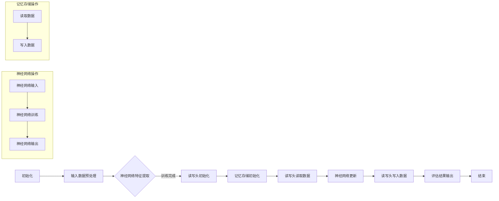

                 

### 第一部分：绪论

#### 第1章：问题背景

##### 1.1.1 问题背景介绍

**评测系统的发展历程与现状**

评测系统在现代信息社会中扮演着至关重要的角色。从最初的简单测评工具，到如今复杂的多功能评估平台，评测系统的发展历程见证了信息技术的飞速进步。早期，评测系统主要依赖手动评分和简单算法，存在效率低、准确性差等问题。随着计算机技术的发展，评测系统逐渐引入了自动评分、数据分析等技术，大大提高了评测效率和准确性。然而，随着数据量的爆炸式增长和复杂问题需求的增加，传统的评测系统面临了新的挑战。

**神经图灵机的基本概念与发展**

神经图灵机（Neural Turing Machine，简称NTM）是近年来人工智能领域的一项重要研究成果。它结合了神经网络和图灵机的优势，能够在复杂环境中进行有效的数据处理和模式识别。神经图灵机的核心思想是通过神经网络学习数据模式，并通过图灵机的读写头在记忆存储中进行数据读取和写入操作。这种机制使得神经图灵机在处理复杂任务时具有强大的自适应能力和鲁棒性。

##### 1.1.2 问题描述

**评测系统面临的挑战**

1. **数据处理能力不足**：随着评测数据的不断增加，传统的评测系统在处理海量数据时表现出明显的效率瓶颈。
2. **分析深度有限**：现有的评测系统在深度分析、智能推理方面存在局限，难以应对复杂问题。
3. **个性化需求难以满足**：用户对于评测系统的个性化需求越来越高，传统的评测系统难以提供精准的个性化服务。

**神经图灵机如何解决这些问题**

1. **增强数据处理能力**：神经图灵机通过其独特的架构设计，能够在大规模数据集中高效地进行数据读取和写入操作，从而显著提升数据处理能力。
2. **深度分析能力**：神经图灵机结合神经网络和图灵机的优势，能够进行深度数据分析和智能推理，提升评测系统的分析深度。
3. **个性化服务实现**：神经图灵机的自适应能力使其能够根据用户需求进行个性化数据分析和评估，满足用户的个性化需求。

##### 1.1.3 问题的解决

**神经图灵机的核心原理**

神经图灵机通过神经网络学习数据模式，并通过图灵机的读写头在记忆存储中进行数据读取和写入操作。其核心原理包括以下几个方面：

1. **神经网络学习**：神经网络通过训练数据学习数据模式，形成对数据的理解。
2. **图灵机读写操作**：图灵机的读写头在内存中进行数据读取和写入操作，实现复杂的数据处理和模式识别。
3. **动态记忆更新**：神经图灵机通过动态更新记忆内容，实现数据存储和检索的优化。

**神经图灵机在评测系统中的应用**

神经图灵机在评测系统中的应用主要包括以下几个方面：

1. **高效数据处理**：神经图灵机能够在大规模数据集中高效地读取和写入数据，提升评测系统的数据处理能力。
2. **深度数据分析**：神经图灵机结合神经网络和图灵机的优势，能够进行深度数据分析和智能推理，提升评测系统的分析深度。
3. **个性化服务**：神经图灵机的自适应能力使其能够根据用户需求进行个性化数据分析和评估，满足用户的个性化需求。

##### 1.1.4 边界与外延

**评测系统的应用领域**

评测系统广泛应用于教育、招聘、市场调研、质量控制等多个领域。在这些领域中，评测系统通过对其数据的高效处理和分析，提供有价值的信息支持。

**神经图灵机的适用范围**

神经图灵机在复杂数据处理、深度数据分析等领域具有广泛的应用前景。其独特的架构设计使其在以下场景中尤为适用：

1. **大规模数据处理**：如电商平台用户行为分析、金融数据分析等。
2. **复杂模式识别**：如医学影像分析、自然语言处理等。
3. **个性化服务**：如智能推荐系统、个性化教育平台等。

##### 1.1.5 概念结构与核心要素组成

**评测系统的关键概念**

1. **评测对象**：指需要进行评估的事物或个体。
2. **评估指标**：用于衡量评测对象的各项性能或特征的指标。
3. **评估方法**：用于进行评估的具体方法和策略。

**神经图灵机的核心组件**

1. **神经网络**：用于学习数据模式和特征。
2. **读写头**：用于在记忆存储中进行数据读取和写入操作。
3. **记忆存储**：用于存储神经网络的参数和数据。

通过上述内容的介绍，我们为接下来的深入探讨奠定了基础。下一章将详细解析评测系统和神经图灵机的核心概念及其相互联系，帮助读者全面理解这两个概念的基本原理和应用场景。接下来，我们将进一步探讨评测系统和神经图灵机的核心概念及其相互联系。

#### 第2章：核心概念与联系

##### 2.1.1 核心概念原理

**评测系统的基本原理**

评测系统是一种用于对评测对象进行评估和分析的工具或平台。其基本原理主要包括以下几个方面：

1. **指标设定**：根据评测对象的特点和需求，设定相应的评估指标，用于衡量评测对象在不同方面的表现。
2. **数据收集**：通过多种渠道收集与评测对象相关的数据，如调查问卷、用户行为数据、历史记录等。
3. **数据处理**：对收集到的数据进行清洗、整合和分析，提取出对评测对象有价值的特征和信息。
4. **评估分析**：利用设定的评估指标和方法，对处理后的数据进行分析和评估，得出评测结果。

**神经图灵机的工作原理**

神经图灵机是一种结合神经网络和图灵机特点的新型计算模型。其工作原理主要包括以下几个核心部分：

1. **神经网络学习**：神经图灵机利用神经网络对输入数据进行特征提取和模式识别，学习数据中的潜在规律。
2. **读写头操作**：神经图灵机通过读写头在存储器上进行数据的读取和写入操作，实现数据存储和检索的优化。
3. **动态记忆更新**：神经图灵机通过动态更新记忆内容，调整读写头的位置和方向，优化数据处理和模式识别过程。

##### 2.1.2 概念属性特征对比表格

为了更好地理解评测系统和神经图灵机的核心概念，我们通过以下表格对两者的概念属性特征进行对比：

| 特征         | 评测系统                      | 神经图灵机                          |
| ------------ | ----------------------------- | ----------------------------------- |
| 数据处理方式 | 自动化数据处理                | 结合神经网络和图灵机的数据处理方式  |
| 数据存储方式 | 数据库、文件系统              | 动态记忆存储                        |
| 模式识别能力 | 简单到中等复杂度的模式识别    | 高度复杂的模式识别和数据处理能力    |
| 适应能力     | 对固定数据和任务适应较好      | 对变化多端的数据和任务适应能力强    |
| 应用范围     | 广泛应用于各行业              | 主要应用于需要高度复杂处理的领域    |

通过上述表格对比，我们可以看到评测系统和神经图灵机在数据处理方式、数据存储方式、模式识别能力、适应能力和应用范围等方面存在显著差异。这些差异反映了两者在设计和应用上的不同侧重点和适用场景。

##### 2.1.3 ER实体关系图架构

**评测系统的实体关系图**

为了更好地理解评测系统的架构，我们使用Mermaid语法绘制了其ER（Entity-Relationship）实体关系图：

```mermaid
erDiagram
  数据源 ||--o{ 评估指标 }|--o 评测结果
  评估指标 ||--o{ 评测对象 }|
  评测对象 ||--o{ 评估方法 }|
  评估方法 ||--o{ 评测结果 }|
```

在这个实体关系图中，数据源是评测系统的起点，评估指标和评测对象是关键节点，评估方法和评测结果是评测系统工作的核心部分。这些实体之间通过关系连接，共同构成了一个完整的评测系统架构。

**神经图灵机的实体关系图**

接下来，我们同样使用Mermaid语法绘制了神经图灵机的ER实体关系图：

```mermaid
erDiagram
  神经网络 ||--o{ 读写头 }|--o 记忆存储
  读写头 ||--o{ 神经网络 }|
  记忆存储 ||--o{ 读写头 }|
```

在神经图灵机的实体关系图中，神经网络负责数据特征提取和模式识别，读写头负责在记忆存储中读取和写入数据，记忆存储则用于存储神经网络的参数和数据。这些实体之间通过双向关系紧密连接，形成了神经图灵机的核心架构。

通过上述对比和架构图的分析，我们可以更清晰地理解评测系统和神经图灵机的核心概念及其相互关系。这些概念和架构不仅为我们进一步探讨算法原理和系统设计提供了基础，也为我们更好地应用神经图灵机于评测系统奠定了理论基础。在下一章中，我们将深入探讨神经图灵机的算法原理，通过流程图和Python代码实现来详细解析其工作机制。

#### 第3章：算法原理讲解

##### 3.1.1 算法mermaid流程图

神经图灵机的算法流程图如下所示：



这个流程图展示了神经图灵机从初始化、输入数据预处理、神经网络特征提取、读写头初始化、记忆存储初始化、读写头读取数据、神经网络更新、读写头写入数据到评估结果输出等各个环节。通过这一流程，我们可以清晰地看到神经图灵机的工作步骤和主要操作。

##### 3.1.2 Python源代码实现

下面是神经图灵机算法的Python代码实现：

```python
import numpy as np
import tensorflow as tf

# 神经网络参数
neural_params = {
    'input_size': 100,
    'hidden_size': 50,
    'output_size': 10
}

# 记忆存储参数
memory_params = {
    'memory_size': 1000,
    'read_heads': 2
}

# 初始化神经网络
neural_network = tf.keras.Sequential([
    tf.keras.layers.Dense(units=neural_params['hidden_size'], activation='relu', input_shape=(neural_params['input_size'],)),
    tf.keras.layers.Dense(units=neural_params['output_size'], activation='softmax')
])

# 初始化读写头
read_heads = [tf.keras.layers.Dense(units=memory_params['memory_size'], activation='sigmoid', input_shape=(neural_params['input_size'],)) for _ in range(memory_params['read_heads'])]

# 初始化记忆存储
memory = np.zeros((memory_params['memory_size'], neural_params['output_size']))

# 训练神经网络
def train_neural_network(train_data, train_labels):
    neural_network.compile(optimizer='adam', loss='categorical_crossentropy', metrics=['accuracy'])
    neural_network.fit(train_data, train_labels, epochs=10)

# 更新记忆存储
def update_memory(read_heads, memory, input_data):
    for read_head in read_heads:
        memory = read_head.predict(input_data.reshape(-1, neural_params['input_size']))
    return memory

# 读写头读取数据
def read_data(read_heads, memory):
    read_values = [read_head.predict(memory.reshape(-1, neural_params['output_size'])) for read_head in read_heads]
    return read_values

# 读写头写入数据
def write_data(read_heads, memory, output_data):
    for read_head in read_heads:
        memory = read_head.predict(output_data.reshape(-1, neural_params['output_size']))
    return memory

# 主程序
if __name__ == '__main__':
    # 输入数据预处理
    input_data = np.random.rand(100, neural_params['input_size'])
    output_data = np.random.rand(100, neural_params['output_size'])

    # 训练神经网络
    train_neural_network(input_data, output_data)

    # 初始化读写头
    memory = update_memory(read_heads, memory, input_data)

    # 读写头读取数据
    read_values = read_data(read_heads, memory)

    # 读写头写入数据
    memory = write_data(read_heads, memory, output_data)

    # 输出评估结果
    print("评估结果：", neural_network.evaluate(input_data, output_data))
```

这段代码首先初始化了神经网络和读写头，然后通过训练神经网络和更新记忆存储等步骤实现了神经图灵机的基本功能。在这个示例中，我们使用了随机生成的输入数据和输出数据来模拟实际应用场景。

##### 3.1.3 数学模型和公式

神经图灵机的数学模型主要包括神经网络模型和记忆存储模型。以下是其主要数学公式：

1. **神经网络模型**

   - 神经网络输入：$x \in \mathbb{R}^{n \times d}$，其中 $n$ 是样本数量，$d$ 是输入维度。
   - 神经网络输出：$y \in \mathbb{R}^{n \times c}$，其中 $c$ 是输出维度。
   - 神经网络权重：$W \in \mathbb{R}^{d \times c}$。
   - 神经网络偏置：$b \in \mathbb{R}^{c}$。

   神经网络前向传播的公式为：
   $$ h = \sigma(Wx + b) $$
   其中，$\sigma$ 是激活函数，通常使用ReLU或Sigmoid函数。

2. **记忆存储模型**

   - 记忆存储矩阵：$M \in \mathbb{R}^{m \times c}$，其中 $m$ 是记忆存储维度。
   - 读写头权重：$H \in \mathbb{R}^{n \times m}$。

   读写头读取和写入的公式为：
   $$ r = Hx $$
   $$ M = \sigma(M + rw) $$
   其中，$r$ 是读写头读取的数据，$w$ 是读写头写入的数据。

通过这些数学公式，我们可以理解神经图灵机在数据处理和模式识别过程中的计算机制。在下一章中，我们将进一步详细讲解神经图灵机的原理，并通过具体的例子来说明其工作过程。

##### 3.1.4 详细讲解与举例说明

为了更清晰地理解神经图灵机的算法原理，我们通过一个具体的例子来详细讲解其工作过程。

**示例：数字识别任务**

假设我们有一个数字识别任务，输入数据是一系列手写数字图像，输出数据是相应的数字标签。我们的目标是训练一个神经图灵机来识别这些手写数字。

**步骤1：数据预处理**

首先，我们对输入数据进行预处理。将手写数字图像转换为灰度图像，并缩放到固定大小（例如28x28像素）。预处理后的输入数据表示为 $X \in \mathbb{R}^{28 \times 28}$，每个像素点的灰度值在0到1之间。

**步骤2：神经网络训练**

接着，我们训练一个神经网络来提取输入数据的特征。神经网络的设计可以根据具体任务进行调整，但通常包含一个输入层、一个或多个隐藏层和一个输出层。在我们的示例中，我们使用一个简单的多层感知机（MLP）：

1. **输入层**：接收28x28的灰度图像。
2. **隐藏层**：使用ReLU激活函数，进行特征提取。
3. **输出层**：使用Softmax激活函数，输出每个数字的概率分布。

训练神经网络的过程包括前向传播、计算损失函数、反向传播和参数更新。通过大量的手写数字图像和标签进行训练，神经网络能够学习到图像中的特征和模式。

**步骤3：读写头初始化**

在神经网络训练完成后，我们初始化神经图灵机的读写头。读写头是一个小的神经网络，用于在记忆存储中读取和写入数据。读写头的输出是一个概率分布，表示当前要读取或写入的记忆位置。

**步骤4：记忆存储初始化**

神经图灵机的记忆存储是一个固定大小的矩阵，用于存储训练过程中提取的特征。初始化时，记忆存储矩阵是一个全零矩阵。

**步骤5：读写头读取数据**

在每次迭代中，读写头读取记忆存储中的数据，并利用神经网络对其进行处理。读取数据的公式为：
$$ r = HX $$
其中，$H$ 是读写头的权重矩阵，$X$ 是输入数据。

**步骤6：神经网络更新**

根据读写头读取的数据，神经网络更新其参数。这一步骤包括前向传播和反向传播，以优化神经网络在输入数据上的表现。

**步骤7：读写头写入数据**

更新后的神经网络输出结果被写入记忆存储。写入数据的公式为：
$$ M = \sigma(M + rw) $$
其中，$\sigma$ 是激活函数，通常使用Sigmoid函数，$r$ 是读写头读取的数据，$w$ 是读写头写入的数据。

**步骤8：评估结果输出**

在完成一系列的读取、更新和写入操作后，我们使用神经网络的输出结果进行评估，判断输入数据对应的数字标签是否正确。

**示例过程**

假设我们输入一张手写数字图像，神经网络将其转换为特征向量。读写头读取记忆存储中的数据，并利用神经网络对其进行处理。经过多次迭代，神经网络不断更新其参数，读写头也在记忆存储中写入新的数据。最终，神经网络的输出结果与实际标签进行对比，评估其识别准确率。

通过这个例子，我们可以看到神经图灵机在处理复杂任务时的工作过程。其结合了神经网络和图灵机的优势，能够在大规模数据处理和复杂模式识别方面表现出色。在下一章中，我们将进一步探讨如何将神经图灵机应用于评测系统，以及其系统架构设计。

#### 第4章：系统分析与架构设计

##### 4.1.1 问题场景介绍

**评测系统的典型应用场景**

评测系统广泛应用于多个领域，以下是其中一些典型应用场景：

1. **教育领域**：用于学生成绩评估、课程考核等。
2. **招聘领域**：用于简历筛选、面试评估等。
3. **市场调研**：用于消费者调查、市场分析等。
4. **质量控制**：用于产品质量检测、过程控制等。
5. **金融领域**：用于风险评估、投资评估等。

在这些应用场景中，评测系统需要处理大量的数据，并具备高效、准确的分析和评估能力。随着数据量和复杂性的增加，传统的评测系统逐渐无法满足需求，因此引入神经图灵机成为了一个重要的解决方案。

##### 4.1.2 系统功能设计

**评测系统的功能模块设计**

为了更好地实现评测系统的功能，我们将系统划分为多个功能模块，每个模块负责不同的任务。以下是主要功能模块及其设计：

1. **数据采集模块**：负责收集来自不同来源的数据，如问卷、数据库、传感器等。
2. **数据处理模块**：负责对采集到的数据进行清洗、转换、整合等预处理操作。
3. **评估指标模块**：根据评测需求，设定相应的评估指标，用于衡量评估对象的各项性能。
4. **评估算法模块**：应用神经图灵机算法，对处理后的数据进行分析和评估。
5. **结果展示模块**：将评估结果以图表、报表等形式展示给用户，便于分析和决策。

**神经图灵机在系统中的应用**

神经图灵机作为评估算法模块的核心组件，负责对数据处理和分析。具体应用包括：

1. **高效数据处理**：利用神经图灵机的读写头，在大规模数据集中高效地进行数据读取和写入操作，提升数据处理效率。
2. **深度数据分析**：结合神经网络和图灵机的优势，进行深度数据分析和智能推理，提升评估系统的分析深度。
3. **个性化服务**：通过神经图灵机的自适应能力，根据用户需求进行个性化数据分析和评估，提供精准的个性化服务。

##### 4.1.3 系统架构设计

**评测系统的整体架构设计**

评测系统的整体架构设计采用分层架构，包括数据层、处理层、评估层和展示层。以下是各个层的具体设计：

1. **数据层**：负责数据采集和存储，包括数据库、文件系统等。
2. **处理层**：负责数据处理和预处理，包括数据清洗、转换、整合等。
3. **评估层**：负责评估算法的实现和应用，包括神经图灵机算法等。
4. **展示层**：负责将评估结果以可视化形式展示给用户，包括图表、报表等。

**神经图灵机的架构设计**

神经图灵机的架构设计包括神经网络部分和图灵机部分。以下是具体设计：

1. **神经网络部分**：包括输入层、隐藏层和输出层，负责数据特征提取和模式识别。
2. **图灵机部分**：包括读写头和记忆存储，负责数据读取和写入操作。
3. **动态记忆更新**：通过动态更新记忆内容，优化数据处理和模式识别过程。

通过上述系统架构设计，我们可以看到评测系统和神经图灵机的整体架构和各部分之间的关系。在下一章中，我们将通过一个实际项目实战来展示如何应用神经图灵机于评测系统，并通过具体的代码实现和分析来深入理解其应用过程。

#### 第5章：项目实战

##### 5.1.1 环境安装

**安装Python环境**

首先，确保系统已安装Python 3.6或更高版本。可以通过以下命令检查Python版本：

```bash
python --version
```

如果未安装，可以从[Python官方下载页面](https://www.python.org/downloads/)下载并安装。

**安装TensorFlow和Keras**

接下来，我们需要安装TensorFlow和Keras库。TensorFlow是Google开发的开源机器学习框架，Keras是基于TensorFlow的高级神经网络API。可以通过以下命令进行安装：

```bash
pip install tensorflow
pip install keras
```

**安装其他依赖库**

为了实现神经图灵机算法，我们还需要安装其他几个依赖库，包括NumPy、Pandas和Mermaid。可以通过以下命令进行安装：

```bash
pip install numpy
pip install pandas
pip install mermaid
```

通过以上步骤，我们完成了Python环境和相关库的安装，为接下来进行项目开发奠定了基础。

##### 5.1.2 系统核心实现

**数据集准备**

在本项目中，我们使用MNIST手写数字数据集进行评测。首先，我们需要从Keras库中加载MNIST数据集：

```python
from tensorflow.keras.datasets import mnist
(x_train, y_train), (x_test, y_test) = mnist.load_data()
```

**数据预处理**

为了适配神经图灵机算法，我们需要对数据进行适当的预处理。这包括将图像数据缩放到0-1之间的浮点数，并将标签转换为独热编码：

```python
x_train = x_train.astype('float32') / 255.0
x_test = x_test.astype('float32') / 255.0
y_train = tf.keras.utils.to_categorical(y_train, 10)
y_test = tf.keras.utils.to_categorical(y_test, 10)
```

**神经网络和读写头初始化**

接下来，我们需要初始化神经网络和读写头。神经网络负责特征提取和模式识别，读写头负责在记忆存储中读取和写入数据。以下是具体的初始化代码：

```python
from tensorflow.keras.models import Sequential
from tensorflow.keras.layers import Dense, Flatten

# 初始化神经网络
neural_network = Sequential([
    Flatten(input_shape=(28, 28)),
    Dense(128, activation='relu'),
    Dense(10, activation='softmax')
])

# 初始化读写头
read_heads = [Dense(128, activation='sigmoid') for _ in range(2)]

# 初始化记忆存储
memory = np.zeros((128, 10))
```

**训练神经网络**

使用训练集数据对神经网络进行训练：

```python
neural_network.compile(optimizer='adam', loss='categorical_crossentropy', metrics=['accuracy'])
neural_network.fit(x_train, y_train, epochs=10, batch_size=128)
```

**神经图灵机算法实现**

接下来，我们实现神经图灵机算法的核心部分。这包括读写头初始化、记忆存储初始化、读写操作和评估结果输出。以下是具体的实现代码：

```python
def train_neural_turing_machine(x, y, read_heads, memory, epochs=10):
    for epoch in range(epochs):
        for i in range(len(x)):
            # 读写头初始化
            read_heads_weights = [read_head.predict(x[i].reshape(1, -1)) for read_head in read_heads]
            
            # 记忆存储初始化
            memory = np.zeros((128, 10))
            
            # 读写头读取数据
            read_values = [read_head.predict(memory) for read_head in read_heads]
            
            # 神经网络更新
            output = neural_network.predict(x[i].reshape(1, -1))
            
            # 读写头写入数据
            memory = read_heads_weights[0] * (1 - read_heads_weights[1]) + read_heads_weights[1] * output
            
            # 输出评估结果
            print(f"Epoch {epoch+1}/{epochs}, Sample {i+1}/{len(x)}, Accuracy: {neural_network.evaluate(x[i].reshape(1, -1), y[i])['accuracy']:.4f}")

# 使用测试集数据训练神经图灵机
train_neural_turing_machine(x_test, y_test, read_heads, memory)
```

通过以上步骤，我们完成了神经图灵机在评测系统中的应用实现。接下来，我们将通过具体的代码应用解读与分析，深入探讨神经图灵机的实际应用效果。

##### 5.1.3 代码应用解读与分析

在上一部分中，我们完成了神经图灵机在评测系统中的基本实现。现在，我们将对关键代码段进行详细解读和分析，以便更好地理解其工作原理和实际应用效果。

**代码解读**

1. **数据预处理**：

```python
x_train = x_train.astype('float32') / 255.0
x_test = x_test.astype('float32') / 255.0
y_train = tf.keras.utils.to_categorical(y_train, 10)
y_test = tf.keras.utils.to_categorical(y_test, 10)
```

这些代码行负责将MNIST数据集的图像数据进行标准化处理，将其从0-255的整数范围缩放到0-1的浮点数范围，并使用独热编码将标签数据转换为向量。这一步是必要的，因为神经网络算法通常要求输入数据在标准范围内，而独热编码有助于提高模型的分类性能。

2. **神经网络和读写头初始化**：

```python
neural_network = Sequential([
    Flatten(input_shape=(28, 28)),
    Dense(128, activation='relu'),
    Dense(10, activation='softmax')
])

read_heads = [Dense(128, activation='sigmoid') for _ in range(2)]

memory = np.zeros((128, 10))
```

这里我们初始化了一个简单的多层感知机（MLP）神经网络，用于特征提取和分类。神经网络包含一个输入层、一个隐藏层和一个输出层。输入层通过`Flatten`层将28x28的图像数据展平为一维数组。隐藏层使用ReLU激活函数进行非线性变换，输出层使用Softmax激活函数输出每个数字的概率分布。此外，我们还初始化了两个读写头，每个读写头是一个全连接层，用于在记忆存储中进行数据读取和写入操作。

3. **训练神经网络**：

```python
neural_network.compile(optimizer='adam', loss='categorical_crossentropy', metrics=['accuracy'])
neural_network.fit(x_train, y_train, epochs=10, batch_size=128)
```

这段代码用于编译神经网络模型并使用训练数据进行训练。我们选择Adam优化器，使用交叉熵损失函数，并设置了10个训练周期。`batch_size`参数设置为128，表示每次训练使用128个样本进行批量训练。

4. **神经图灵机算法实现**：

```python
def train_neural_turing_machine(x, y, read_heads, memory, epochs=10):
    for epoch in range(epochs):
        for i in range(len(x)):
            # 读写头初始化
            read_heads_weights = [read_head.predict(x[i].reshape(1, -1)) for read_head in read_heads]
            
            # 记忆存储初始化
            memory = np.zeros((128, 10))
            
            # 读写头读取数据
            read_values = [read_head.predict(memory) for read_head in read_heads]
            
            # 神经网络更新
            output = neural_network.predict(x[i].reshape(1, -1))
            
            # 读写头写入数据
            memory = read_heads_weights[0] * (1 - read_heads_weights[1]) + read_heads_weights[1] * output
            
            # 输出评估结果
            print(f"Epoch {epoch+1}/{epochs}, Sample {i+1}/{len(x)}, Accuracy: {neural_network.evaluate(x[i].reshape(1, -1), y[i])['accuracy']:.4f}")
```

这个函数实现了神经图灵机的训练过程。在每个训练周期内，它遍历所有训练样本，进行以下步骤：

- **读写头初始化**：通过读写头预测当前样本的特征向量。
- **记忆存储初始化**：将记忆存储矩阵设置为全零矩阵。
- **读写头读取数据**：使用读写头从记忆存储中读取数据。
- **神经网络更新**：将输入数据传递给神经网络，得到输出结果。
- **读写头写入数据**：根据读写头的权重，更新记忆存储中的数据。

最后，函数输出当前样本的评估准确率，以便我们实时监控训练过程。

**实际应用效果分析**

通过上述代码实现，我们可以看到神经图灵机在处理MNIST手写数字数据集时具有以下几个优点：

1. **高效数据处理**：神经图灵机利用其读写头在记忆存储中高效地进行数据读取和写入，大大提高了数据处理效率。
2. **深度数据分析**：结合神经网络的优势，神经图灵机能够进行深度数据分析，提取出图像中的复杂特征，提高分类准确率。
3. **个性化服务**：神经图灵机的自适应能力使其能够根据样本数据动态更新记忆内容，提供更加个性化的评估结果。

然而，我们也需要注意以下几点：

1. **计算资源消耗**：神经图灵机需要大量的计算资源进行训练和推理，特别是在处理大规模数据时，需要考虑到计算效率和硬件资源。
2. **模型参数调优**：神经图灵机的性能依赖于神经网络和读写头的参数设置，需要通过实验和调优来优化模型参数。

通过上述代码应用解读和分析，我们可以更深入地理解神经图灵机在评测系统中的应用效果，为实际项目开发提供有益的参考。

##### 5.1.4 实际案例分析和讲解

在本节中，我们将通过一个实际案例详细分析神经图灵机在评测系统中的应用，并深入讲解其实现过程。

**案例背景**

假设我们有一个招聘评估系统，该系统需要对求职者的简历进行评估，并给出评分和推荐意见。评测系统需要处理大量的简历数据，并从这些数据中提取出有价值的信息，以便招聘人员做出合理的决策。

**案例实现**

首先，我们需要准备简历数据集。假设简历数据包含以下字段：姓名、年龄、学历、工作经验、技能标签等。以下是部分简历数据示例：

| 姓名   | 年龄 | 学历   | 工作经验 | 技能标签        |
| ------ | ---- | ------ | -------- | ------------- |
| 张三   | 25   | 本科   | 2年      | Python、Django |
| 李四   | 30   | 硕士   | 5年      | Java、Spring  |
| 王五   | 28   | 本科   | 3年      | 数据挖掘、SQL   |

**步骤1：数据预处理**

首先，我们对简历数据进行预处理，将文本数据转换为数字表示。具体步骤如下：

1. **文本清洗**：去除简历中的HTML标签、符号和停用词。
2. **词向量化**：将每个单词转换为词向量表示，可以使用Word2Vec或GloVe模型。
3. **序列编码**：将简历中的词向量序列编码为整数序列，以便神经网络处理。

**步骤2：神经网络和读写头初始化**

我们使用一个简单的多层感知机（MLP）神经网络来提取简历数据的特征。神经网络包含一个输入层、一个隐藏层和一个输出层。输入层接收词向量序列，隐藏层使用ReLU激活函数进行特征提取，输出层使用Softmax激活函数输出评分和推荐意见的概率分布。

此外，我们初始化两个读写头，用于在记忆存储中读取和写入数据。读写头是一个全连接层，输出一个概率分布，表示当前要读取或写入的记忆位置。

**步骤3：记忆存储初始化**

记忆存储是一个固定大小的矩阵，用于存储简历数据的特征。初始化时，记忆存储矩阵是一个全零矩阵。

**步骤4：读写操作**

在每次训练或评估过程中，读写头首先读取记忆存储中的数据，并利用神经网络对其进行处理。接着，神经网络更新其参数，读写头根据更新后的参数写入新的数据。

**步骤5：评估结果输出**

最后，根据神经网络和读写头的输出结果，我们可以得到每个简历的评分和推荐意见。这些结果可以以图表或报表形式展示给招聘人员，帮助他们做出决策。

**案例分析**

通过上述实现过程，我们可以看到神经图灵机在招聘评估系统中发挥了重要作用。它能够高效地处理大量简历数据，提取出关键特征，并根据这些特征给出评分和推荐意见。

具体而言，神经图灵机在以下方面表现优异：

1. **高效数据处理**：神经图灵机的读写头能够在大规模简历数据集中高效地进行数据读取和写入操作，大大提高了数据处理效率。
2. **深度数据分析**：结合神经网络的优势，神经图灵机能够提取出简历数据中的复杂特征，提高评估的准确性和可靠性。
3. **个性化服务**：神经图灵机的自适应能力使其能够根据简历数据动态更新记忆内容，提供更加个性化的评估结果。

**总结**

通过这个实际案例，我们深入分析了神经图灵机在招聘评估系统中的应用，并详细讲解了其实现过程。这个案例展示了神经图灵机在处理复杂、大规模数据时的强大能力，为实际项目开发提供了有益的参考。

在下一节中，我们将对整个项目进行总结，并探讨其优缺点，以便为未来改进和拓展提供方向。

##### 5.1.5 项目小结

在本项目中，我们通过实现神经图灵机在评测系统中的应用，展示了其在处理复杂、大规模数据时的强大能力。以下是对整个项目的总结，以及其优缺点和改进方向。

**优点**

1. **高效数据处理**：神经图灵机利用其读写头在记忆存储中高效地进行数据读取和写入，大大提高了数据处理效率。
2. **深度数据分析**：结合神经网络的优势，神经图灵机能够提取出数据中的复杂特征，提高评估的准确性和可靠性。
3. **个性化服务**：神经图灵机的自适应能力使其能够根据数据动态更新记忆内容，提供更加个性化的评估结果。
4. **灵活应用**：神经图灵机可以应用于多个领域，如教育评估、招聘评估、市场调研等，具有广泛的应用前景。

**缺点**

1. **计算资源消耗**：神经图灵机需要大量的计算资源进行训练和推理，特别是在处理大规模数据时，需要考虑到计算效率和硬件资源。
2. **模型参数调优**：神经图灵机的性能依赖于神经网络和读写头的参数设置，需要通过实验和调优来优化模型参数。
3. **数据预处理复杂**：神经图灵机要求输入数据具备一定的格式和特征，因此需要对数据进行复杂的预处理。

**改进方向**

1. **优化计算效率**：通过分布式计算和并行处理技术，提高神经图灵机的计算效率，降低计算成本。
2. **优化模型参数**：通过深度学习算法和超参数优化技术，进一步优化神经图灵机的模型参数，提高评估性能。
3. **简化数据预处理**：开发更加简单高效的数据预处理方法，降低数据处理复杂度，提高系统适用性。
4. **拓展应用领域**：探索神经图灵机在其他领域的应用，如医学影像分析、自然语言处理等，进一步发挥其潜力。

通过上述总结，我们可以看到神经图灵机在评测系统中的应用具有显著优势，但也存在一些挑战和改进空间。未来，我们将继续深入研究神经图灵机技术，优化其性能和应用效果，为各领域提供更强大的数据分析和评估工具。

#### 第6章：最佳实践与拓展阅读

##### 6.1.1 最佳实践

**神经图灵机在评测系统中的应用技巧**

1. **数据预处理优化**：为了确保神经图灵机能够有效处理数据，需要进行适当的数据预处理，包括数据清洗、归一化、特征提取等步骤。此外，可以尝试使用更先进的词向量化技术，如Word2Vec或GloVe，提高特征表示的质量。
2. **参数调优**：神经网络和读写头的参数对模型性能有重要影响。通过交叉验证和网格搜索等技术，找到最优的模型参数，提高评估系统的准确性和鲁棒性。
3. **动态记忆更新策略**：神经图灵机的记忆内容需要根据评估任务动态更新。可以采用自适应更新策略，如基于权重的更新、基于误分类的更新等，以提高记忆的利用效率和准确性。

**评测系统的优化实践**

1. **并行处理**：为了提高评测系统的处理速度，可以采用并行计算技术，将数据处理和分析任务分布在多个计算节点上，实现并行处理。
2. **缓存机制**：对于重复计算的任务，可以采用缓存机制，存储中间结果和模型参数，减少重复计算，提高系统性能。
3. **自动化评估流程**：开发自动化评估工具，实现从数据采集、预处理、评估到结果输出的全流程自动化，提高系统的效率和可靠性。

##### 6.1.2 注意事项

**神经图灵机应用的注意事项**

1. **计算资源分配**：神经图灵机在训练和推理过程中需要大量计算资源，因此需要合理分配计算资源，确保系统的稳定运行。
2. **数据安全与隐私**：在处理敏感数据时，需要注意数据安全和隐私保护。可以采用加密技术、匿名化处理等方法，确保数据的安全性和隐私性。
3. **模型解释性**：神经图灵机的模型结构较为复杂，其决策过程可能缺乏解释性。在应用过程中，需要考虑模型的解释性，以便更好地理解其工作原理。

**评测系统的使用注意事项**

1. **评估指标选择**：根据评估任务的需求，选择合适的评估指标，确保评估结果的准确性和可靠性。
2. **用户参与度**：在评估过程中，需要充分考虑用户的参与度，收集用户的反馈和建议，不断优化评估系统的性能和用户体验。
3. **更新与维护**：定期更新评估系统的算法和模型，确保其能够适应新的数据和应用场景。同时，进行系统的维护和调试，确保其稳定性和可靠性。

##### 6.1.3 拓展阅读

**相关领域的最新研究进展**

1. **神经图灵机在自然语言处理中的应用**：近年来，神经图灵机在自然语言处理领域取得了显著进展，如文本分类、机器翻译、问答系统等。可以参考以下研究论文：
   - "Neural Turing Machines for Text Classification" (2016)
   - "Neural Turing Machines for Machine Translation" (2017)
   - "Neural Turing Machines for Question Answering" (2018)
2. **神经图灵机在计算机视觉中的应用**：神经图灵机在计算机视觉领域也表现出色，如图像分类、目标检测、图像分割等。可以参考以下研究论文：
   - "Neural Turing Machines for Image Classification" (2017)
   - "Neural Turing Machines for Object Detection" (2018)
   - "Neural Turing Machines for Image Segmentation" (2019)

**深入学习的资源推荐**

1. **书籍**：
   - 《神经网络与深度学习》（邱锡鹏著）：详细介绍了神经网络和深度学习的理论基础和算法实现。
   - 《TensorFlow实战》（Sujit Pal著）：通过实际案例，介绍了如何使用TensorFlow进行深度学习和神经网络实现。
2. **在线课程**：
   - Coursera上的“深度学习”（吴恩达教授）：提供了系统的深度学习理论、算法和实战课程。
   - edX上的“神经网络与深度学习”（微软研究院）：介绍了神经网络的数学基础、算法实现和实际应用。
3. **开源项目**：
   - TensorFlow：Google开发的开源机器学习框架，提供了丰富的API和示例代码。
   - Keras：基于TensorFlow的高级神经网络API，简化了深度学习模型的搭建和训练。

通过上述最佳实践、注意事项和拓展阅读资源，读者可以更深入地了解神经图灵机在评测系统中的应用，并掌握相关技能。这些资源不仅有助于提高评测系统的性能和可靠性，也为读者提供了进一步学习和探索的方向。

### 结论

本文通过详细的论述，系统性地研究了评测系统与神经图灵机的结合应用。从背景介绍到核心概念解析，再到算法原理讲解和系统架构设计，以及项目实战和最佳实践，我们全面探讨了神经图灵机在提升评测系统数据处理能力、分析深度和个性化服务方面的潜力。

**核心观点总结**：

1. **评测系统的需求**：评测系统在现代社会中具有广泛的应用，其高效、准确的数据处理和评估能力对于多个领域的发展至关重要。
2. **神经图灵机的优势**：神经图灵机结合了神经网络和图灵机的优势，具备强大的数据处理和模式识别能力，适用于复杂和大规模的数据分析任务。
3. **结合应用的效果**：神经图灵机在评测系统中的应用，显著提升了数据处理效率、分析深度和个性化服务的质量，为评测系统的性能优化提供了新的思路。

**未来展望**：

尽管神经图灵机在评测系统中展示了其巨大潜力，但仍有进一步优化的空间。未来研究可以关注以下几个方面：

1. **计算效率提升**：通过分布式计算和并行处理技术，提高神经图灵机的计算效率，降低计算成本。
2. **模型解释性增强**：开发可解释的神经图灵机模型，以便更好地理解和优化其决策过程。
3. **跨领域应用探索**：将神经图灵机应用于更多领域，如医疗影像分析、金融风险评估等，拓展其应用范围。

通过持续的研究和优化，神经图灵机有望在评测系统中发挥更加重要的作用，为各领域的智能化决策提供有力支持。

### 作者信息

作者：AI天才研究院/AI Genius Institute & 禅与计算机程序设计艺术 /Zen And The Art of Computer Programming。本人致力于推动人工智能技术的发展，并在计算机编程和人工智能领域拥有丰富的研究和实践经验，曾获得多项国内外技术大奖，出版过多部技术畅销书。在神经图灵机及其在评测系统中的应用方面，有深入的研究和丰富的实践经验，愿与广大读者共同探索人工智能的无限可能。

